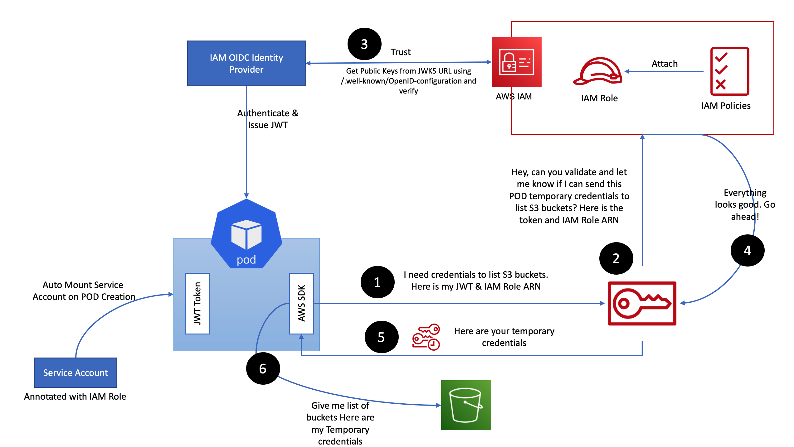

---
## IRSA

---
### 개념

IRSA(IAM Roles for Service Accounts)는 **EKS의 특정 Kubernetes ServiceAccount에 AWS IAM Role을 연결하여, 해당 ServiceAccount를 사용하는 Pod가 AWS 리소스에 접근할 수 있게 하는 방식**이다.

쉽게 말하면,

> **Pod마다 필요한 AWS 권한을 부여하기 위한 방식이다.**

예를 들어 EKS에서 실행 중인 애플리케이션이 S3에 접근해야 한다고 해보자.

```text
Pod
 ↓
S3 Bucket
```

S3는 AWS 리소스이기 때문에 아무 Pod나 접근할 수 있는 것이 아니라 AWS IAM 인증이 필요하다.

이때 Pod가 사용할 수 있는 AWS Access Key를 직접 넣어줄 수도 있다.

```text
Pod
 └─ AWS_ACCESS_KEY_ID
 └─ AWS_SECRET_ACCESS_KEY
```

하지만 Access Key를 Secret이나 환경변수로 직접 관리하면 키의 저장, 배포, 교체 등을 직접 관리해야 한다.

IRSA를 사용하면 이러한 장기 Access Key를 Pod에 직접 넣지 않고,

```text
Pod
 ↓
ServiceAccount
 ↓
IAM Role
 ↓
AWS Resource
```

와 같은 구조로 AWS 권한을 사용할 수 있다.

---
### IRSA가 필요한 이유

EKS의 Worker Node 자체에도 IAM Role이 존재한다.

예를 들어 Worker Node가 다음 IAM Role을 가지고 있다고 해보자.

```text
Worker Node
 └─ Node IAM Role
      ├─ ECR 접근
      ├─ CloudWatch 접근
      └─ S3 접근
```

Pod는 Worker Node 위에서 실행되기 때문에 과거에는 애플리케이션이 Node의 IAM Role을 이용해 AWS API에 접근하는 방식이 사용되기도 했다.

하지만 이렇게 하면 문제가 있다.

```text
Worker Node
 ├─ Pod A → S3 필요
 ├─ Pod B → S3 필요 없음
 └─ Pod C → S3 필요 없음
```

Node IAM Role에 S3 권한을 주면 **Pod A 때문에 Node 전체에 S3 권한을 부여하게 되는 구조**가 된다.

즉, Pod별로 최소 권한을 적용하기 어렵다.

IRSA를 사용하면 다음과 같이 분리할 수 있다.

```text
Pod A
 └─ ServiceAccount A
      └─ IAM Role A
           └─ S3 접근 가능

Pod B
 └─ ServiceAccount B
      └─ AWS 권한 없음

Pod C
 └─ ServiceAccount C
      └─ AWS 권한 없음
```

따라서 필요한 Pod에만 필요한 AWS 권한을 줄 수 있다.

> [!tip] Service Account에 대한 개념은 다음 글을 참조
> - [Service Account](../../../01-Container/02-Kubernetes/01-Learning/04-Security/10-service-account.md)

---
## OIDC

---
### 개념

OIDC(OpenID Connect)는 **외부 시스템이 발급한 신원 정보를 다른 시스템이 신뢰하고 인증에 사용할 수 있도록 하는 표준 방식**이다.

IRSA에서는 Kubernetes와 AWS IAM이 서로 다른 인증 체계를 사용한다.

```text
Kubernetes
 └─ ServiceAccount

AWS
 └─ IAM Role
```

AWS 입장에서는 Kubernetes의 ServiceAccount를 기본적으로 알지 못한다.

예를 들어 Pod가 AWS에게 다음과 같이 주장한다고 해보자.

```text
"나는 app Namespace의 s3-reader ServiceAccount야.
그러니까 S3 Role을 사용할 수 있게 해줘."
```

ServiceAccount는 본인의 신원을 JWT로 증명하려고 한다. 그러나나, 이 JWT 토큰을 Pod가 AWS에 주장을 해도 AWS 입장에서는 이 말을 그대로 믿을 수 없다.

그래서 중간에 **신뢰할 수 있는 신원 증명 체계**가 필요하다.

EKS에서는 이를 위해 OIDC를 사용한다.

---
### OIDC Issuer

지금 위에서의 문제점은 바로 Pod가 JWT를 제시한다고 해도, 이 JWT에 서명한 주체가 신뢰할 수 있는 주체인지 알 수 없는 것이 문제이다. (JWT를 발급하는 주체는 `kube-api-server` 이다.)

기본적으로 모든 EKS Cluster에는 Cluster마다 고유한 OIDC Issuer URL이 존재한다. (예: `https://oidc.eks.ap-northeast-2.amazonaws.com/id/XXXXXXXX`)

이에 JWT에는 지금 토큰을 발급하는 주체가 누구인지 말하기 위해 issuer 부분에는 OIDC Issuer URL이 들어간다. 

이에 JWT 토큰을 받는 AWS STS는 이후에 이 issuer가 OIDC Provier에 등록되어있다면, 어? 내가 신뢰하는 클러스터네? 인증해줄게. 이렇게 되는 것이다.

---
### OIDC Provider

위에서 러프하게, 어? 내가 신뢰하는 클러스터네? 라고 했지만, 해당 클러스터가 내가 신뢰하는 클러스터인지 아닌지 어떻게 아나?

이때 EKS Cluster의 OIDC Issuer를 **AWS IAM에 신뢰 가능한 외부 Identity Provider로 등록**한다.

이렇게 생성되는 IAM 리소스가 **OIDC Provider**이다.

이후 Pod가 사용하려는 IAM Role의 Trust Policy에서 해당 OIDC Provider를 신뢰하도록 설정한다.

---
## ServiceAccount와 IAM Role 연결

IRSA에서는 ServiceAccount에 IAM Role ARN을 Annotation으로 지정한다.

```yaml
apiVersion: v1
kind: ServiceAccount
metadata:
  name: s3-reader
  namespace: app
  annotations:
    eks.amazonaws.com/role-arn: arn:aws:iam::123456789012:role/eks-s3-reader
```

---
## IRSA의 실제 동작 과정

---
### 1. Pod가 ServiceAccount를 사용한다.

Pod를 다음과 같이 생성했다고 해보자.

```yaml
spec:
  serviceAccountName: s3-reader
```

그러면 해당 Pod는 `s3-reader` ServiceAccount를 자신의 Kubernetes 신원으로 사용한다.

---
### 2. Kubernetes가 ServiceAccount Token을 Pod에 제공한다.

EKS/Kubernetes는 해당 ServiceAccount의 신원을 나타내는 OIDC JWT를 발급하고 Pod 내부에 마운트한다.

의미적으로는 다음과 같은 정보가 들어있다.

```text
나는

Cluster A에서 발급된

app Namespace의

s3-reader ServiceAccount이고

이 토큰은 AWS STS에서 사용하기 위한 것이다.
```

---
### 3. Pod의 AWS SDK가 STS에 Role을 요청한다.

애플리케이션에서 AWS SDK를 사용한다고 해보자.

```text
Python boto3
AWS SDK for Java
AWS SDK for Go
...
```

AWS SDK는 IRSA 환경을 인식하고 AWS STS에 요청한다.

이때 사용하는 API가

```text
AssumeRoleWithWebIdentity
```

이다.

쉽게 말하면,

```text
Pod
 ↓

"이 OIDC Token으로
이 IAM Role을 사용하고 싶습니다."

 ↓

AWS STS
```

라는 요청이다.

---
### 4. AWS가 OIDC Token을 검증한다.

AWS는 해당 Token을 바로 신뢰하지 않고 검증한다.

대표적으로 다음 내용을 확인한다.

```text
누가 발급했는가?
→ 등록된 EKS OIDC Provider인가?

누구의 토큰인가?
→ app/s3-reader ServiceAccount가 맞는가?

누구에게 사용하려는 토큰인가?
→ sts.amazonaws.com이 맞는가?

IAM Role의 Trust Policy 조건을 만족하는가?
→ Yes / No
```

조건을 만족하면 해당 ServiceAccount가 IAM Role을 사용할 수 있다고 판단한다.

---
### 5. STS가 임시 AWS 자격증명을 발급한다.

검증에 성공하면 AWS STS는 Pod에게 임시 자격증명을 발급한다.

```text
AccessKeyId
SecretAccessKey
SessionToken
Expiration
```

여기서 중요한 점은 **Access Key를 사용하지 않는 것이 아니라, 장기 Access Key를 직접 저장하지 않는 것**이다.

IRSA 역시 최종적으로 AWS API를 호출할 때는 STS가 발급한 임시 자격증명을 사용한다.

---
### 6. Pod가 AWS Resource에 접근한다.

Pod 내부의 AWS SDK는 발급받은 임시 자격증명을 사용하여 AWS API를 호출한다.

```text
Pod
 ↓
Temporary Credential
 ↓
S3 API
 ↓
S3 Bucket
```

IAM Role에 다음 권한이 있다면

```text
s3:GetObject
```

S3 Object를 조회할 수 있다.

반대로

```text
s3:DeleteObject
```

권한이 없다면 삭제는 할 수 없다.

---
## 전체 흐름



- 위 그림은 이해를 돕기 위한 그림이지, 내가 위에서 언급한 동작과정 1 ~ 6에 대응되는 그림은 아니다.

---

