---
## 개요

매번, Terraform으로 EKS 환경을 만들다보니, 정확히 어떤 리소스들이 생성되고, 어떤 권한들이 어디에 연결되는지 개념적으로는 알고있지만 정확히 설명하라고 하면 지식들이 애매하게 파편화되어있는 것 같은 느낌을 받았다.

이에 직접 콘솔에서 하나하나 만들어보는 실습을 하게 되었다.

---
## 1. VPC 만들기

---
### EKS Cluster 조건

1. **VPC 및 Subnet이 준비되어 있어야 함**
    - EKS가 사용할 VPC 필요
    - 최소 2개 이상의 서로 다른 AZ에 Subnet 구성 권장
    - Public/Private Subnet 구성
    - Route Table, Internet Gateway/NAT Gateway 등 통신 경로 구성
2. **EKS Cluster IAM Role이 있어야 함**
    - EKS Control Plane이 AWS 리소스를 관리할 수 있도록 IAM Role 필요
    - 일반적으로 `AmazonEKSClusterPolicy` 등의 권한 연결
3. **EKS Control Plane 설정**
    - Kubernetes 버전 지정
    - 사용할 VPC/Subnet 지정
    - Security Group 설정
    - Kubernetes API Endpoint의 Public/Private 접근 여부 설정

---
### 리소스 생성

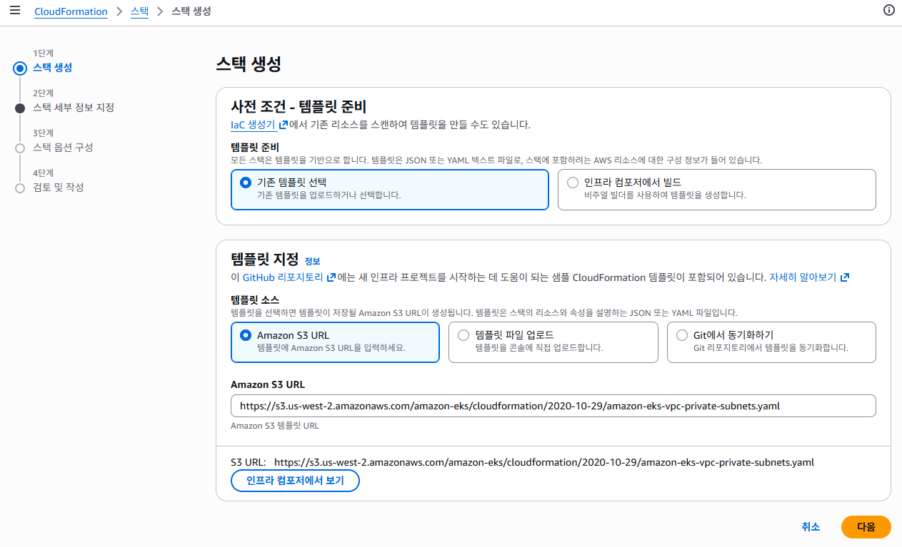

1. 콘솔 검색창에 CloudFormation 입력 → 서비스 선택
2. 우측 상단 **스택 생성(Create stack)** → **새 리소스 사용(표준)**
3. **기존 템플릿 선택** → **Amazon S3 URL** 선택 후 아래 주소 붙여넣기
	- 이 템플릿은 Amazon EKS 팀에서 제공하는 공식 CloudFormation VPC 템플릿이다.
	- 위에서 명시한 조건들을 모두 만족한다.

```
https://s3.us-west-2.amazonaws.com/amazon-eks/cloudformation/2020-10-29/amazon-eks-vpc-private-subnets.yaml
```

4. **다음** → 스택 이름에 `my-eks-vpc-stack` 입력 → **다음** → **다음** → **제출**
	- 추후 리소스 확인 및 제거하기 쉽게 태그 정도는 달아주는게 좋다.
	- 나는 key - `name`, tag - `my-eks` 로 지정했다.
5. 상태가 `CREATE_COMPLETE`가 될 때까지 3~5분 기다립니다

**이 템플릿에서 만들어지는 것**

|#|논리적 ID|타입|설명|
|---|---|---|---|
|1|VPC|`AWS::EC2::VPC`|192.168.0.0/16 대역의 VPC. DNS 지원·호스트네임 활성화|
|2|InternetGateway|`AWS::EC2::InternetGateway`|인터넷 양방향 통신용 게이트웨이|
|3|VPCGatewayAttachment|`AWS::EC2::VPCGatewayAttachment`|IGW를 VPC에 연결|
|4|PublicSubnet01|`AWS::EC2::Subnet`|AZ[0] 퍼블릭 /18. 자동 퍼블릭 IP 할당, `role/elb` 태그|
|5|PublicSubnet02|`AWS::EC2::Subnet`|AZ[1] 퍼블릭 /18. 자동 퍼블릭 IP 할당, `role/elb` 태그|
|6|PrivateSubnet01|`AWS::EC2::Subnet`|AZ[0] 프라이빗 /18. `role/internal-elb` 태그|
|7|PrivateSubnet02|`AWS::EC2::Subnet`|AZ[1] 프라이빗 /18. `role/internal-elb` 태그|
|8|PublicRouteTable|`AWS::EC2::RouteTable`|퍼블릭 서브넷 2개가 공유하는 라우팅 테이블|
|9|PrivateRouteTable01|`AWS::EC2::RouteTable`|AZ1 전용 프라이빗 라우팅 테이블|
|10|PrivateRouteTable02|`AWS::EC2::RouteTable`|AZ2 전용 프라이빗 라우팅 테이블|
|11|PublicRoute|`AWS::EC2::Route`|0.0.0.0/0 → IGW|
|12|PrivateRoute01|`AWS::EC2::Route`|0.0.0.0/0 → NatGateway01|
|13|PrivateRoute02|`AWS::EC2::Route`|0.0.0.0/0 → NatGateway02|
|14|PublicSubnet01RouteTableAssociation|`AWS::EC2::SubnetRouteTableAssociation`|PublicSubnet01 ↔ PublicRouteTable|
|15|PublicSubnet02RouteTableAssociation|`AWS::EC2::SubnetRouteTableAssociation`|PublicSubnet02 ↔ PublicRouteTable|
|16|PrivateSubnet01RouteTableAssociation|`AWS::EC2::SubnetRouteTableAssociation`|PrivateSubnet01 ↔ PrivateRouteTable01|
|17|PrivateSubnet02RouteTableAssociation|`AWS::EC2::SubnetRouteTableAssociation`|PrivateSubnet02 ↔ PrivateRouteTable02|
|18|NatGatewayEIP1|`AWS::EC2::EIP`|NatGateway01용 탄력적 IP (`Domain: vpc`)|
|19|NatGatewayEIP2|`AWS::EC2::EIP`|NatGateway02용 탄력적 IP (`Domain: vpc`)|
|20|NatGateway01|`AWS::EC2::NatGateway`|PublicSubnet01에 배치, AZ1 프라이빗 아웃바운드 담당|
|21|NatGateway02|`AWS::EC2::NatGateway`|PublicSubnet02에 배치, AZ2 프라이빗 아웃바운드 담당|
|22|ControlPlaneSecurityGroup|`AWS::EC2::SecurityGroup`|EKS 컨트롤 플레인 ↔ 워커 노드 통신용. 규칙은 비어 있음|

---
## 2. 클러스터용 IAM 역할 만들기

---
### 필요한 이유

EKS가 내 계정에서 로드밸런서나 ENI 같은 걸 대신 만들려면 권한이 필요하다.

이에 해당 권한을 만들어서 EKS에 붙여준다.

---
### 리소스 생성

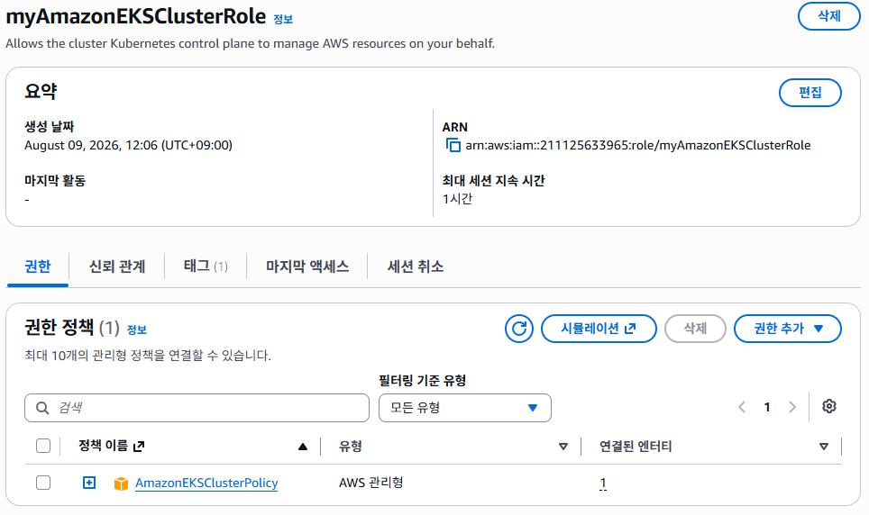

1. 콘솔 검색창에 IAM → **역할(Roles)** → **역할 생성**
2. **신뢰할 수 있는 엔터티 유형**: `AWS 서비스`
3. **다른 AWS 서비스의 사용 사례** 드롭다운에서 `EKS` 검색 → **EKS - Cluster** 선택 → **다음**
4. 권한은 `AmazonEKSClusterPolicy`가 이미 붙어 있음. 그대로 **다음**
5. 역할 이름: `myAmazonEKSClusterRole` → **역할 생성**
	- key - `name`, tag - `my-eks`

> [!info] **왜 사용 사례를 EKS - Cluster로 골랐나**
> - 이걸 고르면 "eks.amazonaws.com 서비스가 이 역할을 대신 사용할 수 있다"는 신뢰 정책이 자동으로 들어간다. 
> - 이 부분을 수동으로 쓰다가 오타 나면 클러스터 생성 시 역할 목록에 아예 안 나타난다.

---
## 3. 노드용 IAM 역할 만들기

---
### 필요한 이유

워커 노드(EC2)에 붙일 역할이다. 클러스터 역할과는 별개이다.

워커 노드가 EKS에 join하고, ECR 이미지나 AWS 네트워크 같은 AWS 리소스를 사용할 수 있게 해주는 권한이 필요하다.

---
### 리소스 생성

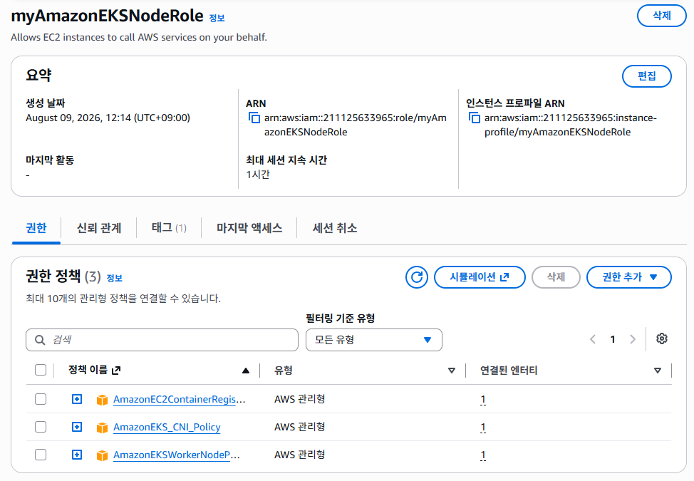

1. IAM → **역할** → **역할 생성**
2. **신뢰할 수 있는 엔터티 유형**: `AWS 서비스`
3. **서비스 또는 사용 사례**: `EC2` 선택 → 사용 사례도 `EC2` → **다음**
4. 권한 정책 검색창에서 아래 3개를 하나씩 검색해서 체크
	- ECR 컨테이너 이미지 pull 권한을 벌써 넣어야하나? 라는 생각이 들 수 있지만, 기본 EKS 구성 자체가 ECR에 있는 이미지를 사용하기 때문에 꼭 넣어줘야한다.

| 정책 이름                                | 역할                     |
| ------------------------------------ | ---------------------- |
| `AmazonEKSWorkerNodePolicy`          | 노드가 클러스터에 등록되기 위한 권한   |
| `AmazonEC2ContainerRegistryReadOnly` | ECR에서 컨테이너 이미지 pull    |
| `AmazonEKS_CNI_Policy`               | 파드에 VPC IP를 할당(ENI 조작) |

5. **다음** → 역할 이름: `myAmazonEKSNodeRole` → **역할 생성**
	- key - `name`, tag - `my-eks`

---
## 4. EKS 클러스터 생성

먼저, 콘솔 검색창에 `EKS` → **Elastic Kubernetes Service** → 왼쪽 메뉴 **클러스터** → **클러스터 생성**

---
### 클러스터 구성 페이지

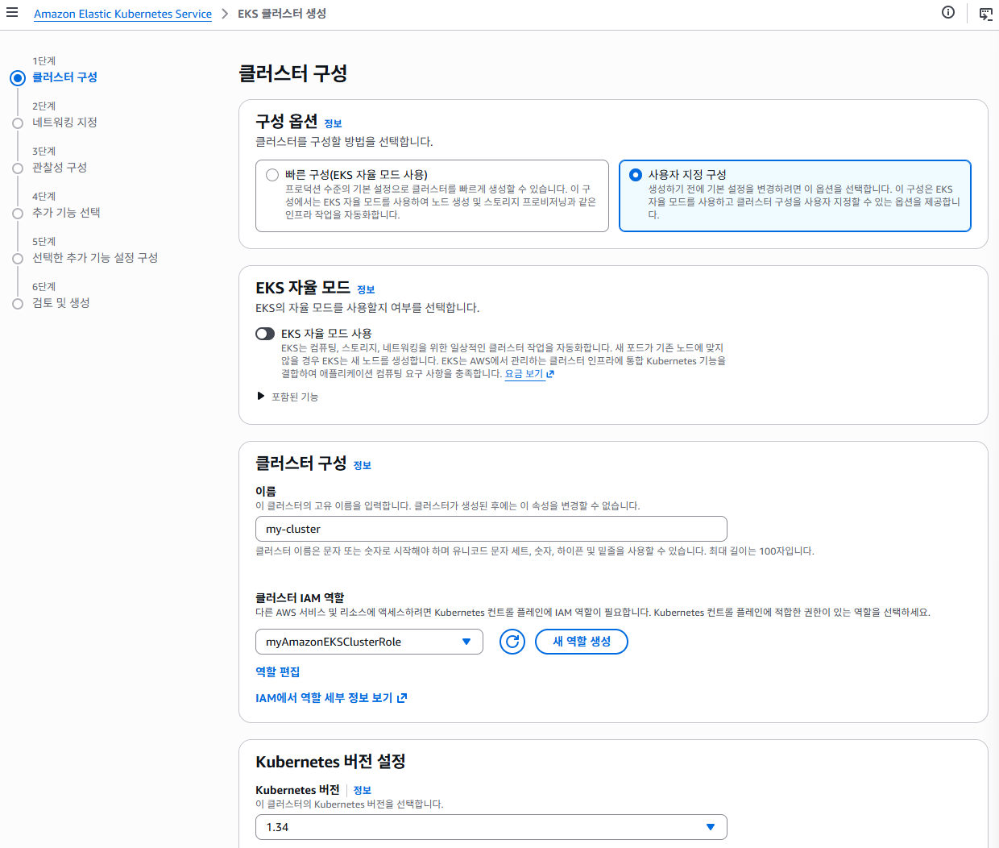

- 맨 위에서 **사용자 지정 구성(Custom configuration)** 선택
- **EKS Auto Mode 사용** 체크를 **해제**한다 (Auto Mode를 켜면 노드 관리를 AWS가 다 해줘서 편하지만, 지금은 노드 그룹이 뭔지 직접 보는 게 목적)
- **이름**: `my-cluster`
- **클러스터 서비스 역할**: 2단계에서 만든 `myAmazonEKSClusterRole` 선택
- **Kubernetes 버전**: 최신 버전보다 한단계 낮은 정도를 권장한다. 최신 버전은 애드온 호환성 문제가 생기는 경우가 있음
- 나머지(클러스터 액세스, 봉투 암호화)는 기본값 → **다음**
	- key - `name`, tag - `my-eks`

---
### 네트워킹 지정 페이지

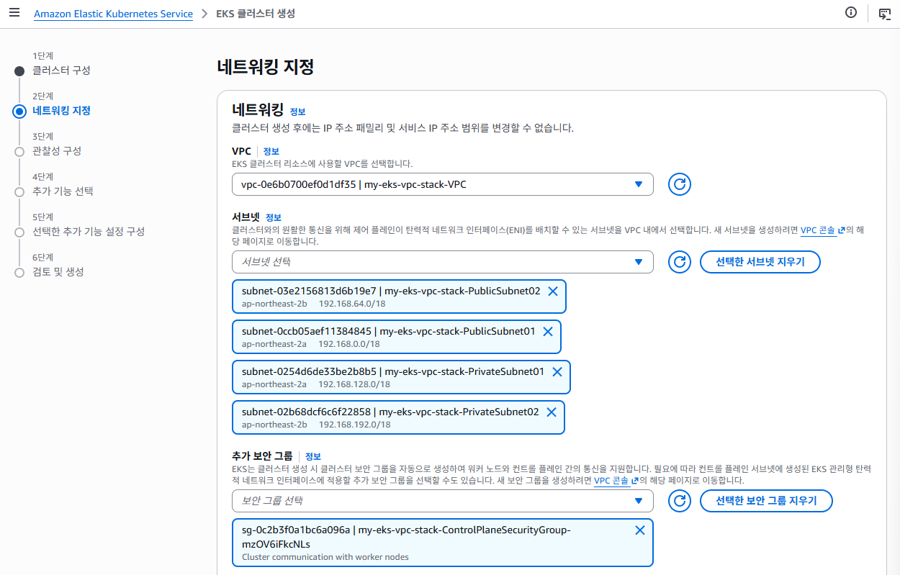

- **VPC**: `my-eks-vpc-stack-VPC` 선택
- **서브넷**: `my-eks-vpc-stack-`으로 시작하는 서브넷 4개 모두 선택
- **추가 보안 그룹**: `my-eks-vpc-stack-ControlPlaneSecurityGroup-...` 선택
- **클러스터 엔드포인트 액세스**: `퍼블릭` (실습용). 실무에서는 `퍼블릭 및 프라이빗`으로 두고 퍼블릭 접근을 특정 IP로 제한합니다
- **다음**

---
### 관측성 구성 페이지

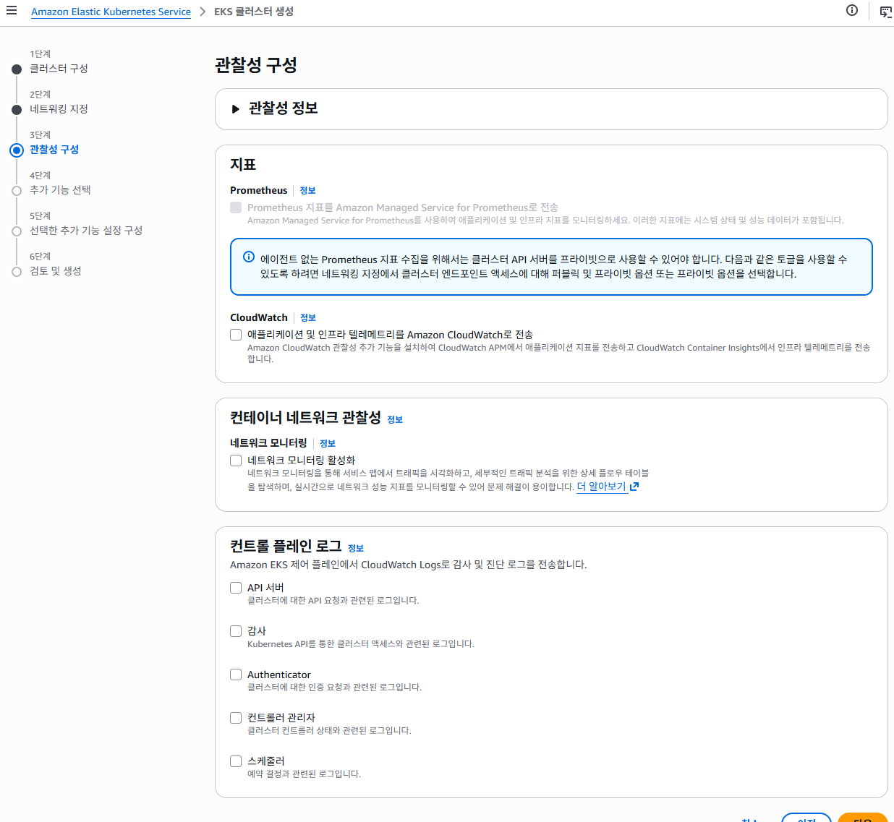

기본값 그대로 **다음**. 

여기서 컨트롤 플레인 로그(API 서버, 감사 로그 등)를 CloudWatch로 보낼 수 있는데, 켜면 로그 요금이 붙는다. 필요할 경우 켜기

---
### 추가 기능 선택 페이지

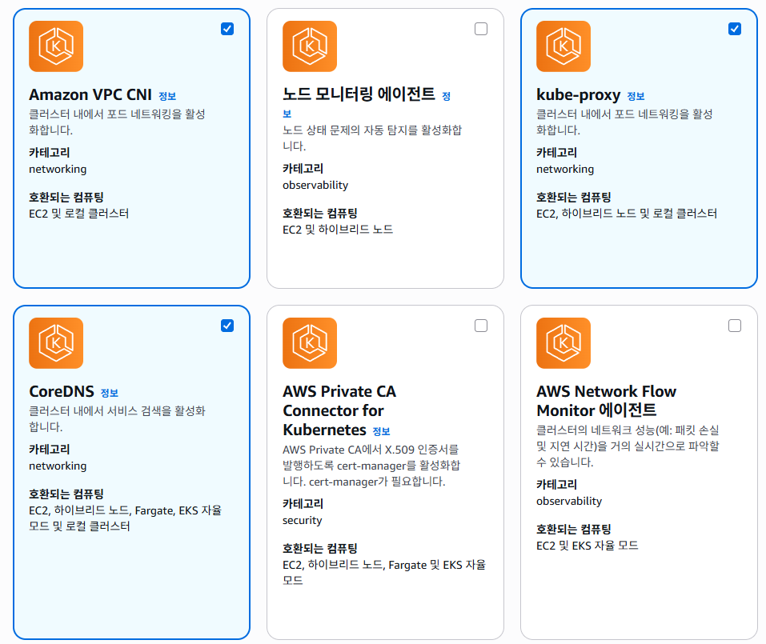

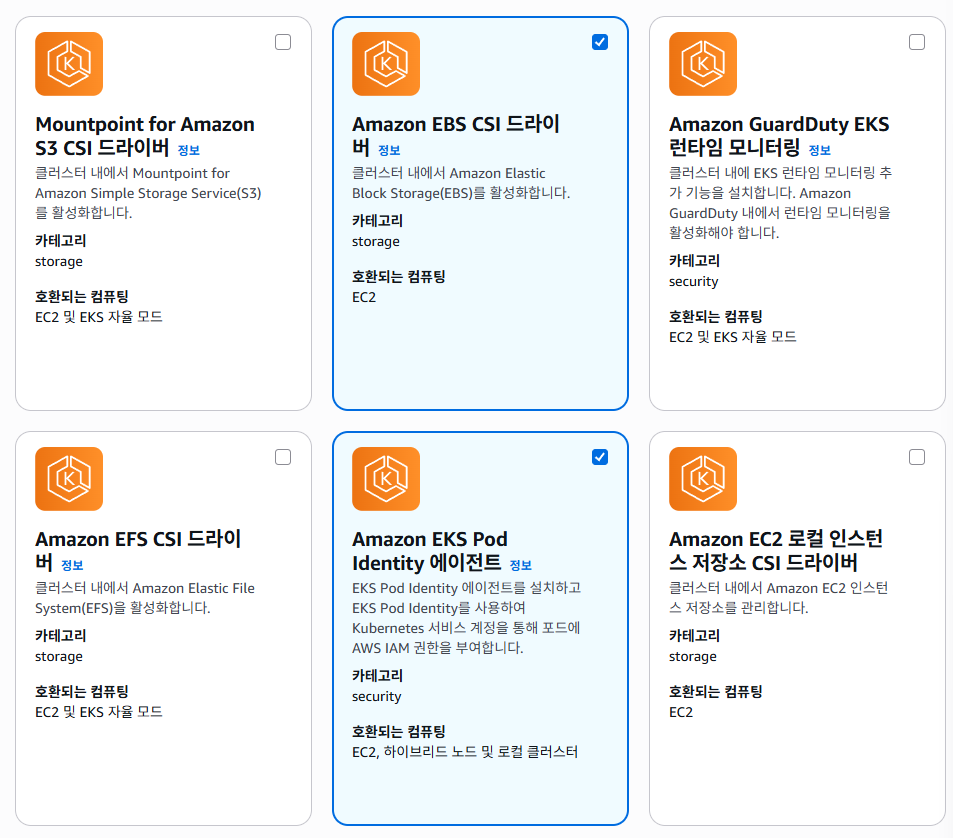

`Amazon VPC CNI`, `CoreDNS`, `kube-proxy` 를 선택한다. 

**당연히 이 3개는 해제하면 안된다.** 쿠버네티스 필수 구성 요소이다.

cf) 여기서 `Amazon EBS CSI 드라이버`도 추가로 체크해두면 나중에 PVC로 스토리지를 붙일 때 편하다. 추가적으로 `Amazon EKS Pod Identity 에이전트`도 체크해두면 Pod에 AWS IAM 권한을 붙일 수 있어 편하다. → **다음**

---
### 선택한 추가 기능 설정 구성 페이지

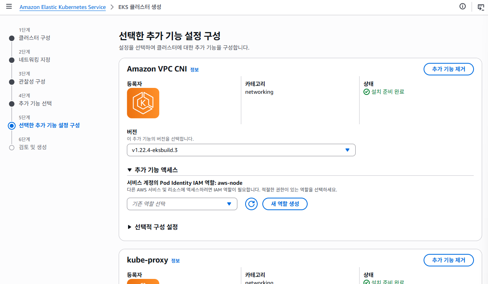

버전은 기본값 그대로 **다음**.

---
### 검토 및 생성 페이지

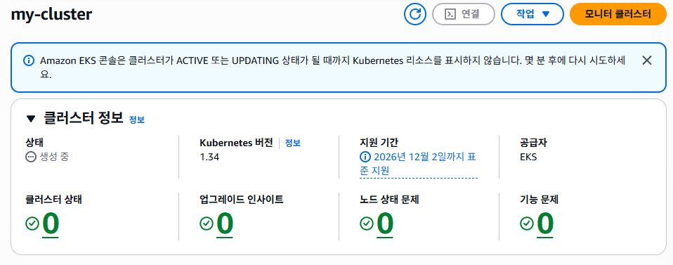

내용 확인 후 **생성**.

**이제 10~15분 기다립니다.** 클러스터 이름 옆 상태가 `생성 중` → `활성(Active)`으로 바뀌고 난 후 다음 단계로 넘어간다.

---
## 5. 노드 그룹 추가

지금 클러스터에는 **워커 노드가 하나도 없다.** 

컨트롤 플레인만 있는 빈 클러스터이다.

여기에 EC2를 붙여야 파드를 띄울 수 있있다.

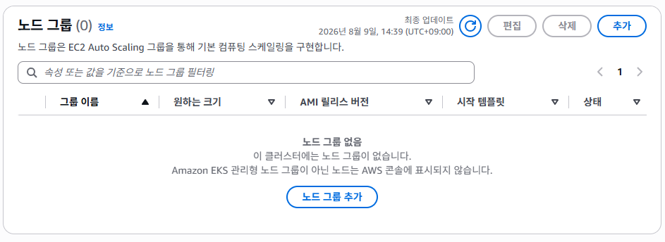

클러스터 이름(`my-cluster`) 클릭 → **컴퓨팅(Compute)** 탭 → **노드 그룹 추가**

---
### 노드 그룹 구성 페이지

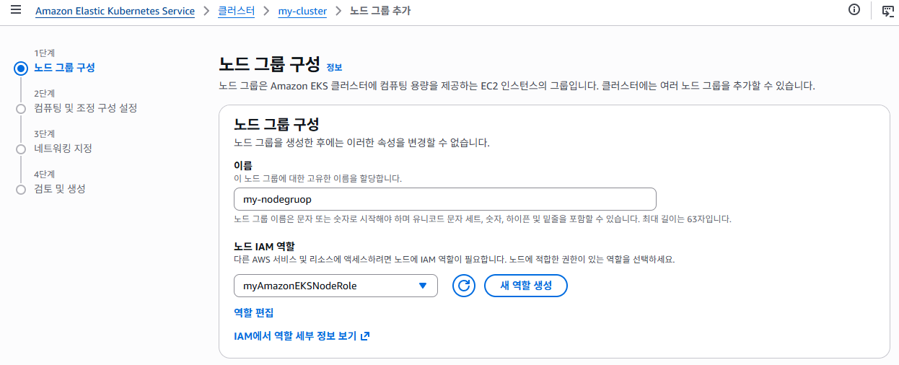

- **이름**: `my-nodegroup`
- **노드 IAM 역할**: 3단계에서 만든 `myAmazonEKSNodeRole` 선택
- key - `name`, tag - `my-eks`
- **다음**

---
### 컴퓨팅 및 조정 구성 설정 페이지

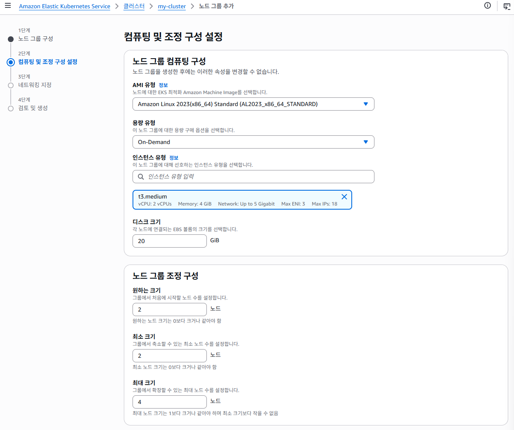

- **AMI 유형**: `Amazon Linux 2023 (x86_64)`
- **인스턴스 유형**: `t3.medium` (기본값 t3.medium 그대로 두면 됩니다)
- **디스크 크기**: `20 GiB`
- **원하는 크기**: `2` / **최소**: `2` / **최대**: `4`
- **다음**

> t3.micro나 t3.small은 사용하지 말 것. EKS는 파드마다 VPC IP를 주는 구조라 작은 인스턴스는 띄울 수 있는 파드 수가 제한되는데, 시스템 파드가 그걸 거의 다 먹는다.

---
### 네트워킹 지정 페이지


- **서브넷**: `PrivateSubnet01`, `PrivateSubnet02` **두 개만** 선택. 
	- 보통, 각 노드에 직접 퍼블릭하게 접근할 일이 없다.
	- 이에 프라이빗 서브넷만 지정.
- **원격 액세스 구성**: 끈 상태로 두기 (SSH 안 씀)
- **다음**

---
### 검토 및 생성

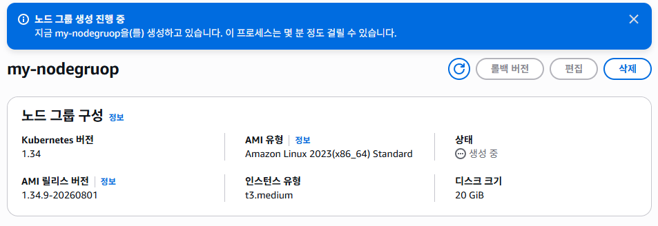

노드 그룹 상태가 `활성`이 될 때까지 3~5분 기다린다.

---
## 6. 결과 확인

---
### 결과 확인

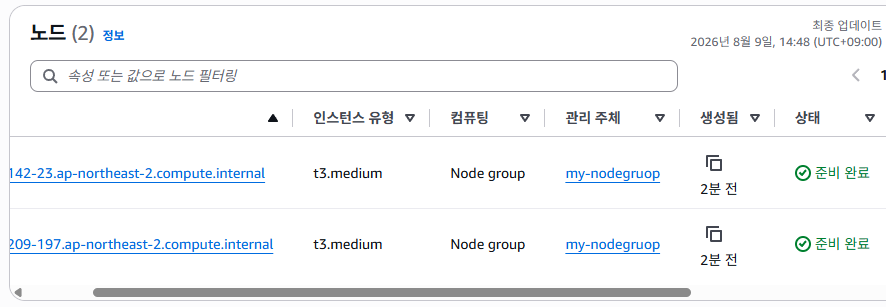

**컴퓨팅 탭**에서 노드 2개가 `Ready` 상태로 보이면 성공

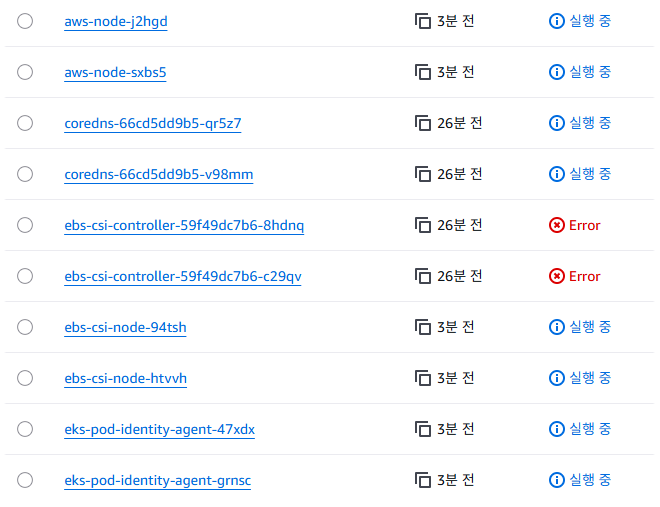

**리소스 탭**을 눌러보면, 워크로드(Deployment, Pod, DaemonSet), 서비스, ConfigMap 같은 쿠버네티스 오브젝트를 `kubectl` 없이 브라우저에서 볼 수 있다. (ebs-csi-controller가 에러가 난 이유는 EBS CSI 용 IAM Role을 아직 안붙였기 때문이므로 넘어간다)

---
### 액세스 구성

> 만약 클러스터를 만든 IAM 계정 외에 다른 IMA 계정에게 클러스터 접근 권한을 주고자 한다면, 해당 IAM 계정을 엑세스 항목에 등록해주어야 한다. (만든 계정은 기본적으로 등록)

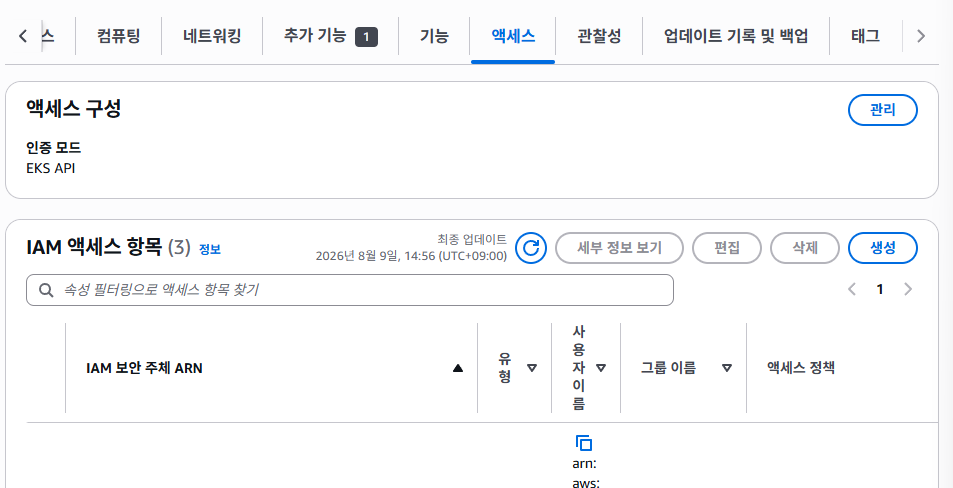

- EKS → 클러스터 → `my-cluster` → 액세스(Access) 탭
- IAM 액세스 항목 → 생성 


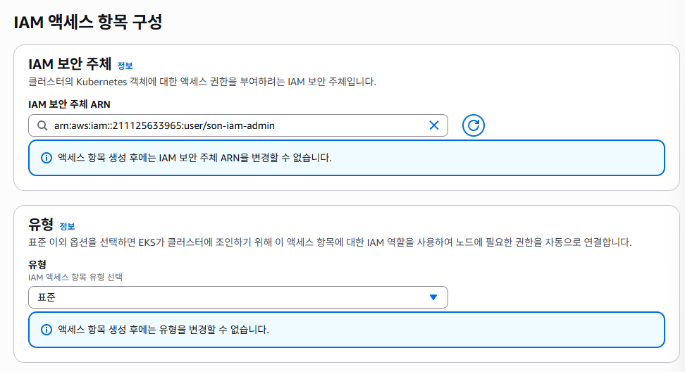

- IAM 보안 주체 : 클러스터 관리자 iam 지정
- 유형 : 표준
- 추가 옵션 구성
	- key - `name`, tag - `my-eks`
- 다음

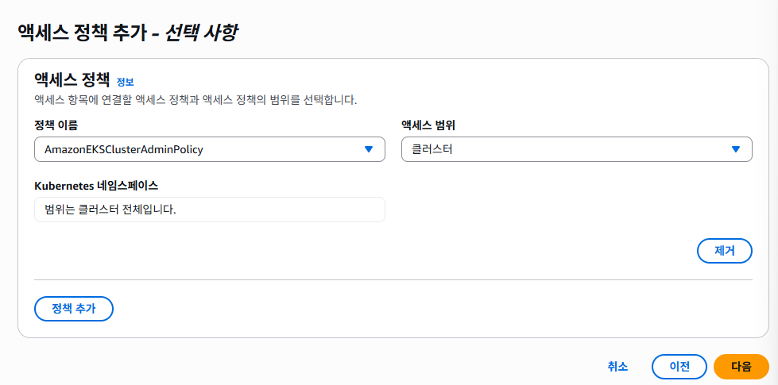

- 해당 IAM 사용자가 클러스터의 어디까지 접근할지를 정책으로 지정 (현재는 모든 권한을 줄 것이므로 `AmazonEKSClusterAdminPolicy` 지정, 액세스 범위 `클러스터` 지정)
	- 바닐라 k8s의 RBAC를 EKS에서는 이렇게 편하게 지정 가능
- 다음

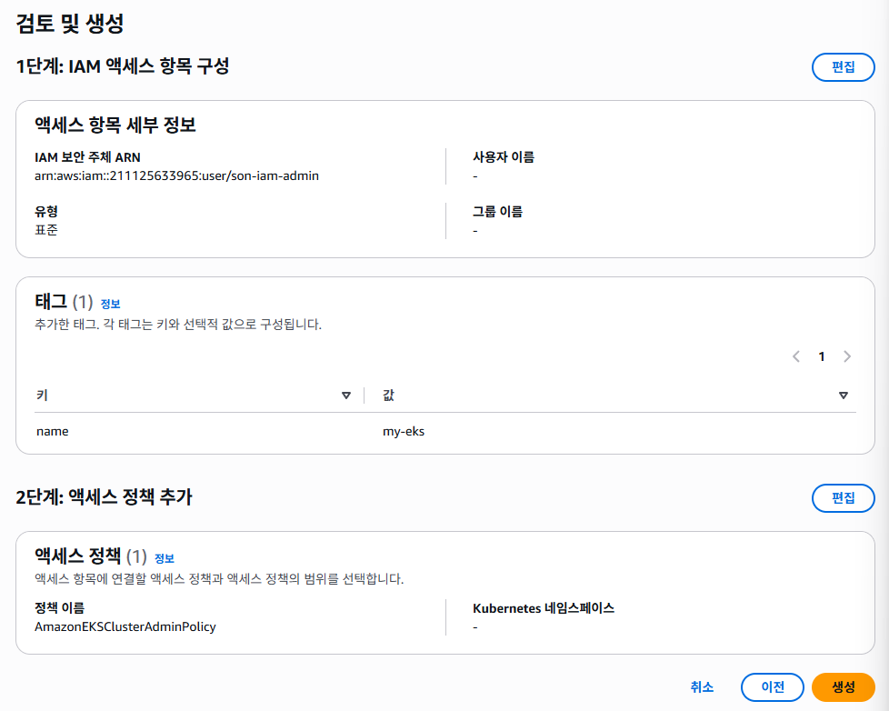

- 생성

---
### kubeconfig 설정

> kubeconfig 설정을 하고자하는 PC에 aws cli와 해당 IAM configure 설정이 되어있어야 한다.
> 
> 추가적으로 kubectl도 설치되어 있어야 한다.

```bash
aws eks update-kubeconfig \
  --region ap-northeast-2 \
  --name my-cluster
```

이후 확인해본다.

```bash
kubectl get node
```

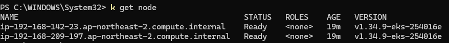

---
## 7. 삭제

역순으로 지워야 한다. 순서를 어기면 "종속 리소스가 있어서 삭제 불가" 오류가 나고, 그동안 계속 과금된다.

1. **노드 그룹 삭제** — 클러스터 → 컴퓨팅 탭 → `my-nodegroup` 선택 → **삭제** → 이름 입력 후 확인. 완전히 사라질 때까지 대기
2. **클러스터 삭제** — 클러스터 목록에서 `my-cluster` → **클러스터 삭제** → 이름 입력 후 확인
3. **CloudFormation 스택 삭제** — CloudFormation 콘솔 → `my-eks-vpc-stack` → **삭제**.
	- 이걸 지워야 VPC와 NAT 게이트웨이가 사라짐
4. **IAM 역할 삭제** — IAM → 역할 → `myAmazonEKSClusterRole`, `myAmazonEKSNodeRole` 삭제

> Resource Explorer로 남은 리소스가 있는지 마지막 확인한다.

> [!tip] 만약 LB 타입 서비스를 만들어 ELB가 프로비저닝되었다면, 클러스터 내부에서 해당 서비스를 삭제해야 ELB 리소스가 삭제된다.
> - 만약 정리하지 않고 클러스터를 삭제했다면, 해당 ELB는 고아 리소스로 남아있어 수동으로 삭제해주어야 한다.

---
## 레퍼런스

 - https://docs.aws.amazon.com/ko_kr/eks/latest/userguide/create-cluster-auto.html
 - https://docs.aws.amazon.com/ko_kr/eks/latest/userguide/network-reqs.html?utm_source=chatgpt.com
 - https://docs.aws.amazon.com/en_en/eks/latest/userguide/cluster-iam-role.html?utm_source=chatgpt.com

