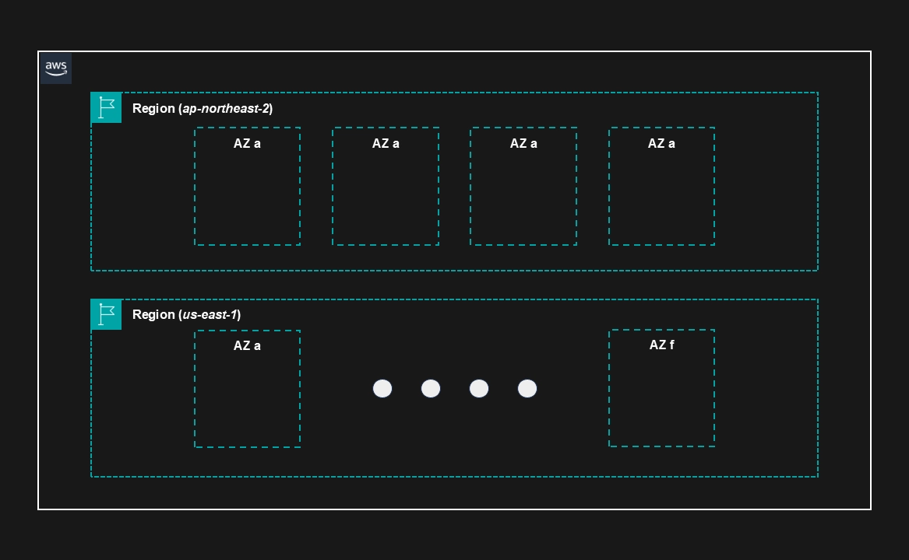
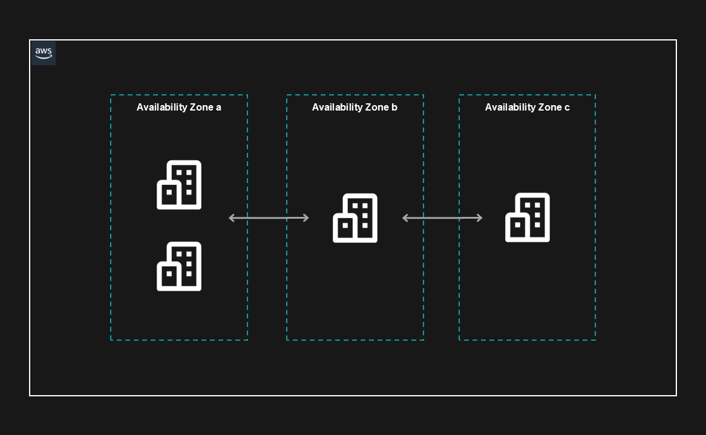
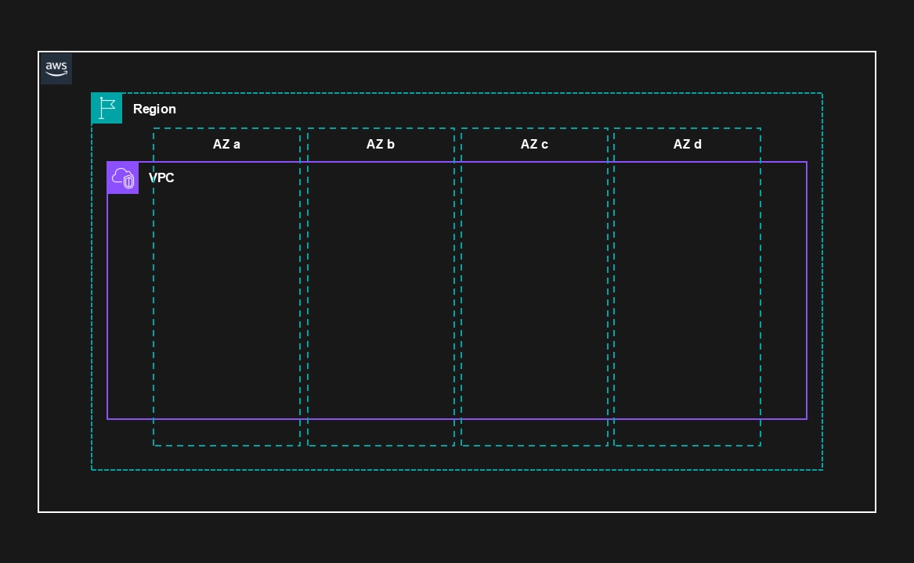
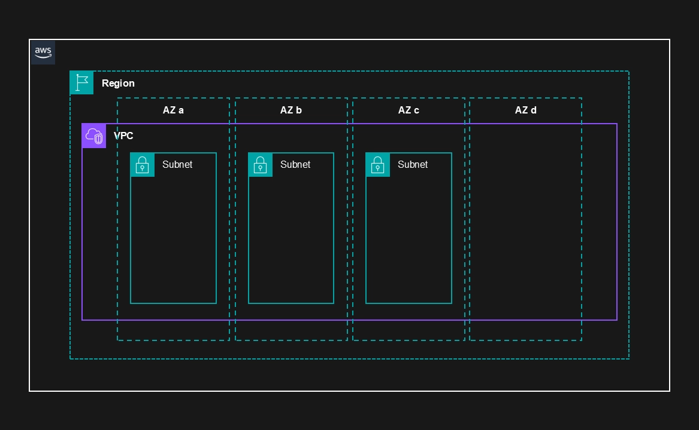
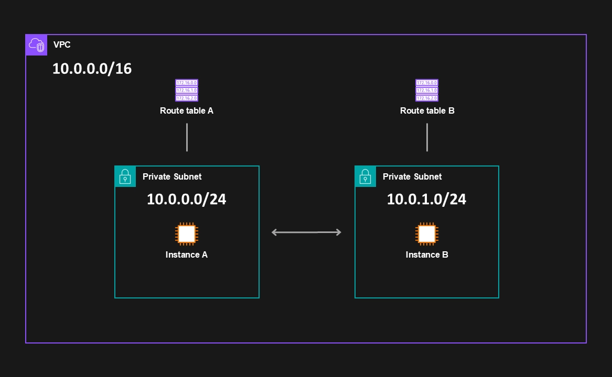
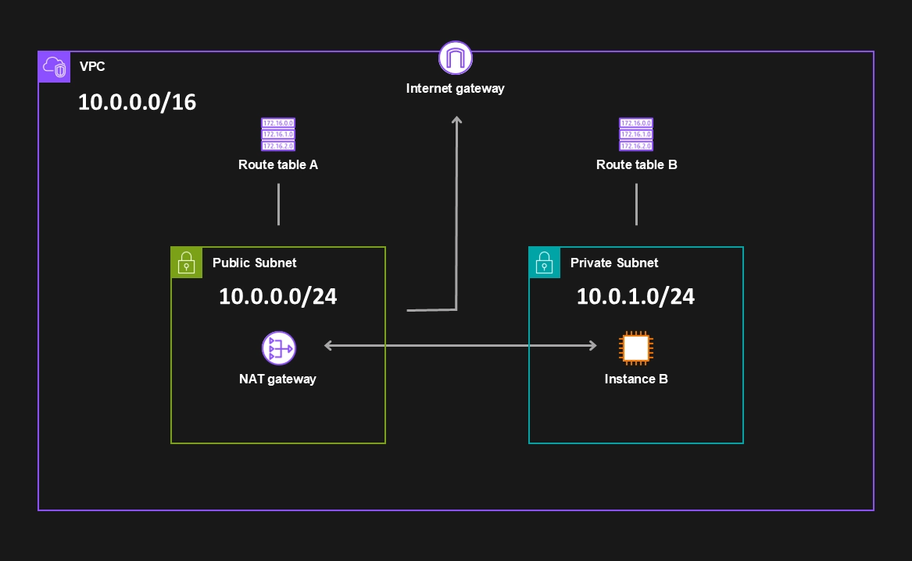

---
항상 알고있다고 생각했지만, 막상 면접에서 질문을 받거나 설명해야하는 상황이오면 한두가지 개념이 헷갈릴 때가 있었다. 이에, 다시 한번 정리해보고자 글을 작성하게 되었다.

## Region

AWS 인프라의 가장 큰 단위인 Region은 최소 2개 이상의 가용영역(AZ, Availability Zone)으로 구성되어 있다.

전세계에 수십개의 Region이 존재하며, 현재 한국에는 서울 리전(`ap-northeast-2`)만 존재한다.

> [!info] **Region 선택 기준**
>
> 1. 컴플라이언스 (ex: 한국에서 서비스하려면 한국 내에서만 데이터가 이동해야한다는 정책이 존재한다면 -> 한국 국내 리전 사용)
> 2. 레이턴시 (한국에서 서비스하는 fps 게임의 서버가 국외에 있다면 레이턴시가 느릴 것임)
> 3. 사용하고자하는 AWS 기능이 해당 리전에 존재하는가? (리전마다 없는 기능이 있을 수 있음)
> 4. 가격 (리전마다 가격 다름)

---
## AZ(Availability Zone)

하나 이상의 데이터센터가 모이면 AZ(Availability Zone, 가용영역)이라고 한다. 각 가용영역은 내결함성을 갖도록 설계되어 있으며, 재해에 대비하기 위해 다른 AZ와 지리적으로 떨어진 곳에 위치한다. 각 AZ는 프라이빗 링크를 통해 다른 AZ와 연결되어 있다.

> [!tip] 특정 AZ를 이용하면 항상 같은 데이터센터의 인프라를 이용하는 것일까?
> 아니다. 특정 AZ의 위치를 사용자는 알 수 없으며, 하나의 AZ에 쏠림을 방지하기 위해 `ap-northeast-2a`라는 AZ라고 하더라도 인프라가 위치한 데이터센터는 사용자별로 달라질 수 있다.

---
## VPC (Virtual Private Cloud)

사용자가 구성하는 가상 네트워크 사설망이다. 전용 사설 IP 대역을 구성할 수 있으며, 기본적으로 하나의 Region에 최대 5개의 VPC를 구성할 수 있다.

> [!tip] 사설 IP 대역
> `10.0.0.0/8`
> `172.16.0.0/12`
> `192.168.0.0/16`
> - 보통 사설 IP는 위 대역을 사용하고 AWS에서도 강력하게 권장된다.
> - 왜일까? 위의 저 세 대역은 사설 IP 대역으로 사용하기로 약속된 대역이다.
> - 이에, 해당 대역을 공인 IP로 사용하지 않는다. 반대로, 해당 대역이 아닌 IP를 사설 대역으로 사용한다면, 해당 주소를 가진 공인 IP로 접속할 수 없는 문제가 생긴다.

---
## Subnet

VPC가 사용하는 사설 IP 대역의 일부분을 논리적으로 분할한 영역이다. 하나의 Subnet은 반드시 하나의 AZ에 위치하게 된다.

---
## Route Table

Route Table은 VPC 내에서 네트워크 트래픽을 어디로 보낼지 결정하는 표이다.

Subnet은 반드시 1개 이상의 Route Table과 연결 되어 있어야 한다. 그러나, 하나의 Route Table을 여러 Subnet이 사용하는 것은 가능하다.

---
## 인터넷 연결

VPC는 기본적으로 격리된 네트워크이다. 이에 기본적으로 인터넷과 연결되어 있지 않다.

### Public Subnet (feat. Internet Gateway)

그렇다면, Subnet을 인터넷에 연결(인바운드, 아웃바운드 모두 o)하려면 어떻게 해야할까?

여기서 Internet Gateway가 나온다. Internet Gateway는 VPC와 인터넷을 이어주는 매개체이다. 이에 Subnet에 연결된 Route Table을 Internet Gateway에 연결해주면, 해당 Route Table에 연결된 Subnet은 인터넷과 연결되며 이를 Public Subnet이라고 한다.

> [!info] 연결 조건
> 1. Internet Gateway 생성
> 2. Route Table에 Internet Gateway 연결 (`0.0.0.0/0` -> igw-id)
> 3. VPC 내에 공인 IP 필요

### Private Subnet (feat. NAT Gateway)

인터넷에 연결하지 않는 Subnet을 Private Subnet이라고 한다.

그러나 인터넷에서의 인바운드는 허용하지 않지만, 소프트웨어 업데이트 등의 이유로 Private Subnet의 인터넷으로의 아웃바운드를 열어야하는 경우가 있다.

여기서 NAT Gateway가 나온다. Public Subnet에 NAT Gateway를 생성하고 Private Subnet에 연결된 Route Table을 NAT Gateway에 연결해주면 Private Subnet에서도 인터넷으로의 아웃바운드 트래픽이 나갈 수 있다. (Private Subnet에서 요청 -> NAT Gateway -> Internet Gateway -> Internet)

흔히 NAT는 사설 IP를 공인 IP로 바꿔주거나 그의 반대를 해주는 역할로 알고 있다. 여기서도 그 역할을 수행한다. Private Subnet에서 사설 IP를 가진 특정 인스턴스의 요청 출발지를 NAT에서 NAT에 설정된 공인 IP로 바꿔준다. 이후 요청의 응답이 NAT에 설정된 공인 IP로 온다. 이를 다시 사설 IP로 바꾸어 Private Subnet에 있는 인스턴스로 보내준다.

> [!info] 연결 조건
> 1. Public Subnet에 NAT Gateway 생성
> 2. Route Table에 NAT Gateway 연결 (`0.0.0.0/0` -> nat-gateway-id)
> 3. NAT에 공인 IP 할당

> [!tip] 그러면 NAT 공인 IP로 요청 보내면 인바운드로 들어오는거 아니야?
> - 아니다. 요청이 나갈 때는 NAT가 상태 테이블에 누가(사설 IP) 나갔는지 기록해뒀다가. 응답이 오면 전달해주지만, '외부에서 요청이 올 경우에 어디로 요청을 보내라' 라는 정보가 아예 없으므로 인바운드 요청이 들어올 수 없다. 

---
## 레퍼런스

- https://tiaz.dev/AWS/3
- https://swiftymind.tistory.com/132
- Udemy - Ultimate AWS Certified Solutions Architect Associate 2026, Stephane Maarek