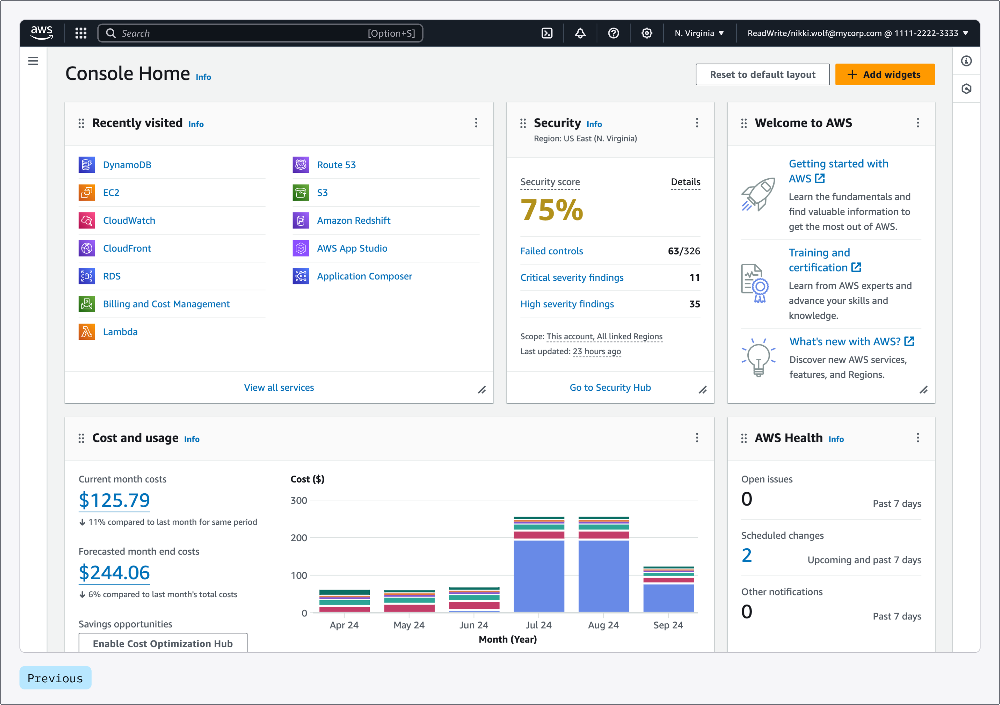
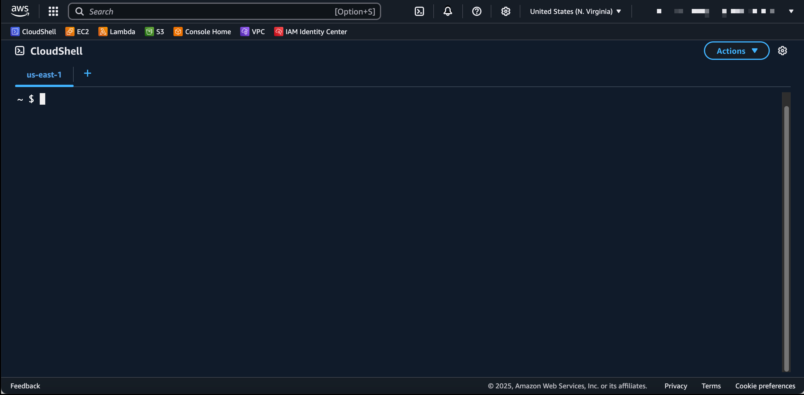

---
## 개요

AWS를 사용하는 방법은 크게 세 가지로 나눌 수 있다.

1. **AWS Management Console**    
2. **AWS CLI**
3. **AWS SDK**

각 방식은 모두 AWS 리소스를 생성하거나 조회하고 관리하기 위한 방법이다. 
다만 사용 환경과 목적에 따라 사용 방식이 달라진다.

---
## AWS 사용 방법
### AWS Management Console



AWS Management Console은 웹 브라우저에서 AWS를 사용할 수 있는 <span class="t-red">GUI 환경</span>이다.

사용자는 계정의 <span class="t-red">ID와 비밀번호</span>로 로그인하고, 필요한 경우 <span class="t-red">MFA를 통해 추가 인증</span>을 진행한다. 콘솔 화면에서 EC2, S3, IAM 등 다양한 AWS 서비스를 직접 클릭하며 사용할 수 있다.

초기 학습이나 리소스 상태를 확인할 때 가장 직관적인 방식이다.

---
### AWS CLI


AWS CLI는 <span class="t-red">터미널에서 명령어를 통해</span> AWS 서비스를 사용하는 방식이다.

콘솔처럼 화면을 클릭하는 대신 명령어를 입력해 AWS 리소스를 생성하거나 조회할 수 있다. 일반적으로 <span class="t-red">Access Key를 설정해 인증</span>한 뒤 사용한다.

```bash
aws configure
```

다만 CLI가 반드시 Access Key로만 인증하는 것은 아니다.  
IAM Role이나 임시 자격 증명 등을 통해서도 사용할 수 있다.

---

### AWS SDK

AWS SDK는 <span class="t-red">프로그래밍 언어에서 AWS 서비스를 사용할 수 있도록 제공되는 도구</span>이다.

쉽게 말하면, 특정 언어에서 AWS API를 호출할 수 있게 해주는 라이브러리라고 볼 수 있다.

예를 들어 Python에서는 `boto3`, Java에서는 `AWS SDK for Java`를 사용할 수 있다.

```python
import boto3
```

CLI가 사람이 터미널에서 직접 사용하는 방식이라면, SDK는 애플리케이션 코드 안에서 AWS 서비스를 연동할 때 사용된다.

> [!tip] AWS CLI와 boto3는 형제
> 사실 AWS CLI와 boto3 모두 AWS API를 호출하기 위한 라이브러리인 botocore를 기반으로 동작한다.

---
## CloudShell



CloudShell은 AWS <span class="t-red">콘솔에서 바로 사용할 수 있는 가상 리눅스 환경</span>이다.

콘솔 우측 상단의 CloudShell 아이콘을 통해 실행할 수 있으며, 별도로 로컬 PC에 <span class="t-red">AWS CLI를 설치하지 않아도 간단한 CLI 명령이나 스크립트 작업을 수행</span>할 수 있다.

CloudShell에는 AWS CLI가 기본적으로 설치되어 있고, 현재 콘솔에 로그인한 사용자 권한이 자동으로 연동된다.

따라서 <span class="t-red">Access Key를 따로 발급하거나 설정하지 않아도 AWS CLI를 사용할 수 있다는 점이 가장 큰 장점</span>이다.

```bash
aws sts get-caller-identity
```

위 명령어를 실행하면 현재 어떤 AWS 계정과 권한으로 CLI를 사용하고 있는지 확인할 수 있다.

> [!warning] CloudShell 사용 시 주의할 점
> CloudShell은 모든 리전에서 사용할 수 있는 것은 아니다.  
> 따라서 CloudShell을 사용하려는 리전에서 지원 여부를 확인해야 한다.
> 
> 또한 현재 사용자에게 CloudShell을 실행할 수 있는 IAM 권한이 있어야 한다. 권한이 없다면 콘솔에 로그인했더라도 CloudShell을 사용할 수 없다.

---

