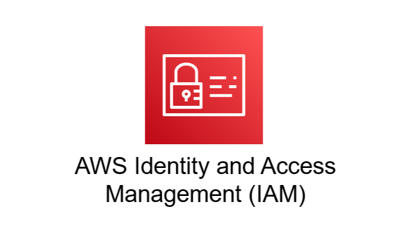

---
## 개요

AWS IAM은 Identity and Access Management의 약자로, AWS 리소스에 대한 접근 권한을 관리하는 서비스이다. 
쉽게 말하면, 누가 AWS에 접근할 수 있는지, 어떤 리소스에 어떤 작업을 할 수 있는지를 제어하는 서비스이다.

추가적으로, IAM은 특정 리전에 종속되지 않는 글로벌 서비스이다.

---
## IAM 기본 개념
### Root 계정

AWS 계정을 처음 생성하면 기본적으로 Root 계정이 생성된다. Root 계정은 해당 AWS 계정의 모든 리소스와 설정에 접근할 수 있는 가장 강력한 권한을 가진 계정이다. 따라서 일상적인 작업에 Root 계정을 사용하는 것은 권장되지 않는다.

Root 계정은 계정 생성, 결제 설정, 일부 계정 수준의 작업 등 꼭 필요한 경우에만 사용하고, 일반적인 작업은 IAM User나 Role을 통해 수행하는 것이 좋다.

### 최소 권한 원칙

IAM에서 가장 중요한 원칙 중 하나는 최소 권한 원칙이다. 최소 권한 원칙이란, User나 Group에 필요한 권한만 최소한으로 부여하는 것을 의미한다. 예를 들어 S3 객체 조회만 필요한 사용자에게는 S3 전체 관리 권한을 주는 것이 아니라, 조회에 필요한 권한만 부여해야 한다.

권한을 넓게 부여할수록 실수나 보안 사고가 발생했을 때 영향 범위가 커지기 때문에, 가능한 한 필요한 권한만 제한적으로 부여하는 것이 좋다.

---
## IAM 구성 요소
### User

User는 AWS에 접근하는 개별 사용자를 의미한다. 일반적으로 사람 한 명당 하나의 IAM User를 생성해 사용한다. 하나의 User는 Group에 속할 수도 있고, 속하지 않을 수도 있다. 또한 하나의 User가 여러 Group에 속하는 것도 가능하다.

예를 들어 한 사용자가 `Developers` Group과 `S3ReadOnly` Group에 동시에 속할 수 있다. 이 경우 해당 사용자는 두 Group에 부여된 권한을 함께 적용받는다.

### Group

Group은 여러 IAM User를 묶는 단위이다. User마다 권한을 직접 부여하면 관리가 복잡해질 수 있다. 따라서 일반적으로는 User를 Group에 포함시키고, Group에 Policy를 연결하는 방식으로 권한을 관리한다. 

예를 들어 개발자들에게 공통으로 필요한 권한이 있다면 `Developers` Group을 만들고, 해당 Group에 필요한 Policy를 연결하면 된다. 그러면 Group에 속한 User들은 해당 Policy의 권한을 적용받는다.

### Policy

Policy는 AWS 리소스에 대한 권한을 정의하는 JSON 문서이다. Policy에는 어떤 작업을 허용하거나 거부할지, 어떤 리소스에 적용할지 등이 작성된다.

예를 들어 S3 버킷을 조회할 수 있는 권한, EC2 인스턴스를 생성할 수 있는 권한 등을 Policy로 정의할 수 있다. 또한 Policy는 User, Group, Role 등에 연결할 수 있다.

---
## IAM Policy 종류
### Managed Policy

Managed Policy는 독립적인 객체로 존재하는 Policy이다. 즉, Policy 자체가 별도의 리소스로 존재하며 여러 User, Group, Role에 연결할 수 있다.

Managed Policy는 다시 AWS에서 기본 제공하는 AWS Managed Policy와 사용자가 직접 생성하는 Customer Managed Policy로 나눌 수 있다. 

일반적으로 여러 사용자나 그룹에 반복해서 사용할 권한이라면 Managed Policy로 관리하는 것이 좋다.

### Inline Policy

Inline Policy는 특정 User, Group, Role에 직접 포함(Embed)되는 Policy이다.

Managed Policy처럼 독립적인 객체로 존재하지 않고, 연결된 대상에 종속된다. 따라서 해당 User, Group, Role이 삭제되면 Inline Policy도 함께 삭제된다.

특정 대상에게만 예외적으로 권한을 부여해야 할 때 사용할 수 있지만, 일반적인 권한 관리는 Managed Policy를 사용하는 것이 더 관리하기 쉽다.

> [!tip] Best Practice
> User에게 직접 Policy를 붙이기보다는, User를 Group에 포함시키고 Group에 Managed Policy를 연결한다.

---
## IAM 보안 관리
### Password Policy

Password Policy는 IAM User의 비밀번호 규칙을 설정하는 기능이다. 
Root 계정 또는 IAM 권한이 있는 관리자는 IAM User에 대해 비밀번호 정책을 설정할 수 있다.
설정할 수 있는 항목은 다음과 같다.

- 최소 비밀번호 길이
- 대문자 포함 여부
- 소문자 포함 여부
- 숫자 포함 여부
- 특수문자 포함 여부
- 비밀번호 만료 기간
- 비밀번호 재사용 방지

강력한 Password Policy를 설정하면 계정 탈취 위험을 줄일 수 있다.

### MFA

MFA는 Multi-Factor Authentication의 약자로, 다중 인증을 의미한다. 비밀번호만으로 로그인하는 것이 아니라, 추가 인증 수단을 함께 사용하는 방식이다.

AWS에서는 각 사용자가 자신의 기기에 MFA를 등록할 수 있다. 대표적으로 Google Authenticator와 같은 가상 MFA 앱을 사용할 수 있고, 별도의 하드웨어 MFA 장치를 사용할 수도 있다. Root 계정과 IAM User 모두 MFA를 설정하는 것이 권장된다. 특히 Root 계정은 매우 강력한 권한을 가지고 있기 때문에 반드시 MFA를 설정하는 것이 좋다.

---

## IAM Role

### Role의 개념

IAM Role은 특정 주체가 임시로 권한을 사용할 수 있도록 부여하는 IAM 자격 증명이다.

Role은 주로 AWS 서비스가 다른 AWS 리소스에 접근해야 할 때 사용한다.

예를 들어 EC2 인스턴스가 Lambda에 접근해야 한다면, Lambda 접근 권한이 있는 Role을 생성한 뒤 EC2 인스턴스에 연결할 수 있다. 이렇게 하면 EC2 내부에 Access Key를 직접 저장하지 않고도 필요한 AWS 리소스에 접근할 수 있다.

---

## IAM Security Tools
### IAM Credentials Report

IAM Credentials Report는 계정 전체 수준에서 IAM User들의 자격 증명 상태를 확인할 수 있는 보고서이다.

이 보고서는 “어떤 User가 어떤 권한을 가지고 있는지”를 직접 보여준다기보다는, 각 User의 상태를 점검하는 용도(비밀번호를 언제 바꿨는지, MFA가 켜져있는지, Access Key가 활성화되어있는지 등)에 가깝다.

### IAM Access Advisor

IAM Access Advisor는 특정 User, Group, Role, Policy가 어떤 AWS 서비스에 접근했는지 확인할 수 있는 기능이다.

특히 각 서비스에 마지막으로 접근한 시간을 확인할 수 있어, 사용하지 않는 권한을 줄이는 데 도움이 된다. 
예를 들어 어떤 User에게 EC2, S3, RDS 권한이 모두 부여되어 있는데 실제로는 S3만 사용하고 있다면, Access Advisor를 참고해 불필요한 권한을 제거할 수 있다.

---

## IAM Best Practice

- AWS 계정 설정 등 꼭 필요한 경우를 제외하면 Root 계정 사용을 피한다.
- Root 계정에는 MFA를 설정한다.    
- 한 사람당 하나의 IAM User를 사용한다.
- User에게 직접 권한을 부여하기보다는 Group에 포함시켜 관리한다.
- Policy는 가능하면 Group에 연결하고, User는 Group을 통해 권한을 부여받도록 한다.
- 강력한 Password Policy를 설정한다.
- IAM User와 Root 계정에 MFA를 적용한다.
- AWS 서비스가 다른 AWS 리소스에 접근해야 할 때는 IAM Role을 사용한다.
- Access Key를 코드나 서버 내부에 직접 저장하지 않는다.
- Credential Report와 Access Advisor를 활용해 계정의 보안 상태를 점검한다.

---
