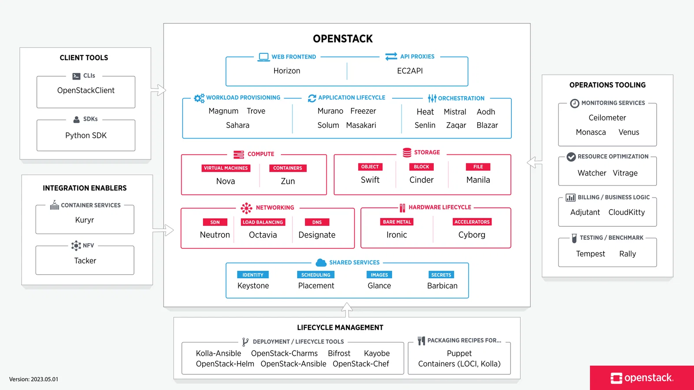

---

---
## Nova

Nova는 오픈스택의 컴퓨트 서비스로, VM의 생명 주기 관리를 담당한다. 사용자가 VM을 생성, 실행, 중지, 삭제하는 과정을 관리하며, 다양한 하이퍼바이저 기술(KVM, Xen 등)과의 연동을 지원한다. 

또한 높은 확장성을 제공하여 대규모 클라우드 환경에서의 컴퓨팅 리소스 관리를 용이하게 한다.

> [!info] 높은 확장성을 제공한다?
> Compute Node를 병렬적으로 추가하기만하면 리소스를 계속 늘릴 수 있다는 의미이다.

---
## Neutron

Neuton은 오픈스택의 네트워킹 컴포넌트로, 가상 네트워크 인프라의 구성 및 관리를 담당한다. 가상 머신 간의 네트워킹, 외부 네트워크 접근, 네트워크 서비스(로드 밸런싱, 방화벽 등)의 제공을 지원한다.

Neutron은 유연한 네트워킹 아키텍처를 통해 복잡한 멀티 테넌트 클라우드 환경에서의 네트워킹 요구사항을 충족시킨다.

> [!info] 멀티 테넌트 클라우드 환경에서의 요구사항을 충족시킨다?
> 이 말은 여러 사용자, 팀, 고객이 같은 OpenStack 인프라를 함께 사용하더라도 각자 독립된 네트워크를 가진 것처럼 안전하게 사용할 수 있어야 한다는 의미이다.
>
> Neutron은 VLAN, VXLAN 등의 네트워크 가상화 기술을 활용해 프로젝트별 네트워크를 논리적으로 분리한다. 
> 이를 통해 서로 다른 프로젝트가 동일한 사설 IP 대역을 사용하더라도 네트워크가 서로 격리되어 IP 충돌이나 불필요한 통신이 발생하지 않도록 한다.

---
## Cinder

Cinder는 영구적인 데이터 저장을 위한 블록 스토리지 서비스이다. 가상 머신에 사용되는 볼륨 관리를 담당하며, 데이터베이스, 파일 시스템, 애플리케이션에 필요한 지속적인 스토리지 솔루션을 제공한다.

Cinder는 다양한 백엔드 스토리지 기술(ex: LVM, Ceph)을 지원하며, 스냅샷 및 볼륨 복제와 같은 고급 기능을 제공한다.

---
## Swift

Swift는 대용량의 비정형 데이터를 저장하기 위한 오픈스택의 오브젝트 스토리지 시스템이다. 내구성과 확장성이 뛰어나며, 데이터는 RESTful API를 통해 접근 가능한 객체로 저장된다.

Swift는 고가용성을 보장하기 위해 데이터를 여러 위치에 자동으로 복제하며, 대규모의 데이터 저장 요구사항을 충족시킨다.

---
## Glance

Glance는 가상 머신 이미지를 등록, 저장, 검색 및 관리를 담당하는 이미지 서비스이다. 가상 머신을 생성할 때 사용되는 디스크 이미지를 관리하며, 다양한 형식(QCOW2, RAW)의 이미지를 지원한다.

Glance는 효율적인 이미지 관리를 통해 클라우드 리소스의 배포 및 재사용을 용이하게 한다.

> [!info] 효율적 관리?
> 간단히 말해서 중앙에서 VM 이미지들을 관리하기 때문에 필요할 때 마다 가져와서 쓸 수 있어 좋다는 말이다.(각 컴퓨트에서 각각 가지고 있을 필요 없다는 뜻)

---
## Keystone

Keystone은 오픈스택의 인증 및 권한 부여 서비스로, 사용자와 서비스 간, 서비스와 서비스간의 인증을 관리한다. 사용자 인증, 서비스 카탈로그 관리, RBAC 등을 제공하여, 클라우드 인프라 내의 보안을 강화한다.

Keystone은 다양한 인증 메커니즘(Password, Token, 3rd Party - ex: kerberos, MFA 등)을 지원하며, 클라우드 리소스 접근 제어의 중심 역할을 한다.

---
## Horizon

Horizon은 오픈 스택의 웹 기반 대시보드로, 사용자가 클라우드 리소스를 시각적으로 관리할 수 있게 해준다. 직관적인 사용자 인터페이스를 통해 VM 생성, 네트워킹 구성, 스토리지 관리 등의 작업을 손쉽게 수행할 수 있으며, 클라우드 환경의 전반적인 모니터링과 관리를 지원한다.

---
## 추가 컴포넌트

1. Heat
	- Heat는 OpenStack의 오케스트레이션 서비스로, 템플릿을 기반으로 여러 클라우드 자원을 자동으로 생성하고 관리한다.  
	- 예를 들어 인스턴스, 네트워크, 볼륨, 보안 그룹 등을 하나의 템플릿에 정의해두면 반복적으로 동일한 환경을 배포할 수 있다.  
	- 이를 통해 복잡한 애플리케이션 스택을 수동으로 하나씩 구성하지 않고, 코드처럼 선언적으로 관리할 수 있다.
2. Ceilometer
	- Ceilometer는 OpenStack의 텔레메트리 서비스로, 클라우드 자원의 사용량과 상태 정보를 수집한다.  
	- 인스턴스의 CPU 사용량, 네트워크 트래픽, 볼륨 사용량 같은 메트릭을 수집해 모니터링이나 사용량 분석에 활용할 수 있다.  
	- 수집된 데이터는 과금 시스템이나 알림, 용량 계획을 위한 기초 데이터로 사용된다.
3. Trove
	- Trove는 OpenStack의 데이터베이스 서비스로, 사용자가 데이터베이스 인스턴스를 쉽게 생성하고 관리할 수 있게 해준다.  
	- MySQL, PostgreSQL 같은 관계형 데이터베이스뿐만 아니라 일부 NoSQL 데이터베이스도 지원할 수 있다. 
	- 이를 통해 사용자는 직접 DB 서버를 설치하고 설정하지 않아도, OpenStack 안에서 필요한 데이터베이스 환경을 서비스 형태로 사용할 수 있다.

---
## 레퍼런스

- https://wikidocs.net/230165
- https://wikidocs.net/230172