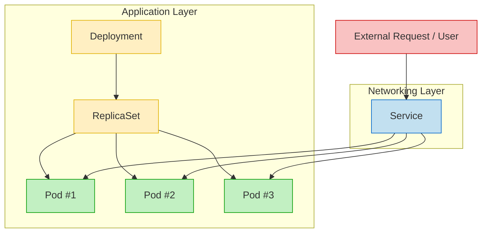
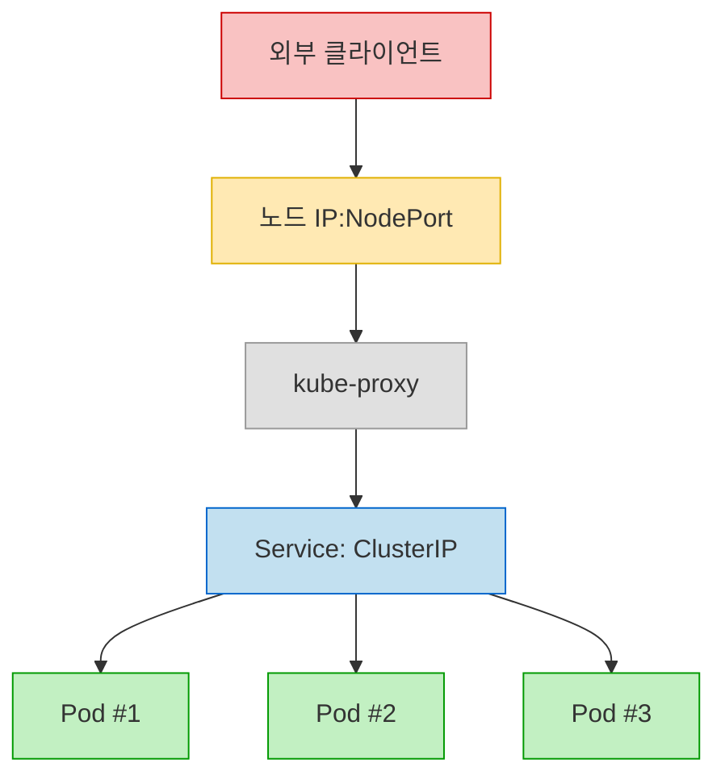

---
## Service
### Service의 역할

- `Service`는 애플리케이션 내부 구성 요소(`Pod`)와 외부 구성 요소 간 통신을 가능하게 한다.
	- 정확히 말하면 외부 -> `Pod` 통신을 가능하게 한다. (Inbound)
	- `Service`가 없어도 `Pod` -> 외부 통신은 `CNI` 플러그인(`Calico`, `Flannel` 등)에서 `SNAT`을 지원하기 때문에 가능하다.
	- `Pod`의 경우 (`CNI`로 구현된) 클러스터 내부 가상 네트워크에 속해있으며, 기본적으로는 클러스터 내부에서만 접근 가능하다.
	- 이를 외부에서 접근할 수 있게 해주는 것이 `Service`이다.
- `Service`는 애플리케이션을 다른 애플리케이션과 연결하는데 도움을 준다.
	- `Service`는 동일한 기능을 하는 여러 `Pod`를 하나의 논리적 그룹으로 묶어, 내부 또는 외부 요청을 Load Balancing하여 전달하는 주체이다.
	- 이를 통해 `Pod`가 재시작되거나 IP가 변경되어도 다른 애플리케이션은 `Service`의 DNS 이름(ex: `myapp-service.default.svc.cluster.local`)로 일관되게 접근할 수 있다.
	- 즉, `Service`는 Pod간 통신을 위한 안정적이고 일관된 네트워크 엔드포인트를 제공한다.
- `Service`는 애플리케이션 내의 마이크로서비스 간의 느슨한 결합(Loose Coupling)을 가능하게 한다.
	- 다른 역할을 하는 각 `Pod`들이 직접 연결되지 않고 `Service`라는 매개체를 두고 연결되기 때문이다.

### 헷갈리기 쉬운 부분



:::warning
관용적으로 `Service`, `Deployment`, `ReplicaSet`을 함께 사용하기 때문에, `Service`는 `Deployment`나 `ReplicaSet`에 연결되는 것 아닌가? 라고 착각하기 쉽지만, `Service`는 `Pod`에 연결되며, 일관된 연결과 로드밸런싱을 제공해줄 뿐이다.
:::


---
## Service의 유형


## NodePort
### 개념



- `Node`의 특정 포트(30000 ~ 32767)을 열어두고 해당 포트로 들어온 요청을 `Pod`들의 논리적 집합으로 포워딩(프록시) 해주는 `Service` 타입이다. (마치 포트포워딩을 하는 것 처럼)
	- `NodePort`로 들어오는 요청이 `Service`의 `ClusterIP`로 포워딩되며, `Service`는 `Pod`들로 요청을 분배한다.
- `NodePort` 타입은 기본적으로 `ClusterIP` 타입을 포함한다. 
	- `NodePort`는 사실상 `ClusterIP`의 상위 wrapper이다.

### Yaml


```yaml
apiVersion: v1
kind: Service
metadata:
  name: myapp-service
spec:
  types: NodePort
  ports:
  - targetPort: 80
    port: 80
    nodePort: 30008
  selector:
    app: myapp
    type: front-end
```

- `apiVersion`: `v1`
- `kind`: `Service`
- `spec`
	- `types`: `NodePort`
	- `ports`(Array)
		- `targetPort`: 트래픽이 최종적으로 전달될 `Pod`의 포트
			- 입력하지 않는다면 `port`와 같은 것으로 간주됨
		- `port`: `Service(ClusterIP)`가 `Pod`의 `targetPort`로 포워딩하는 포트
			- 유일한 필수 입력 요소
		- `nodePort`: `Service(ClusterIP)`와 연결되는 `Node`의 포트 (30000 ~ 32767)
			- 입력하지 않는다면 30000 ~ 32767 포트 중 가용 가능한 포트가 자동 할당됨
		- 하나의 `Service`에서 이러한 (`targetPort`, `port`, `nodePort`) 세트를 여러개 가질 수 있다.
	- `selector`
		- 여기서 `Deployment`나 `ReplicaSet`과 살짝 다르다.
		- `matchLabels`를 작성하지 않고 바로 `labels`의 `key: value`를 작성한다.

```bash
kubectl create -f service-defination.yaml
```

- yaml을 적용하여 `Service` 객체를 생성할 수 있다.
- cf) `create`와 `apply`의 차이
	- `create`는 '생성'만 담당, 만약 이미 존재할 경우 에러 생김
	- `apply`는 '변경사항 적용'을 담당, 존재하지 않을 경우 새로 생성하고, 존재할 경우 변경 사항이 있다면 반영, 변경 사항이 없다면 유지한다.

```bash
kubectl get services
```

- default 네임스페이스의 `Service`들을 조회한다.

### 다중 노드 환경 아키텍처


- 모든 `Node`의 해당 포트가 `Service`로 연결되며, `Service`는 `Pod`들로 트래픽을 분배한다.

---
## ClusterIP
### 개념


- 애플리케이션 내에서 여러 시스템이 서로 통신해야하는 경우가 있다. (프론트엔드-백엔드, 백엔드-데이터베이스, 메시지 큐 등)
- 클러스터 내에서 `Pod` 간 통신은 각 `Pod`의 IP를 통해서 가능하지만, `Pod`의 IP는 고정되지 않기 때문에 안정적인 통신 엔드포인트로 사용하기 어렵다.
- 또한 예를 들어 백엔드 `Pod`가 3개 있다고 했을 때, 프론트엔드 `Pod`는 어떤 백엔드 `Pod`와 통신해야하는지 판단하기 여렵다. (부하 분산이나 가용성을 고려할 수 없기 때문)
- 이러한 문제를 해결해주는 객체가 `Service`이다.
- 이러한 내부 시스템간 통신은 외부로 노출시킬 필요가 없으며, 오히려 노출 시 보안적 위험성만 커질 수 있다. 이처럼 클러스터 내부에서만 통신하도록 설정하는 `Service` 타입이 `ClusterIP`이다.

### Yaml

```yaml
# service-definition.yaml
apiVersion: v1
kind: Service
metadata:
  name: back-end
spec:
  types: ClusterIP
  ports:
  - targetPort: 80
    port: 80
  selector:
    app: myapp
    type: back-end
```

- `spec`
	- `types`: `ClusterIP`
	- `ports`
		- `targetPort`와 `port`만 존재한다.
- 나머지는 `NodePort` 타입과 같다.

```bash
kubectl create -f service-definition.yaml
```

- 작성한 yaml 파일을 적용하여 `ClusterIP` 타입 `Service` 를 생성한다.

```bash
kubectl get services
```

- default 네임스페이스의 `Service` 객체들을 조회한다.

---
## LoadBalancer
### 개념

- 외부에서 애플리케이션에 접근할 때, `NodePort` 타입의 `Service`를 사용할 수도 있지만, 이 방식에는 몇가지 한계가 있다. 
- 첫번째로, 사용자는 `http://192.168.56.70:30035`와 같은 주소보다는 도메인 기반 URL로 접근하기를 원한다. (물론, 도메인을 구매하고 DNS 설정을 통해 매핑할 수는 있지만, 비용과 관리의 책임이 들어나며, 여전히 두번째 문제점을 해결하지 못한다)
- 두번째로, `NodePort`는 클러스터 내 여러 노드 중 하나의 노드 주소와 포트를 통해 접근한다. 예를 들어 노드가 3개(`192.168.56.70`, `192.168.56.71`, `192.168.56.72`)라면, 사용자는 이 중 하나로 직접 접근해야 한다. 특정 노드가 장애를 일으키거나 과도한 트래픽을 받는 경우 요청을 자동으로 다른 노드로 분산할 수 없다.
- 이러한 문제를 해결하기 위해 별도의 VM을 생성하여 `HAProxy`나 `Nginx` 같은 소프트웨어 로드밸런서를 직접 구축할 수도 있다. 하지만 이 경우 추가적인 인프라 리소스 및 운영 관리 비용이 발생한다.
- 이를 해결하기위해 `GCP`, `AWS`, `Azure`와 같은 클라우드 플랫폼에서는 해당 클라우드 플랫폼의 Native Load Balancer를 제공하며, Kubernetes는 이러한 클라우드 플랫폼의 Native Load Balancer와의 통합을 지원한다.
- 단순히 `Service`의 타입을 `LoadBalancer`로 바꾸기면 해도 Kubernetes가 클라우드의 네이티브 로드밸런서를 자동으로 프로비저닝하여 외부 트래픽을 분산시켜 주며 해당 로드밸런서로 진입하기 위한 URL또한 부여해준다. (물론 환경에 따라 추가적인 설정이 어느정도 필요한 경우도 있다)
- 하지만, 이는 이를 지원하는 클라우드 플랫폼에서만 가능하다. 지원하지 않는 플랫폼에서 구성한다면 `NodePort`와 다를 것이 없으며 `Node` 레벨의 로드밸런싱 기능도 수행하지 않는다.

### Yaml

```yaml
# service-definition.yaml
apiVersion: v1
kind: Service
metadata:
  name: myapp-service
spec:
  types: LoadBalancer
  ports:
  - targetPort: 80
    port: 80
    nodePort: 30008
  selector:
    app: myapp
    type: front-end
```

- `spec`
	- `types`: `LoadBalancer`

---
## 레퍼런스

- [https://kubernetes.io/docs/concepts/services-networking/service/](https://kubernetes.io/docs/concepts/services-networking/service/)
- [https://kubernetes.io/docs/tutorials/kubernetes-basics/expose/expose-intro/](https://kubernetes.io/docs/tutorials/kubernetes-basics/expose/expose-intro/)
- Udemy - Certified Kubernetes Administrator (CKA) with Practice Tests (Mumshad)
