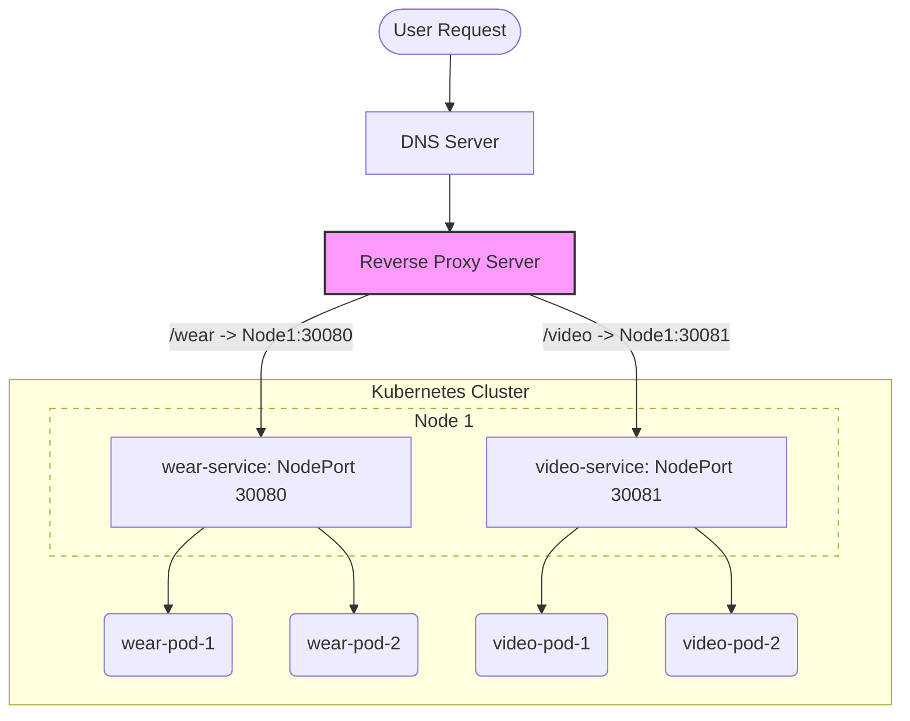
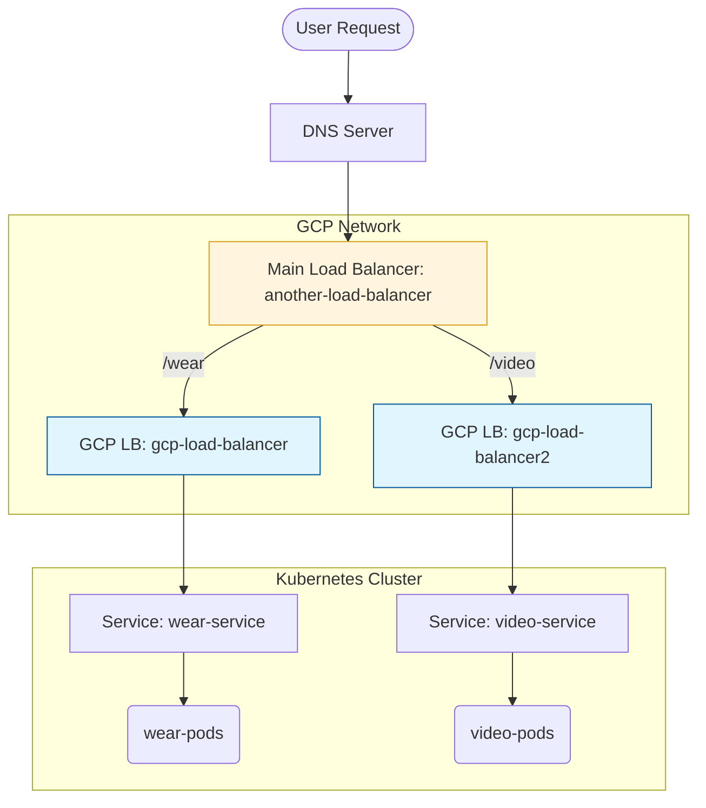
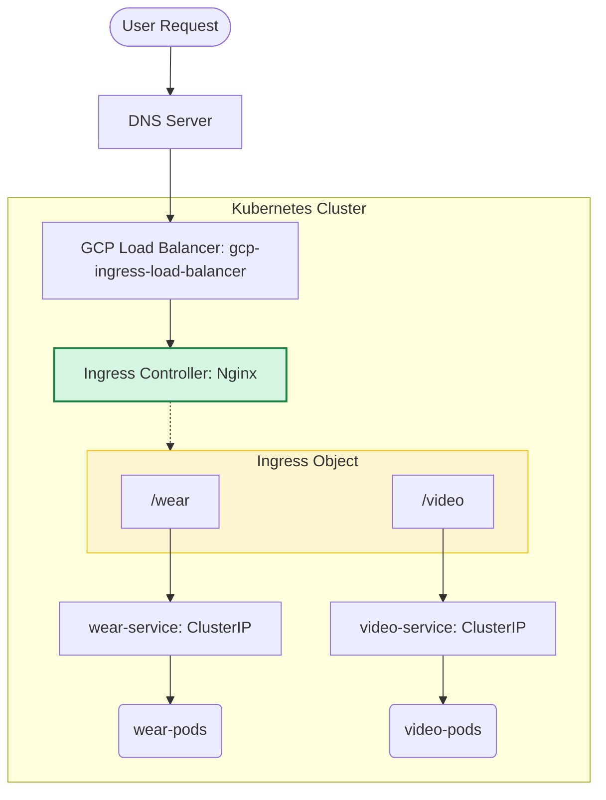

---
## Ingress 배경
### 시나리오

- `www.my-online-store.com` 이라는 서비스를 운영하고 있다고 하자.
- `wear-service`라는 의류 서비스가 `www.my-online-store.com/wear` 에서 운영되어야한다.
	- `replica` 3개
- `video-service`라는 동영상 서비스가 `www.my-online-store.com/video` 에서 운영되어야한다.
	- `replica` 3개
- GCP 환경이다.

### 구성 (NodePort)



- `wear-service`라는 `NodePort` 타입의 `Service`를 생성해서 외부에 노출시킨다.
	- 30080 포트라고하자.
- `video-service`라는 `NodePort` 타입의 `Service`를 생성해서 외부에 노출시킨다.
	- 30081 포트라고 하자.
- 외부에 리버스 프록시 서버를 배치해서 경로별로 맞는 포트로 포워딩한다.
	- `/wear` -> 30080포트, `/vidoe` -> 30081포트
- DNS서버에 `www.my-online-store.com`으로 오는 요청을 리버스프록시 서버로 보내게 설정한다.
- 단점
	- '특정 노드'의 노드포트로 접근해야하므로, 리버스 프록시 서버에 설정해둔 노드가 장애가 날 경우 이를 복구하기위해 수동으로 서버 설정을 변경해야한다.

### 구성 (Load Balancer)



- `wear-service`라는 `LoadBalancer` 타입의 `Service`로 GCP 로드밸런서(L4)를 프로비저닝한다.
	- 로드밸런서의 도메인은 `gcp-load-balancer`라고 하자.
- `video-service`라는 `LoadBalancer` 타입의 `Service`로 GCP 로드밸런서(L4)를 프로비저닝한다.
	- 로드밸런서의 도메인은 `gcp-load-balancer2`라고 하자.
- `www.my-online-store.com`이라는 하나의 도메인을 사용하면서 `/wear`, `/video` 경로로 서비스를 나눠서 접속하게 하고싶다면 또 새로운 로드밸런서를 만들어서 각 경로에 따라 요청을 배분한다.
	- 이 로드밸런서의 도메인은 `another-load-balancer`라고 하자.
	- `another-load-balancer`
	- `/wear` -> `gcp-load-balancer`, `/video` -> `gcp-load-balancer2`
- DNS서버에 `www.my-online-store.com`으로 오는 요청을 `another-load-balancer`로 보내게 설정한다.
- 단점
	- 서비스가 늘어날 때마다 로드밸런서를 계속 새로 만들어야 하므로 비용이나 관리의 복잡성이 늘어난다.

### 구성 (Ingress)



- `Ingress Controller`를 설치한다. (ex: `Nginx`)
	- 직접 요소(`Deployment`, `Service`, `ConfigMap` 등) 하나하나 설치 or `Helm`으로 설치
	- `Ingress Controller`의 `Service` 타입은 `LoadBalancer`라고 하자.
	- 이 로드밸런서의 도메인은 `gcp-ingress-load-balancer`라고 하자.
- `wear-service`라는 `ClusterIP` 타입의 `Service`를 생성한다.
- `video-service`라는 `ClusterIP` 타입의 `Service`를 생성한다.
- `Ingress` 객체를 생성한다.
	- `/wear` -> `wear-service.default.svc.cluster.local`
	- `/video` -> `video-service.default.svc.cluster.local`
- DNS서버에 `www.my-online-store.com`으로 오는 요청을 `gcp-ingress-load-balancer`로 보내게 설정한다.
- `NodePort`와 `LoadBalancer`에서 존재했던 단점들이 `Ingress`로 해결되었다.

---
## Ingress 구성 요소
### Ingress Controller

- 쿠버네티스에는 기본적으로 `Ingress Controller`가 내장되어 있지 않다. 이에 반드시 별도로 설치해야 한다. (`Nginx`, `HAProxy`, `Traefik`, `Istio` 등)
- `Deployment(Pod)`, `Service`, `ConfigMap`(`Nginx` 설정 등이 여기 들어감), `ServiceAccount`(권한)로 구성된다. -> `Helm`으로 설치
- 즉, L7 로드밸런서 역할을 해주는 것이다.
### Ingress Resource

- 어떤 트래픽을 어디로 보낼지 정의한 YAML 파일이다.
- 추가적으로 TLS/SSL 설정도 여기서 할 수 있다.
- `Ingress Controller`가 `Ingress` 리소스를 읽고 요청을 분배한다.
- 아래 예시에서 자세히 다룸

---
## Ingress 설정 예시
### 경로 기반

```yaml
apiVersion: networking.k8s.io/v1
kind: Ingress
metadata:
  name: path-ingress
  annotations:
    nginx.ingress.kubernetes.io/rewrite-target: /
spec:
  rules:
  - host: myonlinestore.com
    http:
      paths:
      - path: /wear
        pathType: Prefix
        backend:
          service:
            name: wear-service
            port:
              number: 80
      - path: /video
        pathType: Prefix
        backend:
          service:
            name: video-service
            port:
              number: 80
  tls:
  - hosts:
    - myonlinestore.com
    secretName: my-tls-secret
```

- `annotations`
	- `nginx.ingress.kubernetes.io/rewrite-target`
		- 우리가 원하는 것은 `http://<ingress-service>:<ingress-port>/watch` -> `http://<watch-service>:<port>/` 인데
		- `rewrite-target`이 없다면 `http://<ingress-service>:<ingress-port>/watch` -> `http://<watch-service>:<port>/watch` 이렇게 가버린다.
		- 이에 `rewrite-target` 설정을 해줘야 한다.
		- 다만, 위처럼 설정하면 `/wear/account`로 요청이 들어와도 `/account`로 가는 것이 아니라 강제로 `/`로 보낸다.
		- 정규표현식을 활용하면 이를 해결할 수 있다. 
			- `nginx.ingress.logging.io/rewrite-target: /$2`
			- `path: /something(/|$)(.*)

### 도메인 기반

```yaml
apiVersion: networking.k8s.io/v1
kind: Ingress
metadata:
  name: host-ingress
spec:
  rules:
  - host: wear.myonlinestore.com
    http:
      paths:
      - path: /
        pathType: Prefix
        backend:
          service:
            name: wear-service
            port:
              number: 80
  - host: video.myonlinestore.com
    http:
      paths:
      - path: /
        pathType: Prefix
        backend:
          service:
            name: video-service
            port:
              number: 80
  tls:
  - hosts:
    - myonlinestore.com
    secretName: my-tls-secret
```

- 도메인 기반은 `rewrite-target`이 필요 없는 경우가 많다.

---
## 레퍼런스

- https://kubernetes.github.io/ingress-nginx/deploy/#quick-start
- https://kubernetes.io/ko/docs/concepts/services-networking/ingress/
- Udemy - Certified Kubernetes Administrator (CKA) with Practice Tests (Mumshad)