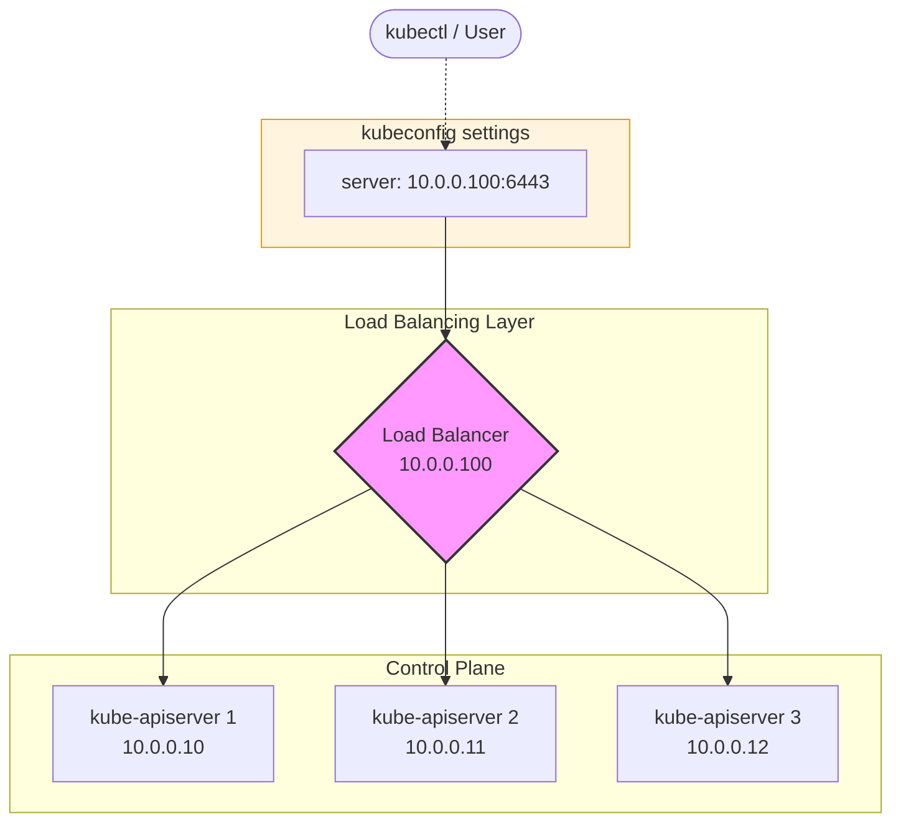

---
## HA(High Availability) 개요

- 워커노드가 다운되더라도 해당 애플리케이션이 `ReplicaSet`으로 구성되었다면 자동으로 쿠버네티스 컨트롤러가 다른 노드에 `Pod`를 생성하면서 해당 애플리케이션의 상태를 유지시켜준다.
- 마스터 노드가 다운되더라도 워커 노드에서 실행 중인 기존 애플리케이션은 계속 작동한다.
- 하지만, 다음과 같은 관리 및 유지보수 기능이 중단된다.
	- 워커 노드의가 다운되거나 파드가 Crash 되어도 이를 감지하고 재생성할 컨트롤러 매니저가 없다.
	- 새로운 파드를 생성하거나 적절한 노드에 배치할 스케줄러가 없다.
	- `kubectl` 명령어나 API를 통한 설정 변경, 상태 확인이 불가능하다.
- 따라서 운영 환경에서는 SPOF(Single Point of Failure)를 제거하기 위해 마스터 노드를 다중화하는 HA 구성이 필수적이다.

---
## 컨트롤 플레인 컴포넌트별 HA 전략
### API 서버 (Active-Active)



- `kube-apiserver`는 받은 요청을 각 구성요소와 상호작용하는 Stateless 방식이므로, 여러 마스터 노드에서 동시에 가동되어도 문제가 없다.
- 로드 밸런싱
	- 이에 `kubectl`이나 외부 요청이 특정 마스터 노드의 `kube-apiserver`에 집중되지 않도록 `Nginx`, `HAProxy`와 같은 로드 밸런서를 전면에 배치한다.

```yaml
apiVersion: v1
kind: Config
clusters:
- cluster:
    certificate-authority-data: <CA_CERT_DATA>
    # 로드 밸런서(Nginx/HAProxy)의 가상 IP 또는 도메인 주소
    server: https://10.0.0.100:6443
  name: kubernetes
```

- 위처럼 `kubectl`을 위한 `./.kube/config` 파일에 로드밸런서 주소를 넣어주면 된다.


### 컨트롤러 매니저 & 스케줄러 (Active-Standby 방식)

- 컨트롤러 매니저와 스케줄러는 클러스터 상태를 감시(Watch)하고 액션을 취한다.
- 따라서 여러 대가 동시에 작동하면 중복된 `Pod`를 생성하는 등의 충돌이 발생할 수 있으므로, 한 번에 하나의 인스턴스만 활성화되어야 한다.
- 리더 선출
	- 각 Static Pod yaml 파일(`/etc/kubernetes/manifests`) `--leader-elect=true` 옵션을 사용하여 구현한다.
	- 컴포넌트들(컨트롤러 매니저, 스케줄러)이 실행될 때 쿠버네티스 엔드포인트 객체에 Lock을 걸어 Lease(임대)를 얻으려고 시도한다.
	- 가장 먼저 Lock을 획득한 인스턴스가 리더(Active)가 되고, 나머지는 대기(Standby) 상태가 된다.
	- 리더가 일정 시간(디폴트 설정 15초) 동안 갱신을 못하면 대기 중인 다른 인스턴스가 리더 자리를 이어 받는다.

:::tip
아니 서로 다른 마스터 노드에서 해당 옵션만 활성화 한다고 이 락이 어떻게 구현되는거지? 중앙에 어떤 락 구현체가 있나?
-> 그렇다. 락을 얻을 때 `kube-apiserver`에 락을 얻겠다고 요청을 보낸다. 그리고 `kube-apiserver`는 `etcd`에 이 요청을 전달한다. `etcd`는 Strong Consistency를 보장하므로 동시에 여러 요청이 들어와도 단 하나의 Lock만 보장한다.
:::

### ETCD 데이터 베이스 토폴로지

|**구분**|**Stacked etcd (중첩형)**|**External etcd (외부형)**|
|---|---|---|
|**특징**|마스터 노드 내부에 etcd를 함께 설치|별도의 전용 서버에 etcd 클러스터 구축|
|**장점**|설정이 간편하고 필요한 노드 수가 적음|제어 평면 장애가 데이터에 영향을 주지 않음 (더 안전함)|
|**단점**|노드 한 대 장애 시 컨트롤 플레인과 데이터가 동시에 소실됨|더 많은 서버 자원이 필요하고 설정이 복잡함|

- 이에 대해서는 다룰 내용이 많아 다음 글에서 자세히 다룸

:::tip
ETCD 토폴로지를 외부에 배치 컨트롤 플레인 내부에 배치햇을 때 외부에 배치하면 컨트롤 플레인 배치시보다 데이터가 안전하다는데 내부에 배치해도 어짜피 클러스터로 고가용성을 띠면 다른 노드의 ETCD에서 보장하는거 아니야?
- 맞는 말이다. 하지만 이러한 구조는 결정적으로 컨트롤 플레인의 부하가 데이터 저장소에 직접 영향을 줄 수 있는 구조이다. (웹에서의 web-was-db 가 3계층으로 분리되어있는 이유를 생각해보자)
- External etcd가 더 안전한 이유
	- 리소스 간섭 차단: API 서버에 과부하가 걸려 마스터 노드가 버벅거려도 별도 노드에 있는 `etcd`는 영향을 받지 않고 데이터 무결성을 유지한다.
	- 노드 손실 대비: 마스터 노드 3대가 물리적으로 다 고장 나는 최악의 상황이 발생해도 데이터(`etcd`)는 별도 서버에 살아있으므로 새 마스터 노드를 띄워 즉시 복구하기가 훨씬 수월하다.
	- 확장성: `etcd` 노드만 5대로 늘리거나 하드웨어 사양을 따로 높이는 등 유연한 대처가 가능하다.
:::

---
## 레퍼런스

- Udemy - Certified Kubernetes Administrator (CKA) with Practice Tests (Mumshad)