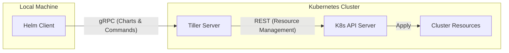
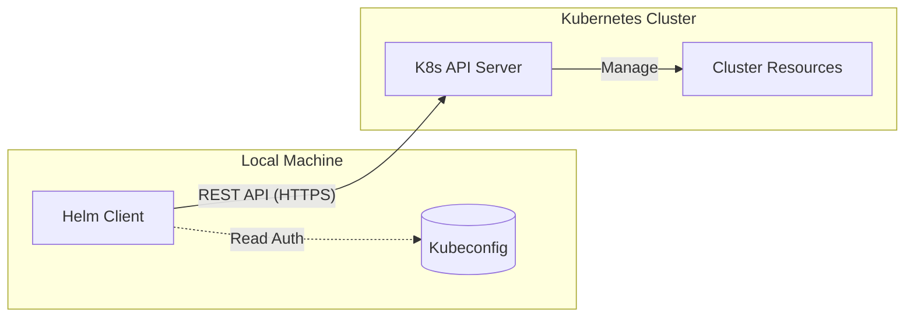
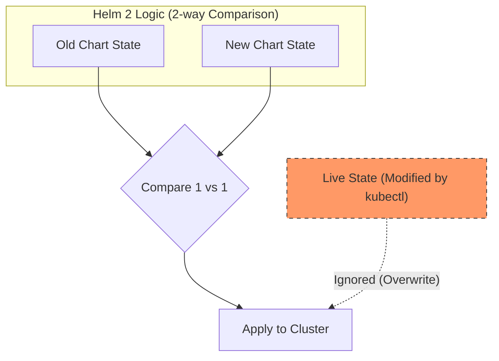
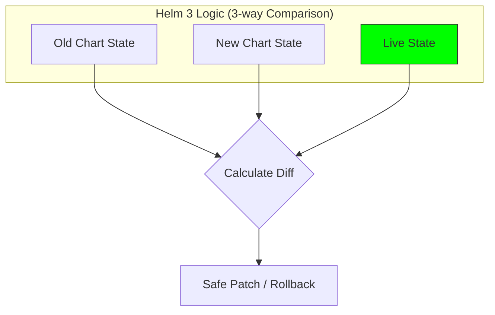

---
## Helm 2 vs Helm 3
### Tiller의 제거

- `Helm 2`에서는 `Helm` 클라이언트가 클러스터 내부에 설치된 `Tiller`라는 서버 컴포넌트와 통신하고, `Tiller`가 다시 `kube-apiserver`와 통신하여 명령을 수행했습니다.
- 문제점
	- `Tiller`는 기본적으로 클러스터 내에서 'God Mode(관리자 권한)'로 실행되었습니다. 따라서 `Tiller`에 접근 가능한 사용자는 권한과 상관없이 클러스터 내에서 무엇이든 할 수 잇는 보안 취약점이 있었습니다.

- `Helm 3`에서는 이러한 `Tiller`가 완전히 제거되었으며 `Helm` 클라이언트가 직접 `kube-apiserver`와 통신합니다.
- 개선점
	- 쿠버네티스의 기본 기능인 RBAC에 기반해 `Helm`을 사용하는 사용자의 권한만큼만 `Helm` 명령어를 적용할 수 있으므로 보안적으로 훨씬 안전해졌다.

### 개선된 업그레이드, 롤백 (3-Way Strategic Merge Patch)

- `Helm 2`에서는 업그레이드와 롤백을 진행할 때 항상 '이전 차트'와 '새로운 차트' 두 가지만 비교한다. (2-way 비교)
- 문제점
	- 사용자가 `kubectl` 등을 통해 수동으로 클러스터 설정을 변경한 경우(예: 이미지 태그)에 `Helm`은 이를 인지하지 못한다.
	- 이에 롤백이나 업그레이드 시 수동 변경 사항이 무시되거나 의도치 않게 덮어씌워질 수 잇다.

- `Helm 3`에서는 '이전 차트'와 '새로운 차트', 그리고 'Live State(현재 클러스터의 실제 상태)' 세가지를 모두 비교한다.
- 개선점
	- 사용자가 수동으로 변경한 사항(Live State)을 감지하여 롤백 시 원래대로 되돌리거나 업그레이드 시 사용자의 변경 사항을 보존하면서 안전하게 패치를 진행한다.

---
## 레퍼런스

- https://kodekloud.com/blog/helm2-vs-helm3/
- Udemy - Certified Kubernetes Administrator (CKA) with Practice Tests (Mumshad)