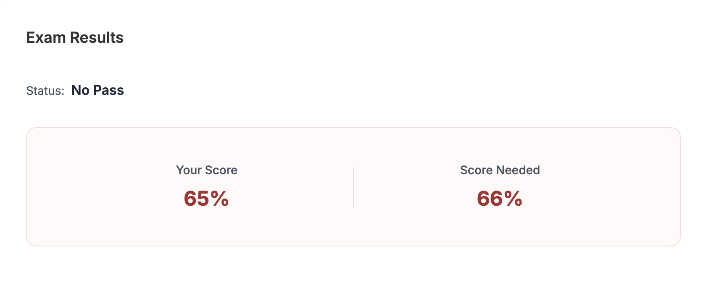

---
## 시험 후기

시험 준비는 아래와 같은 과정으로 준비했다.

- CKA 뭄샤드 강의 수강
- 뭄샤드 강의 - Lightening Room
- 뭄샤드 강의 - Mock Exam 1, 2, 3
- Killer.sh 1

시험 환경 점검은 생각보다 빡쌘 편이다. 이것저것 많이 요구한다.

시험 난이도는 처음에는 너무 쉬운데? 이러면서 풀다가 점점 아.. 이거 아는데.. 뭐더라.. 이러면서 못푸는 문제가 몇개 있었고 아예 생소한 것도 조금 있었다. 그래서 16문제중에 4.5문제를 못풀었다. (0.5는 2가지 요구사항 중 1가지만 풀었다.)

CKA 문제는 문제마다 점수가 상이하다고 알고있기 때문에, 아.. 이거 떨어질 확률이 높겠는데..? 라고 생각은 하고 있었다. 그리고 다음날 결과가 나왔다.



66점 커트라인에 65점 ㅋㅋㅋㅋㅋㅋㅋㅋ
어느정도 아쉬운 결과를 예상하긴했지만 이런 결과가 나오니 좀 짜증이 났다.
하지만 나의 부족한 점을 채울 수 있는 결과라고 긍정적으로 생각하기로 했다.

CKA 시험은 다행이 기회를 1번 더 준다.
이에 못풀었던 문제를 복기하고 Killercoda 문제도 좀 풀고 Killer.sh2도 풀고 재시험을 쳐야겠다.

---
## 못푼 문제 복기
### Q1

Q1)
Deployment의 특정 Pod가 리소스 부족(3개 중 1개)으로 실행되지 않고있는데, 트러블 슈팅을 해서 모든 Pod가 정상적으로 실행되게 해라 (limit는 수정하지 말고)

A1)
일반적으로 아래 3가지 경우 중 하나이다.
1. 다른 workload scale-down 또는 제거
	- 다른 Namespace/Deployment에서 리소스를 많이 쓰는 Pod를 찾아 replica 수를 줄여서 Pending Pod가 들어갈 공간을 만든다.
	- 예: `kubectl scale deploy heavy-app -n project-x --replicas=0`
2. 새 노드 추가
	- CKA 환경에서는 미리 준비된 worker 노드를 `kubeadm join` 해서 추가하는 시나리오가 섞이기도 한다.
	- 새 노드가 Ready 되면 스케줄러가 Pending Pod를 새 노드에 올려서 3/3 Running 달성.
3. (문제에서 허용하면) QoS나 LimitRange/ResourceQuota 조정
	- Namespace에 설정된 LimitRange/ResourceQuota 때문에 과도한 requests가 예약되어 pending이 되는 경우, 해당 정책을 수정해 여유를 만든다.


### Q2

Q2)
(절반은 풀고 절반은 못품)
1. ~~certmanager의 crd 목록 저장~~ (이건 풀었음)
2. certmanager의 certificate crd에서 subject에 정의된 document들을 모두 저장

A2)
cert-manager operator에 certificate라는 리소스가 있는지 몰라서 문제자체(영어)를 잘 해석하지 못한 것 같다.
아래 커맨드를 순차적으로 쓰면서 문제를 해결하면 될 것 같다.

```bash
kubectl explain certificate
kubectl explain certificate.spec
kubectl explain certificate.spec.subject

kubectl explain certificate.spec.subject --recursive > /root/subject-docs.txt
```


### Q3

Q3)
gateway 만들고 httproute 만드는 문제 (Ingress에서 마이그레이션)

A3)
거의 다 풀었는데 curl로 테스트를 했을 때 테스트를 완료하지 못했다. Ingress에 있는 Prefix 옵션을 httpRoute로 옮기는 와중에 `.spec.rules.matches.path.type`를 `PathPrefix`를 해야하는데 `Exact`로 했나? 무튼 그래서 통신이 제대로 안됐던 것 같다.

그리고 tls 관련해서 좀 시간이 오래걸렸는데 이를 정리하면 다음과 같다.
- Ingress의 `spec.tls[]`의 `secretName: test-secret` -> Gateway의 `spec.listeners[].tls`의 `certificateRefs`의 `kind: Secret`, `name: test-secret` 으로 지정한다.


### Q4

Q4)
argocd helm 에서 crd를 설치하지 않는 옵션의 chart를 yaml로 저장

A4)
나는 `helm pull`하고 압축 해제하고 거기서 뭘 바꾸지 이러면서 고민을 했는데 그런게 아니었다.

그냥 다음 명령어를 입력하면 된다. `--skip-crds` 는 문제에서 링크걸어준 곳에서 볼 수 있었다.

```bash
helm template my-argocd argo/argo-cd --namespace argocd --create-namespace --skip-crds > argocd.yaml
```


### Q5

Q5)
문제 자체는 모든 Pod가 정상 작동하게 하라는 문제이다. 

그래서 `kubectl get all` 하면  kubectl이 작동하지 않는다.
- etcd주소가 apiserver 설정에 잘못되어잇길래 고쳣는데 이 이후에도 안된다.
	- cf) apiserver의 advertise 어쩌구에는 포트 없는게 맞다.
- crictl 도 안먹혓다

A5)
당시 문제를 풀 때는 `kubectl get all` 했는데 kube-apiserver에 이상이 있어 응답이 오지 않는다. 이에 여러 설정들을 봤는데 `etcd` 주소가 `apiserver` 설정에 잘못 설정되어있어서 이를 고쳤다.

근데 그래도 안고쳐진다. 그래서 `crictl ps`를 해봤는데 이 명령어도 안된다.

여기까지는 나도 했는데 여기서 포기했다 시간이 흘러가는데 솔루션이 안떠올라서..

근데 이때 컨테이너 런타임 이상을 생각해봐야한다. 나는 컨트롤 플레인에 문제가 생겼다에 꽂혀서 컨테이너 런타임 문제를 생각을 못했다.
아래 명령어들로 점검해보자.

```bash
systemctl status kubelet
// 이상이 있을 경우
systemctl start kubelet
systemctl enable kubelet


systemctl status containerd
// 이상이 있을 경우
systemctl start containerd
systemctl enable conntainerd


systemctl status crio
// 이상이 있을 경우
systemctl start crio
systemctl enable crio
```

또 생각해야할게 나는 자꾸 kubelet 설정 파일 위치를 까먹는데, `systemd`로 실행되는 서비스들은 `status` 명령어로 설정파일 위치를 알 수 있다.
즉, `systemctl status kubelet` 해보면 된다.

---