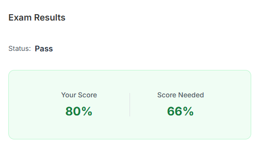

---
## 자격증 취득 후기

1차 시험에서 1점차이로 떨어진 이후에 바로 다음날 시험 접수를 했다.

못풀었던 문제를 복기해서 어떻게 풀었어야 했을까? 어떤 부분이 부족했을까? 복기하고 보완했다.
부족했던 Helm, 트러블슈팅 부분에서 Killercoda 사이트에서 여러가지 경우의 수를 해보며 보완했다.

총 공부 기간은 2달 가까이 됐던 것 같다. 기존에 쿠버네티스는 여러 프로젝트에서 사용해보았지만, 해당 프로젝트들을 진행하는데 필요했던 지식정도들만 공부했어서 빈틈이 많았다.

시험 '만'을 목표로 했다면, 1달안에 가능했을 것 같다. 근데 중간에 배운걸 자꾸 써먹고싶어서 뭄샤드 강의에서 한 챕터를 들으면 그걸로 뭘 만들어보고 적용해보고 하느라고 기간이 좀 길어졌던 것 같다.

이번 시험에서도 모든 문제를 다 풀었던 건 아니고 1문제를 못풀었다.  컨트롤플레인 트러블슈팅 문제였는데, kube-apiserver 설정에 etcd url이 잘못되어있어서 이를 고쳤다. 이후에도 문제가 고쳐지지 않길래 kubelet과 컨테이너 런타임의 상태도 확인했지만 문제가 없었다.

그래서 해당 1문제를 제외하고는 다 풀었다. 복기를 해보면 아마 그 1문제에서 인증서쪽을 확인해볼걸 그랬다.

CKA 자격증을 획득했다고 쿠버네티스를 잘하냐? 그건 아닌 것 같다. 이 자격증은 저는 쿠버네티스의 기본적인 개념들은 알고있어요 ~ 정도이지 잘한다는 의미는 아닌 것 같다. 그래도 자격증을 준비하면서 겉핥기식으로 알고있던 지식들을 많이 채워서 보람있었다.

