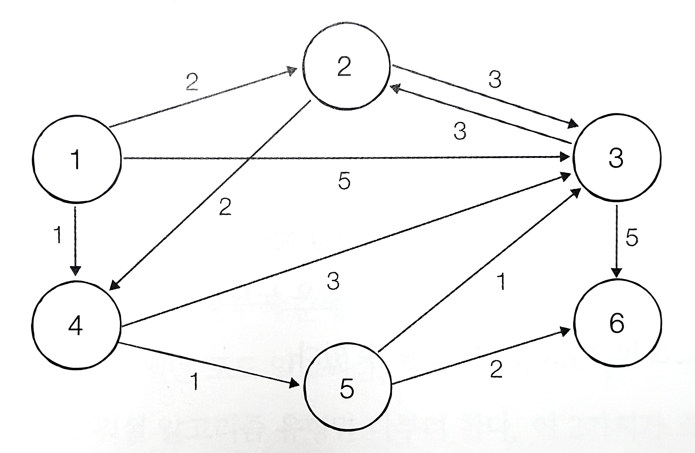
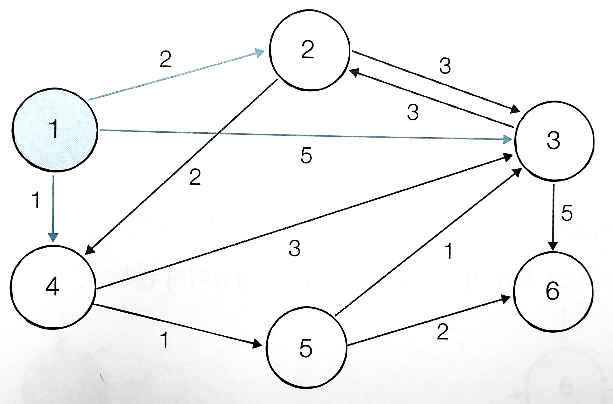
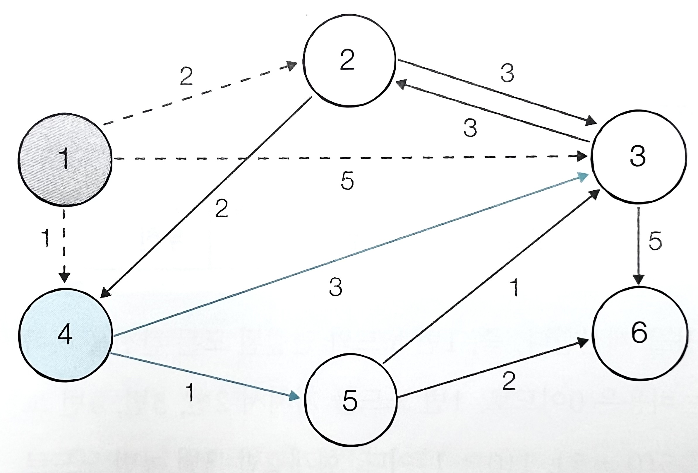
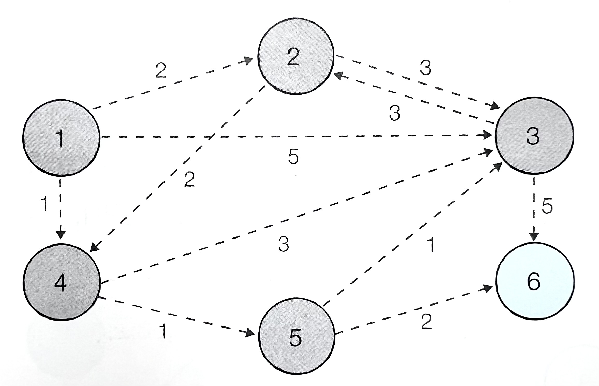

---
:::tip
최단 경로 문제 판단 기준

1. 가중치가 없는(가중치 모두 같은) 최단경로 -> BFS(Flood Fill)
2. 가중치 있음 -> 하나의 정점에서 다른 목적지들까지의 최소경로 -> 가중치 양수만 -> 다익스트라(Dijkstra)
3. 가중치 있음 -> 하나의 정점에서 다른 목적지들까지의 최소경로 -> 가중치 음수 존재 -> 벨만-포드(Bellman-Ford)
4. 가중치 있음 -> 모든 정점에서 다른 모든 정점들까지의 최소경로 -> 플로이드-워셜(Floyd-Warshall)
:::

---
## 동작 원리
### 개념

1. 출발 노드를 설정
2. 출발 노드를 기준으로 각 노드의 최소 비용을 저장 (출발 노드 기준으로 이어진 간선 길이 저장)
	- 인접 리스트의 출발 노드의 인덱스에 해당 위치와 연결된 노드들 넣음
3. 방문하지 않은 노드 중에서 가장 비용이 적은 노드를 선택한다. (`PriorityQueue`)
4. 해당 노드를 거쳐서 특정한 노드로 가는 경우를 고려하여 최소 비용을 갱신
	- ex) <span style={{color: 'red'}}>A에서 C를 바로 가는 것과 A에서 B를 거쳐서 C를 가는 것의 거리를 비교해서 더 작은 비용 갱신</span>
5. 3번 ~ 4번 반복

### 예시



| 노드 번호 | 1   | 2   | 3   | 4   | 5   | 6   |
| ----- | --- | --- | --- | --- | --- | --- |
| 거리    | 0   | Inf | Inf | Inf | Inf | Inf |

1. 출발 노드를 1이라고 하자. 이 때 <span style={{color: 'red'}}>다른 모든 노드로 가는 최단 거리를 Inf로 초기화</span> 한다.




| 노드 번호 | <span style={{color: 'red'}}>1</span> | 2                                     | 3                                     | 4                                     | 5   | 6   |
| ----- | ------------------------------------- | ------------------------------------- | ------------------------------------- | ------------------------------------- | --- | --- |
| 거리    | 0                                     | <span style={{color: 'red'}}>2</span> | <span style={{color: 'red'}}>5</span> | <span style={{color: 'red'}}>1</span> | Inf | Inf |

2. 1번 노드를 거쳐 다른 노드로 가는 비용을 계산한다.
	- 현재 2번 3번 4번 노드로 가는 비용이 현재의 비용 즉, Inf보다 작으므로 갱신한다.
	- 방문하지 않은 노드 중 거리가 가장 짧은 노드인 4번 노드를 선택한다.




| 노드 번호 | 1(방문) | 2   | 3                                     | <span style={{color: 'red'}}>4</span> | 5                                     | 6   |
| ----- | ----- | --- | ------------------------------------- | ------------------------------------- | ------------------------------------- | --- |
| 거리    | 0     | 2   | <span style={{color: 'red'}}>4</span> | 1                                     | <span style={{color: 'red'}}>2</span> | Inf |

3. 4번 노드를 거쳐 갈 수 있는 노드 (3번 노드, 5번 노드)로 가는 비용을 계산한다.
	- 현재 3번 노드로 가는 비용이 4로 기존의 5보다 작으므로 갱신하고, 5번 노드로 가는 비용이 2로 기존의 무한보다 작으므로 갱신한다.
	- 거리가 <span style={{color: 'red'}}>가장 짧은 노드는 2번 노드와 5번 노드이지만 일반적으로 번호가 작은 노드부터 방문</span>한다.
	- 방문하지 않은 노드 중 거리가 가장 짧은 노드인 2번 노드를 선택한다.


| 노드 번호 | 1(방문) | <span style={{color: 'red'}}>2</span> | 3   | 4(방문) | 5   | 6   |
| ----- | ----- | ------------------------------------- | --- | ----- | --- | --- |
| 거리    | 0     | 2                                     | 4   | 1     | 2   | Inf |

4. 2번 노드를 거쳐 갈 수 있는 노드 (3번 노드, 4번 노드는 이미 방문했으니 제외)로 가는 비용을 계산한다.
	- 현재 3번 노드로 가는 비용이 5으로 기존의 4보다 크므로 갱신하지 않는다.
	- 방문하지 않은 노드 중 거리가 가장 짧은 노드인 5번 노드를 선택한다.


| 노드 번호 | 1(방문) | 2(방문) | 3                                     | 4(방문) | <span style={{color: 'red'}}>5</span> | 6   |
| ----- | ----- | ----- | ------------------------------------- | ----- | ------------------------------------- | --- |
| 거리    | 0     | 2     | <span style={{color: 'red'}}>3</span> | 1     | 2                                     | 4   |

5. 5번 노드를 거쳐 갈 수 있는 노드 (3번 노드, 6번 노드)로 가는 비용을 계산한다.
	- 현재 3번 노드로 가는 비용이 3으로 기존의 4보다 작으므로 갱신하고, 6번 노드로 가는 비용은 4로 기존의 무한보다 작으므로 갱신한다.
	- 방문하지 않은 노드 중 거리가 가장 짧은 노드인 3번 노드를 선택한다.


| 노드 번호 | 1(방문) | 2(방문) | <span style={{color: 'red'}}>3</span> | 4(방문) | 5(방문) | 6   |
| ----- | ----- | ----- | ------------------------------------- | ----- | ----- | --- |
| 거리    | 0     | 2     | 3                                     | 1     | 2     | 4   |

6. 3번 노드를 거쳐 갈 수 있는 노드 (6번 노드)로 가는 비용을 계산한다.
	- 현재 6번 노드로 가는 비용이 8로 기존의 4보다 크므로 갱신하지 않는다.
	- 마지막 노드인 6번 노드를 선택한다.




| 노드 번호 | 1(방문) | 2(방문) | 3(방문) | 4(방문) | 5(방문) | <span style={{color: 'red'}}>6</span> |
| ----- | ----- | ----- | ----- | ----- | ----- | ------------------------------------- |
| 거리    | 0     | 2     | 3     | 1     | 2     | 4                                     |

7. 더이상 선택할 수 있는 노드가 없으므로 종료한다.

---
## 구현

:::tip
- 여러 구현 방법이 있지만 `PriorityQueue`를 사용한 구현 방법이 더 쉽고 효율적이다.
- 이에 실전에서 사용하기 위해서는 `PriorityQueue`를 사용한 방법만 기억하면 된다.
- 처음에는 이해하고 구현하고, 그 이후에는 안보고 5분안에 구현을 하는 연습(암기)를 반복적으로해서 생각하지 않고 구현할 수있게끔 연습한다.

- 시간복잡도
	- 단순 배열로 구현 $O(V^2)$
	- `PriorityQueue`로 구현 $O((V + E) \log(V))$
	- $V$: 노드 개수, $E$: 간선 개수
:::

### 기본

**문제 설명**

- 당신은 5개의 도시(0번부터 4번까지)로 이루어진 지역의 배달 서비스를 운영하고 있습니다. 각 도시 간에는 일방통행 도로가 있으며, 각 도로마다 이동 비용이 다릅니다.
- 0번 도시에서 출발하여 각 도시로 가는 최소 비용을 구하는 프로그램을 작성하세요.

**입력 정보**

- **0번 도시**에서 출발하는 도로:
    - 0 → 1 (비용: 10)
    - 0 → 2 (비용: 30)
    - 0 → 4 (비용: 100)
- **1번 도시**에서 출발하는 도로:
    - 1 → 2 (비용: 10)
    - 1 → 3 (비용: 40)
    - 1 → 4 (비용: 50)
- **2번 도시**에서 출발하는 도로:
    - 2 → 3 (비용: 10)
- **3번 도시**에서 출발하는 도로:
    - 3 → 4 (비용: 15)
- **4번 도시**: 목적지 (출발 도로 없음)

**출력 형식**

- 0번 도시에서 각 도시(0~4번)로 가는 최소 비용을 공백으로 구분하여 출력하세요.

```java
import java.util.ArrayList;  
import java.util.Arrays;  
import java.util.PriorityQueue;  
  
/**  
 * 구현 포인트  
 * - 리스트로 이루어진 배열  
 * - 배열의 인덱스는 출발지점, 노드의 값은 (도착지점, 거리)  
 * - 맨처음 넣는 노드는 "외부 출발지에서 실제로 출발하고자하는 위치로 거리 0을 가리키는 노드" 라고 생각  
 * - 각 Iteration은 현재 pq에서 poll한 노드를 거쳐서 가는 경우가 더 빠른 경우가 있는지를 확인하는 과정  
 */  
  
public class Dijkstra {  
  
    static ArrayList<Node>[] alist = new ArrayList[5];  
    static PriorityQueue<Node> pq = new PriorityQueue<>();  
    static int[] best = new int[5];  

    public static void main(String[] args) {  
        solution();  
    }  
  
    static void init() {  
        alist[0] = new ArrayList<>(Arrays.asList(new Node(1, 10), new Node(2, 30), new Node(4, 100)));  
        alist[1] = new ArrayList<>(Arrays.asList(new Node(2, 10), new Node(3, 40), new Node(4, 50)));  
        alist[2] = new ArrayList<>(Arrays.asList(new Node(3, 10)));  
        alist[3] = new ArrayList<>(Arrays.asList(new Node(4, 15)));  
        alist[4] = new ArrayList<>();  
  
        Arrays.fill(best, Integer.MAX_VALUE);  
        best[0] = 0;  
    }  
  
    static void solution() {  
        init();  
  
        pq.add(new Node(0, 0)); // 초기 세팅 - 0에서 출발  
  
        while (!pq.isEmpty()) {  
            Node via = pq.poll();  
            if (via.price > best[via.n]) continue; // dummy 라면 제외 (dummy - 더 긴 경로인 경우)  
  
            // 시작 노드에서 via를 경유하여 tar으로 가는 것 vs best[tar]            
            for (Node tar : alist[via.n]) {  
                if (best[tar.n] > via.price + tar.price) {  
                    best[tar.n] = via.price + tar.price;  
                    pq.add(new Node(tar.n, best[tar.n]));  
                }  
            }  
        }  
  
        // 결과 출력  
        for (int i = 0; i < 5; i++) {  
            System.out.print(best[i] + " ");  
        }  
    }  
  
    static class Node implements Comparable<Node> {  
        int n;  
        int price;  
  
        public Node(int n, int price) {  
            this.n = n;  
            this.price = price;  
        }  
  
        @Override  
        public int compareTo(Node o) {  
            return this.price - o.price;  
        }  
    }  
}
```

:::info
'방문하지 않은' 노드 중에서 가장 비용이 적은 노드를 선택해야하는데 방문 처리가 없다?

-> `if (via.price > best[via.n]) continue;` 이 코드의 의미는 '이미 더 짧은 경로로 해당 노드를 처리한 적이 있다는 의미' 이며 이는 즉, 이미 방문한 노드라는 뜻이고 그래서 생략한다. 
:::

### 응용 (2차원 배열)

**문제 설명**

- 당신은 5×4 크기의 미로 안에 갇혀있습니다. 미로는 격자 형태로 이루어져 있으며, 일부 칸은 벽으로 막혀있어 지나갈 수 없습니다.
- 현재 위치인 (0, 0) 에서 출발하여 미로의 **모든 칸**까지의 최단 거리를 구하는 프로그램을 작성하세요.
- 상하좌우로 한 칸씩 이동할 수 있으며, 각 이동의 비용은 1입니다.

**입력 정보**

```
0 0 0 0
-1 -1 0 -1
0 0 0 0
0 -1 -1 0
0 0 0 0
```

- 이동 가능한 빈 칸 (값: 0)
- 벽 (값: -1)

**출력 형식**

- 시작 위치 (0, 0)에서 각 칸까지의 최단 거리를 5×4 격자 형태로 출력하세요.
- 도달 가능한 칸: 최단 거리 출력
- 벽이거나 도달 불가능한 칸: `*` 출력

**예상 출력**

```
0 1 2 3 
* * 3 * 
6 5 4 5 
7 * * 6 
8 9 10 7
```

```java
import java.util.PriorityQueue;  
  
/**  
 * 이렇게 가중치가 없는 경우 (모두 1)  
 * BFS(Flood Fill)을 쓰는 것이 합당하다.  
 * 가중치가 있는 경우는 다익스트라를 사용해야만 한다.  
 * 가중치가 있는 2차원 다익스트라    
 */  
public class Dijkstra_2dim {  
  
    static PriorityQueue<Node> pq = new PriorityQueue<>();  
  
    static int[][] best = {  
            { 0, 99, 99, 99},  
            {99, 99, 99, 99},  
            {99, 99, 99, 99},  
            {99, 99, 99, 99},  
            {99, 99, 99, 99}  
    };  
  
    static int[][] maze = {  
            { 0, 0, 0, 0},  
            {-1,-1, 0,-1},  
            { 0, 0, 0, 0},  
            { 0,-1,-1, 0},  
            { 0, 0, 0, 0}  
    };  
  
    public static void main(String[] args) {  
        solution();  
    }  
  
    static void solution() {  
  
        // 상하좌우  
        int[] dx = {-1, 1, 0, 0};  
        int[] dy = {0, 0, -1, 1};  
  
        pq.add(new Node(0, 0, 0));  
  
        while (!pq.isEmpty()) {  
            Node via = pq.poll();  
  
            if (best[via.x][via.y] < via.price) continue; // dummy 판단  
  
            for (int dr = 0; dr < 4; dr++) {  
                int tarX = via.x + dx[dr];  
                int tarY = via.y + dy[dr];  
  
                if (tarX < 0 || tarY < 0 || tarX >= 5 || tarY >= 4) continue; // 격자 밖  
  
                if (maze[tarX][tarY] == -1) continue; // 벽  
  
                // 지금 best 맵을 계속 갱신해나가는 과정에서 모든 가중치가 1이므로  
                // 현재 노드에서 다음 노드로 가는 과정에서 차이가 1보다 크게난다면 현재 과정이 최적인 것이다.  
                if (best[tarX][tarY] > via.price + 1) {  
                    best[tarX][tarY] = via.price + 1;  
                    pq.add(new Node(tarX, tarY, best[tarX][tarY]));  
                }  
            }  
  
        }  
  
        for (int x = 0; x < 5; x++) {  
            for (int y = 0; y < 4; y++) {  
                if (best[x][y] == 99) System.out.print("* ");  
                else System.out.print(best[x][y] + " ");  
            }  
            System.out.println();  
        }  
  
    }  
  
    static class Node implements Comparable<Node> {  
        int x, y;  
        int price;  
  
        public Node(int x, int y, int price) {  
            this.x = x;  
            this.y = y;  
            this.price = price;  
        }  
  
        @Override  
        public int compareTo(Node other) {  
            return Integer.compare(this.price, other.price);  
        }  
    }  
}
```

---
## 응용 문제 추천

**아이디어**

:::info
- 문이 없는 곳의 가중치를 0 문이 있는 곳의 가중치를 1로 구현
- [BOJ1261 - 알고스팟](https://www.acmicpc.net/problem/1261)
- [BOJ9376 - 탈옥](https://www.acmicpc.net/problem/9376) -> 추가적인 아이디어 필요함
::::

**경로 추적(중요)**

:::info
- 최소 거리 배열과 더불어, 최소 거리 갱신 시 이전 노드 번호를 기록하는 배열 하나 더 만든다.
- 해당 배열의 도착지점 인덱스 부터 역추적하면 최단 경로를 추적할 수 있다.
- [BOJ11779 - 최소 비용 구하기2](https://www.acmicpc.net/problem/11779)
:::

---
## 레퍼런스

그림 출처 - 이것이 취업을 위한 코딩 테스트다 with 파이썬 (나동빈)