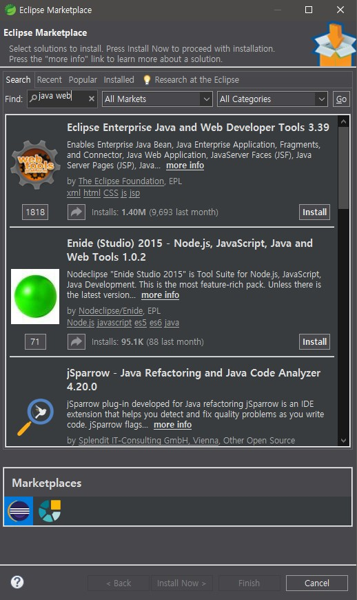
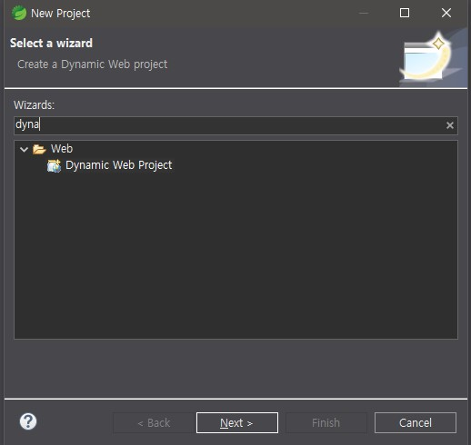
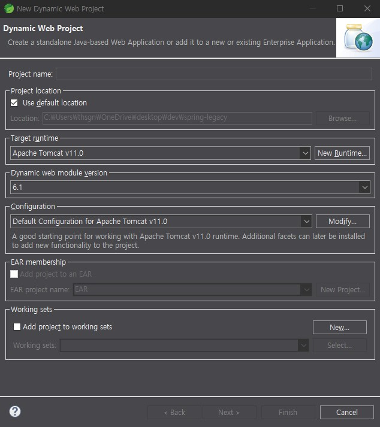
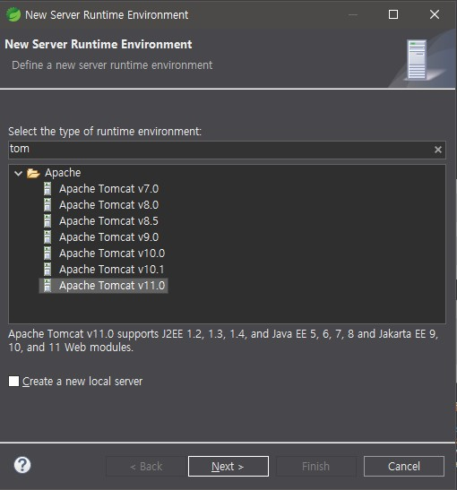
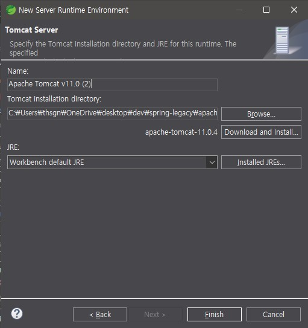
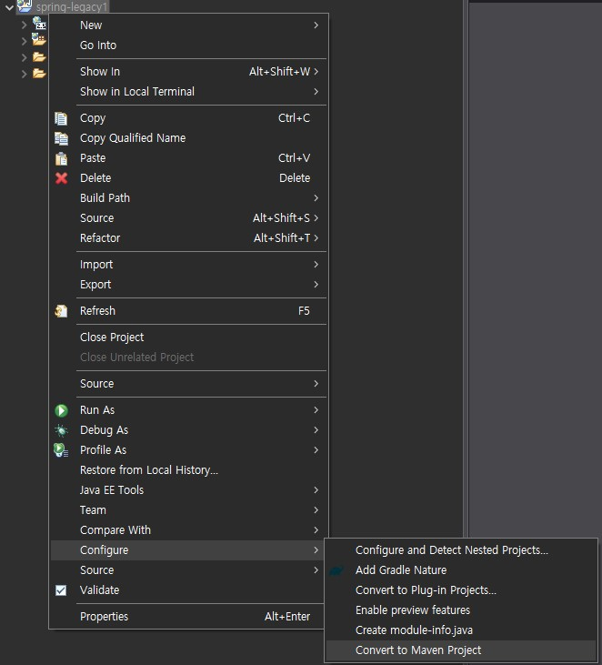
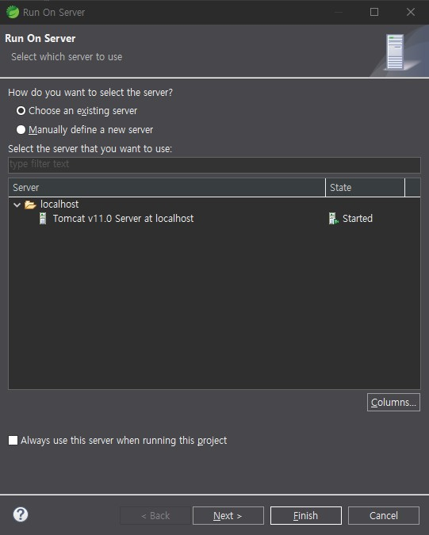

---
## 설치 및 프로젝트 생성
### STS(Spring Tools Suites) 설치

- Spring Boot를 사용할 때는 주로 IntelliJ를 사용하지만, 레거시 Spring에서는 주로 STS(Spring에 특화된 Eclipse)를 많이 사용한다.
- https://spring.io/tools 여기서 Spring Tools for Eclipse에서 본인 os와 cpu 아키텍처와 맞는 버전 다운로드 후 압축해제




- 설치 이후, 상단의 Help - Eclipse Marketplace -> java web 검색 -> Eclipse Enterprise Java and Web Developer Tools -> Install
- 설치 버튼 누른 이후 우측 하단에 Installing Software이 완료되고, 재시작을 자동으로 물을 때 까지 기다린다.
- 재시작을 묻는 창이 나온다면 재시작한다.



- 이후 좌측에서 New Project -> Wizards에 dynamic web project 검색을 하면 Dynamic Web Project가 나오는 것을 볼 수 있다.

### Tomcat 다운로드

- https://tomcat.apache.org/download-11.cgi
- 위 링크에서 zip 버전을 다운받고 원하는 경로에 저장해준다.

### 프로젝트 생성

- 좌측에서 New Proejct -> Dynamic Web Project를 선택후 프로젝트를 생성한다.



- Project name을 입력한다.
- Target runtime -> New Runtime 선택



- Tomcat을 검색하고 설치한 톰캣의 버전을 선택하고 Next를 누른다.



- Browse를 선택하고 이전에 다운로드 받은 Tomcat이 있는 폴더를 선택한다.(안에 bin, lib 등이 있는 폴더)



- 프로젝트 우클릭 -> Configure -> Convert to Maven Project 클릭하면 프로젝트 생성은 끝난다.

---
## 프로젝트 세팅
### Spring Core

``` {9-12, 14, 20}
spring-legacy1
├── build
├── src
│   └── main
│       ├── java
│       │   └── com
│       │       └── legacy
│       │           └── hello
│       │               ├── HelloMain.java
│       │               ├── HelloMessage.java
│       │               ├── HelloMessageEng.java
│       │               └── HelloMessageKor.java
│       ├── resources
│       │   └── applicationContext.xml
│       └── webapp
│           ├── META-INF
│           └──WEB-INF
│               ├── lib
│               └── web.xml
└── pom.xml
```

**의존성 설정(Spring Core 추가)**

`pom.xml`
```xml
<project xmlns="http://maven.apache.org/POM/4.0.0"
         xmlns:xsi="http://www.w3.org/2001/XMLSchema-instance"
         xsi:schemaLocation="http://maven.apache.org/POM/4.0.0 
                             http://maven.apache.org/xsd/maven-4.0.0.xsd">

  <modelVersion>4.0.0</modelVersion>
  <groupId>com.legacy</groupId>
  <artifactId>spring-legacy-demo</artifactId>
  <version>1.0.0</version>
  <packaging>war</packaging>

  <dependencies>
    <!-- Spring Core -->
    <dependency>
	  <groupId>org.springframework</groupId>
	  <artifactId>spring-context</artifactId>
	  <version>6.2.11</version>
	</dependency>

  </dependencies>
</project>
```

**ApplicationContext 설정**

`src/main/resources/applicationContext.xml`
```xml
<?xml version="1.0" encoding="UTF-8"?>
<beans xmlns="http://www.springframework.org/schema/beans"
       xmlns:xsi="http://www.w3.org/2001/XMLSchema-instance"
       xsi:schemaLocation="http://www.springframework.org/schema/beans 
                           http://www.springframework.org/schema/beans/spring-beans.xsd">

    <bean id="kor" class="com.legacy.hello.HelloMessageKor"/>
    <bean id="eng" class="com.legacy.hello.HelloMessageEng"/>

</beans>
```

- `ApplicationContext`는 `BeanFactory`에서 여러 기능들을 추가한 스프링 컨테이너이다. 따라서 Bean들을 관리한다.
- 이에 이 xml 문서에서 `Bean`을 추가한다.
	- 현재 `HelloMessageKor`를 `kor`이라는 이름으로, `HelloMessageEng`를 `eng`라는 이름으로 빈 등록해둔 상태이다.

**나머지 테스트용 클래스들**

`src/main/java/com/legacy/hello/HelloMessage.java`
```java
package com.legacy.hello;

public interface HelloMessage {
    String greet();
}
```

`src/main/java/com/legacy/hello/HelloMessageKor.java`
```java
package com.legacy.hello;

public class HelloMessageKor implements HelloMessage {
    public String greet() { return "안녕하세요!"; }
}
```

`src/main/java/com/legacy/hello/HelloMessageEng.java`
```java
package com.legacy.hello;

public class HelloMessageEng implements HelloMessage {
    public String greet() { return "Hello!"; }
}
```

`src/main/java/com/legacy/hello/HelloMain.java`
```java
package com.legacy.hello;

import org.springframework.context.ApplicationContext;
import org.springframework.context.support.ClassPathXmlApplicationContext;

public class HelloMain {
    public static void main(String[] args) {
        ApplicationContext context = new ClassPathXmlApplicationContext("applicationContext.xml");

        HelloMessage msg = (HelloMessage) context.getBean("kor");
        System.out.println(msg.greet());
    }
}
```

- 위 파일을 실행하면 `안녕하세요!`가 출력되고, `context.getBean("kor");`을 `context.getBean("eng");`로 바꾸면 `Hello!`가 출력된다.

:::info
현재는 웹이 아닌 `Spring Core`를 추가하고 스프링 컨테이너만 사용하는 즉, 웹서버를 사용하지 않는 상태이다.
:::

### Spring MVC

``` {9, 20-22}
spring-legacy1
├── build
├── src
│   └── main
│       ├── java
│       │   └── com
│       │       └── legacy
│       │           └── hello
│       │               ├── HelloController.java
│       │               ├── HelloMain.java
│       │               ├── HelloMessage.java
│       │               ├── HelloMessageEng.java
│       │               └── HelloMessageKor.java
│       ├── resources
│       │   └── applicationContext.xml
│       └── webapp
│           ├── META-INF
│           └── WEB-INF
│               ├── lib
│               ├── spring-servlet.xml
│               └── web.xml
└── pom.xml
```

**의존성 설정(Spring MVC 추가)**

`pom.xml`
```xml
<project xmlns="http://maven.apache.org/POM/4.0.0"
         xmlns:xsi="http://www.w3.org/2001/XMLSchema-instance"
         xsi:schemaLocation="http://maven.apache.org/POM/4.0.0 
                             http://maven.apache.org/xsd/maven-4.0.0.xsd">

  <modelVersion>4.0.0</modelVersion>
  <groupId>com.legacy</groupId>
  <artifactId>spring-legacy-demo</artifactId>
  <version>1.0.0</version>
  <packaging>war</packaging>

  <dependencies>
    <!-- Spring Core -->
    <dependency>
	  <groupId>org.springframework</groupId>
	  <artifactId>spring-context</artifactId>
	  <version>6.2.11</version>
	</dependency>

    <!-- Spring Web MVC -->
	<dependency>
	  <groupId>org.springframework</groupId>
	  <artifactId>spring-webmvc</artifactId>
	  <version>6.2.11</version>
	</dependency>

  </dependencies>
</project>
```

**`spring-servlet.xml` 설정**

`src/main/webapp/WEB-INF/spring-servlet.xml`
```xml
<?xml version="1.0" encoding="UTF-8"?>
<beans xmlns="http://www.springframework.org/schema/beans"
       xmlns:context="http://www.springframework.org/schema/context"
       xmlns:xsi="http://www.w3.org/2001/XMLSchema-instance"
       xmlns:mvc="http://www.springframework.org/schema/mvc"
       xsi:schemaLocation="
           http://www.springframework.org/schema/beans 
           http://www.springframework.org/schema/beans/spring-beans.xsd
           http://www.springframework.org/schema/context 
           http://www.springframework.org/schema/context/spring-context.xsd
           http://www.springframework.org/schema/mvc 
           http://www.springframework.org/schema/mvc/spring-mvc.xsd">

    <!-- 컴포넌트 스캔 -->
    <context:component-scan base-package="com.legacy.hello" />

    <!-- JSP View Resolver -->
    <bean class="org.springframework.web.servlet.view.InternalResourceViewResolver">
        <property name="prefix" value="/WEB-INF/views/" />
        <property name="suffix" value=".jsp" />
    </bean>
</beans>
```

| **구분**    | **applicationContext (Root WebApplicationContext)**           | **spring-servlet.xml (Servlet WebApplicationContext)**    |
| --------- | ------------------------------------------------------------- | --------------------------------------------------------- |
| **개념**    | **최상위 스프링 컨테이너**                                              | **`DispatcherServlet`에 종속된 자식 스프링 컨테이너**                  |
| **설정 파일** | 보통 `applicationContext.xml` (혹은 `root-context.xml`)           | 보통 `[servlet-name]-servlet.xml` (예: `spring-servlet.xml`) |
| **생성 주체** | `web.xml`의 **`ContextLoaderListener`**                        | `web.xml`의 **`DispatcherServlet`**                        |
| **역할**    | **핵심 비즈니스 로직** 및 공통 인프라(Service, DAO, DB 설정, 트랜잭션 등)의 Bean 관리 | **웹 계층** 인프라(Controller, ViewResolver, 인터셉터 등)의 Bean 관리   |
| **관계**    | **부모 컨테이너**이며, 자식 컨테이너와 Bean을 공유함.                            | **자식 컨테이너**이며, 부모 컨테이너의 Bean을 상속받아 사용할 수 있음.              |

- 위 코드에서는 `com.legacy.hello` 경로 안에 컴포넌트 스캔을 한다는 뜻이다.
- 아래는 `ViewResolver` 설정이다.

**`web.xml` 설정**

`src/main/webapp/WEB-INF/web.xml`
```xml
<?xml version="1.0" encoding="UTF-8"?>
<web-app xmlns="http://java.sun.com/xml/ns/javaee"
         xmlns:xsi="http://www.w3.org/2001/XMLSchema-instance"
         xsi:schemaLocation="http://java.sun.com/xml/ns/javaee 
                             http://java.sun.com/xml/ns/javaee/web-app_3_0.xsd"
         version="3.0">

  <!-- 스프링 컨텍스트 로더 -->
  <context-param>
    <param-name>contextConfigLocation</param-name>
    <param-value>classpath:applicationContext.xml</param-value>
  </context-param>

  <listener>
    <listener-class>org.springframework.web.context.ContextLoaderListener</listener-class>
  </listener>

  <!-- 스프링 DispatcherServlet -->
  <servlet>
    <servlet-name>spring</servlet-name>
    <servlet-class>org.springframework.web.servlet.DispatcherServlet</servlet-class>
    <init-param>
      <param-name>contextConfigLocation</param-name>
      <param-value>/WEB-INF/spring-servlet.xml</param-value>
    </init-param>
    <load-on-startup>1</load-on-startup>
  </servlet>

  <servlet-mapping>
    <servlet-name>spring</servlet-name>
    <url-pattern>/</url-pattern>
  </servlet-mapping>
</web-app>
```

- `<listener>`: 스프링 컨테이너를 로드(Context 초기화)한다. 위 표에서 볼 수 있듯, `ContextLoaderListener`로 `applicationContext.xml`를 로드하여 최상위 컨테이너(`Root WebApplicationContext`)를 생성하고 초기화한다.
- `<servlet>`: 요청들을 맨 앞에서 받아서 처리하는 프론트 컨트롤러인 `DispatcherServlet`을 등록한다. 그리고 이 서블릿이 구동될 때 `spring-servlet.xml`로 자식 컨테이너(`Servlet WebApplicationContext`)를 생성한다.
- `<servlet-mapping>`: 요청 URL 패턴을 정의한다. 위 코드에서는 `spring`이라는 이름을 가진 서블릿을 대상으로 `/`(모든 요청)을 처리하게 설정한다.

**테스트용 컨트롤러**

`src/main/java/com/legacy/hello/HelloController.java`
```java
package com.legacy.hello;

import org.springframework.stereotype.Controller;
import org.springframework.web.bind.annotation.RequestMapping;
import org.springframework.web.bind.annotation.ResponseBody;

@Controller
public class HelloController {

    @RequestMapping("/")
    @ResponseBody
    public String hello() {
        return "hello";
    }
}
```

**실행**



- 프로젝트 우클릭 -> Run As ->Run On Server
- 프로젝트를 생성할 때 등록했던 런타임인 Tomcat을 선택 -> Finish


- 웹서버가 실행된다.