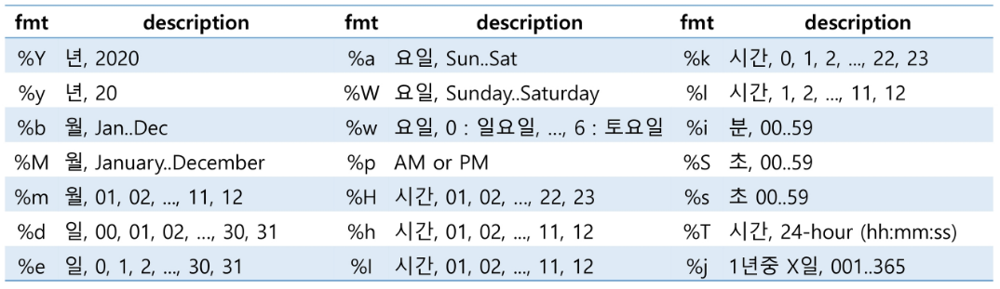
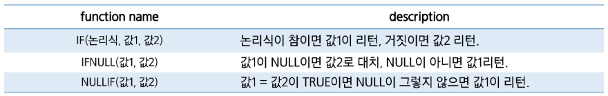
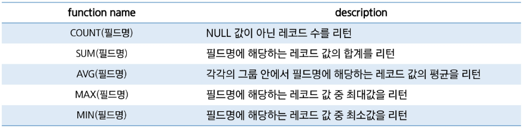
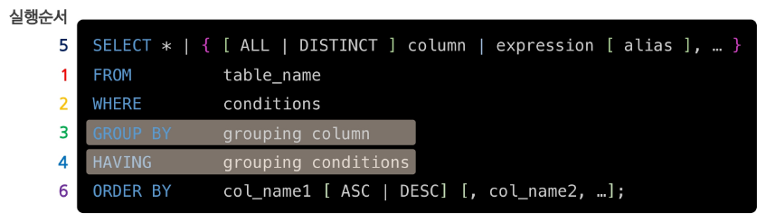

---
## 사전 준비

이번 글에서 다뤄질 쿼리문에 대한 스키마는 Oracle Sample Schemas - Human Resources(https://github.com/oracle-samples/db-sample-schemas/tree/main/human_resources)이다.

이 스키마를 MySQL로 CREATE하고 Dummy Data를 INSERT하는 SQL문을 만들어서 올려뒀으니 사용하면 된다.
- CREATE: https://github.com/Son-Hunseo/sample-database-query-for-test/blob/main/hr_create.sql
- INSERT: https://github.com/Son-Hunseo/sample-database-query-for-test/blob/main/hr_dummydata_insert.sql


---
## SELECT, FROM


```sql
SELECT * | { [ALL | DISTINCT] column | expression [ alias ], ...}
FROM table_name;
```

- `SELECT`와 `FROM`은 무조건 함께 사용한다.
- 예외: 상수 반환(`SELECT 1 + 1;`), 함수 호출결과 반환(`SELECT NOW();`)


```sql
SELECT employee_id, first_name, salary
FROM employees;
```

- 모든 사원의 사번, 이름, 급여 검색


```sql
SELECT employee_id 사번, first_name "이름", salary "급 여"
FROM employees;
```

- 별칭(alias)을 사용할 때 `AS`는 생략해도 된다. (`employee_id AS 사번` -> `employee_id 사번`)
- 별칭(alias)을 지정할 때, 큰 따옴표를 사용해도 되고, 사용하지 않아도 되지만, 무조건 사용해야하는 몇몇 경우가 있다.
	1. 공백이 포함된 경우 - ex: `"급 여"`
	2. 대소문자를 구분해야하는 경우
	3. 예약어를 사용해야하는 경우 - ex: `"Select"`, `"From"`, `"Table"` 등


---
## 사칙연산, NULL

```sql
SELECT employee_id AS 사번, 
       first_name "이 름",
	   salary AS "급여", 
	   salary * 12 "연봉"
FROM employees;
```

- 모든 사원의 사번, 이름, 급여, 급여 * 12 (연봉) 검색


```sql
SELECT employee_id AS 사번, 
       first_name "이 름",
	   salary AS "급여", 
	   salary * 12 "연봉",
	   commission_pct,
	   (salary + salary * commission_pct) * 12 "커미션포함연봉1",
	   (salary + salary * IFNULL(commission_pct, 0)) * 12 "커미션포함연봉2" -- NULL이라면 0
FROM employees;
```

- 모든 사원의 사번, 이름, 급여, 급여 * 12 (연봉), 커미션, 커미션포함 연봉 검색


---
## CASE ~ WHEN ~ THEN

**문법**

```sql
CASE exp1 WHEN exp2 THEN exp3
	[
	WHEN exp4 THEN exp5
	...
	ELSE exp6
	]
END
```


```sql
SELECT employee_id, 
	   first_name, 
	   salary,
	   CASE
		   WHEN salary > 15000 THEN '고액연봉'
		   WHEN salary > 8000 THEN '평균연봉'
		   ELSE '저액연봉'
	   END "연봉등급"
FROM employees;
```

- 모든 사원의 사번, 이름, 급여, 급여에 따른 등급 표시 검색


---
## WHERE

```sql
SELECT * | { [ ALL | DISTINCT ] column | expression [ alias ], ... }
FROM table_name
WHERE conditions;
```

- `WHERE` : <span style={{color: 'red'}}>조건에 만족하는 행</span>을 검색


### AND, OR, NOT

```sql
SELECT employee_id, first_name, salary, department_id
FROM employees
WHERE department_id = 50 AND salary >= 7000;
```

- 부서번호가 50인 사원 중 급여가 7000이상인 사원의 사번, 이름, 급여, 부서번호 검색


```sql
SELECT employee_id, first_name, department_id
FROM employees
WHERE department_id = 50 OR 
      department_id = 60 OR
      department_id = 70;
```

- 근무 부서번호가 50, 60, 70에 근무하는 사원의 사번, 이름, 부서번호 검색


```sql
SELECT employee_id, first_name, department_id
FROM employees
WHERE department_id != 50 AND 
      department_id != 60 AND
      department_id != 70;
```

```sql
SELECT employee_id, first_name, department_id
FROM employees
WHERE NOT (department_id = 50 OR 
	       department_id = 60 OR
	       department_id = 70);
```

- 근무 부서번호가 50, 60, 70이 아닌 사원의 사번, 이름, 부서번호 검색


### IN

```sql
SELECT employee_id, first_name, department_id
FROM employees
WHERE department_id IN (50, 60, 70);
```

- 근무 부서번호가 50, 60, 70에 근무하는 사번, 이름, 부서번호 검색


```sql
SELECT employee_id, first_name, department_id
FROM employees
WHERE department_id NOT IN (50, 60, 70);
```

- 근무 부서번호가 50, 60, 70이 아닌 사원의 사번, 이름, 부서번호 검색


### BETWEEN

```sql
SELECT employee_id, first_name, salary
FROM employees
WHERE salary >= 6000 AND salary <= 10000;
```

```sql
SELECT employee_id, first_name, salary
FROM employees
WHERE salary BETWEEN 6000 AND 100000;
```

- 급여가 6000이상 10000이하인 사원의 사번, 이름, 급여 검색


### IS NULL, IS NOT NULL

```SQL
SELECT employee_id, first_name, salary
FROM employees
WHERE department_id = NULL; -- 이렇게하면 검색이 되지 않는다.
```

```SQL
SELECT employee_id, first_name, salary
FROM employees
WHERE department_id IS NULL; -- 이렇게해야 검색이 된다.
```

- 근무 부서가 지정되지 않은(알 수 없는) 사원이 사번, 이름, 부서번호 검색

### LIKE ( wild card : %, \_ )


```sql
SELECT employee_id, first_name
FROM employees
WHERE first_name LIKE '%x%';
```

- 이름에 'x'가 들어간 사원의 사번, 이름 검색


```sql
SELECT employee_id, first_name
FROM employees
WHERE first_name LIKE '%x__';
```

- 이름의 끝에서 3번째 자리에 'x'가 들어간 사원의 사번, 이름 검색


### 논리연산시 주의점: NULL


---
## ORDER BY

```sql
SELECT * | { [ ALL | DISTINCT ] collumn | expression [ alias ], ... }
FROM table_name
WHERE conditions
ORDER BY col_name1 [ ASC | DESC ] [col_name1, ...];
```

- `ORDER BY` : 정렬, default: 오름차순(`ASC`)


```sql
SELECT employee_id, first_name, salary
FROM employees
ORDER BY salary DESC;
```

- 모든 사원의 사번, 이름, 급여 검색. 단, 급여 순 정렬(내림차순)


```sql
SELECT employee_id, first_name, department_id, salary
FROM employees
WHERE department_id IN (50, 60, 70)
ORDER BY department_id, salary DESC;
```

- 50, 60, 70에 근무하는 사원의 사번, 이름, 부서번호, 급여 검색. 단, 부서별 정렬(오름차순) 후 급여 순(내림차순) 검색


---
## LIMIT

```sql
SELECT * | { [ ALL | DISTINCT ] collumn | expression [ alias ], ... }
FROM table_name
WHERE conditions
ORDER BY col_name1 [ ASC | DESC ] [col_name1, ...]
LIMIT 개수 [ OFFSET 시작 인덱스 ];
```

- 검색할 데이터의 수(행) 제한
- `SELECT`문의 가장 마지막에 추가
- offset은 0부터 시작 (인덱스)


```sql
SELECT employee_id, first_name, salary
FROM employees
ORDER BY salary DESC
LIMIT 1 offset 4;
```

- 급여 순 정렬 후 5번째로 높은 급여를 받는 사원의 사번, 이름, 급여


```sql
SELECT employee_id, first_name, salary
FROM employees
ORDER BY salary DESC
LIMIT 0, 5;
```

- 급여 순 정렬 후 1~ 5번째로 급여를 많이 받는 사원의 사번, 이름, 급여
- offset 생략가능 `(LIMIT 시작인덱스, 개수)`
- 생략하지 않았을 떄와 순서 반대인 것에 유의!

---
## 내장함수
### 숫자


- `CEIL()` 과 `CEILING()`은 같다고 생각하면 된다.
- `ROUND(1526.159)` 는 `ROUND(1526.159, 0)` 과 같다. (정수자리까지 반올림)
	- 심지어 `ROUND(1526.159, -1)` 은 10의 자리까지 반올림하여 1530이 나온다.
- `TRUNCATE()` 는 롤백 불가능 (트랜잭션 X)
- `RAND()` : 0보다 크고 1보다 작은 double 값 
	- 응용: `FLOOR(RAND() * 45 + 1)` -> 1 ~ 45 중 난수 하나 생성

:::tip 참고

- Oracle DB는 `SELECT`를 사용하였을 때, 함수 결과를 확인하기 위한 dummy 테이블인 `DUAL`이 필수이며 사용하지 않으면 오류가 생긴다.

```SQL
SELECT ABS(-5) FROM dual;
```

- 하지만 다른 대부분의 DB는 `DUAL`을 사용하지 않아도 된다.

```SQL
SELECT ABS(-5);
```
:::

### 문자


- `ASCII('0')` -> 48 / `ASCII('A')` -> 65 / `ASCII('a')` -> 97
	- `CAST(CHAR(48) AS CHAR)` -> '0'
- `INSERT()`: 특정 범위를 바꿀 때 / `REPLACE()`: 특정 값을 바꿀 때
- `MID()`, `SUBSTRING()` 은 완전히 같다. (java의 substring과 같다)
- `FORMAT(숫자, 자릿수)`: 3자리마다 콤마 찍어줌 + 자릿수까지 반올림도 해줌

:::tip 참고

- Oracle DB는 `CONCAT`은 인자로 2개만 가능해서, `CONCAT('A', CONCAT('B', 'C'))` 로 사용한다.
- 다른 DB들은 인자로 여러개가 가능해서 `CONCAT('A', 'B', 'C')` 로 사용한다. 
:::

### 날짜




- `SELECT NOW(), SLEEP(5), SYSDATE();` -> 5초 차이나게 조회된다.
- `SELECT DATE_FORMAT(NOW(), '%Y-%m-%d %H:%i:%s)` -> 2024-09-10 10:41:06

### 논리



### 집계



- `null`은 자동으로 제외된다.

---
## GROUP BY

`GROUP BY`는 '같은 값'을 가진 '행'들을 하나의 그룹으로 묶어주는 기능이다.

### 핵심 규칙

GROUP BY를 사용하는 SELECT 문에서는, SELECT 절에 다음 3가지만 올 수 있다.

1. **GROUP BY 절에 있는 컬럼**

```sql
SELECT department_id, job_id  -- department_id와 job_id 모두 GROUP BY에 있음
FROM employees
GROUP BY department_id, job_id;
```

2. **집계 함수**

```sql
SELECT department_id, COUNT(*), AVG(salary), MAX(salary)  -- 집계 함수들
FROM employees
GROUP BY department_id;
```

3. **상수 (고정된 값)**

```sql
SELECT department_id, '명', COUNT(*), 100  -- '명'과 100은 상수
FROM employees
GROUP BY department_id;
```


이런 규칙이 있는 이유는 다음과 같다.

```sql
SELECT department_id, first_name, AVG(salary) FROM employees GROUP BY department_id;
```

**문제:** department_id가 50인 부서에 여러 직원(예: Steven, Neena, Lex 등)이 있는데, `first_name`에 누구를 표시해야 할까?
- department_id 50은 **하나의 행**으로 나타나는데
- first_name은 **여러 개**가 있어서 모순이 발생

---
## HAVING

- `GROUP BY`한 결과에 조건을 추가 할 경우 `HAVING` 절을 사용한다.
- Query의 실행 순서상 `WHERE`절이 `GROUP BY`절보다 먼저 실행되기 때문에 `GROUP BY` 결과의 조건은 `HAVING`절에 작성한다. (`WHERE`을 사용하면 안된다)

```SQL
SELECT department_id, AVG(salary)
FROM employees
GROUP BY department_id
HAVING AVG(salary) > 7000;
```

- 추가적으로 내림차순으로 정렬하고 싶을 경우

```SQL
SELECT department_id, AVG(salary)
FROM employees
GROUP BY department_id
HAVING AVG(salary) > 7000
ORDER BY AVG(salary) DESC;
```

---
## Query의 실행순서 (중요)

