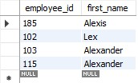
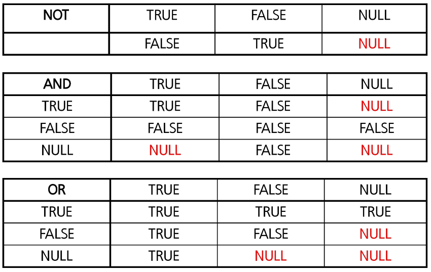

---
## WHERE

```sql
SELECT * | { [ ALL | DISTINCT ] column | expression [ alias ], ... }
FROM table_name
WHERE conditions;
```

- `WHERE` : <span style={{color: 'red'}}>조건에 만족하는 행</span>을 검색


### AND, OR, NOT

```sql
SELECT employee_id, first_name, salary, department_id
FROM employees
WHERE department_id = 50 AND salary >= 7000;
```

- 부서번호가 50인 사원 중 급여가 7000이상인 사원의 사번, 이름, 급여, 부서번호 검색


```sql
SELECT employee_id, first_name, department_id
FROM employees
WHERE department_id = 50 OR 
      department_id = 60 OR
      department_id = 70;
```

- 근무 부서번호가 50, 60, 70에 근무하는 사원의 사번, 이름, 부서번호 검색


```sql
SELECT employee_id, first_name, department_id
FROM employees
WHERE department_id != 50 AND 
      department_id != 60 AND
      department_id != 70;
```

```sql
SELECT employee_id, first_name, department_id
FROM employees
WHERE NOT (department_id = 50 OR 
	       department_id = 60 OR
	       department_id = 70);
```

- 근무 부서번호가 50, 60, 70이 아닌 사원의 사번, 이름, 부서번호 검색


### IN

```sql
SELECT employee_id, first_name, department_id
FROM employees
WHERE department_id IN (50, 60, 70);
```

- 근무 부서번호가 50, 60, 70에 근무하는 사번, 이름, 부서번호 검색


```sql
SELECT employee_id, first_name, department_id
FROM employees
WHERE department_id NOT IN (50, 60, 70);
```

- 근무 부서번호가 50, 60, 70이 아닌 사원의 사번, 이름, 부서번호 검색


### BETWEEN

```sql
SELECT employee_id, first_name, salary
FROM employees
WHERE salary >= 6000 AND salary <= 10000;
```

```sql
SELECT employee_id, first_name, salary
FROM employees
WHERE salary BETWEEN 6000 AND 100000;
```

- 급여가 6000이상 10000이하인 사원의 사번, 이름, 급여 검색


### IS NULL, IS NOT NULL

```SQL
SELECT employee_id, first_name, salary
FROM employees
WHERE department_id = NULL; -- 이렇게하면 검색이 되지 않는다.
```

```SQL
SELECT employee_id, first_name, salary
FROM employees
WHERE department_id IS NULL; -- 이렇게해야 검색이 된다.
```

- 근무 부서가 지정되지 않은(알 수 없는) 사원이 사번, 이름, 부서번호 검색

### LIKE ( wild card : %, \_ )



```sql
SELECT employee_id, first_name
FROM employees
WHERE first_name LIKE '%x%';
```

- 이름에 'x'가 들어간 사원의 사번, 이름 검색


```sql
SELECT employee_id, first_name
FROM employees
WHERE first_name LIKE '%x__';
```

- 이름의 끝에서 3번째 자리에 'x'가 들어간 사원의 사번, 이름 검색


### 논리연산시 주의점: NULL


