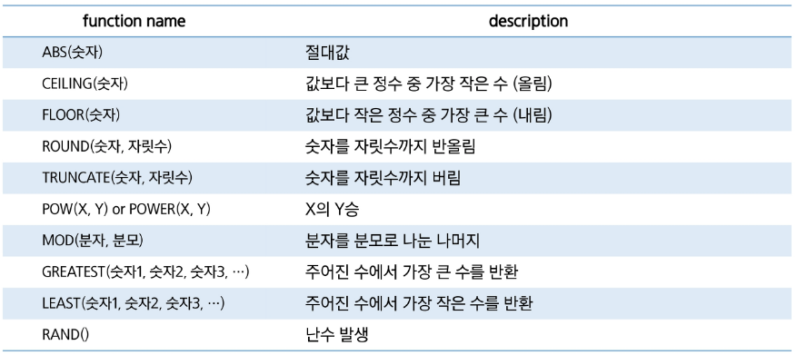
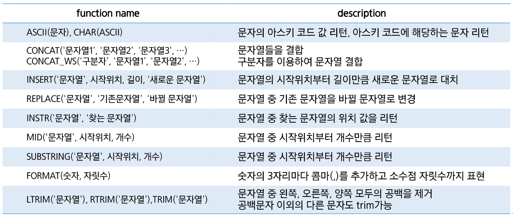
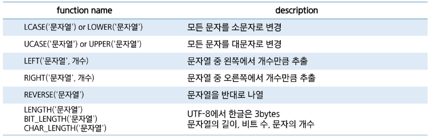
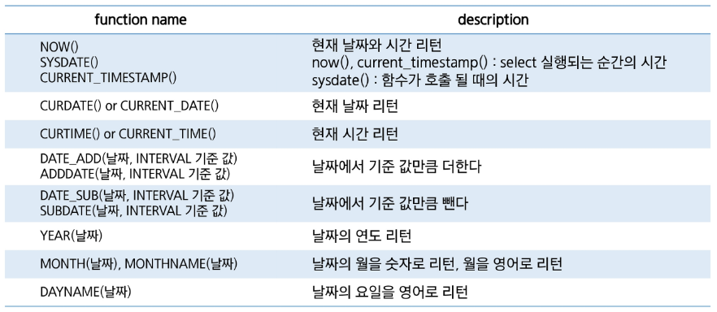
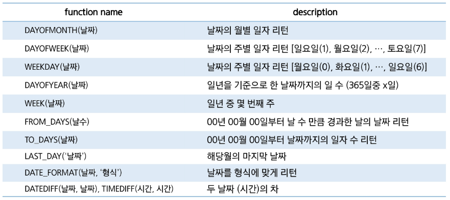
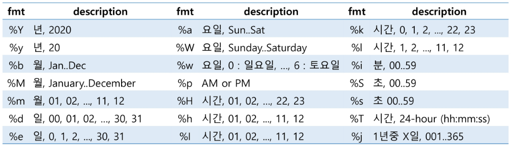
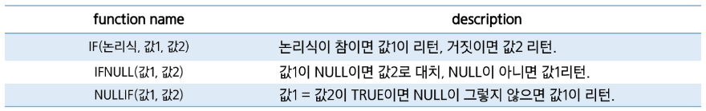
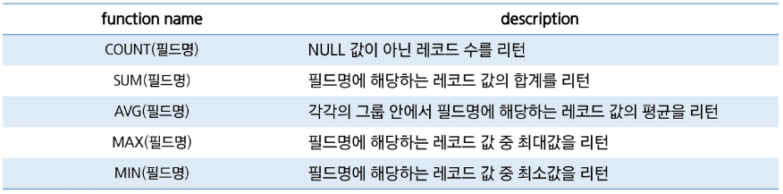

---
## 내장함수
### 숫자



- `CEIL()` 과 `CEILING()`은 같다고 생각하면 된다.
- `ROUND(1526.159)` 는 `ROUND(1526.159, 0)` 과 같다. (정수자리까지 반올림)
	- 심지어 `ROUND(1526.159, -1)` 은 10의 자리까지 반올림하여 1530이 나온다.
- `TRUNCATE()` 는 롤백 불가능 (트랜잭션 X)
- `RAND()` : 0보다 크고 1보다 작은 double 값 
	- 응용: `FLOOR(RAND() * 45 + 1)` -> 1 ~ 45 중 난수 하나 생성

:::tip 참고

- Oracle DB는 `SELECT`를 사용하였을 때, 함수 결과를 확인하기 위한 dummy 테이블인 `DUAL`이 필수이며 사용하지 않으면 오류가 생긴다.

```SQL
SELECT ABS(-5) FROM dual;
```

- 하지만 다른 대부분의 DB는 `DUAL`을 사용하지 않아도 된다.

```SQL
SELECT ABS(-5);
```
:::

### 문자




- `ASCII('0')` -> 48 / `ASCII('A')` -> 65 / `ASCII('a')` -> 97
	- `CAST(CHAR(48) AS CHAR)` -> '0'
- `INSERT()`: 특정 범위를 바꿀 때 / `REPLACE()`: 특정 값을 바꿀 때
- `MID()`, `SUBSTRING()` 은 완전히 같다. (java의 substring과 같다)
- `FORMAT(숫자, 자릿수)`: 3자리마다 콤마 찍어줌 + 자릿수까지 반올림도 해줌

:::tip 참고

- Oracle DB는 `CONCAT`은 인자로 2개만 가능해서, `CONCAT('A', CONCAT('B', 'C'))` 로 사용한다.
- 다른 DB들은 인자로 여러개가 가능해서 `CONCAT('A', 'B', 'C')` 로 사용한다. 
:::

### 날짜





- `SELECT NOW(), SLEEP(5), SYSDATE();` -> 5초 차이나게 조회된다.
- `SELECT DATE_FORMAT(NOW(), '%Y-%m-%d %H:%i:%s)` -> 2024-09-10 10:41:06

### 논리



### 집계



- `null`은 자동으로 제외된다.