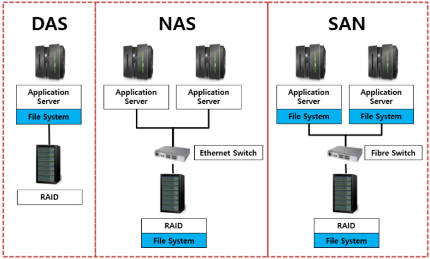

---
## 개요



스토리지는 단순히 데이터를 저장하는 장치라고 볼 수도 있지만, 실제 인프라 환경에서는 <span class="t-red">서버와 스토리지가 어떤 방식으로 연결되는지</span>에 따라 구조와 용도가 달라진다.

대표적인 스토리지 연결 방식은 다음 세 가지로 구분할 수 있다.
- DAS
- NAS
- SAN

각 방식은 서버와 스토리지를 연결하는 방법이 다르고, 이에 따라 성능, 확장성, 관리 방식, 비용도 달라진다.


---
## DAS
### 정의

```
서버 ── 디스크
```

DAS는 Direct Attached Storage의 약자로, 말 그대로 <span class="t-red">서버에 직접 연결해서 사용하는 스토리지</span>이다.

예를 들어 서버 내부에 장착된 HDD, SSD, NVMe 디스크나, SATA/SAS 케이블로 직접 연결된 외장 스토리지가 DAS에 해당한다.

DAS는 서버와 스토리지가 직접 연결되기 때문에 구조가 단순하다. 별도의 네트워크 장비나 복잡한 설정이 필요하지 않고, 서버에서 로컬 디스크처럼 바로 사용할 수 있다.

### 장점

DAS의 가장 큰 장점은 <span class="t-red">속도가 빠르다</span>는 점이다. 스토리지가 서버에 직접 연결되어 있기 때문에 네트워크를 거치지 않고 데이터를 읽고 쓸 수 있다.

또한 구조가 단순해 구축 비용이 낮고, 소규모 환경에서는 관리도 비교적 쉽다.

### 단점

반면 DAS는 <span class="t-red">확장성과 공유 측면에서 한계</span>가 있다. (포트 수 제한)

스토리지가 특정 서버에 직접 연결되어 있기 때문에, 다른 서버가 해당 스토리지를 사용하려면 별도의 공유 설정이 필요하다. 서버가 여러 대로 늘어나는 환경에서는 스토리지를 각각 따로 관리해야 하므로 운영이 복잡해질 수 있다.

즉, DAS는 단일 서버 중심의 구조에서는 적합하지만, 여러 서버가 같은 스토리지를 공유해야 하는 환경에서는 한계가 있다.


---
## NAS
### 정의

```
서버 ─┐
서버 ─┼── LAN ── NAS
서버 ─┘
```

NAS는 Network Attached Storage의 약자로, <span class="t-red">네트워크를 통해 접근하는 파일 스토리지</span>이다.

NAS는 일반적으로 LAN에 연결되며, 서버나 클라이언트는 네트워크를 통해 NAS에 접속한다. NFS, SMB/CIFS 같은 파일 공유 프로토콜을 사용하거나, 서버와 스토리지사이를 중개하는 파일 서버(ex: SynologyOS)가 필요하다.

쉽게 말하면 NAS는 네트워크에 연결된 공유 폴더 서버라고 볼 수 있다. 여러 서버나 사용자가 동일한 스토리지 공간에 접근할 수 있기 때문에 파일 공유에 적합하다.

### 장점

NAS의 가장 큰 장점은 <span class="t-red">확장성과 공유가 쉽다</span>는 점이다. (포트 수 제한 x)

LAN에 연결된 여러 서버나 사용자가 같은 스토리지에 접근할 수 있기 때문에, 파일 공유 환경을 만들기 쉽다. 또한 스토리지 용량을 늘리거나 접근 권한을 관리하는 것도 DAS보다 유연하다.

### 단점

NAS는 네트워크를 통해 데이터를 주고받기 때문에, DAS에 비해 성능이 낮다. 특히 여러 사용자가 동시에 접근하거나 대용량 데이터를 빈번하게 읽고 쓰는 환경에서는 네트워크 대역폭이 병목이 될 수 있다.

또한 파일 공유 방식이기 때문에 블록 스토리지가 필요한 데이터베이스, 가상화 디스크, 고성능 스토리지 환경에는 적합하지 않다. (대역폭 때문이라기 보다는 프로토콜이 파일 단위이기 때문)

정리하면 NAS는 <span class="t-red">여러 서버나 사용자가 파일을 공유하는 환경</span>에 적합하지만, 고성능 블록 스토리지가 필요한 환경에서는 한계가 있다.

---
## SAN
### 정의

```
서버 ─┐
서버 ─┼── SAN 전용 네트워크 ── 스토리지
서버 ─┘
```

SAN은 Storage Area Network의 약자로, <span class="t-red">블록 단위 스토리지를 위한 전용 네트워크를 구성하는 방식</span>이다.

SAN은 DAS와 NAS의 장점을 결합한 구조라고 볼 수 있다. 서버와 스토리지가 직접 연결된 것 처럼 사용할 수 있지만, 실제로는 스토리지 전용 네트워크를 통해 연결된다.

SAN은 일반적인 LAN과는 별도로 스토리지 전용 네트워크를 구성하는 경우가 많다. 대표적으로 Fibre Channel, iSCSI 같은 기술을 사용한다.

중요한 점은 SAN이 <span class="t-red">파일 단위가 아니라 블록 단위 스토리지</span>를 제공한다는 것이다. 서버 입장에서는 SAN 스토리지가 마치 로컬 디스크처럼 보인다.

> [!tip] SAN = 광케이블 아니야?
> - 과거에는 그렇게 인식되는 경향이 있었지만, 지금은 아니다.
> - SAN은 매체(광/구리)나 프로토콜(FC/이더넷)을 특정하는 용어가 아니라, 블록 단위 I/O를 네트워크로 전달하는 스토리지 아키텍처를 말한다.

> [!info] NAS와 SAN의 차이
> NAS와 SAN은 모두 네트워크를 통해 스토리지를 사용한다는 점에서는 비슷하다. 하지만 접근 방식이 다르다.
> - NAS는 "파일 단위"로 접근한다. (파일 스토리지)
> - SAN은 "블록 단위"로 접근한다. (블록 스토리지)


### 장점

SAN의 가장 큰 장점은 <span class="t-red">높은 성능과 확장성</span>이다.

스토리지 전용 네트워크를 사용하기 때문에 일반적인 서비스 트래픽과 분리할 수 있고, 고속 연결을 통해 안정적인 성능을 낼 수 있다.

또한 여러 서버가 중앙 스토리지 자원을 효율적으로 사용할 수 있어 대규모 인프라 환경에서 유리하다. 서버마다 디스크를 따로 붙이는 방식보다 스토리지 자원을 중앙에서 관리하기 쉽다.

가상화 환경에서도 SAN은 자주 사용된다. 여러 하이퍼바이저 서버가 동일한 스토리지에 접근할 수 있어 VM 마이그레이션, 고가용성 구성, 중앙 집중형 스토리지 관리에 유리하다.


### 단점

SAN은 성능과 확장성이 좋은 대신 <span class="t-red">구축 비용이 높다</span>.

전용 스토리지 장비, 스위치, 네트워크 구성 (<span class="t-red">모두 고대역폭 필요</span>), 관리 소프트웨어 등이 필요할 수 있으며, 설정과 운영 난이도도 DAS나 NAS보다 높다.

즉, SAN은 소규모 환경보다는 기업의 데이터센터, 가상화 인프라, 대규모 서비스 환경에 적합하다.

---
## 정리

|구분|DAS|NAS|SAN|
|---|---|---|---|
|연결 방식|서버에 직접 연결|LAN을 통해 연결|스토리지 전용 네트워크로 연결|
|접근 단위|블록|파일|블록|
|대표 예시|서버 내부 SSD, HDD, NVMe|Synology NAS, 파일 서버|Fibre Channel SAN, iSCSI SAN|
|장점|빠른 속도, 단순한 구조, 낮은 비용|파일 공유 쉬움, 확장성 좋음|고성능, 고확장성, 중앙 관리에 유리|
|단점|공유와 확장에 한계|네트워크 병목 가능, 성능 한계|구축 비용 높음, 운영 복잡|
|적합한 환경|단일 서버, 소규모 서비스|파일 공유, 백업, 사내 자료 저장|데이터센터, 가상화, DB, 고성능 인프라|


