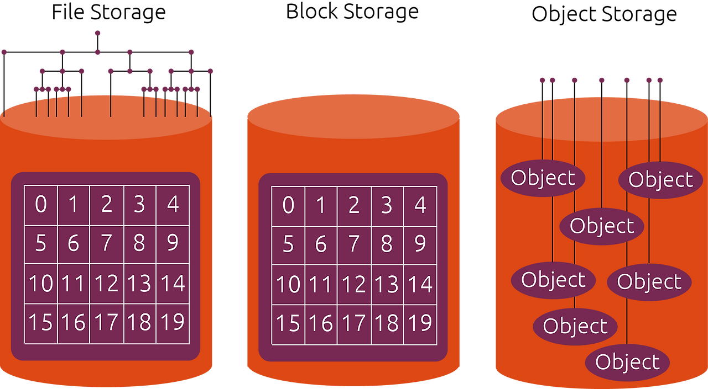
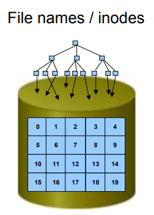
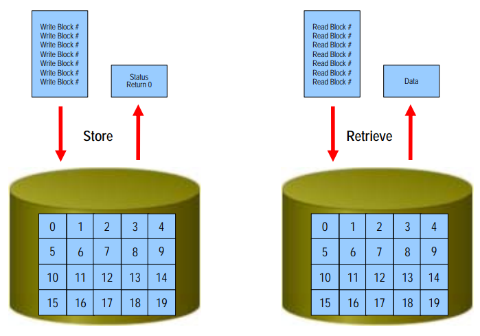
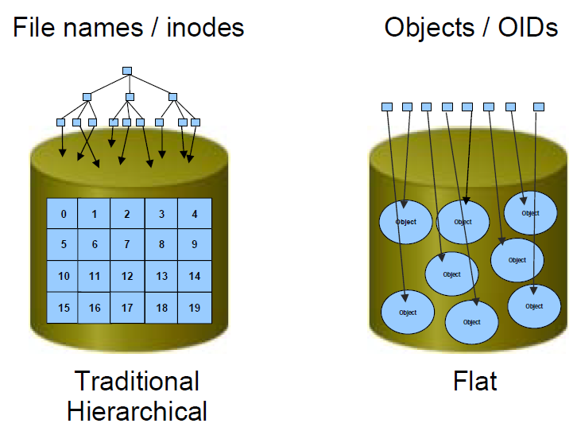

---
## 개요



스토리지는 데이터를 저장하는 공간이지만, 모든 스토리지가 같은 방식으로 데이터를 저장하고 제공하는 것은 아니다.

스토리지는 <span class="t-red">데이터를 어떤 단위로 다루고 접근하느냐</span>에 따라 크게 다음 세 가지로 구분할 수 있다.

- 파일 스토리지
- 블록 스토리지
- 오브젝트 스토리지

이 세 가지 방식은 데이터를 저장하는 구조, 접근 방식, 성능 특성, 적합한 사용 환경이 다르다.

예를 들어 여러 사용자가 문서나 이미지를 공유하는 환경에서는 파일 스토리지가 적합하다. 운영체제를 설치하거나 데이터베이스처럼 빠른 읽기/쓰기가 필요한 경우에는 블록 스토리지가 주로 사용된다. 반면 이미지, 영상, 백업 데이터처럼 대량의 비정형 데이터를 저장할 때는 오브젝트 스토리지가 많이 사용된다.

즉, 스토리지를 이해할 때는 단순히 “어디에 저장하는가”뿐만 아니라, <span class="t-red">데이터를 어떤 단위로 저장하고 어떻게 접근하는가</span>를 함께 이해해야 한다.

---

## 파일 스토리지

### 정의



```
사용자 ── 파일 시스템 ── 파일 스토리지
```

파일 스토리지는 데이터를 <span class="t-red">파일과 디렉토리 구조로 저장하고 제공하는 방식</span>이다.

우리가 일반적으로 사용하는 폴더, 파일 구조가 바로 파일 스토리지의 대표적인 형태이다. 예를 들어 `문서/보고서.docx`, `사진/여행/image.png`처럼 계층형 디렉토리 구조를 통해 데이터를 관리한다.

파일 스토리지는 사용자가 <span class="t-red">파일 이름과 경로를 기준으로 데이터에 접근</span>한다.

예를 들어 어떤 파일을 열 때 사용자는 디스크의 특정 블록 위치를 직접 지정하지 않는다. 대신 `/home/user/report.pdf`처럼 파일 경로를 통해 접근한다. 그러면 파일 시스템은 해당 경로의 파일 정보를 확인하고, 파일이 저장된 실제 위치를 찾아 데이터를 읽어온다. 즉, <span class="t-blue">파일 경로와 실제 저장 위치 사이를 연결해주는 것이 파일 시스템의 핵심 역할</span>이다.

### 장점

파일 스토리지의 가장 큰 장점은 <span class="t-red">사용과 공유가 쉽다</span>는 점이다.

디렉토리 구조를 통해 파일을 체계적으로 관리할 수 있고, 여러 사용자나 서버가 같은 파일 공간에 접근하기 쉽다. 또한 파일 단위로 권한을 설정할 수 있어 협업 환경이나 사내 파일 서버로 사용하기 좋다.

예를 들어 부서별 공유 폴더, 백업 폴더, 이미지 저장소, 로그 저장 공간 등은 파일 스토리지와 잘 어울린다.

NAS가 대표적인 파일 스토리지 사용 방식이다. NAS는 네트워크를 통해 파일 시스템을 제공하며, 사용자는 NFS, SMB/CIFS 같은 프로토콜을 통해 파일에 접근한다.

> 즉, <span class="t-red">파일 스토리지</span>는 <span class="t-red">데이터 접근 방식</span>의 관점에서는 “파일 단위 접근”이고, <span class="t-red">NAS</span>는 이러한 파일 스토리지를 네트워크로 제공하는 대표적인 <span class="t-red">연결 방식</span>이라고 볼 수 있다.

### 단점

파일 스토리지는 계층형 구조를 사용하기 때문에, 데이터가 많아지고 디렉토리 구조가 복잡해질수록 관리 부담이 커질 수 있다.

오브젝트 스토리지는 파일 고유 식별자만 기억하면 되는 반면에, <span class="t-red">파일 스토리지는 디렉토리까지 관리해야해서 이러한 복잡도가 훨씬 올라간다.</span>

또한 대규모 비정형 데이터를 매우 많이 저장하는 환경에서는 <span class="t-red">오브젝트 스토리지보다 확장성이 떨어질 수 있다.</span> 파일과 디렉토리의 메타데이터를 관리해야 하기 때문에, <span class="t-red">수억 개 이상의 파일을 다루는 환경에서는 성능과 관리 측면에서 한계</span>가 생길 수 있다.

또한 파일 스토리지는 일반적으로 운영체제가 사용할 “빈 디스크”를 제공하는 방식이 아니다. 이미 파일 시스템과 디렉토리 구조를 통해 제공되는 저장 공간이기 때문에, 서버가 이를 로컬 디스크처럼 인식해 운영체제를 직접 설치하는 용도로는 적합하지 않다.

정리하면 파일 스토리지는 파일 공유와 일반적인 데이터 관리에 적합한 방식이지만, <span class="t-red">고성능 디스크 I/O나 초대규모 비정형 데이터 저장에는 한계</span>가 있다.

---

## 블록 스토리지

### 정의



```
서버 ── 블록 스토리지
```

블록 스토리지는 데이터를 <span class="t-red">일정한 크기의 블록 단위로 나누어 저장하는 방식</span>이다.

서버 입장에서 블록 스토리지는 하나의 디스크처럼 보인다. 즉, HDD, SSD, NVMe 디스크처럼 운영체제가 직접 인식할 수 있는 저장 장치에 가깝다.

블록 스토리지 자체는 파일 이름이나 디렉토리 구조를 직접 이해하지 않는다. 예를 들어 사용자가 `/data/test.txt`라는 파일을 저장하더라도, 블록 스토리지 입장에서는 “test.txt”라는 파일을 관리하는 것이 아니라 데이터를 여러 블록에 나누어 저장할 뿐이다.

이 블록들을 파일과 디렉토리 구조로 관리하는 역할은 운영체제의 파일 시스템이 담당한다.

블록 스토리지를 사용하려면 일반적으로 해당 스토리지 위에 파일 시스템을 생성해야 한다. 예를 들어 리눅스 서버에 새로운 디스크를 연결한 뒤, 파티션을 나누고 ext4, xfs 같은 파일 시스템을 만들어 마운트하는 방식이다.

쉽게 말하면 블록 스토리지는 <span class="t-red">운영체제가 직접 다룰 수 있는 디스크 형태의 저장 공간</span>이라고 볼 수 있다.

### 장점

블록 스토리지의 가장 큰 장점은 <span class="t-red">성능이 좋고 지연 시간이 낮다</span>는 점이다.

운영체제가 디스크처럼 직접 접근할 수 있기 때문에 <span class="t-red">빠른 읽기/쓰기 작업에 적합</span>하다. 그래서 데이터베이스, 가상 머신 디스크, 운영체제 부팅 디스크처럼 성능이 중요한 환경에서 많이 사용된다.

또한 블록 스토리지 위에는 <span class="t-red">운영체제를 설치할 수 있다.</span> 이는 블록 스토리지가 서버 입장에서 디스크처럼 보이기 때문이다. 서버는 블록 스토리지를 로컬 디스크와 유사하게 인식하고, 그 위에 파티션, 파일 시스템, 운영체제를 구성할 수 있다.

### 단점

반면 블록 스토리지는 <span class="t-red">공유와 관리가 상대적으로 어렵다</span>는 단점이 있다.

기본적으로 하나의 서버가 하나의 블록 디바이스를 직접 사용하는 구조에 가깝기 때문에, 여러 서버가 동시에 같은 블록 스토리지를 사용하려면 클러스터 파일 시스템이나 별도의 동시 접근 제어가 필요하다.

또한 사용자는 블록 스토리지 자체만으로는 파일을 바로 저장하고 공유할 수 없다. 파일 시스템 생성, 마운트, 권한 관리 등의 작업이 필요하다.

정리하면 블록 스토리지는 빠른 성능과 디스크 수준의 제어가 필요한 환경에 적합하지만, <span class="t-red">여러 사용자가 쉽게 파일을 공유하는 용도에는 적합하지 않다.</span>

---

## 오브젝트 스토리지

### 정의



```
애플리케이션 ── API ── 오브젝트 스토리지
```

오브젝트 스토리지는 데이터를 <span class="t-red">오브젝트 단위로 저장하고 API를 통해 접근하는 방식</span>이다.

오브젝트는 단순한 파일과 비슷해 보일 수 있지만, 내부적으로는 다음과 같은 요소로 구성된다.

- 데이터
- 메타데이터
- 고유 식별자

파일 스토리지에서는 데이터를 폴더와 파일 경로로 찾는다. 반면 오브젝트 스토리지에서는 데이터를 고유한 키 또는 URL을 통해 접근한다.

예를 들어 `images/profile/1.png`라는 이름으로 저장하더라도, 이는 전통적인 파일 시스템의 실제 디렉토리 구조라기보다는 오브젝트를 구분하기 위한 key값에 가깝다.

오브젝트 스토리지는 파일 시스템처럼 복잡한 디렉토리 계층에 강하게 의존하지 않는다. 대신 <span class="t-red">각 오브젝트를 고유한 식별자로 관리하기 때문에 대규모 데이터를 분산 저장하기에 적합</span>하다.

또한 HTTP 기반 <span class="t-red">API를 통해 접근</span>하는 경우가 많다. 애플리케이션은 오브젝트 스토리지를 일반 디스크처럼 마운트해서 사용하기보다는, API 요청을 통해 오브젝트를 업로드하거나 다운로드한다.

예를 들어 웹 서비스에서 사용자가 이미지를 업로드하면, 애플리케이션 서버는 해당 이미지를 오브젝트 스토리지에 저장하고, 이후 URL이나 key를 통해 다시 불러오는 방식이다.

대표적인 오브젝트 스토리지로는 AWS S3, OpenStack Swift, Ceph Object Gateway 등이 있다.

### 장점

오브젝트 스토리지의 가장 큰 장점은 <span class="t-red">대규모 비정형 데이터 저장에 매우 적합하다</span>는 점이다.

이미지, 영상, 로그, 백업 파일, 아카이브 데이터처럼 구조화되지 않은 데이터를 대량으로 저장하기 좋다. 또한 여러 서버에 데이터를 분산 저장하기 쉽고, 용량을 <span class="t-red">수평적으로 확장</span>하기에 유리하다.

메타데이터를 유연하게 붙일 수 있다는 점도 장점이다. 파일 스토리지의 메타데이터가 파일명, 생성일, 권한 등으로 제한되는 것에 비해, 오브젝트 스토리지는 서비스 목적에 맞는 다양한 메타데이터를 함께 저장할 수 있다.

예를 들어 이미지 파일에 사용자 ID, 업로드 시간, 콘텐츠 타입, 접근 권한 등의 정보를 함께 저장할 수 있다.

### 단점

오브젝트 스토리지는 <span class="t-red">일반적인 디스크처럼 사용하기 어렵다</span>는 단점이 있다.

운영체제가 오브젝트 스토리지를 로컬 디스크처럼 직접 인식하는 구조가 아니기 때문에, 그 위에 운영체제를 설치하거나 데이터베이스의 디스크처럼 사용하는 용도에는 적합하지 않다.

또한 데이터를 수정하는 방식도 블록 스토리지와 다르다. 블록 스토리지는 필요한 블록만 수정할 수 있지만, 오브젝트 스토리지는 일반적으로 오브젝트 전체를 다시 저장하는 방식에 가깝다.

물론 일부 서비스에서는 멀티파트 업로드나 버전 관리 같은 기능을 제공하지만, 기본적인 사용 모델은 <span class="t-red">파일 일부를 디스크처럼 자주 수정하는 방식</span>보다는 <span class="t-red">오브젝트 단위로 저장하고 조회하는 방식</span>에 가깝다.

따라서 자주 수정되는 작은 단위의 데이터나 낮은 지연 시간이 중요한 작업보다는, <span class="t-red">한 번 저장한 뒤 주로 읽거나 다운로드하는 데이터</span>에 적합하다.

정리하면 오브젝트 스토리지는 대규모 이미지, 영상, 백업, 로그, 정적 파일 저장에는 강하지만, OS 설치, VM 디스크, DB 스토리지처럼 디스크 수준의 <span class="t-red">빠른 I/O가 필요한 환경에는 적합하지 않다.</span>

---

## 정리

|구분|파일 스토리지|블록 스토리지|오브젝트 스토리지|
|---|---|---|---|
|접근 단위|파일 / 디렉토리|블록|오브젝트|
|접근 방식|파일 경로로 접근|디스크처럼 접근|API / Key / URL로 접근|
|대표 예시|NAS, NFS, SMB, CephFS|HDD, SSD, EBS, Ceph RBD, iSCSI 볼륨|AWS S3, OpenStack Swift, Ceph RGW|
|운영체제 설치|일반적으로 부적합|가능|부적합|
|장점|사용과 공유가 쉬움, 계층형 구조 제공|고성능, 낮은 지연 시간, 디스크 수준 제어|확장성 우수, 대규모 비정형 데이터에 적합|
|단점|대규모 확장성에 한계|공유와 관리가 상대적으로 어려움|디스크처럼 사용하기 어려움, 부분 수정에 부적합|
|적합한 환경|파일 공유, 사내 자료, 백업 폴더, 로그 저장|OS 디스크, DB, VM 디스크, 고성능 I/O|이미지, 영상, 백업, 아카이브, 정적 파일 저장|

결국 세 가지 스토리지는 “무엇이 더 좋다”의 문제가 아니라, <span class="t-red">어떤 데이터를 어떤 방식으로 사용할 것인가</span>에 따라 선택하는 방식이다.

---
## 레퍼런스

- https://ubuntu.com/blog/what-are-the-different-types-of-storage-block-object-and-file
- https://computing-jhson.tistory.com/90