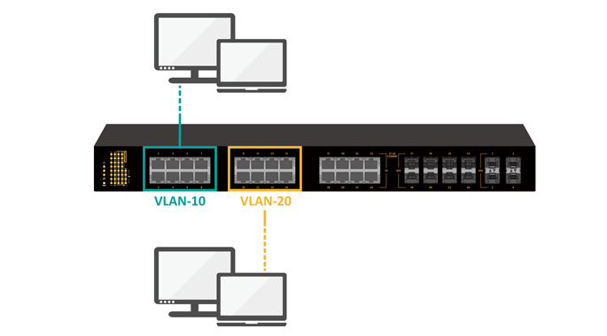
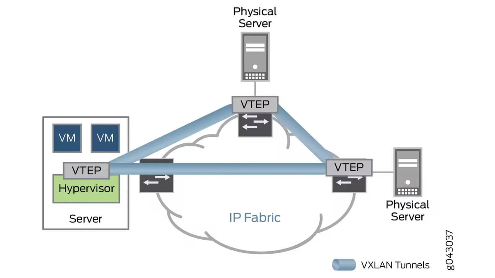

---
## 언더레이 네트워크와 오버레이 네트워크

 **언더레이 네트워크**
- 물리적인 장비로 연결된 네트워크, 즉 스위치, 라우터, 케이블과 같은 물리적인 장비로 연결된 네트워크를 말한다.

**오버레이 네트워크**
- 언더레이 네트워크 위에 구축되는 가상화된 네트워크이다.
- 서로 다른 네트워크에 있는 장비들을 같은 네트워크에 있는 것 처럼 사용하거나, 같은 네트워크에 있는 장비들을 다른 네트워크처럼 분리하는 등의 목적을 위해 사용한다.

---
## VLAN
### 개념

- 일반적으로 하나의 스위치에 연결된 장비들은 하나의 LAN(Local Area Network)으로 묶인다. (L2 계층)
- 그러나, VLAN(Virtual Local Area Network)은 하나의 물리적 네트워크(LAN)을 여러개의 논리적 네트워크(VLAN)으로 나누는 기술이다. 다른 말로는 '여러 개의 브로드캐스트 도메인을 만드는 것'이다.

> [!info] cf) **브로드캐스트 예시**
> - ARP - 어떠한 IP로 가야하는데 해당 IP를 가진 장비의 MAC 주소를 모를 때, ARP 요청을 L2 브로드캐스트(FF:FF:FF:FF:FF:FF)로 보낸다. 그러면 같은 브로드캐스트 도메인 안에 있는 모든 장비가 해당 프레임을 받고 해당 IP를 가진 장비만 응답한다.
> - 그러면 하나의 스위치에 연결된 LAN을 VLAN1, VLAN2로 나눴다고 가정해보자. 이 경우 VLAN1 영역에서 VLAN2에 있는 장비를 찾기위해 위처럼 브로드캐스트 요청을 보내도 찾을 수 없다. 

> [!tip] **왜 VLAN은 오버레이 네트워크가 아니지?**
> - 오버레이 네트워크라고 한다면 물리적 네트워크 위에 독자적인 가상 네트워크를 구축해야하는데, VLAN은 물리적 네트워크를 그대로 사용하면서 L2레벨에서 레이블을 붙여 가상으로 분리만 한 것이기 때문이다.

### 장점

- 물리 장비 추가 없이 네트워크 분리 가능 - 이로인해 여러 용도로 네트워크를 편하게 분리하고 관리 가능
- 브로드캐스트 트래픽 감소

### 단점

- VLAN ID 제한 (12bit -> 최대 4096개) - 거대 클라우드 환경에서 4096개는 턱없이 부족한 숫자임.
- 물리적 네트워크에 강하게 종속됨 - 예를들어, 서울IDC에 있는 장비와 부산IDC에 있는 특정 장비를 같은 LAN에 있는 것 처럼 사용하고 싶을 경우 매우 복잡하고 위험한 과정이 필요함 (사실상 불가)

---
## VXLAN
### 개념

- VLAN의 한계를 극복하기 위한 오버레이 네트워크 기술이다.
- L2 프레임(진짜 이더넷 프레임이 아닌, VXLAN에서 사용하는 가상 L2 프레임)을 UDP 패킷에 감싸서(캡슐화) L3 네트워크에서 전달한다.
	- 마치 VPN과 비슷하게 느껴진다.
- 전달하는 양 끝단의 VTEP(VXLAN Tunnel EndPoint)이 있다. 보내는 쪽의 VTEP에서 캡슐화를 하고 받는 쪽의 VTEP에서 UDP 페이로드에서 프레임을 꺼낸다. 이를 통해 마치 같은 LAN인 것 처럼 작동하게 한다.
	- cf) Openstack에서는 VTEP 역할을 각 Compute 노드의 OVS(Open vSwitch)가 한다.

### 장점

- 확장성이 매우 크다. VLAN은 12비트라 최대 4096개인 반면, VXLAN은 24비트라 약 1600만개가 가능하다.
- 멀티 테넌시 구현시 용이하다. (Openstack, Kubernetes 등)

### 단점

- MTU로 인해 패킷이 잘리거나 성능저하가 있을 수 있다. (Drop or Fragmentation)
	- 이더넷 표준 MTU는 1500바이트이다.
	- VXLAN을 사용하면 "나 VXLAN 패킷이야"라는 것을 표시하기 위한 헤더(이게 있어야 VTEP에서 VXLAN 패킷이라는 것을 알 수 있다)가 50바이트를 차지하여 총 패킷의 용량이 1550바이트가 된다. 이 때문에 1500바이트를 채워서 보냈는데 50바이트가 헤더로 채워져 50바이트가 유실되거나 성능저하가 생길 수 있는 것이다.
	- 해결 방법
		- 방법 1) 물리 네트워크 NIC의 MTU를 1550이상으로 설정. (보통 9000으로 설치하며, 이를 Jumbo Frame이라고 한다)
		- 방법 2) VM의 MTU를 1450으로 줄인다. (그러나 모든 VM을 설정하는 것은 번거로우므로 보통 방법1을 사용한다)

---
## 레퍼런스

- https://yesxyz.kr/vlan_vs_vxlan/
- https://ko.wikipedia.org/wiki/%EA%B0%80%EC%83%81_%EB%9E%9C
- https://www.etherwan.com/support/featured-articles/brief-introduction-vlans