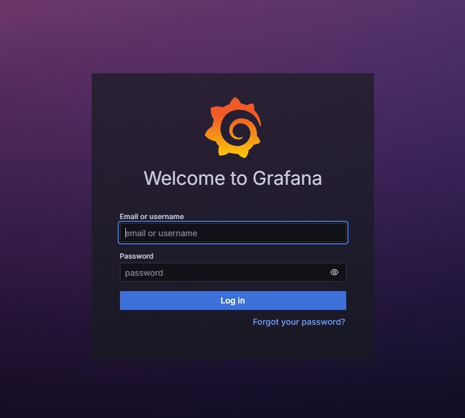
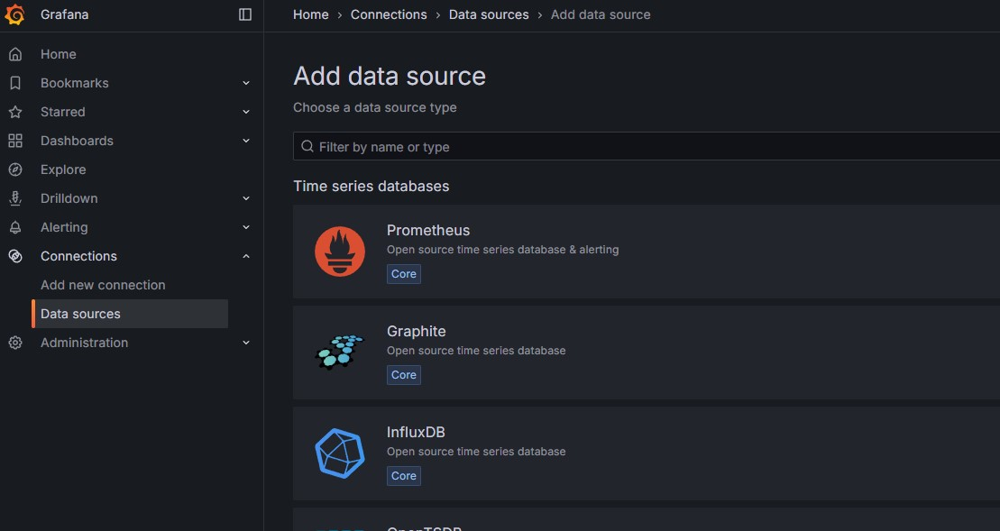
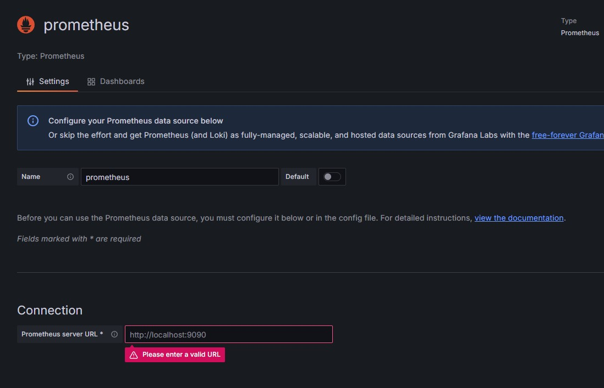
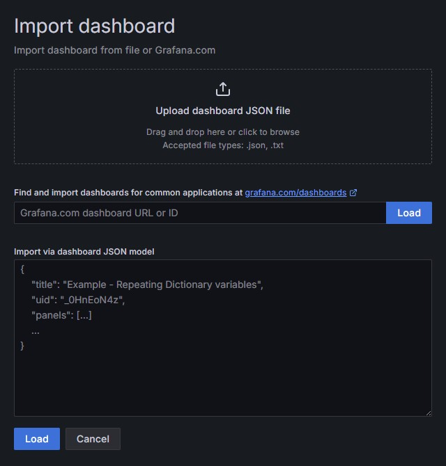

---
## Prometheus 설치
### Helm Chart로 설치

- 공식 Docs에 명시된 Helm Chart로 설치 (https://prometheus-community.github.io/helm-charts/)

```bash
helm repo add prometheus-community https://prometheus-community.github.io/helm-charts
```

```bash
helm repo update
```

```bash
kubectl create namespace 네임스페이스이름
```

```bash
helm install prometheus prometheus-community/prometheus --namespace 네임스페이스이름
```

```bash
kubectl get all -n 네임스페이스이름
```


- 설치를 하고나면 위와같이 `alertmanger`와 `server`가 Pending 상태인 것을 알 수 있다.
- 왜냐하면 PV가 바인딩되어있지 않기 때문이다.

### PV 바인딩

```bash
kubectl patch pvc storage-prometheus-alertmanager-0 -n prometheus \
  -p '{"spec":{"storageClassName":"연결할스토리지클래스이름"}}'

kubectl patch pvc prometheus-server -n prometheus \
  -p '{"spec":{"storageClassName":"연결할스토리지클래스이름"}}'
```

```bash
kubectl get all -n 네임스페이스이름
```


- PV를 바인딩 하고 나면 정상적으로 pod가 실행된 것을 볼 수 있다.

### 서비스 노출 (NodePort)

```bash
kubectl patch service prometheus-server -n prometheus -p '{"spec": {"type": "NodePort"}}'
```

- 해당 서비스에 접근하기 위해 `NodePort` 로 타입을 변경한다.

```bash
kubectl get all -n 네임스페이스이름
```


- `prometheus-server`를 보면 노드포트 타입으로 바뀐 것을 확인할 수 있다.


- `http://노드ip:노드포트`(위 사진에서의 http://노드ip:31041) 로 접속해서 확인할 수 있다.

---
## Grafana 설치
### Helm Chart로 설치

- 공식 Docs에 명시된 Helm Chart로 설치 (https://grafana.com/docs/grafana/latest/setup-grafana/installation/helm/)

```bash
helm repo add grafana https://grafana.github.io/helm-charts
```

```bash
helm repo update
```

```bash
kubectl create namespace 네임스페이스이름
```

```bash
helm install grafana grafana/grafana --namespace 네임스페이스이름
```

```bash
kubectl get all -n 네임스페이스이름
```

### 서비스 노출 (NodePort)

```bash
kubectl patch service grafana -n grafana -p '{"spec": {"type": "NodePort"}}'
```

- 해당 서비스에 접근하기 위해 `NodePort` 로 타입을 변경한다.

```bash
kubectl get all -n 네임스페이스이름
```


- 노드포트 타입으로 바뀐 것을 확인할 수 있다.

```bash
kubectl get secret --namespace 네임스페이스이름 grafana -o jsonpath="{.data.admin-password}" | base64 --decode ; echo
```

- 위 명령어로 초기 비밀번호를 확인한다.



- `http://노드ip:노드포트`(위 사진에서의 http://노드ip:30087) 로 접속해서 확인할 수 있다.
- 로그인
	- ID: admin
	- PW: 확인한 비밀번호
- 로그인 후, `Home > Administration - Users and access - Users` 로 가서 비밀번호를 원하는 비밀번호로 변경한다.

---
## 통합

### Grafana에서 Prometheus 연결



- 좌측 패널 > Connections > Data sources > Add data source
- Prometheus 선택



- Connection에 Prometheus URL 입력 후 Save & Test 선택해서 data source 생성

### Dashboard 만들기


- 좌측 패널 > Dashboards > Create Dashboard
- Add visualizaion으로 직접 추가해도 되지만 나는 템플릿을 사용하였다.
- Import a dashboard 선택
- https://grafana.com/grafana/dashboards/ 여기서 원하는 대시보드의 ID를 기록해두기



- 원하는 대시보드의 ID 입력하고 Load (나는 1860을 사용하였다)


- 연동 완료