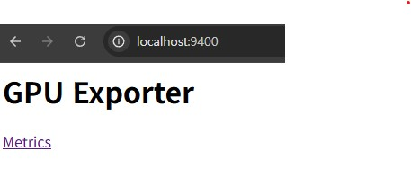
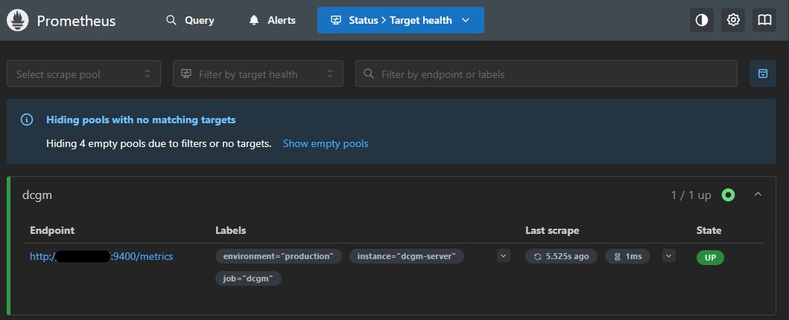
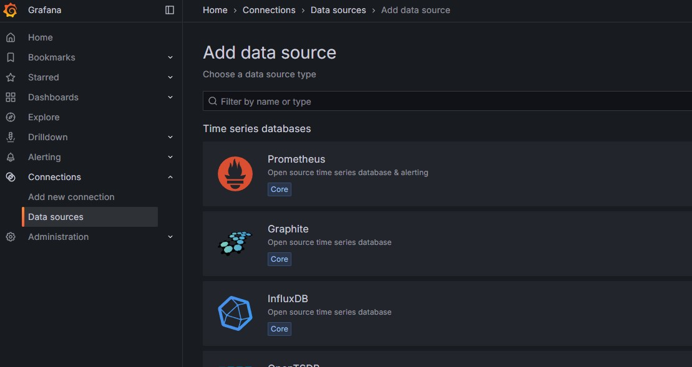
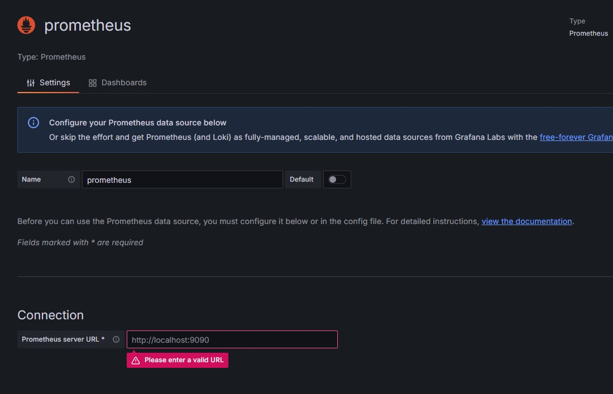
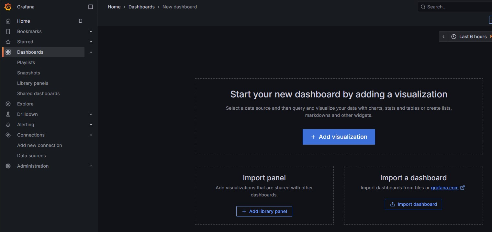
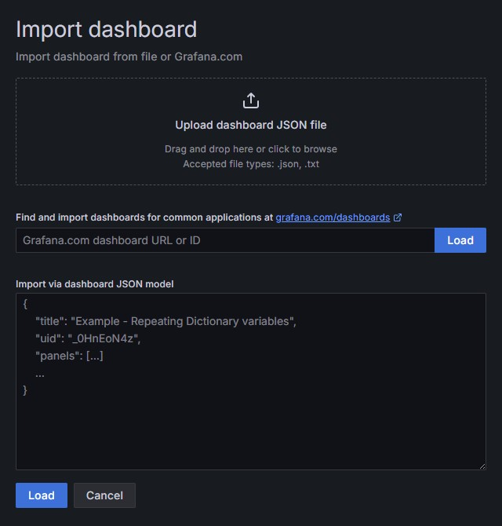
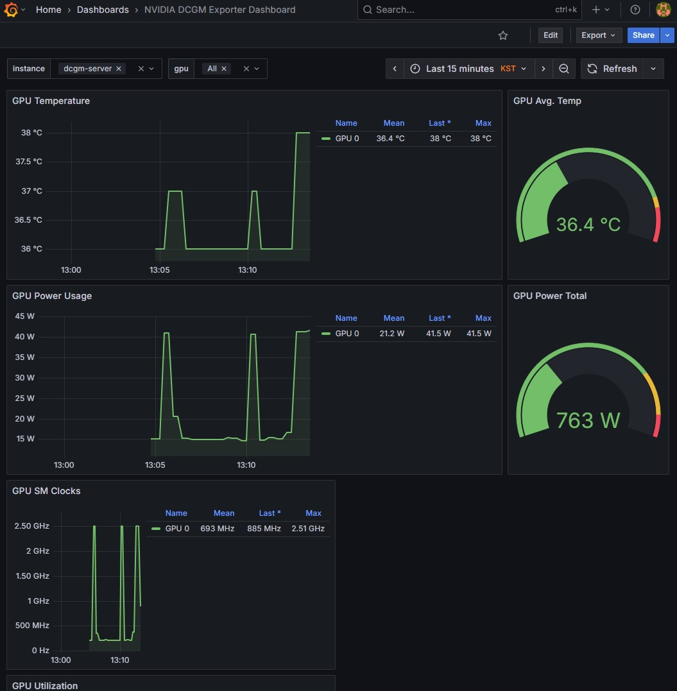

---
## 왜?

Linux 기반 OS에 장착된 GPU를 DCGM Exporter를 통해서 Prometheus & Grafana로 모니터링 해본 경험이 있었다. 이후 Windows PC에 장착된 GPU도 이런식으로 모니터링이 가능한지 궁금해졌다.

Windows 자체에서는 불가능하고 WSL(Windows Subsystem for Linux)에서 Linux 기반 OS에서와 똑같이 컨테이너 형태로 ECGM Exporter를 실행하는 것이 가능했고, WSL을 포트포워딩으로 노출시켜서 Prometheus & Grafana로 모니터링이 가능하다는 것을 알고 시도해보았다.

---
## 사전 준비

- Windows에 nvidia-driver 설치되어 있어야한다. (https://www.nvidia.com/ko-kr/drivers/)
- Windows 방화벽에서 9400번 포트를 열어야한다. (DCGM 포트)

---
## WSL 설치

```powershell
# Windows Powershell
wsl --install
```

- Windows에서 powershell을 관리자 권한으로 실행한다.
- 위 명령어로 wsl을 설치한다.


```bash
# WSL Ubuntu
nvidia-smi
```

- WSL 우분투 내부에서 `nvidia-smi` 했을 때 정보가 잘 나온다면 준비 완료

---
## WSL 내부에 Docker 설치

```bash
# WSL Ubuntu
sudo apt-get update
```

- 시스템 패키지 업데이트


```bash
# WSL Ubuntu
sudo apt-get install -y \
    apt-transport-https \
    ca-certificates \
    curl \
    gnupg \
    lsb-release
```

- 필요한 패키지 설치


```bash
# WSL Ubuntu
curl -fsSL https://download.docker.com/linux/ubuntu/gpg | sudo gpg --dearmor -o /usr/share/keyrings/docker-archive-keyring.gpg
```

- Docker의 공식 GPG 키 추가


```bash
# WSL Ubuntu
echo \
	"deb [arch=$(dpkg --print-architecture) signed-by=/usr/share/keyrings/docker-archive-keyring.gpg] https://download.docker.com/linux/ubuntu \
	$(lsb_release -cs) stable" | sudo tee /etc/apt/sources.list.d/docker.list > /dev/null
```

- Docker 레포지토리 설정


```bash
# WSL Ubuntu
sudo apt-get update
```

- 패키지 목록 다시 업데이트


```bash
# WSL Ubuntu
sudo apt-get install -y docker-ce docker-ce-cli containerd.io
```

- Docker 엔진 설치


```bash
# WSL Ubuntu
sudo systemctl start docker
```

- Docker 서비스 시작


```bash
# WSL Ubuntu
sudo systemctl enable docker
```

- Docker 서비스 자동 시작 설정


```bash
# WSL Ubuntu
sudo usermod -aG docker $USER
```

- 현재 사용자를 docker 그룹에 추가 (sudo 없이 docker 명령어 실행 가능)
- 이 명령어 실행 후 변경사항을 적용하려면 로그아웃 후 다시 로그인해야 합니다.


```bash
# WSL Ubuntu
docker --version
```

- 설치 확인

---
## NVIDIA Container Toolkit 설치

**Docker가 GPU를 사용할 수 있도록 NVIDIA Container Toolkit을 설치**

```bash
# WSL Ubuntu
distribution=$(. /etc/os-release;echo $ID$VERSION_ID)
```

```bash
# WSL Ubuntu
curl -fsSL https://nvidia.github.io/libnvidia-container/gpgkey | sudo gpg --dearmor -o /usr/share/keyrings/nvidia-container-toolkit-keyring.gpg
```

```bash
# WSL Ubuntu
curl -s -L https://nvidia.github.io/libnvidia-container/$distribution/libnvidia-container.list | \ sed 's#deb https://#deb [signed-by=/usr/share/keyrings/nvidia-container-toolkit-keyring.gpg] https://#g' | \ sudo tee /etc/apt/sources.list.d/nvidia-container-toolkit.list
```

- NVIDIA Container Toolkit 저장소 추가


```bash
# WSL Ubuntu
sudo apt-get update
```

```bash
# WSL Ubuntu
sudo apt-get install -y nvidia-container-toolkit
```

- 설치


```bash
# WSL Ubuntu
sudo systemctl restart docker
```

- Docker 재시작


---
## DCGM Exporter 실행

```bash
# WSL Ubuntu
docker run -d \
--gpus all \
--rm \
-p 9400:9400 \
--cap-add SYS_ADMIN \
nvcr.io/nvidia/k8s/dcgm-exporter:3.3.5-3.4.1-ubuntu22.04
```

- DCGM을 Docker로 실행한다.
- 만약 wsl을 다시 실행했을 때 이 컨테이너가 자동으로 다시 실행되게 하고싶다면 `--rm` 대신 `--restart=unless-stopped` 옵션을 사용한다.


```bash
# WSL Ubuntu
docker ps
```

- DCGM Exporter 컨테이너가 실행되었는지 확인한다.




- localhost에서 실행되는 이유는 WSL 내부의 컨테이너는 9400:9400으로 WSL Ubuntu와 연결되었고, WSL은 윈도우와 네트워크를 NAT으로 공유하기 때문이다.

---
## Prometheus & Grafana 연동

### 포트포워딩

```powershell
# Windows Powershell
netsh interface portproxy add v4tov4 listenport=9400 listenaddress=0.0.0.0 connectport=9400 connectaddress=WSL아이피
```

- powershell에서 Windows 호스트의 9400포트로 들어오는 외부 연결을 WSL 내부의 9400포트로 포트포워딩


### Prometheus에 scrape 추가

```bash
# K8S Cluster
kubectl edit configmap prometheus-server -n 프로메테우스가설치된네임스페이스
```

- 쿠버네티스 클러스터에서 위 명령어 입력


```yaml
scrape_configs:
  # 기존 설정들
  
  - job_name: 'dcgm'
    static_configs:
      - targets:
          - '윈도우IP:9400'  # DGCM exporter 주소
        labels:
          instance: 'dcgm-server'
          environment: 'production'
    scrape_interval: 15s
    scrape_timeout: 10s
```

- 수정하고 저장


```bash
# K8S Cluster
kubectl rollout restart deployment prometheus-server -n 프로메테우스가설치된네임스페이스
```

- 위 명령어 입력해서 Pod 재시작




- 프로메테우스URL/targets 에서 추가된 것을 확인할 수 있다.


### Grafana 연동




- Grafana 접속
- 좌측 패널 > Connections > Data sources > Add data source
- Prometheus 선택




- Connection에 Prometheus URL 입력 후 Save & Test 선택해서 data source 생성




- 좌측 패널 > Dashboards > Create Dashboard
- Import a dashboard 선택




- 원하는 대시보드의 ID 입력(DCGM Exporter의 경우 12239 추천)하고 Load
	- https://grafana.com/grafana/dashboards/12239-nvidia-dcgm-exporter-dashboard/




- 연동 완료
