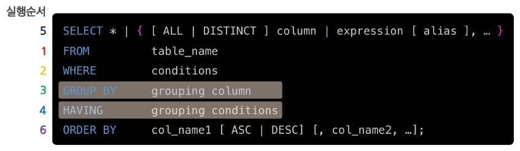

---
image: /img/posts/03-Dev/02-SQL/07-SELECT-EXECUTION-ORDER/select16.png
sidebar_class_name: hidden-sidebar-item
date: 2025-03-13
title: "[DML] SELECT - 쿼리 실행 순서"
description: SQL 엔진이 SELECT 문을 실제로 실행하는 순서를 시각적으로 정리합니다. FROM → WHERE → GROUP BY → HAVING → SELECT → ORDER BY → LIMIT 순서의 동작 원리를 쉽게 이해할 수 있습니다.
---

---
## 쿼리의 실행순서 (중요)

