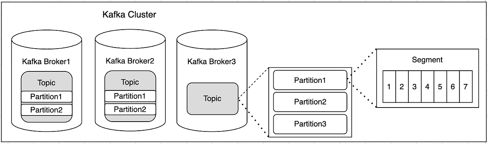
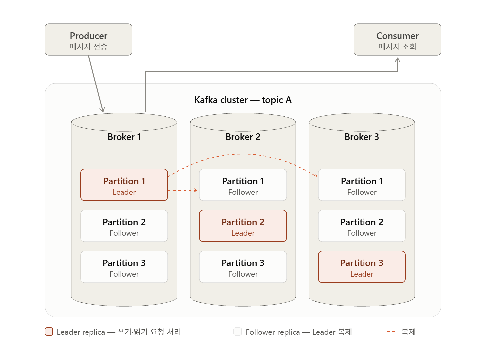

---
## Kafka의 구성요소



---
### Broker

---
#### Broker란?

Kafka에서 Broker는 **실제로 메시지를 저장하고, Producer/Consumer의 요청을 처리하는 Kafka 서버 프로세스**이다.

---
#### Broker의 역할

Broker의 역할에는 크게 3가지가 있다.

1. 메시지 저장
2. 요청 처리
3. Partition 관리

아래 예시로 알아보자.



예를들어, Producer가 A라는 Topic으로 메시지를 보낸다고 하자.

이 경우, A Topic과 함께 정의된 Partition들 중 하나가 선택된다.

해당 Partition은 여러 Broker에 Replica가 있다.

이 Partition의 Replica를 가진 Broker들 중 Leader Replica를 가지고 있는 Broker. 즉, **Leader Broker**가 메시지를 받아 로그에 append한다. (**메시지 저장**)

Consumer가 메시지를 읽을 때도 **Leader Broker**가 요청을 처리한다. (**요청 처리**)

Leader Replica를 제외한 나머지 Replica를 **Follower Replica**라고 한다. 이 Replica를 가진 Broker. 즉, Follower Broker는 Leader의 데이터를 복제한다. (**Partition 관리**)

---
#### Broker vs Controller

헷갈리기 쉬운 부분이 Broker와 Conroller이다.

| 구분         | 역할                                   |
| ---------- | ------------------------------------ |
| Broker     | 메시지 저장, Producer/Consumer 요청 처리 등    |
| Controller | 클러스터 메타데이터 관리, Partition Leader 선출 등 |

이후에 다시 언급하겠지만, Kafka의 클러스터 메타데이터는 Kafka 동작에 핵심적인 역할을 한다.

이에, 아래와 같이 이해하면 된다.

> **Broker = Data Plane**
> **Controller = Control Plane**

---
### Topic

---
#### Topic이란?

Topic이란 **메시지를 논리적으로 분류하는 단위**이다.

쉽게 말하면, Producer와 Consumer가 바라보는 **메시지 채널 이름**이라고 보면 된다.

---
#### Topic의 역할

Topic의 역할은 크게 3가지로 볼 수 있다.

1. 메시지 분류
2. Producer/Consumer의 논리적 연결점 제공
3. Partition의 논리적 묶음 제공

첫번째로, Topic은 Kafka에 저장되는 메시지를 **용도나 종류에 따라 논리적으로 분류하는 역할**을 한다.
- 예를 들어, 다양한 종류의 이벤트나 메시지들을 서로 다른 토픽으로 분류할 수 있다.
- 즉, Topic은 Kafka 내부의 메시지를 **카테고리화하는 단위**라고 볼 수 있다.

두번째로, Topic은 **Producer/Consumer의 논리적 연결점을 제공**한다.
- Producer는 메시지를 전송할 때 특정 Broker를 직접 지정하는 것이 아니라 어떤 Topic에 미시지를 보낼지 지정한다.
- 또한, Consumer도 일반적으로 특정 Partiiton을 지정하지 않고 Topic을 구독한다.
- 이후 Consumer Group의 Partition 할당 과정을 통해 Consumer가 담당할 Partition이 결정된다.

세번째로, Topic은 **Partition의 논리적 묶음을 제공**한다.
- Kafka에서 메시지가 실제로 저장되는 저장소 단위는 Topic이 아니라 Partition이다.
- 하나의 Topic은 하나 이상의 Partition으로 구성된다. (Topic이 지정되지 않은 Partition이란 존재할 수 없다)
- Partition의 갯수는 토픽을 생성할 때 지정할 수 있으며, 지정하지 않을 경우 클러스터에 설정된 기본 Partition 개수(`num.partitions`)로 생긴다.

---
### Partition

---
#### Partition이란?

Partition이란 Topic을 나눈 **실제 저장 및 병렬 처리 단위**이다.

Kafka에서 메시지는 Topic 자체에 직접 저장되는 것이 아니라, Topic에 속한 Partition에 저장된다.

하나의 Topic은 하나 이상의 Partition으로 구성된다.

각 Partition은 내부적으로 **순서가 있는 append-only 로그 형태**로 메시지를 저장한다.

이에, Partition 안의 각 메시지에는 `Offset`이라는 고유한 위치 번호가 부여된다.

---
#### Partition의 역할

Partition의 역할은 크게 3가지로 볼 수 있다.

1. 메시지 저장
2. 병렬처리
3. 순서 보장

첫번째로, Partition은 Kafka의 **메시지를 실제로 저장**하는 역할을 한다.
- Producer가 Topic으로 메시지를 보내면, 해당 Topic에 속한 Partition 중 하나가 선택되고 메시지가 해당 Partition의 로그 끝에 추가된다.
- 즉, Topic이 논리적인 분류 단위라면 Partition은 실제 메시지가 저장되는 단위이다.

두번째로, Partition은 Kafka가 **병렬처리를 할 수 있게**하는 역할을 한다.
- 하나의 Topic을 여러 Partition으로 나누면 메시지를 여러 Broker와 Consumer가 병렬로 처리할 수 있다.
- 같은 Consumer Group에 속한 Consumer들은 서로 다른 Partition을 할당받아 동시에 메시지를 처라할 수 있다.
- 단, **같은 Consumer Group에서는 하나의 Partition을 동시에 여러 Consumer가 처리할 수 없다.**
	- 파티션 내 순서 보장
		- offset 1, 3을 ConsumerA, offset 2, 4를 ConsumerB 에서 처리했을 때 Consumer의 처리 속도가 다르다면, 3이 2보다 먼저 완료될 수도 있다.
	- Offset 관리의 일관성
		- ConsumerA가 offset 3까지 처리했는데, ConsumerB가 offset 2 처리를 아직 못 끝냈다면, 그룹의 committed offset을 어디까지 올려야 할지 애매하다.
- 시스템 부하가 증가할 때, 파티션을 추가하여 처리 능력을 확장할 수 있다.

세번째로, Partition은 Partition 내부에서의 **순서를 보장**한다.
- **Kafka는 Topic 전체가 아니라 Partition 내부에서만 메시지 순서를 보장한다.**
- 위와 같이 같은 Consumer Group에서는 하나의 Partition을 하나의 Consumer만 처리하게 함으로써 Partition 내부에서의 순서를 보장한다.
- 만약 특정 기준으로 메시지 순서를 보장해야 한다면, 같은 Key를 가진 메시지가 동일한 Partition으로 들어가도록 설계한다.

---
#### Partition & Replica

Partition은 장애 대응을 위해 여러 Broker에 복제될 수 있다.

예를 들어 Replication Factor가 3이라면 하나의 Partition에 대해 3개의 Replica가 존재한다.

이 중 하나의 Replica가 **Leader Replica**가 되고, 나머지는 **Follwer Replica**가 된다.

Replica는 Controller에 의해 최대한 여러 브로커에 분산되어 배치된다.

Producer와 Consumer의 일반적인 읽기/쓰기 요청은 Leader Replica가 처리하며, Floower Replica는 Leader의 데이터를 복제한다.

Leader가 위치한 Broker에 장애가 발생하면, Controller가 적절한 Follower Replica를 새로운 Leader로 선출한다.

---
### Segment

---
#### Segment란?

Segment는 **Partition의 로그 파일을 일정 크기나 시간 단위로 나눈 실제 파일 단위**이다.

Kafka에서 Partition은 하나의 거대한 파일로 저장되지 않는다. Partition 내부 로그를 여러 Segment로 나누어 관리한다.

예를 들어,

```
Partition 0
├─ 00000000000000000000.log
├─ 00000000000001000000.log
├─ 00000000000002000000.log
└─ ...
```

각 `.log` 파일 하나가 하나의 Segment라고 보면 된다.

----
#### Segment의 역할

Segment의 역할은 크게 3가지로 볼 수 있다.

1. 로그 파일 분할
2. 데이터 삭제 및 보존 관리
3. 메시지 조회 효율화

첫번째로, Segment는 **로그 파일을 분할하는 단위 역할**을 한다.
- Partition에 메시지가 계속 쌓이면 로그 크기가 매우 커진다.
- 이를 하나의 파일로 계속 유지하면 파일 관리 비용이 커지기 때문에 Kafka는 Partition 로그를 여러 Segment로 나눈다.
- 현재 메시지가 기록되고 있는 Segment를 Active Segment라고 한다.
- Active Segment가 설정된 크기나 시간 조건을 만족하면 닫히고 새로운 Segment가 생성된다.

두번째로, Segment는 **데이터를 삭제 및 보존 관리를 하는 기준**이 된다.
- Kafka의 Retention은 기본적으로 Segment 단위로 처리된다.
- 예를 들어 메시지 보존 기간이 7일이라고 해도 개별 메시지를 하나씩 찾아 삭제하는 것이 아니다.
- 오래된 Segment 전체가 삭제 조건을 만족하면 해당 Segment 파일을 삭제한다.

세번째로 Segment는 **메시지 조회를 효율화**하는데 도움을 준다.
- 각 Segment에는 메시지가 저장되는 `.log` 파일뿐만 아니라 Offset을 빠르게 찾기 위한 인덱스 파일도 함께 존재한다. (ex : `00000000000000001000.log`, `00000000000000001000.index`, `00000000000000001000.timeindex`)
- 이 덕분에, Consumer가 특정 Offset의 메시지를 요청하면 이 인덱스를 이용해 해당 메시지를 빠르게 찾는 것이다.

---
### 기타 구성요소

---
#### 클러스터 메타데이터

```
Topic: order-topic

Partition 0
- Leader: Broker 1
- Replicas: Broker 1, Broker 2, Broker 3
- ISR: Broker 1, Broker 2, Broker 3

Partition 1
- Leader: Broker 2
- Replicas: Broker 2, Broker 3, Broker 1
- ISR: Broker 2, Broker 3, Broker 1
```

클러스터 메타데이터는 "**Kafka 클러스터가 현재 어떻게 구성되어 있는지에 대한 상태 정보**"이다.

일반적으로, 메타데이터라고하면 그냥 있으나 없으나 기능에는 큰 문제 없는 기록용 데이터라고 생각하기 쉬운데, Kafka의 클러스터 메타데이터는 다르다.

**실제로 Kafka가 동작할 때 계속 참조하는 핵심 제어 정보**이다.

예를 들어 Topic A의 Partition 1의 Leader Broker가 Broker 1이라는 메타데이터는 실제로 Producer가 어떤 Broker에 쓰기 요청을 보낼지에 대한 기준으로 사용된다.

이에 Controller의 핵심 기능 중 하나가 클러스터 메타데이터 상태 관리인 것이다.

---
#### Consumer Group

```
group-1
├── Consumer 1 → Partition 0
├── Consumer 2 → Partition 1
└── Consumer 3 → Partition 2
```

Consumer Group은 말 그대로 **여러 Consumer를 하나의 논리적인 소비 단위로 묶는 단위**이다.

위에서 말했듯이, 같은 Consumer Group에서 여러 Consumer가 각 Partition을 분담하여 병렬처리한다. 이와 동시에 하나의 Partition을 여러 Consumer가 동시에 처리할 수 없다.

즉, **Consumer Group은 여러 Consumer가 Partition을 분담하여 병렬 처리하면서도, 그룹 단위로 소비 위치(Offset)를 관리하기 위한 구조**라고 보면 된다.

---
