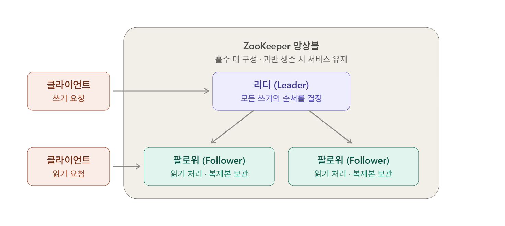
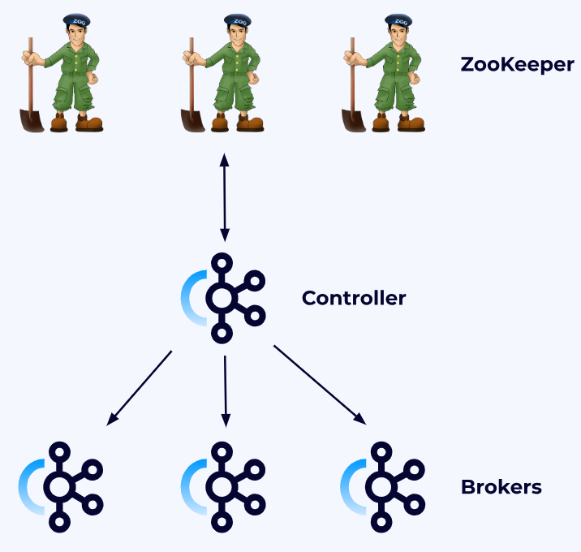
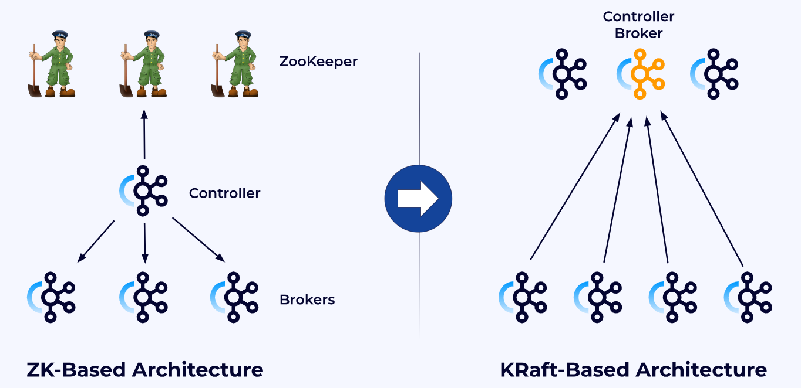
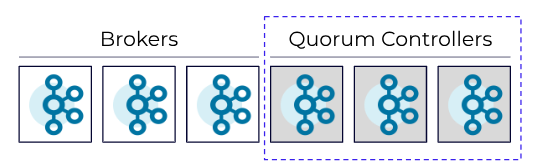
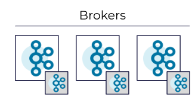

---
## Zookeeper

---
### Zookeeper 란?

Zookeeper는 분산 시스템에서 **여러 서버의 상태와 설정 정보를 일관되게 관리하기 위한 분산 코디네이션 시스템**이다.

여러 대의 서버가 하나의 작은 파일 시스템 같은 데이터를 완전히 동일하게 유지하면서, 그 위에서 Lock, 리더 선출, 설정 공유 같은 조율 작업을 하도록 해주는 시스템이다.

Zookeeper 시스템의 핵심은 쓰기와 읽기의 비대칭이다. 읽기는 접속한 Zookeeper 노드의 본인 메모리에서 바로 응답하므로 노드 수를 늘릴수록 빨라지지만, 쓰기는 반드시 리더를 거쳐 과반 동의(쿼럼)를 받아야 하므로 서버 수를 늘릴수록 느려진다.

이것이 Zookeeper가 '읽기가 압도적으로 많은 소량의 메타데이터'에만 적합한 이유이다.

이에, Kafka와 결합하여 Kafka Controller의 메타데이터를 저장, 감지하는 역할을 수행했던 것이다. 

---
### Kafka 클러스터 - Zookeeper 방식

Kafka의 고가용성, 복제, 장애조치 기능을 사용하기 위해서는 Broker 여러 대를 클러스터로 사용해야한다.

이러한 분산시스템을 사용하면 필연적으로 클러스터 전체의 상태를 일관되게 알고 장애에 대응해야한다.

이러한 요구사항을 충족시키기위해 사용했던 도구가 Zookeeper이다.

Kafka는 브로커 상태와 클러스터 메타데이터를 저장, 감지하고, Controller가 이를 기반으로 클러스터를 관리할 수 있도록 하기 위해 Zookeeper를 사용했다.

> 전체 과정을 요약하면 다음과 같다.
> 
> **Broker들이 ZooKeeper에 자신을 등록 → ZooKeeper가 세션 만료를 통해 Broker 상태 변화를 반영 → Controller가 해당 변화를 감지 → Controller가 클러스터 조정 후 관련 메타데이터를 갱신**

예를 들어 Broker 2가 죽으면:

1. Broker 2와 ZooKeeper 사이의 세션이 끊김
2. ZooKeeper에서 Broker 2의 임시 노드(ephemeral node)가 사라짐
3. Controller가 ZooKeeper의 변경 이벤트를 감지
4. Controller가 Broker 2가 장애라고 판단
5. Broker 2가 Leader였던 Partition에 대해 새로운 Leader를 선출
6. 변경된 Partition/Leader 정보를 다른 Broker들에게 전달

즉, 역할을 나누면:

- **ZooKeeper:** Broker 등록 정보, Controller 정보, 일부 클러스터 메타데이터를 저장하고 **변경을 감지**
- **Kafka Controller:** ZooKeeper의 정보를 바탕으로 **실제 클러스터 상태를 관리하고 의사결정**
- **Broker:** 자신의 상태를 ZooKeeper에 등록

> [!info] 메타데이터의 위치는 어디?
> - ZooKeeper는 Kafka 클러스터 제어용 메타데이터의 원본 저장소 역할을 했고, Controller와 Broker는 이를 읽어 로컬 메타데이터로 유지했다. (Zookeeper 기반 기준)
> - 메타데이터 성격을 띠는 Consumer Offset은 ZooKeeper가 아니라 Kafka 내부 토픽인 `__consumer_offsets`에 저장된다.

---
### Zookeeper 방식의 문제점

**운영 복잡도 증가**  
- Kafka 클러스터와 ZooKeeper 클러스터를 따로 설치·운영·모니터링해야 했다.

**메타데이터 관리 구조 이원화**  
- 일부 메타데이터는 ZooKeeper에, 실제 Kafka 동작은 Broker/Controller에서 처리되면서 구조가 복잡했음.

**Controller 장애 복구가 느릴 수 있음**  
- Controller가 바뀌면 새 Controller가 ZooKeeper에서 많은 클러스터 메타데이터를 다시 읽어와야 했음.

**대규모 클러스터 확장성 한계**  
- Topic/Partition 수가 매우 많아질수록 ZooKeeper에 저장되는 메타데이터와 watch/event 처리 부담이 커짐.

**상태 동기화 복잡성**  
- ZooKeeper의 상태와 Kafka Controller가 인지하는 상태를 일관되게 유지해야 해서 구현과 장애 처리 로직이 복잡했음.

---
## KRaft

---
### KRaft 란?

KRaft는 **Kafka가 Zookeeper 없이 자체적으로 클러스터 메타데이터와 Controller 선출을 관리하기 위한 방식**이다. (현재는 KRaft가 표준)

이름처럼 Raft 합의 알고리즘 계열의 메타데이터 쿼럼을 사용한다.

Controller들은 서로 합의를 통해 **하나의 Active Controller(Leader)** 를 정하고, Kafka 클러스터의 메타데이터를 **Metadata Log** 형태로 관리한다.

---
### KRaft Mode

---
#### KRaft Isolated Mode

Controller 역할을 하는 노드를 따로 배정하는 구조이다.

위 그림 예시로하면, 동일한 Kafka 프로세스 6개 중 3개는 Broker의 역할만 하고, 3개는 Controller의 역할만 하는 것이다.

이 구조가 대부분의 환경에서 추천되는 구조이며, 다음과 같은 장점이 있다.

- 브로커를 재시작하거나 스케일하더라도 컨트롤러의 쿼럼에 영향이 없다.
- Broker와 Controller를 독립적으로 스케일 할 수 있다.

---
#### KRaft Combined Mode

각 Kafka 프로세스가 Broker와 Controller의 역할을 동시에 하는 구조이다.

대부분의 환경에서 추천되지 않지만, 개발/테스트 환경 등에서 리소스 절약을 해야할 경우 이렇게 사용할 수도 있다.

- 브로커를 재시작하거나 스케일하면 컨트롤러의 쿼럼에 영향이 있다.
- Broker와 Controller를 독립적으로 스케일 할 수 없다.

---
