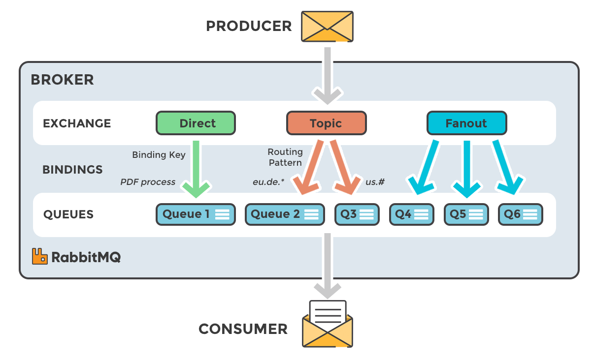
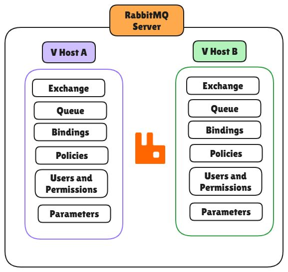

---
## RabbitMQ의 구성요소



---
### Broker(Node)

---
#### Broker란?

RabbitMQ에서 Broker는 **RabbitMQ 서버 프로세스 하나를 의미한다.**

RabbitMQ에서는 서버 인스턴스를 설명할 때 공식적인 구성 단위로는 주로 **Node**라는 용어를 사용한다. (Broker와 같은 말)

하나의 Broker는 Publisher와 Consumer의 연결을 받아들이고, Exchange와 Queue 등의 RabbitMQ 리소스를 운영하며 메시지 전달을 처리한다.

여러 Broker를 묶으면 하나의 RabbitMQ Cluster를 구성할 수 있다.

---
#### Broker의 역할

RabbitMQ Broker는 크게 다음과 같은 역할을 한다.

1. Client 연결 및 AMQP 요청 처리
2. 메시지 라우팅 및 전달 처리

예를 들어 Publisher가 메시지를 발행하면 Publisher는 RabbitMQ Broker와 연결된 Channel을 통해 Exchange로 메시지를 전송한다. (Client 연결 및 AMQP 요청 처리)

해당 Broker에서는 Exchange의 라우팅 규칙에 따라 메시지를 적절한 Queue로 전달하고, 이후 Queue를 구독 중인 Consumer에게 메시지를 전달한다. (메시지 라우팅 및 전달 처리)

즉, RabbitMQ Node는 메시지를 단순히 보관하는 저장 서버라기보다 **RabbitMQ의 메시징 동작 전체를 수행하는 서버 프로세스**라고 보는 것이 적절하다.

---
### Exchange

---
#### Exchange란?

Exchange는 **Publisher가 발행한 메시지를 어떤 Queue로 전달할지 결정하는 라우팅 구성요소**이다.

RabbitMQ에서 Publisher가 메시지를 보내는 목적지는 Queue가 아니라 Exchange이다.

Exchange는 자신의 **Exchange Type**, Publisher가 전달한 **Routing Key**, 그리고 Queue와 연결된 **Binding 정보​**를 기반으로 메시지를 어느 Queue로 보낼지 판단한다.

여기서 중요한 점은 다음과 같다.

> **Exchange는 메시지를 보관하는 저장소가 아니라 메시지를 라우팅하는 구성요소이다.**

메시지를 실제로 Consumer가 처리할 때까지 보관하는 역할은 Queue가 담당한다.

---
#### Exchange Type

Exchange가 메시지를 라우팅하는 방식은 Exchange Type에 따라 달라진다.

대표적인 Exchange Type은 다음과 같다.

| Exchange | 라우팅 기준                           | 특징                   |
| -------- | -------------------------------- | -------------------- |
| Direct   | Routing Key = Binding Key 정확히 일치 | 특정 종류의 메시지만 전달       |
| Fanout   | Routing Key 무시, 연결된 모든 Queue에 전달 | 연결된 모든 Queue에 복제     |
| Topic    | Routing Key와 Binding Pattern 비교  | `*`, `#`를 이용한 패턴 라우팅 |

---
### Binding

---
#### Binding이란?

Binding은 **Exchange와 Queue 사이의 연결 관계와 라우팅 조건을 정의하는 구성요소**이다.

Exchange가 존재하고 Queue가 존재한다고 해서 자동으로 두 리소스가 연결되는 것은 아니다.

Exchange가 특정 Queue로 메시지를 전달하려면 두 리소스 사이에 Binding이 정의되어 있어야 한다.

---
#### Binding의 구성요소

|요소|의미|
|---|---|
|**Source**|메시지가 나오는 Exchange|
|**Destination**|메시지를 전달할 대상 Queue 또는 Exchange|
|**Destination Type**|목적지가 `queue`인지 `exchange`인지 지정|
|**Binding Key**|어떤 Routing Key를 가진 메시지를 전달할지 결정하는 조건|
|**Vhost**|해당 Binding이 존재할 Virtual Host|

아래 예시는, 쿠버네티스에서 RabbitMQ 클러스터를 오퍼레이터 패턴으로 구성할 때 사용하는 `Binding` CR 예시이다.

Binding의 요소가 잘 정의되어있는 것을 볼 수 있다. (아래에 정의된 `routingKey`는 바인딩 키이다. RabbitMQ API에서는 바인딩키도 라우팅키라고 정의한다)

```yaml
apiVersion: rabbitmq.com/v1beta1
kind: Binding
metadata:
  name: direct-error-binding
  namespace: rabbitmq
spec:
  source: direct-exchange
  destination: direct-error-queue
  destinationType: queue
  routingKey: error
  vhost: /app-a
  rabbitmqClusterReference:
    name: rabbitmq-cluster
```

---
#### Routing Key vs Binding Key

|구분|Routing Key|Binding Key|
|---|---|---|
|설정 위치|Publisher|Binding|
|역할|메시지의 라우팅 값|받을 메시지의 라우팅 조건|
|비교 대상|Binding Key와 비교|Routing Key와 비교|

> [!tip] 이 이름은 혼용된다.
> - RabbitMQ API에서는 Binding에 설정하는 키도 `routingKey`라는 이름을 사용한다.  
> - 개념 설명에서는 Publisher의 Routing Key와 구분하기 위해 이를 **Binding Key**라고 부르는 경우가 많다.

---
### Queue

---
#### Queue란?

Queue는 **메시지를 Consumer가 처리할 때까지 보관하는 RabbitMQ의 핵심 메시지 저장 단위**이다.

Exchange가 어디로 보낼지를 결정한다면, Queue는 전달된 메시지를 보관한다.

Consumer가 Queue를 구독하면, Queue는 해당 Consumer에게 메시지를 전달한다.

만약, 하나의 Queue를 여러 Consumer가 구독하면 Queue의 메시지를 여러 Consumer가 나누어 처리할 수 있다. (Message 1 -> Customer A / Message 2 -> Customer B)

따라서 RabbitMQ에서는 하나의 Queue에 여러 Worker Consumer를 연결하여 처리량을 확장하는 방식이 흔히 사용된다.

---
## 기타 개념들

---
### ACK

---
#### ACK이란?

ACK(Acknowledgement)는 **Consumer가 전달받은 메시지를 정상적으로 처리했다는 사실을 RabbitMQ에 알려주는 확인 응답**이다.

Manual ACK를 사용하는 경우 RabbitMQ는 Consumer에게 메시지를 전달했다는 사실만으로 메시지 처리가 끝났다고 판단하지 않는다.

Consumer가 메시지를 정상 처리한 뒤 ACK를 보내면 해당 메시지가 정상적으로 처리된 것으로 판단한다.

---
#### ACK이 필요한 이유

Consumer가 메시지를 전달받은 직후 장애가 발생했다고 하자. (애플리케이션 레벨 장애)

Consumer가 아직 ACK를 보내지 않은 상태에서 Connection이 종료되면 RabbitMQ는 해당 메시지를 다시 전달 가능한 상태로 만들 수 있다. (Manual ACK 기준)

이후 다른 Consumer가 해당 메시지를 다시 처리할 수 있다.

따라서 ACK는 **RabbitMQ → Consumer 구간에서 메시지가 실제로 처리되었는지를 확인하기 위한 핵심 메커니즘**이다.

---
#### NACK

NACK은 **Consumer가 메시지를 정상적으로 처리하지 못했음을 RabbitMQ에 알리는 방법**이다.

이때 해당 메시지를 다시 Queue로 돌려보낼지 여부를 지정할 수 있다.

재처리가 필요한 경우는 `requeue = true`로 RabbitMQ에 NACK을 응답한다. 이 경우 같은 Queue에 메시지가 다시 들어간다.

해당 메시지를 폐기해야하는 경우는 `requeue = false`로 RabbitMQ에 NACK을 응답한다. 이 경우 해당 메시지는 원래 Queue에 다시 들어가지 않는다. (DLX 설정이 되어있다면 DLX로 전달되고, 아니라면 폐기된다)

> Reject라는 개념도 있는데, NACK과 같은 개념이라고 생각하면된다. 차이점은 Reject는 한번에 1개씩만 처리 가능하고, NACK은 한번에 여러 개 처리가 가능하다.

---
### Connection & Channel

---
#### Connection이란?

Connection은 **RabbitMQ Client와 RabbitMQ Node 사이에 생성되는 TCP 연결**이다.

Publisher와 Consumer 모두 RabbitMQ와 통신하려면 먼저 Connection을 생성해야 한다.

Connection 생성은 TCP 연결과 인증 등의 과정이 필요하기 때문에 비교적 비용이 큰 작업이다.

따라서 메시지를 하나 보낼 때마다 Connection을 새로 만들기보다는 **Connection을 일정 기간 유지하고 재사용하는 방식**이 일반적이다.

---
#### Channel이란?

Channel은 **하나의 Connection 내부에서 생성되는 논리적인 AMQP 통신 세션**이다.

하나의 Connection 위에 여러 Channel을 생성할 수 있다.

Exchange 선언, Queue 선언, 메시지 Publish, 메시지 Consume 등의 대부분의 AMQP 작업은 Channel을 통해 수행된다.

---
#### Connection과 Channel을 분리하는 이유

애플리케이션이 동시에 여러 메시징 작업을 해야 한다고 해서 각각 별도의 TCP Connection을 만든다면 Connection 수가 크게 증가한다.

이를 피하기 위해 하나의 TCP Connection 위에서 여러 개의 가벼운 Channel을 사용할 수 있도록 한 것이다.

따라서 일반적으로 다음과 같이 이해하면 된다.

> **Connection = 실제 네트워크 연결**
> 
> **Channel = Connection 위에서 사용하는 논리적인 작업 단위**

---
### Virtual Host

---
#### Virtual Host란?



Virtual Host, 줄여서 vhost는 **하나의 RabbitMQ Cluster 내부에서 리소스와 권한을 논리적으로 분리하는 단위**이다.

각 vhost는 독립적인 이름 공간을 가진다.

따라서 Exchange, Queue, Binding 등은 특정 vhost에 속한다.

예를 들어 `/app-a`와 `/app-b` 라는 이름의 Virtual Host가 존재한다면, 양쪽에 모두 `task-queue`라는 이름의 Queue를 생성할 수 있다. 당연히 이 둘은 서로 다른 Queue가 된다.

---
#### Virtual Host의 역할

Virtual Host의 핵심 역할은 다음 두 가지이다.

1. 리소스 격리
2. 접근 권한 격리

RabbitMQ 사용자 권한 역시 vhost 단위로 설정할 수 있다.

예를 들어,

```
app-a-user → /app-a 접근 가능
app-b-user → /app-b 접근 가능
```

와 같이 애플리케이션 또는 업무 영역을 분리할 수 있다.

따라서 Virtual Host는 하나의 RabbitMQ Cluster를 여러 시스템이 함께 사용할 때 **논리적인 테넌트 또는 업무 경계**를 만드는 용도로 활용할 수 있다.

---
### Quorum Queue

---
#### Quorum Queue란?

> Kafka에는 각 Partition에 대한 Replica가 존재하는데, RabbitMQ에서 이 역할을 하는 것이 Quorum Queue이다.

Quorum Queue는 **하나의 Queue를 여러 RabbitMQ Node에 Replica 형태로 복제하여 고가용성을 제공하는 Queue Type**이다.

Quorum Queue는 Raft 합의 알고리즘을 기반으로 동작한다.

하나의 Replica가 Leader 역할을 하고 나머지 Replica가 Follower 역할을 한다.

---
#### Quorum Queue의 동작

메시지는 Leader를 중심으로 처리되며, 상태가 다른 Replica에도 복제된다.

Leader가 위치한 Node에 장애가 발생하면 남아 있는 Replica들이 새로운 Leader를 선출할 수 있다.

이에, 특정 Queue에 장애가 나더라도 Queue의 기능을 계속 제공할 수 있다.

단, Raft 기반이기 때문에 정상적인 동작을 위해서는 **과반수의 Replica가 사용 가능한 상태**여야 한다.

---
### Dead Letter Exchange

---
#### Dead Letter Exchange란?

Dead Letter Exchange, 줄여서 DLX는 **기존 Queue에서 정상적으로 처리되지 않은 메시지를 다른 경로로 다시 라우팅하기 위해 사용하는 Exchange**이다.

예를 들어 Consumer가 메시지를 처리하지 못했고 더 이상 원래 Queue에서 재처리하지 않으려는 경우 다음과 같은 구조를 만들 수 있다.

```
Main Queue
    │
    │ Dead Letter
    ▼
   DLX
    │
    ▼
Failed Queue
```

---
#### 메시지가 Dead Letter가 되는 경우

대표적으로 다음과 같은 경우 메시지가 Dead Letter 처리될 수 있다.

1. Consumer가 메시지를 Reject하면서 `requeue=false`로 처리한 경우
2. Consumer가 NACK하면서 `requeue=false`로 처리한 경우
3. 메시지 TTL이 만료된 경우
4. Queue의 길이 제한을 초과한 경우
5. Quorum Queue에서 Delivery Limit을 초과한 경우

이 경우 메시지는 Queue에 설정된 Dead Letter Exchange로 전달될 수 있다.

---
#### DLX와 DLQ

DLX와 DLQ는 서로 다른 개념이다.

| 구분  | 역할                                  |
| --- | ----------------------------------- |
| DLX | Dead Letter 메시지를 다시 라우팅하는 Exchange  |
| DLQ | Dead Letter 메시지를 보관하기 위해 사용하는 Queue |

일반적인 구성은 다음과 같다.

```
Main Queue
    │
    ▼
   DLX
    │
    ▼
   DLQ
```

여기서 중요한 점은 RabbitMQ에 `DLQ`라는 특별한 Queue Type이 따로 존재하는 것은 아니라는 것이다.

일반 Queue를 실패 메시지를 보관하는 용도로 사용하고 이를 **Dead Letter Queue**라고 부르는 것이다.

---
### Publisher Confirm & Manual / Auto ACK

---
#### Publisher Confirm

Publisher Confirm은 **Publisher가 보낸 메시지를 RabbitMQ가 정상적으로 수신·처리했는지 확인하는 기능**이다.

Publisher가 메시지를 발행한 뒤 RabbitMQ로부터 `ack` 또는 `nack`을 받는다.

즉, **Publisher → RabbitMQ 구간의 메시지 유실을 방지하기 위한 기능**이다.

---
#### Manual / Auto ACK

Manual Ack는 **Consumer가 메시지를 정상적으로 처리한 뒤 RabbitMQ에 직접 Ack를 보내는 방식**이다.

Consumer가 처리 중 장애가 나서 Ack를 보내지 못하면 RabbitMQ는 해당 메시지를 다시 전달할 수 있다.

Auto Ack은 Consumer의 응답과 상관없이 **Consumer가 메시지를 받는 즉시 RabbitMQ가 처리 완료로 간주하는 방식**이다.

즉, **RabbitMQ → Consumer 구간에서 처리되지 않은 메시지가 유실되는 것을 방지하기 위한 기능**이다.

---
#### 경우의 수

|Publisher Confirm|Manual Ack|결과|
|---|---|---|
|OFF|OFF|Publisher 측 유실 가능 + Consumer 처리 중 유실 가능|
|ON|OFF|Publisher → RabbitMQ 전달은 확인 가능, Consumer 처리 중 유실 가능|
|OFF|ON|Consumer 처리 실패 시 재처리 가능, Publisher가 메시지를 제대로 보냈는지는 확인 불가|
|ON|ON|Publisher 전달 확인 + Consumer 처리 완료 확인 가능|
중요한 메시지는 Manual Ack + Publisher Confirm ON이 일반적으로 더 안전하지만, 아무래도 처리하는데 더 많은 비용을 요구한다.

트레이드 오프를 잘 생각하고 결정

성능과 요구사항에 따라 항상 필수는 아니다. (대부분 필수)

---
