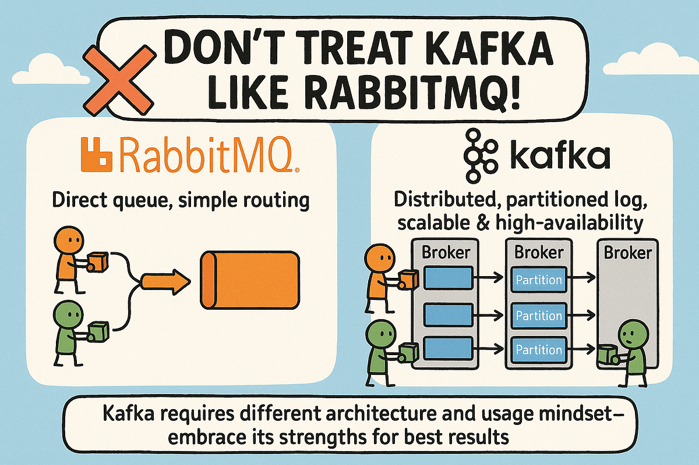

---
## Kafka vs RabbitMQ

---
### 개요



Kafka와 RabbitMQ는 모두 **애플리케이션 사이에서 메시지를 비동기적으로 전달하기 위한 메시징 시스템**이다.

하지만 내부 구조와 메시지를 다루는 방식은 꽤 다르다.

가장 러프하게 보면 다음과 같다.

> **Kafka = 메시지를 로그 형태로 보존하고, Consumer가 자신의 위치에서 읽는 시스템**
> 
> **RabbitMQ = 메시지를 Queue에 넣고, 필요한 Consumer에게 전달하여 처리하는 시스템**

따라서 둘은 모두 메시징 시스템이지만, 적합한 업무 유형과 설계 방식이 다르다.

이번 글에서는 이 둘을 비교하고 어떤 스택을 선택해야하는지에 대한 판단 기준을 소개한다.

---
### 요약

**비교 표**

| 구분              | Kafka                                         | RabbitMQ                                              |
| --------------- | --------------------------------------------- | ----------------------------------------------------- |
| **메시지 저장 방식**   | Partition의 **Log에 저장**, Retention 기반 보존       | **Queue에 저장**, ACK 후 일반적으로 제거                         |
| **메시지 소비 방식**   | **Pull** 방식, Consumer가 Polling                | **Push** 방식, Broker가 Consumer에게 전달                    |
| **병렬 처리 방식**    | **Partition 단위**로 Consumer에게 분배               | **Message 단위**로 Consumer에게 분배                         |
| **메시지 순서 보장**   | **Partition 내부 순서 보장**                        | Queue 순서대로 전달하지만 다중 Consumer에서는 **처리 완료 순서 보장 어려움**   |
| **메시지 재처리**     | Offset을 이동하여 **과거 메시지 Replay 가능**             | ACK된 메시지는 제거되므로 **과거 메시지 Replay가 기본적으로 불가능**          |
| **실패 메시지 처리**   | Retry Topic / DLQ Topic 등을 **애플리케이션 레벨에서 구성** | **DLX / DLQ / Retry Queue** 등을 활용                     |
| **메시지 라우팅**     | **Topic 중심**의 비교적 단순한 구조                      | **Exchange / Routing Key / Binding**을 이용한 복잡한 라우팅 가능  |
| **고가용성 구조**     | **Partition Replica** 기반, Leader 장애 시 재선출     | Quorum Queue 기준 **Queue Replica** 기반, Leader 장애 시 재선출 |
| **확장 방식**       | **Partition / Broker / Consumer** 확장          | 주로 **Consumer 추가**, 필요 시 Queue 분할                     |
| **처리량과 시스템 성격** | 대규모 **Event Streaming**과 높은 처리량에 적합           | 개별 **Message Delivery / Task Processing**에 적합         |

**판단 기준**

1. 이 메시지는 Event인가 Task인가?
	- Event -> Kafka
	- Task -> RabbitMQ
2. 메시지를 처리한 이후에도 다시 읽어야 하는가?
	- O -> Kafka
	- X -> RabbitMQ
3. 같은 메시지를 어려 시스템이 각각 처리해야 하는가?
	- O -> Kafka
	- X -> RabbitMQ
4. 복잡한 라우팅이 필요한가?
	- O -> RabbitMQ
	- X -> Kafka
5. 처리량이 매우 큰가?
	- O -> Kafka
	- X -> RabbitMQ

---
### 메시지 저장 방식

---
#### Kafka

Kafka에서는 메시지를 **Partition 내부의 append-only 로그 형태로 저장**한다.

Consumer가 Message A를 읽었다고 해서 Message A가 바로 삭제되지는 않는다.

메시지는 Retention 정책에 따라 계속 보존된다.

따라서 여러 Consumer Group이 동일한 메시지를 서로 독립적으로 읽을 수 있다. (각 Consumer Group은 자신의 Offset을 별도로 관리한다)

---
#### RabbitMQ

RabbitMQ의 일반적인 Queue 모델에서는 메시지가 **Consumer가 처리할 때까지 Queue에 보관**된다.

Consumer가 Message A를 전달받고 정상적으로 ACK하면 해당 메시지는 Queue에서 제거된다.

즉 RabbitMQ의 Queue는 메시지를 장기적으로 보관하기 위한 저장소라기보다, **처리되기 전까지 메시지를 대기시키는 공간**에 가깝다.

---
#### 비교

| Kafka                      | RabbitMQ                     |
| -------------------------- | ---------------------------- |
| 메시지를 로그에 저장                | 메시지를 Queue에 저장               |
| Consumer가 읽어도 바로 삭제되지 않음   | ACK 후 일반적으로 제거               |
| Retention 기반 보존            | 처리 완료 여부 중심                  |
| Consumer Group별 독립적인 소비 가능 | 같은 Queue의 Consumer들은 메시지를 분담 |

이 차이가 Kafka와 RabbitMQ의 구조적 차이 대부분의 출발점이라고 볼 수 있다.

---
### 메시지 소비 방식

---
#### Kafka

Kafka Consumer는 Broker에 데이터를 요청하여 가져오는 **Pull 방식**으로 동작한다.

더 구체적으로는, Consumer는 지속적으로 Broker에 Polling하여 데이터를 가져온다.

Consumer가 자신의 처리 속도에 맞춰 데이터를 가져갈 수 있기 때문에 대량 데이터를 처리하기에 유리하다.

---
#### RabbitMQ

RabbitMQ의 일반적인 Consumer 구독 방식은 **Push 방식**이다.

Consumer가 Queue를 구독하면 RabbitMQ가 Queue의 메시지를 Consumer에게 전달한다.

단, RabbitMQ가 Consumer에게 무한정 메시지를 밀어 넣는 것은 아니다.

`prefetch` 값을 사용하면 Consumer가 동시에 보유할 수 있는 미확인(Unacked) 메시지 수를 제한할 수 있다.

---
### 병렬 처리 방식

---
#### Kafka

Kafka에서는 Consumer Group 내부에서 **Partition 단위로 작업을 분배**한다.

같은 Consumer Group에서는 하나의 Partition을 동시에 여러 Consumer가 처리하지 않는다.

따라서 Consumer를 늘리더라도 Partition 수보다 Consumer 수가 많아지면 일부 Consumer는 처리할 Partition이 없어 대기하게 된다.

즉 Kafka에서 병렬 처리 수준은 **Partition 수에 큰 영향을 받는다.**

---
#### RabbitMQ

RabbitMQ에서는 하나의 Queue를 여러 Consumer가 구독할 수 있고, **메시지 단위로 Consumer에게 작업이 분배**된다.

따라서 일반적인 Work Queue 구조에서는 Consumer를 추가하는 방식으로 처리량을 확장하기 쉽다.

---
### 메시지 순서 보장

---
#### Kafka

Kafka는 **Partition 내부의 메시지 순서를 보장**한다.

하지만 Topic 전체에 대한 전역 순서를 보장하는 것은 아니다.

특정 기준으로 순서를 보장해야 한다면 같은 Key를 가진 메시지를 동일한 Partition으로 보내는 방식이 일반적이다.

---
#### RabbitMQ

RabbitMQ Queue도 기본적으로 Queue에 들어온 순서대로 메시지를 전달하려고 한다.

하지만 여러 Consumer가 동시에 하나의 Queue를 소비하면 **처리 완료 순서까지 보장되는 것은 아니다.**

```
Message 1 → Consumer A
Message 2 → Consumer B
```

위와같은 상황에서, Consumer B가 더 빨리 처리하면 Message 2가 Message 1보다 먼저 처리 완료될 수 있다.

---
### 메시지 재처리

---
#### Kafka

Kafka의 대표적인 장점 중 하나이다.

메시지가 Retention 기간 동안 남아 있기 때문에 Consumer의 Offset을 이전 위치로 이동하면 과거 데이터를 다시 읽을 수 있다.

Offset 5까지 메시지를 Consume 했더라도, Offset을 2로 되돌리면 Offset 2 이후 메시지를 다시 처리할 수 있다.

---
#### RabbitMQ

일반적인 RabbitMQ Queue에서는 Consumer가 ACK한 메시지가 Queue에서 제거된다.

따라서 Kafka처럼 특정 시점으로 돌아가 과거 메시지를 다시 읽는 구조가 기본적으로 존재하지 않는다.

실패 메시지 재처리가 필요하다면 보통 별도 Retry Queue나 DLQ를 구성한다.

즉 RabbitMQ의 재처리는 주로 **실패한 메시지를 다시 처리하는 것**에 초점이 맞춰져 있다.

Kafka의 Replay와는 성격이 다르다.

---
### 실패 메시지 처리

---
#### Kafka

Kafka 자체에는 RabbitMQ의 DLX와 동일한 기능이 기본적으로 존재하지 않는다.

일반적으로 애플리케이션 또는 프레임워크 레벨에서 Retry Topic과 DLQ Topic을 설계한다.

따라서 실패 메시지 처리 정책을 **애플리케이션이 직접 관리**하는 경우가 많다.

---
#### RabbitMQ

RabbitMQ는 Dead Letter Exchange 기능을 제공한다.

Queue에 DLX를 설정해두면 특정 조건에서 메시지를 자동으로 다른 Exchange로 라우팅할 수 있다.

전형적인 업무 Queue에서 실패 메시지 처리를 구성하기에 유리하다.

---
### 메시지 라우팅

---
#### Kafka

Kafka의 라우팅 구조는 비교적 단순하다.

Producer는 메시지를 특정 Topic으로 보내고, 해당 메시지는 Topic의 Partition 중 하나에 저장된다.

여러 시스템이 동일한 데이터를 필요로 한다면 서로 다른 Consumer Group이 같은 Topic을 구독한다.

---
#### RabbitMQ

RabbitMQ는 메시지 라우팅 기능이 강하다.

Publisher가 Exchange로 메시지를 보내면 Exchange Type, Routing Key, Binding 조건을 이용해 여러 Queue로 메시지를 분배할 수 있다.

예를 들어 Topic Exchange라면,

```
Publisher
    │
    │ payment.error
    ▼
Topic Exchange
    │
    ├─ payment.* → payment-queue
    ├─ *.error   → error-queue
    └─ #         → audit-queue
```

와 같은 형태로 하나의 메시지를 여러 조건에 따라 여러 Queue로 전달할 수 있다.

따라서 **라우팅 자체가 중요한 시스템에서는 RabbitMQ가 강하다.**

---
### 고가용성 구조

---
#### Kafka

Kafka에서는 Partition을 여러 Broker에 Replica로 복제한다.

Leader Broker에 장애가 발생하면 Controller가 적절한 Follower Replica를 새로운 Leader로 선출한다.

즉 Kafka에서는 **Partition이 복제 단위**이다.

---
#### RabbitMQ

RabbitMQ의 고가용성은 Queue Type에 따라 달라진다.

Quorum Queue를 사용하면 하나의 Queue가 여러 Node에 Replica 형태로 존재한다.

Leader Node에 장애가 발생하면 새로운 Leader를 선출할 수 있다.

따라서 RabbitMQ에서는 **Cluster를 구성하는 것과 Queue 데이터를 복제하는 것을 구분해서 봐야 한다.**

---
### 확장 방식

---
#### Kafka

Kafka의 처리량 확장은 주로 **Partition 수와 Broker 수를 늘리는 방식**으로 이루어진다.

```
Partition 0
Partition 1
Partition 2
Partition 3
Partition 4
```

Partition이 늘어나면 여러 Broker와 Consumer가 데이터를 병렬로 처리할 수 있다.

다만 Partition 수는 다음과 같은 요소에 영향을 준다.

- Consumer 병렬성
- Broker 부하
- Leader Election
- 파일 및 메타데이터 수

따라서 단순히 많을수록 좋은 것은 아니다.

---
#### RabbitMQ

RabbitMQ에서는 일반적인 Work Queue의 경우 **Consumer 수를 증가**시켜 처리 능력을 확장할 수 있다.

```
Queue
├─ Consumer A
├─ Consumer B
├─ Consumer C
└─ Consumer D
```

필요한 경우 Queue 자체를 여러 개로 분리하고 Exchange Routing을 통해 작업을 나누는 방식도 사용할 수 있다.

---
### 처리량과 시스템 성격

---
#### Kafka

Kafka는 대규모 순차 I/O와 Batch 처리에 최적화되어 있다.

따라서 다음과 같은 특성을 가진다.

- 매우 높은 처리량
- 대량 이벤트 처리에 유리
- Batch Produce / Fetch에 적합
- 장기간 이벤트 보존 가능

즉, **대규모 데이터 스트림을 지속적으로 처리하는 환경**에 강하다.

---
#### RabbitMQ

RabbitMQ는 개별 메시지의 전달과 업무 단위 처리에 강하다.

다음과 같은 환경에 잘 맞는다.

- Task Queue
- 비동기 업무 처리
- 개별 메시지 ACK
- Retry / DLQ
- 복잡한 Routing
- Worker 기반 작업 분배

따라서 단순히, 'Kafka가 빠르고 RabbitMQ가 느리다'라고 보는 것은 적절하지 않다.

보다 정확하게는,

> **Kafka는 대규모 Event Streaming에 최적화**
> 
> **RabbitMQ는 Message Delivery와 Task Processing에 최적화**

되어 있다고 보는 편이 맞다.

---
## 어떤 상황에 무엇을 선택해야 하는가?

---
### 기준 1. 이 메시지는 Event인가 Task인가?

가장 먼저 볼 수 있는 기준이다.

예를 들어,

```
"사용자가 주문을 완료했다."
```

는 이미 발생한 사실을 나타낸다.

이런 메시지는 여러 시스템에서 활용할 수 있고 나중에 다시 읽을 가치도 있다.

→ **Kafka에 가까움**

반면,

```
"이 이메일을 발송해라."
```

는 누군가 한 번 처리하면 되는 작업이다.

→ **RabbitMQ에 가까움**

러프하게 보면,

> **Event → Kafka**
> 
> **Task / Command → RabbitMQ**

라고 볼 수 있다.

---
### 기준 2. 메시지를 처리한 이후에도 다시 읽어야 하는가?

다음과 같은 요구가 있다면 Kafka에 가깝다.

- 과거 데이터 재처리
- 신규 Consumer가 과거부터 소비
- 분석
- Audit
- Event History

반대로,

> 정상적으로 한 번 처리하면 끝

이라면 RabbitMQ에 가깝다.

---
### 기준 3. 같은 메시지를 여러 시스템이 각각 처리해야 하는가?

예를 들어 주문 이벤트를 다음 시스템들이 모두 필요로 한다고 하자.

```
결제
재고
추천
분석
```

이 경우 Kafka의 Consumer Group 구조가 자연스럽다.

```
order-topic
├─ payment-group
├─ inventory-group
├─ analytics-group
└─ recommendation-group
```

반대로 하나의 작업을 여러 Worker 중 **한 명만 처리하면 되는 경우**라면 RabbitMQ가 자연스럽다.

```
task-queue
├─ worker-1
├─ worker-2
└─ worker-3
```

즉,

> **같은 메시지를 여러 시스템이 각각 소비 → Kafka**
> 
> **여러 Worker 중 하나가 처리 → RabbitMQ**

라고 보면 된다.

---
### 기준 4. 복잡한 라우팅이 필요한가?

다음과 같은 조건에 따라 메시지를 다양한 목적지로 보내야 한다면 RabbitMQ가 유리하다.

- 이벤트 종류
- 업무 유형
- 우선순위
- 지역
- 메시지 속성

반대로 Topic 단위로 단순하게 분류하고 Consumer가 필요한 Topic을 구독하는 구조라면 Kafka가 자연스럽다.

---
### 기준 5. 처리량이 매우 큰가?

대규모 이벤트가 지속적으로 유입되는 경우 Kafka가 강하다.

예를 들어,

```
수십만 Events/sec
수 TB/day
```

수준의 지속적인 Stream 처리라면 Kafka가 적합하다.

다만,

> **처리량이 높으면 무조건 Kafka**

라고 판단해서는 안 된다.

메시지의 성격과 소비 방식이 더 중요한 기준이다.

---
## 판단 예시

---
### 대용량 로그·이벤트 스트림 처리

여러 서비스에서 로그와 이벤트를 중앙으로 수집한다고 하자.

```
Service A ─┐
Service B ─┼─→ Kafka ─→ Analytics
Service C ─┤          ├→ Elasticsearch
Service D ─┘          └→ Data Lake
```

이 경우 Kafka가 적합하다.

이유는 다음과 같다.

- 높은 이벤트 처리량
- 여러 Consumer 시스템이 같은 데이터 소비 가능
- 메시지 장기 보존
- Consumer 장애 이후 이어서 처리 가능
- 과거 이벤트 Replay 가능

---
### 비동기 작업 처리

주문 이후 이메일 발송 같은 작업을 처리한다고 하자.

```
Order Service
     │
     ▼
RabbitMQ
     │
     ▼
Email Queue
     │
     ├─ Worker 1
     ├─ Worker 2
     └─ Worker 3
```

이 경우 RabbitMQ가 적합하다.

이유는 다음과 같다.

- 하나의 작업을 하나의 Worker가 처리
- ACK를 통한 처리 완료 확인
- 실패 시 Retry / DLQ 가능
- Worker 확장이 쉬움
- 정상 처리된 과거 메시지를 다시 읽을 필요가 없음

---
### 주문 이벤트를 여러 시스템이 사용하는 경우

반대로 `주문이 발생했다`라는 사실 자체를 여러 시스템이 소비해야 한다면 Kafka가 더 자연스럽다.

```
                 ┌─ Payment
                 ├─ Inventory
Order Service → Kafka
                 ├─ Analytics
                 └─ Recommendation
```

`Order Created`는 누군가 한 번 처리하고 끝내는 작업이 아니라 **여러 시스템에서 활용할 수 있는 이벤트**이기 때문이다.

---
