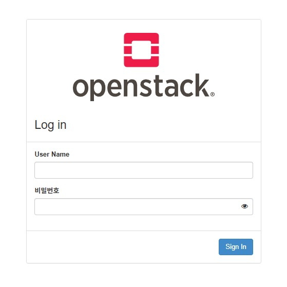

---
## 왜 `MicroStack`?

`OpenStack`을 공부하고 테스트하는 용도로 설치하고싶었다. 

하지만, 실제 운영환경 수준의 `OpenStack`은 Quorum 확보가 되는 홀수개의 `Controller Node`, 여러 대의 `Compute Node`, VM의 볼륨(`Cinder`)나 이미지(`Glance`) 등을 저장할 `Storage Node` 여러 대, 이중화된 네트워크 장비 등이 필요하고, 네트워크 분리, HA 등 많은 설치 과정과 설정또한 엄청나게 복잡하다.

위와 같은 운영환경이 아닌 최소 환경으로 설치할 수도 있지만, 그마저도 굉장히 복잡해서 `Kolla-Ansible`과 같은 자동화 도구를 쓰는 것이 일반적이다.

나는 실제로 내가 개인적으로 필요한 환경은 `Proxmox`에서 운영하면 되고 `OpenStack`은 학습용으로 구축하는 것이기 때문에 설치나 설정에 많은 시간을 쏟을 필요는 없기 때문에 `MicroStack`을 선택했다.

당연히 `Microstack`을 운영환경으로 사용하는 것은 권장되지 않는다.

---
## `MicroStack` 설치 및 접속

:::warning
만약 VM에서 설치한다면, 중첩 가상화(Nested Virtualization)이 활성화 되어있는지 바이오스에서 확인하자.
활성화되어있지 않다면 활성화해야한다.
:::

### 설치

```bash
sudo snap install --beta microstack
```


### 설정

```bash
# --auto 옵션으로 기본적인 설정 자동 진행
sudo microstack init --auto --control
```

- 앞서 언급했듯이 `OpenStack`은 굉장히 많은 설정이 있어서 복잡하기로 악명이 높은데 `MicroStack`은 위 명령어로 설정이 완료된다.


### 접속 정보 확인

```bash
sudo snap get microstack config.credentials.keystone-password
```

- 출력되는 비밀번호 기억해두기


### 접속



- https://설치한환경의IP 로 접속 (`http`가 아닌 `https`임에 유의)
- 로그인
	- ID: admin
	- PW: 기록해둔 비밀번호 입력


### 비밀번호 변경

```bash
microstack.openstack user password set --password 새비밀번호
```

- Current Password: 뜨면, 위에서 확인한 비밀번호 입력하기


```bash
sudo snap set microstack config.credentials.admin=새비밀번호
```

```bash
sudo sed -i "s/^export OS_PASSWORD=.*/export OS_PASSWORD=새비밀번호/" \
/var/snap/microstack/common/etc/microstack.rc
```

- 이렇게하면 바뀐 비밀번호로 접속할 수 있다.


---
## VM 생성

:::warning
`MicroStack`은 경량화된 `OpenStack` 이므로 실제 운영환경의 `Storage Node`에서 작동하는 `Cinder`(블록 스토리지)는 설정되지 않는다. (할려면 할 수는 있다. 그런데 어짜피 단일 노드에 설치하는건데 굳이?)
:::

### GUI


- Compute > Instances 클릭
- Launch Instance 클릭


- Instance Name 설정


- Create New Volume: No 설정 (`Cinder` 없기 때문)
- Available에 있는 이미지 중 하나를 Allocated (나는 기본 테스트용 이미지인 `cirros` 선택)


- 원하는 `Flavor`(VM 하드웨어 스펙 템플릿) 를 선택해서 Allocated


- 원하는 Networks Allocated


- 잘 생성된 것을 볼 수 있다.


### CLI

```bash
source /var/snap/microstack/common/etc/microstack.rc
```

- 자격 증명 명령어


```bash
microstack.openstack server create test-cli \
  --image cirros \
  --flavor m1.small \
  --network external \
  --availability-zone nova
```

- GUI에서 했던 똑같은 설정에 Instance Name만 `test-cli`인 VM을 생성하는 CLI 명령어이다.


- 잘 생성된 것을 볼 수 있다.
