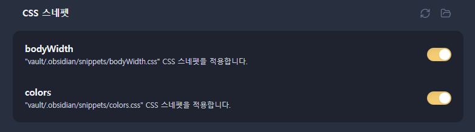
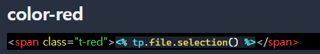
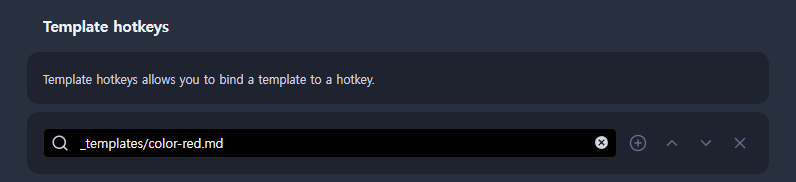

---
## 개요

나는 공부한 내용, 기술적인 경험을 옵시디언에 작성하고 이 `md` 파일을 그대로 `Docusaurus` 기반으로 커스텀한 나의 블로그에 배포한다.

여기에 문제점이 있었다.

글자를 강조하기 위해 글자색을 변경하고 싶었다. 하지만 옵시디언과 `Docusaurus`의 글자색 변경 문법이 달라서 옵시디언에서 글자색을 변경하면 블로그에 적용이 안되고, 블로그에 적용하기 위한 `Docusaurus`문법을 적용하면 옵시디언에서 글자색이 바꾸지 않았다.

- 옵시디언 o / 블로그 x : `<span class="red">빨간색 텍스트</span>`
- 옵시디언 x / 블로그 o : `<span style={{color: 'red'}}>빨간색 텍스트</span>`

---
## 해결 방법
### 커스텀 CSS 클래스

이를 해결하기 위해서 새로운 커스텀 CSS 클래스를 정의해야겠다고 생각했다. (A에도 종속되지 말고, B에도 종속되지 말고, C를 만들어서 A와 B에 적용시키자)

이를 위해서 내가 사용할 색상들을 선택했다. (사실 빨강, 파랑 밖에 안쓸 것 같다) 선택한 기준은 다크모드와 일반모드에서 둘다 가독성을 보장할 수 있는 색상을 선택했다.

- <span class="t-red">빨간색</span> <span class="t-blue">파란색</span> <span class="t-green">초록색</span> <span class="t-amber">주황색</span> <span class="t-purple">보라색</span> <span class="t-teal">청록색</span>
- <span class="hl-red">빨간색</span> <span class="hl-blue">파란색</span> <span class="hl-green">초록색</span> <span class="hl-amber">주황색</span> <span class="hl-purple">보라색</span> <span class="hl-teal">청록색</span>

이를 CSS들을 아래와 같이 클래스 이름으로 정의한다.

```css
/* --- Text colors (글자 색) --- */
.t-red    { color: #F09595 !important; }
.t-blue   { color: #85B7EB !important; }
.t-green  { color: #97C459 !important; }
.t-amber  { color: #EF9F27 !important; }
.t-purple { color: #AFA9EC !important; }
.t-teal   { color: #5DCAA5 !important; }

/* --- Highlight (형광펜) --- */
.hl-red    { background: rgba(240, 149, 149, 0.2) !important; color: #F09595 !important; padding: 1px 4px; border-radius: 3px; }
.hl-blue   { background: rgba(133, 183, 235, 0.2) !important; color: #85B7EB !important; padding: 1px 4px; border-radius: 3px; }
.hl-green  { background: rgba(151, 196, 89,  0.2) !important; color: #97C459 !important; padding: 1px 4px; border-radius: 3px; }
.hl-amber  { background: rgba(239, 159, 39,  0.2) !important; color: #EF9F27 !important; padding: 1px 4px; border-radius: 3px; }
.hl-purple { background: rgba(175, 169, 236, 0.2) !important; color: #AFA9EC !important; padding: 1px 4px; border-radius: 3px; }
.hl-teal   { background: rgba(93,  202, 165, 0.2) !important; color: #5DCAA5 !important; padding: 1px 4px; border-radius: 3px; }

/* --- 라이트 모드 오버라이드 --- */
/* Obsidian 라이트 모드 */
.theme-light .t-red    { color: #A32D2D !important; }
.theme-light .t-blue   { color: #185FA5 !important; }
.theme-light .t-green  { color: #3B6D11 !important; }
.theme-light .t-amber  { color: #854F0B !important; }
.theme-light .t-purple { color: #534AB7 !important; }
.theme-light .t-teal   { color: #0F6E56 !important; }

.theme-light .hl-red    { background: rgba(226, 75, 74,  0.12) !important; color: #A32D2D !important; }
.theme-light .hl-blue   { background: rgba(55,  138, 221, 0.12) !important; color: #185FA5 !important; }
.theme-light .hl-green  { background: rgba(99,  153, 34,  0.12) !important; color: #3B6D11 !important; }
.theme-light .hl-amber  { background: rgba(186, 117, 23,  0.12) !important; color: #854F0B !important; }
.theme-light .hl-purple { background: rgba(127, 119, 221, 0.12) !important; color: #534AB7 !important; }
.theme-light .hl-teal   { background: rgba(29,  158, 117, 0.12) !important; color: #0F6E56 !important; }

/* Docusaurus 라이트 모드 */
html[data-theme='light'] .t-red    { color: #A32D2D !important; }
html[data-theme='light'] .t-blue   { color: #185FA5 !important; }
html[data-theme='light'] .t-green  { color: #3B6D11 !important; }
html[data-theme='light'] .t-amber  { color: #854F0B !important; }
html[data-theme='light'] .t-purple { color: #534AB7 !important; }
html[data-theme='light'] .t-teal   { color: #0F6E56 !important; }

html[data-theme='light'] .hl-red    { background: rgba(226, 75, 74,  0.12) !important; color: #A32D2D !important; }
html[data-theme='light'] .hl-blue   { background: rgba(55,  138, 221, 0.12) !important; color: #185FA5 !important; }
html[data-theme='light'] .hl-green  { background: rgba(99,  153, 34,  0.12) !important; color: #3B6D11 !important; }
html[data-theme='light'] .hl-amber  { background: rgba(186, 117, 23,  0.12) !important; color: #854F0B !important; }
html[data-theme='light'] .hl-purple { background: rgba(127, 119, 221, 0.12) !important; color: #534AB7 !important; }
html[data-theme='light'] .hl-teal   { background: rgba(29,  158, 117, 0.12) !important; color: #0F6E56 !important; }
```

### Docusaurus에 적용하기

- `src/css/custom.css`에 위 내용을 추가한다.


### Obsidian에 적용하기



- `.obsidian/snippets/` 안에 위 내용이 담긴 `colors.css`를 넣는다.
- 그리고 설정 - 외형 - CSS 스니펫 에서 토글해서 적용시킨다.


---
## 사용하기

이제 공통 CSS 클래스를 정의했으니, 아래처럼 사용하면 된다.

```html
<span class="t-red">텍스트</span>
```

---
## cf) Obsidian에서 단축키로 사용하기

이후에 옵시디언에서 글을 작성할 때마다 `span` 태그를 작성하기는 너무 귀찮다. 이에 옵시디언 커뮤니티 플러그인인 `Templater`를 사용해서 이를 단축키로 등록하면 된다.



위처럼 md 파일을 만들고, 아래와 같이 `templater` 플러그인에 적용시킨다.



