---
## 개요


회사에서는 적용하지 못하지만, 홈랩 쿠버네티스 클러스터에서는 쿠버네티스 명령어를 입력하는 과정도 AI(Claude-Code, or Codex)에 맡기는데 어느정도 익숙해졌다.

하지만, 이게 잘 하고 있는건지에 대한 확신이 없었다.

마침 조훈님의 이 책이 출간되었고, 혼자 공부하다가는 진도가 더딜 것 같아 스터디에 참여하였고 공부 기록을 블로그에 작성하고자 한다.

---
## 1. AI시대, 개발자의 인프라
### 1.1. ~ 1.2. (스킵)

GitOps가 무엇인지, 쿠버네티스를 왜 사용해야하는지 등의 내용은 생략하겠습니다.

---
### 1.3. GitOps 에서 GitAIOps로
#### GitOps의 장점

- 배포 자동화 : 깃에 푸시하면 배포가 된다. 대표적으로 ArgoCD로 레포지토리 Sync
- 배포 히스토리 : 깃 히스토리가 곧 배포 히스토리, 누가 언제 무엇을 바꿨는지 추적 가능
- 롤백 : 잘못된 배포는 `git revert` 한 번이면 이전 상태로 돌아감
- 코드 리뷰 : 인프라 변경도 PR을 통해 동료에게 검토받을 수 있다.
- 재현 가능성 : 깃에 있는 그대로 새로운 환경을 만들 수 있다.

#### GitOps에서 부족한 점

> GitOps를 사용하더라도 여러 번거로운 작업들 아직 존재

- 이미지 경로, CPU/메모리 리소스 제한, 헬스체크 경로와 주기, 환경 변수, 볼륨 마운트, Service, ConfigMap, Secret, HPA ..
- Helm - 환경별(개발/스테이징/프로덕션) template, value 파일
- 모니터링 - 프로메테우스 설치, scrape 설정, 그라파나 설치, 그라파나 대시보드 구성, 알림 규칙, 로그 포워더(Fluent Bit), 로그 집계(Loki)

> 문서화도 과제

- 문서화를 해두지 않으면, 본인이 왜 그렇게 설정했는지도 잊기 십상

#### AI가 채우는 빈자리

> 매니페스트 작성

- 현재 프로젝트를 배포하는 Deployment 만들어줘 -> AI가 현재 프로젝트의 Dockerfile과 디렉토리 구조를 읽고, 적절한 리소스 설정과 헬스체크를 포함한 매니페스트 생성
- 즉, 자연어로 의도를 전달하면 완성된 매니페스트 작성됨

> 트러블슈팅

- "Pod가 CrashLoopBackOff 인데 원인을 찾아줘" -> `kubectl`로 Pod의 상태를 확인하고, 로그를 읽고, 이벤트를 분석해서 원인과 수정안을 제시함
- 기존에 사람이 여러 명령어를 순서대로 실행하면서 원인을 추적하는 과정을 AI가 빠르게 수행함

> 문서화

- AI와 함께 작업하면 그 과정 자체가 기록됨 -> "지금까지 작업한 내용을 정리해줘"라고 하면, 어떤 도구를 왜 선택했는지. 어떤 설정을 어떤 이유로 적용했는지를 정리한 문서가 생성된다.
- "나중에 정리해야지"가 필요없다.

> 검증

- "현재 클러스터 상태가 문서와 일치하는지 확인해줘" -> AI가 실제 클러스터의 Pod, Service, ConfigMap 등을 조회하고 문서에 기록된 상태와 비교한 후 차이가 있으면 알려줌.

> [!tip] "사람이 도구를 결정 -> 설치, 설정, 검증 모두 AI가 가능"

#### GitAIOps: Git + AI + Ops

| 구분    | GitOps          | GitAIOps            |
| ----- | --------------- | ------------------- |
| 상태 정의 | 사람이 YAML 작성     | AI가 자연어로부터 YAML 생성  |
| 배포    | 깃 푸시 → 자동 Sync  | 동일                  |
| 트러블슈팅 | 사람이 로그 분석       | AI가 로그 분석 후 수정안 제시  |
| 문서화   | 사람이 별도 작성 또는 안함 | AI가 작업과 동시에 문서 생성   |
| 검증    | 사람이 수동 확인       | AI가 클러스터 상태와 문서를 비교 |

---
### 1.4. (스킵)

책의 구성과 실습 레포 등을 소개하는 섹션이라 생략하겠습니다.

---
### 1.5. Notiflex 스타트업 시나리오 소개
#### Notiflex?

> Notiflex는 이 책을 실습하기 위한 가상의 스타트업, B2B 알림 SaaS 플랫폼이며 고객사의 서비스에서 발생하는 이벤트(회원가입, 결제, 배송 등)를 받아 이메일, SMS, 푸시 알림으로 발송

#### 성장 타임라인

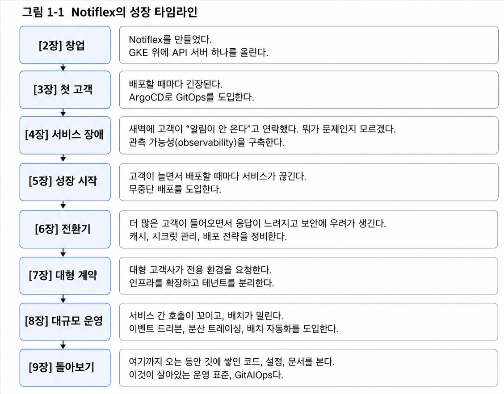

#### 실습자의 역할 페르소나

> Notiflex의 DevOps 엔지니어이며, 혼자서 이 서비스의 인프라를 책임진다. 클러스터를 만들고, 배포 파이프라인을 구축하고, 모니터링을 설정하고, 장애에 대응하고, 서비스가 커지면 인프라도 함께 키워야한다.

---
### 1.6. 가드레일: 클로드 코드가 정확하게 동작하는 이유

> [!info] LLM은 확률이다.
> LLM은 이전 문맥을 보고 다음에 나올 토큰을 확률적으로 계산하여 가장 높은 확률의 토큰을 출력하는 모델입니다.
> 
> 그렇기 때문에, 같은 입력을 한다고 해서 항상 같은 출력이 나온다는 보장이 없으며, 모델이 바뀔경우 일관성은 떨어질 가능성이 더 높습니다.
> 
> 이 부분이 제가 아직 업무에서 이러한 AI를 클러스터를 운영하는데 사용하지 못하는 이유이며, 많은 사람들이 도입하지 못하는 이유라고 생각합니다.
> 
> 이에 이러한 확률적인 부분을 최대한 일정하게 유지하려는 장치가 이 책에서 소개하는 "가드레일"이라고 이해했습니다.

#### CLAUDE.md와 가드레일

> [!info] 가장 중심인 `CLAUDE.md`가 일종의 '라우터' 역할

현재 실습 레포지토리의 구조는 다음과 같다.

```bash
_Book_GitAIOps/
├── CLAUDE.md
├── decision-guides/
│   └── ch3/
│       ├── 3.2-gitops-tool.md
│       ├── 3.3-rolling-update.md
│       └── 3.4-ci-tool.md
├── prompt-guardrails/
│   ├── shared/
│   │   ├── resource-budget.md
│   │   ├── compatible-versions.md
│   │   └── journey-template.md
│   └── ch3/
│       └── 3.2-argocd.md
├── result-templates/
│   └── ch3/
│       └── 3.2-argocd.md
└── notiflex-platform/ (형제 디렉터리)
    └── JOURNEY.md
```

이러한 레포지토리에서 클로드 코드를 실행하여 자연어로 어떠한 지시를 하였을 때의 의사결정 과정은 다음과 같다.

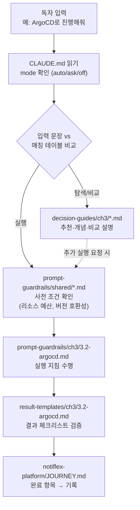

#### 왜 가드레일이 필요한가?

> AI가 강력하더라도, 인프라 작업에서는 정확성이 중요하다.
> 
> 이에, 클로드 코드가 "검증된 경로"를 따르도록 안내하는 방법인 것이다. (위에 언급했듯, "확률"을 올리는 작업)


---
## 2. 환경 구성
### 2.1 ~ 2.3 생략

기존 GCP 계정이 있고 사용 경험이 있으며, 클로드 코드 사용에 익숙하여 이 섹션은 첫 대화와 statusline을 제외하고 생략하겠습니다.

#### 첫 대화

> Prompt : 안녕! 나는 Notiflex라는 B2B 알림 SaaS 플랫폼의 DevOps 엔지니어야. 이 책을 따라가면서 쿠버네티스 운영 환경을 처음부터 구축하려고 해.

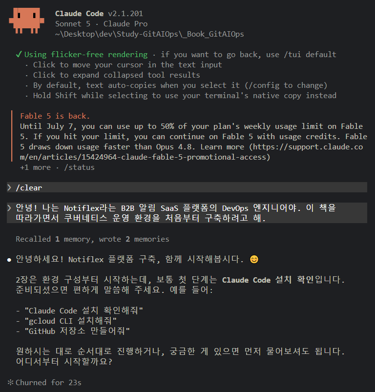

#### statusline 설정하기

> Prompt : statusline 설정해줘.
> 
> AI 사고 흐름 : `CLAUDE.md` -> `CLAUDE.md`의 참조 표 스캔 -> `prompt-guardrails/ch2/2.2-install-check.md` -> 행동 수행 -> `result-templates/ch2/2.2-install-check.md`를 보고 마지막 결과 출력

> [!tip] statusline은 클로드 코드 하단에 유용한 정보를 실시간으로 표시하는 설정입니다.
> 
> status 스크립트는 커뮤니티에서 다양하게 공유되고 있으나, 이 책에서는 저자가 만들어 둔 스크립트를 사용합니다.
> 
> 현재 저자가 만들어놓은 statusline은 모델명 축약, 컨텍스트 게이지, API 사용률, Kubernetes 컨텍스트, 경로 축약 등이 있다. 간단하게 말하면 게임에서의 캐릭터 상태창과 같은 기능이 추가된 것이다.

>[!tip] 클로드 코드 입력창에 !명령어를 입력하면 바로 쉘 명령어를 입력할 수 있다.
>이 부분 모르고 매번 새로운 쉘 띄웠는데 매우 꿀팁!

---
### 2.4. 깃허브 저장소 구성

> Prompt : 깃허브 저장소 만들어줘.
> 
> AI 사고 흐름 : `CLAUDE.md` -> `CLAUDE.md`의 참조 표 스캔 -> `prompt-guardrails/ch2/2.4-github-repo.md` -> 행동 수행 -> `result-templates/ch2/2.4-github-repo.md`를 보고 마지막 결과 출력

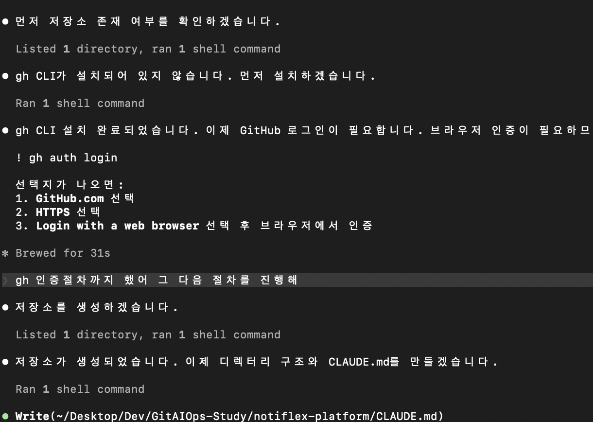

책의 지침사항을 따라 프롬프트를 입력하여 진행하였습니다.

`CLAUDE.md`라는 일종의 "라우터"를 따라 내 프롬프트들이 어디로 가야할지 길을 찾고 정해진 절차를 따른다는 점이 인상적이었습니다. 제가 인프라 엔지니어라 그런지 마치 네트워크 요청들이 각 네트워크 계층들을 이동하는 느낌이었습니다.

> 다만, 2가지 부분에서 사소한 이슈가 있었습니다.
> 
> 1. statusline을 설정할 때, 정해진 파싱 규칙이 정확하게 지켜지지 않아 아래 statusline의 출력이 이상하게 나오는 문제가 있었습니다. LLM은 같은 프롬프트로 항상 같은 출력을 기대할 수는 없기에 어느정도 예상을 하였고, 다시 고쳐달라는 프롬프트로 고칠 수 있었지만, 이러한 사소한 문제가 운영 클러스터의 경우 큰 이슈로 이어질 수 있는 만큼 조금은 불안한 느낌이 들었습니다.
> 2. gh 인증시 브라우저로 넘어갈 때, 여러 옵션 (HTTPS/SSH 선택 등)을 선택하고 Enter를 눌러야 브라우저로 넘어가고 인증절차를 실행할 수 있는데, 이를 저에게 선택지를 주지않고 무한정 대기하는 이슈가 있었습니다. 계속 반복되어 결국 다른 터미널을 키고 직접 입력하였습니다.
>    
> 모델이 개선되면서 이러한 오류가 줄어들 것이라는 생각은 듭니다. 그리고 이러한 이슈를 보완하기 위해 계속해서 사람의 언어로 문서화를 진행하고(AI가 적든 사람이 적든) 이러한 이슈를 대응하는 사람의 역할이 아직까지는 필요하다는 생각이 듭니다.

---
### 2.5. GKE 클러스터 생성

> Prompt : GKE 클러스터 생성해줘.
> 
> AI 사고 흐름 : `CLAUDE.md` -> `CLAUDE.md`의 참조 표 스캔 -> `prompt-guardrails/ch2/2.5-gke-cluster.md` -> 행동 수행 -> `result-templates/ch2/2.5-gke-cluster.md`를 보고 마지막 결과 출력

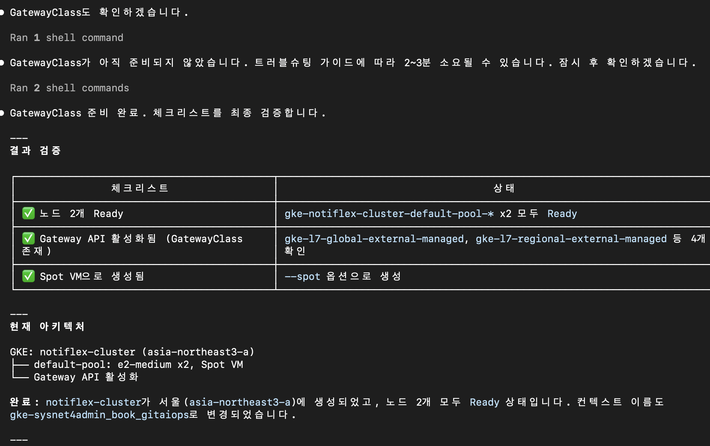

나머지 `kubeconfig`나 `GatewayClass`에 대한 내용은 이미 잘 알고있어서 넘어가겠습니다.

---
### 2.6. Notiflex 앱 빌드와 배포

> Prompt : GKE 클러스터 생성해줘.
> 
> AI 사고 흐름 : `CLAUDE.md` -> `CLAUDE.md`의 참조 표 스캔 -> `prompt-guardrails/ch2/2.6-build-deploy.md` -> 행동 수행 -> `result-templates/ch2/2.6-build-deploy.md`를 보고 마지막 결과 출력

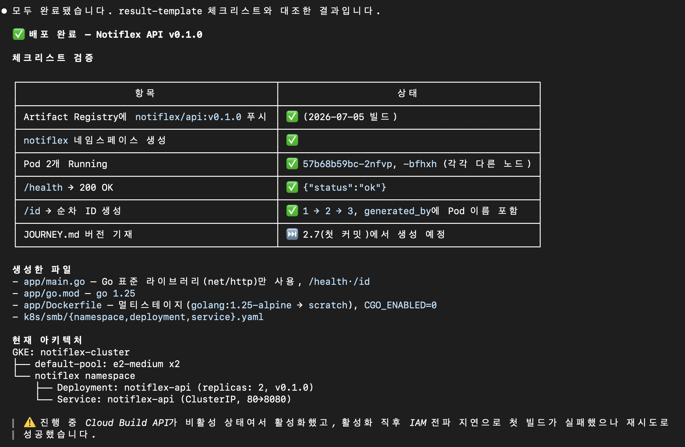

---
### 2.7. 깃허브에 첫 커밋

> Prompt : 커밋하고 푸시해줘
> 
> AI 사고 흐름 : `CLAUDE.md` -> `CLAUDE.md`의 참조 표 스캔 -> `prompt-guardrails/ch2/2.7-first-commit.md` -> 행동 수행 -> `result-templates/ch2/2.7-first-commit.md`를 보고 마지막 결과 출력

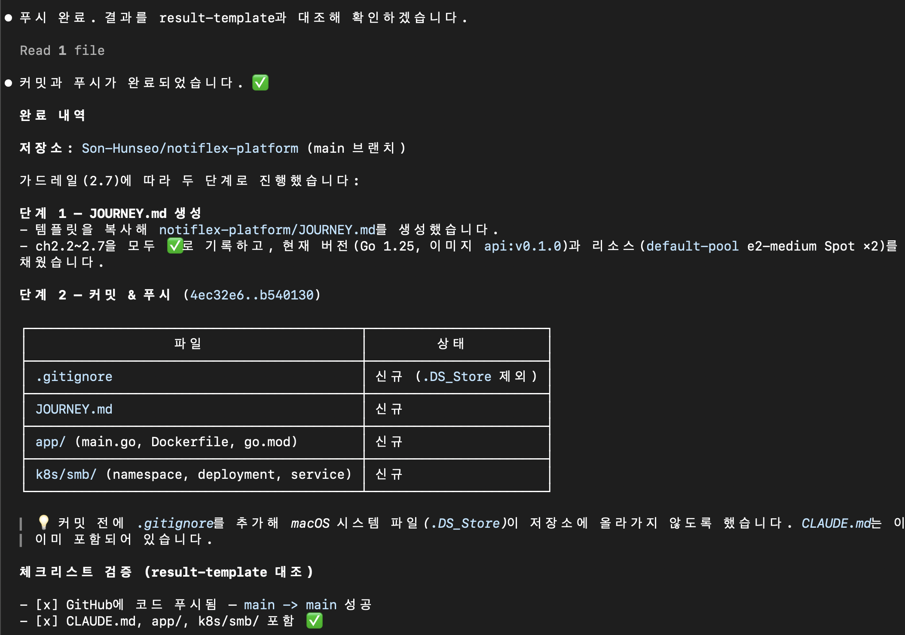

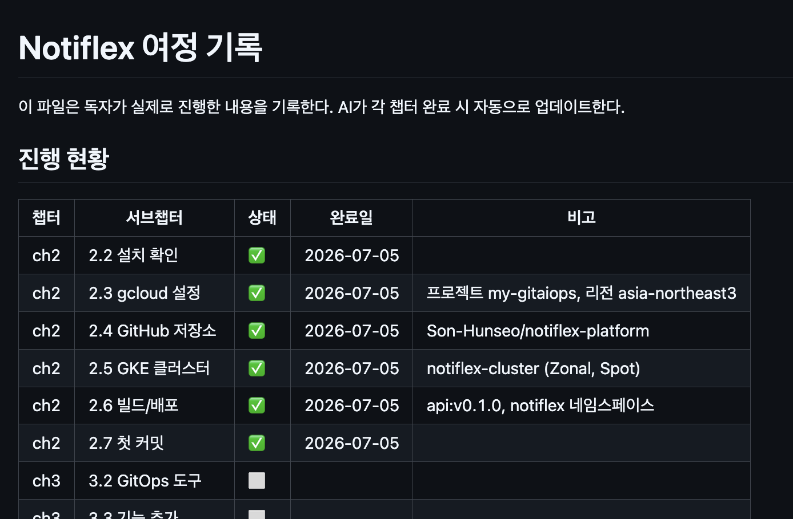

---
### 2.8. /update-docs 스킬 만들기

> Prompt : /update-docs라는 커스텀 스킬을 만들어줘. 각 장 마지막에 저장소 문서의 신규 추가와 기존 내용 변경을 모두 감지해 그 시점까지의 작업 기준으로 갱신하고 변경 사항을 커닛하는 거야. 이후 장에서 새 문서가 추가되어도 같은 스킬이 그대로 동작하도록 설계해줘
> 
> AI 사고 흐름 : `CLAUDE.md` -> `CLAUDE.md`의 참조 표 스캔 -> `prompt-guardrails/ch2/update-docs-skill.md` -> 행동 수행 -> `result-templates/ch2/update-docs-skill.md`를 보고 마지막 결과 출력

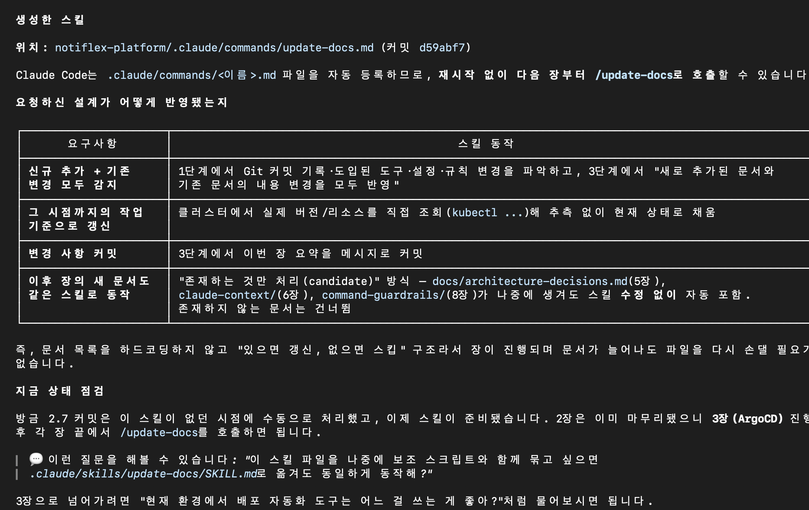

---
## 리소스 정리 및 다시 실행

> 현재 나는 GCP 무료 크레딧을 예전에 모두 사용한 상황이었다. 이에 실습을 진행하고 다음 실습 진행 때까지 리소스를 계속 켜둘 수 없는 상황이었다.
> 
> 이에 실습이 끝나면 GCP 리소스를 모두 정리하고, 다음 실습 진행 시 `JOURNEY.md`를 참조하여, 리전 시점까지 모든 리소스를 원복해줄 수 있는지 실험해보았다.

### 리소스 삭제

> Prompt : 현재 내 GCP 계정의 my-gitaiops 프로젝트에서 내가 현재 프로젝트 실습을 하며 생성했던 리소스들을 모두 정리해줘. 존재 가능한 리소스 목록은 gcp cli 명령어, `../notiflex-platform/JOURNEY.md`, `./prompt-guardrails/shared/resource-budget.md`를 참고하면 돼. 그리고 마지막으로 이걸 `../notiflex-platform/JOURNEY.md`에 기록해줘.

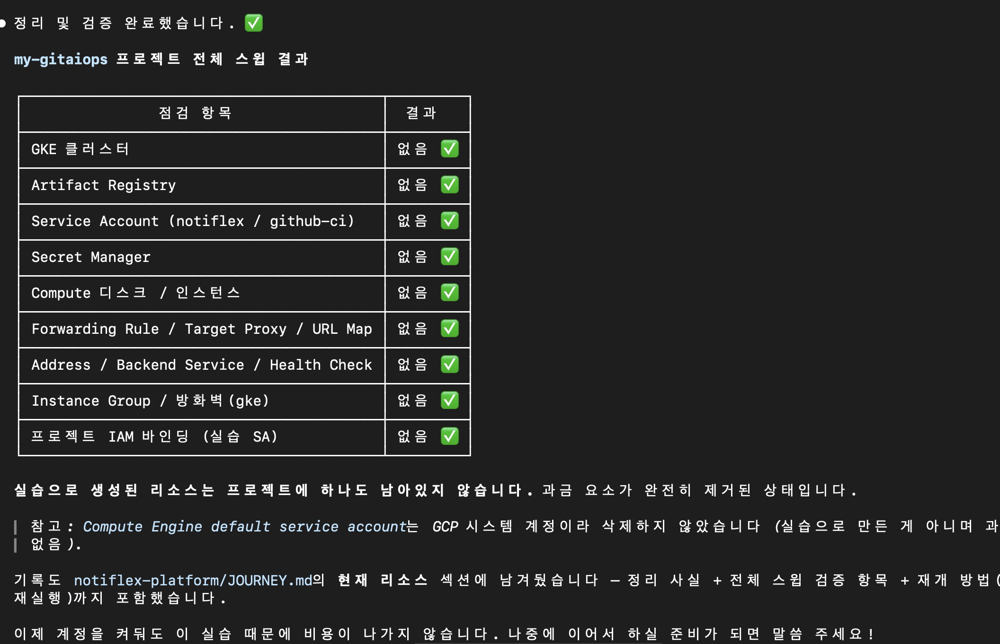

위 명령어를 입력하면 `JOURNEY.md`에 아래와 같은 항목이 추가됩니다.

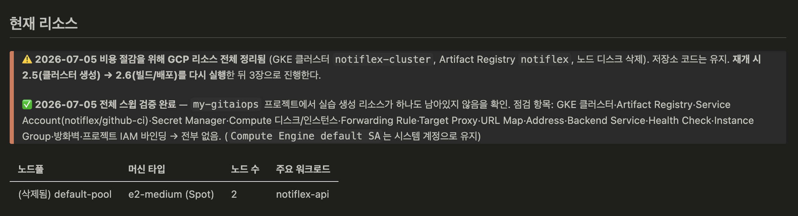

---
### 리소스 재생성

> Prompt : 현재 나의 gcp에는 현재 프로젝트 관련 리소스가 없는 상태야. `../notiflex-platform/JOURNEY.md`를 보고 프로젝트를 재개할 수 있게 리소스를 다시 만들어주고. 이 기록을 다시 `../notiflex-platform/JOURNEY.md`에 남겨줘

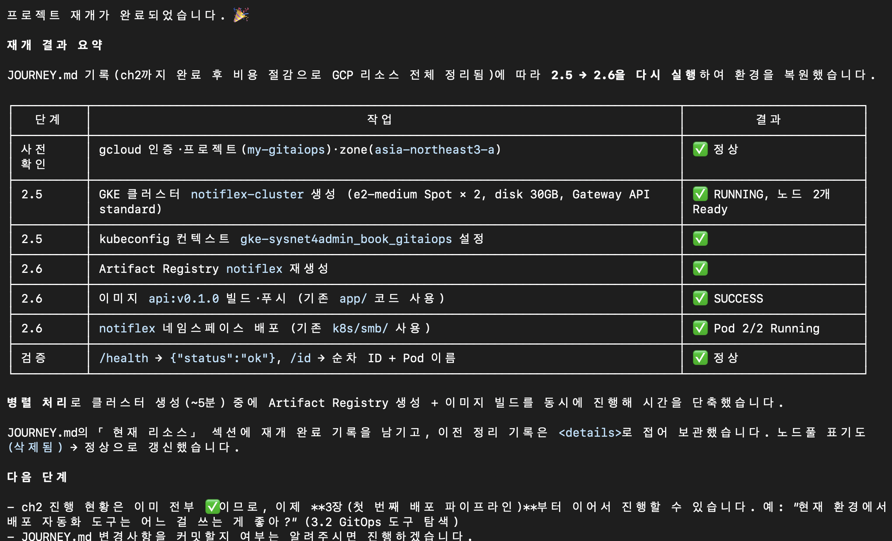

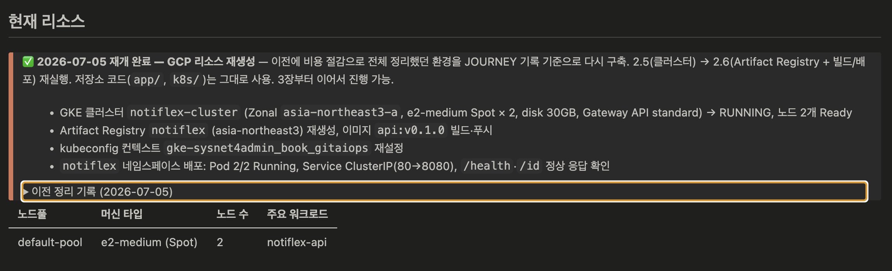

---
