---
## 3. 첫 번째 배포 파이프라인
### 3.1. 푸시 기반 배포의 한계 (스킵)

GitOps에 관한 개념과 장단점의 경우 잘 숙지하고 있으므로 넘어가겠습니다.

추후에도 잘 알고있는 개념의 경우 정리할 필요를 느끼지 못해 넘어가겠습니다.

---
### 3.2. ArgoCD 설치 및 GitOps 연결

#### 배포 자동화 도구 추천

> Prompt : 현재 환경에서 배포 자동화 도구는 어느 걸 쓰는게 좋아?
> 
> AI 사고 흐름 : `CLAUDE.md` -> `CLAUDE.md`의 참조 표 스캔 -> `decision-guides/ch3/3.2-gitops-tool.md` -> 해당 문서에 제시된 지식 참고 후 답변

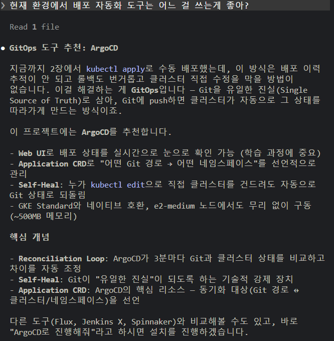

#### ArgoCD 설치 및 애플리케이션 배포

> Prompt : ArgoCD로 진행해줘
> 
> AI 사고 흐름 : `CLAUDE.md` -> `CLAUDE.md`의 참조 표 스캔 -> `prompt-guardrails/ch3/3.2-argocd.md` -> 해당 문서에 ArgoCD 설치 Notiflex Application 생성 과정을 참고해서 진행한다 -> `result-templates/ch3/3.2-argocd.md` -> 실제 결과와 결과 템플릿 비교하여 결과 출력


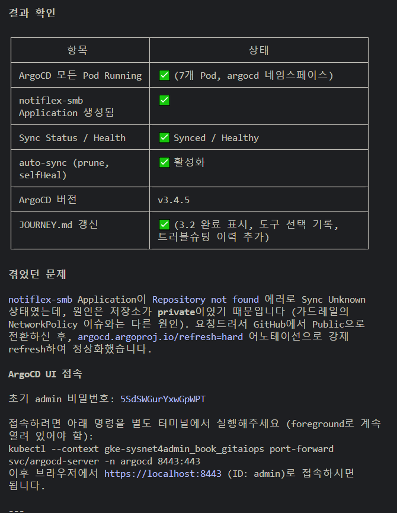

>[!tip] 몰랐는데 알게된 사항 : `--server-side=true` 옵션이란?
>일반 `kubectl apply`(client-side)는 클라이언트가 last-applied-configuration 애노테이션으로 변경 사항을 추적한다. 이 방식은 ArgoCD, Helm 과 같은 다른 도구들이 같은 리소스를 수정하면 충돌이 발생할 수 있다.
>
>`--server-side=true` 옵션은 `kube-apiserver`가 필드 소유권을 직접 관리해서 어떤 도구가 어떤 필드를 마지막으로 수정했는지 서버가 기록하므로 충돌이 덜 발생한다. `--force-conflicts=true`는 기존 소유자를 덮어쓰는 옵션으로, 재설치시 충돌을 방지한다.
>
>변경 사항 추적의 주체 : "클라이언트의 `kubectl`" -> "클러스터의 `kube-apiserver`


> [!info] `kubectl port-forward`의 작동 흐름
> 
> 평소에 자세히 생각 안하고 사용했는데, 이번 기회에 정리해보자.
> 
> `kubectl --context gke-sysnet4admin_book_gitaiops port-forward svc/argocd-server -n argocd 8443:443` 명령어는 로컬 PC의 `8443` 포트를 Argo CD 서버의 `443` 포트와 임시로 연결하는 기능이다.
> 
> `kubectl`은 kubeconfig에서 `gke-sysnet4admin_book_gitaiops` 컨텍스트를 읽어 접속할 Kubernetes 클러스터와 인증 정보를 확인한다. 이후 `argocd` 네임스페이스의 `argocd-server` Service를 조회하고, 해당 Service가 선택한 Pod 중 하나를 포트포워딩 대상으로 결정한다.
> 
> 명령이 실행되면 클라이언트 PC에서 `kubectl` 프로세스가 `localhost:8443` 포트를 직접 열고 대기한다. 사용자가 `https://localhost:8443`으로 접속하면 요청은 로컬의 `kubectl` 프로세스로 전달되고, `kubectl`은 이를 `kube-apiserver`와 대상 노드의 `kubelet`을 거쳐 Argo CD Pod의 `443` 포트까지 전달한다.
> 
> ```text
> 로컬 브라우저
> https://localhost:8443
>        ↓
> 클라이언트 PC의 kubectl 프로세스
>        ↓
> kube-apiserver
>        ↓
> 대상 노드의 kubelet
>        ↓
> argocd-server Service가 선택한 Pod의 443 포트
> ```
> 
> 여기서 `8443:443`은 다음을 의미한다.
> 
> - `8443`: 클라이언트 PC에서 열리는 로컬 포트
>     
> - `443`: Kubernetes 내부 Argo CD Pod가 사용하는 대상 포트
>     
> 
> 일반적인 공유기나 NAT의 포트포워딩처럼 네트워크 장비에 규칙을 추가하는 방식은 아니다. 로컬에서 실행 중인 `kubectl` 프로세스가 프록시처럼 트래픽을 중계하는 임시 터널 방식이다.
> 
> 따라서 `kubectl port-forward` 명령을 종료하거나 `Ctrl+C`를 누르면 로컬의 `8443` 포트도 닫히고 연결도 즉시 종료된다.
> 
> 또한 기본적으로 `localhost`에만 바인딩되므로 명령을 실행한 클라이언트 PC에서만 접근할 수 있다.
> 
> 포트포워딩 주체 : "클러스터의 Service"가 직접 로컬 포트를 여는 것 → "클라이언트의 `kubectl` 프로세스가 로컬 포트를 열고 API Server를 통해 Pod까지 트래픽을 중계"
> 
> 이러한 연결을 영구적으로 유지하는 것은 안전하지 않으므로 해당 과정은 클러스터와 클라이언트의 `kubectl`의 연결이 끊어지면(클라이언트의 `kubectl` 프로세스가 종료되면) 포트포워딩은 다시 사라진다.

#### 왜 아직 지시하지 않은 사항까지 미리 진행할까?

> 다음 Prompt인 "이제 ArgoCD랑 내 깃허브 저장소 연결해줘"는 위의 직전 프롬프트를 입력했을 때 미리 진행되었다.
> 
> 왜 이런상황이 발생할까를 생각해보았다.
> 
> 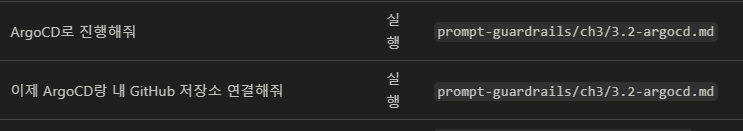
> 
> `CLAUDE.md`에 적혀있는 참조 표를 보면, 이전 명령어와 입력해야하는 명령어가 같은 프롬프트 가드레일의 `3.2-argocd.md`를 참조하고있다.
> 
> 2챕터에서도 책에서 가이드하고 있는 다음 단계까지 AI가 미리 진행한 적이 있는데, 그때도 이러한 같은 md 파일을 참조하고 있는 상황이었다.
> 
> 이에 예상하기에 어떠한 프롬프트를 입력받고 참조 표를 보고 해당 문서를 참조하는 과정에서. AI가 "어? 해당 문서에 맥락상 자연스럽게 이어지는 다음 진행 상황이 있네?" 라고 판단하고 원래라면, 사람에게 한번 더 물어보겠지만 `--dangerously-skip-permissions` 옵션까지 켜져있으니 그냥 한번에 쭉 진행한 것으로 예상된다.

---
### 3.3. ArgoCD로 롤링 업데이트: 깃 푸시만으로 배포
#### 새 기능 추가 및 배포

> Prompt : API에 버전 정보 확인할 수 있는 기능 추가하고 배포해줘.
> 
> AI 사고 흐름 : `CLAUDE.md` -> `CLAUDE.md`의 참조 표 스캔 -> `prompt-guardrails/ch3/3.3-rolling-update.md` -> 해당 문서에 제시된 작업 사항 진행 -> `result-templates/ch3/3.3-rolling-update.md` -> 결과 템플릿과 맞게 결과 출력

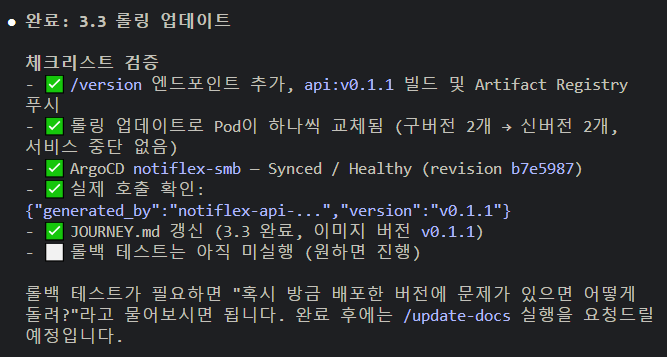

>[!tip] Rolling Update의 한계
>
>두 버전이 동시에 트래픽을 받는 순간이 반드시 존재한다.
>
>A버전에서 B버전으로 Rolling Update를 한다고 해보자. A버전에는 `/api/old` 경로의 API가 존재하였다. B버전에서는 해당 API를 `/api/new`로 바꿨다. 이러한 상황에서 두 버전이 동시에 트래픽을 받는 순간이 존재하여 문제가 생기는 것이다.
>
>물론, B버전까지는 `/api/old`와 `/api/new` API를 둘 다 놔두고 이후 클라이언트에서 `/api/old`를 호출하는 부분을 걷어내고 C버전으로 가면서 `/api/old`를 없애는 방법 등 여러가지 방법이 있겠지만, 일단 이러한 현상이 Rolling Update의 한계점인 것은 분명하다.

#### 롤백 테스트

> Prompt : 혹시 방금 배포한 버전에 문제가 있으면 어떻게 돌려?
> 
> AI 사고 흐름 : `CLAUDE.md` -> `CLAUDE.md`의 참조 표 스캔 -> `prompt-guardrails/ch3/3.3-rolling-update.md` -> 해당 문서에 제시된 작업 사항 진행 -> `result-templates/ch3/3.3-rolling-update.md` -> 결과 템플릿과 맞게 결과 출력

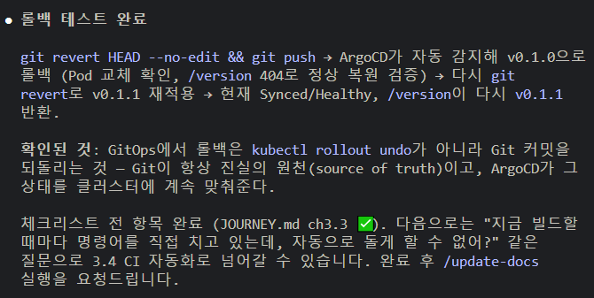

> [!tip] 엥? `git revert` 대신 그냥 해당 커밋 없애고 다시 푸시하면 안되나?
> "되돌렸다는 기록"을 남겨야한다. 
> 
> 이게 중요하지 않아보여도, "변경을 하지 않은 것"과 "변경을 했다가 원래대로 돌린 것"은 굉장히 큰 차이를 만든다.
> 
> 특히 GitOps에서는 Git의 커밋 이력이 곧 실제 인프라 상태를 변경한 감사 기록이므로, 히스토리를 지우기보다 `revert`로 되돌림 자체를 명확히 남겨야 한다.

---
### 3.4. 깃허브 액션 CI: 빌드 자동화
#### 왜 Github Action?

요약하자면, Jenkins, GitLab CI, Code Build 모두 별도의 설정 혹은 설치가 필요하다.

Github Action은 그러한 설정 필요없이 yaml 스크립트 하나면 추가하면된다.

추가적으로 Jenkins와 GitLab 같은 경우에는 추가적으로 내부 인프라에서 관리해야하는 관리의 지점이 늘어나는 것이기도 하다.

여담으로, 실제로 내가 본 조직들은 Jenkins나 GitLab이 대부분이긴 했다. (많은 이유들이 있지만 이미 예전부터 그렇게 써왔으니라는 이유가 제일 큰 듯)

나는 사실 이러한 관리의 지점이 늘어나는 것을 싫어한다. 그런데, CI/CD 실행 환경을 외부에 두는 것도 썩 좋아하진 않는다.

그래서 내 홈랩은 Github Self-Hosted Runner를 사용하고 있다. (근데, 이것도 은근 귀찮긴하다)

---
#### 깃허브 액션 CI 만들기

> Prompt : 깃허브 액션 CI 만들어줘.
> 
> AI 사고 흐름 : `CLAUDE.md` -> `CLAUDE.md`의 참조 표 스캔 -> `prompt-guardrails/ch3/3.4-github-actions.md` -> 해당 문서에 제시된 작업 사항 진행 -> `result-templates/ch3/3.4-github-actions.md` -> 결과 템플릿과 맞게 결과 출력

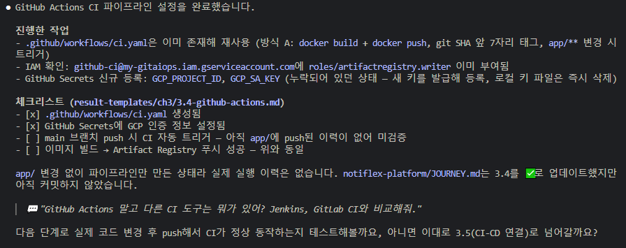

>[!info] 왜 이미지 태그에 버전 숫자 대신 깃 SHA(해시)를 쓰는걸까?
>깃 SHA는 커밋마다 자동으로 새애기는 고유 ID이다.
>
>해당 값은 다음과 같은 값들을 반영한 단방향 해시다.
> - 해당 시점의 전체 파일 상태를 가리키는 `tree` SHA
> - 이전 커밋을 가리키는 `parent` SHA
> - 작성자와 커미터 정보    
> - 작성 및 커밋 시간 
> - 커밋 메시지
>   
> 이에, 정확히 어떤 코드로 빌드되었는지 확정지을 수 있고, 이에 추적할 수 있다.

---
### 3.5. CI + ArgoCD 연결: 빌드부터 배포까지
#### 마지막 빠진 조각 ~ 연결하기

> 요약 : CI에 CD 연결하는 법 -> CI에서 매니페스트 이미지 태그 변경 후 푸시하는 과정까지 넣으면 됨 (유의. 무한 루프 방지를 위해 path 필터와 봇 재귀 방지 필수)

> Prompt : CI에서 빌드하면 자동으로 배포까지 되게할 수 있어?
> 
> AI 사고 흐름 : `CLAUDE.md` -> `CLAUDE.md`의 참조 표 스캔 -> `decision-guides/ch3/3.5-ci-cd-integration.md` -> 해당 문서에 제시된 지식 참고 후 답변

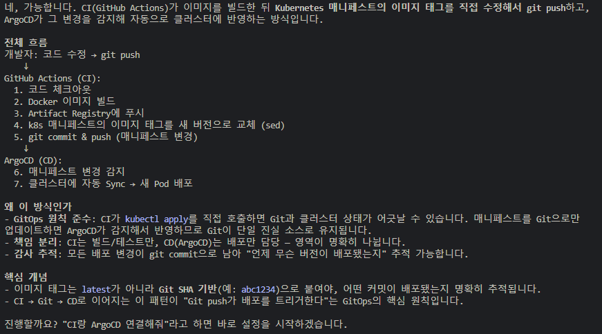

> Prompt : 깃허브 액션 CI 만들어줘.
> 
> AI 사고 흐름 : `CLAUDE.md` -> `CLAUDE.md`의 참조 표 스캔 -> `prompt-guardrails/ch3/3.5-ci-argocd.md` -> 해당 문서에 제시된 작업 사항 진행 -> `result-templates/ch3/3.5-ci-argocd.md` -> 결과 템플릿과 맞게 결과 출력

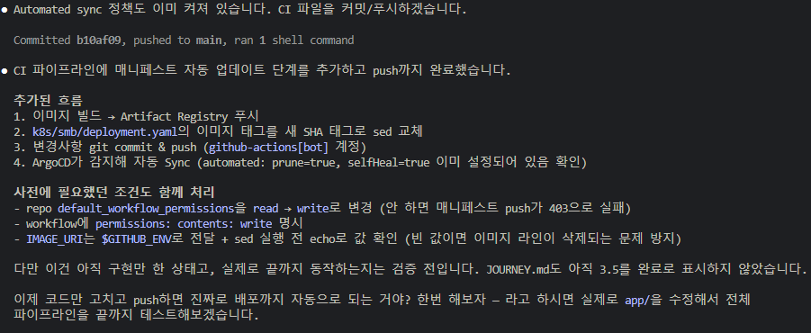

#### 전체 파이프라인 테스트

> Prompt : 이제 코드만 고치고 푸시함녀 진짜로 배포까지 자동으로 되는 거야? 한번 해보자.
> 
> AI 사고 흐름 : `CLAUDE.md` -> `CLAUDE.md`의 참조 표 스캔 -> `prompt-guardrails/ch3/3.5-ci-argocd.md` -> 해당 문서에 제시된 작업 사항 진행 -> `result-templates/ch3/3.5-ci-argocd.md` -> 결과 템플릿과 맞게 결과 출력

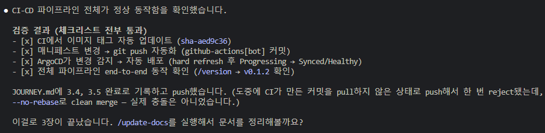

>[!tip] 새롭게 알게된 사실 : image tag 변경은 브랜치 새로파서!
>- 그동안 아무생각 없이, 같은 브랜치에서(물론 내 개인 프로젝트나 클러스터 구성이었기에) 이미지 태그를 수정하고 푸시하는 ci 스크립트를 적용하였다.
>- 이 책 실습과정에서 image tag 수정용 브랜치를 새로 파서 merge하는 방식을 적용하는 것을 보았다.
>- 이 방식이 무조건 나은 방식이다. 이 방식으로 바꿔보자.

---
### 3.6. CLAUDE.md에 행동 규칙 추가하기

> Prompt : 
> CLAUDE.md에 다음 규칙을 추가해줘. 나중에 되돌릴 거야.
> - 이 클러스터에서 kubectl delete를 직접 실행하지 마.
> - kubectl apply도 직접 하지 말고, 항상 깃을 이용해 ArgoCD로 배포해
> - 변경 전에 항상 diff를 먼저 보여줘
> 
> AI 사고 흐름 : `CLAUDE.md` -> `CLAUDE.md`의 참조 표 스캔 -> `prompt-guardrails/ch3/claudemd-example.md` -> 해당 문서에 제시된 작업 사항 진행 -> `result-templates/ch3/claudemd-example.md` -> 결과 템플릿과 맞게 결과 출력

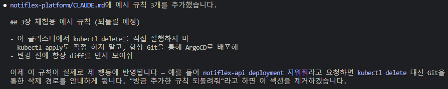

> Prompt : notiflex 네임스페이스의 notiflex-api deloyment를 지워줘.
> 
> AI 사고 흐름 : `CLAUDE.md` -> `CLAUDE.md`의 참조 표 스캔 -> `prompt-guardrails/ch3/claudemd-example.md` -> 해당 문서에 제시된 작업 사항 진행 -> `result-templates/ch3/claudemd-example.md` -> 결과 템플릿과 맞게 결과 출력

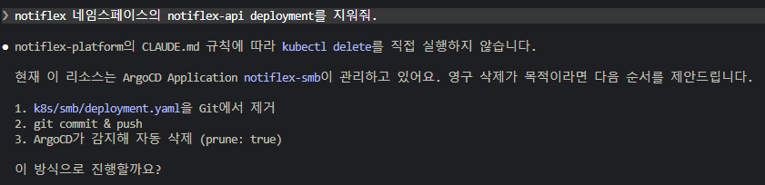

> Prompt : notiflex-api 상태 확인해줘
> 
> AI 사고 흐름 : `CLAUDE.md` -> `CLAUDE.md`의 참조 표 스캔 -> `prompt-guardrails/ch3/claudemd-example.md` -> 해당 문서에 제시된 작업 사항 진행 -> `result-templates/ch3/claudemd-example.md` -> 결과 템플릿과 맞게 결과 출력

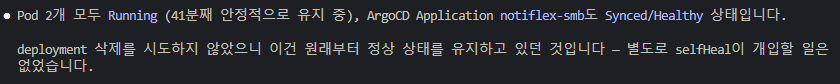

> Prompt : 방금 추가한 규칙 되돌려줘
> 
> AI 사고 흐름 : `CLAUDE.md` -> `CLAUDE.md`의 참조 표 스캔 -> `prompt-guardrails/ch3/claudemd-example.md` -> 해당 문서에 제시된 작업 사항 진행 -> `result-templates/ch3/claudemd-example.md` -> 결과 템플릿과 맞게 결과 출력

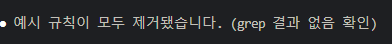

---
## 4. 관측 가능성 한 번에 구축하기
### 4.1. 관측 가능성이란

관측 가능성(observability)의 3요소

1. 메트릭(metric) - CPU 점유율, 메모리 사용량 등
2. 로그(logs) - 애플리케이션 로그, 리눅스 시스템 로그 등
3. 트레이스(traces) - 하나의 요청이 어떤 서비스를 거쳐 어디서 느려졌는지 추적하는 데이터

cf) 프로파일(profiles) - 관측 가능성의 4번째 요소로 프로파일을 꼽기도 한다. CPU나 메모리를 어떤 함수가 얼마나 쓰고 있는지를 코드 수준에서 보여준다.

---
### 4.2. 메트릭 모니터링: 프로메테우스 + 그라파나
#### 클로드 코드에게 메트릭 수집과 시각화 도구 물어보기

> Prompt : 클러스터에서 뭐가 돌아가고 있는지 어떻게 알 수 있어?
> 
> AI 사고 흐름 : `CLAUDE.md` -> `CLAUDE.md`의 참조 표 스캔 -> `decision-guides/ch4/4.2-metrics-monitoring.md` -> 해당 문서에 제시된 지식 참고 후 답변

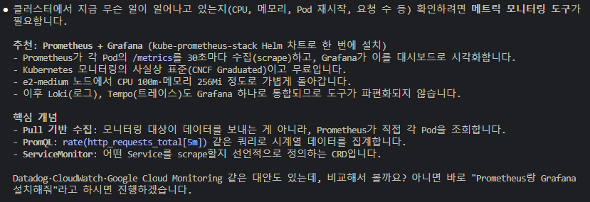

> [!info] Pull 기반 수집의 장점
> Pull 기반 수집은 수집하는 모니터링 솔루션에서 각 Pod에게 상태를 질의한다. 장점은 다음과 같다.
> 
> - 모니터링 대상이 능동적으로 데이터를 보낼 필요가 없다.
> - 새 Pod가 뜨면 Prometheus가 자동으로 발견해서 수집을 시작한다.
> - 모니터링 서버 장애 시에도 앱에 영향 없음

> 현재 Prometheus + Grafana 를 선택한 이유
> - 학습 환경에서 SaaS 비용을 쓸 이유가 없다.
> - Prometheus는 자원을 크게 사용하지 않는다. (CPU 100m, Memory 256Mi 면 충분), Grafana도 마찬가지
> - 가장 중요한 이유 -> 통합성 : Loki(로그 수집), Tempo(분산 트레이싱)을 추가할 때 Grafana 대시보드에서 한번에 볼 수 있다. (다른 SaaS 도구들은 통합을 위해 추가 비용이 발생한다)

> [!warning] Prometheus 기본 설정은 데이터를 24시간 동안만 보관한다.
> - 만약 장기 저장이 필요한 프로덕션 환경이라면, Thanos나 Cortex를 Prometheus 앞에 두면 된다. 오브젝트 스토리지(S3 등)에 백업하는 구조이다.
> - 지금은 학습용이기 때문에 24시간의 설정을 크게 바꿀 필요는 없다.

#### 프로메테우스 + 그라파나 설치하기

> Prompt : 프로메테우스랑 그라파나 설치해줘
> 
> AI 사고 흐름 : `CLAUDE.md` -> `CLAUDE.md`의 참조 표 스캔 -> `prompt-guardrails/ch4/4.2-prometheus-grafana.md` -> 해당 문서에 제시된 작업 사항 진행 -> `result-templates/ch4/4.2-prometheus-grafana.md` -> 결과 템플릿과 맞게 결과 출력

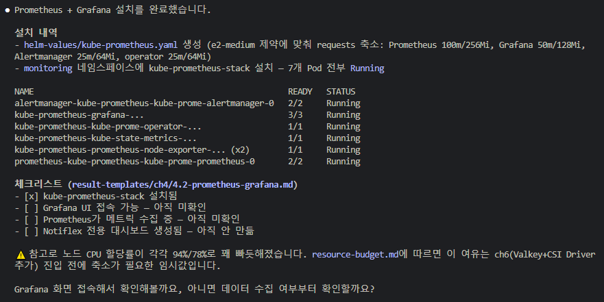

#### 그라파나에 접속하기

> Prompt : 설치 끝났으면 그라파나 화면을 한번 보고 싶은데, 어떻게 접속해?
> 
> AI 사고 흐름 : `CLAUDE.md` -> `CLAUDE.md`의 참조 표 스캔 -> `prompt-guardrails/ch4/4.2-prometheus-grafana.md` -> 해당 문서에 제시된 작업 사항 진행 -> `result-templates/ch4/4.2-prometheus-grafana.md` -> 결과 템플릿과 맞게 결과 출력

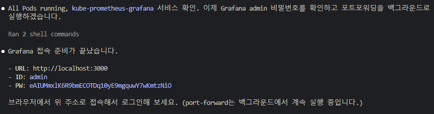

#### 프로메테우스 메트릭 확인하기

> Prompt : Prometheus가 데이터 수집하고 있는지 확인해줘
> 
> AI 사고 흐름 : `CLAUDE.md` -> `CLAUDE.md`의 참조 표 스캔 -> `prompt-guardrails/ch4/4.2-prometheus-grafana.md` -> 해당 문서에 제시된 작업 사항 진행 -> `result-templates/ch4/4.2-prometheus-grafana.md` -> 결과 템플릿과 맞게 결과 출력

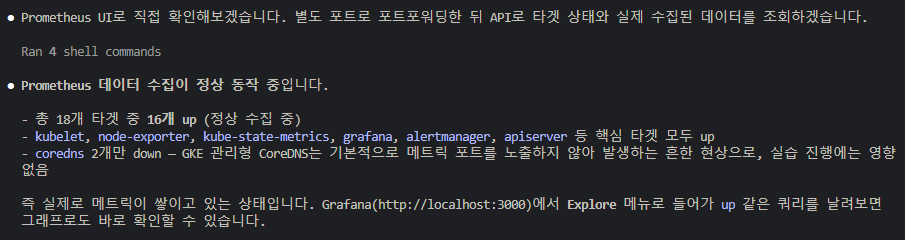

---
### 4.3. 로그 수집: Loki + Fluent Bit
#### 클로드 코드에게 로그 수집 도구 물어보기

> Prompt : 로그 수집 뭐 써? Pod 로그를 한곳에서 보고 싶어.
> 
> AI 사고 흐름 : `CLAUDE.md` -> `CLAUDE.md`의 참조 표 스캔 -> `decision-guides/ch4/4.3-logging.md` -> 해당 문서에 제시된 지식 참고 후 답변

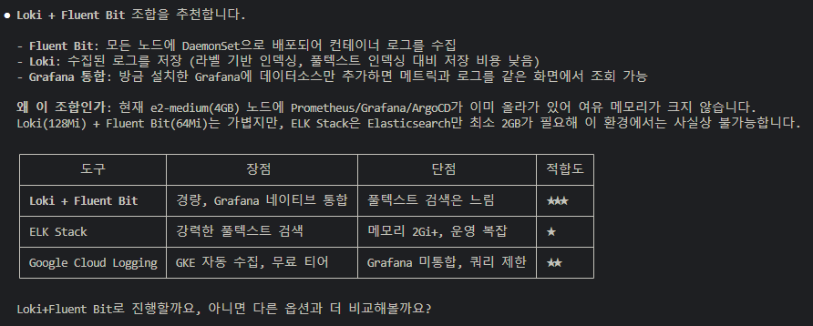

>[!info] 라벨 기반 인덱싱이란?
>- 익숙한 방법의 인덱싱은 풀텍스트 인덱싱이다.
>- 풀텍스트 인덱싱은 로그 본문의 모든 단어를 인덱싱하는 방법이다. (Elasticsearch가 이 방식)
>- 이 방식은 특정 '단어'가 로그 중 어디에 있는지 찾는데 유용한 방법이다.
>- 대신 인덱스가 매우 거대해져 메모리를 매우 많이 사용한다. (Elasticsearch 최소 요구사항 메모리 2GB)
>- 라벨 기반 인덱싱은 `{namespace, pod, container}` 같은 메타데이터만 인덱싱한다. (로그 본문 인덱싱 x)
>- 이에 로그를 찾을 때 먼저 라벨로 범위를 좁히고 본문을 grep한다.
>- 풀텍스트보다 검색이 느릴 수 있지만 메모리가 128MB면 충분하다.
>- 현재의 학습용 저사양 노드에서 Elasticsearch는 불가능하지만 Loki는 충분하다.

#### Loki + Fluent Bit 설치하기

> Prompt : Loki랑 Fluent Bit 설치해줘
> 
> AI 사고 흐름 : `CLAUDE.md` -> `CLAUDE.md`의 참조 표 스캔 -> `prompt-guardrails/ch4/4.3-loki-fluentbit.md` -> 해당 문서에 제시된 작업 사항 진행 -> `result-templates/ch4/4.3-loki-fluentbit.md` -> 결과 템플릿과 맞게 결과 출력

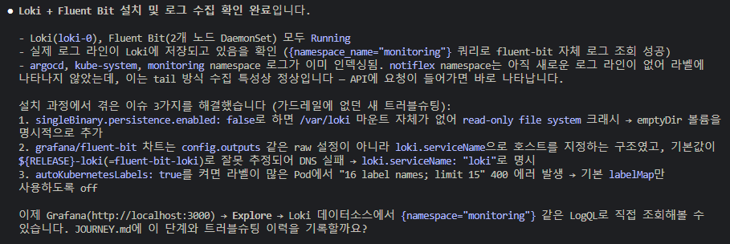

>[!info] SingleBinary 모드란?
>- Loki는 여러 컴포넌트(read, write, backend)로 나눠서 배포할 수 있다.
>- SingleBinary는 이 모든 걸 하나의 Pod에서 실행하는 모드이다. 리소스를 절약할 수 있다.
>- 현재는 학습 환경이기 때문에 이 모드가 적합하다.
>- 추후 트래픽이 늘면 마이크로서비스 모드로 전환하면 된다.

> [!info] `useTestSchema: true` 란?
>- 최신 Loki Helm chart에서는 schema_config를 직접 설정해야 한다.
>- 설정하지 않으면 에러 발생
>- `useTestSchema: true`를 넣으면 기본 schema를 자동으로 생성해준다.
>- 현재 학습 환경에서는 충분

#### 그라파나에서 로그 확인하기

> Prompt : 설치는 됐는데, 로그가 진짜 들어오고 있는지 Grafana에서 볼 수 있어?
> 
> AI 사고 흐름 : `CLAUDE.md` -> `CLAUDE.md`의 참조 표 스캔 -> `prompt-guardrails/ch4/4.3-loki-fluentbit.md` -> 해당 문서에 제시된 작업 사항 진행 -> `result-templates/ch4/4.3-loki-fluentbit.md` -> 결과 템플릿과 맞게 결과 출력

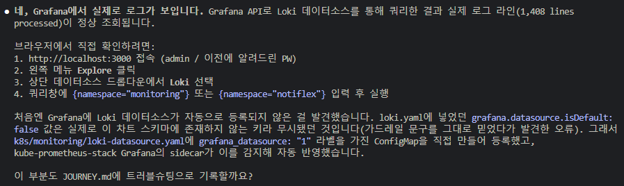

---
### 4.4. 알림 설정: PrometheusRule
#### 클로드 코드에게 알림 도구 물어보기

> Prompt : 문제가 생기면 자동으로 알림 받을 수 있어?
> 
> AI 사고 흐름 : `CLAUDE.md` -> `CLAUDE.md`의 참조 표 스캔 -> `decision-guides/ch4/4.4-alerting.md` -> 해당 문서에 제시된 지식 참고 후 답변

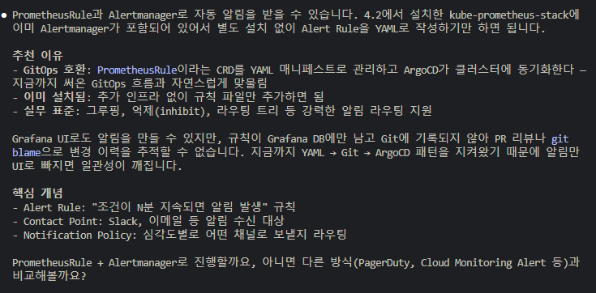

> [!info] 그라파나에서 알림 설정하면 안되나?
> - 그라파나에서 알림 설정은 yaml로 관리하는 GitOps 로 적용할 수 없습니다. UI에서 클릭, 클릭으로 설정해야한다.
> - 알림이 늘어날수록 차이가 벌어진다.
> - PrometheusRule을 사용하여 yaml로 알림을 관리하면, 이 알림이 왜 추가됐으며, 임계값이 왜 그렇게 설정되었는지를 git에 기록하기 때문에 추후 추적하기 쉽다.
> - 이러한 기록이 남는 것이 선언적 인프라 관리에서 핵심적인 부분이므로 PrometheusRule로 관리한다.

#### 알림 규칙 만들기

> Prompt : 알림 설정해줘
> 
> AI 사고 흐름 : `CLAUDE.md` -> `CLAUDE.md`의 참조 표 스캔 -> `prompt-guardrails/ch4/4.4-alerting.md` -> 해당 문서에 제시된 작업 사항 진행 -> `result-templates/ch4/4.4-alerting.md` -> 결과 템플릿과 맞게 결과 출력

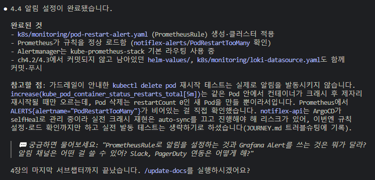

위 프롬프트만 입력했는데, 책에서 나오는 다음 과정 프롬프트인 '알림 규칙이 제대로 동작하는지 어떻게 확인해?' 프롬프트를 입력하지도 않았는데 그 과정까지 진행되었다.

앞서 언급한 문제와 같은 원인이다.

이렇게 정교하게 설계된 md 문서들 사이에서도 이러한 의도치않은 over proceed 진행이 잦게 일어나는 것을 보니 운영 환경에서의 클러스터에 바로 클로드 코드로 어떤 것을 진행하는 것은 조금 무섭다는 생각이 든다. (물론 나도 yaml 작성은 이제 99.9% AI를 사용한다)

---
### 4.5. 메모리에 작업 컨텍스트 기록

>[!info] 클로드 코드의 메모리
>- 클로드 코드와의 대화 기록들은 다음 세션, 혹은 세션이 길어질 경우 압축이되어 유실될 수 있다. 
>- 나랑 무슨 작업을 했는지에 대한 전체적인 그림은 남겠지만, 디테일은 사라질 수 있다. - LLM의 context 토큰 숫자가 무한하지 않기 때문에 당연한 현상이다.
>- 이에 클로드 코드는 사용자가 "기록해줘"라고 명시하지 않아도 중요한 내용들을 토픽 파일로 분류해 저장한다.
>- 메모리는 프로젝트 단위가 아닌 홈 디렉토리 아래 `~/.claude/projects/<프로젝트>/memory/`에 저장된다.
>- 해당 디렉토리의 `MEMORY.md`는 세션 시작시 첫 200줄(또는 25KB)까지 함께 로드되어 '어떤 기억이 있는지' 알려주는 목차 역할을 한다. 이걸 보고 필요할 경우 저장되어있는 토픽 파일들을 읽어 가져온다.
>- 클로드 코드의 판단에 따라 자동으로 기록되지만, 자동으로 항상 일어난다고 보장되지는 않으므로 명시적으로 기록하는 방법을 알아두자. ("메모리에 기록해줘")

> Prompt : PrometheusRule 임계값은 일단 5분/3회로 뒀는데, 운영 데이터를 보고 조정해야 해. 메모리에 TODO로 적어둬.

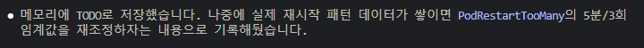

> Prompt : PrometheusRule 임계값 조정 TODO가 있었지?

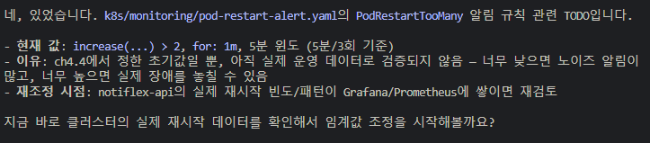

---
## 찜찜했던 이유

이 책에서 독자들에게 전달해주고 싶은 지식은 무엇이고, 해당 지식은 어떤 효용성이 있을까?

실습을 하는 사람들에게 최대한 같은 결과물을 얻게하기 위해 정말 모든 md가 IaC 수준으로 작성되어있다.

책에서 나온 프롬프트는 이미 `CLAUDE.md`에 모두 목록화 되어있다. 마치 이런식이다. 

1. "내가 가장 좋아하는 과일은 뭐게? 내 이름은 철수야" 라고 프롬프트를 입력한다.
2. `CLAUDE.md`에 행동 가이드 : "내가 가장 좋아하는 과일은 뭐게" -> `fruit.md` 라고 적혀있다.
3. `fruit.md`에는 각 사람의 이름과 사람이 좋아하는 과일이 적혀있다.
4. 철수가 가장 좋아하는 과일이 무엇인지 맞춘다.

이러한 AI 요청 흐름 설계를 보니, 인프라를 재현한다는 관점에서 IaC와 비교해서 장점이 뭘까라는 생각이 들었다. (IaC 도구와 인프라 지식이 충분하다는 가정하에)

운영 환경이라고 생각한다면 사용해도 되는 명령어 목록을 정의해둔 표와 다른 점이 있나? 라는 생각이 들었다.

물론, AI를 매니페스트 작성과 같은 작업에 사용하면 매우 편하긴한데 그건 따로 배워야 하는 수준의 지식은 아니다.

이러한 생각이 든 상황에서 다시 책의 맨 처음으로 가서 "이 책에서 얻을 수 있는 것들"로 가보자.

1. 현업 감각
	- 여러 클라우드 네이티브를 필요에 따라 단계적으로 확장한 경험
2. 판단 감각
	- 트레이드오프 상황에서 선택에 대한 기준 확립
3. 메타 감각
	- AI에게 제대로 질문하는 법

아하! 이 책에서 애초에 독자들에게 주고자하는 지식이 "어떻게 AI 도구를 사용하여 인프라를 구축/운영할 것인가에 대한 표준"이 아니라, "클라우드 네이티브 인프라 환경을 구축/운영하는 경험"을 AI를 통해 간편하게 체험하게 해주는 용도라는 것을 알았다.

나는 "인프라 환경에서 AI를 사용하는 표준"을 알고싶어서 이 책을 읽기 시작했는데, 애초에 목적이 달라서 찜찜한 기분이 들었던 것이다.

---
## 앞으로의 학습 태도

그렇다고 도움이 되지 않느냐? 그건 아니다.

내가 속한 조직은 자주 새로운 스택을 도입하는 환경이 아니다. 그리고 어떠한 이유 보다는 메뉴얼이 정해진 경우가 많다.

이에 동적이고 다양한 조직을 많이 경험한 저자에게 이러한 의사결정 과정, 확장하는 근거 등을 배운다는 생각으로 접근하면 배울 점이 많을 것 같다. (실제로도 다 알고있다고 생각했던 구성이지만 새롭게 알게되는 점들이 많았다)

이 책의 목적에 맞게 3주차부터는 AI에 집중하기 보다는, 이러한 운영 노하우, 의사 결정 근거에 맞추어 공부하여야겠다.

오히려 학습 목적이 바꾸니 찜찜한 부분이 해소되고 기분이 좋아졌다.

해당 스터디가 끝난 이후. 이 스터디로 얻은 지식과 앞으로 어디에 어떻게 적용할 것인지 마지막 글로 작성하겠다.