---
## CH1. Inroduction to Model Serving and Optimization

---
### Model Serving Optimization

---
#### 모델이란?

학습이 완료된 가중치 파일 하나를 모델이라고 착각하기 쉬운데, 모델이란 이러한 가중치 파일을 비롯한 '<span class="t-red">데이터, 구조, 실행 코드</span>'가 합쳐진 실행 가능한 소프트웨어를 말한다.

- 데이터 (`.bin` / `.pt` 등) - 가중치 행렬
- 구조 (`config.json`) - 설계도 (레이어 개수, 레이어 종류, 연산 순서, 입출력 구조 등)
- 코드 - 모델 추론 코드

---
#### 모델 서빙이란?

학습이 완료된 모델(데이터, 구조, 실행 코드)을 클라이언트이게 API 형태로 제공하는 것을 말한다.

단순히 제공하는 것뿐만 아니라, 트래픽 증가에 맞게 확장하며, 지연시간, 처리량, 안정성, 보안, 비용을 관리하는 <span class="t-red">시스템 엔지니어링 영역</span>이다.

---
#### 모델 서빙 최적화란?

안정성과 보안은 당연하고, 어떻게 이 모델을 '<span class="t-red">더 빠르게</span>' 제공할 것인가, 어떻게 이 모델을 '<span class="t-red">더 저렴하게</span>' 제공할 것인가를 고민하고 효율화하는 작업이다.

> [!tip] 왜 최적화 해야하냐고? 비싸니까!
> - GPU도 비싸고, 전기도 비싸다. LLM 서빙은 매우 비싼 작업이다.
> - 비용이 많이 들어가는 만큼, 이를 최적화하면 비용을 매우 많이 줄일 수 있다.

---
### 왜 모델 서빙을 공부해야 하는가?

다음과 같은 판단을 잘 하기 위함이다.

- 어떤 모델을 어떤 인프라에 배포할지
- latency와 throughput 목표를 어떻게 맞출지
- GPU/CPU/memory 비용을 어떻게 통제할지
- autoscaling과 routing을 어떻게 설계할지
- 모니터링, 보안, 장애 대응을 어떻게 구성할지

모든 상황에 맞는 만능 솔루션은 없다. 모델 크기, 사용자 수, 보안 요구사항, 비용, 시간 등 많은 변수를 고려하여 최적의 설계를 해야한다.

> [!warning] Q) 자체 모델을 서빙하는 회사가 얼마나 된다고? API 사용하면 되는거 아님?
> A1) API를 사용한다고 해도 아키텍처를 더 잘 설계할 수 있다.
> - 예시 1) 반복되는 시스템 프롬프트를 Prefix Cache가 적용되도록 프롬프트 구조를 고정 (Transformer가 이전 토큰들의 KV를 재사용하는 방식에 대한 이해)
> - 예시 2) 트러블 슈팅 : 첫 토큰이 늦다 -> Prefill이 늦을 가능성 -> RAG 검색 문서 청크 수 조절, 작은 모델을 이용한 요약, Prefix Cache 활용 등
> 
> A2) 보안에 민감한 산업 분야 / 벤더에 종속되지 않는 경쟁력
> - 반도체, 방산, 금융 분야에서는 내부 구성원이 외부 LLM을 업무에 활용하기를 원하지 않음 -> 자체 인프라로 LLM 서빙
> - Claude API를 잘 쓴다, OpenAI API를 잘 쓴다 가 아니라 LLM의 공통 원리를 기준으로 시스템을 설계하는 능력을 배양할 수 있다.


---
### AI 모델의 생명주기

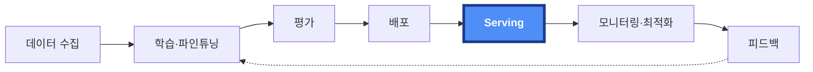
```mermaid
flowchart LR
    A["데이터 수집"] --> B["학습·파인튜닝"]
    B --> C["평가"]
    C --> D["배포"]
    D --> E["Serving"]
    E --> F["모니터링·최적화"]
    F --> G["피드백"]

    G -.-> B

    %% Serving 강조
    style E fill:#4F8EF7,stroke:#1E3A8A,stroke-width:4px,color:#fff,font-weight:bold
```

| 단계     | 역할                       |
| ------ | ------------------------ |
| 데이터 수집 | 로그, 문서, 센서, 사용자 데이터 수집   |
| 학습     | 데이터에서 패턴 학습              |
| 평가     | 정확도, Loss, Benchmark 검증  |
| 배포     | 모델을 버전 있는 소프트웨어 산출물로 패키징 |
| 서빙     | API를 통해 실제 요청 처리         |
| 최적화    | 속도, 비용, 안정성 개선           |
| 재학습    | 운영 데이터를 다시 학습에 반영        |

AI 모델은 위와같은 생명주기를 거친다.
여기서 우리가 집중할 부분은 모델 <span class="t-red">Serving</span> 부분이다.

---
### 모델 서빙

---
#### 모델 서빙 과정

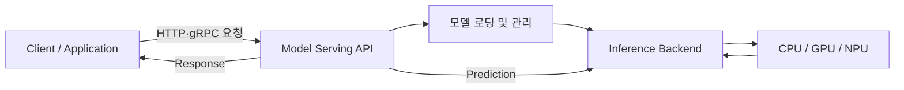
```mermaid
flowchart LR
    A["Client / Application"]
    B["Model Serving API"]
    C["모델 로딩 및 관리"]
    D["Inference Backend"]
    E["CPU / GPU / NPU"]

    A -->|"HTTP·gRPC 요청"| B
    B -->|"Response"| A

    B --> C
    C --> D

    B -->|"Prediction"| D

    D --> E
    E --> D
```

모델 서빙은 위와 같은 과정을 거친다.

---
#### LLM에 대한 이해는 필수

지금 공부하고자하는 내용은 단순히 대형 AI 회사에서 제공하는 LLM API를 호출하여 그걸 가공해서 클라이언트에게 전달하는, AI Wrapping 아키텍처를 공부하는 것이 아니다.

자체 GPU 인프라, 혹은 클라우드 GPU 인스턴스에서 LLM 모델 자체를 서빙하는 방법과 이를 최적화하는 방법을 공부하는 것이다.

앞으로 공부할 여러 LLM 서빙 최적화 기법들은 Transformer 아키텍처의 요소들을 변형, 최적화하는 방법론들이기 때문에 모델에 대한 이유가 필수이다.

예를들어, PagedAttention이라는 KV Cache 최적화 기법을 사용하여 LLM 서빙을 최적화한다고 하자. 이때, KV는 트랜스포머 모델의 근간이 되는 Attention의 구성요소인 QKV중 2개이다. 이 상황에서 Attention 모델에 대한 이해가 없다고하면 이러한 기법을 사용할 수 있을까? 사용한다고 하더라도 '잘' 사용할 수 있을까?

이 때문에, LLM에 대한 이해가 필요하다. 이에 근간이 되는 모델인 Transfomer 모델을 이해해야하며, 이 모델에서 사용하는 Attention 구조를 이해해야한다.

> [!tip] 이를 위해 2가지 글을 작성하였다. (참고)
> 1. [Attention이란?](../04-AI/01-attention.md)
> 2. [Transformer란?](../04-AI/02-transformer.md)

---
#### 주요 서빙 지표

- 낮은 latency
- 높은 throughput
- 높은 GPU 활용률
- 낮은 cost per request
- 안정적인 tail latency
- 효율적인 메모리 사용

---
#### 참고) LLM Serving 기술 스택

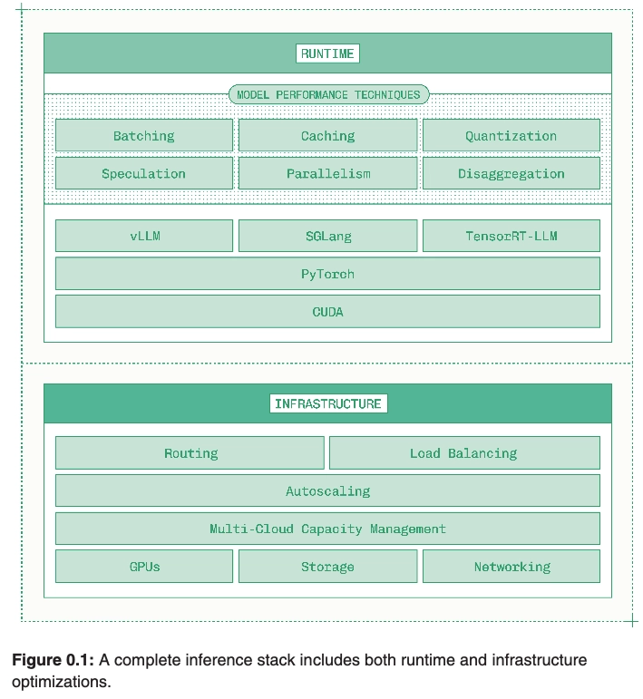

---
### vLLM

---
#### 개념

> vLLM은 high-throughput, low-latency LLM Serving을 위해 설계된 대표적인 오픈소스 프레임워크이다.
> 
> PagedAttention, continuous batching, OpenAI-compatible API server, tensor parallelism 등의 최적화 기능들을 제공한다. (CH8 에서 다룰 예정)

> [!info] 다시 말하지만, Transformer 모델의 구조에 대해 이해가 필요하다.
> - vLLM을 사용할 때 어떤 파라미터를 어떻게 최적화할까에 대한 판단을 하려면 모델에 대한 이해가 필수다.

---
#### 아키텍처, 워크플로우

> 자세한건 이후 챕터에서 다룰 예정이므로 개괄적인 구조만 시각적으로 보고 넘어가자.

**아키텍처**

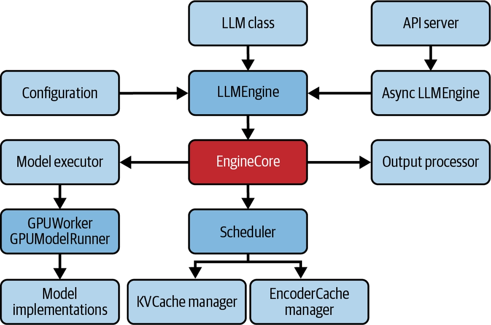


**워크플로우**

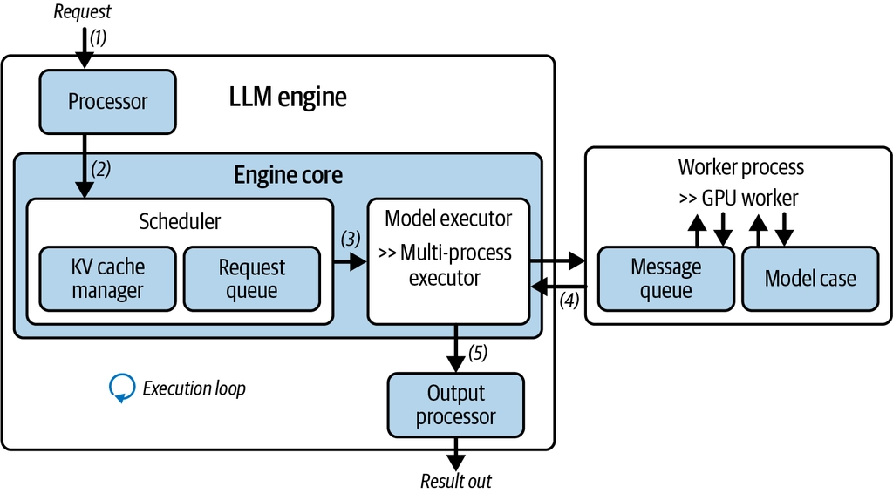

---
#### 사례 소개

>같은 GPU 리소스 환경에서 이러한 성능 차이를 보인다.

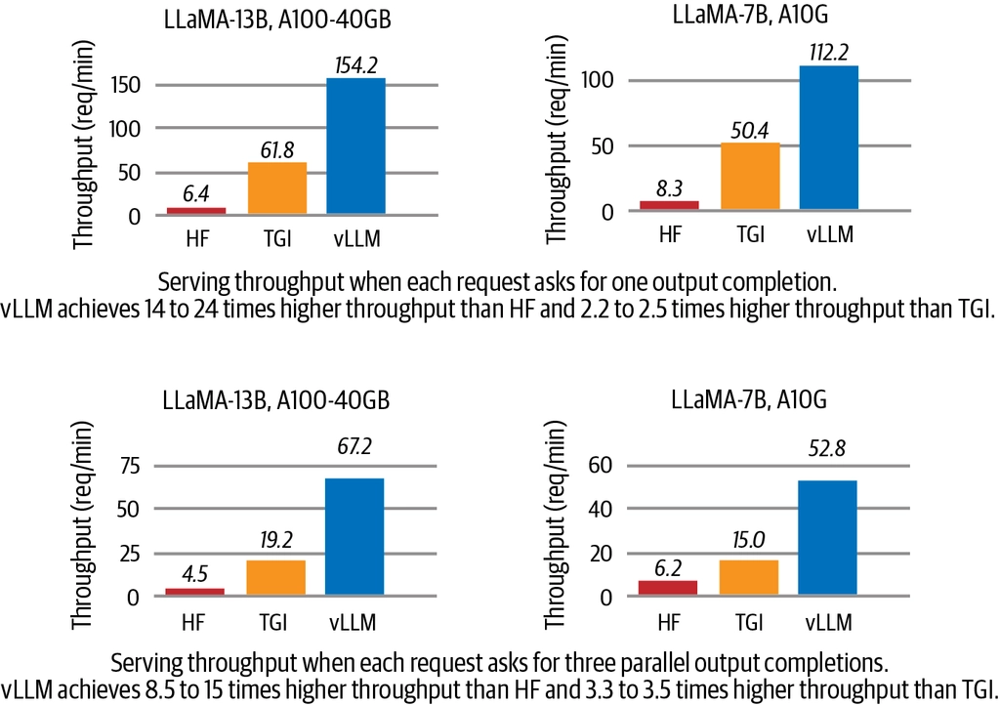

---
### 모델 서빙 방안 종류

---
#### On-Device (Edge Serving)

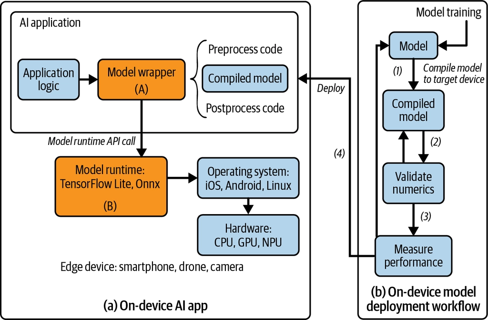

- **개념**
	- 모델을 <span class="t-red">서버가 아닌 사용자 기기에서 직접 실행</span>하는 방식
	- **모델 래퍼**가 전처리·후처리와 런타임 호출을 담당하고, **모델 런타임**이 CPU·GPU·NPU를 활용해 추론 수행

- **장점**
	- 프라이버시 보호
	- 초저지연 응답
	- 인터넷 연결 없이 동작 가능
	- 생체 인증, AR/VR, 로봇, IoT 등에 적합

- **단점**
	- 연산 성능과 메모리 제약으로 대형 모델 실행이 어려움
	- 배터리 소모가 큼
	- 모델 업데이트 및 유지보수가 어려움
	- 기기별 하드웨어 호환성 관리 필요

---
#### Single-Model Service

- **개념**
	- 하나의 모델(또는 버전)을 하나의 독립적인 서비스(컨테이너)로 배포하는 가장 일반적인 서빙 방식
	- HTTP/gRPC API를 통해 추론 요청을 처리

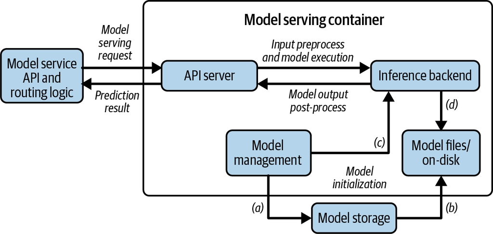

- **컨테이너 구성 요소**
	- **API Server**: 외부 요청 수신
	- **Model Management**: 모델 다운로드·로딩·갱신
	- **Inference Backend**: 실제 추론 수행(vLLM, TensorFlow Serving, TorchServe 등)

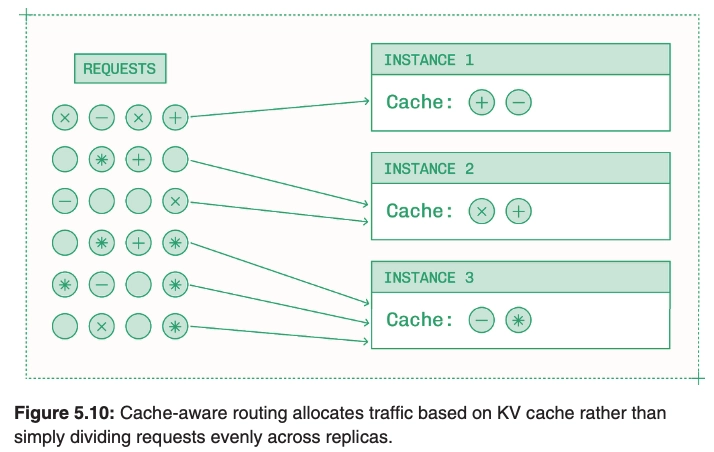

- **라우팅 및 확장**
	- 단순 Round Robin보다 **Least Connections**, **Least Response Time**, **동적 로드 밸런싱**을 주로 사용
	- **수평 확장(Scale Out)**: 동일한 모델 컨테이너 추가
	- **수직 확장(Scale Up)**: 더 큰 GPU 또는 여러 GPU를 활용해 대형 모델 실행
	- 위 사진은 KV 캐시 기반 로드밸런싱

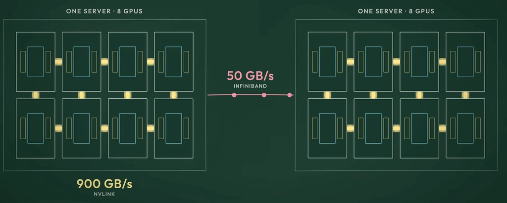

- **GPU 운영 원칙**
	- 가능하면 **여러 서버보다 한 서버의 여러 GPU(Intra-node)**를 사용하는 것이 성능에 유리
	- Kubernetes의 **Bin Packing** 스케줄링으로 GPU 파편화를 줄이고 자원 활용률을 높일 수 있음
	- 위 사진을 보면 아무리 인피니밴드로 연결한다고 하더라도 같은 노드에 연결된 GPU들에 비해 대역폭이 크게 낮은 것을 볼 수 있음.

- **장점**
	- 모델 간 리소스 경쟁이 없어 성능과 지연시간이 우수
	- 모델별 독립적인 확장·배포·모니터링 가능
	- 장애가 다른 모델에 영향을 주지 않아 운영이 단순

- **한계**
	- 모델 수가 많아질수록 컨테이너 수가 급증
	- 사용하지 않는 모델도 자원을 계속 점유하여 비용과 운영 부담이 증가
	- 이러한 문제를 해결하기 위해 **멀티 모델 서비스(Multi-Model Service)**가 등장

> [!tip] K8S Bin Packing 스케줄러
> - k8s 기본 스케줄러는 가용 자원에 따라 스케줄러가 여러 노드에 파드를 골고루 분산한다.
> - GPU와 같은 자원을 다룰 때 Pod를 배치할 Node를 가능한 빈틈없이 채워 리소스 사용률을 극대화하는 스케줄러이다.
> - 지금 자세히 다룰 것은 아니고, 아 이런 스케줄러도 있구나 ~ 하면 된다.

---
#### Multi-Model Service

- **개념**
	- 하나의 서빙 컨테이너에서 여러 모델을 함께 호스팅하는 방식
	- GPU·CPU·메모리를 여러 모델이 공유하며, 요청 시 모델을 **동적으로 로드/언로드**하여 자원을 효율적으로 사용

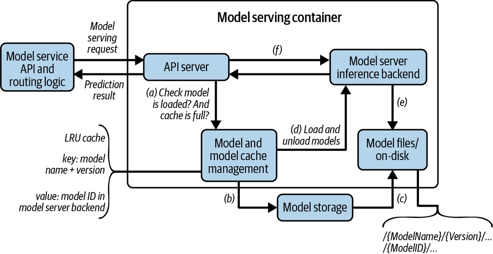

- **동작 방식**
	- 요청된 모델이 메모리에 있으면 바로 추론
	- 없으면 모델 저장소에서 다운로드 후 로드하여 추론
	- 메모리가 부족하면 **LRU 캐시**를 이용해 가장 오래 사용되지 않은 모델을 언로드

- **장점**
	- GPU 및 메모리 사용률 향상
	- 사용하지 않는 모델을 계속 메모리에 유지하지 않아 인프라 비용 절감
	- 많은 수의 모델을 효율적으로 운영 가능

- **핵심 과제**
	- **라우팅**: 요청한 모델이 이미 로드된 컨테이너로 요청을 전달해야 콜드 스타트와 모델 스와핑을 줄일 수 있음
	- **오토스케일링**: 모델별 트래픽이 다르므로 인기 모델만 선택적으로 확장해야 함

- **해결 방법**
	- AI Gateway(예: Envoy AI Gateway, LiteLLM)가 **Route Map**으로 모델 위치를 관리
	- 모델별 **Replica** 수를 관리하여 트래픽에 따라 적절한 컨테이너로 요청을 분산

- **한계**
	- 대형 모델이나 저지연 서비스에는 부적합
	- 캐시 관리, 라우팅, 스케일링 등 운영 복잡도가 높음
	- 실무에서는 <span class="t-red">Single-Model Service와 함께 혼합하여 사용하는 경우가 많음</span>

---
#### Model Serving Platform

- **등장 배경**
	- 여러 모델을 조합한 AI 서비스 증가
	- GPU·CPU·메모리 등 자원을 여러 서비스에서 효율적으로 관리할 필요성 증가

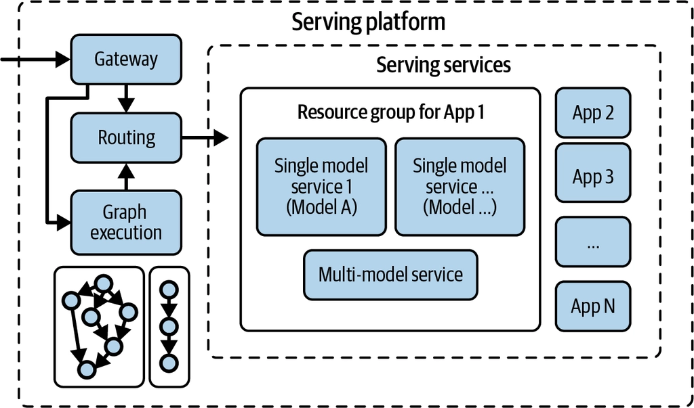

- **주요 구성 요소**
	- **Gateway**: 외부 요청의 진입점
	- **Routing**: 요청을 적절한 모델 또는 서빙 그룹으로 전달
	- **Graph Execution**: 여러 모델을 순차·병렬로 실행하는 추론 워크플로우 관리
	- **Resource Group**: 애플리케이션별 CPU·GPU·메모리 자원을 분리하여 관리

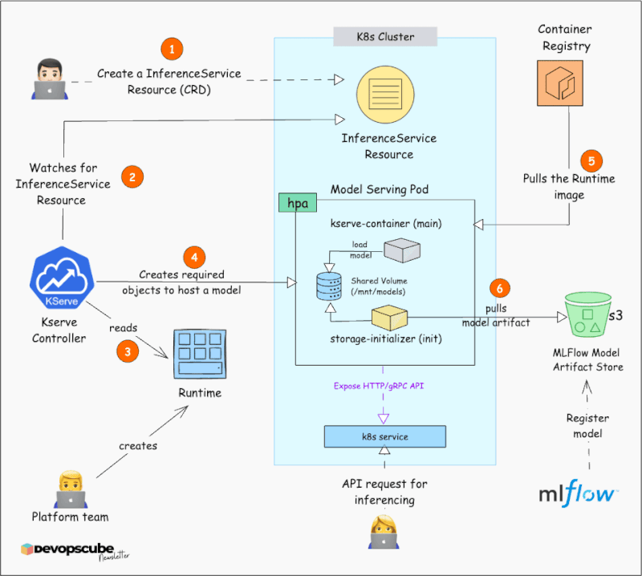

- **동작 방식**
	- **요청 → Gateway → Graph Execution → Routing → 단일/멀티 모델 서비스 → 추론 결과 반환**
	- 하나의 요청에서 여러 모델(예: Intent → Embedding → Retrieval → LLM → Safety Filter)을 연결하여 실행 가능

- **장점**
	- 복잡한 AI 워크플로우 지원
	- 자원 격리를 통한 성능 및 비용 최적화
	- 확장성, 운영 편의성, 멀티 모델 관리 향상

- **대표 플랫폼**
	- **KServe**: Kubernetes 기반 모델 서빙 및 오토스케일링
	- **Ray Serve**: 다단계 추론(Graph Execution)에 강점
	- **MLflow Model Serving**: 모델 레지스트리 및 실험 관리와 통합된 서빙

---
## CH2. Large Language Model Serving

---
### Inside the Mind of a Transformer

---
#### 트랜스포머의 자기회귀적 특성

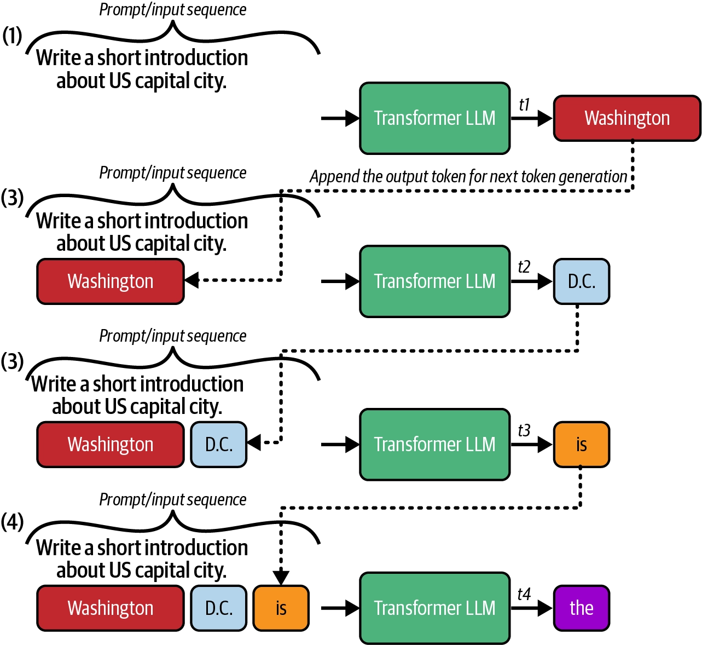

> [Transformer란?](../04-AI/02-transformer.md) 글에서 Output Embedding의 Input을 생각해보자.

- **개념**
	- LLM은 **한 번에 토큰 하나씩 생성**하며, 새 토큰은 **이전에 생성된 모든 토큰을 기반으로 예측**한다.
	- 이 과정을 반복하여 문장을 완성하는 방식을 **자기회귀(Autoregressive) 생성**이라고 한다.

- **동작 방식**
	- 생성된 토큰을 입력 시퀀스 뒤에 계속 추가(append)하며 다음 토큰을 예측
	- 종료 토큰(EOS) 생성 또는 최대 길이에 도달하면 생성 종료

- **특징**
	- 이전 문맥을 계속 참고하므로 문맥적 일관성이 높다.
	- 사람의 글쓰기처럼 앞에서 생성한 내용을 기반으로 다음 단어를 이어간다.

- **운영 관점**
	- 하나의 요청은 한 번의 추론이 아니라 **여러 Decode Step의 연속**이다.
	- 생성 길이가 길수록 GPU 점유 시간이 길어져 지연시간과 비용이 증가한다.

---
#### Decoder-Only Transformer 모델의 구조

> 이 책에서는 디코더 온리 아키텍처 모델에 집중한다.
> 
> [Transformer란?](../04-AI/02-transformer.md) 이 글을 참고하면, 아래 내용의 이해가 쉽다.

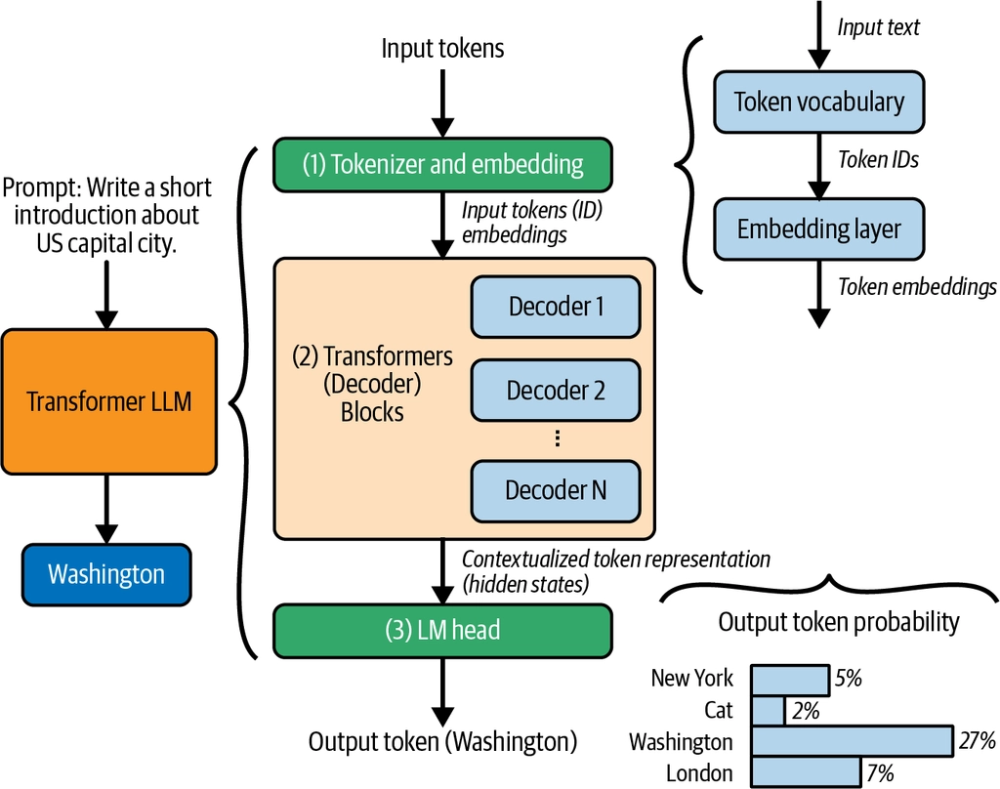

**1. 토크나이저 & 임베딩**
- 텍스트를 토큰으로 분리
- 토큰을 숫자 ID로 변환
- 각 토큰 ID를 Transformer가 처리할 수 있는 벡터로 변환

**2. Transformer 디코더 블록**
- Self-Attention과 MLP를 통해 입력 문맥을 처리
- 여러 블록을 거치며 각 토큰을 문맥이 반영된 **Hidden State**로 변환
- 마지막 토큰의 Hidden State를 다음 토큰 예측에 사용

**3. LM Head**
- 마지막 Hidden State를 전체 어휘에 대한 점수인 **Logit**으로 변환
- 확률이 높은 토큰을 선택해 다음 토큰으로 출력

---
#### 간단한 실습 (Qwen2.5-0.5B)

> https://github.com/orca3/llm-model-inference/blob/main/ch02/ch2_Inside_the_Mind_of_a_Transformer.ipynb

**model.config**

```yaml
Architecture Parameters: 아키텍처 파라미터 - 총 파라미터 약 4억 9,400만 개
Hidden size: 896         # 모델 내부에서 토큰 하나를 표현하는 벡터의 차원 수(임베딩 차원), 모든 레이어를 통과하는 동안 이 크기의 벡터로 정보가 흐름
Number of layers: 24     # 트랜스포머 블록(Self-Attention + FFN)이 24번 반복됨, 레이어가 깊을수록 더 복잡한 패턴/추론을 학습할 수 있지만, 학습 난이도와 추론 지연시간도 증가
Number of attention heads: 14  #  Multi-Head Attention에서 어텐션을 14개의 독립적인 "머리"로 나눠 병렬로 계산 , 각 head 차원 = 896 / 14 = 64
Intermediate size: 4864  # FFN(Feed-Forward Network)의 은닉층 크기

Tokenizer Parameters:
Vocabulary size: 151936  # 모델이 인식하는 고유 토큰(서브워드)의 개수, 다국어(특히 중국어 포함) 지원을 위해 매우 큰 편 — 영어 전용 모델(GPT-2 등)은 보통 5만 개 내외
Maximum position embeddings: 32768  # 모델이 한 번에 처리할 수 있는 최대 시퀀스 길이(컨텍스트 윈도우), 32K 토큰 ≈ 책 한 권 분량의 텍스트를 한 번에 처리 가능

Model Size:
Total parameters: 494,032,768  # 임베딩(1.36억) + 24개 레이어(약 3.5억대) 를 합치면 약 4.94억 개
```

- `model.config`를 통해 아키텍처 정보를 직접 확인할 수 있다.
	- 왜 확인해야하나? -> 레이어 수, 은닉 차원, 어텐션 헤드 수, 어휘 크기 등을 미리 파악하면 필요한 GPU 메모리 추정, 서빙 전략 선택(양자화, 배치 등), 성능 최적화 계획(레이어 병렬화, 모델 샤딩 등)에 도움이 된다.


**디코더 레이어 확인**

```yaml
Model Configuration:

Model Structure:
model: Qwen2Model
  embed_tokens: Embedding        # 토큰 ID → 임베딩 벡터 변환
  layers: ModuleList             # 디코더 블록 24개 (0~23)
    0: Qwen2DecoderLayer
      self_attn: Qwen2Attention
        q_proj / k_proj / v_proj / o_proj: Linear   # Query/Key/Value/Output 투영
      mlp: Qwen2MLP
        gate_proj: Linear
        up_proj: Linear
        down_proj: Linear
        act_fn: SiLUActivation
      input_layernorm: Qwen2RMSNorm
      post_attention_layernorm: Qwen2RMSNorm
    1: Qwen2DecoderLayer  (동일 구조 반복)
    ...
    23: Qwen2DecoderLayer (동일 구조 반복)
  norm: Qwen2RMSNorm                # 마지막 디코더 블록 이후 최종 정규화
  rotary_emb: Qwen2RotaryEmbedding  # 모든 레이어가 공유하는 RoPE 위치 인코딩 모듈
lm_head: Linear                     # 최종 hidden state → vocab logits 변환
```

- 공부했던 어텐션, 트랜스포머 구조가 실제 코드에서 어떻게 적용되는지 볼 수 있다.
- [Attention이란?](../04-AI/01-attention.md), [Transformer란?](../04-AI/02-transformer.md)


**BertViz를 이용한 어텐션 시각화**

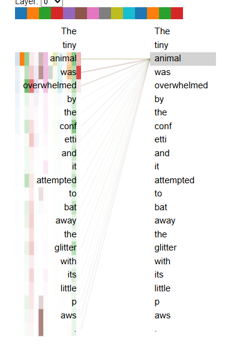

---
### Executing LLM Generation: A Step-by-Step Waklthrough

> 이 섹션은 KV 캐시, 프리필, 디코딩 같은 핵심 내부 LLM 서비스 개념을 설명하며, LLM이 토큰을 생성하는 과정을 단계별로 보는 실습이다.
> 
> https://github.com/orca3/llm-model-inference/blob/main/ch02/ch2_Workthrough_LLM_execution.ipynb

---

#### LLM 결과 출력해보기

```ini
# input
Write a short introduction about US capital city.

# output
Write a short introduction about US capital city. Washington, D.C., is the only capital city in the United States, as well as the only one in the world with both a white and a black population. The city is located on the National Mall in the heart of the nation's capital, and is home to many historical landmarks, museums, and government buildings. Washington is also known as the "City of Democracy" and is home to the United States' oldest political institutions, the United States Capitol and the White House. The city is home to the President of the United States, as well as the Mayor of the United States, and has a vibrant cultural scene, including the National Gallery, the Smithsonian National Museum of African American History and Culture, and the National Museum of Natural History. Washington is also home to many of the most important institutions of the United States, including the White House, the National Mall, and the historic buildings of the Smithsonian Institution.
```

---
#### KV Cache

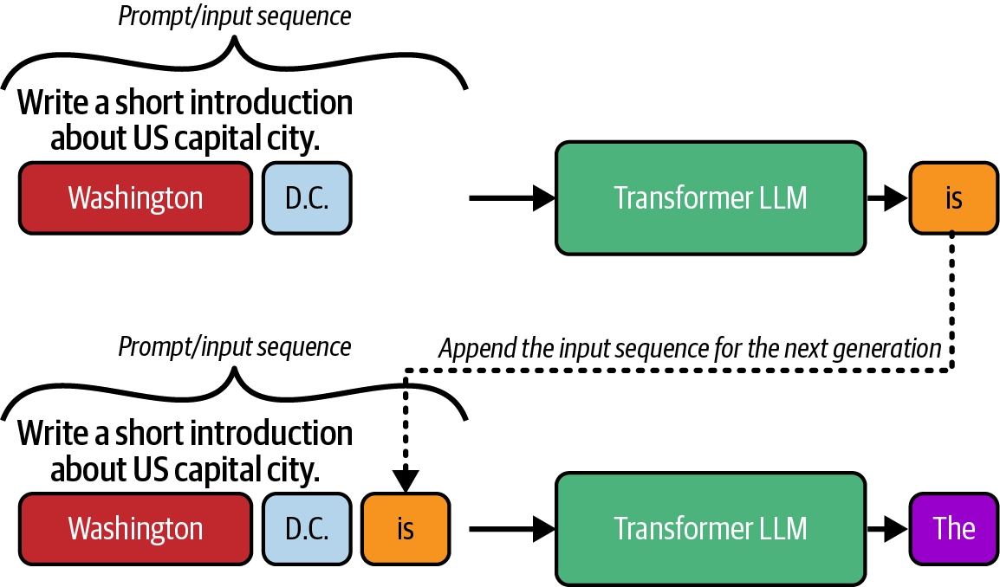

> 앞에서 계속 언급 했듯이, 실시간으로 출력되는 output들이 다시 모델로 들어가는 자기회귀적 과정이다.

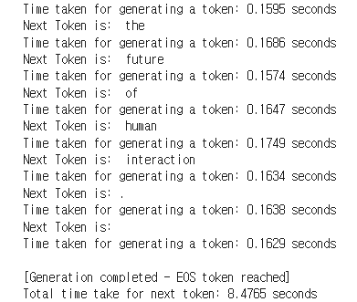

KV Cache 없이 위에서 출력해본 문장은 7.2090초 걸렸다.

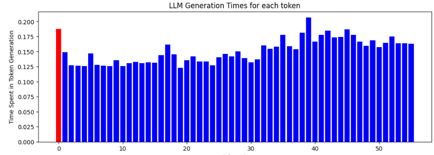

그리고, 뒤로갈수록 토큰 생성 시간이 길어지는 경향을 보였다.

왜냐하면, 시퀀스 길이가 길어질수록 연산량과 리소스 사용량이 계속 증가하기 때문이다.

이래서 나오는게 KV Cache이다. KV Cache의 아이디어는 다음과 같다.

<span class="t-red">"이미 계산된 이전 토큰의 어텐션은 재사용하고, 새로 추가된 토큰에 대해서만 추가로 계산하자"</span>

KV Cache를 적용한 결과는 다음과 같다. (cf. HBM 메모리가 KV Cache를 저장하는데 사용)

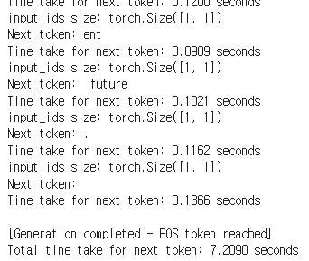

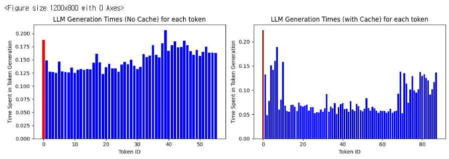

이 효과는 모델이 클수록 드라마틱할 것이다.

> [!question] 왜 Query는 캐싱 안함?
> - Query는 현재 토큰의 것만 필요하고, 과거 토큰의 Query를 다시 쓸 일이 없기 떄문
> - 이 말이 무슨 말인지 이해가 안된다면, 아직 모델에 대한 이해가 부족한 것
> - [Attention이란?](../04-AI/01-attention.md), [Transformer란?](../04-AI/02-transformer.md)

---
#### Prefill-Decode

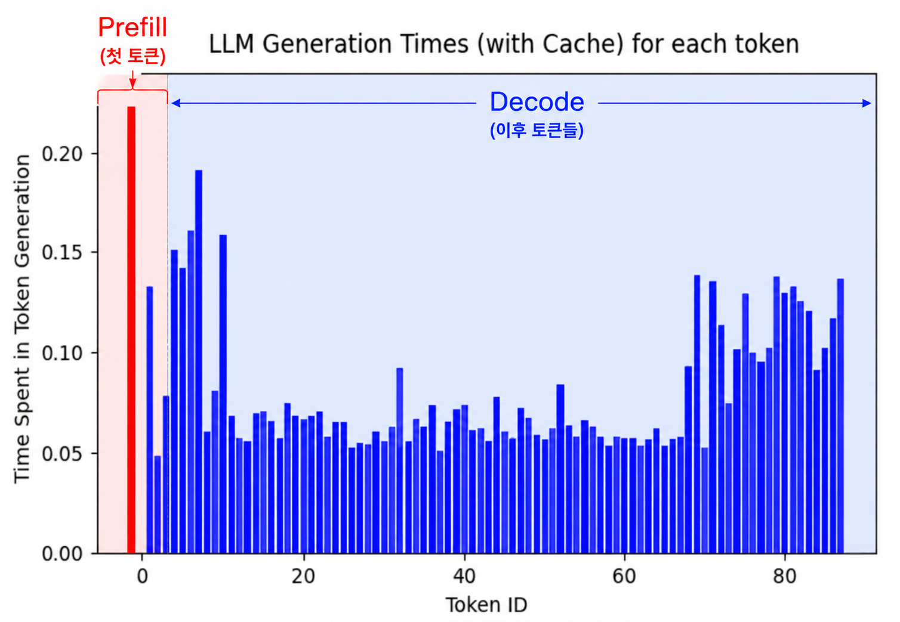

> 위의 이전 KV Cache 실습에서 KV Cache를 사용한 쪽이, 오히려 첫 토큰 생성에서는 더 오래걸렸다.
> 
> 왜냐하면, 해당 과정이 Prefill 과정이기 때문읻다.

**Prefill–Decode와 KV Cache의 관계**
- Prefill–Decode는 <span class="t-red">KV Cache를 활용하는 LLM 추론 과정을 두 단계로 구분한 개념</span>이다.
- Prefill에서 KV Cache를 만들고, Decode에서 이를 재사용한다.
- 실제 중복 연산을 줄이는 핵심 기법은 **KV Cache**이다.
        
**Prefill 단계 (프롬프트 처리)**
- 입력 프롬프트 전체를 한 번에 병렬 처리한다.
- 각 토큰의 Q/K/V와 Attention을 계산한다.
- 계산된 **K/V를 KV Cache에 저장**한다.
- 전체 시퀀스를 처리하므로 연산량이 큰 단계이다.
- <span class="t-red">GPU의 '연산 성능'이 중요하다.</span>
        
**Decode 단계 (토큰 생성)**
- Prefill 이후 새로운 토큰을 **하나씩 생성**한다.
- 새 토큰의 Q/K/V만 새롭게 계산한다.
- 과거 K/V는 **KV Cache에서 가져와 재사용**한다.
- 새로 생성된 K/V는 다시 KV Cache에 추가한다.
- <span class="t-red">GPU의 '메모리 대역폭'이 중요하다.</span>

> [!info] 참고) Prefill과 Decode를 다른 GPU 노드에 배치하는 것이 더 효율적이다.
> - 실제로는 여러 요청이 동시에 들어오는 경우가 많다. 각 요청에는 고유한 사전 채우기 및 디코딩 요구 사항이 있지만, 한 번에 하나의 단계만 실행될 수 있다. GPU가 연산 집약적인 사전 채우기 작업에 바쁘면 디코딩 작업은 대기해야 하므로 ITL이 증가하고, 반대의 경우도 마찬가지이다.
> - 이 때문에, 최근에 KV Cache의 Shared Pool과 같은 개념이 나오고있다.

---
### LLM 서빙 프레임워크 개요

---
#### 서빙 프레임워크란?

LLM을 직접 서빙한다고 생각해보자.

모델을 GPU에 올리고 API만 만들어준다고 끝이 아니다.

여러 사용자의 요청을 동시에 처리해야하고, GPU를 최대한 효율적으로 사용해야하며, KV Cache와 같은 LLM 특유의 자원도 관리해야한다.

이러한 작업들을 대신 처리해주는 것이 **LLM 서빙 프레임워크**이다.

대표적으로 **vLLM, SGLang** 등이 있다.

- 모델 로딩 및 추론
- API를 통한 모델 제공
- 여러 사용자의 요청을 동시에 처리
- GPU 자원 및 KV Cache 관리
- 높은 Throughput과 낮은 Latency를 위한 최적화

---
#### 서빙 프레임워크의 핵심 기능

> 앞에서 직접 구현했던 KV Cache와 같은 기능들이 실제 서빙 프레임워크 내부에서는 최적화되어 구현되어 있다.

**KV Cache 관리**
- 이전 토큰의 K/V를 재사용하여 Decode 연산 최적화
- 제한된 GPU 메모리에서 KV Cache를 효율적으로 관리

**요청 스케줄링**
- 여러 사용자의 요청을 효율적으로 배치
- Batch / Continuous Batching 등을 통해 GPU 활용률 향상

**동시 요청 처리**
- 여러 사용자의 추론 요청을 동시에 처리
- 요청마다 서로 다른 Prefill / Decode 상태를 관리

**토큰 스트리밍**
- 생성된 토큰을 실시간으로 클라이언트에게 전달
- 요청 취소 및 생성 중단 처리

---
#### 실습 (vllm)

> 이전 KV Cache 실습은 HuggingFace Pipeline 을 사용하였다. 이번에는 vllm을 사용하는 실습이다.
> 이를 통해서 이러한 서빙 프레임워크의 효과를 체감하는 실습이다.
> 
> - https://github.com/orca3/llm-model-inference/blob/main/ch02/ch2_Run_LLM_With_vLLM.ipynb
> - 위 실습 환경이 코랩과 조금 상이한 부분이 있어서 런타임 유형을 변경해야한다. (2025.07로 변경)
> - 추가적으로 vllm 버전도 변경한다. (`!pip install vllm` -> `!pip install vllm==0.6.6.post1`)

> 해당 실습 중 코랩의 VRAM 부족으로 실습하지 못했다. 추후 로컬 GPU로 실습 후 업데이트 하겠다.
> 
> 여기서는 vllm과 같은 서빙 프레임워크를 사용함으로써 몇배의 효율을 얻을 수 있다. (이 실습에서는 17배의 효과가 있다고 한다) 라는 점만 이해하고 넘어가자.

---
#### 추가적인 여러 Attention 효율화 기법

> 앞선 vllm 실습에서 아래의 여러 기법들의 나왔다.

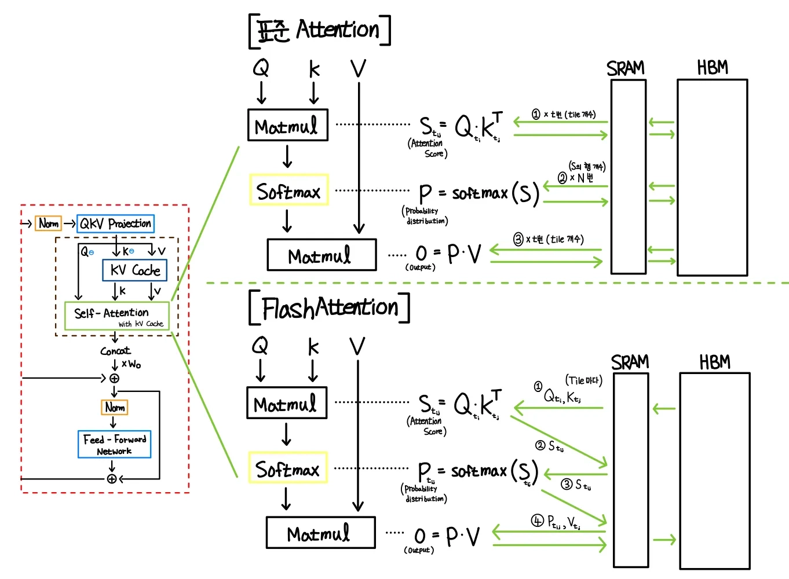
[이미지출처 : https://www.chooblog.xyz/blog/kernel-tensor_core]

**[Flash Attention]**

**FlashAttention은 Attention 연산 자체를 빠르게 만드는 최적화 기법**이다.

일반적인 Attention에서는 `QKᵀ → Softmax → ×V` 과정에서 중간 결과인 큰 Attention Matrix를 HBM에 쓰고 다시 읽는다.

문제는 GPU 연산 자체보다 **HBM ↔ SRAM 연산 유닛 사이의 데이터 이동 비용**이 크다는 것이다.

FlashAttention은 Attention을 작은 **Block(Tile)** 단위로 나눠 처리한다.

- Q/K/V를 작은 블록 단위로 가져온다.
- 빠른 GPU 내부 메모리(SRAM)를 최대한 활용한다.
- 거대한 Attention Matrix 전체를 HBM에 저장하지 않는다.
- 결과적으로 HBM Read/Write 횟수를 크게 줄인다.

> 즉, FlashAttention = Attention 계산 과정의 메모리 I/O를 줄여 연산을 빠르게 만드는 기법
> 
> 중요한 점은 **Attention의 수학적 결과를 근사해서 줄이는 기법이 아니라는 것**이다. 일반 Attention과 같은 결과를 계산하면서 GPU에서 실행하는 방법을 최적화한다.

> [!question] 아니 작게 쪼개면 IO 더 많이 발생하는거 아니야?
> 
> FlashAttention은 연산을 작게 쪼개서 I/O를 늘리는 게 아니라, 작게 쪼갠 덕분에 중간 결과를 HBM에 저장하지 않고 빠른 SRAM 안에서 계산을 끝내 HBM I/O 총량을 줄이는 기법이다.


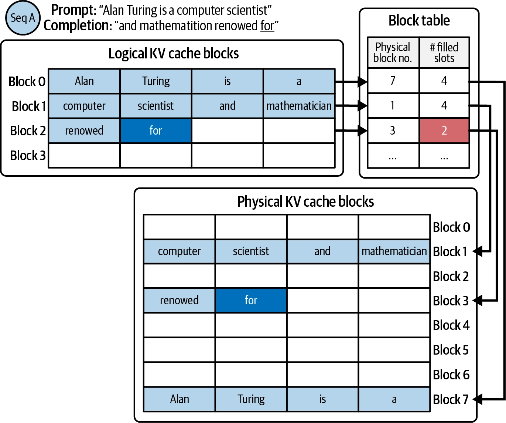

**[Paged Attention]**

**PagedAttention은 KV Cache를 효율적으로 관리하기 위한 기법**이다.

앞에서 봤듯이 Decode 과정에서는 요청마다 KV Cache가 계속 커진다.

```
Request A → K V ...
Request B → K V K V ...
Request C → K V K V K V K V K V ...
```

문제는 각 요청이 **최종적으로 몇 토큰까지 생성할지 미리 알 수 없다는 것**이다.

KV Cache를 요청별로 큰 연속 메모리 공간에 할당하면 공간이 낭비되거나 메모리 파편화가 발생할 수 있다.

PagedAttention은 운영체제의 **Virtual Memory / Paging과 비슷한 아이디어**를 사용한다.

물리적으로 연속된 공간에 KV Cache가 존재하지 않아도 된다.

- KV Cache를 일정 크기의 Block으로 분할
- 필요한 만큼 Block을 할당
- 논리적인 Block과 실제 GPU 메모리의 Block을 매핑
- 요청이 끝나면 Block을 반환하여 다른 요청이 재사용

따라서 GPU 메모리를 훨씬 효율적으로 사용할 수 있고, **더 많은 요청을 동시에 처리할 수 있다.**

> **PagedAttention = KV Cache를 Page/Block 단위로 관리하여 GPU 메모리 낭비를 줄이는 기법**


<span class="t-red">정리</span>

| 구분 | FlashAttention | PagedAttention |
|---|---|---|
| 최적화 대상 | Attention **연산** | KV Cache **메모리 관리** |
| 핵심 문제 | HBM I/O가 많음 | KV Cache 메모리 낭비/파편화 |
| 핵심 아이디어 | Tile 단위 Attention 계산 | Block 단위 KV Cache 관리 |
| 주요 효과 | Attention 연산 속도↑ | 메모리 효율↑, 동시 요청 수↑ |

---
#### LLM Streaming Serving

> **왜 Streaming이 필요한가?**
> - 우리가 사용하는 LLM은 보면, 토큰들이 순차적으로 Streaming되며 제공된다.
> - 실제로는 앞에서 봤듯이 토큰이 각 토큰마다 속도는 다르지만, 순차적으로 생성된다.
> - 이 결과를 유저에게 모두 생성된 이후에 한꺼번에 제공하면 유저 경험적으로 좋지 않을 것이다.

---
#### LLM Batch Serving

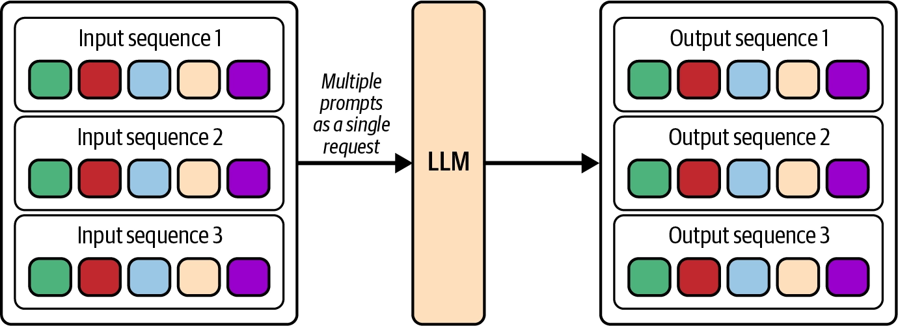

> **왜 Batch가 필요한가?**
> - 실무에서 (문서 10만 건 요약, PDF 5천 개 인덱싱, 동시 사용자 2만명 챗봇 등) 요청을 하나씩 순차 처리하면 GPU(기업용의 아주 큰 GPU 인프라)가 대부분의 시간 동안 놀게 된다.
> - 이에 Batch 처리로 여러 입력 요청을 묶어서 모델에 한 번에 통과시킨다.

> **왜 Transformer는 Batch가 특히 효과적인가?**
> - 모델 가중치는 모든 요청이 공유하므로, Batch 크기를 늘려도 가중치를 다시 읽어올 필요 없음 (메모리 재사용)
> - GPU는 원래 대규모 병렬 연산에 최적화된 하드웨어라서, 배치로 묶으면 그만큼 GPU 코어를 놀리지 않고 꽉 채워 쓴다.
> -> 그래서 여러 요청을 한 번에 처리해도 오버헤드가 크게 늘지 않고, GPU 활용률(utilization)이 크게 올라간다. (이전에 근무하던 회사에서 GPU Utilization을 중요 지표 중에 하나로 세우는 것을 보았는데 이를 최적화 할 수 있나? 라고 생각했는데 이렇게 최적화 할 수 있구나)

---
