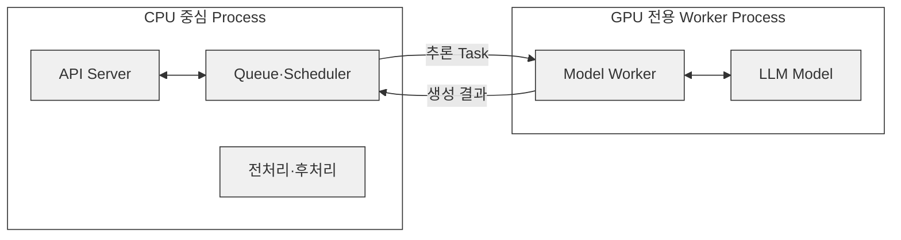
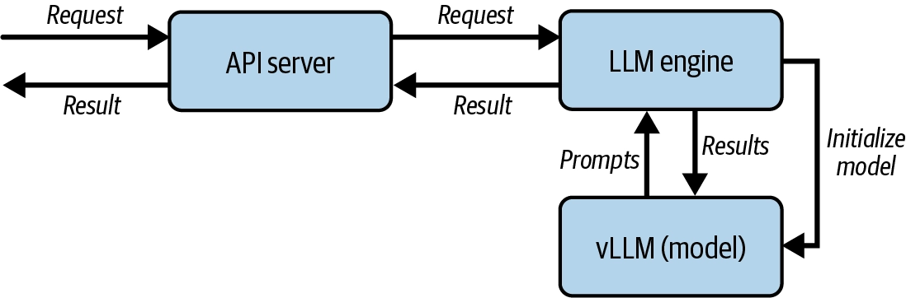
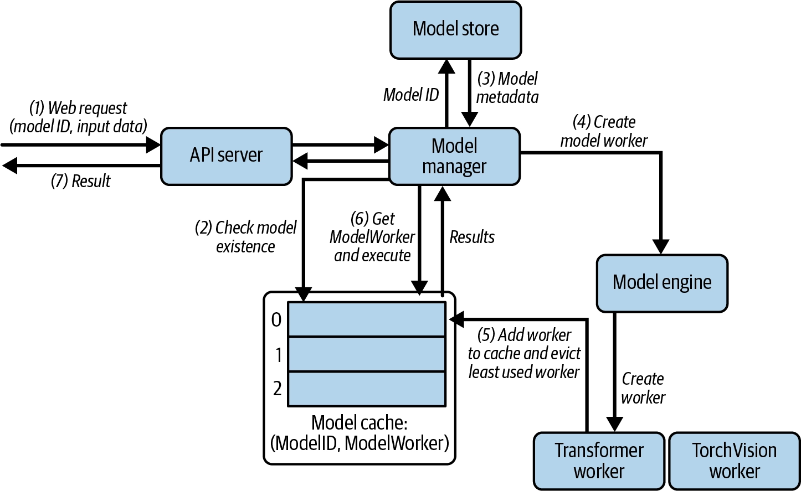

---
## CH3. Model Serving System Design: A Deep Dive

> 이 장의 목표는 특정 프레임워크(vLLM, Triton 등)을 바로 다루기보다, from scratch로 서빙 시스템을 직접 만들어보면서 원리를 체득한다.
> 
> 이러한 원리 파악을 바탕으로 추후 어떠한 서빙 프레임워크가 출시되더라도 상황에 맞게 합리적인 판단을 하기 위함이다.

---
### Build on Online LLM Serving Service from Scratch

---
#### Service Architecture


> 위 아키텍처는 기본적인 Single-model 서빙 시스템 아키텍처이다.

[구성 요소]

- API server : HTTP 요청/응답 처리 (배칭, 스트리밍 엔드포인트)
- LLM engine: 전체를 지휘하는 오케스트레이터, 마치 오케스트라 지휘자처럼 다른 컴포넌트들을 초기화하고 조율
- Workload manager: 요청 큐잉과 배치 구성 관리, 어떤 배칭 전략을 적용할지 결정하는 핵심 지점 ← "언제 어떤 요청들을 묶어서 배치로 보낼지"를 결정하는 스케줄링
- Model executor : 모델 워커 프로세스들을 초기화·관리하고, 프로세스 간 통신으로 추론을 트리거
- Model worker : 실제 모델 추론을 자신의 별도 프로세스에서 실행
- Model manager : 모델을 로드하고 캐싱

> [!info] 이해를 위해 K8S에 비유해보자
> |LLM 아키텍처|K8S|역할|
> |---|---|---|
> |**API Server**|**kube-apiserver**|외부 요청을 받아 내부 시스템으로 전달|
> |**Workload Manager**|**kube-scheduler**|처리할 작업을 선택하고 스케줄링|
> |**LLM Engine**|**kube-controller-manager**|전체 작업 흐름을 제어·조율|
> |**Model Executor**|**kubelet**|실제 Worker에게 작업 실행 지시|
> |**Model Worker**|**Container**|실제 workload를 실행하는 부분|


[요청 흐름]

```
Client → API server → LLM engine → Workload manager → Model executor → Model worker(별도 프로세스)
                                                                              ↓
Client ← API server ← LLM engine ← Workload manager ←──── 생성 결과 ────────────┘
```

1. API server가 HTTP 요청(생성 요청)을 받아 파싱
2. LLM engine(지휘자)이 이 요청을 받아 전체 흐름을 조율 — 시작 시점에 모델 로딩을 포함해 모든 컴포넌트를 초기화한 상태
3. Workload manager가 요청을 큐에 넣고, 현재 대기 중인 프롬프트들의 상태를 추적하다가 "다음 배치로 어떤 프롬프트들을 묶어서 보낼지" 결정 (여기가 배칭 전략이 들어가는 지점)
4. Model executor가 그 배치를 실제로 실행하도록 Model worker(별도 프로세스)에게 cross-process call로 전달
5. Model worker가 GPU에서 추론을 실행하고 결과를 반환
6. 결과가 다시 Model executor → LLM engine → API server를 거쳐 클라이언트로 전달 (배치/스트리밍 여부에 따라 반환 방식이 다름)



> [!tip] 중간에 Model worker에서 별도의 프로세스로 분리하는 이유
> - GPU가 필요없는 워크로드가 GPU가 필요한 워크로드와 같은 프로세스로 돌아가면 GPU가 필요한 작업이 다른 작업이 끝날 때까지 기다리게 됨
> - GPU는 비싸고, 유휴가 생길수록 손해
> - ex: 토크나이징, 전/후처리 같은 CPU 작업이 GPU와 같은 프로세스/스레드에서 돌면 GPU가 그 작업이 끝날 때까지 기다리게 됨

---
#### Single-model serving - 코드 구조

> 코드 : https://github.com/orca3/llm-model-inference/tree/main/ch03/single_model_llm_serving
> 
> 나는 도커 환경에서 진행하였다. (gpu : RTX 4080)

[코드 구조]

```
single_model_llm_serving/
├── main.py                  # FastAPI 앱 · 4개 엔드포인트 · LLMEngine 싱글턴
├── llm/
│   ├── __init__.py          # LLMEngine export
│   ├── llm.py               # LLMEngine: 오케스트레이션 + 스트리밍 처리 루프
│   ├── workload_manager.py  # Sequence, WorkloadManager: 큐잉/배칭/상태 추적
│   ├── model_executor.py    # ModelExecutor: 워커 프로세스 관리 + IPC 큐
│   ├── model_worker.py      # ModelWorker: 별도 프로세스에서 실제 추론
│   └── model_manager.py     # ModelManager: HF 모델/토크나이저 로딩
├── tests/
│   ├── test_api.py          # 엔드포인트 테스트
│   ├── test_vllm.py         # vLLM 경로 테스트
│   └── test_stream.sh       # SSE 수동 확인 스크립트
├── requirements.txt
├── pytest.ini
└── README.md
```

```dockerfile
# Dockerfile
FROM python:3.11-slim  
  
# vLLM 이 기동 시 Triton 으로 커널을 JIT 컴파일한다. 없으면 EngineCore 가 뜨지 않는다.  
RUN apt-get update && apt-get install -y --no-install-recommends gcc g++ \  
    && rm -rf /var/lib/apt/lists/*  
  
ENV PYTHONUNBUFFERED=1  
  
WORKDIR /opt/project  
  
COPY requirements.txt .  
RUN pip install --no-cache-dir -r requirements.txt  
  
# 가중치를 이미지에 미리 받아둔다. COPY 앞이라 소스만 고치면 이 레이어는 캐시된다.  
RUN python -c "\  
from transformers import AutoModelForCausalLM, AutoTokenizer; \  
AutoModelForCausalLM.from_pretrained('facebook/opt-125m'); \  
AutoTokenizer.from_pretrained('facebook/opt-125m')"  
  
COPY . .  
  
CMD ["python", "main.py"]
```

```yaml
# compose.yaml
services:  
  app:  
    build: .  
    gpus: all  
    # torch/vLLM 이 쓰는 공유 메모리. 도커 기본값 64MB 로는 부족하다.  
    shm_size: "2gb"  
    ports:  
      - "8000:8000"
```

> [!info] 코드 수정
> - CPU만 사용하면 문제가 없었지만, GPU를 사용하면 문제가 생겼습니다.
> - 코드가 모델을 CPU에 둔 채 입력만 GPU로 보내서  `/generate_stream`이 device 불일치로 추론이 진행되지 않았기 때문에, 모델도 같은 device로 옮기는 `self.model.to(self.device)` 한 줄을 추가했습니다.
> - 저는 상대적으로 GPU VRAM 넉넉하여(16GB) 위 한줄만 추가하는 것 이외에는 문제가 없었지만, 적은 환경에서는 문제가 생길 수 있습니다. 이에 다른 스터디원 분이 정리해주신 트러블 슈팅 가이드를 링크합니다. (https://ken-0913.github.io/myblog/posts/llm/llm-serving-single-model-lab/)

```python
# llm/model_worker.py
...
class ModelWorker:  
    def __init__(self, model_name: str):  
        self.device = "cuda" if torch.cuda.is_available() else "cpu"  
        logger.debug(f"Loading model {model_name} on device {self.device}")  
        self.model, self.tokenizer = ModelManager().load_model(model_name)
        # 추가한 코드  
        self.model.to(self.device)  
        # Initialize state for streaming  
        self.stream_states = {}  # request_id -> (input_ids, attention_mask, past_key_values)
...
```

```bash
docker compose up --build
```

---
#### 단일 요청 처리


> [!info] 단일 요청 처리
> 
> - 요청
>   
> ```
> POST /basic_generate
> {
> 	"prompt": "Hello, I am"
> }
> ```
> 
> - 응답
> 
> ```
> {
> 	"generated_text": "Hello I am a student in the UK and I am looking for a job. I am looking for a job that will allow me to work in a company that is not a big company. I am looking for a job that will allow me to work in a company"
> }
> ```

- 문제점 : Prompt 1 처리 완료 -> Prompt 2 처리 -> Prompt 3 처리
	- GPU가 한 번에 하나의 Prompt만 처리하므로 처리량이 낮다.

---
#### 단일 요청 처리 - 코드

> "request body에 ~이 들어와서 그걸 ~하고" 이런 기본적인 API 요청 흐름 설명은 생략하고, LLM 서빙에 관련된 코드만 설명하겠습니다.

```python
# main.py
@app.post("/basic_generate", response_model=GenerateResponse)  
async def basic_generate(request: GenerateRequest, llm: LLMEngine = Depends(get_llm)):  
    generated_text = llm.basic_generate(request.prompt)  
    return GenerateResponse(generated_text=generated_text)
```

- 먼저 `/basic_generate` 에 요청이 오면, `get_llm()`을 통해 `LLMEngine`을 주입받는다. (`Depends`는 FastAPI의 의존성 주입 문법)
- 아래에서 `get_llm()`이 무엇인지 보자.

```python
# main.py
def get_llm():  
    global _llm  
    with _llm_lock:  
        if _llm is None:  
            _llm = LLMEngine()  
            # Register cleanup  
            atexit.register(cleanup)  
        return _llm

def cleanup():  
    global _llm  
    if _llm is not None:  
        try:  
            _llm._cleanup()  
        except:  
            pass  
        _llm = None
```

- `get_llm()`은 `_llm`이 없다면, `LLMEngine()`을 통해서 '작업 전체를 조율하는' `LLMEngine` 객체를 초기화하는 코드이다.
- `_llm`은 전역으로 선언되어있다. 이에, 첫 요청이 들어올 때, 한번 초기화 되고, 이후 요청부터는 이 객체를 재사용한다. (싱글톤 패턴)
- 이후 `atexit.register(cleanup)` 코드를 통해 애플리케이션이 종료될 때, 이 `LLMEngine` 객체가 정리된다.
- 이제, 아래에서 `LLMEngine()`이 무엇인지 보자.

```python
# llm/llm.py
class LLMEngine:  
    def __init__(self):  
        self.model_executor = ModelExecutor()  
        self.workload_manager = WorkloadManager()  
        self.max_tokens = 20  
        # Initialize the model  
        self.model_executor.setup_worker("facebook/opt-125m")  
          
        # Initialize vLLM model  
        self.vllm_model = VLLM(model="facebook/opt-125m")  
          
        # Start processing loop in a separate thread  
        self.thread = threading.Thread(target=self.requests_processing_loop, daemon=True)  
        self.thread.start()  
          
        # Register cleanup  
        atexit.register(self._cleanup)
    
    # 이후 세부 코드는 생략
    ...
```

- 위에서 언급했던 Service Architecture의 각 요소들을 초기화합니다.
- `ModelExecutor()` : Model Executor 초기화
- `WorkloadManager()` : WorkloadManager 초기화
- <span class="t-red">(중요)</span> `self.model_executor.setup_worker("facebook/opt-125m")` 
	- 이 코드가 중요합니다. 이 코드를 이해하기 위해 아래에서 `setup_worker()` 가 어떤 메서드인지 보자.

```python
# llm/model_executor.py
class ModelExecutor:  
    def __init__(self):  
        self.task_queue = mp.Queue()  
        self.result_queue = mp.Queue()  
        self.worker_process = None  
        logger.debug("ModelExecutor initialized with queues")  
      
    def setup_worker(self, model_name: str):  
        logger.debug(f"Setting up worker with model: {model_name}")  
        self.worker_process = mp.Process(  
            target=ModelWorker.run,  
            args=(model_name, self.task_queue, self.result_queue)  
        )  
        logger.debug("Starting worker process")  
        self.worker_process.start()  
        logger.debug("Worker process started")
```

- 앞에 Service Architecture를 보면, 프로세스 2개 (왜 2개의 프로세스를 쓰는지는 앞에서 설명했다) 간 통신을 위해 Queue(task/result)를 사용하는 것을 볼 수 있다.
	- OS 기초) <span class="t-red">별도 프로세스인 API 서버(부모)와 model worker(자식) 프로세스가 서로 직접 함수를 호출할 수 없기 때문에, 프로세스 간 통신(IPC) 을 큐로 구현</span>
- `mp.Process(...)` : `ModelWorker.run()` 을 별도 프로세스로 실행
	- `ModelWorker.run()` 에 대해서는 아래에서 이어서.

```python
# llm/model_worker.py
class ModelWorker:  
    def __init__(self, model_name: str):  
        self.device = "cuda" if torch.cuda.is_available() else "cpu"  
        logger.debug(f"Loading model {model_name} on device {self.device}")  
        self.model, self.tokenizer = ModelManager().load_model(model_name)  
        self.model.to(self.device)  
        # Initialize state for streaming  
        self.stream_states = {}  # request_id -> (input_ids, attention_mask, past_key_values)
	
	...
	
	@staticmethod  
def run(model_name: str, task_queue: mp.Queue, result_queue: mp.Queue):  
    # Enable remote debugging  
    logger.debug("Waiting for debugger to attach...")  
    logger.debug("Debugger attached!")  
      
    worker = ModelWorker(model_name)  
    logger.debug("Worker initialized")  
      
    while True:  
        logger.debug("Waiting for batch from queue...")  
        batch_data = task_queue.get()  
        logger.debug(f"Received batch: {batch_data}")  
          
        if batch_data is None:  # Shutdown signal  
            logger.debug("Received shutdown signal")  
            break  
        batch, is_streaming = batch_data  
          
        if is_streaming:  
            # Handle streaming generation  
            result_queue.put(('stream', worker.generate_forward_batch(batch)))  
        else:  
            # Handle regular generation  
            result_queue.put(('complete', worker.generate(batch)))
```

- 위에서 `ModelWorker.run()`을 별도 프로세스로 실행하는 것을 보았다.
- `ModelManager().load_model(model_name)` : 그 프로세스 안에서 ModelManager가 HuggingFace에서 모델+토크나이저 로드
- `ModelWorker.run()`은 자식 프로세스에서 무한 while True 루프를 돌며 `task_queue.get()`으로 블로킹 대기 → 요청이 오면 처리 → result_queue.put()으로 결과 반환

---
#### 단일 요청 처리 - 요약

> [!info] 요약
> - 이전에 우리는 GPU를 효율적으로 사용하기 위헤서 프로세스를 분리해야한다는 것을 배웠다.
> - 이에 직접 가장 단순한 `/basic_generate` 엔드포인트를 호출해보았으며, 이것이 내부적으로 어떻게 동작하는지를 파악했다.
> 	- `LLMEngine` 로드 -> `ModelExecutor` 로드, `ModelWorker` 셋업 -> `ModelWorker`는 새로운 프로세스에서 While 루프를 돌며 요청을 처리
> 	- 다른 프로세스이기 때문에 `task_queue`와 `result_queue` 를 통해서 프롬프트와 모델 처리 결과를 교환

---
#### 배치 요청 처리


> [!info] 배치 요청 처리
> 
> - 요청
>   
> ```
> POST /generate
> {
> 	"prompts": [
> 		"Hello, I am",
> 		"The weather is",
> 		"I want to",
> 		"The best way to",
> 		"The most efficient way to"
> 	]
> }
> ```
> 
> - 응답
> 
> ```
> {
> 	"generated_texts": [
> 		"Hello, I am a student at the University of California, Berkeley. I am a graduate student in the Department of Psychology. I am a graduate student in the Department of Psychology. I am a graduate student in the Department of Psychology. I am a graduate student in the",
> 		"The weather is, of course, a factor in the weather.\n\nThe weather is a factor in the weather.\n\nThe weather is a factor in the weather.\n\nThe weather is a factor in the weather.\n\nThe weather is a factor",
> 		"I want toand I want to be a part of this.\nI want to be a part of this.\nI want to be a part of this.\nI want to be a part of this.\nI want to be a part of this.",
> 		"The best way to get a job is to get a job.                                         ",
> 		"The most efficient way to get a job is to get a job.                                         "
> 	]
> }
> ```

- 이를 통해 GPU 행렬 연산을 더 크게 만들고 자원 활용률을 높였다.

이러한 배치 처리를 하기 위해서는 2가지 과제를 해결해야한다.

1. 서로 다른 요청들의 프롬프트를 n 개의 배치로 합쳐서 LLM이 요청별이 아니라 큰 배치 단위로 프롬프트를 실행할 수 있게 해야한다.
2. 생성된 출력물을 원래 요청과 정확히 연결해 사용자에게 돌려줄 수 있어야 한다.

1번 코드단에서 어떻게 처리하는지 아래에서 보기로하고, 먼저 2번 과제를 어떻게 해결하는지는 다음과 같다.

**"각 Prompt를 `Sequence` 객체로 감싼다"**

```
Sequence
├─ 고유 ID
├─ Prompt
├─ 생성 결과
├─ 완료 여부
├─ 토큰 수
└─ Streaming Queue

# 예
A → seq-101
B → seq-102
C → seq-103
```

결과 또한 당연히 이 `Sequence` 객체에 들어온다.

이 구조가 중요한 이유는 <span class="t-red">웹 요청과 실제 GPU 실행 순서를 분리</span>할 수 있기 때문이다.
덕분에, Dynamic Batching, Priority Scheduling, Continuous Batching 같은 최적화를 적용할 수 있다.

---
#### 배치 요청 처리 - 코드

> `main.py`의 `/generate` 컨트롤러 부분은 이전 단일 요청 처리와 크게 다르지 않아서 생략하겠습니다.

```python
# llm/llm.py
class LLMEngine:
	...
	def generate(self, prompts: List[str]) -> List[str]:  
	    # Add all requests to workload manager  
	    request_ids = []  
	    for prompt in prompts:  
	        request_id = self.workload_manager.add_request(prompt)  
	        request_ids.append(request_id)  
	      
	    # Process requests in batches (from LoadManager) until all prompts of the request are finished  
	    while not self._is_batch_finished(request_ids):  
	        # Get next batch of requests  
	        sequences = self.workload_manager.get_next_batch()  
	        if not sequences:  
	            time.sleep(0.1)  
	            continue  
	            # Execute the next batch in one go, it may not be the same prompts as the prompts in the request.  
	        results = self.model_executor.execute_batch(sequences)  
	      
	        # Update results in workload manager  
	        for result in results[1]:  
	            self.workload_manager.remove_active_sequence(result['request_id'])  
	            self.workload_manager.update_sequence_output(result['request_id'], result['generated_text'], is_finished=True)  
	  
	    # Remove finished sequences from workload manager  
	    generated_texts = []  
	    for request_id in request_ids:  
	        generated_texts.append(self.workload_manager.get_sequence(request_id).output[0])  
	        self.workload_manager.remove_finished_sequence(request_id)  
	  
	    return generated_texts
```

> 여기서 호출하는 함수들의 구현은 아래 코드들에서 확인한다.

- `self.workload_manager.add_request(prompt)`
	- uuid로 요청 ID를 발급하고 Sequence를 만들어 incoming_queue(FIFO)에 넣고, 동시에 sequence_map이라는 딕셔너리(id → Sequence)에도 등록합니다. 이 맵이 나중에 ‘ID로 결과 찾기의 핵심이다.
- `self.workload_manager.get_next_batch()`
	- active_sequences가 batch_size(4개) 미만이고 대기 큐에 남은 게 있으면 큐에서 꺼내 채운다.
	- 즉, 현재 우리가 실행하는 코드의 워크로드 매니저의 스케줄링 전략은 FIFO + 배치 크기 유지 밖에 없다.
- `self.workload_manager.update_sequence_output(result['request_id'])`
	- 결과를 `WorkloadManager`에 기록하고 완료 처리
- `self.workload_manager.remove_finished_sequence(request_id)`
	- 처음 넣었던 요청들의 결과를 순서대로 꺼내고, 관리 목록에서 제거한 뒤 반환.

```python
# llm/workload_manager.py
class WorkloadManager:
	...
	def add_request(self, prompt: str) -> str:  
	    request_id = str(uuid.uuid4())  
	    sequence = Sequence(request_id, prompt, None, None)  
	    self.incoming_queue.put(sequence)  
	    self.sequence_map[request_id] = sequence  
	    return request_id
	...
	def get_next_batch(self, is_streaming: bool = False) -> List[Sequence]:  
	    if is_streaming:  
	        while len(self.active_streaming_sequences) < self.batch_size and not self.incoming_streaming_queue.empty():  
	            sequence = self.incoming_streaming_queue.get()  
	            self.active_streaming_sequences.append(sequence)  
	      
	        return self.active_streaming_sequences  
	    else:  
	        while len(self.active_sequences) < self.batch_size and not self.incoming_queue.empty():  
	            sequence = self.incoming_queue.get()  
	            self.active_sequences.append(sequence)  
	              
	        return self.active_sequences
	...
	def update_sequence_output(self, seq_id: str, token: str, is_finished: bool = False):  
	    if seq_id in self.sequence_map:  
	        sequence = self.sequence_map[seq_id]  
	        sequence.output.append(token)  
	        sequence.prompt += token  
	        sequence.token_count += 1  
	        sequence.finished = is_finished  
	        return sequence  
	    return None
	...
	def remove_finished_sequence(self, seq_id: str):  
	    if seq_id in self.sequence_map:  
	        sequence = self.sequence_map[seq_id]  
	        if sequence in self.active_sequences:  
	            self.active_sequences.remove(sequence)  
	        if sequence in self.active_streaming_sequences:  
	            self.active_streaming_sequences.remove(sequence)  
	        del self.sequence_map[seq_id]
```

```python
# llm/model_executor.py
class ModelExecutor:
	...
	def execute_batch(self, prompts: List[Dict[str, Any]]) -> List[Dict[str, Any]]:  
	    if not prompts:  
	        logger.debug("Empty batch received")  
	        return []  
	      
	    logger.debug(f"Sending batch to worker: {prompts}")  
	    # Send batch to worker  
	    self.task_queue.put((prompts, False))  
	      
	    # Get results  
	    logger.debug("Waiting for results from worker")  
	    results = self.result_queue.get()  
	    logger.debug(f"Received results from worker: {results}")  
	    return results
```

----
#### 배치 요청 처리 - 요약

> [!info] 요약
> - 이전의 단일 요청 처리의 경우, 요청을 순차적으로 처리하여 자원을 효율적으로 사용할 수 없었다.
> - 이에, 배치 처리를 통해 효율을 개선하였다.
> - 배치처리를 위해 `WorkloadManager`가 batch를 구성하였다. (FIFO + 배치 크기 유지)
> - 배치처리를 위해 `Sequence`라는 Wrapper 객체를 도입하였다.

> [!tip] 배치 처리량 최적화
> - <span class="t-red">처리량과 개별 사용자 지연시간 사이에서 균형</span>을 찾아야 한다.
> - Batching 최적화에서 중요한 것은 batch size만 크게 만드는 것이 아니다.
> - throughput은 좋아질 수 있지만, 각 request의 queue time과 latency가 늘어날 수 있다.
> - Production에서는 max batch size, max batched tokens, timeout, request priority를 함께 봐야 한다.
> - 실제로 배치 크기와 배칭 전략은 추론 처리량에 큰 영향을 미친다.
> - 적절한 배치 구성을 선택하려면 세심한 조정이 필요하며, 이 단순화된 예시보다 훨씬 복잡하다.
> - 이 설정들은 특정 LLM 모델, 프롬프트 특성, 웹 트래픽의 성격, 그리고 모델이 실행되는 하드웨어에 따라 자주 조정되어야 한다.

> [!warning] 트레이드 오프
> - `execute_batch` 메서드는 <span class="t-red">동기</span> 메서드이다.
> 	- `task_queue.put()` 이후 `result_queue.get()`으로 블로킹 대기한다. 즉, 워커 프로세스가 배치를 다 처리할 때까지 이 스레드가 멈춘다.
> - <span class="t-red">다른 요청과 섞임</span>
> 	- `get_next_batch()`가 반환하는 배치는 "내가 요청한 프롬프트들"이 아니라 큐에 쌓인 아무 프롬프트 4개이다.
> 	- 그래서 내 프롬프트 2개가 다른 유저 요청과 같은 배치에 섞여 처리될 수 있다.
> 	- 이게 배치 처리의 핵심(자원 공유)이자, 지연시간이 요청마다 들쭉날쭉해지는 이유(레이턴시 vs 처리량 트레이드오프)이다.
> - FIFO + 고정 배치 크기라 최적은 아님
> 	- 4장/6장/7장에서 다룰 continuous batching, dynamic scheduling으로 개선되는 지점입니다.

---
#### 스트리밍 배치 요청 처리


> [!info] 배치 요청 처리
> 
> - 요청
>   
> ```
> POST /generate_stream
> {
> 	"prompts": "Hello, I am"
> }
> ```
> 
> - 응답
> 
> ```
> {
> 	data: {"token": " a", "sequence_id": "97ebad71-94ce-4c77-908d-e3fd3363bcd3"}
> 	
> 	data: {"token": " student", "sequence_id": "97ebad71-94ce-4c77-908d-e3fd3363bcd3"}
> 	
> 	data: {"token": " in", "sequence_id": "97ebad71-94ce-4c77-908d-e3fd3363bcd3"}
> 	
> 	...
> 	
> 	data: {"token": " games", "sequence_id": "97ebad71-94ce-4c77-908d-e3fd3363bcd3"}
> }
> ```

- 스트리밍이 왜 필요한지는 이전에 주차에 배웠다. ([왜 Streaming?](./05-llm-serving-study-week1.md#llm-streaming-serving))
	- 모델 전체 계산 시간을 줄이는 것은 아니다.
	- 하지만, 첫 토큰부터 바로 보여주기 때문에, 체감 지연시간이 크게 줄어든다.
- `/generate`와 달리, input으로 단일 prompt만 들어가지만, 내부적으로 다른 유저의 prompt들과 섞여 배치처리가 된다.
- GPU에서는 Batch 단위로 계산하지만, 결과는 Sequence ID를 이용해 각 요청의 Queue로 분배한다.
	- 이 Queue는 각 요청의 Queue(`asyncio.Queue`)이며, `Sequence`와 함께 보관된다. (비스트리밍은 이 자리가 `None`)
- 앞서 배치처리의 트레이드 오프 중 블로킹된다는 단점이 있었다. 반면, 스트리밍 배치 처리의 경우에는 한 스텝에 토큰 1개씩만 생성하고, 즉시 클라이언트에 흘려보낸다. 이에 이 단점이 해결된다.
- 이러한 과정은 Continuous Batching 처리를 하며, 이는 더 효율적인 처리를 돕는다. (모든 배치 작업이 끝날 때 까지 기다리는 것이 아니라, 빈자리 생기면 바로 채워줌)

---
#### 스트리밍 배치 요청 처리 - 코드

```python
# llm/llm.py
class LLMEngine:
	...
	self.thread = threading.Thread(target=self.requests_processing_loop, daemon=True)  
	self.thread.start()
	...
	def requests_processing_loop(self):  
    """Process requests in a loop."""  
    while True:  
        try:  
            active_sequences = self.workload_manager.get_next_batch(is_streaming=True)  
            if not active_sequences:  
                time.sleep(0.1)  
                continue  
                # Process batch through model, forward pass.  
            prompts = [{'prompt': seq.prompt, 'request_id': seq.id} for seq in active_sequences]  
            prompts_results = self.model_executor.execute_forward_batch(prompts)  
              
            # Stream tokens back to respective clients  
            for result in prompts_results:  
                seq = self.workload_manager.get_sequence(result['request_id'])  
                if result['is_finished'] or seq.token_count > self.max_tokens:  
                    # Use run_coroutine_threadsafe to safely put None in the main loop's queue  
                    asyncio.run_coroutine_threadsafe(  
                        seq.client_stream.put(None),  
                        seq.loop  
                    )  
                    seq.finished = True  
                    self.workload_manager.remove_finished_sequence(result['request_id'])  
                else:  
                    # Use run_coroutine_threadsafe to safely put data in the main loop's queue  
                    asyncio.run_coroutine_threadsafe(  
                        seq.client_stream.put(  
                            json.dumps({"token": result['token'], "sequence_id": result['request_id']})  
                        ),  
                        seq.loop  
                    )  
                    self.workload_manager.update_sequence_output(result['request_id'], result['token'])  
              
        except Exception as e:  
            print(f"Error in processing loop: {e}")  
            time.sleep(0.1)
```

- `threading.Thread(target=self.requests_processing_loop, daemon=True)`
	- `/generate_stream` 경로의 컨트롤러가 `event_generator()` 만 호출하고 해당 메서드는 그냥 계속 스트리밍 요청을 넣기만 하는데, 응답 스트리밍이 생성되는 이유는 위 코드 때문이다.
	- `LLMEngine`이 처음에 초기화될 때부터 이미 `requests_proceessing_loop` 이 돌고 있으며, `event_generator` 가 `add_streaming_request`를 하면 이 요청을 처리하고, `await queue.get()`으로 응답을 받는 것이다.
- `workload_manager.get_next_batch`
	- 이전에 배치에서 했던 것 처럼 배치 사이즈만큼 배치를 채우는 함수
- `model_executor.execute_forward_batch`
	- 현재 배치를 모델 worker 프로세스에 넘기고(`task_queue`에 넣는) 결과를 받는(`result_queue`에서 받는) 함수
- 이후부터는, 결과의 `request_id`를 보고 원래 `Sequence`를 찾아 해당 클라이언트의 Queue에 token을 전달하는 과정이다.

```python
# main.py
@app.post("/generate_stream")  
async def generate_stream(request: GenerateRequest, llm: LLMEngine = Depends(get_llm)):  
    async def event_generator():  
        loop = asyncio.get_event_loop()  
        async for token in llm.event_generator(loop, request.prompt):  
            # token = 'data: {"token": " a", "sequence_id": "8310f5e1-6f6f-480e-b2f9-c8144a12cc17"}\n\n'  
            yield token  
      
    return StreamingResponse(  
        event_generator(),  
        media_type="text/event-stream"  
    )
```

- `async`로 비동기

```python
# llm/llm.py
class LLMEngine:
	...
	async def event_generator(self, loop, prompt: str):  
	      
	    asyncio.set_event_loop(loop)  
	    # Create a queue for this client's stream  
	    queue = asyncio.Queue()  
	      
	    # Add streaming request to workload manager with the queue  
	    seq_id = self.workload_manager.add_streaming_request(prompt, queue, loop)  
	      
	    print(f"Created queue for sequence {seq_id} in loop {id(loop)} and queue {id(queue._get_loop())}")  # Debug print  
	    try:  
	        while True:  
	            print(f"Waiting for data in queue for sequence {seq_id}")  # Debug print  
	            # Get next token from queue            
	            data = await queue.get()  
	            print(f"Received data in queue for sequence {seq_id}: {data}")  # Debug print  
	            if data is None:  # End of stream  
	                print(f"End of stream for sequence {seq_id}")  # Debug print  
	                break  
	            yield f"data: {data}\n\n"  
	    except Exception as e:  
	        print(f"Error in stream for sequence {seq_id}: {e}")  
	    finally:  
	        # Clean up  
	        self.workload_manager.remove_finished_sequence(seq_id)  
	        print(f"Cleaned up sequence {seq_id}")  # Debug print
```

- `requests_processing_loop` 에 이벤트를 넣고(`add_streaming_request`), 결과를 받는다(`data = await queue.get()`).

---
#### 스트리밍 배치 요청 처리 - 요약

> [!info] 요약
> - 이제 **generation** **API**가 **비동기**로 전환되어, **토큰이 생성되는 즉시 사용자가 업데이트**를 **받을 수** 있다.
> - **ModelWorker**는 전체 출력을 한 번에 생성하는 대신, **추론 단계마다 하나의 토큰을 생성**한다.
> - **WorkloadManager는 부분 출력을 추적**하고, 각 프롬프트를 **실시간으로 새로 생성된 토큰으로 업데이트**한다.
> - **각 프롬프트는 자체 이벤트 큐**를 가지게 되어, **LLMEngine이 ModelWorker에서 비동기 API 계층**으로 토큰을 효율적으로 **전달**할 수 있다.
> - LLMEngine은 프롬프트 전반에 걸쳐 **토큰 단위 추론을 조율하는 전용 배치 처리 스레드**를 포함하고 있다.

---
#### vLLM 배치 서빙



> [!info] 배치 요청 처리
> 
> - 요청
>   
> ```
> POST /generate
> {
> 	"prompts": [
> 		"Hello, I am",
> 		"The weather is",
> 		"I want to",
> 		"The best way to",
> 		"The most efficient way to"
> 	]
> }
> ```
> 
> - 응답
> 
> ```
> {
> 	"generated_texts": [
> 		" a fan of the videos! What did you do?\nI did a few edits, I just",
> 		" so frigid I've been thinking of making a tent.\nI love that idea. I'd",
> 		" know the actual story behind this. I know this will be posted in the near future, but I",
> 		" get a pen is to get a pen that is a good quality one.  I got one for",
> 		" kill the virus is to stay home.\nThe best way to kill the virus is to stay home"
> 	]
> }
> ```

- 직접 구현한 batching/streaming logic은 학습에는 좋지만 production에서는 복잡도가 높다.
- vLLM은 batching, scheduling, KV cache 관리 등을 내부에서 처리한다.

| |수동 구현 (generate, event_generator)|vLLM 구현 (generate_vllm)|
|---|---|---|
|배치 구성|WorkloadManager.get_next_batch() : FIFO + 고정 batch_size=4|vLLM 내부 스케줄러 (**continuous batching**)|
|토큰 생성|ModelWorker가 별도 프로세스에서 한 스텝씩 forward (use_cache=False로 매번 전체 재계산 , O(n²) 비효율)|vLLM의 PagedAttention + KV 캐시로 최적화|
|결과 매핑|sequence_map, request_id 수동 추적|vLLM LLM.generate()가 입력 순서 그대로 outputs 반환|
|스트리밍|client_stream(asyncio.Queue) + 백그라운드 스레드 직접 구현|vLLM이 내부적으로 처리(별도 API 필요)|
|코드량|workload_manager.py(90줄) + model_executor.py(72줄) + model_worker.py(141줄)|llm.py:151-174, 약 20줄|

---
#### vLLM 배치 서빙 - 코드, 요약

```python
# llm/llm.py
class LLMEngine:
	...
	def generate_vllm(self, prompts: List[str]) -> List[str]:  
	    """  
	    Generate text using vLLM for multiple prompts.        Args:  
	        prompts: List of prompts to generate text for            Returns:  
	        List of generated texts    """    # Configure sampling parameters  
	    sampling_params = SamplingParams(  
	        temperature=0.7,  
	        top_p=0.95,  
	        max_tokens=self.max_tokens  
	    )  
	      
	    # Generate text for all prompts  
	    outputs = self.vllm_model.generate(prompts, sampling_params)  
	      
	    # Extract generated text from outputs  
	    generated_texts = [output.outputs[0].text for output in outputs]  
	      
	    return generated_texts
```

- 단 10줄의 코드로 배치 추론을 활성화할 수 있다.
- 이 때문에 이러한 서비스 프레임워크가 모델 서비스 구현에서 매우 널리 사용된다.
- 또한, 서빙 프레임워크는 독립 실행형 웹 서버로 실행될 수 있다. (Without FastAPI)
	- 선택은 2가지다.
	- 프레임워크를 커스텀 서빙 애플리케이션 내에 라이브러리 형태로 임베드해 긴밀한 통합과 실행 흐름에 대한 높은 제어를 가능하게 하거나
	- 독립적인 웹 서버로 실행해 외부 클라이언트나 다른 서비스가 호출할 수 있는 REST 또는 스트리밍 API를 제공하거나
	- 실제 환경에서는 서빙 프레임워크를 독립적인 웹 서버 모드로 실행하는 경우가 많다.

> [!info] 그럼 왜 위와같은 과정을 공부했는가?
> - 내부 원리를 알아야 다음 설정을 올바르게 튜닝할 수 있다.
 >    - _최대 동시 Sequence 수_
 >    - _Batch Token 수_
 >    - _GPU Memory Utilization_
 >    - _KV Cache 크기_
 >    - _Chunked Prefill_
 >    - _Scheduling 정책_

---
### A General Design for Single-Model LLM Serving

---
#### Single-Model Serving 요구사항

- **Low Latency**: 빠른 추론 및 응답
    - 스트리밍을 통해 **체감 지연(TTFT)** 감소
- **High Throughput**: 많은 요청을 동시에 처리
    - **Batching**으로 여러 요청을 한 번에 추론해 GPU 활용률 향상
- **Scalability**: 트래픽에 따라 확장
    - 멀티 프로세스·멀티 GPU·멀티 노드 기반 **수평 확장** 필요
- **Reliability & Availability**: 장애 상황에서도 안정적인 서비스 제공
- **Resource Efficiency**: GPU/CPU/메모리를 효율적으로 사용해 비용 절감
    - 모델 크기뿐 아니라 **메모리 할당 및 서빙 설정 튜닝**이 중요
- **Observability**: Latency, Throughput, Error Rate 등을 모니터링해 병목 및 SLO 관리

추가적으로,

- **Large Model & Memory**: 거대한 모델을 GPU 메모리에 효율적으로 배치
- **KV Cache Management**: 디코딩 과정의 KV Cache를 효율적으로 관리
- **Streaming**: 생성되는 토큰을 즉시 클라이언트에 전달
- **Variable-length Batching**: 입력·출력 길이가 서로 다른 요청을 **동적으로 스케줄링/배칭**

> **전통적인 모델 서빙은 모델을 비교적 블랙박스로 취급할 수 있지만(비교적 안정적이기 때문), LLM 서빙은 모델의 구조와 추론 특성을 이해하는 Model-aware Serving이 필요하다.**

특히 **KV Cache, Attention 구조, Context Length, 요청별 출력 길이** 등에 따라 최적의 서빙 전략이 달라진다.

따라서 LLM Serving 시스템은 **모델별로 변하는 영역과 안정적인 서빙 인프라를 분리**하여, 새로운 모델이나 아키텍처가 등장해도 유연하게 대응할 수 있도록 설계하는 것이 중요하다.

---
#### General Design

핵심은 **서빙 시스템의 관심사를 3개 영역으로 분리**하는 것이다.

|영역|역할|주요 관심사|
|---|---|---|
|**A. Infrastructure Management**|서비스 인프라 관리|스케일링, 가용성, 장애 복구, 리소스 할당, 모니터링|
|**B. Serving Frontend**|비즈니스 로직 처리|인증/인가, 요청 처리, 배칭, Rate Limit, 외부 시스템 연동|
|**C. Serving Backend**|실제 모델 추론|저지연·고처리량 추론, KV Cache, Continuous Batching, GPU 최적화|

<span class="t-blue">A. Infrastructure Management</span>

- 모델 서비스를 **Container/Pod 같은 재현 가능한 단위**로 실행
- Kubernetes/Cloud 등에 인프라 관리를 위임
- **Replica 수평 확장/축소**
- Health Check 및 장애 인스턴스 재시작
- CPU/GPU/Memory 리소스 할당
- Logging/Monitoring
- 사용자는 개별 인스턴스가 아닌 **Load Balancer를 통해 접근**

→ **서비스 코드가 스케일링이나 장애 복구 같은 인프라 문제를 직접 처리하지 않도록 분리**

<span class="t-blue">B. Serving Frontend</span>

클라이언트와 모델 추론 엔진 사이의 **중간 계층**이다.

- 인증/인가
- 요청 검증 및 정규화
- 요청 배칭
- Rate Limiting
- 모델 설정 및 Runtime Context 관리
- 로깅
- 사용자 데이터, 결제, 감사 로그 등 **외부 시스템 연동**

→ 쉽게 말하면 **일반적인 백엔드 애플리케이션 영역**

<span class="t-blue">C. Serving Backend</span>

실제 **LLM 추론만 담당하는 고성능 엔진**이다.

보통 Frontend와 **별도 프로세스**로 실행하며 외부에서 직접 접근하지 않는다.

대표적으로 **vLLM, Triton** 같은 Serving Framework를 사용한다.

- GPU 기반 고성능 추론
- KV Cache 관리
- Continuous Batching
- 가변 길이 요청 스케줄링
- Quantization
- GPU 메모리/연산 최적화

→ **비즈니스 로직과 모델 성능 최적화를 분리**

---
### Build a Multi-Model Serving Service from Scratch

---
#### 멀티 모델 서빙이 필요한 이유

단일 모델 서빙은 **트래픽이 예측 가능하고 모델별 전용 자원이 충분한 환경**에서는 단순하고 효과적이다. 하지만 실제 서비스에서는 LLM, 임베딩, 이미지 분류 등 <span class="t-red">여러 모델을 동시에 제공해야 할 수 있다.</span>

모델마다 서버/GPU를 따로 할당하면 모델별 트래픽 편차 때문에 다음과 같은 문제가 발생한다.

```
Model A 서버 → 사용률 10%
Model B 서버 → 사용률 20%
Model C 서버 → 사용률 5%
Model D 서버 → 사용률 80%
```

즉, <span class="t-red">어떤 자원은 놀고 있는데 다른 자원은 과부하</span>가 걸린다. 따라서 여러 모델이 **하나의 공유 인프라를 함께 사용**하고, 요청에 따라 적절한 모델로 동적으로 라우팅하는 <span class="t-red">멀티 모델 서빙(Multi-Model Serving)이 필요</span>하다.

이번에는 **LLM 2개 + 이미지 분류 모델 1개**, 총 3개 모델을 하나의 서비스에서 CPU로 서빙한다.

핵심적으로 다음 3가지를 학습한다.

|목표|핵심 내용|
|---|---|
|**Cross-framework support**|Transformers, PyTorch/TorchVision, ONNX 등 서로 다른 프레임워크와 모델 유형을 하나의 시스템에서 지원|
|**Unified API interface**|모델 종류와 관계없이 `/predict` 같은 하나의 API로 요청하고 `model_id`를 통해 대상 모델 선택|
|**Resource management**|필요한 모델만 **Lazy Loading**하고 메모리가 부족하면 **LRU 방식으로 오래 사용하지 않은 모델을 제거**|

---
#### Service Architecture



[구성 요소]

- **API Server** : HTTP 요청/응답 처리 및 요청을 Model Manager로 전달
- **Model Manager** : **중심 컴포넌트**. 모델 캐시와 Model Worker의 생명주기를 관리
    - 캐시에 모델이 없으면 새로운 Worker 생성 요청
    - 캐시가 가득 차면 LRU 등의 정책으로 오래 사용하지 않은 Worker 제거
- **Model Store** : 모델 ID, 모델 종류 등 **모델 메타데이터를 저장·조회**
- **Model Engine** : Model Store의 메타데이터를 기반으로 **실제 Model Worker 인스턴스를 생성**
- **Model Worker** : 모델을 메모리에 로드하고 **실제 추론을 수행**
    - 예: `TransformerWorker`, `TorchVisionWorker`
- **Model Cache** : `(Model ID, Model Worker)` 형태로 현재 생성된 Worker를 캐싱

> **핵심:** `Model Manager`가 **어떤 모델을 유지/생성/제거할지 결정**하고, `Model Engine`이 **실제 Worker를 생성**하며, `Model Worker`가 **실제 추론을 수행**하는 구조.

---
#### Multi-model serving - 코드 구조

> 코드 : https://github.com/orca3/llm-model-inference/tree/main/ch03/multi_model_serving

[코드 구조]

```
multi_model_serving/
├── app            # 아래 핵심 로직
│   ├── engine.py  # Model worker factory and management
│   ├── manager.py # Model caching and lifecycle
│   ├── server.py  # FastAPI server and endpoints
│   ├── store.py   # Model metadata management
│   └── worker.py  # Abstract worker and framework-specific implementations
├── config
│   └── models.json # Model configurations , 모델 4개 메타데이터
├── model_dir
│   └── densenet_onnx
│       ├── 1
│       │   └── model.onnx
│       ├── config.pbtxt
│       └── densenet_labels.txt
├── README.md
├── requirements.txt
└── tests
    ├── images
    │   └── cat1.jpg
    ├── __init__.py
    ├── test_models.py
    └── test_triton_densenet.py
```

```Dockerfile
# Dockerfile
FROM python:3.11-slim  
  
ENV PYTHONUNBUFFERED=1  
  
WORKDIR /opt/project  
  
COPY requirements.txt .  
  
RUN pip install --no-cache-dir -r requirements.txt  
  
# 가중치를 이미지에 미리 받아둔다. COPY 앞이라 소스만 고치면 이 레이어는 캐시된다.  
# Triton 모델(densenet_onnx)은 model_dir 볼륨으로 붙으므로 여기서 받지 않는다.  
RUN python -c "\  
from transformers import AutoModelForSequenceClassification, AutoTokenizer; \  
from torchvision.models import mobilenet_v2, MobileNet_V2_Weights; \  
AutoModelForSequenceClassification.from_pretrained('distilbert-base-uncased-finetuned-sst-2-english'); \  
AutoTokenizer.from_pretrained('distilbert-base-uncased-finetuned-sst-2-english'); \  
AutoModelForSequenceClassification.from_pretrained('mrm8488/bert-tiny-finetuned-sms-spam-detection'); \  
AutoTokenizer.from_pretrained('mrm8488/bert-tiny-finetuned-sms-spam-detection'); \  
mobilenet_v2(weights=MobileNet_V2_Weights.DEFAULT)"  
  
COPY . .  
  
CMD ["python", "-m", "app.server"]
```

```yaml
# compose.yaml
services:  
  app:  
    build: .  
    gpus: all  
    # torch 가 쓰는 공유 메모리. 도커 기본값 64MB 로는 부족하다.  
    shm_size: "2gb"  
    ports:  
      - "8001:8001"  
    environment:  
      # 컨테이너 안에서는 localhost 가 아니라 서비스 이름으로 Triton 을 찾는다.  
      TRITON_URL: "triton:8000"  
    depends_on:  
      triton:  
        condition: service_healthy  
  
  triton:  
    image: nvcr.io/nvidia/tritonserver:24.12-py3  
    gpus: all  
    shm_size: "2gb"  
    # explicit 모드라 기동 시엔 아무 모델도 안 올라간다. TritonWorker 가 API 로 로드한다.  
    command: tritonserver --model-repository=/models --model-control-mode=explicit  
    volumes:  
      - ./model_dir:/models:ro  
    ports:  
      - "8009:8000"  
    healthcheck:  
      test: ["CMD", "curl", "-f", "http://localhost:8000/v2/health/ready"]  
      interval: 5s  
      retries: 20
```

> 아래는 Single 모델 처럼 GPU를 쓰기 위한 설정

```python
# app/worker.py
class ModelWorker(ABC):  
    def __init__(self, model_metadata):  
        self.model_metadata = model_metadata  
        self.model: Optional[torch.nn.Module] = None  
        # 아래 1줄 추가 
        self.device = "cuda" if torch.cuda.is_available() else "cpu"  
        self._load_model()

...

class TransformerWorker(ModelWorker):
	...
	def _load_model(self):  
	    if self.model is None:  # Only load if not already loaded  
			self.model = AutoModelForSequenceClassification.from_pretrained(self.model_metadata.name)
			# 아래 2줄 추가  
			self.model.to(self.device)  
			self.model.eval()  
			self.tokenizer = AutoTokenizer.from_pretrained(self.model_metadata.name)
	
	def predict(self, input_data: Any) -> Dict[str, Any]:  
	    if self.model is None or self.tokenizer is None:  
	        raise RuntimeError("Model or tokenizer not initialized")  
		# 기존 코드에서 .to(self.device) 추가
	    inputs = self.tokenizer(input_data, return_tensors="pt", padding=True, truncation=True).to(self.device)  
	    with torch.no_grad():  
	        outputs = self.model(**inputs)  
	    predictions = torch.softmax(outputs.logits, dim=-1)  
	    # 응답은 JSON 이라 CPU 로 내려서 직렬화한다.  
	    return {"predictions": predictions.cpu().tolist()}

...

class TorchVisionWorker(ModelWorker):
	...
	def _load_model(self):  
    if self.model is None:  # Only load if not already loaded  
        self.model = mobilenet_v2(weights=MobileNet_V2_Weights.DEFAULT)  
        # 아래 1줄 추가
        self.model.to(self.device)  
        self.model.eval()  
        self.transform = transforms.Compose([  
            transforms.Resize(256),  
            transforms.CenterCrop(224),  
            transforms.ToTensor(),  
            transforms.Normalize(mean=[0.485, 0.456, 0.406], std=[0.229, 0.224, 0.225])  
        ])
    
    def predict(self, input_data: Any) -> Dict[str, Any]:  
	    if self.model is None or self.transform is None:  
	        raise RuntimeError("Model or transform not initialized")  
	    if isinstance(input_data, str):  
	        image = Image.open(input_data).convert('RGB')  
	    else:  
	        image = input_data  
	    # 기존 코드에서 .to(self.device) 추가
	    image_tensor = self.transform(image).unsqueeze(0).to(self.device)  
	    with torch.no_grad():  
	        outputs = self.model(image_tensor)  
	    predictions = torch.softmax(outputs, dim=1)
	    # 응답은 JSON 이라 CPU 로 내려서 직렬화한다.   
	    return {"predictions": predictions.cpu().tolist()}

...

class TritonWorker(ModelWorker):
	def __init__(self, model_metadata):  
	    # 아래 코드로 변경 
	    self.triton_url = os.getenv("TRITON_URL", "0.0.0.0:8009")  
	    self.client = httpclient.InferenceServerClient(url=self.triton_url)  
	    super().__init__(model_metadata)
```

```python
# tests/test_triton_densenet.py
class TestTritonDenseNet(unittest.TestCase):  
    def setUp(self):  
	    # 아래처럼 수정
        self.triton_url = os.getenv("TRITON_URL", "0.0.0.0:8009")
```

---
#### 코드 뜯어보기

먼저 요청이 들어오는 API 서버 부터

```python
# app/server.py
@app.post("/predict")  
async def predict(request: PredictionRequest):  
    # Get model worker  
    worker = model_manager.get_model_worker(request.model_id)  
    if not worker:  
        raise HTTPException(status_code=404, detail=f"Model {request.model_id} not found")  
      
    # Make prediction  
    try:  
        result = worker.predict(request.input_data)  
        return result  
    except Exception as e:  
        raise HTTPException(status_code=500, detail=str(e))  
  
@app.get("/models")  
async def list_models():  
    return {  
        "available_models": model_store.list_models(),  
        "loaded_models": model_manager.list_loaded_models()  
    }
```

- `/models`는 어떤 모델들이 있는지 조회하고, 해당 모델들의 정보를 조회하는 API
	- 우선 아래 `manager.py` 에서 모델 조회를 어떻게 처리하는지 보자.
- `/predict` 모델을 지정하고, 해당 모델에 대한 추론을 진행하는 API

```python
# app/manager.py
class ModelManager:  
    def __init__(self, model_store: ModelStore, max_models: int = 2):  
        self.model_store = model_store  
        self.max_models = max_models  
        self.model_cache = OrderedDict()  # OrderedDict to track least recently used, id -> worker  
        self.model_engine = ModelEngine()  
      
    def get_model_worker(self, model_id: str) -> Optional[ModelWorker]:  
        # Check if model is in cache  
        if model_id in self.model_cache:  
            # Move to end (most recently used)  
            self.model_cache.move_to_end(model_id)  
            return self.model_engine.get_worker(model_id)  
          
        # Get model metadata  
        model_metadata = self.model_store.get_model(model_id)  
        if not model_metadata:  
            return None  
        # Check if we need to remove least used model  
        if len(self.model_cache) >= self.max_models:  
            # Remove least recently used model  
            id, model_worker = self.model_cache.popitem(last=False)  
            self.model_engine.delete_worker(id)  
              
        # Download model if not already downloaded  
        # Skip the downlaod implementation for simplicity        # if not self.model_store.model_exists(model_id):        #     self.model_store.download_model(model_id)                # Create and cache new model worker  
        self.model_cache[model_id] = self.model_engine.create_worker(model_metadata)  
        return self.model_cache[model_id]  
      
    def list_loaded_models(self) -> Dict[str, str]:  
        return {model_id: worker.model_metadata.name   
                for model_id, worker in self.model_cache.items()}
```

- 