---
## CH5. Challenges When Serving LLMs

---
### Why Optimizing LLM Serving is Important

---
#### 개요

이전 챕터들에서는 모델을 운영 환경에 배포할 때 기능적으로 잘 작동하도록 설계하는 방법을 다뤘다.

지금부터 배울 또 다른 중요한 점은 모델이 <span class="t-red">실제 운영환경</span>에서 빠르고 효율적으로 작동하도록 하는 것이다.

이는 기존의 ML, DL 모델보다 더 큰 리소스를 필요로하는 LLM 모델에서 더욱 더 중요하다.

LLM Serving 최적화에서 중요하게 다뤄야할 요소는 3가지이다.

1. 고객 경험 (Customer Experience)
2. 비용 효율성 (Cost Efficiency)
3. 확장성 (Scalability), 최대 부하 처리 능력 (Peak Load Handling), 실현 가능성 (Feasibility)

---
#### 고객 경험

> <span class="t-red">TTFT</span>(Time To First Token)과 <span class="t-red">응답 지연</span>이 커질수록 만족도가 떨어진다. 그러나 선형적인 것은 아니다.
> 
> 일반적으로 파라미터 수가 클수록 모델 품질이 좋으며, <span class="t-red">모델 품질이 좋을수록 만족도가 높아</span>진다.


- 이전에 이러한 TTFT를 줄이기 위해서 Streaming을 사용한다고 했었다.
- 이와 별개로 Latency는 결과물이 모두 출력되는데 걸리는 시간이다.
- <span class="t-red">TTFT든 Latency든 이 수치와 고객 만족도는 반비례 관계</span>이지만, 영향이 선형적이진 않다.
	- 20초 -> 1초로 줄이면 만족도가 극적으로 개선되지만, 0.1초 -> 0.01초 처럼 이미 충분히 빠른 구간에서는 체감 차이가 거의 없다.
	- 따라서 <span class="t-red">충분히 빠른 상황에서는 이러한 수치를 조금 늘리는 대신 시간당 처리할 수 있는 요청량(throughput)을 높이는 트레이드오프가 비용 효율 측면에서 더 유리할 수 있다.</span>


- 고객 경험에서의 또 다른 중요한 축은 <span class="t-red">모델 품질</span>이다.
- 일반적으로 <span class="t-red">파라미터 수가 클수록 모델 품질이 높다.</span>
- 큰 모델은 품질이 좋지만 latency와 비용이 커진다. 반대로 작은 모델은 빠르고 저렴하지만 품질이 낮을 수 있다.

> [!info] 결국 모델 품질, 시간(TTFT, Latency), 비용 사이에서 트레이드오프를 비교하며 최적의 균형을 찾아야한다.

---
#### 비용 효율성

> Inference 를 위한 GPU 비용은 빠르게 증가하고 있으며, 이러한 비용은 <span class="t-red">모델 크기</span>와 <span class="t-red">최대 트래픽</span>(traffic peak)에 달려있다.

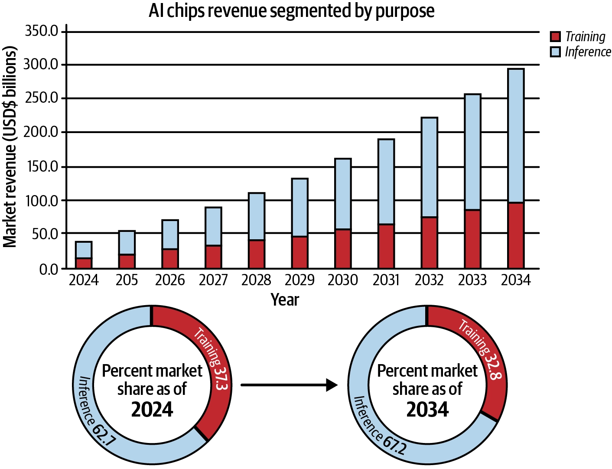

- AI 시스템은 아무리 강력해도 운영 비용이 너무 크면 사업적으로 성립할 수 없다.
- 이러한 AI 비용 구조에서 가장 큰 비중을 차지하는 것은 훈련(train)이 아니라 <span class="t-red">추론</span>(inference)이다.
	- 훈련은 일회성이지만, 추론은 지속적이기 때문이며, 심지어 점점 커지고 있다.
- AI 에이전트, 복잡한 워크플로우는 하나의 워크플로우 안에서 여러 LLM, 임베딩 모델 호출을 필요로 해 추론 비용을 더욱 가중시킨다.

> [!info] AI 비즈니스의 생존을 좌우하는 것은 '추론 비용'이며 효율적인 모델 서빙(같은 하드웨어로 더 높은 처리량, 또는 더 저렴한 하드웨어로 동등한 성능)이 매우 중요하다.

---
#### 확장성, 최대 부하 처리, 실현 가능성

> 추론 최적화를 통해 확장성(Scalability), 최대 부하 처리(Peak Load Handling), 실현 가능성(Feasibility) 측면까지 이점을 누릴 수 있다.

**확장성, 최대 부하 처리**
- 평소 안정적인 트래픽을 처리하던 LLM 서비스도 블랙프레이데이 같은 시기엔 트래픽이 400% 이상 급증할 수 있다.
- 확장성과 최대 부하 처리에 있어 최적화가 부족하다면, 요청 실패로 이어지고 이것은 곧 고객이탈이다.
- 추론 최적화를 통해 추론에 드는 리소스를 줄인다면, 이러한 확장성, 최대 부하 처리에도 매우 큰 도움이 된다.

**하드웨어 유연성**
- 모델을 최적화하여 저사양 칩에서도 구동 가능해진다면, 유연성이 커진다.
- 단순히 비용문제 뿐만 아니라, AWS, GCP, Azure와 같은 주요 클라우드를 사용한다고 하더라도 모든 리전에서 고사양 GPU를 항상 구동할 수 있는것은 아니다.
- 이에, 고사양 GPU에 종속되지 않고 더 넓은 범위의 하드웨어에서 모델을 구동할 수 있는 능력은 매우 중요하다.
- 추론 최적화를 통해 추론에 드는 리소스를 줄인다면, 이러한 하드웨어 유연성 증대에도 매우 큰 도움이 된다.

> [!info] 추론 최적화는 성능, 비용 뿐만 아니라 확장성, 최대 부하 처리, 하드웨어 유연성 측면에서 도움을 주며, 결국 사업의 실현 가능성 자체를 좌우하는 요소이다.

---
### The Role of Accelerator Chips in LLM Serving

---
#### 개요

앞서서 LLM 최적화가 왜 중요한지 알아보았다. 이제 다음 단계는 LLM을 구동하는 하드웨어(가속기 칩, Accelerator Chip)을 이해해야한다.

적절한 하드웨어(GPU) 구성 선택은 LLM 서빙에서 가장 중요한 결정 중 하나이다. 왜냐하면 하드웨어 제약이 메모리 용량, 연산 성능, 효율성을 결정하기 때문이다.

이 챕터에서는 일단 NVIDIA GPU에 초점을 맞춘다. 2026년도 초(책 저자 서술 기준) 현재 NVIDIA의 GPGPU(범용 GPU 컴퓨팅) 솔루션이 여전히 시장을 지배하고 있기 때문이다.

**핵심 개념**
- GPU 연산 성능 (compute power)
- 메모리 용량 (memory capacity)
	- 여기서의 메모리는 VRAM
- 메모리 대역폭 (memory bandwidth)
- 인터커넥트 (interconnects)

이 핵심 개념들을 다룬 뒤, 주요 NVIDIA GPU 모델들의 스펙을 비교 분석하고, LLM 사용 사례별로 어떤 GPU가 적합한지에 대한 저자들의 인사이트를 배운다.

---
#### Compute

Compute 성능은 행렬 곱과 attention/MLP 연산 처리량을 결정한다.

하지만, 보통 <span class="t-red">LLM decode 단계</span>에서는 Compute 성능 제약보다는 <span class="t-red">Memory 대역폭에 제약</span>이 걸리는 경우가 많다.

**용어 정리**
- FLOPS - 초당 부동소수점 연산 횟수
	- 예: `100 TFLOPS` = 초당 약 100조 번의 부동소수점 연산
	- GPU의 **순수 연산 성능**을 나타내는 대표 지표
- Tensor Core 성능 - NVIDIA GPU의 행렬 연산 전용 하드웨어 성능
	- LLM 추론/학습은 대부분 행렬곱이라 Tensor Core 성능이 매우 중요함
	- 일반 CUDA Core의 FLOPS보다 LLM 성능과 더 직접적으로 관련되는 경우가 많음
- 지원 Precision - 어떤 숫자 정밀도 계산 방식을 지원하는지
	- `FP32` : 32비트 실수, 정확하지만 느리고 메모리 많이 사용
	- `FP16` : 16비트, 딥러닝에서 많이 사용
	- `BF16` : 16비트, 학습에 특히 많이 사용
	- `FP8` : 8비트, 최신 GPU에서 LLM 추론/학습 가속
	- `INT8` : 8비트 정수, 양자화 추론
	- `INT4` : 4비트, LLM 모델 메모리를 크게 줄이는 양자화 방식
	- 예: `FP8` 과 같은 연산을 지원하는 GPU는 양자화를 통해 같은 모델을 더 적은 메모리로 올려서 계산할 수 있다.

**비교 예시**

|GPU|Tensor Core|Precision|
|---|---|---|
|오래된 GPU|낮음|FP32, FP16|
|A100|높음|FP32, TF32, FP16, BF16, INT8|
|H100|매우 높음|FP32, TF32, FP16, BF16, **FP8**, INT8|

---
#### Memory

<span class="t-red">VRAM 용량</span>은 모델 weight와 KV cache를 담을 수 있냐 없냐를 결정한다.

<span class="t-red">Memory 대역폭</span>은 weight와 activation을 얼마나 빨리 읽어올 수 있는지를 결정한다.

LLM serving에서는 VRAM 용량과 Memory 대역폭 모두 중요하다.

---
#### Interconnect

여러 GPU가 한 서버 안에 있을 때 GPU 간 통신은 PCIe, NVLink, NVSwitch 구조에 따라 성능 차이가 난다.

예시
- 한 서버 안
	- Tensor parallelism을 사용할 때 GPU 간 activation, partial result, synchronization traffic이 생긴다.
	- 따라서 GPU 수만 늘린다고 항상 빨라지지 않는다.
	- Interconnect bandwith와 topology가 중요하다. (내부 대역폭과, 연결 방식)
- 여러 서버 간
	- 여러 서버에 걸쳐 모델을 나누면 Infiniband, RoCE 같은 네트워크 성능이 중요하다.
	- Inter-node serving은 intra-node serving보다 latency와 운영 복잡도가 커지므로 가능하면 한 노드 안에서 먼저 최적화하는 것이 좋다.

**용어 정리**
- InfiniBand와 RoCE 모두 CPU를 거의 거치지 않고 한 서버의 메모리에서 다른 서버의 메모리로 직접 데이터를 전송하는 방식인 RDMA(Remote Direct Memroy Access)를 활용한다.
- **InfiniBand** - HPC/AI 용 고성능 네트워크로 설계된 별도 네트워크 기술
	- 일반적인 네트워크는 `Application → OS → TCP/IP Stack → NIC → Network` 의 단계를 거치지만
	- RDMA는 `Memory → NIC → Network → NIC → Memory` 형태로 움직여서 지연시간이 낮고 CPU 부하가 적다.
	- 이에, 매우 낮은 latency, 높은 대역폭을 지원한다.
	- 일반 Ethernet과 다르게 전용 NIC, 전용 스위치, 전용 프로토콜을 사용한다.
- **RoCE** (RDMA over Converged Ethernet) - RDMA를 일반 Ethernet 위에서 사용하는 기술
	- RDMA를 기존 Ethernet 인프라를 활용하여 사용하는 기술

> 하나의 서버 내부의 여러 GPU 끼리는 보통 NVLink / NVSwitch
> 
> 여러 서버 간의 GPU 끼리는 InfiniBand / RoCE

> [!tip] GPU 파워 소모량도 중요하다.
> - GPU는 전력과 냉각 비용도 크다.
> - 동일 throughput을 더 낮은 전력으로 달성하는 최적화는 운영 비용에 직접 영향을 준다.
> - Model serving capacity planning에서는 GPU 가격뿐 아니라 전력, rack density, cooling, utilization 까지 함께 계산해야 한다.

---
#### H100 SXM과 H100 NVL의 비교

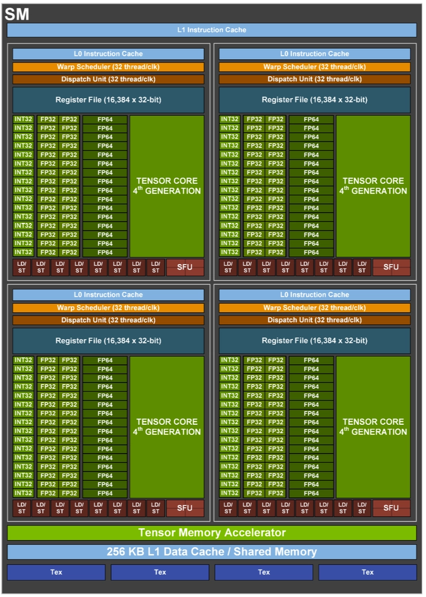

> 위 사진은 NVIDIA Hopper 아키텍처의 SM 구조도. 이 구조를 사용하는 GPU는 대표적으로 H100이 있다.

|**항목**|**H100 SXM**|**H100 NVL**|
|---|---|---|
|**FP64**|34 teraFLOPS|30 teraFLOPS|
|**FP64 Tensor Core**|67 teraFLOPS|60 teraFLOPS|
|**FP32**|67 teraFLOPS|60 teraFLOPS|
|**TF32 Tensor Core**|989 teraFLOPS|835 teraFLOPS|
|**BFLOAT16 Tensor Core**|1979 teraFLOPS|1671 teraFLOPS|
|**FP16 Tensor Core**|1979 teraFLOPS|1671 teraFLOPS|
|**FP8 Tensor Core**|3958 teraFLOPS|3341 teraFLOPS|
|**INT8 Tensor Core**|3958 TOPS|3341 TOPS|
|**GPU Memory**|80 GB|94 GB|
|**GPU Memory Bandwidth**|3.35 TB/s|3.9 TB/s|
|**Form Factor**|SXM|PCIe dual-slot air-cooled|
|**Interconnect**|NVIDIA NVLink™: 900GB/sPCIe Gen5: 128GB/s|NVIDIA NVLink: 600GB/sPCIe Gen5: 128GB/s|

> 위 표는 H100 SXM과 H100 NVL의 스펙을 분석한 표이다. 이 섹션에서는 위 2개의 GPU르 비교하며 GPU 사양 읽는 방법을 설명한다.

**Compute**
- 위 표를 보면, `FP16`과 `FP8`에서 H10 SXM이 더 높다. 이 두 정밀도는 딥러닝에서 쓰이는 저정밀도 포맷이다.
- 그렇다고, '모든 용도에서 NVL이 열등하다' 라는 뜻은 아니다.

**Memory**
- 위 표를 보면 NVL이 VRAM이 94GB로 SXM의 80GB보다 더 높다. 또한 대역폭도 3.9TB/s로 SXM의 3.35TB/s 보다 우수하다.

이에 무엇이 더 우월하다고 할 수 없고 아래와 같은 여러 상황에 맞춰 균형을 선택하면 된다.
- 모델을 로드할 VRAM이 부족 -> NVL
- 대역폭에서 병목이 생긴다 -> NVL
- 연산속도에서 병목이 생긴다 -> SXM

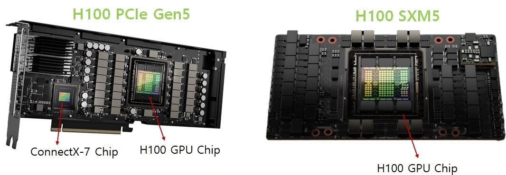

| 항목                                                | **H100 PCIe**          | **H100 NVL**                                                | **H100 SXM**                              |
| ------------------------------------------------- | ---------------------- | ----------------------------------------------------------- | ----------------------------------------- |
| **Form factor**                                   | **PCIe**               | **PCIe**                                                    | **SXM**                                   |
| **NVLink support**                                | **No (optional)**      | **NVLink Bridge**                                           | **NVLink/NVSwitch**                       |
| **Interconnect GPU-to-GPU bandwidth (GPU 간 대역폭)** | **128 GB/s with PCIe** | **600 GB/s with NVLink Bridge connecting 2 H100 GPUs only** | **900 GB/s connecting up to 8 H100 GPUs** |

**Interconnect**
- 하나의 GPU로는 모델을 다 담지 못하거나, 지연시간 요구사항을 맞추기 위해 여러 <span class="t-red">GPU가 협력해야하는 경우</span> Interconnect 속성도 중요해진다.
- 하나의 노드 안에서 여러 GPU가 통신할 때, SXM의 경우 전용 소켓에 직접 장착함으로써, GPU간 대역폭을 900GB/s의 성능을 낸다. -> 메인 보드도 전용이어야하지만(호환성 약함) 고성능
- 그러나, PCIe 모델의 경우 일반 PCIe 슬롯에 장착한다. (호환성 높음) 그리고 칩의 비용도 더 저렴하지만 성능은 다소 떨어진다.
- NVL은 NVLink Bridge를 지원하며 그 중간의 성능을 낸다.

---
#### 여러 Topology (하나의 노드 안)


1. H100 PCIe
	- 대역폭 128GB/s
	- 가장 저렴한 구성. GPU 간 고속 통신이 필요 없는 경우(예: 각 GPU에서 독립적으로 작은 모델 2개를 돌리는 경우)에 적합


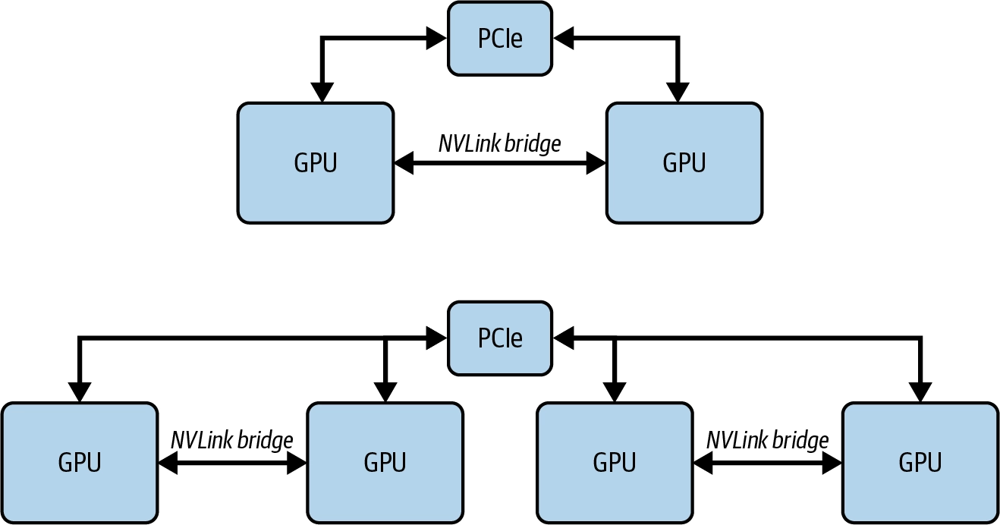

2. H100 NVL
	- PCIe 폼팩터에 NVLink Bridge 추가 → GPU 2개를 600 GB/s로 연결
	- **단점: NVLink Bridge는 GPU 2개까지만 연결 가능.**
	    - 4-GPU 구성 시, GPU1-GPU2는 600GB/s로 연결되지만 GPU1-GPU3, GPU2-GPU4 사이는 여전히 128GB/s PCIe 사용
	- 비용과 성능의 좋은 절충안

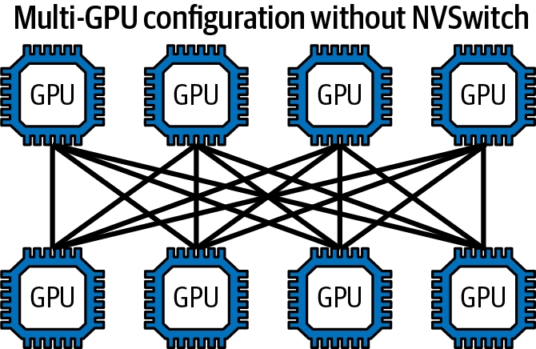

3. H100 SXM + NVLink
	- 최대 8개 GPU를 NVLink로 연결
	- 각 GPU의 총 대역폭 900GB/s를 7개의 다른 GPU와 점대점(point-to-point) 연결로 분할 → 각 연결당 128 GB/s (900÷7)
	    - 각 GPU의 인터커넥트 대역폭이 900GB/s이므로, 각 GPU는 총 900GB/s 대역폭을 **7개의 전용 128GB/s**(900GB/s를 7로 나눈 값) **점대점 연결**로 나누어 시스템 내 다른 GPU 중 하나와 연결해야 한다.

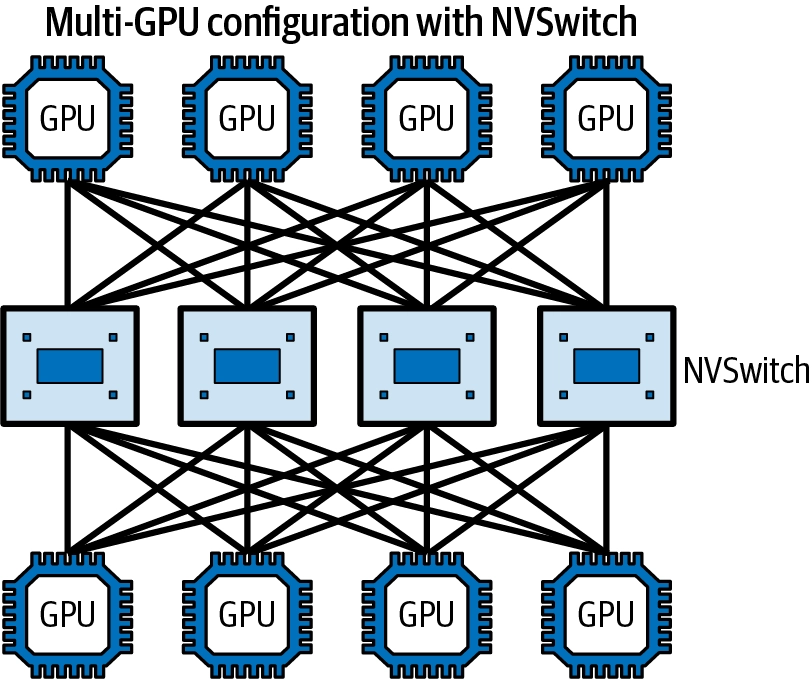


4. **H100 SXM + NVLink + NVSwitch**
    - 연결된 GPU 수만큼 인터커넥트 대역폭이 나뉘는 것이 불편하다면, NVSwitch를 사용해 모든 GPU 연결에 대해 900GB/s의 전체 대역폭을 확보할 수 있다.
    - NVSwitch는 여러 개의 NVLink 지원 GPU를 연결하는 별도의 고가의 고대역폭 스위치이다.

---
#### Inter-node 인터커넥트 (노드 간)

- **한 노드에 담을 수 있는 GPU 수**는 물리적 제약, 전력, 냉각, 소프트웨어 지원 등으로 **보통 최대 8개로 제한**됨
    - Inter-node serving은 intra-node serving보다 latency와 운영 복잡도가 커지므로 <span class="t-red">가능하면 한 노드 안에서 먼저 최적화하는 것이 좋다.</span>
	    - LLM 서비스의 경우, 대부분의 배포는 여전히 단일 노드에서 각 모델 인스턴스(복제본이라고도 함)당 1개에서 8개의 GPU를 사용해 운영된다.
	    - 사용자 트래픽이 증가하면, 동일한 설정의 하드웨어 인스턴스를 추가해 모델 복제본 수를 수평적으로 확장한다. 
	    - 이 접근법의 목표는 불필요한 노드 간 통신을 최소화하는 것
- 모델이 더 커지면 여러 노드에 걸쳐 모델을 샤딩(sharding)해야 함. **여러 서버에 걸쳐 모델을 나누면 InfiniBand, RoCE 같은 네트워크 성능**이 중요해진다.
    - 최근 연구에서는 서로 다른 GPU 간에 프리필 단계와 디코딩 단계를 분리하는 방안을 모색하고 있다. 
    - 또한 DeepSeek V3/R1과 같은 혼합 전문가(MoE) 아키텍처를 사용하는 대형 모델의 경우, 전문가 병렬 처리와 데이터 병렬 처리 같은 기법이 노드 간에도 적용된다. 
    - 기초 개념을 다룬 후에 이러한 고급 주제들을 소개할 것
- 대표 솔루션: InfiniBand(IB) or RoCEv2 + GPUDirect RDMA
    - RDMA(Remote Direct Memory Access): 노드 간 GPU끼리 직접 메모리 접근 가능
    - 예: NDR 400G InfiniBand → **약 50 GB/s (노드 내부 대비 훨씬 느림)**

---
#### GPU 전력 소비

- 마지막으로 중요한 제약: **전력 소비** - 눈에 잘 안 띄지만 근본적인 GPU 지표
- **단위**: **와트**(W), 보통 **TDP**(Thermal Design Power)로 표현 - GPU가 지속적인 부하 하에서 설계상 소비하도록 만들어진 **최대 지속 전력**
- 최신 데이터센터 GPU는 수백 와트에서 700W 이상까지 다양하며, 전력 예산이 클수록 연산 밀도와 메모리 대역폭이 높아지지만, 그만큼 냉각·전력 공급·시스템 통합에 대한 요구사항도 엄격해짐
- 배포 환경별 중요도가 다름:

    1. **일반 클라우드 사용자**: 전력은 대부분 추상화되어 있음 - 사용자는 그냥 인스턴스 타입을 선택하고 사용량/시간 기준으로 과금됨. 전력은 가격·가용성·성능 등급에 암묵적으로 반영될 뿐 직접 관리하지 않음
    2. **클라우드 제공업체/프라이빗 데이터센터**: 전력은 1급 설계 제약. 랙당/시설당 배치 가능한 GPU 수를 전력·냉각 용량이 제한하므로, 와트당 성능(performance per watt)이 고정된 인프라 예산 하에서 처리량을 극대화하는 핵심 지표가 됨
    3. **엣지/온디바이스 시스템**: 전력이 시스템 전체를 규정하는 제약. 배터리, 발열, 폼팩터의 엄격한 한계로 인해 모델 아키텍처, 정밀도 선택, 실행 전략이 최고 성능이 아니라 전력 효율성 중심으로 근본적으로 결정됨
    
- 전력은 단순히 "얼마나 빠른가"뿐 아니라 어디서, 어떻게 <span class="t-red">그 성능을 실제로 구현할 수 있는가</span>까지 결정하는 요소이다.

---
### Bottlenecks in LLM Model Loading

---
#### 모델 로딩 과정 (VRAM)


> 모델 로딩은 storage에서 model weight를 읽고, CPU memory를 거쳐 GPU memory에 복사한 뒤, runtime이 실행 가능한 형태로 준비하는 과정.

LLM 서빙의 첫 단계는 모델 가중치(weights)를 로드해서 GPU 메모리에 캐싱하는 것이다.

로딩 과정: 디스크 → CPU 메모리(시스템 메모리) → GPU 메모리 순으로 가중치가 이동

병목은 다음 지점에서 생긴다.
- 원격 storage에서 weight 다운로드
- Disk I/O
- CPU memory copy
- CPU to GPU transfer
- GPU memory allocation
- model initialization 및 compilation/warmup

한 번 로드되면 가중치는 GPU 메모리에 캐싱된 상태로 유지되어 들어오는 요청을 즉시 처리할 준비가 된다.

> 따라서 <span class="t-red">모델 가중치를 전부 담을 수 있을 만큼 충분한 GPU 메모리가 반드시 필요</span>하다.

> [!question] 그냥 CPU 메모리에 캐싱하거나, 요청이 들어올 때마다 로드하면 안 되나?
> 하드디스크와 CPU 메모리는 모델 가중치를 옮기기에 훨씬 느리기 때문에 실시간 추론에는 비현실적이다.
>
> | 구분 | 대역폭 |
> | --- | ---: |
> | Hard Disk (SSD) | 0.5 ~ 14 GB/s |
> | CPU Memory | 50 ~ 200 GB/s |
> | GPU Memory | 300 GB/s ~ 3 TB/s |

---
#### 모델 사이즈 추정

> 모델의 메모리 사용량을 계산할 때의 핵심 변수는 파라미터 개수와 파라미터의 데이터 타입이다.

1. 모델의 파라미터 개수
    - Hugging Face의 모델은 이름 자체에 파라미터 개수가 드러나는 경우가 많다.
    - 예: Llama-2-7b → 이름에서 알 수 있듯 약 70억(7 billion)개의 파라미터를 가진 모델

2. 파라미터의 데이터 타입 (정밀도, precision)
    - Hugging Face 리포지토리의 config.json 파일에서 확인 가능
    - 특히 torch_dtype 속성이 모델 가중치에 사용된 정밀도를 알려줌
	- 예: "torch_dtype": "float16" → 가중치 저장·연산에 16비트 부동소수점 사용

|정밀도|비트 수|바이트 크기|
|---|---|---|
|FP32 (단정밀도, single precision)|32|4 바이트|
|FP16 (반정밀도, half precision) / BF16|16|2 바이트|
|INT8 (1/4 정밀도, quarter precision ) / FP8|8|1 바이트|

**계산 예시: Llama-2-7b***
- 파라미터 수: 약 70억 개
- 정밀도: BF16 → 파라미터당 2바이트
	- 7 billion parameters × 2 bytes/parameter = 14 billion bytes = 14 GB
- 실제로 모델 파일의 크기를 확인하면 총 약 **13 GB**(9.98 + 3.5GB)**로, 이 추정치와 거의 일치**

---
####  KV Cache 크기 추정

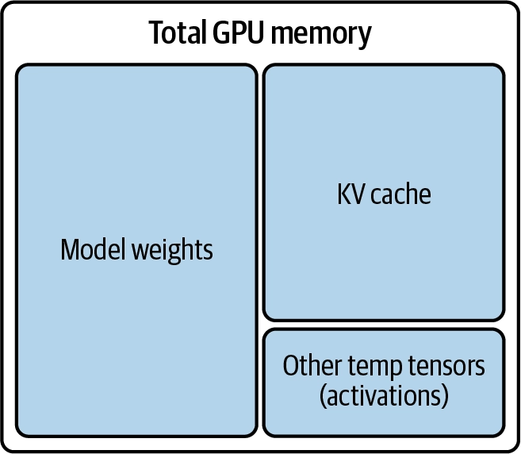

> 앞 절에서 Llama-2-7b 모델 크기가 약 14GB임을 확인했다.
> 
> 만약 16GB GPU가 있다면 모델 로딩은 문제없고, 짧은 요청 하나 정도는 잘 돌아갈 것
> 
> 하지만 모델을 겨우 담을 정도의 메모리만 있는 GPU는 이상적이지 않다.
> 
> <span class="t-red">바로 KV 캐시(KV cache) 때문</span>
> 
> KV 캐시용 여유 공간이 너무 작으면 → <span class="t-red">배치 크기(batch size)와 컨텍스트 길이가 심하게 제한</span>됨


**KV Cache 계산 공식**
$$
\text{KV Cache Size per Token}
= 2 \times L \times H \times D_{\text{head}} \times S_{\text{dtype}}
$$

- 토큰당 KV 캐시 크기 = 2 × 층 수 × 어텐션 헤드 수 × 헤드 차원 × 데이터 타입 크기
- 다음 예시에서는 기본적인 멀티헤드 어텐션(MHA) 형태를 사용하는 Llama-2-7b를 사용

**계산 예시: Llama-2-7b (기본 MHA 방식 사용)**
- 어텐션 레이어 수: 32
- 어텐션 헤드 수: 32
- 헤드 차원: 128 (= 4096 / 32)
- 정밀도: half precision → 토큰당 2바이트
- **토큰당 KV 캐시 크기** = 2 × 32 × 32 × 128 × 2 = 524,288 바이트 = **0.5MB**

예를 들어, **최대 시퀀스 길이를 4,096**으로 설정해 긴 문단을 요약하는 데 이 모델을 사용한다고 가정
- 배치 크기 16 가정 (요청 배치 처리)
- **총 KV 캐시** = 0.5MB 토큰 × 요청당 4,096 토큰 × 배치 크기 **16건** = **32GB**
- 이건<span class="t-red"> 모델 자체 용량인 14GB보다도 더 큰 크기</span>

---
#### 실전 GPU 비교 : A10 (24GB) vs L40S (48GB)

> 앞선 예시인 Llama-2-7b 가정

|GPU / 메모리|모델 로드 후 남은 메모리|최대 배치 크기|시간당 비용(AWS 온디맨드)|
|---|---|---|---|
|A10 24 GB|10 GB (24 – 14)|4 (10 × 1024/(0.5 × 4096) = 5 )|$2|
|L40S 48 GB|34 GB (48 – 14)|16 (34 × 1024/(0.5 × 4096) = 17)|$3.75|

- **A10**은 **병렬 요청 4개**만 처리 가능, **L40S**는 **16개** 처리 가능
- **L40S가 더 비싸지만, 결과적으로 비용 효율은 더 좋다** (동시 처리량이 4배 늘어난 데 비해 비용은 약 2배 정도만 증가)

> [!warning] 계산식으로 나온 이론적 최대 배치 크기(5, 17)를 실제로는 온전히 다 쓸 수 없다
> - 활성화(activation), 즉 중간 계산 단계에서 생성되는 텐서를 위한 공간도 GPU 안에 따로 확보해둬야 하기 때문

---
### Bottlenecks in LLM Model Execution

---
#### GPU 연산 및 메모리 대역폭의 경계 (어느 것이 병목)

> 모델이 GPU 메모리에 완전히 로드되어 서빙 준비가 끝났다면, 이제 다른 질문을 던질 차례이다.
> 
> 모델 서빙의 병목 지점이 <span class="t-red">GPU 연산</span>(compute FLOPS)에 의해 생기는가, 아니면 <span class="t-red">GPU 메모리 대역폭</span>(memory bandwidth)에 의해 생기는가?

**Arithmetic Intensity** (산술 강도)
- 이를 분석하기 위해서는 <span class="t-red">Arithmetic Intensity</span>라는 개념이 필요하다.
- 이는 <span class="t-red">알고리즘 구현 연산 수와 접근한 바이트 수의 비율</span>을 의미한다.
- 이는 기본적으로 <span class="t-red">데이터가 연산 유닛으로 이동할 때의 연산 횟수</span>(FLOPS)를 <span class="t-red">바이트당 FLOPS 비율</span>로 계산한 것
$$
\text{Arithmetic Intensity}
=
\frac{\text{Number of FLOPs}}{\text{Data Movement}}
$$
- 산술 강도 = FLOPS 수 / 데이터 이동량
- **산술 강도가 낮음**: 연산은 적게 필요하지만 **데이터 읽기/쓰기가 많은 워크로드**
- **산술 강도가 높음**: 데이터는 적게 읽고 쓰지만 그 위에서 **많은 연산을 수행하는 워크로드**


**Data Movement** (데이터 이동)


- 데이터 이동은 모델 실행 시점에 일어나는 것으로, 모델 가중치가 이미 GPU 메모리(off-chip HBM)에 있는 상태에서 발생합니다. (<span class="t-red">모델 로딩과는 다른 개념</span>)
- **온칩(on-chip) 메모리**: L2 캐시, L1 캐시, 공유 메모리 → SRAM으로 구성됨
    - **SRAM**: 용량은 작고 비싸지만 훨씬 빠름, 연산 유닛 바로 옆에 위치
    - **HBM**: 속도를 희생하고 용량을 확보
    - SRAM은 저지연 연산을 지원, HBM은 모델 가중치 같은 대용량 데이터 저장을 담당
- 서빙 중 데이터 흐름 : HBM → SRAM(L2/L1/공유 메모리) → 레지스터로 이동해야 실제 연산이 수행됨

> [!question] 왜 GPU "메모리 대역폭"을 기준으로 삼는가?
> - 서빙 중 모델 가중치와 모든 중간 결과가 계속 레지스터로 읽혀 들어가는데, 이 경로에서 가장 느린 구간이 GPU 메모리(HBM)이기 때문에 GPU 메모리 대역폭이 데이터 이동의 기준 지표가 된다.
> - 예외: 가중치나 출력이 충분히 작아서 flash attention처럼 온칩 캐시에 영리하게 담기는 경우는 다소 다름 (6장에서 다룸)


**계산 예시: L40S (FP16 기준)**

|항목|값|
|---|---|
|GPU Memory|48 GB GDDR6 with ECC|
|**Memory Bandwidth**|**864 GB/s**|
|Interconnect Interface|PCIe Gen4 x16: 64 GB/s bidirectional|
|NVIDIA Ada Lovelace Architecture CUDA Cores|18,176 개|
|NVIDIA Third-Generation RT Cores|142 개|
|NVIDIA Fourth-Generation Tensor Cores|568 개|
|RT Core Performance TFLOPS|212 TFLOPS|
|FP32 TFLOPS|91.6 TFLOPS|
|TF32 Tensor Core TFLOPS|183 TFLOPS|
|BFLOAT16 Tensor Core TFLOPS|362.05 TFLOPS|
|**FP16 Tensor Core**|**362.05 TFLOPS**|
|FP8 Tensor Core|733 TFLOPS|
|Peak INT8 Tensor TOPS|733 TOPS|

- 산술 강도 = FLOPS 수 / 데이터 이동량(바이트)
- 362 TeraFLOPS / 864 GB/s = (362 × 1012승 FLOPS) / (864 × 109승 B) ~= **419 FLOPS/B**


**Roofline Model** (루프라인 모델)

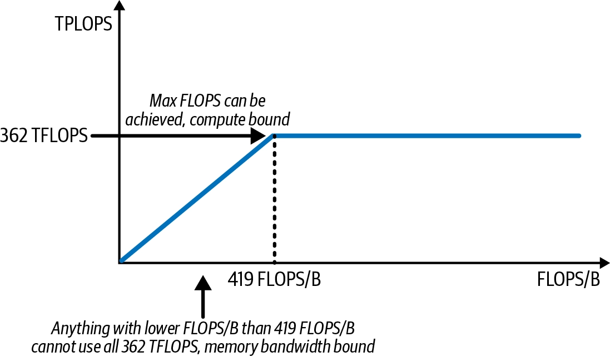

- 시스템의 연산 능력과 메모리 대역폭을 함께 나타내어, <span class="t-red">애플리케이션이 compute-bound(연산 제한)인지 memory-bound(메모리 대역폭 제한)인지 판별</span>하는 시각적 성능 모델
- **x축**: 산술 강도 arithmetic intensity (FLOPS/B)
- **y축**: 달성 가능 성능 attainable performance (TFLOPS)
- <span class="t-red">산술 강도가 419 FLOPS/B보다 낮으면, GPU가 낼 수 있는 최대 362 TFLOPS를 다 활용하지 못함</span>


**실전 워크로드 분석**

> 이제 산술 강도와 루프라인 모델을 사용해 특정 GPU의 작업 부하가 연산 대역폭으로 제한되는지, 아니면 메모리 대역폭으로 제한되는지 분석해보자.
> 
> 약 210 FLOPS/B의 워크로드가 있다고 가정해 보자. 이는 419 FLOPS/B의 크로스오버 포인트의 절반 정도이다.

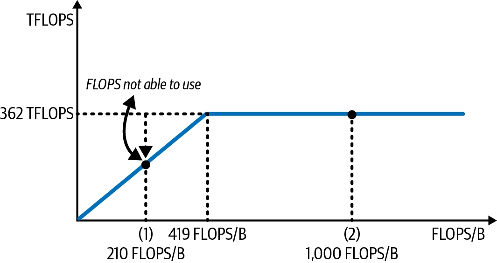

- 데이터 포인트 (1)
    - 산술 강도 : ~210 FLOPS/B (419의 절반)
    - 상태 : 메모리 대역폭 제한(memory-bound)
    - 비유 : 연산력은 여유가 있는데 데이터 공급이 못 따라감
- 데이터 포인트 (2)
    - 산술 강도 : 1,000 FLOPS/B
    - 상태 : 연산 제한(compute-bound)
    - 비유 : 데이터는 빠르게 공급되지만 연산력 용량이 이미 꽉참 → 더 읽어봤자 소용없음, 이게 이 칩의 최대 속도

> 그렇다면, 우리가 서빙하고자하는 LLM은 실제로 어떤 성격인가?
> 
> 산술 강도가 낮은 메모리 대역폭 제한(memory bandwidth-bound) 워크로드인가, 아니면 산술 강도가 높은 연산 제한(compute-bound) 워크로드인가?

---
#### 행렬 곱에서의 산술 강도

> LLM 서빙 워크로드가 compute-bound인지 memory bandwidth-bound인지 알아내려면, LLM 아키텍처 내부 각 레이어의 산술 강도를 계산해야한다.
> 
> LLM은 대부분 트랜스포머 블록으로 구성되며, 그 안에는 크게 셀프 어텐션 레이어와 피드포워드 레이어 두 요소가 있다.
> 
> 두 레이어 모두 계산의 대부분은 행렬 곱이다.
> 
> 그 외에도 element-wise 연산, reduction 연산 등이 있지만, 이들은 로드하는 데이터 대비 연산량이 적어 산술 강도가 낮은 편이며, 전체 연산에서 차지하는 비중은 작다.


```python
for m in [0, M):
    for n in [0, N):
        for k in [0, K):
            Outputs[m][n] += Inputs[m][k] * Weights[k][n]
```

**산술 강도 계산**
- **분자** (연산 횟수)
    - 위 코드에서: M × N × K번의 곱셈 + M × N × (K−1)번의 덧셈
    - 단순화하면:
        - 연산 횟수 = 2 × M × N × K

- **분모** (데이터 이동량)
    - 입력 행렬 2개(Inputs, Weights)를 읽고, 출력 행렬 1개(Outputs)를 씀
    - 값의 정밀도를 2바이트(예: FP16)로 가정하면:
        - 데이터 이동 = 2 × (입력 크기 + 가중치 크기 + 출력 크기) = 2 × (M × K + K × N + M × N)
        - data movement = 2 × (inputs size + weight size + outputs size) = 2 × (M × K + K × N + M × N)
- **최종 공식** : 산술 연산 강도 = 연산 횟수 / 데이터 이동 횟수
    - **산술 연산 강도** = 2 × M × N × K / (2 × (M × K + K × N + M × N)) = <span class="t-red">M × N × K / M × K + K × N + M × N</span>


**계산 예시: L40S (FP16 기준)**

|**행렬 크기 (M=N=K)**|**산술 강도 (FLOPS/Byte)**|L40S 기준 판정|
|---|---|---|
|64|21|메모리 대역폭 제한(memory bandwidth-bound)|
|512|170|메모리 대역폭 제한(memory bandwidth-bound)|
|4096|1365|연산 제한(compute-bound)d|

- 이를 위에서 계속 예시로 들었던 L40S에 대입하면 다음과 같다.
- **행렬 크기가 ‘64 ~512’ 사이로 작을 때**: 산술 강도가 각각 21, 170 → 419보다 훨씬 낮음 → 메모리 대역폭 제한
- **행렬 크기가 4,096으로 커지면**: 산술 강도 1365 → 419를 훌쩍 넘음 → 연산 제한

> 그렇다면, LLM에서의 행렬은 연산 제한이 될만큼 큰가? 아니면 메모리 제한이 될만큼 작은가?

---
#### LLM의 프리필 단계와 디코드 단계에서의 산술 강도 분석

> 행렬이 클수록 산술 강도가 높아진다는 것을 알았다. 하지만 LLM 서빙에서 항상 큰 행렬 곱셈을 얻을 수 있는 것은 아니다.
> 
> 특히 배치 크기가 1일 때(한 번에 요청 하나만 처리)는 더욱 그렇다.

**입력 텐서의 shape**
- **입력 텐서**: [배치 크기, 시퀀스 길이, 모델 히든 차원] **3차원**
    - 배치 크기: 동시에 처리하는 요청 수
    - 시퀀스 길이: 입력 프롬프트의 토큰 수 (매우 가변적, "Hello" 같은 짧은 문구부터 100만 토큰짜리 긴 문단까지)
    - 모델 히든 차원: 모델 내부에서 각 토큰 벡터가 갖는 값의 개수 (모델 용량·성능에 영향)
- 요청 1개만 처리(배치 크기=1)한다고 가정하면 → [시퀀스 길이, 히든 차원] 2차원 행렬로 단순화됨


**Prefill vs Decode**

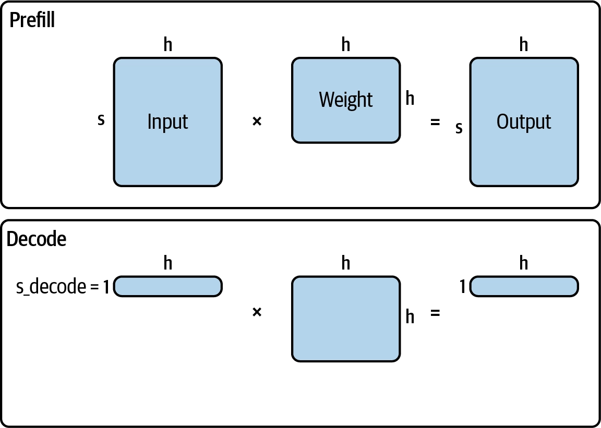

- CH2에서 다루었지만, 다시 언급
- 프리필 단계는 초기 처리 단계로, 모델이 출력 토큰을 생성하기 전에 입력 프롬프트를 인코딩하는 과정
	- 트랜스포머 층을 사용해 입력 토큰에 대한 어텐션을 계산
	- KV 캐시 항목 세트를 생성해 이후 생성 단계에 저장
- 디코딩 단계에서는 모델이 이전에 계산된 KV 캐시를 사용해 토큰을 하나씩 생성

| **시퀀스 길이  M = s for prefill  M = 1 for decode** | **히든 차원  K = N = h** | **Prefill arithmetic  intensity (FLOPS/B)** | **Decode arithmetic  intensity (FLOPS/B)** | **Verdict based on L40S**           |
| ----------------------------------------------- | -------------------- | ------------------------------------------- | ------------------------------------------ | ----------------------------------- |
| 64                                              | 4096                 | 62.06                                       | approximately 1.0                          | prefill·decode 둘 다 메모리 대역폭 제한       |
| 512                                             | 4096                 | 409.60                                      | approximately 1.0                          | prefill·decode 둘 다 메모리 대역폭 제한       |
| 4096                                            | 4096                 | 1365.33                                     | approximately 1.0                          | prefill 은 연산 제한, decode는 메모리 대역폭 제한 |

- 위에서 도출한 산술 강도 공식에 프리필과 디코드를 대입하면 위 표와 같다.
- 결론은 다음과 같다.
	- Prefill: 시퀀스 길이가 충분히 길면 산술 강도가 크게 올라가 GPU 연산력을 포화시킬 만큼 높아짐 → compute-bound가 될 수 있음
	- Decode: 시퀀스 길이와 무관하게 s=1이 고정이므로 산술 강도가 항상 매우 낮음(~1.0) → 시퀀스 길이가 아무리 길어도 항상 memory bandwidth-bound
		- (이번 챕터에서는 이해를 위해 배치 크기 의도적으로 제외해서 s=1 인것)

> [!info] 이 분석의 목적
> - LLM 서빙의 각 단계별 병목(bottleneck)에 대한 직관을 키우는 것
> - 연산 제한(compute-bound) 워크로드 → 수학적 연산 최적화, FLOPS 절감 방향으로 최적화 기법을 찾아야 함
> - 메모리 대역폭 제한(memory bandwidth-bound) 워크로드 → 불필요한 데이터 이동을 최소화하는 방향으로 최적화해야 함

---
### Other AI Accelerators and Trends

---
#### 기타 AI 가속기와 동향

**LLM 추론 시장의 경쟁 칩들**
- 범용 대안: AMD MI300X, Intel Gaudi2 - NVIDIA H100/A100의 대안
- 클라우드 전용: Google TPU, Amazon Inferentia - 각 클라우드에서만 주로 사용 가능
- 지역 제약 시장 대안: Huawei Ascend NPU - 특히 NVIDIA가 규제받는 시장에서 주목받음
- 스타트업들: Groq, Cerebras, Untether AI, SambaNova, d-Matrix 등


**NVIDIA가 여전히 시장을 지배하는 이유 (2026년 초 기준)**
1. **범용성 vs 특화**: 일부 경쟁 칩은 딥러닝 추론, 행렬곱, 트랜스포머 워크로드에 특화되어 있어 아키텍처가 더 단순하고 비용·에너지 효율이 좋지만, **모델 아키텍처가 빠르게 진화하는 상황에 대응하기 어려움**
2. **소프트웨어 생태계**: NVIDIA는 **CUDA 생태계**가 학습·추론 모두에서 훨씬 성숙함. 반면 커스텀 칩들은 각자 독자적인 소프트웨어 스택 필요 (AMD의 ROCm, TPU의 JAX, Inferentia의 Neuron) → **전환 비용이 크고 커뮤니티 지원도 부족**
3. **온칩 SRAM 활용 칩들**: 뛰어난 지연시간 성능을 내지만, SRAM 자체가 비싸고 모델 하나를 서빙하는 데 필요한 칩 수가 많아 비용 효율이 떨어지는 경우가 많음
4. **유연성**: NVIDIA GPU는 여전히 **다양한 추론 구성에 대응하는 유연성**에서 우위 - FP8·FP4 등 다양한 정밀도 지원, 높은 메모리 대역폭, 고급 GPU 인터커넥트 기능


**메모리 벽(Memory Wall) 문제** [https://arxiv.org/pdf/2408.14158](https://arxiv.org/pdf/2408.14158)

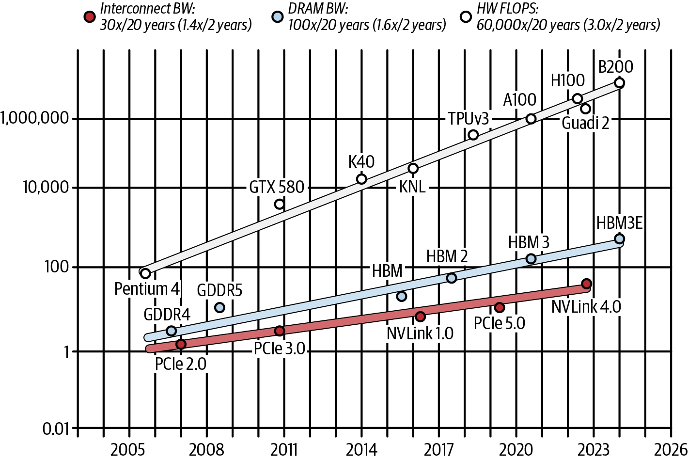

- 지난 20년간(그림 5-17) 연산 성능(FLOPS)은 폭발적으로 향상된 반면, 메모리 대역폭·GPU 간 대역폭 같은 데이터 이동 속도는 훨씬 느리게 개선됨
- 결과적으로 데이터 이동 한계가 빠른 연산 발전을 제대로 활용하지 못하게 막는 걸림돌이 되었으며, 이를 "메모리 벽(memory wall)"이라 부른다.
- 많은 가속기 제조사들이 이 문제 해결에 뛰어들고 있다.


**메모리 벽을 완화하는 두 가지 최신 트렌드**

1. 온칩 SRAM으로 연산을 더 가까이 끌어오기
	- **대량의 온칩 SRAM을 활용**해 모델 파라미터와 중간 데이터를 연산 유닛 바로 옆에 최대한 가깝게 유지 → 메모리 접근 지연을 크게 감소
	- **비용은 비싸**지만 극도로 낮고 예측 가능한 지연시간을 달성 가능 → 지연시간에 민감한 추론 워크로드에 매력적
	- 구체적 사례: Groq와 NVIDIA의 최근 협력 - [Link](https://groq.com/newsroom/groq-and-nvidia-enter-non-exclusive-inference-technology-licensing-agreement-to-accelerate-ai-inference-at-global-scale)
	    - NVIDIA가 이 접근법에 관심을 보인다는 것은, 일부 추론 워크로드에서는 극한의 저지연이 피크 처리량보다 더 가치 있을 수 있다는 업계의 폭넓은 인식을 보여줌 - 실리콘 비용이 더 들고 모델을 여러 칩에 걸쳐 신중히 분할해야 하더라도

2. 긴밀하게 결합된 멀티 GPU 시스템 전체로 성능 확장
    - 이 트렌드는 CPU 계층까지 확장됨: 예) NVIDIA Grace CPU는 고대역폭 인터커넥트로 GPU와 긴밀히 통합되어, 대규모 멀티 GPU 시스템에서 CPU-GPU 간 데이터 전송 오버헤드를 감소
    - 대표 사례: GB200 NVL72 (**NVIDIA 랙 스케일 아키텍처**) [https://www.nvidia.com/en-us/data-center/gb200-nvl72/](https://www.nvidia.com/en-us/data-center/gb200-nvl72/)
    - **B200**: Blackwell 세대 GPU
    - **GB200**: Grace CPU + Blackwell GPU를 [NVLink-C2C](https://www.nvidia.com/en-us/data-center/nvlink-c2c/)로 연결한 빌딩 블록 → 고대역폭·저지연 CPU-GPU 결합
    - **NVL72**: NVLink Switch System을 이용해 72개의 Blackwell GPU를 **하나의 거대한 NVLink 도메인**으로 연결한 랙 스케일 시스템
    - **결과**: GB200 NVL72는 **랙 하나에 Grace CPU 36개 + Blackwell GPU 72개를 연결한 구조**
    - 이 랙 스케일 아키텍처는 **대형 MoE 모델의 분리형 서빙**(disaggregated serving)과 결합될 때 특히 강력함 (7장에서 다룰 고급 기법) [https://newsletter.semianalysis.com/p/inferencex-v2-nvidia-blackwell-vs](https://newsletter.semianalysis.com/p/inferencex-v2-nvidia-blackwell-vs)
    - 현재는 이런 최신 소프트웨어-하드웨어 공동설계(codesign)가 필요한 구성을 업계 대부분이 아직 도입 중인 단계이며, Frontier Labs와 빅테크 등 일부 하이퍼스케일러만이 최전선에서 채택하고 있음

---
## CH6. Essential LLM Optimization Techniques

---
### Request Batching and Scheduling-level Optimizations

