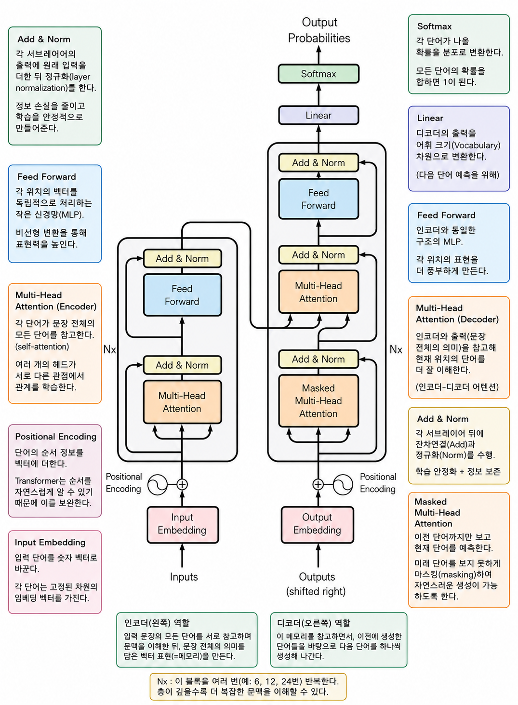

---
## Transformer 란?

> [Attention](./01-attention.md)을 중심으로 문장을 이해하고 생성하는 신경망 구조이다.

기존의 RNN이나 LSTM은 문장을 앞에서부터 하나씩 읽었다.

```
I
↓

I like
↓

I like apples
↓

...
```

즉, 이전 단어를 계산해야 다음 단어를 계산할 수 있었다. 이를 수식으로 나타내면 아래와 같다.

$$h_t = f(x_t, h_{t-1})$$

예를들어, 네 번째 토큰($x_4$)의 계산 결과($h_4$)를 첫 번째 토큰 계산 결과($h_1$)과 동시에 시작할 수 없다. (앞 단계가 끝날 때 까지 기다려야한다.)

그래서
- 병렬처리가 어렵고
- 긴 문장에서 전체 문맥을 잘 기억하지 못했다.

Transformer는 완전히 다른 접근을 했다.

```
I like apples very much
```

라는 문장이 있으면, 모든 단어를 동시에 본다.

그리고 각 단어가 서로를 Self Attention으로 참고한다.
- 원리는 이전 글 [Attention](./01-attention.md) 참고

이전 단어를 계산해야 다음 단어를 계산하는 구조가 아니라, 모든 단어를 '동시에' 서로를 참고하는 구조이므로 '병렬' 처리가 가능하다.

왜냐하면, 입력 행렬 $X$ 전체에 가중치 행렬을 곱해 $Q, K, V$를 한 번에 만들기 때문이다. 이를 수식으로 나타내면 아래와 같다.

$$Q = XW_Q, \quad K = XW_K, \quad V = XW_V$$

- 이때문에, 병렬처리에 능한 GPU가 각광받는 것이다.
- 이에, 단순히 전체 문맥을 더 잘 기억할 뿐만 아니라, 속도도 매우 빨라졌다.
- cf) Multi-Head 는 같은 문장을 '여러 관점(Head)'으로 보기위해 여러 Attention 결과를 하나로 결합한다고 생각하면 된다.

---
## Transformer의 구조



---
### Encoder

> Encoder는 입력 문장을 의미가 담긴 벡터들로 바꾸는 역할이다.

예를들어 아래와 같은 문장이 있다고 하자.

```
I went to the bank.
```

이에 초기 입력은 다음과 같다.
- 물론 토큰은 아래와 같이 단어 단위가 아니며, 단어가 아니라 숫자 벡터이다.
- 이해를 위해 편의상 아래와 같이 나타냈다.

```
# Input Embedding
[I, went, to, the, bank]
```

여기에 Positional Encoding을 더하고 어텐션 과정(Multi Head Attention)을 거친다.

이러면 결과적으로 문맥이 반영된 벡터가 산출된다.
- 이해를 위해 `'` 를 '문맥이 반영된' 으로 나타내겠다.

```
[I', went', to', the', bank']
```

정리하자면, 전체 과정은 다음과 같다.

1. Input Embedding에 Positional Encoding을 더한다.
2. 이후, Multi-Head (Self) Attention을 거친다.
3. Add & Norm (원래 입력을 더하고 정규화)
4. Feed Forward (MLP) 거친다.
5. Add & Norm

---
### Decoder

> Decoder는 Encoder가 이해한 문장을 보고 한 단어씩 생성한다.

위에서의 문장을 한국어로 번역한다고 하면, 아래처럼 한 단어씩 만든다.

```
나는

↓

나는 은행

↓

나는 은행에

↓

나는 은행에 갔다
```

위 구조에서의 Output Embedding 은 생성한 토큰들을 하나씩 넣는 것이다.

> [!question] 그러면 처음에는 넣을 Output Embedding이 없는데?
> - 이를 위한 `<START>` 와 같은 첫 Output Embedding이 있다. 이에, 위 구조에서 'Shifted Right' 라고 적혀있는 것이다.
> - 이에 출력 문장의 마지막 생성 토큰은 `<END>` 와 같은 형태이고, 우리가 보는 출력에서는 이 두개의 토큰을 빼고 보여준다.

정리하자면, 전체 과정은 다음과 같다.

1. Output Embedding에 Positional Encoding을 더한다.
2. Masked Multi-Head (Self) Attention을 거친다. (Masked가 어떤 의미인지는 아래에서 다룬다)
3. Add & Norm
4. Encoder의 결과 벡터와 Decoder의 중간 결과를 Multi-Head (Crossed) Attention을 거친다.
5. Add & Norm
6. Feed Forward (MLP) 거친다.
7. Add & Norm

이후 디코더의 출력을 단어 차원 크기로 변환하고 각 단어가 나올 확률을 분포로 변환한다.

---
### Masked Self Attention

아래와 같은 문장을 만든다고 해보자.

```
나는 은행에 갔다.
```

"은행"을 생성하는 순간 아직 "갔다"는 존재하면 안된다.

따라서, '미래의 토큰을 가린다' 이를 Masked 라고 한다.

이에 Output Embedding 은 아래와 같은 (의미적으로) 순서로 들어간다.

```
<START> 나는

↓

<START> 나는 은행

↓

<START> 나는 은행에

↓

<START> 나는 은행에 갔다
```

> 사실, '추론 시점'에는 어차피 미래 토큰이 없어서 마스킹이 없어도 된다. 
> 마스킹이 꼭 필요한 시점은 '학습 시점'이다.
> 
> 학습할 때는 정답 문장 전체를 한 번에 넣고 모든 위치의 출력을 동시에 계산하는데, 이때 마스킹이 없으면 "은행"을 예측하는 위치에서 정답인 "갔다"를 커닝하게 된다.

---
### Encoder와 Decoder의 Cross Attention의 의미

Encoder의 출력은 각 단어의 문맥 정보가 담긴 벡터이다.

Decoder는 본인의 중간 결과를 Q, Encoder의 출력을 K와 V로 사용한다.

의미적으로는 아래와 같다.

```
지금 "은행"을 번역하려는데

원문 어디를 참고해야 하지? -> Encoder의 출력 참고
```

---
### Feed Forward는 왜 필요한가? (MLP)

Attention은 정보를 모으는 역할이다.

하지만, 그 정보를 충분히 가공하지는 않는다.

그래서 각 토큰마다 작은 신경망 하나를 통과시킨다.

이를 통과시키면서 정보를 더 가다듬는 것이다. -> 이를 Attention처럼 정확히 뭐라고 의미적으로 설명하기는 어렵다. 

---
### Add & Norm 은 왜 있는가?

Attention과 MLP 같은 변환을 여러 번 반복하면 학습이 여려워진다. 왜냐하면, 층이 깊어질수록 원래 정보가 계속 변형된다.

그래서 원래의 정보를 보존하기 위해 입력을 다시 더해준다.

그리고 값으 분포를 안정화하기 위해 Norm(정규화)를 적용하는 것이다.

---
### 최종 출력은 어떻게 단어가 되는가?

마지막 Decoder 출력은 아직 벡터이다.

이 벡터를 Linear Layer에 통과시켜 전체 단어 사전 벡터와 같은 차원으로 맞춰준다.

여기에 Softmax를 적용하면 합이 1인 벡터가 되고, 이는 확률적으로 나타낼 수 있다.

결론적으로 이 결과에서 가장 확률이 높은 단어를 출력하는 것이다.

---
## Transformer의 변형 모델들

| 모델             | Encoder | Decoder | 용도                        |
| -------------- | :-----: | :-----: | ------------------------- |
| BERT           |    O    |    X    | 문장 이해(분류, 질의응답 등)         |
| GPT            |    X    |    O    | 문장 생성                     |

---
## 추천 사이트

> [!tip] Transformer 구조를 정말 잘 보여주는 사이트
> - https://poloclub.github.io/transformer-explainer/
> - 참고로 위 구조는 '디코더'만 사용하는 GPT2 모델 예시라 인코더 부분이 없다.

---
## 레퍼런스

- https://www.youtube.com/watch?v=g38aoGttLhI&t=1222s
- https://www.youtube.com/watch?v=_Z3rXeJahMs&t=358s
- https://www.youtube.com/watch?v=6s69XY025MU&t=1664s