---
## 5. 무중단 배포
### 5.1. Rolling Update는 왜 서비스가 끊기는가?

> [!info] Rolling Update의 문제점 - 왜 순간적으로 서비스가 끊기는 시점이 발생할까?
> Rolling Update는 꽤 잘 설계된 메커니즘이다.
> - Deployment는 새로운 버전으로 Rolling Update를 할 때, 새 Pod가 Ready 상태가 된 것을 확인하고 기존 Pod를 내린다.
>
> 문제점 1 - 'Ready'와 '실제로 요청을 받을 준비가 됐다'는 항상 같지 않다.
> - readinessProbe가 /health에서 200을 돌려주는 순간 Pod는 Ready가 된다.
> - 그러나, 해당 시점에는 커넥션 풀 초기화나 캐시 워밍업이 끝나지 않았을 수 있다.
> - 이에, 첫 요청 몇 개는 느리거나 5xx 응답을 받는다.
>
> 문제점 2 - 더 큰 문제는 '검증 시점'에 있다.
> -  새 버전이 배포되면 즉시 신규 트래픽의 일부가 곧바로 새 버전으로 간다.
> - '먼저 10분 동안 새 버전을 관찰한 다음 괜찮으면 트래픽을 보낸다'는 개념이 없다.
> - 롤백을 결정할 즈음에는 사용자 일부는 이미 문제 버전을 경험한 뒤이다.
> 
> 문제점 3 - 롤백도 느리다.
> - 롤백을 명령했을 때, 그 작업 자체도 Rolling Update로 진행된다. (새 버전 Pod 내리고, 이전 버전 Pod 실행)
> - 이 과정도 수십초가 걸린다.
>   
> 이것이 Blue/Green으로 넘어가는 이유이다.
> - 새 버전을 완전히 띄운 다음 원하는 만큼 확인하고서 트래픽을 한 번에 전환할 수 있다.
> - 문제 발견 시 기존 버전으로 즉시 돌려놓을 수 있다. (기존 버전 Pod가 Green 전환 직후까지 그대로 떠 있기 때문)
> 
> 이 성질을 얻으려면 '트래픽을 어디로 보낼지'를 유연하게 바꿀 수 있어야한다.

---
### 5.2. 외부 트래픽 관리: Gateway API

지금까지는, `kubectl port-forward` 명령어로 접속했다. 실제 서비스라면 외부 IP가 있어야하고, Blue/Grean 배포를 붙이려면 트래픽 경로를 선언적으로 바꿀 수 있는 장치가 필요하다. -> Gateway API
- Ingress의 경우 플랫폼, 인프라, 앱 모든 리소스의 설정을 하나의 리소스에 담아 충돌이 날 위험이 있으며, 어노테이션으로 세부 설정을 조작하므로 구현체마다 구현 방법이 다른 문제점이 있었다.
- 이렇게 외부 진입점의 표준이 Gateway API로 바뀌어가는 추세이며, 이에 Nginx Ingress의 경우 Deprecated 예정이다.

#### 클로드 코드에게 트래픽 관리 도구 물어보기

> Prompt : 지금은 클러스터 안에서만 접근되는데, 외부에서도 API를 호출하려면 어떻게 해?
> 
> AI 사고 흐름 : `CLAUDE.md` -> `CLAUDE.md`의 참조 표 스캔 -> `decision-guides/ch5/5.2-traffic-management.md` -> 해당 문서에 제시된 지식 참고 후 답변

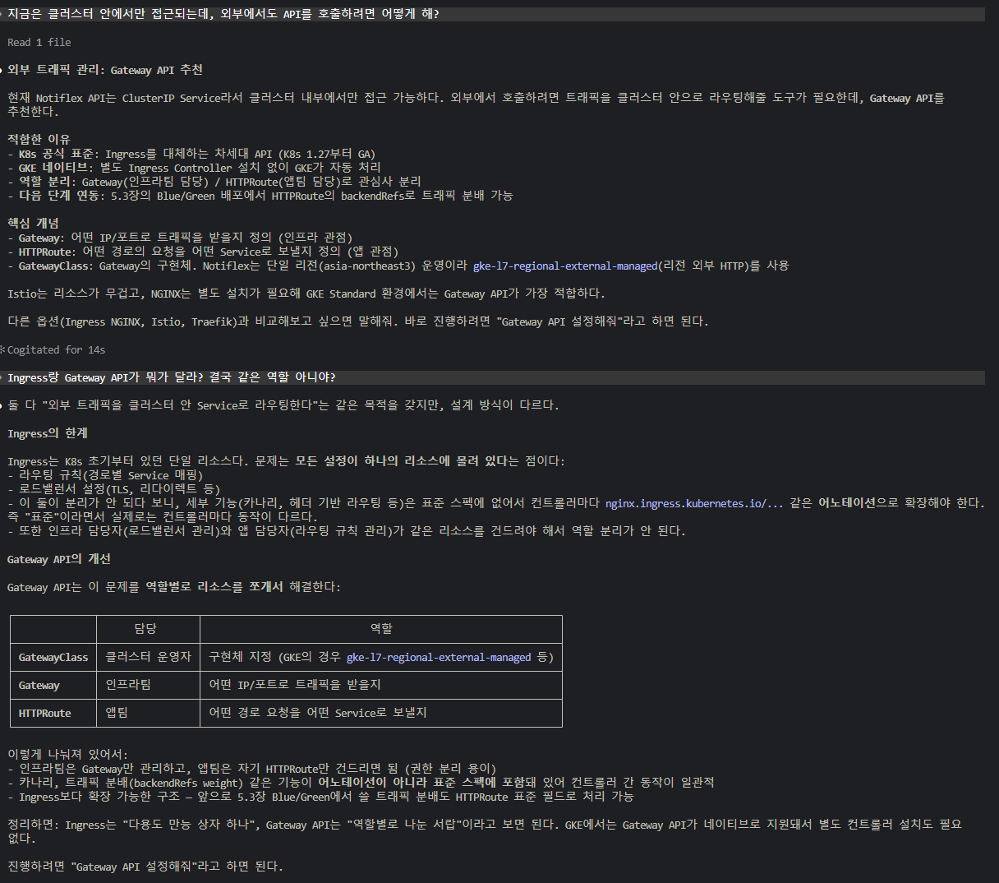

> [!tip] `--gateway-api=standard` 옵션이란? (2.5 챕터에 클러스터 생성시 들어가있었음)
> - GKE가 자동으로 Gateway API CRD와 GKE 전용 GatewayClass들을 설치해주는 옵션이다.
> - 이 옵션 없으면 직접 CRD 설치해야하고, GKE 로드밸런서와 연동되는 Controller도 따로 돌려야 한다.
> - 이 옵션 덕분이 5.2에서는 Gateway API 관련 YAML만 작성하면 된다.

#### 다른 도구는 없는지 비교해보기

> Prompt : 다른 방법도 있다고 했는데, 비교하면 어때?
> 
> AI 사고 흐름 : `CLAUDE.md` -> `CLAUDE.md`의 참조 표 스캔 -> `decision-guides/ch5/5.2-traffic-management.md` -> 해당 문서에 제시된 지식 참고 후 답변

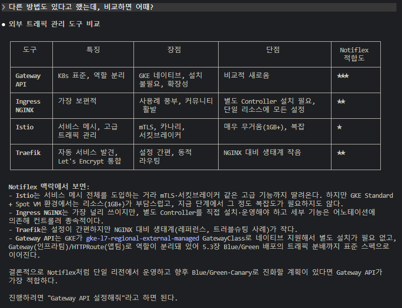

####  Gateway API 설정하기

> Prompt : Gateway API 설정해줘
> 
> AI 사고 흐름 : `CLAUDE.md` -> `CLAUDE.md`의 참조 표 스캔 -> `prompt-guardrails/ch5/5.2-gateway-api.md` -> 해당 문서를 참고해서 진행한다 -> `result-templates/ch5/5.2-gateway-api.md` -> 실제 결과와 결과 템플릿 비교하여 결과 출력

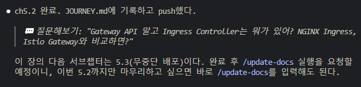

>[!tip] `readinessProbe` 와 `HealthCheckPolicy`의 차이
>- `readinessProbe` : `Pod` 수준에서의 헬스체크, `kubelet`에서 `Pod`가 살아있는지 확인하는 것, yaml 정의는 `Deployment`에서 한다.
>- `HealthCheckPolicy` : 로드밸런서가 백엔드 수준에서 확인하는 헬스체크, GKE 로드밸런서에서 결정하는 헬스체크이다.
> 
> 둘 다 필요하다. 로드밸런서와 `Pod` 사이에 네트워크 구간이 있기 때문에 그 구간까지 포함해서 '진짜 요청을 받을 수 있는가'를 봐야 한다.

---
### 5.3. 무중단 전환: Blue/Green 배포
#### 클로드 코드에게 무중단 배포 도구 물어보기

> Prompt : 배포할 때 서비스가 잠깐이라도 끊길 수 있잖아. 더 안전하게 배포하는 방법 없어?
> 
> AI 사고 흐름 : `CLAUDE.md` -> `CLAUDE.md`의 참조 표 스캔 -> `decision-guides/ch5/5.3-deployment-strategy.md` -> 해당 문서에 제시된 지식 참고 후 답변

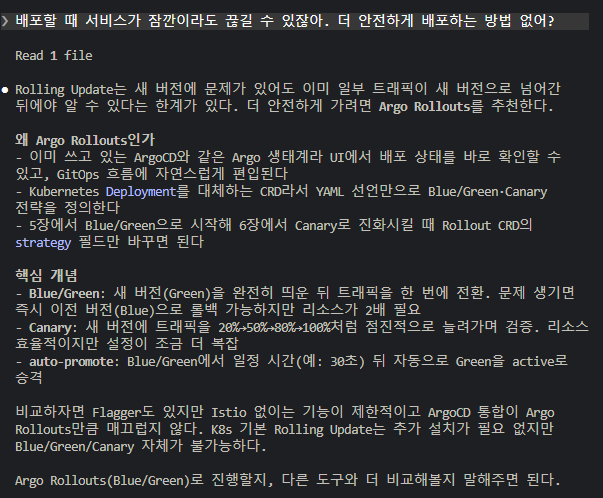

#### 다른 도구는 없는지 비교해보기

> Prompt : Argo Rollouts 말고 다른 건? Flagger나 Istio는 어때?
> 
> AI 사고 흐름 : `CLAUDE.md` -> `CLAUDE.md`의 참조 표 스캔 -> `decision-guides/ch5/5.3-deployment-strategy.md` -> 해당 문서에 제시된 지식 참고 후 답변

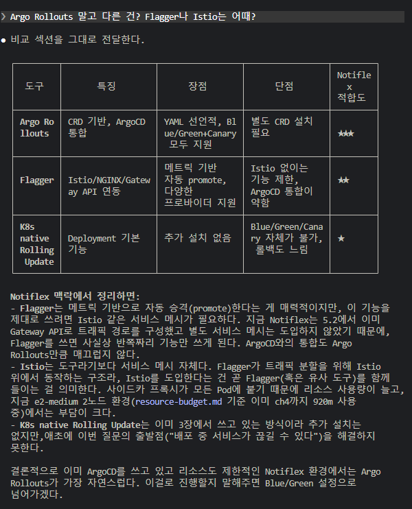

>이러한 이유들로 실습에서 Argo Rollouts와 Blue/Green 전략으로 결정한다. 이후 Blue/Grean이 리소스가 2배로 필요한 단점을 6장에서 Canary로 발전할 예정이다.

#### Blue/Green 배포 설정하기

> Prompt : Blue/Green 배포 설정해줘
> 
> AI 사고 흐름 : `CLAUDE.md` -> `CLAUDE.md`의 참조 표 스캔 -> `prompt-guardrails/ch5/5.3-bluegreen.md` -> 해당 문서를 참고해서 진행한다 -> `result-templates/ch5/5.3-bluegreen.md` -> 실제 결과와 결과 템플릿 비교하여 결과 출력

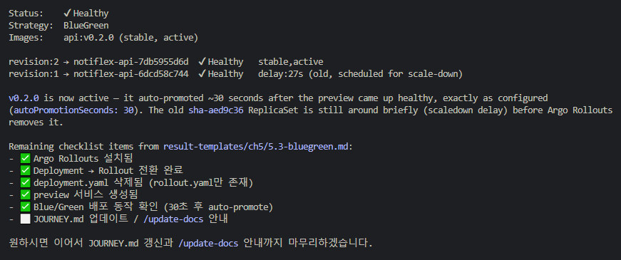

> [!warning] 지속적으로 책에 나온 단계를 1단계씩이 아니라 2, 3단계씩 진행한다. 
> - 5.3.3. 절차를 진행했는데, 5.3.4 단계까지 수행하고 심지어, 5.4.까지 해버릴까? 라고 나에게 물어봄
> - 같은 md 파일에 있는 절차들은 한번에 수행해버리는 일이 잦다.

과정
1. Argo Rollouts Controller 설치
2. kubectl argo rollouts 플러그인 설치
3. Deployment -> Rollout , 리소스 타입 전환
4. preview Service 생성
5. 새 버전(v0.2.0) 빌드 및 Blue/Green 배포 테스트
6. auto-promote 동작 확인

> [!info] `kubectl argo rollouts` 플러그인 이란?
> - Argo Rollouts Controller가 실제 배포를 제어하기 때문에, `kubectl argo rollouts` 플러그인이 필수는 아니다.
> - `kubectl rollout` 명령어는 `Deployment`의 롤링 업데이트를 관리하는 명령어이다.
> - 반면, `kubectl argo rollouts` 플러그인은 Argo Rollouts가 제공하는 `Rollout`, `Experiment`, `AnalysisRun` 같은 커스텀 리소스를 관리하고, 카나리, 블루/그린 배포의 보기 좋게 표시하고, 승인, 중단, 재시도 같은 작업을 수행하는 명령어를 날릴 수 있다.
> - `Argo Rollouts CLI`를 따로 만들지 않고, `kubectl` 플러그인으로 사용되는 이유는, `Argo Rollouts`는 기존 `kubectl` 워크플로우를 대체하는 게 아니라 확장하는 철학이기 때문이다.

> [!warning] `deployment.yaml` -> `rollout.yaml`
> - `deployment.yaml`과 `rollout.yaml`이 동시에 존재하면 ArgoCD가 양쪽 모두 배포하여 Pod가 중복 생성된다.
> 
> 차이점
> - `apiVersion`: `apps/v1` -> `argoproj.io/v1alpha1` (CRD는 각 프로젝트에서 자체적으로 관리하기 때문에, 안정성과 별개이다)
> - `kind`: `Deployment` -> `Rollout`
> - `strategy`에 `blueGreen` 혹은 `canary` 지정
> 
> Blue/Green 전략의 핵심 설정
> - `activeService`: 현재 트래픽을 받는 `Service`
> - `previewService`: 새 버전을 미리 확인할 수 있는 `Service`
> - `autoPromotionEnabled: true`: 자동 승격 활성화 (프로덕션 초기에는 `false`로 시작하는게 좋음, 어느 정도 신뢰가 쌓이면 `auto-promote`로 전환하거나, 6장에서 다룰 `AnalysisRun`을 붙여서 메트릭 기반 자동 판정으로 넘어간다)
> - `autoPromotionSeconds: 30`: 30초 후 자동으로 Green을 Active로 전환

---
### 5.4. 마무리: 아키텍처 결정 기록하기
#### 아키텍처 결정을 기록해야하는 이유

> [!tip] 아키텍처 결정을 기록해야하는 이유
> - 코드와 매니페스트는 '무엇을' 했는지 보여주지만 '왜'는 보여주지 못한다.
> - 시간이 지나거나 새 팀원이 합류하면 'Ingress 두고 왜 Gateway API를 썼지?' 같은 질문이 반드시 나온다.
> - 영구 기록이자 팀의 기록이 되어야 하므로 깃 저장소 안에 둔다.
> - AWS나 Azure 등 글로벌 기업에서 권장하는 패턴이 ADR(Architecture Decision Records)이다.

> Prompt : 이번 장의 아키텍처 결정을 ADR로 기록해줘. 이전 3장과 4장에서도 결정한 것들이 있으니 함께 시간 순서로 정리해줘
> 
> AI 사고 흐름 : `CLAUDE.md` -> `CLAUDE.md`의 참조 표 스캔 -> `prompt-guardrails/ch5/5.4-adr.md` -> 해당 문서를 참고해서 진행한다 -> `result-templates/ch5/5.4-adr.md` -> 실제 결과와 결과 템플릿 비교하여 결과 출력

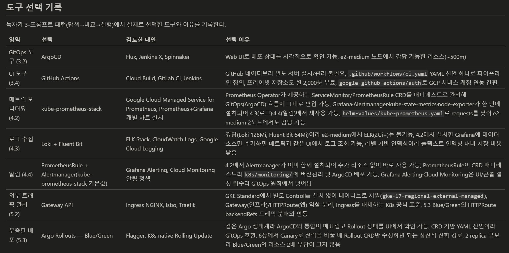

#### 남아있는 문제점

1. `/id` 엔드포인트는 접속할 때 마다 인메모리로 counter를 1씩 올리는 API이다.
	- 여러 `Pod`가 이 값을 공유하는 것이 아니라, 인메모리이므로 새로고침 하다보면 다른 `Pod`로 접속이 되어 이 값이 왔다갔다 한다.
	- 즉, 이 값을 공유하고 있지 않는 것이 문제이다.
2. Blue/Green은 좋지만 리소스 2배가 필요한 점이 좀 아쉽다.

> 위 문제점 들을 6장에서 해결할 것이다.

---
## 6. 엔터프라이즈를 위한 기반 정비
### 6.1. Pod 간 상태 공유: Valkey 캐시
#### 클로드 코드에게 캐시 도구 물어보기

> Prompt : Pod가 여러 개인데 데이터를 어떻게 공유해?
> 
> AI 사고 흐름 : `CLAUDE.md` -> `CLAUDE.md`의 참조 표 스캔 -> `decision-guides/ch6/6.1-cache.md` -> 해당 문서에 제시된 지식 참고 후 답변

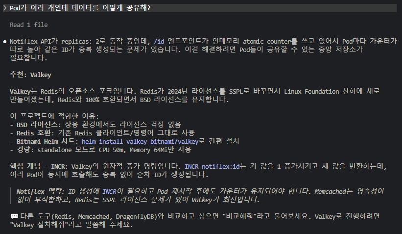

> Prompt : 레디스를 많이 쓰는데 Valkey는 처음 들어봐. 다른 방법도 있다고 했는데, 비교하면 어때?
> 
> AI 사고 흐름 : `CLAUDE.md` -> `CLAUDE.md`의 참조 표 스캔 -> `decision-guides/ch6/6.1-cache.md` -> 해당 문서에 제시된 지식 참고 후 답변

#### 다른 도구는 없는지 비교해보기

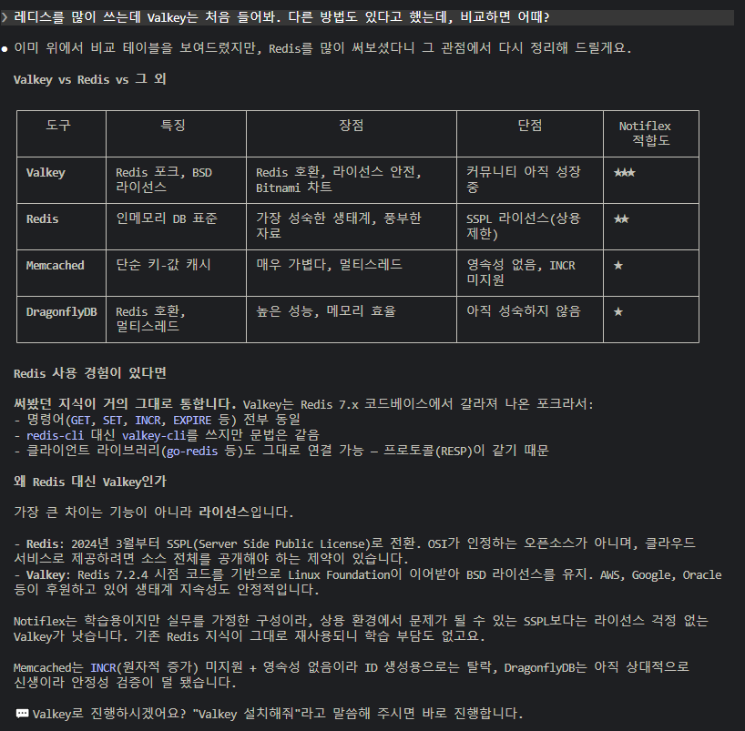

#### Valkey 설치하고 앱 연동하기

> Prompt : Valkey 설치해줘.
> 
> AI 사고 흐름 : `CLAUDE.md` -> `CLAUDE.md`의 참조 표 스캔 -> `prompt-guardrails/ch6/6.1-valkey.md` -> 해당 문서를 참고해서 진행한다 -> `result-templates/ch6/6.1-valkey.md` -> 실제 결과와 결과 템플릿 비교하여 결과 출력

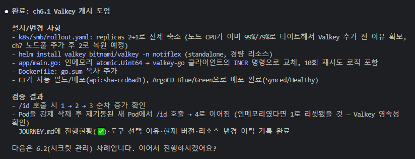

이후 `/id` 엔드포인트로 여러번 새로고침 해보면, 이전처럼 Pod 끼리 값이 공유가 되지 않는 것이 아니라 일정하게 계속 값이 올라가는 것을 볼 수 있다.

> [!tip] Valkey 재시도 로직에서 10회, 3초 간격은 어떻게 정한거야?
> - 정해진 정답은 없지만, k8s 환경에서 일반적으로 쓰는 기준이 있다. (3초)
> - Valkey Pod가 Ready 상태까지 걸리는 시간이 보통 5~15초이다.
> - 1초는 너무 불필요한 연결 시독 많고 10초 간격이면 Valkey가 이미 준비된 후에도 오래 기다린다.

> [!warning] 여기서 문제가 생긴다. `Secret`
> - 책에서는 5장 마지막에 시크릿 문제가 있다고 하지만, 실제로 해당 시점에 `Secret` 리소스는 없다.
> - 지금 여기 Valkey를 설치하고 Valkey Password를 앱 안에 주입하려고 `Secret`을 사용한다. (kubernetes Secret 리소스 안에 값들은 그냥 base64로 인코딩 된 값)
> - 여기서 해당 Password를 yaml에 하드코딩한다. (base64로 인코딩되긴 하지만, 이건 누구나 디코딩할 수 있는 값이다)
> - 이에 이는 해결해야하는 문제이다.

---
### 6.2. 시크릿 관리: Gogle Secret Manager
#### 클로드 코드에게 시크릿 관리 방법 물어보기

> Prompt : 시크릿을 안전하게 관리하려면 어떻게 해?
> 
> AI 사고 흐름 : `CLAUDE.md` -> `CLAUDE.md`의 참조 표 스캔 -> `decision-guides/ch6/6.2-secret-management.md` -> 해당 문서에 제시된 지식 참고 후 답변

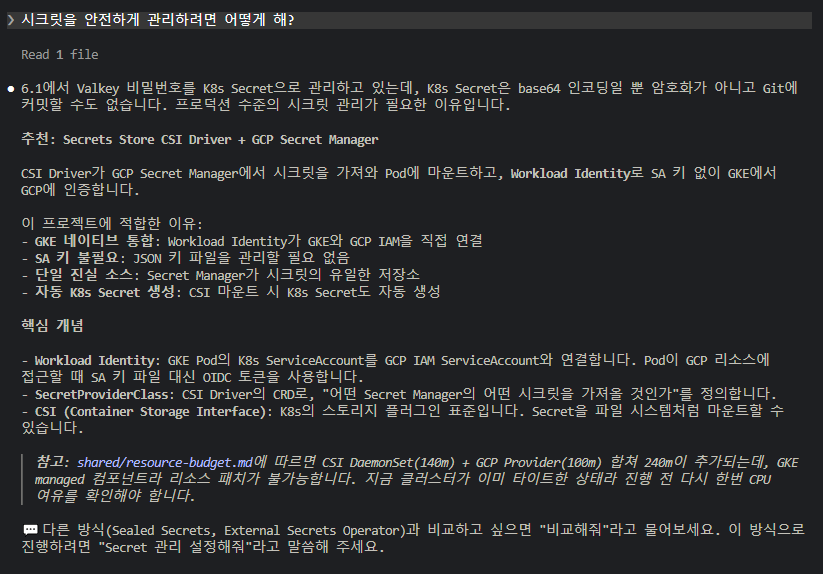

> [!tip] Google Secret Manager + CSI Driver 조합 동작 방식
> Google Secret Manager -> CSI Driver -> Pod Volume Mount

> [!tip] 새롭게 알게된 것 (External Secret Operator vs CSI Driver)
> 나는 기존에 홈랩을 운영할 때 External Secret Operator로 외부 시크릿 저장소, 혹은 내부 Vault 에서 주입받았다.
> -> 결국 주입을 받아서 yaml로 남지는 않지만 클러스터 내부에 Secret 리소스가 생성되며 Secret에 접근할 수 있는 User라면 Secret을 볼 수 있다.
> 
> CSI Driver는 Pod 내부에 파일 형태로 주입된다.
> -> Secret 리소스는 남지 않지만 Pod안에 파일 형태로 남긴한다. Pod 내부에 exec할 수 있는 User라면 볼 수 있다.
> 
> 무슨 차이가 있을까? 실습 중 클로드 코드에게 그대로 물어봤다.
> 
> 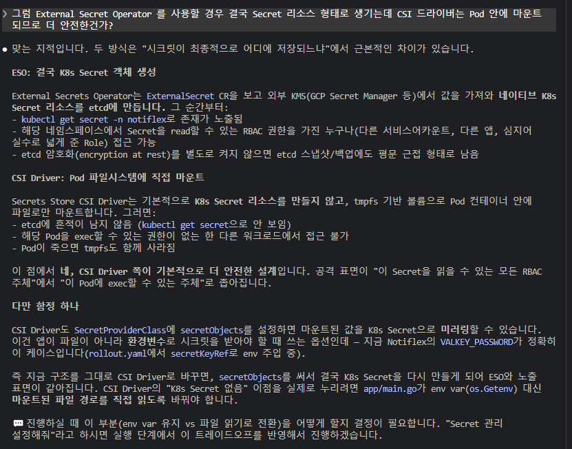
> 
> 뭐가 더 안전하다라는 느낌보다는 어떤 RBAC를 가진 User가 접근할 수 있느냐에 차이가 있다.
> 
> 책에서 계속 적용하고 있는 이러한 과정을 실제 의문이 들어 물어보니 뭔가 배운 것을 적용한 것 같아 뿌듯하다.

#### 다른 도구는 없는지 비교해보기

> Prompt : 다른 방법도 있다고 했는데, 비교하면 어때?
> 
> AI 사고 흐름 : `CLAUDE.md` -> `CLAUDE.md`의 참조 표 스캔 -> `decision-guides/ch6/6.2-secret-management.md` -> 해당 문서에 제시된 지식 참고 후 답변

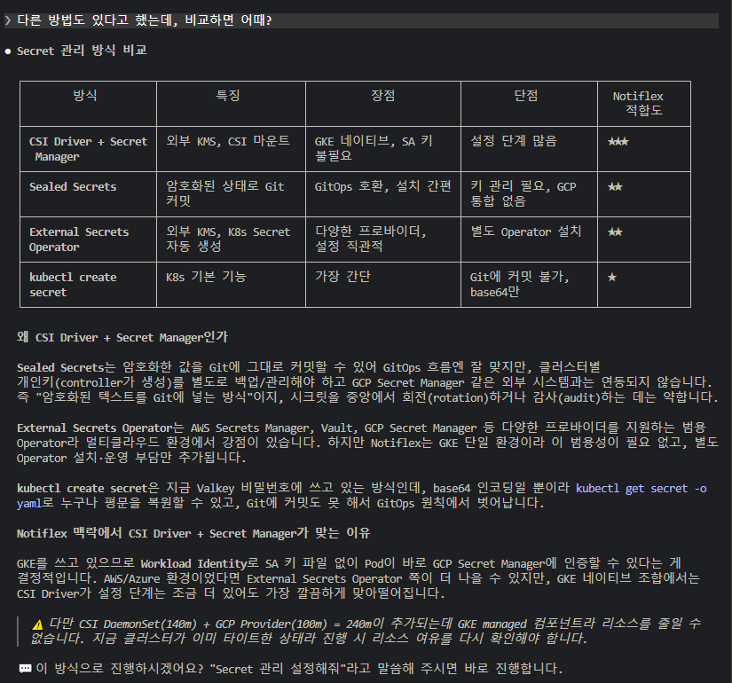

---
#### Secret Manager 설정하기

> Prompt : Secret 관리 설정해줘
> 
> AI 사고 흐름 : `CLAUDE.md` -> `CLAUDE.md`의 참조 표 스캔 -> `prompt-guardrails/ch6/6.2-secret.md` -> 해당 문서를 참고해서 진행한다 -> `result-templates/ch6/6.6-secret.md` -> 실제 결과와 결과 템플릿 비교하여 결과 출력

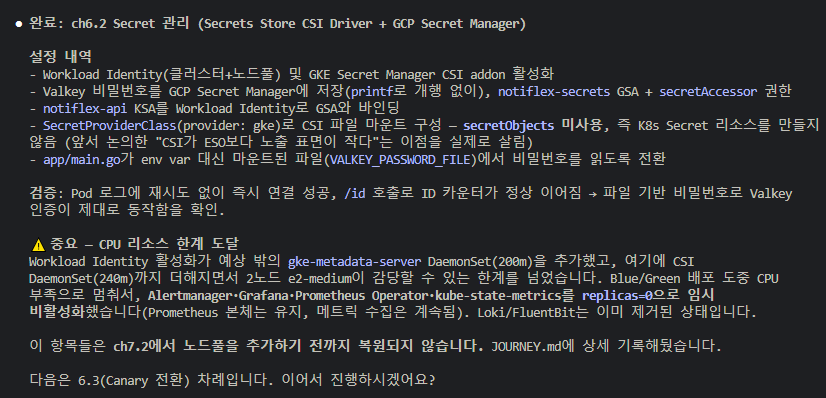

> [!info] CSI Driver가 노드에 끼치는 영향
> CSI addon 활성화 시 노드당 2개의 DaemonSet이 자동 배포된다.
> - `csi-secrets-store-gke`: Secret Manager에서 시크릿을 가져오는 드라이버
> - `csi-secrets-store-provider-gke`: GKE 전용 인증 처리기
> 
> 2노드 기준으로 약 240m CPU가 추가로 필요하다. 그래서 앞에서 Prometheus와 Alertmanager의 CPU requests를 최소화한 것이다.

---
### 6.3. 점진적 배포: Canary
#### 클로드 코드에게 더 안전한 배포 방법 물어보기 & 다른 도구 비교

> Prompt : Blue/Green 말고 더 안전한 배포 방법 없어? 새 버전에 트래픽을 조금씩 보내는 방법 말이야.
> 
> AI 사고 흐름 : `CLAUDE.md` -> `CLAUDE.md`의 참조 표 스캔 -> `decision-guides/ch6/6.2-secret-management.md` -> 해당 문서에 제시된 지식 참고 후 답변
> 
> 다음 다른 도구 추천까지 여기서 출력이 나와버림

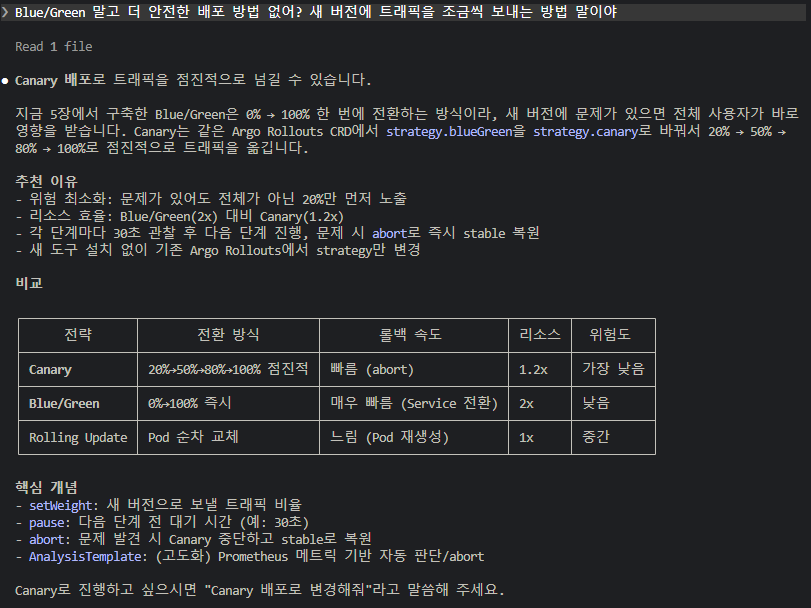

#### 의문점

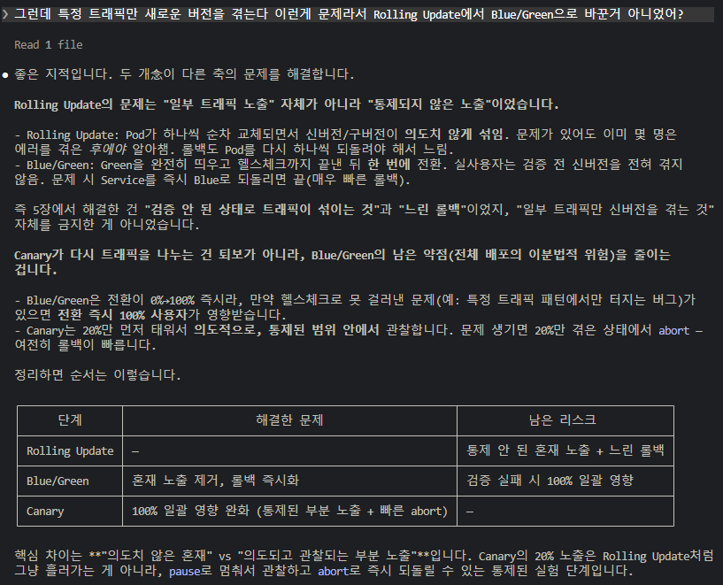

#### Canary 배포 설정하기

> Prompt : Canary 배포로 변경해줘
> 
> AI 사고 흐름 : `CLAUDE.md` -> `CLAUDE.md`의 참조 표 스캔 -> `prompt-guardrails/ch6/6.3-canary.md` -> 해당 문서를 참고해서 진행한다 -> `result-templates/ch6/6.3-canary.md` -> 실제 결과와 결과 템플릿 비교하여 결과 출력

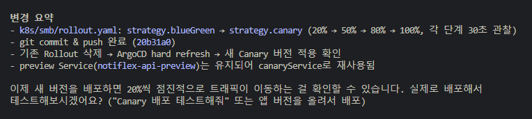

---
### 6.4. 마무리: claude-context/로 현재 아키텍처 정리하기

> Prompt : claude-context/에 현재 아키텍처 상태를 정리해줘. 어떤 컴포넌트가 있고, 어떻게 연결되어 있고 그리고 어떤 설정을 사용하는지 기록해줘.
> 
> AI 사고 흐름 : `CLAUDE.md` -> `CLAUDE.md`의 참조 표 스캔 -> `prompt-guardrails/ch6/6.3-canary.md` -> 해당 문서를 참고해서 진행한다 -> `result-templates/ch6/6.3-canary.md` -> 실제 결과와 결과 템플릿 비교하여 결과 출력

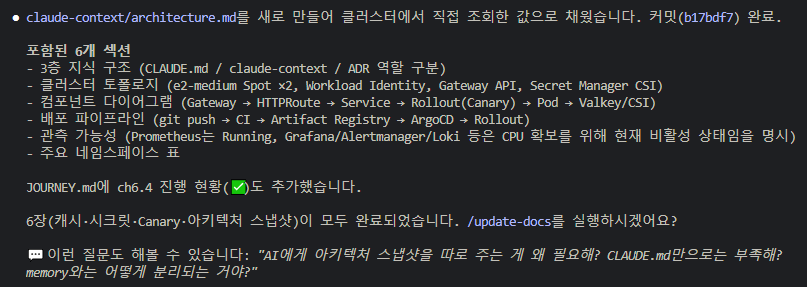

#### 정리된 지식 계층

| 파일 | 역할 | 로드 시점 |
|---|---|---|
| `CLAUDE.md` | 항상 지켜야 할 규칙 | 매 세션 전문 로드 |
| `.claude/memory/` | 개별 결정의 이유와 작업 컨텍스트 | 인덱스만 로드, 필요할 때 참조 |
| `claude-context/` | 현재 아키텍처의 전체 그림 | `CLAUDE.md`에서 참조 시 로드 |

- `CLAUDE.md` - 팀의 코딩 컨벤션 문서. 새 멤버가 오면 첫날에 읽는다.
- `.claude/memory/` - 개인 노트. '왜 Valkey를 골랐지?'와 같은 결정 이유를 적어 둔다. (나만 봄, 로컬에 존재함)
- `claude-context/` - 시스템 구성도

---
### 느낀점

확실히, 공부 목적을 바꾸니, 더 머리에 잘 들어온다. 유연한 조직의 변화 과정을 빠르게 간접 경험하는 것 같다.

이전에 여러 기술에 대해 혼자 공부하면서 들었던 의문(Secret, Canary)들도 해결된게 좀 있어서 뿌듯하다.