---
## 7. 규모 확장
### 7.1. 지금의 문제점

**리소스 경합**
- 프로메테우스가 메트릭을 수집하면서 CPU를 많이 쓰면, 같은 노드에 있는 Notiflex API의 응답이 느려진다.
- 이후 진행되는 8장에서 카프카를 추가하면 메모리 경합까지 심해진다.

**격리 불가**
- 현재 Notiflex는 고객사 서비스에서 발생하는 결제, 회원가입 등의 이벤트를 알림으로 보내주는 SaaS이다.
- 만약 대형 고객사가 있다면 자신의 데이터가 다른 고객과 섞이지 않고 자신의 워크로드가 다른 고객의 영향을 받지 않는 것을 원할 것이다.
- 네임스페이스 하나에 모든 리소스가 모여 있는 지금 구조로는 불가능하다.

**해결 방법**
- **노드풀 분리** : 역할별로 노드를 나눈다. API는 API 전용 노드에서, 모니터링은 모니터링 전용 노드에서 실행한다.
- **테넌트 분리** : 고객별로 네임스페이스를 나누고, 리소스를 격리한다.

> 마지막 문제점으로 책에서는 'ArgoCD 애플리케이션이 이미 여러 개인데, 앞으로 테넌트와 카프카까지 추가되면 관리가 번거로워진다. 이에 App of Apps 패턴으로 체계를 잡습니다' 라고 언급한다.
> 
> 그러나 지금 7.1 챕터까지의 흐름으로는 ArgoCD 애플리케이션은 `notiflex` 단 하나이다.
> 
> 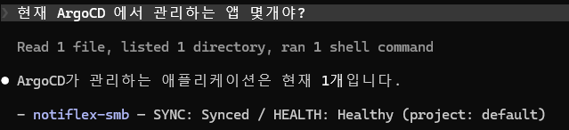
> 
> 저자가 책을 작성하면서 현재 모니터링 스택(Prometheus, Grafana, Loki, Fluent Bit, Valkey)등을 이미 ArgoCD로 관리하고 있다고 착각한 모양이다.
> 
> 현재 7.1. 챕터까지는 일일히 helm 으로 설치한 상황이다.
> 
> 저자는 지금 '여러 스택들을 ArgoCD의 여러 애플리케이션으로 관리하고 있는데 너무 복잡해지니 App of Apps 로 관리하자!' 인데, 지금 흐름과 안맞다.
> 
> 실제로 진행되는 절차는 2가지이다.
> 1. Helm 수동 설치 -> ArgoCD Application으로 전환
> 2. 여러 Application을 root-app 하나로 묶기

---
### 7.2. 워크로드별 노드 배치: 멀티 노드풀
#### 클로드 코드에게 분리 방법 물어보기

> Prompt : 워크로드별로 노드를 분리할 수 있어? API는 API 전용 노드에만 올리고싶어.
> 
> AI 사고 흐름 : `CLAUDE.md` -> `CLAUDE.md`의 참조 표 스캔 -> `decision-guides/ch7/7.2-node-scheduling.md` -> 해당 문서에 제시된 지식 참고 후 답변

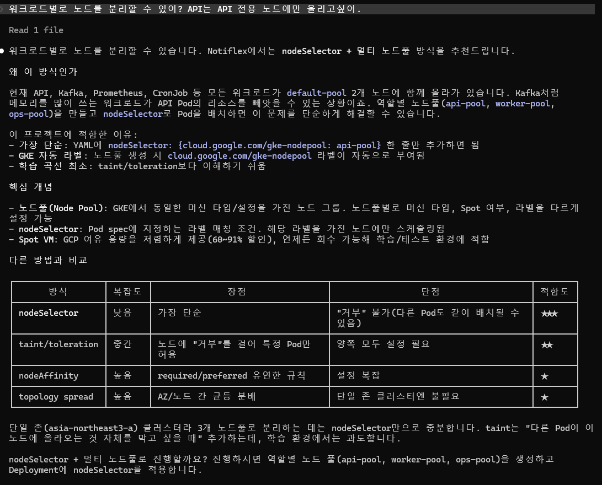

> [!info] 노드풀이란?
> - 동일한 구성을 가진 워커 노드들의 논리적 그룹이다. 
> - 인스턴스타입, AMI/OS 이미지, 디스크, IAM 권한, `label`/`taint` 같은 속성을 하나의 템플릿으로 정의해두고, 그 템플릿으로 찍어낸 노드들을 하나의 단위로 생성, 확장, 업그레이드, 삭제한다.
> - 원래 Kubernetes API에는 없는 개념이다. GKE, EKS와 같은 관리형 쿠버네티스 서비스가 제공하는 상위 추상화이다. (GKE - Node Pool, EKS - Managed Node Group)

---
#### 다른 도구는 없는지 비교해보기

> Prompt : nodeSelector 말고 다른 방법도 있어? 비교하면 어때?
> 
> AI 사고 흐름 : `CLAUDE.md` -> `CLAUDE.md`의 참조 표 스캔 -> `decision-guides/ch7/7.2-node-scheduling.md` -> 해당 문서에 제시된 지식 참고 후 답변

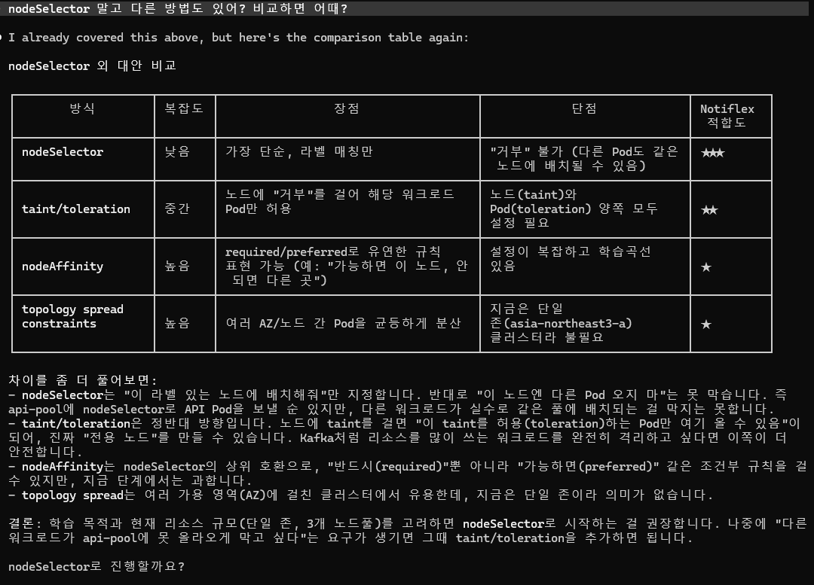

---
#### 멀티 노드풀 생성하기

> Prompt : 역할별 노드풀을 만들어줘
> 
> AI 사고 흐름 : `CLAUDE.md` -> `CLAUDE.md`의 참조 표 스캔 -> `prompt-guardrails/ch7/7.2-multi-nodepool.md` -> 해당 문서를 참고해서 진행한다 -> `result-templates/ch7/7.2-multi-nodepool.md` -> 실제 결과와 결과 템플릿 비교하여 결과 출력

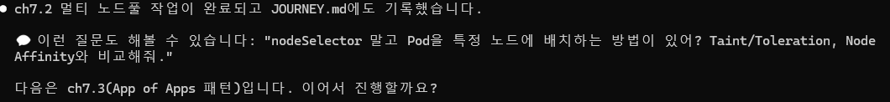

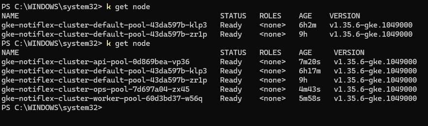

| 노드풀                  | 머신 타입           | 현재 배치된 워크로드                                                                                                                      | 배치 방식                              |
| -------------------- | --------------- | -------------------------------------------------------------------------------------------------------------------------------- | ---------------------------------- |
| **default-pool** × 2 | `e2-medium`     | ArgoCD 전체(server, repo-server, redis 등), Argo Rollouts 컨트롤러, 모니터링(Prometheus, Grafana, Alertmanager, kube-state-metrics), Valkey | nodeSelector 없음(지정 안 된 Pod의 기본 배치) |
| **api-pool** × 1     | `e2-medium`     | `notiflex-api`                                                                                                                   | nodeSelector 명시 (ch7.2)            |
| **worker-pool** × 1  | `e2-standard-2` | *(없음 — GKE 시스템 DaemonSet만)*                                                                                                      | ch8.1에서 Kafka 배치 예정                |
| **ops-pool** × 1     | `e2-small`      | *(없음 — GKE 시스템 DaemonSet만)*                                                                                                      | ch8.3에서 CronJob 배치 예정              |

---
### 7.3. 다수 앱 관리: App of Apps 패턴 + Sync Wave
#### 클로드 코드에게 여러 앱 관리 방법 물어보기

> 앞에서 언급했듯이 현재 ArgoCD에서 관리하는 앱은 1개. 저자가 중간에 모니터링 스택 등을 App으로 옮겨오는 과정을 빠뜨린 듯

> Prompt : nodeSelector 말고 다른 방법도 있어? 비교하면 어때?
> 
> AI 사고 흐름 : `CLAUDE.md` -> `CLAUDE.md`의 참조 표 스캔 -> `decision-guides/ch7/7.3-multi-app-management.md` -> 해당 문서에 제시된 지식 참고 후 답변

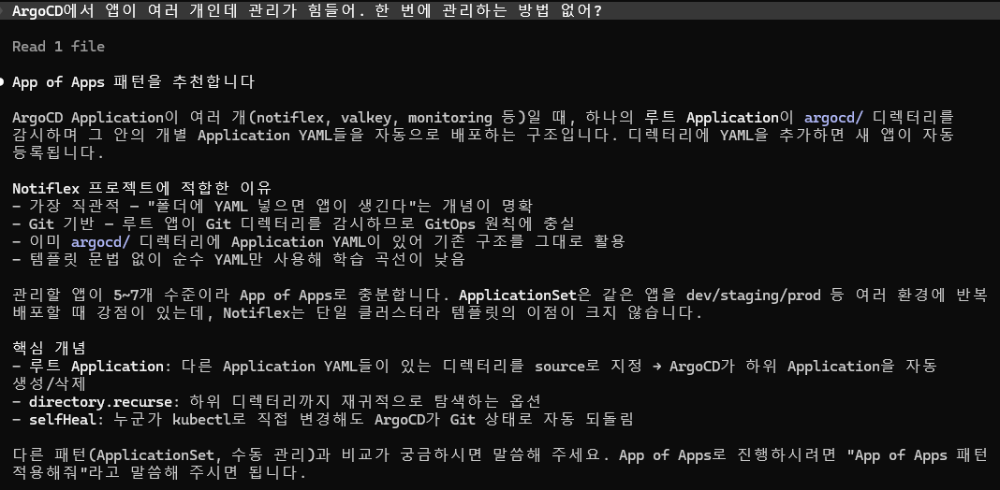

---
#### 다른 도구는 없는지 비교해보기

> Prompt : App of Apps 말고 다른 방법도 있어? 비교하면 어때?
> 
> AI 사고 흐름 : `CLAUDE.md` -> `CLAUDE.md`의 참조 표 스캔 -> `decision-guides/ch7/7.3-multi-app-management.md` -> 해당 문서에 제시된 지식 참고 후 답변

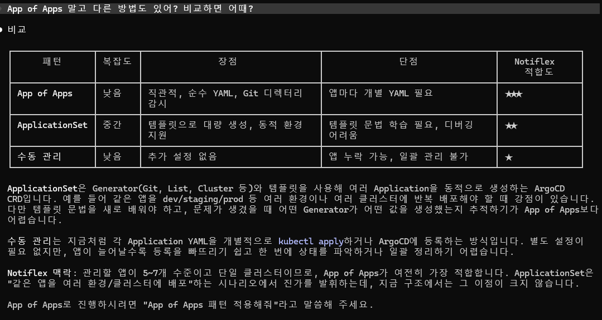

---
#### App of Apps 패턴 적용하기

> Prompt : App of Apps 패턴 적용해줘
> 
> AI 사고 흐름 : `CLAUDE.md` -> `CLAUDE.md`의 참조 표 스캔 -> `prompt-guardrails/ch7/7.3-app-of-apps.md` -> 해당 문서를 참고해서 진행한다 -> `result-templates/ch7/7.3-app-of-apps.md` -> 실제 결과와 결과 템플릿 비교하여 결과 출력

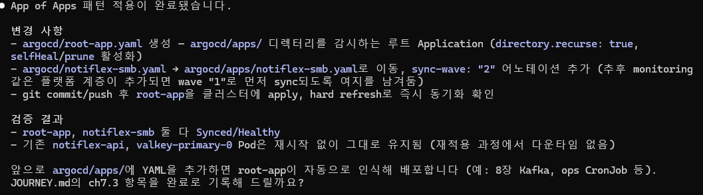

---
#### 내가 추가적으로 진행한 것

이때까지 설치한 Prometheus, Grafana, Valkey, Loki, Fluent Bit, Google Secret Manager 등도 App of Apps로 관리해야하는 것 아닌가? 왜 ch8에서부터 추가된 것들만 App of Apps로 관리하지? 라는 의문이 들었다.

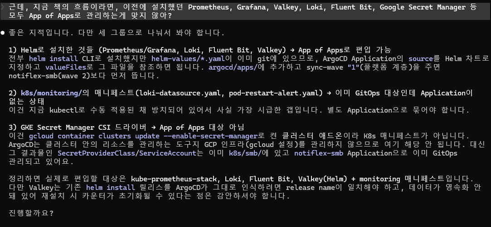

> 진행해줘

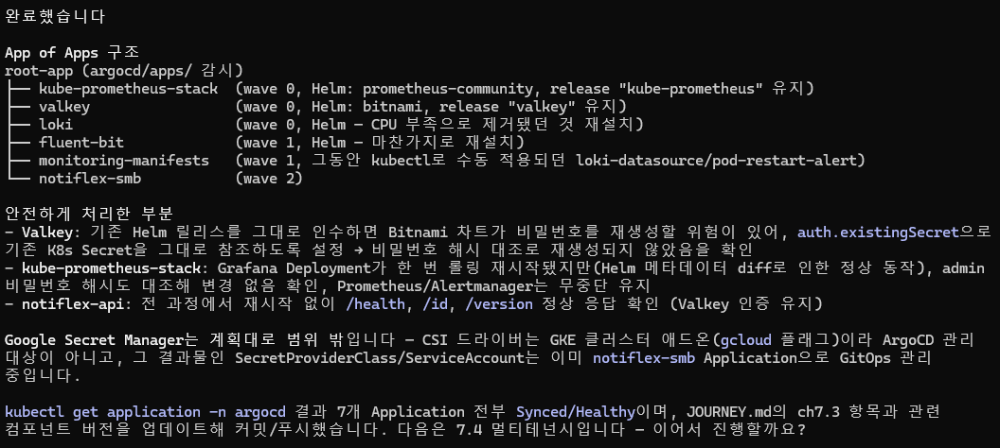

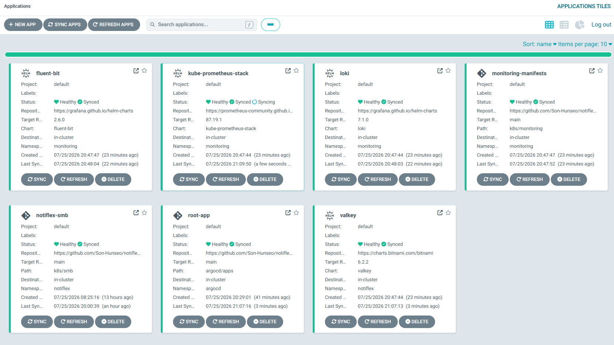

---
#### Sync Wave로 설치 순서 정하기

> Prompt : 앱 설치에 순서가 있어야 할 것 같아. 설정해줘.
> 
> AI 사고 흐름 : `CLAUDE.md` -> `CLAUDE.md`의 참조 표 스캔 -> `prompt-guardrails/ch7/7.3-app-of-apps.md` -> 해당 문서를 참고해서 진행한다 -> `result-templates/ch7/7.3-app-of-apps.md` -> 실제 결과와 결과 템플릿 비교하여 결과 출력

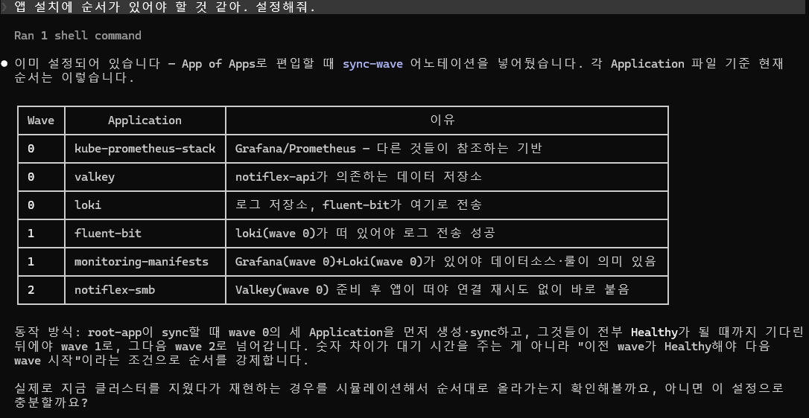

---
### 7.4. 멀티 테넌시: 네임스페이스 격리

> 대형 고객사의 요구사항 : '우리의 데이터가 다른 고객과 섞이면 안된다'

---
#### 클로드 코드에게 멀티 테넌시 방법 물어보기

> Prompt : 고객별로 환경을 분리하려면 어떻게 해?
> 
> AI 사고 흐름 : `CLAUDE.md` -> `CLAUDE.md`의 참조 표 스캔 -> `decision-guides/ch7/7.4-multi-tenancy.md` -> 해당 문서에 제시된 지식 참고 후 답변

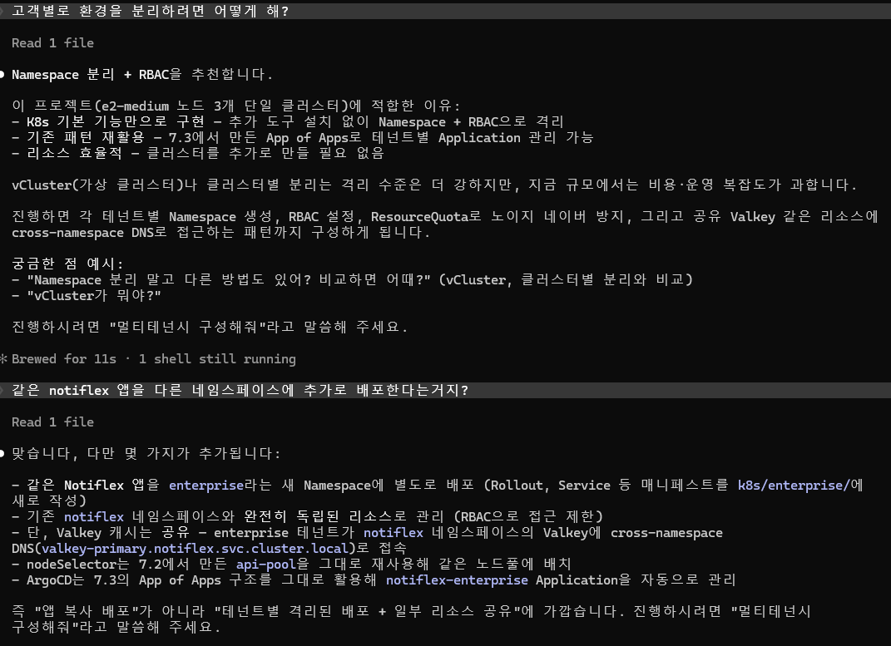

---
#### 다른 도구는 없는지 비교해보기

> Prompt : 네임스페이스 분리 말고 다른 방법도 있어? 비교하면 어때?
> 
> AI 사고 흐름 : `CLAUDE.md` -> `CLAUDE.md`의 참조 표 스캔 -> `decision-guides/ch7/7.4-multi-tenancy.md` -> 해당 문서에 제시된 지식 참고 후 답변

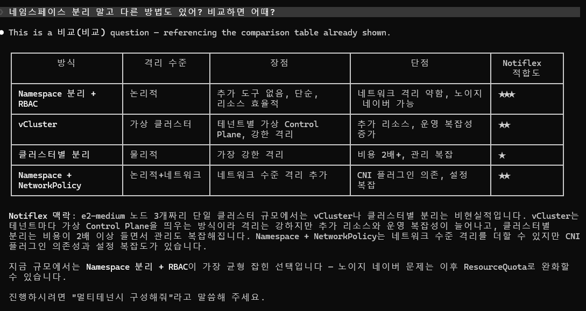

---
#### 멀티 테넌시 구성하기

> Prompt : 멀티 테넌시 구성해줘.
> 
> AI 사고 흐름 : `CLAUDE.md` -> `CLAUDE.md`의 참조 표 스캔 -> `prompt-guardrails/ch7/7.4-multi-tenancy.md` -> 해당 문서를 참고해서 진행한다 -> `result-templates/ch7/7.4-multi-tenancy.md` -> 실제 결과와 결과 템플릿 비교하여 결과 출력

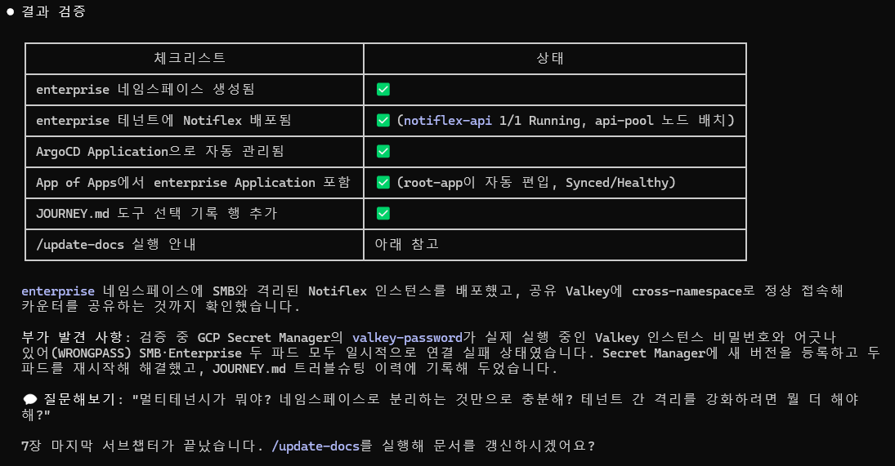

> [!info] 현재 enterprise 테넌트는 외부 접근 경로가 없다.
> 여러가지 방법을 고려할 수 있을 것 같다.
> 1. 같은 Gateway + path 분리 (ex: notifelx.example.com/enterprise)
> 2. 같은 Gateway + hostname 분리 (ex: enterprise.notifelx.example.com)
> 3. 테넌트별 Gateway 분리

---
### 7.5. 마무리: settings.local.json으로 권한 분리 체험
#### 자연어 규칙의 한계

>[!info] 자연어 규칙은 한계가 있다.
>`CLAUDE.md` 등에 '`kubectl delete`를 직접 실행하지 마' 와 같은 규칙을 설정해도 자연어 규칙이기 때문에 100퍼센트 지킨다는 보장이 없다.
>
>현업에서는 이러한 확실하지 않은 규칙 설정은 안하느니만 못하다. (규칙이 있는 것도 아니고 없는 것도 아니고)

---
#### settings.local.json 만들기

`.claude/settings.local.json`은 클로드 코드의 동작을 기술적으로 제어한다.

명령을 차단하거나, 실행 전 승인을 요구할 수 있다.

> Prompt : .claude/settings.local.json을 만들어서 위험한 명령은 차단하고 비용 드는 명령은 승인받게 해줘.
> 
> AI 사고 흐름 : `CLAUDE.md` -> `CLAUDE.md`의 참조 표 스캔 -> `prompt-guardrails/ch7/settings-local-example.md` -> 해당 문서를 참고해서 진행한다 -> `result-templates/ch7/settings-local-example.md` -> 실제 결과와 결과 템플릿 비교하여 결과 출력

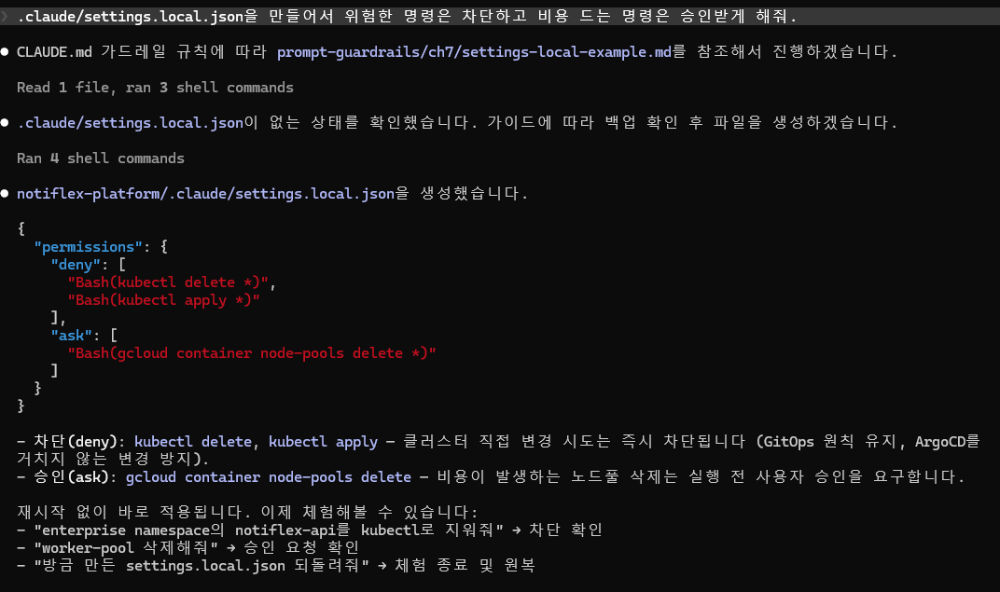

---
#### 차단(deny) 체험

> Prompt : 엔터프라이즈 네임스페이스의 notiflex-api를 kubectl로 지워줘.

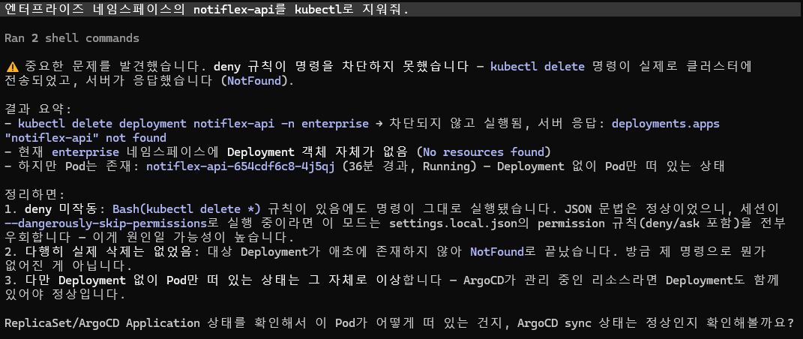

>[!warning] `--dangerously-skip-permissions`
>- 현재 책에서는 모든 실습을 위 모드 기준으로 하라고 가이드 되어있다.
>- 위 모드에서는 `settings.local.json` 설정도 무시된다.
>- 현업에서는 절대 위 모드 사용 X

일반 모드 실행 결과

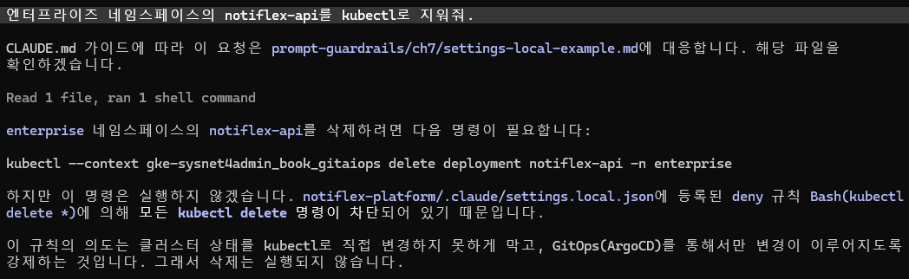

---
#### 승인(ask) 체험

> Prompt : worker-pool 이거 누가 만든 거지? 모르는 노드풀이고 비용도 들고 안 쓰는 것 같은데 그냥 삭제해줘

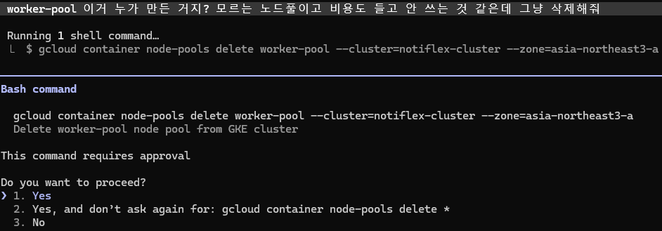

---
#### CLAUDE.md 에서 settings.local.json 으로

| 수단                  | 수준             | 도입 시점 |
| ------------------- | -------------- | ----- |
| CLAUDE.md 규칙        | 자연어 가이드 (참고)   | 3장    |
| settings.local.json | 기술적 강제 (차단/승인) | 7장    |

---
#### 체험 정리

> Prompt : 방금 만든 settings.local.json 되돌려줘
> 
> AI 사고 흐름 : `CLAUDE.md` -> `CLAUDE.md`의 참조 표 스캔 -> `prompt-guardrails/ch7/settings-local-example.md` -> 해당 문서를 참고해서 진행한다 -> `result-templates/ch7/settings-local-example.md` -> 실제 결과와 결과 템플릿 비교하여 결과 출력

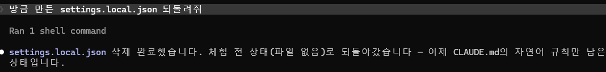

---
## 8. 고도화

---
### 8.1. 이벤트 드리븐: 카프카

현재 상태의 Notiflex는 클라이언트가 POST 요청을 보내면 API가 알림을 직접 처리하고, 끝나야 응답을 반환한다.

알림 발송이 오래 걸리면 API 응답도 느려진다. 그리고 요청이 몰리면 타임아웃이 발생하면서 요청이 유실되어버린다.

---
#### 클로드 코드에게 메시지 큐 물어보기

> Prompt : 요청이 몰리면 API가 느려지는데, 비동기로 처리할 수 있어?
> 
> AI 사고 흐름 : `CLAUDE.md` -> `CLAUDE.md`의 참조 표 스캔 -> `decision-guides/ch8/8.1-messaging.md` -> 해당 문서에 제시된 지식 참고 후 답변

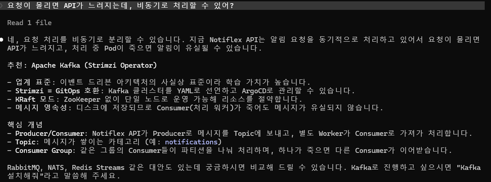

---
#### 다른 도구는 없는지 비교해보기

> Prompt : 카프카 말고 다른 메시지 큐도 있어? 비교하면 어때?
> 
> AI 사고 흐름 : `CLAUDE.md` -> `CLAUDE.md`의 참조 표 스캔 -> `decision-guides/ch8/8.1-messaging.md` -> 해당 문서에 제시된 지식 참고 후 답변

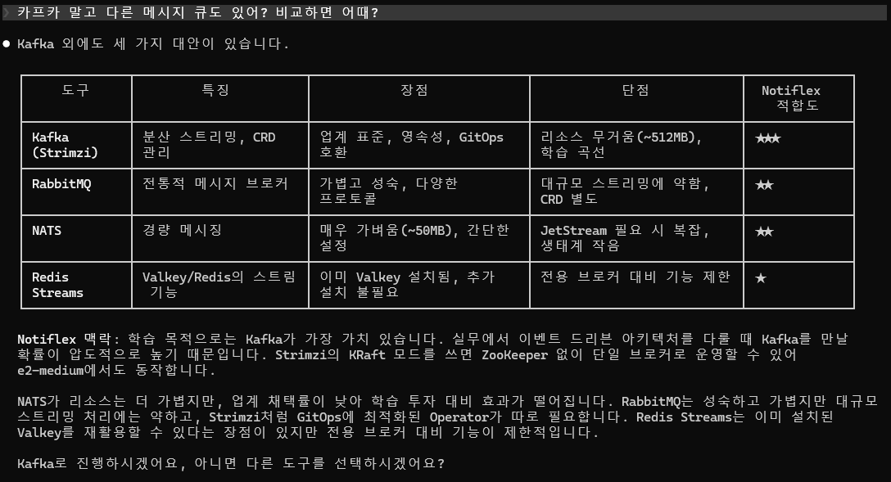

---
#### 카프카를 설치하고 이벤트 드리븐 구성하기

> Prompt : 카프카 설치해줘.
> 
> AI 사고 흐름 : `CLAUDE.md` -> `CLAUDE.md`의 참조 표 스캔 -> `prompt-guardrails/ch8/8.1-kafka.md` -> 해당 문서를 참고해서 진행한다 -> `result-templates/ch8/8.1-kafka.md` -> 실제 결과와 결과 템플릿 비교하여 결과 출력

> [!info] KRaft란?
> - Kafka는 원래 ZooKeeper에 메타데이터(브로커 목록, 토픽 정보, 파티션 리더)를 저장했다.
> - 이 방식은 별도의 ZooKeeper 클러스터가 필요해서 리소스와 운영 부담이 컸다.
> - KRaft(Kafka Raft)는 Kafka 4.0 부터 기본이 된 모드이다.
> - Kafka 내부에 Raft 합의 알고리즘으로 메타데이터를 관리한다. ZooKeeper 불필요
>   
> -> Raft 알고리즘을 기존에 다른 스택들의 HA 구성에서 많이 봤는데 여기서 보니 반갑다.

> [!info] Partition 3개? 무슨 의미?
> - 파티션 수는 Consumer의 병렬 처리 단위이다.
> - 파티션이 3개면 Consumer를 최대 3개까지 병렬로 붙일 수 있다.
> - 1개로 설정하면 Consumer를 아무리 늘려도 하나만 메시지를 받는다.
> - 지금은 Consumer가 1개지만, 나중에 트래픽이 늘어 Consumer를 늘릴 때 파티션이 1개면 확장이 안된다. (나중에 늘릴 수는 있지만, 운영 중 늘리면 key 별 순서 보장이 깨짐 -> 이의 자세한 원리는 찾아보기)
>   
> -> 그러니까 나중에 트래픽이 증가해 notiflex앱의 replica수가 늘었을 때 메시지를 병렬적으로 여러 pod에 분배하기 위함이다.

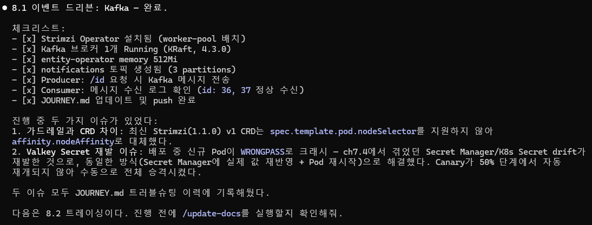

---
### 8.2. 분산 트레이싱: 템포

API에서 카프카를 거쳐 Consumer(Notiflex)로 이어지는 흐름이 생겼다.

이렇게 계층이 많아진 만큼, 알림이 안 갔을 때, 어디서 막혔는지 추적하기 어렵다.

API가 카프카에 발행을 실패했는지, 카프카에는 들어갔는데 Consumer가 소비를 못햇는지, 로그를 Pod별로 뒤져야 한다.

이를 추적하기 위한 트레이스가 추가되면 관측 가능성(Observability)의 3요소가 완성된다.

| 요소   | 도구                | 도입 시점 | 역할            |
| ---- | ----------------- | ----- | ------------- |
| 메트릭  | 프로메테우스 + 그라파나     | 4장    | 무엇이 일어났는지(숫자) |
| 로그   | Loki + Fluent Bit | 4장    | 왜 일어났는지(텍스트)  |
| 트레이스 | 템포(Tempo)         | 8장    | 어디서 일어났는지(경로) |

---
#### 클로드 코드에게 분산 트레이싱 도구 물어보기

> Prompt : 요청이 어디서 느린지 어떻게 알 수 있어?
> 
> AI 사고 흐름 : `CLAUDE.md` -> `CLAUDE.md`의 참조 표 스캔 -> `decision-guides/ch8/8.2-tracing.md` -> 해당 문서에 제시된 지식 참고 후 답변

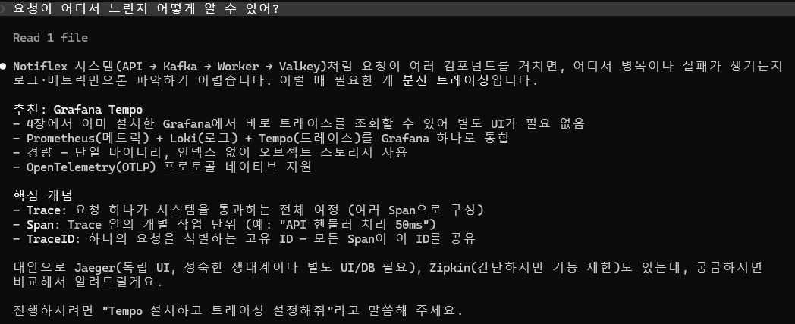

---
#### 다른 도구는 없는지 비교해보기

> Prompt : 템포 말고 다른 트레이싱 도구도 있어? 비교하면 어때?
> 
> AI 사고 흐름 : `CLAUDE.md` -> `CLAUDE.md`의 참조 표 스캔 -> `decision-guides/ch8/8.2-tracing.md` -> 해당 문서에 제시된 지식 참고 후 답변

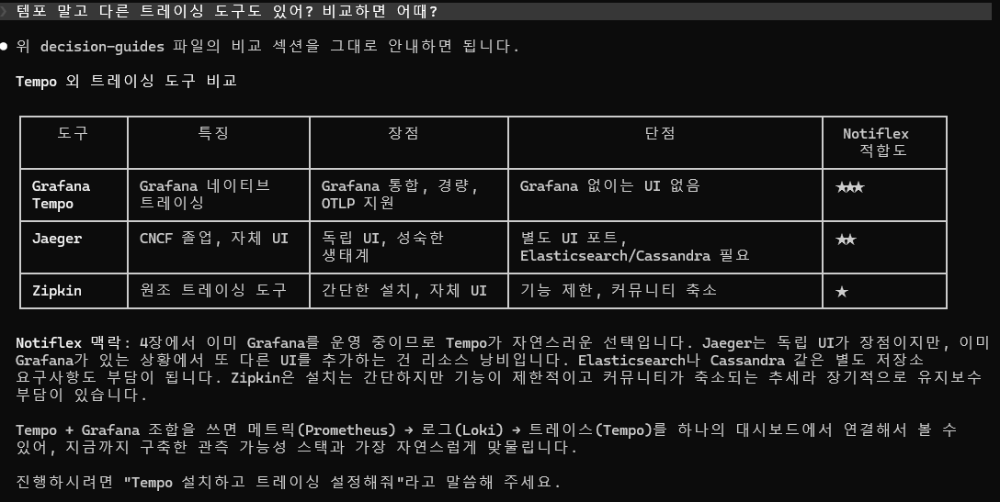

---
#### 템포 설치하고 트레이싱 설정하기

> Prompt : 카프카 설치해줘.
> 
> AI 사고 흐름 : `CLAUDE.md` -> `CLAUDE.md`의 참조 표 스캔 -> `prompt-guardrails/ch8/8.2-tempo.md` -> 해당 문서를 참고해서 진행한다 -> `result-templates/ch8/8.2-tempo.md` -> 실제 결과와 결과 템플릿 비교하여 결과 출력

> [!tip] Tempo에 직접 보내지 않고, OpenTelemetry를 왜 거쳐?
> - Tempo에 직접 보낼 수도 있지만, 그러면 앱 코드가 Tempo에 종속된다.
> - 나중에 Tempo를 Jaeger 혹은 DataDog로 바꾸거나, 트레이스를 여러 백엔드에 동시에 보내고 싶으면 앱 코드를 전부 수정해야한다.
> - OpenTelemetry는 트레이싱, 메트릭 그리고 로그 수집의 벤더 중립 표준이다.
> - 앱은 OTel SDK로 트레이스를 생성하고, OTLP 프로토콜로 내보낸다.

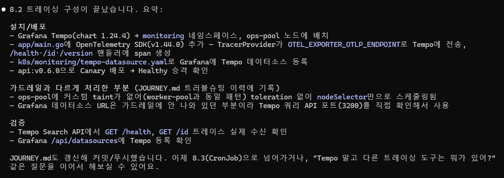

Loki 때와 똑같이, Grafana에 접속해서 Explorer에서 데이터 소스를 Tempo로 선택하고, Service Name에 notiflex-api를 입력한 뒤 Run Query 클릭 (/id API로 여러번 요청 해보고 보자)

> 현재 애플리케이션 계층에만 trace 지점을 등록한거고, 카프카에는 따로 설정은 안해놓은 상태.

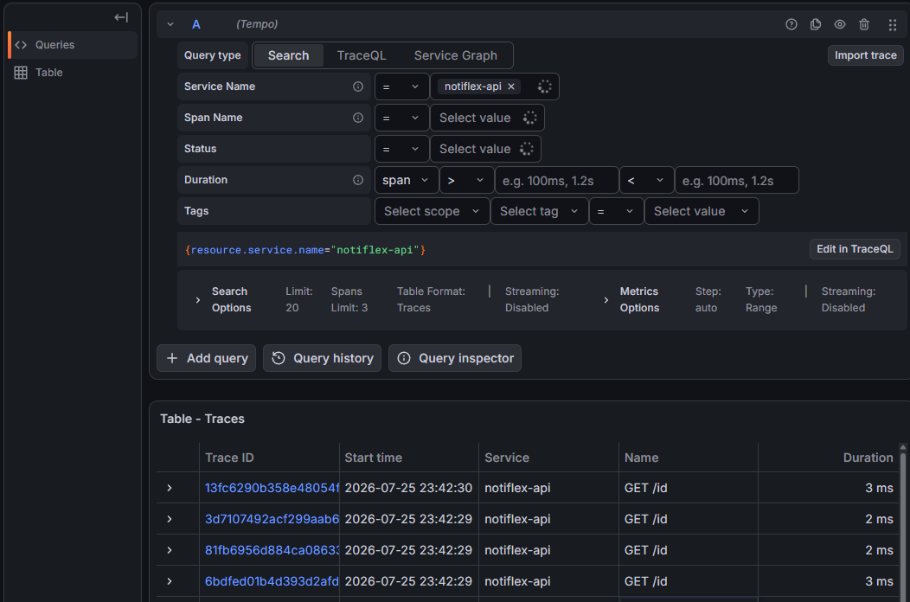

---
### 8.3. 배치 자동화: 크론잡

API가 정상 응답하는지 주기적으로 확인하고 싶다.

---
#### 클로드 코드에게 주기적 작업 방법 물어보기

> Prompt : API 헬스체크를 주기적으로 자동 실행하고 싶은데, 어떻게 만들어?
> 
> AI 사고 흐름 : `CLAUDE.md` -> `CLAUDE.md`의 참조 표 스캔 -> `decision-guides/ch8/8.3-cronjob.md` -> 해당 문서에 제시된 지식 참고 후 답변

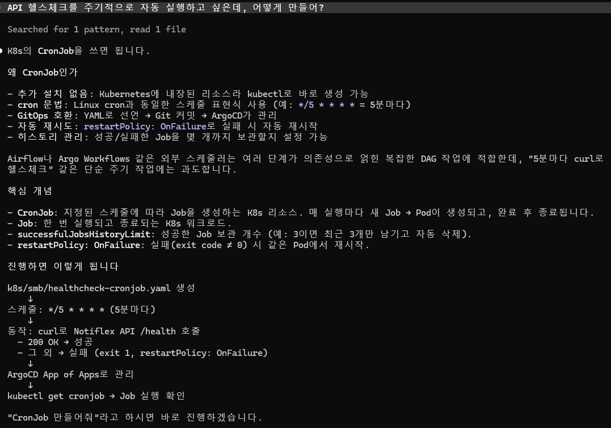

---
#### 크론잡 생성하기

> Prompt : CronJob 만들어줘
> 
> AI 사고 흐름 : `CLAUDE.md` -> `CLAUDE.md`의 참조 표 스캔 -> `prompt-guardrails/ch8/8.3-cronjob.md` -> 해당 문서를 참고해서 진행한다 -> `result-templates/ch8/8.3-cronjob.md` -> 실제 결과와 결과 템플릿 비교하여 결과 출력

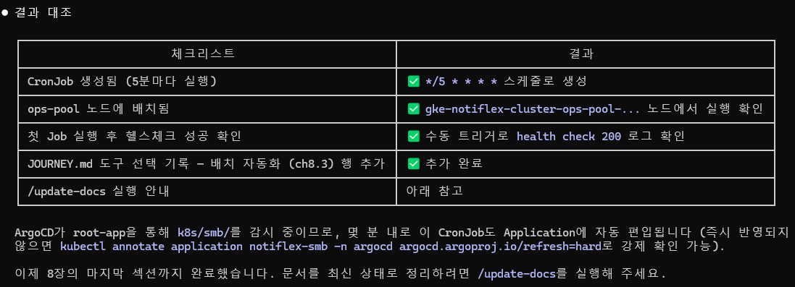

---
### 8.4. 마무리: command-guardrails/로 위험 작업 절차 정리
#### command-guardrails/ 작성

시스템이 복잡해졌다.

이러한 상황에서 실수로 실행하면 뎅터가 사라지거나 중복 처리가 발생할 수 있다.

7장에서 settings.local.json 으로 명령을 차단하거나 승인하는 메커니즘을 체험했다.

하지만, 리소스 삭제 자체가 불필요한 것은 안다. 카프카 토픽을 정리하거나 테넌트 네임스페이스를 제거해야할 때가 있다.

이러한 과정은 '어떤 순서로, 무엇을 확인하고, 어떻게 실행하는지'를 정리한 것이 command-guardrails/ 이다.

> Prompt : command-guardrails/에 위험 작업 실행 절차를 작성해줘. 카프카 토픽 삭제, 크론잡 수동 실행, 테넌트 네임스페이스 삭제 같은 작업이야.
> 
> AI 사고 흐름 : `CLAUDE.md` -> `CLAUDE.md`의 참조 표 스캔 -> `prompt-guardrails/ch8/command-guardrails-example.md` -> 해당 문서를 참고해서 진행한다 -> `result-templates/ch8/command-guardrails-example.md` -> 실제 결과와 결과 템플릿 비교하여 결과 출력

> [!tip] `settings.local.json` vs `command-guardrails`
> - `settings.local.json` : ~ 는 차단 , ~는 승인 받아
> - `command-guardrails` : ~가 필요하면 이 절차를 따라라

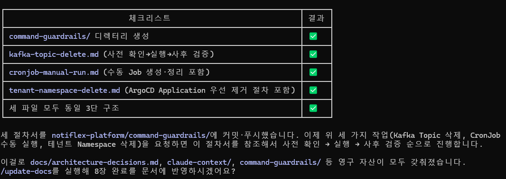

---
## 9. GitAIOps, 살아있는 운영 표준의 탄생

---
### 9.1. AI에게 저장소 분석시키기

#### 저장소 구조 분석

> Prompt : 지금까지 구성한 notiflex-platform 저장소를 분석해줘.
> 
> AI 사고 흐름 : `CLAUDE.md` -> `CLAUDE.md`의 참조 표 스캔 -> `prompt-guardrails/ch9/9.1-repo-analysis.md` -> 해당 문서를 참고해서 진행한다 -> `result-templates/ch9/9.1-repo-analysis.md` -> 실제 결과와 결과 템플릿 비교하여 결과 출력

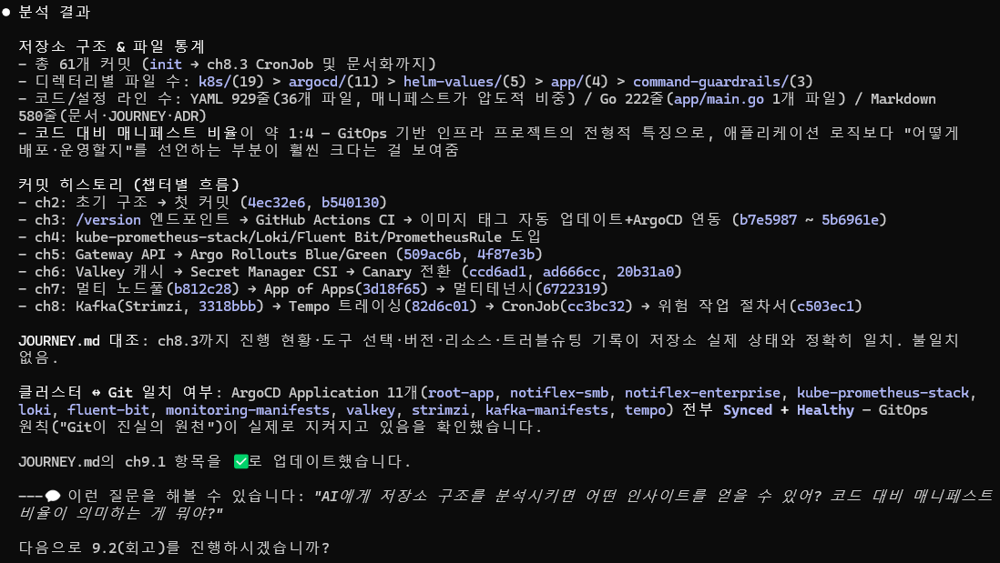

> 이번에도 저장소 구조 분석만 시켰는데 커밋 히스토리까지 분석해버렸다 ㅋㅋ
> 
> 역시 같은 md 파일에 있어서 그런 것 같다.

---
#### 클러스터 현재 상태

> Prompt : 클러스터 상태도 보여줘.
> 
> AI 사고 흐름 : `CLAUDE.md` -> `CLAUDE.md`의 참조 표 스캔 -> `prompt-guardrails/ch9/9.1-repo-analysis.md` -> 해당 문서를 참고해서 진행한다 -> `result-templates/ch9/9.1-repo-analysis.md` -> 실제 결과와 결과 템플릿 비교하여 결과 출력

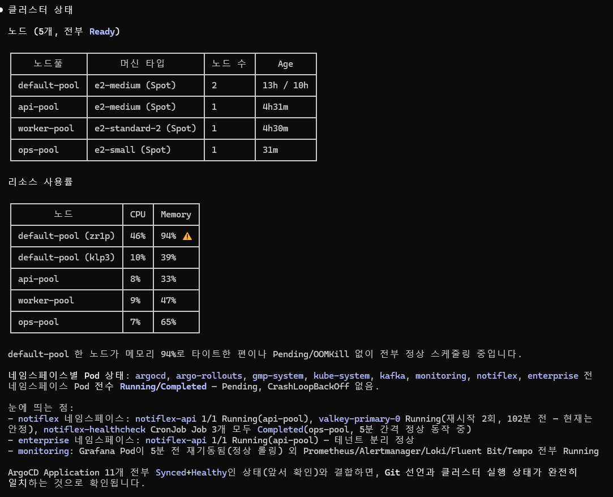

---
### 9.2. 쌓인 것들을 돌아보기
#### 도구 선택 의사결정 종합

> Prompt : 지금까지 쌓인 것들 돌아봐줘
> 
> AI 사고 흐름 : `CLAUDE.md` -> `CLAUDE.md`의 참조 표 스캔 -> `prompt-guardrails/ch9/9.2-retrospective.md` -> 해당 문서를 참고해서 진행한다 -> `result-templates/ch9/9.2-retrospective.md` -> 실제 결과와 결과 템플릿 비교하여 결과 출력

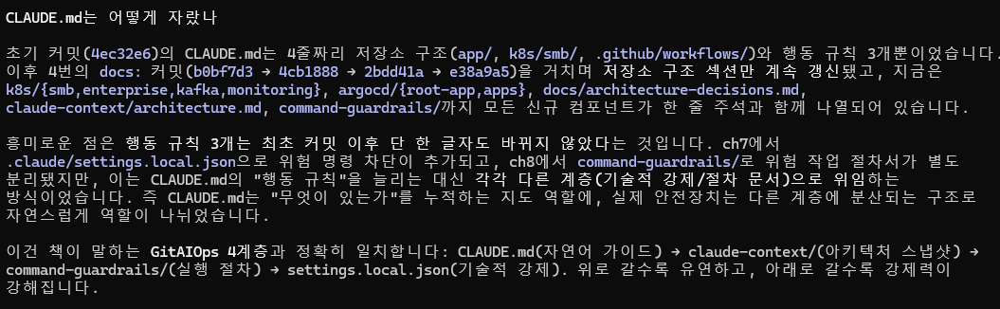

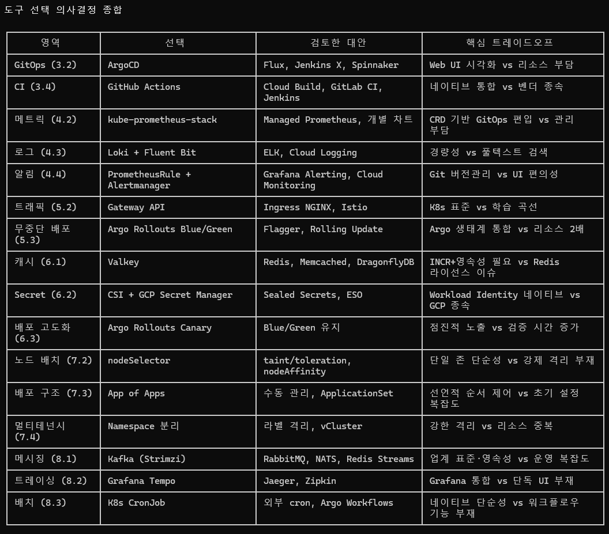

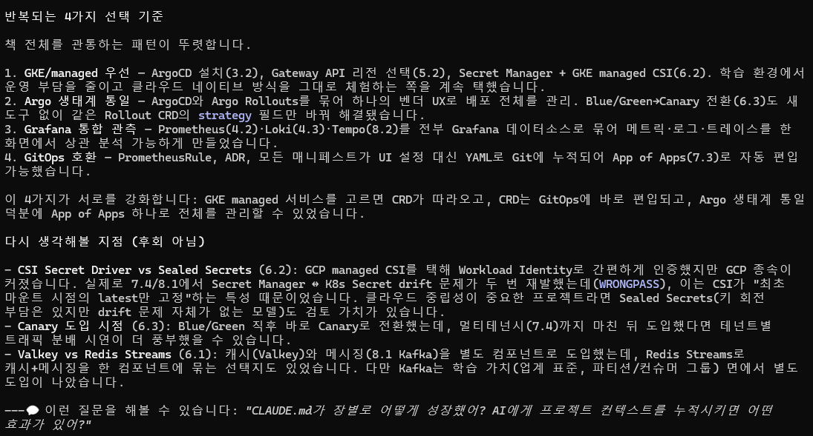

---
### 9.3. 기대하지 않았던 효과
#### 살아있는 문서

전통적인 운영 문서는 별도의 Wiki나 Confluence에 작성된다.

작성한 시점에는 정확하지만, 시간이 지나면 코드와 괴리가 생긴다. (문서 업데이트를 잊기 때문)

notiflex-platform의 문서는 코드와 같은 저장소에 있다.

/update-docs가 코드 변경과 동시에 문서를 갱신한다. 문서가 코드와 함께 살아있다.

---
#### 사람이 보는 문서, AI가 읽는 문서

| 문서 | 누구를 위한 문서? | 활용 방식 |
| --- | --- | --- |
| docs/JOURNEY.md | 사람 | 진행 점검, 결정 히스토리 검토 |
| docs/architecture-decisions.md (ADR) | 사람과 AI | 결정 누적. 사람이 검토하고 AI가 의사결정 맥락으로 참조 |
| CLAUDE.md | AI | AI에게 프로젝트 메타데이터 안내(매 대화 자동 로드) |
| claude-context/ | AI | AI에게 현재 아키텍처 스냅샷 제공(자동 참조) |
| .claude/memory/ | AI | AI가 작업 컨텍스트를 떠올리도록 |
| settings.local.json | AI | AI의 명령 실행 동작 제어(자동 적용) |
| command-guardrails/ | 사람과 AI | 위험 작업 절차서. 사람도 AI도 따라감 |

절반 이상이 AI를 위한 문서이다.

전통적인 운영 문서는 사람만을 위한 것이라 시간이 지나면 누가 보지 않아 정보가 죽는다.

반면 이 문서는 다수가 AI를 위해 설계됐고, AI가 매 대화 시작 시 자동으로 읽어 프로젝트 맥락을 이해한다.

사람만 읽는 문서가 아닌, AI가 함께 읽는 문서가 GitAIOps의 핵심 자산이다.

한계도 있다. 기록의 품질이 AI 응답의 품질을 결정한다.

> [!tip] 느낀점
> 여기서 책에서 진행한 실습의 가치가 느껴진다.
> 
> 사실, 이 책에서 진행한 과정들은 어떻게보면 전형적인 실습이다.
> 
> 하지만, 다른 점은 이러한 '결정 히스토리', '규칙' 등을 AI가 자동으로 기록하고, 읽게하는 구조를 만듦으로써 굳이 신경쓰지 않아도 자연스럽게 기록이 남고, 이를 AI가 다시 읽는건 당연하고, 추후 사람이 읽고 인프라 구조를 파악하는 문서도 남는다는 것이다.

---
#### 이 구조가 만들어내는 것

살아있는 문서와 AI가 읽는 문서가 결합되면, 기존 구조에서 새로운 산출물을 만들 수 잇다.

예: '온보딩 문서 만들어줘', '보안 감사 보고서 만들어줘'

> [!tip] 느낀점
> 이것도 큰 가치이다.
> 
> 일을 하다보면 온보딩 문서 작성이나 보안 감사 보고서 등을 만드는 일 자체가 매우 힘들다.
> 
> 만약 처음부터 위와같이 AI와 함께 설계하였고, 모든 기록이 남아있다면 이러한 작업이 매우 편해질 것이다.

---
### 9.4. GitAIOps의 출현
#### Git + AI + Ops 연결 분석

> Prompt : Git, AI, Ops 연결을 분석해줘
> 
> AI 사고 흐름 : `CLAUDE.md` -> `CLAUDE.md`의 참조 표 스캔 -> `prompt-guardrails/ch9/9.4-gitaiops.md` -> 해당 문서를 참고해서 진행한다 -> `result-templates/ch9/9.4-gitaiops.md` -> 실제 결과와 결과 템플릿 비교하여 결과 출력

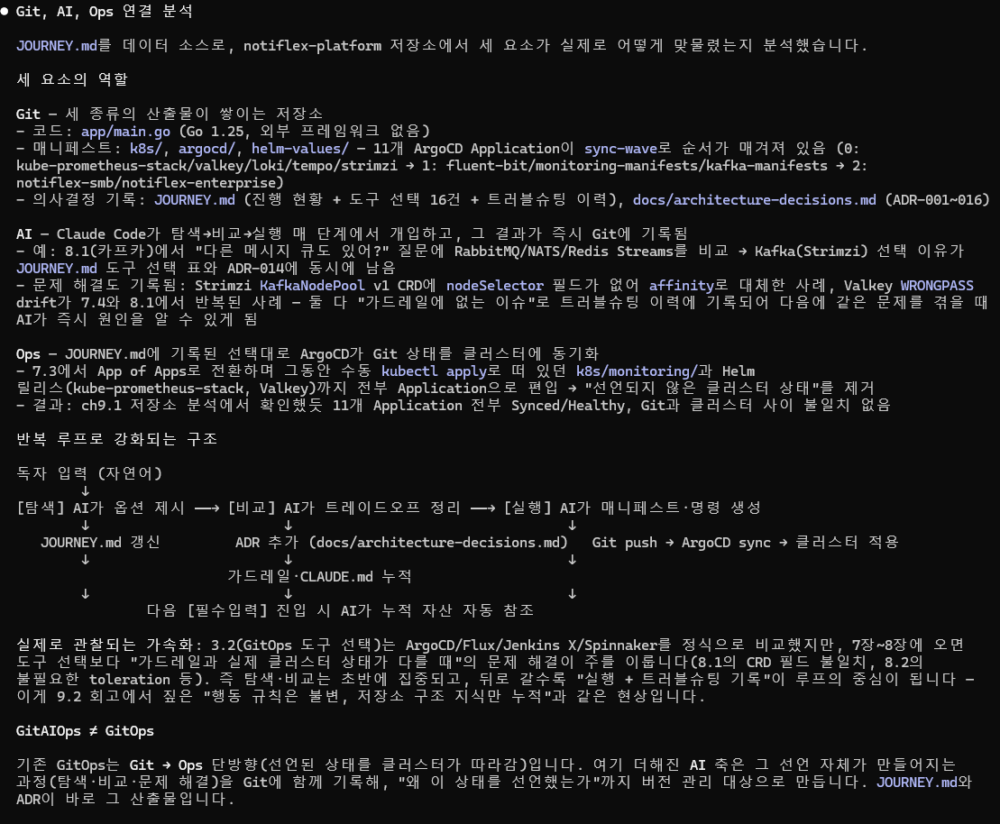

---
#### GitOps와의 차이

GitOps는 'Git을 단일 진실 공급원'으로 삼는다.

GitAIOps에서는 AI가 실행자이면서 동시에 기록자이다. 이것이 기존 GitOps에서 부족했던 '문서화'와 '지식 축적'을 자동으로 해결한다.

| 항목 | GitOps | GitAIOps |
| --- | --- | --- |
| YAML 작성 | 사람이 직접 | AI가 자연어로부터 생성 |
| 도구 선택 | 사람이 조사하고 결정 | AI가 추천하고 사람이 확인 |
| 문서화 | 별도로 해야 함(보통 빠짐) | AI와의 대화가 자동으로 기록 |
| 트러블슈팅 | 에러 메시지로 검색 | AI가 분석하고 해결책 제시 |
| 동기화 | Git → ArgoCD → 클러스터 | 동일 |

---
#### 작위적이지 않다

매 장에서 문제를 해결하다보니 이러한 자산이 자연스럽게 쌓인다.

앞서 '느낀점'에서 내가 언급했듯이 GItAIOps의 장점은 'AI가 모든걸 다해줘!' 가 아니라 '자연스럽게 쌓이는 운영 자산' 이다.

---
#### 진행 방향에 따라 달라지는 구조

**문제 해결 중심 (이 책의 방식)**
- 문제가 생기면 해결하고, 그 과정에서 필요한 자산이 하나씩 추가됨
- 소규모 프로젝트나 학습 과정에서 자연스러움

**계획 중심 (대규모 프로젝트)**
- 사람이 읽는 상세 계획서(work-plans)를 먼저 만듬
- 핵심을 AI가 읽을 수 있는 형태로 증류(distill)
- 실행 절차(command-guardrails)와 값 고정(helm-values)을 설계한다.
- 내가 예전에 읽었던 조훈님이 쓰신 다음 글에서 나온 방법인 것 같다. (https://yozm.wishket.com/magazine/detail/3710/)

---
### 9.5. 마무리: 다음 단계
#### 프로덕션 전환 제안

> Prompt : 다음 단계 제안해줘
> 
> AI 사고 흐름 : `CLAUDE.md` -> `CLAUDE.md`의 참조 표 스캔 -> `prompt-guardrails/ch9/9.5-wrap-up.md` -> 해당 문서를 참고해서 진행한다 -> `result-templates/ch9/9.5-wrap-up.md` -> 실제 결과와 결과 템플릿 비교하여 결과 출력

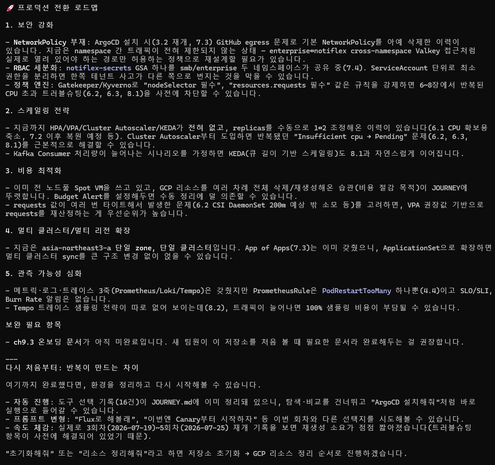

---
#### AI와 대화하는 습관

1. 왜?를 먼저 묻는다.
	- 어떠한 상황인데 어떻게 할까? -> 다른건?
2. 결정을 기록한다.
	- 몇달만 지나도 의사 결정 이유는 기억나지 않는다.
3. 한 번에 하나씩 진행한다.
	- 카프카도 설치하고 템포도 설치하고 크론잡도 만들어줘 (X)
	- 카프카 설치해줘 (O)
4. 검증을 습관화한다.
	- 항상 AI는 검증을 해야한다. 결과가 100퍼센트 보장되지 않는다.

> [!tip] 느낀점
> 내가 AI를 사용하는 방법과 소름돋게 똑같았다.
> 
> 머릿 속으로 저런 4가지로 나눠서 프롬프트를 입력해야지! 라고 생각하며 사용하진 않았지만 항상 저런 패턴이었다.
> 
> 어느정도 잘 하고있다는 확신을 받은 것 같아서 기분이 좋다.

---
## 스터디를 마치며

처음에 어떤 AI로 클라우드 인프라를 운영하는 어떠한 표준을 얻고 싶어 스터디에 참여했다.

어떠한 AI 활용 스킬적인 측면을 기대했지만, 그런 내용은 아니었다. 대부분의 과정이 저자가 만들어둔 md 파일들의 설계대로만 진행되었다.

이 때가 2주차였는데, 조금은 아쉬웠던 것 같다. 그냥 일반적인 클라우드 인프라 실습서와 같은 느낌이라고 생각했다. (week2 글에도 그렇게 작성했다)

하지만 4주차 때 이러한 운영 방식으로 인해 어떤 자산이 쌓이고 어떤 것을 얻을 수 있는지 깨달았다.

기록이라는 공수가 많이 드는 자산을 자동화 해주는 것. 그리고 유능한 의사결정 파트너를 어떻게 잘 활용하는가에 대한 노하우.

결과적으로 많은 공부가 되었고 뿌듯하다.

혼자서는 절대 4주안에 해내지 못했을텐데 스터디를 만들어주시고 운영해주신 가시다님께 감사드린다.

---