---
## CH3. Model Serving System Design: A Deep Dive

---
### 개요

> 이 장의 목표는 특정 프레임워크(vLLM, Triton 등)을 바로 다루기보다, from scratch로 서빙 시스템을 직접 만들어보면서 원리를 체득한다.
> 
> 이러한 원리 파악을 바탕으로 추후 어떠한 서빙 프레임워크가 출시되더라도 상황에 맞게 합리적인 판단을 하기 위함이다.

---
### Build on Online LLM Serving Service from Scratch

---
#### Service Architecture

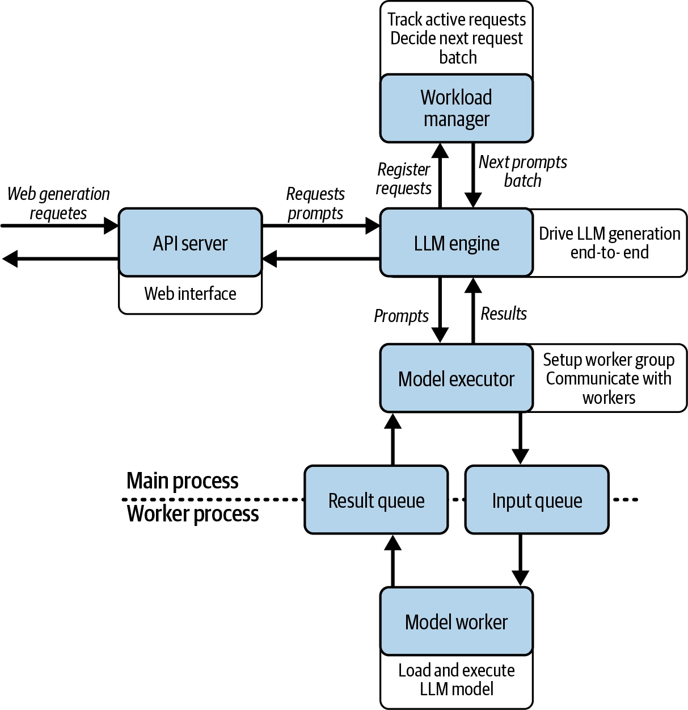

> 위 아키텍처는 기본적인 Single-model 서빙 시스템 아키텍처이다.

[구성 요소]

- API server : HTTP 요청/응답 처리 (배칭, 스트리밍 엔드포인트)
- LLM engine: 전체를 지휘하는 오케스트레이터, 마치 오케스트라 지휘자처럼 다른 컴포넌트들을 초기화하고 조율
- Workload manager: 요청 큐잉과 배치 구성 관리, 어떤 배칭 전략을 적용할지 결정하는 핵심 지점 ← "언제 어떤 요청들을 묶어서 배치로 보낼지"를 결정하는 스케줄링
- Model executor : 모델 워커 프로세스들을 초기화·관리하고, 프로세스 간 통신으로 추론을 트리거
- Model worker : 실제 모델 추론을 자신의 별도 프로세스에서 실행
- Model manager : 모델을 로드하고 캐싱

> [!info] 이해를 위해 K8S에 비유해보자
> |LLM 아키텍처|K8S|역할|
> |---|---|---|
> |**API Server**|**kube-apiserver**|외부 요청을 받아 내부 시스템으로 전달|
> |**Workload Manager**|**kube-scheduler**|처리할 작업을 선택하고 스케줄링|
> |**LLM Engine**|**kube-controller-manager**|전체 작업 흐름을 제어·조율|
> |**Model Executor**|**kubelet**|실제 Worker에게 작업 실행 지시|
> |**Model Worker**|**Container**|실제 workload를 실행하는 부분|


[요청 흐름]

```
Client → API server → LLM engine → Workload manager → Model executor → Model worker(별도 프로세스)
                                                                              ↓
Client ← API server ← LLM engine ← Workload manager ←──── 생성 결과 ────────────┘
```

1. API server가 HTTP 요청(생성 요청)을 받아 파싱
2. LLM engine(지휘자)이 이 요청을 받아 전체 흐름을 조율 — 시작 시점에 모델 로딩을 포함해 모든 컴포넌트를 초기화한 상태
3. Workload manager가 요청을 큐에 넣고, 현재 대기 중인 프롬프트들의 상태를 추적하다가 "다음 배치로 어떤 프롬프트들을 묶어서 보낼지" 결정 (여기가 배칭 전략이 들어가는 지점)
4. Model executor가 그 배치를 실제로 실행하도록 Model worker(별도 프로세스)에게 cross-process call로 전달
5. Model worker가 GPU에서 추론을 실행하고 결과를 반환
6. 결과가 다시 Model executor → LLM engine → API server를 거쳐 클라이언트로 전달 (배치/스트리밍 여부에 따라 반환 방식이 다름)

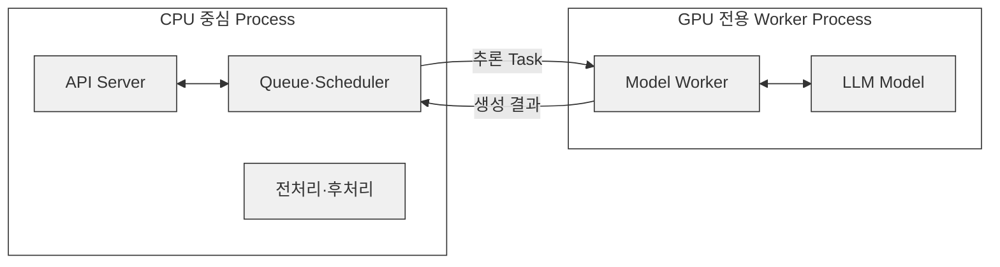

> [!tip] 중간에 Model worker에서 별도의 프로세스로 분리하는 이유
> - GPU가 필요없는 워크로드가 GPU가 필요한 워크로드와 같은 프로세스로 돌아가면 GPU가 필요한 작업이 다른 작업이 끝날 때까지 기다리게 됨
> - GPU는 비싸고, 유휴가 생길수록 손해
> - ex: 토크나이징, 전/후처리 같은 CPU 작업이 GPU와 같은 프로세스/스레드에서 돌면 GPU가 그 작업이 끝날 때까지 기다리게 됨

---
#### Single-model serving - 코드 구조

> 코드 : https://github.com/orca3/llm-model-inference/tree/main/ch03/single_model_llm_serving
> 
> 나는 도커 환경에서 진행하였다. (gpu : RTX 4080)

[코드 구조]

```
single_model_llm_serving/
├── main.py                  # FastAPI 앱 · 4개 엔드포인트 · LLMEngine 싱글턴
├── llm/
│   ├── __init__.py          # LLMEngine export
│   ├── llm.py               # LLMEngine: 오케스트레이션 + 스트리밍 처리 루프
│   ├── workload_manager.py  # Sequence, WorkloadManager: 큐잉/배칭/상태 추적
│   ├── model_executor.py    # ModelExecutor: 워커 프로세스 관리 + IPC 큐
│   ├── model_worker.py      # ModelWorker: 별도 프로세스에서 실제 추론
│   └── model_manager.py     # ModelManager: HF 모델/토크나이저 로딩
├── tests/
│   ├── test_api.py          # 엔드포인트 테스트
│   ├── test_vllm.py         # vLLM 경로 테스트
│   └── test_stream.sh       # SSE 수동 확인 스크립트
├── requirements.txt
├── pytest.ini
└── README.md
```

```dockerfile
# Dockerfile
FROM python:3.11-slim  
  
# vLLM 이 기동 시 Triton 으로 커널을 JIT 컴파일한다. 없으면 EngineCore 가 뜨지 않는다.  
RUN apt-get update && apt-get install -y --no-install-recommends gcc g++ \  
    && rm -rf /var/lib/apt/lists/*  
  
ENV PYTHONUNBUFFERED=1  
  
WORKDIR /opt/project  
  
COPY requirements.txt .  
RUN pip install --no-cache-dir -r requirements.txt  
  
# 가중치를 이미지에 미리 받아둔다. COPY 앞이라 소스만 고치면 이 레이어는 캐시된다.  
RUN python -c "\  
from transformers import AutoModelForCausalLM, AutoTokenizer; \  
AutoModelForCausalLM.from_pretrained('facebook/opt-125m'); \  
AutoTokenizer.from_pretrained('facebook/opt-125m')"  
  
COPY . .  
  
CMD ["python", "main.py"]
```

```yaml
# compose.yaml
services:  
  app:  
    build: .  
    gpus: all  
    # torch/vLLM 이 쓰는 공유 메모리. 도커 기본값 64MB 로는 부족하다.  
    shm_size: "2gb"  
    ports:  
      - "8000:8000"
```

> [!info] 코드 수정
> - CPU만 사용하면 문제가 없었지만, GPU를 사용하면 문제가 생겼습니다.
> - 코드가 모델을 CPU에 둔 채 입력만 GPU로 보내서  `/generate_stream`이 device 불일치로 추론이 진행되지 않았기 때문에, 모델도 같은 device로 옮기는 `self.model.to(self.device)` 한 줄을 추가했습니다.
> - 저는 상대적으로 GPU VRAM 넉넉하여(16GB) 위 한줄만 추가하는 것 이외에는 문제가 없었지만, 적은 환경에서는 문제가 생길 수 있습니다. 이에 다른 스터디원 분이 정리해주신 트러블 슈팅 가이드를 링크합니다. (https://ken-0913.github.io/myblog/posts/llm/llm-serving-single-model-lab/)

```python
# llm/model_worker.py
...
class ModelWorker:  
    def __init__(self, model_name: str):  
        self.device = "cuda" if torch.cuda.is_available() else "cpu"  
        logger.debug(f"Loading model {model_name} on device {self.device}")  
        self.model, self.tokenizer = ModelManager().load_model(model_name)
        # 추가한 코드  
        self.model.to(self.device)  
        # Initialize state for streaming  
        self.stream_states = {}  # request_id -> (input_ids, attention_mask, past_key_values)
...
```

```bash
docker compose up --build
```

---
#### 단일 요청 처리

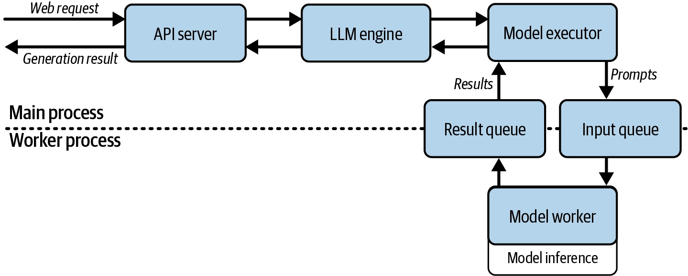

> [!info] 단일 요청 처리
> 
> - 요청
>   
> ```
> POST /basic_generate
> {
> 	"prompt": "Hello, I am"
> }
> ```
> 
> - 응답
> 
> ```
> {
> 	"generated_text": "Hello I am a student in the UK and I am looking for a job. I am looking for a job that will allow me to work in a company that is not a big company. I am looking for a job that will allow me to work in a company"
> }
> ```

- 문제점 : Prompt 1 처리 완료 -> Prompt 2 처리 -> Prompt 3 처리
	- GPU가 한 번에 하나의 Prompt만 처리하므로 처리량이 낮다.

---
#### 단일 요청 처리 - 코드

> "request body에 ~이 들어와서 그걸 ~하고" 이런 기본적인 API 요청 흐름 설명은 생략하고, LLM 서빙에 관련된 코드만 설명하겠습니다.

```python
# main.py
@app.post("/basic_generate", response_model=GenerateResponse)  
async def basic_generate(request: GenerateRequest, llm: LLMEngine = Depends(get_llm)):  
    generated_text = llm.basic_generate(request.prompt)  
    return GenerateResponse(generated_text=generated_text)
```

- 먼저 `/basic_generate` 에 요청이 오면, `get_llm()`을 통해 `LLMEngine`을 주입받는다. (`Depends`는 FastAPI의 의존성 주입 문법)
- 아래에서 `get_llm()`이 무엇인지 보자.

```python
# main.py
def get_llm():  
    global _llm  
    with _llm_lock:  
        if _llm is None:  
            _llm = LLMEngine()  
            # Register cleanup  
            atexit.register(cleanup)  
        return _llm

def cleanup():  
    global _llm  
    if _llm is not None:  
        try:  
            _llm._cleanup()  
        except:  
            pass  
        _llm = None
```

- `get_llm()`은 `_llm`이 없다면, `LLMEngine()`을 통해서 '작업 전체를 조율하는' `LLMEngine` 객체를 초기화하는 코드이다.
- `_llm`은 전역으로 선언되어있다. 이에, 첫 요청이 들어올 때, 한번 초기화 되고, 이후 요청부터는 이 객체를 재사용한다. (싱글톤 패턴)
- 이후 `atexit.register(cleanup)` 코드를 통해 애플리케이션이 종료될 때, 이 `LLMEngine` 객체가 정리된다.
- 이제, 아래에서 `LLMEngine()`이 무엇인지 보자.

```python
# llm/llm.py
class LLMEngine:  
    def __init__(self):  
        self.model_executor = ModelExecutor()  
        self.workload_manager = WorkloadManager()  
        self.max_tokens = 20  
        # Initialize the model  
        self.model_executor.setup_worker("facebook/opt-125m")  
          
        # Initialize vLLM model  
        self.vllm_model = VLLM(model="facebook/opt-125m")  
          
        # Start processing loop in a separate thread  
        self.thread = threading.Thread(target=self.requests_processing_loop, daemon=True)  
        self.thread.start()  
          
        # Register cleanup  
        atexit.register(self._cleanup)
    
    # 이후 세부 코드는 생략
    ...
```

- 위에서 언급했던 Service Architecture의 각 요소들을 초기화합니다.
- `ModelExecutor()` : Model Executor 초기화
- `WorkloadManager()` : WorkloadManager 초기화
- <span class="t-red">(중요)</span> `self.model_executor.setup_worker("facebook/opt-125m")` 
	- 이 코드가 중요합니다. 이 코드를 이해하기 위해 아래에서 `setup_worker()` 가 어떤 메서드인지 보자.

```python
# llm/model_executor.py
class ModelExecutor:  
    def __init__(self):  
        self.task_queue = mp.Queue()  
        self.result_queue = mp.Queue()  
        self.worker_process = None  
        logger.debug("ModelExecutor initialized with queues")  
      
    def setup_worker(self, model_name: str):  
        logger.debug(f"Setting up worker with model: {model_name}")  
        self.worker_process = mp.Process(  
            target=ModelWorker.run,  
            args=(model_name, self.task_queue, self.result_queue)  
        )  
        logger.debug("Starting worker process")  
        self.worker_process.start()  
        logger.debug("Worker process started")
```

- 앞에 Service Architecture를 보면, 프로세스 2개 (왜 2개의 프로세스를 쓰는지는 앞에서 설명했다) 간 통신을 위해 Queue(task/result)를 사용하는 것을 볼 수 있다.
	- OS 기초) <span class="t-red">별도 프로세스인 API 서버(부모)와 model worker(자식) 프로세스가 서로 직접 함수를 호출할 수 없기 때문에, 프로세스 간 통신(IPC) 을 큐로 구현</span>
- `mp.Process(...)` : `ModelWorker.run()` 을 별도 프로세스로 실행
	- `ModelWorker.run()` 에 대해서는 아래에서 이어서.

```python
# llm/model_worker.py
class ModelWorker:  
    def __init__(self, model_name: str):  
        self.device = "cuda" if torch.cuda.is_available() else "cpu"  
        logger.debug(f"Loading model {model_name} on device {self.device}")  
        self.model, self.tokenizer = ModelManager().load_model(model_name)  
        self.model.to(self.device)  
        # Initialize state for streaming  
        self.stream_states = {}  # request_id -> (input_ids, attention_mask, past_key_values)
	
	...
	
	@staticmethod  
def run(model_name: str, task_queue: mp.Queue, result_queue: mp.Queue):  
    # Enable remote debugging  
    logger.debug("Waiting for debugger to attach...")  
    logger.debug("Debugger attached!")  
      
    worker = ModelWorker(model_name)  
    logger.debug("Worker initialized")  
      
    while True:  
        logger.debug("Waiting for batch from queue...")  
        batch_data = task_queue.get()  
        logger.debug(f"Received batch: {batch_data}")  
          
        if batch_data is None:  # Shutdown signal  
            logger.debug("Received shutdown signal")  
            break  
        batch, is_streaming = batch_data  
          
        if is_streaming:  
            # Handle streaming generation  
            result_queue.put(('stream', worker.generate_forward_batch(batch)))  
        else:  
            # Handle regular generation  
            result_queue.put(('complete', worker.generate(batch)))
```

- 위에서 `ModelWorker.run()`을 별도 프로세스로 실행하는 것을 보았다.
- `ModelManager().load_model(model_name)` : 그 프로세스 안에서 ModelManager가 HuggingFace에서 모델+토크나이저 로드
- `ModelWorker.run()`은 자식 프로세스에서 무한 while True 루프를 돌며 `task_queue.get()`으로 블로킹 대기 → 요청이 오면 처리 → result_queue.put()으로 결과 반환

---
#### 단일 요청 처리 - 요약

> [!info] 요약
> - 이전에 우리는 GPU를 효율적으로 사용하기 위헤서 프로세스를 분리해야한다는 것을 배웠다.
> - 이에 직접 가장 단순한 `/basic_generate` 엔드포인트를 호출해보았으며, 이것이 내부적으로 어떻게 동작하는지를 파악했다.
> 	- `LLMEngine` 로드 -> `ModelExecutor` 로드, `ModelWorker` 셋업 -> `ModelWorker`는 새로운 프로세스에서 While 루프를 돌며 요청을 처리
> 	- 다른 프로세스이기 때문에 `task_queue`와 `result_queue` 를 통해서 프롬프트와 모델 처리 결과를 교환

---
#### 배치 요청 처리

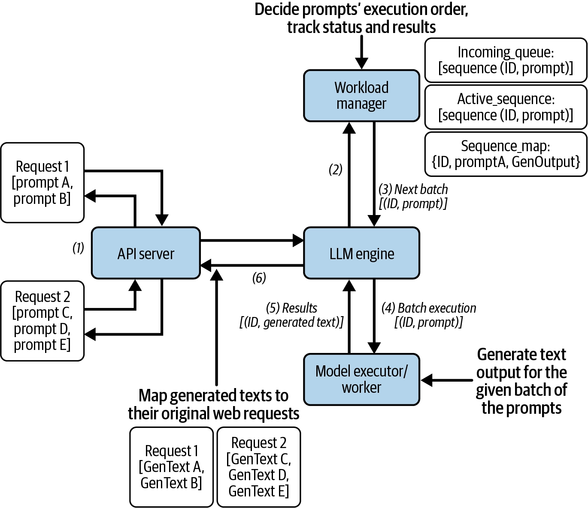

> [!info] 배치 요청 처리
> 
> - 요청
>   
> ```
> POST /generate
> {
> 	"prompts": [
> 		"Hello, I am",
> 		"The weather is",
> 		"I want to",
> 		"The best way to",
> 		"The most efficient way to"
> 	]
> }
> ```
> 
> - 응답
> 
> ```
> {
> 	"generated_texts": [
> 		"Hello, I am a student at the University of California, Berkeley. I am a graduate student in the Department of Psychology. I am a graduate student in the Department of Psychology. I am a graduate student in the Department of Psychology. I am a graduate student in the",
> 		"The weather is, of course, a factor in the weather.\n\nThe weather is a factor in the weather.\n\nThe weather is a factor in the weather.\n\nThe weather is a factor in the weather.\n\nThe weather is a factor",
> 		"I want toand I want to be a part of this.\nI want to be a part of this.\nI want to be a part of this.\nI want to be a part of this.\nI want to be a part of this.",
> 		"The best way to get a job is to get a job.                                         ",
> 		"The most efficient way to get a job is to get a job.                                         "
> 	]
> }
> ```

- 이를 통해 GPU 행렬 연산을 더 크게 만들고 자원 활용률을 높였다.

이러한 배치 처리를 하기 위해서는 2가지 과제를 해결해야한다.

1. 서로 다른 요청들의 프롬프트를 n 개의 배치로 합쳐서 LLM이 요청별이 아니라 큰 배치 단위로 프롬프트를 실행할 수 있게 해야한다.
2. 생성된 출력물을 원래 요청과 정확히 연결해 사용자에게 돌려줄 수 있어야 한다.

1번 코드단에서 어떻게 처리하는지 아래에서 보기로하고, 먼저 2번 과제를 어떻게 해결하는지는 다음과 같다.

**"각 Prompt를 `Sequence` 객체로 감싼다"**

```
Sequence
├─ 고유 ID
├─ Prompt
├─ 생성 결과
├─ 완료 여부
├─ 토큰 수
└─ Streaming Queue

# 예
A → seq-101
B → seq-102
C → seq-103
```

결과 또한 당연히 이 `Sequence` 객체에 들어온다.

이 구조가 중요한 이유는 <span class="t-red">웹 요청과 실제 GPU 실행 순서를 분리</span>할 수 있기 때문이다.
덕분에, Dynamic Batching, Priority Scheduling, Continuous Batching 같은 최적화를 적용할 수 있다.

---
#### 배치 요청 처리 - 코드

> `main.py`의 `/generate` 컨트롤러 부분은 이전 단일 요청 처리와 크게 다르지 않아서 생략하겠습니다.

```python
# llm/llm.py
class LLMEngine:
	...
	def generate(self, prompts: List[str]) -> List[str]:  
	    # Add all requests to workload manager  
	    request_ids = []  
	    for prompt in prompts:  
	        request_id = self.workload_manager.add_request(prompt)  
	        request_ids.append(request_id)  
	      
	    # Process requests in batches (from LoadManager) until all prompts of the request are finished  
	    while not self._is_batch_finished(request_ids):  
	        # Get next batch of requests  
	        sequences = self.workload_manager.get_next_batch()  
	        if not sequences:  
	            time.sleep(0.1)  
	            continue  
	            # Execute the next batch in one go, it may not be the same prompts as the prompts in the request.  
	        results = self.model_executor.execute_batch(sequences)  
	      
	        # Update results in workload manager  
	        for result in results[1]:  
	            self.workload_manager.remove_active_sequence(result['request_id'])  
	            self.workload_manager.update_sequence_output(result['request_id'], result['generated_text'], is_finished=True)  
	  
	    # Remove finished sequences from workload manager  
	    generated_texts = []  
	    for request_id in request_ids:  
	        generated_texts.append(self.workload_manager.get_sequence(request_id).output[0])  
	        self.workload_manager.remove_finished_sequence(request_id)  
	  
	    return generated_texts
```

> 여기서 호출하는 함수들의 구현은 아래 코드들에서 확인한다.

- `self.workload_manager.add_request(prompt)`
	- uuid로 요청 ID를 발급하고 Sequence를 만들어 incoming_queue(FIFO)에 넣고, 동시에 sequence_map이라는 딕셔너리(id → Sequence)에도 등록합니다. 이 맵이 나중에 ‘ID로 결과 찾기의 핵심이다.
- `self.workload_manager.get_next_batch()`
	- active_sequences가 batch_size(4개) 미만이고 대기 큐에 남은 게 있으면 큐에서 꺼내 채운다.
	- 즉, 현재 우리가 실행하는 코드의 워크로드 매니저의 스케줄링 전략은 FIFO + 배치 크기 유지 밖에 없다.
- `self.workload_manager.update_sequence_output(result['request_id'])`
	- 결과를 `WorkloadManager`에 기록하고 완료 처리
- `self.workload_manager.remove_finished_sequence(request_id)`
	- 처음 넣었던 요청들의 결과를 순서대로 꺼내고, 관리 목록에서 제거한 뒤 반환.

```python
# llm/workload_manager.py
class WorkloadManager:
	...
	def add_request(self, prompt: str) -> str:  
	    request_id = str(uuid.uuid4())  
	    sequence = Sequence(request_id, prompt, None, None)  
	    self.incoming_queue.put(sequence)  
	    self.sequence_map[request_id] = sequence  
	    return request_id
	...
	def get_next_batch(self, is_streaming: bool = False) -> List[Sequence]:  
	    if is_streaming:  
	        while len(self.active_streaming_sequences) < self.batch_size and not self.incoming_streaming_queue.empty():  
	            sequence = self.incoming_streaming_queue.get()  
	            self.active_streaming_sequences.append(sequence)  
	      
	        return self.active_streaming_sequences  
	    else:  
	        while len(self.active_sequences) < self.batch_size and not self.incoming_queue.empty():  
	            sequence = self.incoming_queue.get()  
	            self.active_sequences.append(sequence)  
	              
	        return self.active_sequences
	...
	def update_sequence_output(self, seq_id: str, token: str, is_finished: bool = False):  
	    if seq_id in self.sequence_map:  
	        sequence = self.sequence_map[seq_id]  
	        sequence.output.append(token)  
	        sequence.prompt += token  
	        sequence.token_count += 1  
	        sequence.finished = is_finished  
	        return sequence  
	    return None
	...
	def remove_finished_sequence(self, seq_id: str):  
	    if seq_id in self.sequence_map:  
	        sequence = self.sequence_map[seq_id]  
	        if sequence in self.active_sequences:  
	            self.active_sequences.remove(sequence)  
	        if sequence in self.active_streaming_sequences:  
	            self.active_streaming_sequences.remove(sequence)  
	        del self.sequence_map[seq_id]
```

```python
# llm/model_executor.py
class ModelExecutor:
	...
	def execute_batch(self, prompts: List[Dict[str, Any]]) -> List[Dict[str, Any]]:  
	    if not prompts:  
	        logger.debug("Empty batch received")  
	        return []  
	      
	    logger.debug(f"Sending batch to worker: {prompts}")  
	    # Send batch to worker  
	    self.task_queue.put((prompts, False))  
	      
	    # Get results  
	    logger.debug("Waiting for results from worker")  
	    results = self.result_queue.get()  
	    logger.debug(f"Received results from worker: {results}")  
	    return results
```

----
#### 배치 요청 처리 - 요약

> [!info] 요약
> - 이전의 단일 요청 처리의 경우, 요청을 순차적으로 처리하여 자원을 효율적으로 사용할 수 없었다.
> - 이에, 배치 처리를 통해 효율을 개선하였다.
> - 배치처리를 위해 `WorkloadManager`가 batch를 구성하였다. (FIFO + 배치 크기 유지)
> - 배치처리를 위해 `Sequence`라는 Wrapper 객체를 도입하였다.

> [!tip] 배치 처리량 최적화
> - <span class="t-red">처리량과 개별 사용자 지연시간 사이에서 균형</span>을 찾아야 한다.
> - Batching 최적화에서 중요한 것은 batch size만 크게 만드는 것이 아니다.
> - throughput은 좋아질 수 있지만, 각 request의 queue time과 latency가 늘어날 수 있다.
> - Production에서는 max batch size, max batched tokens, timeout, request priority를 함께 봐야 한다.
> - 실제로 배치 크기와 배칭 전략은 추론 처리량에 큰 영향을 미친다.
> - 적절한 배치 구성을 선택하려면 세심한 조정이 필요하며, 이 단순화된 예시보다 훨씬 복잡하다.
> - 이 설정들은 특정 LLM 모델, 프롬프트 특성, 웹 트래픽의 성격, 그리고 모델이 실행되는 하드웨어에 따라 자주 조정되어야 한다.

> [!warning] 트레이드 오프
> - `execute_batch` 메서드는 <span class="t-red">동기</span> 메서드이다.
> 	- `task_queue.put()` 이후 `result_queue.get()`으로 블로킹 대기한다. 즉, 워커 프로세스가 배치를 다 처리할 때까지 이 스레드가 멈춘다.
> - <span class="t-red">다른 요청과 섞임</span>
> 	- `get_next_batch()`가 반환하는 배치는 "내가 요청한 프롬프트들"이 아니라 큐에 쌓인 아무 프롬프트 4개이다.
> 	- 그래서 내 프롬프트 2개가 다른 유저 요청과 같은 배치에 섞여 처리될 수 있다.
> 	- 이게 배치 처리의 핵심(자원 공유)이자, 지연시간이 요청마다 들쭉날쭉해지는 이유(레이턴시 vs 처리량 트레이드오프)이다.
> - FIFO + 고정 배치 크기라 최적은 아님
> 	- 4장/6장/7장에서 다룰 continuous batching, dynamic scheduling으로 개선되는 지점입니다.

---
#### 스트리밍 배치 요청 처리

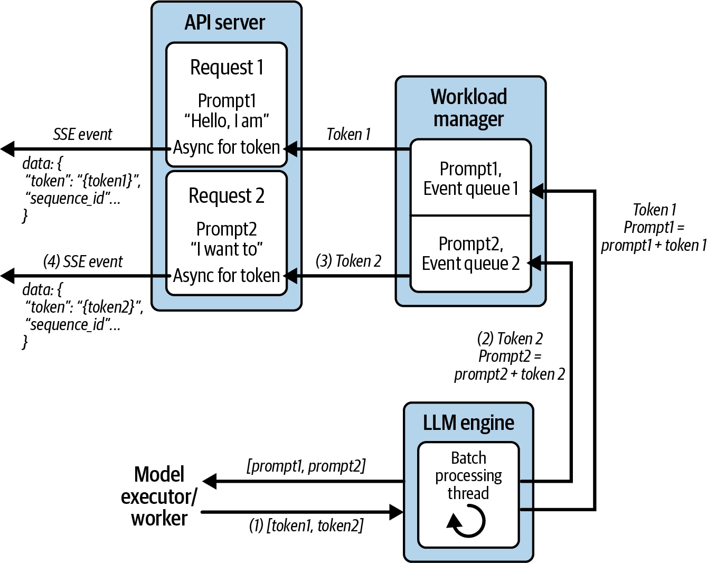

> [!info] 배치 요청 처리
> 
> - 요청
>   
> ```
> POST /generate_stream
> {
> 	"prompts": "Hello, I am"
> }
> ```
> 
> - 응답
> 
> ```
> {
> 	data: {"token": " a", "sequence_id": "97ebad71-94ce-4c77-908d-e3fd3363bcd3"}
> 	
> 	data: {"token": " student", "sequence_id": "97ebad71-94ce-4c77-908d-e3fd3363bcd3"}
> 	
> 	data: {"token": " in", "sequence_id": "97ebad71-94ce-4c77-908d-e3fd3363bcd3"}
> 	
> 	...
> 	
> 	data: {"token": " games", "sequence_id": "97ebad71-94ce-4c77-908d-e3fd3363bcd3"}
> }
> ```

- 스트리밍이 왜 필요한지는 이전에 주차에 배웠다. ([왜 Streaming?](./05-llm-serving-study-week1.md#llm-streaming-serving))
	- 모델 전체 계산 시간을 줄이는 것은 아니다.
	- 하지만, 첫 토큰부터 바로 보여주기 때문에, 체감 지연시간이 크게 줄어든다.
- `/generate`와 달리, input으로 단일 prompt만 들어가지만, 내부적으로 다른 유저의 prompt들과 섞여 배치처리가 된다.
- GPU에서는 Batch 단위로 계산하지만, 결과는 Sequence ID를 이용해 각 요청의 Queue로 분배한다.
	- 이 Queue는 각 요청의 Queue(`asyncio.Queue`)이며, `Sequence`와 함께 보관된다. (비스트리밍은 이 자리가 `None`)
- 앞서 배치처리의 트레이드 오프 중 블로킹된다는 단점이 있었다. 반면, 스트리밍 배치 처리의 경우에는 한 스텝에 토큰 1개씩만 생성하고, 즉시 클라이언트에 흘려보낸다. 이에 이 단점이 해결된다.
- 이러한 과정은 Continuous Batching 처리를 하며, 이는 더 효율적인 처리를 돕는다. (모든 배치 작업이 끝날 때 까지 기다리는 것이 아니라, 빈자리 생기면 바로 채워줌)

---
#### 스트리밍 배치 요청 처리 - 코드

```python
# llm/llm.py
class LLMEngine:
	...
	self.thread = threading.Thread(target=self.requests_processing_loop, daemon=True)  
	self.thread.start()
	...
	def requests_processing_loop(self):  
    """Process requests in a loop."""  
    while True:  
        try:  
            active_sequences = self.workload_manager.get_next_batch(is_streaming=True)  
            if not active_sequences:  
                time.sleep(0.1)  
                continue  
                # Process batch through model, forward pass.  
            prompts = [{'prompt': seq.prompt, 'request_id': seq.id} for seq in active_sequences]  
            prompts_results = self.model_executor.execute_forward_batch(prompts)  
              
            # Stream tokens back to respective clients  
            for result in prompts_results:  
                seq = self.workload_manager.get_sequence(result['request_id'])  
                if result['is_finished'] or seq.token_count > self.max_tokens:  
                    # Use run_coroutine_threadsafe to safely put None in the main loop's queue  
                    asyncio.run_coroutine_threadsafe(  
                        seq.client_stream.put(None),  
                        seq.loop  
                    )  
                    seq.finished = True  
                    self.workload_manager.remove_finished_sequence(result['request_id'])  
                else:  
                    # Use run_coroutine_threadsafe to safely put data in the main loop's queue  
                    asyncio.run_coroutine_threadsafe(  
                        seq.client_stream.put(  
                            json.dumps({"token": result['token'], "sequence_id": result['request_id']})  
                        ),  
                        seq.loop  
                    )  
                    self.workload_manager.update_sequence_output(result['request_id'], result['token'])  
              
        except Exception as e:  
            print(f"Error in processing loop: {e}")  
            time.sleep(0.1)
```

- `threading.Thread(target=self.requests_processing_loop, daemon=True)`
	- `/generate_stream` 경로의 컨트롤러가 `event_generator()` 만 호출하고 해당 메서드는 그냥 계속 스트리밍 요청을 넣기만 하는데, 응답 스트리밍이 생성되는 이유는 위 코드 때문이다.
	- `LLMEngine`이 처음에 초기화될 때부터 이미 `requests_proceessing_loop` 이 돌고 있으며, `event_generator` 가 `add_streaming_request`를 하면 이 요청을 처리하고, `await queue.get()`으로 응답을 받는 것이다.
- `workload_manager.get_next_batch`
	- 이전에 배치에서 했던 것 처럼 배치 사이즈만큼 배치를 채우는 함수
- `model_executor.execute_forward_batch`
	- 현재 배치를 모델 worker 프로세스에 넘기고(`task_queue`에 넣는) 결과를 받는(`result_queue`에서 받는) 함수
- 이후부터는, 결과의 `request_id`를 보고 원래 `Sequence`를 찾아 해당 클라이언트의 Queue에 token을 전달하는 과정이다.

```python
# main.py
@app.post("/generate_stream")  
async def generate_stream(request: GenerateRequest, llm: LLMEngine = Depends(get_llm)):  
    async def event_generator():  
        loop = asyncio.get_event_loop()  
        async for token in llm.event_generator(loop, request.prompt):  
            # token = 'data: {"token": " a", "sequence_id": "8310f5e1-6f6f-480e-b2f9-c8144a12cc17"}\n\n'  
            yield token  
      
    return StreamingResponse(  
        event_generator(),  
        media_type="text/event-stream"  
    )
```

- `async`로 비동기

```python
# llm/llm.py
class LLMEngine:
	...
	async def event_generator(self, loop, prompt: str):  
	      
	    asyncio.set_event_loop(loop)  
	    # Create a queue for this client's stream  
	    queue = asyncio.Queue()  
	      
	    # Add streaming request to workload manager with the queue  
	    seq_id = self.workload_manager.add_streaming_request(prompt, queue, loop)  
	      
	    print(f"Created queue for sequence {seq_id} in loop {id(loop)} and queue {id(queue._get_loop())}")  # Debug print  
	    try:  
	        while True:  
	            print(f"Waiting for data in queue for sequence {seq_id}")  # Debug print  
	            # Get next token from queue            
	            data = await queue.get()  
	            print(f"Received data in queue for sequence {seq_id}: {data}")  # Debug print  
	            if data is None:  # End of stream  
	                print(f"End of stream for sequence {seq_id}")  # Debug print  
	                break  
	            yield f"data: {data}\n\n"  
	    except Exception as e:  
	        print(f"Error in stream for sequence {seq_id}: {e}")  
	    finally:  
	        # Clean up  
	        self.workload_manager.remove_finished_sequence(seq_id)  
	        print(f"Cleaned up sequence {seq_id}")  # Debug print
```

- `requests_processing_loop` 에 이벤트를 넣고(`add_streaming_request`), 결과를 받는다(`data = await queue.get()`).

---
#### 스트리밍 배치 요청 처리 - 요약

> [!info] 요약
> - 이제 **generation** **API**가 **비동기**로 전환되어, **토큰이 생성되는 즉시 사용자가 업데이트**를 **받을 수** 있다.
> - **ModelWorker**는 전체 출력을 한 번에 생성하는 대신, **추론 단계마다 하나의 토큰을 생성**한다.
> - **WorkloadManager는 부분 출력을 추적**하고, 각 프롬프트를 **실시간으로 새로 생성된 토큰으로 업데이트**한다.
> - **각 프롬프트는 자체 이벤트 큐**를 가지게 되어, **LLMEngine이 ModelWorker에서 비동기 API 계층**으로 토큰을 효율적으로 **전달**할 수 있다.
> - LLMEngine은 프롬프트 전반에 걸쳐 **토큰 단위 추론을 조율하는 전용 배치 처리 스레드**를 포함하고 있다.

---
#### vLLM 배치 서빙


> [!info] 배치 요청 처리
> 
> - 요청
>   
> ```
> POST /generate
> {
> 	"prompts": [
> 		"Hello, I am",
> 		"The weather is",
> 		"I want to",
> 		"The best way to",
> 		"The most efficient way to"
> 	]
> }
> ```
> 
> - 응답
> 
> ```
> {
> 	"generated_texts": [
> 		" a fan of the videos! What did you do?\nI did a few edits, I just",
> 		" so frigid I've been thinking of making a tent.\nI love that idea. I'd",
> 		" know the actual story behind this. I know this will be posted in the near future, but I",
> 		" get a pen is to get a pen that is a good quality one.  I got one for",
> 		" kill the virus is to stay home.\nThe best way to kill the virus is to stay home"
> 	]
> }
> ```

- 직접 구현한 batching/streaming logic은 학습에는 좋지만 production에서는 복잡도가 높다.
- vLLM은 batching, scheduling, KV cache 관리 등을 내부에서 처리한다.

| |수동 구현 (generate, event_generator)|vLLM 구현 (generate_vllm)|
|---|---|---|
|배치 구성|WorkloadManager.get_next_batch() : FIFO + 고정 batch_size=4|vLLM 내부 스케줄러 (**continuous batching**)|
|토큰 생성|ModelWorker가 별도 프로세스에서 한 스텝씩 forward (use_cache=False로 매번 전체 재계산 , O(n²) 비효율)|vLLM의 PagedAttention + KV 캐시로 최적화|
|결과 매핑|sequence_map, request_id 수동 추적|vLLM LLM.generate()가 입력 순서 그대로 outputs 반환|
|스트리밍|client_stream(asyncio.Queue) + 백그라운드 스레드 직접 구현|vLLM이 내부적으로 처리(별도 API 필요)|
|코드량|workload_manager.py(90줄) + model_executor.py(72줄) + model_worker.py(141줄)|llm.py:151-174, 약 20줄|

---
#### vLLM 배치 서빙 - 코드, 요약

```python
# llm/llm.py
class LLMEngine:
	...
	def generate_vllm(self, prompts: List[str]) -> List[str]:  
	    """  
	    Generate text using vLLM for multiple prompts.        Args:  
	        prompts: List of prompts to generate text for            Returns:  
	        List of generated texts    """    # Configure sampling parameters  
	    sampling_params = SamplingParams(  
	        temperature=0.7,  
	        top_p=0.95,  
	        max_tokens=self.max_tokens  
	    )  
	      
	    # Generate text for all prompts  
	    outputs = self.vllm_model.generate(prompts, sampling_params)  
	      
	    # Extract generated text from outputs  
	    generated_texts = [output.outputs[0].text for output in outputs]  
	      
	    return generated_texts
```

- 단 10줄의 코드로 배치 추론을 활성화할 수 있다.
- 이 때문에 이러한 서비스 프레임워크가 모델 서비스 구현에서 매우 널리 사용된다.
- 또한, 서빙 프레임워크는 독립 실행형 웹 서버로 실행될 수 있다. (Without FastAPI)
	- 선택은 2가지다.
	- 프레임워크를 커스텀 서빙 애플리케이션 내에 라이브러리 형태로 임베드해 긴밀한 통합과 실행 흐름에 대한 높은 제어를 가능하게 하거나
	- 독립적인 웹 서버로 실행해 외부 클라이언트나 다른 서비스가 호출할 수 있는 REST 또는 스트리밍 API를 제공하거나
	- 실제 환경에서는 서빙 프레임워크를 독립적인 웹 서버 모드로 실행하는 경우가 많다.

> [!info] 그럼 왜 위와같은 과정을 공부했는가?
> - 내부 원리를 알아야 다음 설정을 올바르게 튜닝할 수 있다.
 >    - _최대 동시 Sequence 수_
 >    - _Batch Token 수_
 >    - _GPU Memory Utilization_
 >    - _KV Cache 크기_
 >    - _Chunked Prefill_
 >    - _Scheduling 정책_

---
### A General Design for Single-Model LLM Serving

---
#### Single-Model Serving 요구사항

- **Low Latency**: 빠른 추론 및 응답
    - 스트리밍을 통해 **체감 지연(TTFT)** 감소
- **High Throughput**: 많은 요청을 동시에 처리
    - **Batching**으로 여러 요청을 한 번에 추론해 GPU 활용률 향상
- **Scalability**: 트래픽에 따라 확장
    - 멀티 프로세스·멀티 GPU·멀티 노드 기반 **수평 확장** 필요
- **Reliability & Availability**: 장애 상황에서도 안정적인 서비스 제공
- **Resource Efficiency**: GPU/CPU/메모리를 효율적으로 사용해 비용 절감
    - 모델 크기뿐 아니라 **메모리 할당 및 서빙 설정 튜닝**이 중요
- **Observability**: Latency, Throughput, Error Rate 등을 모니터링해 병목 및 SLO 관리

추가적으로,

- **Large Model & Memory**: 거대한 모델을 GPU 메모리에 효율적으로 배치
- **KV Cache Management**: 디코딩 과정의 KV Cache를 효율적으로 관리
- **Streaming**: 생성되는 토큰을 즉시 클라이언트에 전달
- **Variable-length Batching**: 입력·출력 길이가 서로 다른 요청을 **동적으로 스케줄링/배칭**

> **전통적인 모델 서빙은 모델을 비교적 블랙박스로 취급할 수 있지만(비교적 안정적이기 때문), LLM 서빙은 모델의 구조와 추론 특성을 이해하는 Model-aware Serving이 필요하다.**

특히 **KV Cache, Attention 구조, Context Length, 요청별 출력 길이** 등에 따라 최적의 서빙 전략이 달라진다.

따라서 LLM Serving 시스템은 **모델별로 변하는 영역과 안정적인 서빙 인프라를 분리**하여, 새로운 모델이나 아키텍처가 등장해도 유연하게 대응할 수 있도록 설계하는 것이 중요하다.

---
#### General Design

핵심은 **서빙 시스템의 관심사를 3개 영역으로 분리**하는 것이다.

|영역|역할|주요 관심사|
|---|---|---|
|**A. Infrastructure Management**|서비스 인프라 관리|스케일링, 가용성, 장애 복구, 리소스 할당, 모니터링|
|**B. Serving Frontend**|비즈니스 로직 처리|인증/인가, 요청 처리, 배칭, Rate Limit, 외부 시스템 연동|
|**C. Serving Backend**|실제 모델 추론|저지연·고처리량 추론, KV Cache, Continuous Batching, GPU 최적화|

<span class="t-blue">A. Infrastructure Management</span>

- 모델 서비스를 **Container/Pod 같은 재현 가능한 단위**로 실행
- Kubernetes/Cloud 등에 인프라 관리를 위임
- **Replica 수평 확장/축소**
- Health Check 및 장애 인스턴스 재시작
- CPU/GPU/Memory 리소스 할당
- Logging/Monitoring
- 사용자는 개별 인스턴스가 아닌 **Load Balancer를 통해 접근**

→ **서비스 코드가 스케일링이나 장애 복구 같은 인프라 문제를 직접 처리하지 않도록 분리**

<span class="t-blue">B. Serving Frontend</span>

클라이언트와 모델 추론 엔진 사이의 **중간 계층**이다.

- 인증/인가
- 요청 검증 및 정규화
- 요청 배칭
- Rate Limiting
- 모델 설정 및 Runtime Context 관리
- 로깅
- 사용자 데이터, 결제, 감사 로그 등 **외부 시스템 연동**

→ 쉽게 말하면 **일반적인 백엔드 애플리케이션 영역**

<span class="t-blue">C. Serving Backend</span>

실제 **LLM 추론만 담당하는 고성능 엔진**이다.

보통 Frontend와 **별도 프로세스**로 실행하며 외부에서 직접 접근하지 않는다.

대표적으로 **vLLM, Triton** 같은 Serving Framework를 사용한다.

- GPU 기반 고성능 추론
- KV Cache 관리
- Continuous Batching
- 가변 길이 요청 스케줄링
- Quantization
- GPU 메모리/연산 최적화

→ **비즈니스 로직과 모델 성능 최적화를 분리**

---
### Build a Multi-Model Serving Service from Scratch

---
#### 멀티 모델 서빙이 필요한 이유

단일 모델 서빙은 **트래픽이 예측 가능하고 모델별 전용 자원이 충분한 환경**에서는 단순하고 효과적이다. 하지만 실제 서비스에서는 LLM, 임베딩, 이미지 분류 등 <span class="t-red">여러 모델을 동시에 제공해야 할 수 있다.</span>

모델마다 서버/GPU를 따로 할당하면 모델별 트래픽 편차 때문에 다음과 같은 문제가 발생한다.

```
Model A 서버 → 사용률 10%
Model B 서버 → 사용률 20%
Model C 서버 → 사용률 5%
Model D 서버 → 사용률 80%
```

즉, <span class="t-red">어떤 자원은 놀고 있는데 다른 자원은 과부하</span>가 걸린다. 따라서 여러 모델이 **하나의 공유 인프라를 함께 사용**하고, 요청에 따라 적절한 모델로 동적으로 라우팅하는 <span class="t-red">멀티 모델 서빙(Multi-Model Serving)이 필요</span>하다.

이번에는 **LLM 2개 + 이미지 분류 모델 1개**, 총 3개 모델을 하나의 서비스에서 CPU로 서빙한다.

핵심적으로 다음 3가지를 학습한다.

|목표|핵심 내용|
|---|---|
|**Cross-framework support**|Transformers, PyTorch/TorchVision, ONNX 등 서로 다른 프레임워크와 모델 유형을 하나의 시스템에서 지원|
|**Unified API interface**|모델 종류와 관계없이 `/predict` 같은 하나의 API로 요청하고 `model_id`를 통해 대상 모델 선택|
|**Resource management**|필요한 모델만 **Lazy Loading**하고 메모리가 부족하면 **LRU 방식으로 오래 사용하지 않은 모델을 제거**|

---
#### Service Architecture


[구성 요소]

- **API Server** : HTTP 요청/응답 처리 및 요청을 Model Manager로 전달
- **Model Manager** : **중심 컴포넌트**. 모델 캐시와 Model Worker의 생명주기를 관리
    - 캐시에 모델이 없으면 새로운 Worker 생성 요청
    - 캐시가 가득 차면 LRU 등의 정책으로 오래 사용하지 않은 Worker 제거
- **Model Store** : 모델 ID, 모델 종류 등 **모델 메타데이터를 저장·조회**
- **Model Engine** : Model Store의 메타데이터를 기반으로 **실제 Model Worker 인스턴스를 생성**
- **Model Worker** : 모델을 메모리에 로드하고 **실제 추론을 수행**
    - 예: `TransformerWorker`, `TorchVisionWorker`
- **Model Cache** : `(Model ID, Model Worker)` 형태로 현재 생성된 Worker를 캐싱

> **핵심:** `Model Manager`가 **어떤 모델을 유지/생성/제거할지 결정**하고, `Model Engine`이 **실제 Worker를 생성**하며, `Model Worker`가 **실제 추론을 수행**하는 구조.

---
#### Multi-model serving - 코드 구조

> 코드 : https://github.com/orca3/llm-model-inference/tree/main/ch03/multi_model_serving

[코드 구조]

```
multi_model_serving/
├── app            # 아래 핵심 로직
│   ├── engine.py  # Model worker factory and management
│   ├── manager.py # Model caching and lifecycle
│   ├── server.py  # FastAPI server and endpoints
│   ├── store.py   # Model metadata management
│   └── worker.py  # Abstract worker and framework-specific implementations
├── config
│   └── models.json # Model configurations , 모델 4개 메타데이터
├── model_dir
│   └── densenet_onnx
│       ├── 1
│       │   └── model.onnx
│       ├── config.pbtxt
│       └── densenet_labels.txt
├── README.md
├── requirements.txt
└── tests
    ├── images
    │   └── cat1.jpg
    ├── __init__.py
    ├── test_models.py
    └── test_triton_densenet.py
```

```Dockerfile
# Dockerfile
FROM python:3.11-slim  
  
ENV PYTHONUNBUFFERED=1  
  
WORKDIR /opt/project  
  
COPY requirements.txt .  
  
RUN pip install --no-cache-dir -r requirements.txt  
  
# 가중치를 이미지에 미리 받아둔다. COPY 앞이라 소스만 고치면 이 레이어는 캐시된다.  
# Triton 모델(densenet_onnx)은 model_dir 볼륨으로 붙으므로 여기서 받지 않는다.  
RUN python -c "\  
from transformers import AutoModelForSequenceClassification, AutoTokenizer; \  
from torchvision.models import mobilenet_v2, MobileNet_V2_Weights; \  
AutoModelForSequenceClassification.from_pretrained('distilbert-base-uncased-finetuned-sst-2-english'); \  
AutoTokenizer.from_pretrained('distilbert-base-uncased-finetuned-sst-2-english'); \  
AutoModelForSequenceClassification.from_pretrained('mrm8488/bert-tiny-finetuned-sms-spam-detection'); \  
AutoTokenizer.from_pretrained('mrm8488/bert-tiny-finetuned-sms-spam-detection'); \  
mobilenet_v2(weights=MobileNet_V2_Weights.DEFAULT)"  
  
COPY . .  
  
CMD ["python", "-m", "app.server"]
```

```yaml
# compose.yaml
services:  
  app:  
    build: .  
    gpus: all  
    # torch 가 쓰는 공유 메모리. 도커 기본값 64MB 로는 부족하다.  
    shm_size: "2gb"  
    ports:  
      - "8001:8001"  
    environment:  
      # 컨테이너 안에서는 localhost 가 아니라 서비스 이름으로 Triton 을 찾는다.  
      TRITON_URL: "triton:8000"  
    volumes:  
      # 이미지 모델 입력은 파일 경로 문자열로 넘어간다. 이미지를 추가할 때마다  
      # 재빌드하지 않도록 COPY 된 경로 위에 그대로 덮어 마운트한다.  
      - ./tests/images:/opt/project/tests/images:ro  
    depends_on:  
      triton:  
        condition: service_healthy  
  
  triton:  
    image: nvcr.io/nvidia/tritonserver:24.12-py3  
    gpus: all  
    shm_size: "2gb"  
    # explicit 모드라 기동 시엔 아무 모델도 안 올라간다. TritonWorker 가 API 로 로드한다.  
    command: tritonserver --model-repository=/models --model-control-mode=explicit  
    volumes:  
      - ./model_dir:/models:ro  
    ports:  
      - "8009:8000"  
    healthcheck:  
      test: ["CMD", "curl", "-f", "http://localhost:8000/v2/health/ready"]  
      interval: 5s  
      retries: 20
```

> 아래는 싱글모델 실습 때 했던 것 처럼, GPU를 쓰기 위한 설정이다.

```python
# app/worker.py
class ModelWorker(ABC):  
    def __init__(self, model_metadata):  
        self.model_metadata = model_metadata  
        self.model: Optional[torch.nn.Module] = None  
        # 아래 1줄 추가 
        self.device = "cuda" if torch.cuda.is_available() else "cpu"  
        self._load_model()

...

class TransformerWorker(ModelWorker):
	...
	def _load_model(self):  
	    if self.model is None:  # Only load if not already loaded  
			self.model = AutoModelForSequenceClassification.from_pretrained(self.model_metadata.name)
			# 아래 2줄 추가  
			self.model.to(self.device)  
			self.model.eval()  
			self.tokenizer = AutoTokenizer.from_pretrained(self.model_metadata.name)
	
	def predict(self, input_data: Any) -> Dict[str, Any]:  
	    if self.model is None or self.tokenizer is None:  
	        raise RuntimeError("Model or tokenizer not initialized")  
		# 기존 코드에서 .to(self.device) 추가
	    inputs = self.tokenizer(input_data, return_tensors="pt", padding=True, truncation=True).to(self.device)  
	    with torch.no_grad():  
	        outputs = self.model(**inputs)  
	    predictions = torch.softmax(outputs.logits, dim=-1)  
	    # 응답은 JSON 이라 CPU 로 내려서 직렬화한다.  
	    return {"predictions": predictions.cpu().tolist()}

...

class TorchVisionWorker(ModelWorker):
	...
	def _load_model(self):  
    if self.model is None:  # Only load if not already loaded  
        self.model = mobilenet_v2(weights=MobileNet_V2_Weights.DEFAULT)  
        # 아래 1줄 추가
        self.model.to(self.device)  
        self.model.eval()  
        self.transform = transforms.Compose([  
            transforms.Resize(256),  
            transforms.CenterCrop(224),  
            transforms.ToTensor(),  
            transforms.Normalize(mean=[0.485, 0.456, 0.406], std=[0.229, 0.224, 0.225])  
        ])
    
    def predict(self, input_data: Any) -> Dict[str, Any]:  
	    if self.model is None or self.transform is None:  
	        raise RuntimeError("Model or transform not initialized")  
	    if isinstance(input_data, str):  
	        image = Image.open(input_data).convert('RGB')  
	    else:  
	        image = input_data  
	    # 기존 코드에서 .to(self.device) 추가
	    image_tensor = self.transform(image).unsqueeze(0).to(self.device)  
	    with torch.no_grad():  
	        outputs = self.model(image_tensor)  
	    predictions = torch.softmax(outputs, dim=1)
	    # 응답은 JSON 이라 CPU 로 내려서 직렬화한다.   
	    return {"predictions": predictions.cpu().tolist()}

...

class TritonWorker(ModelWorker):
	def __init__(self, model_metadata):  
	    # 아래 코드로 변경 
	    self.triton_url = os.getenv("TRITON_URL", "0.0.0.0:8009")  
	    self.client = httpclient.InferenceServerClient(url=self.triton_url)  
	    super().__init__(model_metadata)
```

```python
# tests/test_triton_densenet.py
class TestTritonDenseNet(unittest.TestCase):  
    def setUp(self):  
	    # 아래처럼 수정
        self.triton_url = os.getenv("TRITON_URL", "0.0.0.0:8009")
```

---
#### 코드 뜯어보기

먼저 요청이 들어오는 API 서버 부터

```python
# app/server.py
@app.post("/predict")  
async def predict(request: PredictionRequest):  
    # Get model worker  
    worker = model_manager.get_model_worker(request.model_id)  
    if not worker:  
        raise HTTPException(status_code=404, detail=f"Model {request.model_id} not found")  
      
    # Make prediction  
    try:  
        result = worker.predict(request.input_data)  
        return result  
    except Exception as e:  
        raise HTTPException(status_code=500, detail=str(e))  
  
@app.get("/models")  
async def list_models():  
    return {  
        "available_models": model_store.list_models(),  
        "loaded_models": model_manager.list_loaded_models()  
    }
```

- `/models`는 어떤 모델들이 있는지 조회하고, 해당 모델들의 정보를 조회하는 API
	- 우선 아래 `manager.py` 에서 모델 조회를 어떻게 처리하는지 보자.
- `/predict` 모델을 지정하고, 해당 모델에 대한 추론을 진행하는 API

```python
# app/manager.py
class ModelManager:  
    def __init__(self, model_store: ModelStore, max_models: int = 2):  
        self.model_store = model_store  
        self.max_models = max_models  
        self.model_cache = OrderedDict()  # OrderedDict to track least recently used, id -> worker  
        self.model_engine = ModelEngine()  
      
    def get_model_worker(self, model_id: str) -> Optional[ModelWorker]:  
        # Check if model is in cache  
        if model_id in self.model_cache:  
            # Move to end (most recently used)  
            self.model_cache.move_to_end(model_id)  
            return self.model_engine.get_worker(model_id)  
          
        # Get model metadata  
        model_metadata = self.model_store.get_model(model_id)  
        if not model_metadata:  
            return None  
        # Check if we need to remove least used model  
        if len(self.model_cache) >= self.max_models:  
            # Remove least recently used model  
            id, model_worker = self.model_cache.popitem(last=False)  
            self.model_engine.delete_worker(id)  
              
        # Download model if not already downloaded  
        # Skip the downlaod implementation for simplicity        
        # if not self.model_store.model_exists(model_id):        
        #     self.model_store.download_model(model_id)   
                     
        # Create and cache new model worker  
        self.model_cache[model_id] = self.model_engine.create_worker(model_metadata)  
        return self.model_cache[model_id]  
      
    def list_loaded_models(self) -> Dict[str, str]:  
        return {model_id: worker.model_metadata.name   
                for model_id, worker in self.model_cache.items()}
```

- `get_model_worker`
	- 요청한 모델의 Worker를 가져오는 메서드
	- 모델이 이미 캐시에 있다면
		- 방금 사용했으니 LRU 순서의 맨 뒤로 이동 (LRU : 가장 오랫동안 사용하지 않은 것을 먼저 삭제)
		- 기존 Workeer 반환
	- 모델이 캐시에 없다면
		- `ModelStore`에서 해당 모델 정보 조회
			- 존재하지 않는 모델이면 `None`
		- 캐시가 꽉 찼다면
			- LRU에서 가장 높은 순서 모델 제거 (가장 오랫동안 사용하지 않은 모델)
			- 실제 `ModelEngine`에서도 Worker 삭제
		- 새로운 Worker 생성 및 캐시에 저장 후 생성한 Worker 리턴
	- `model_engine.create_worker()` 메서드에 대한 설명은 아래에서 이어서 진행
- `list_loaded_models`
	- 현재 캐시에 있는 모델 목록을 반환

> [!tip] ModelManager가 가장 중요한 이유
> - ModelManager이 '어떤 모델을 RAM/VRAM/HBM에 올려둘 것인가?'를 결정하는 역할이기 때문

```python
# app/engine.py
class ModelEngine:
	...
	def create_worker(self, model_metadata: ModelMetadata) -> ModelWorker:  
	    if model_metadata.id not in self.workers:  
	        if model_metadata.framework == "transformers":  
	            self.workers[model_metadata.id] = TransformerWorker(model_metadata)  
	        elif model_metadata.framework == "torchvision":  
	            self.workers[model_metadata.id] = TorchVisionWorker(model_metadata)  
	        elif model_metadata.framework == "triton":  
	            self.workers[model_metadata.id] = TritonWorker(model_metadata)  
	        else:  
	            raise ValueError(f"Unsupported framework: {model_metadata.framework}")  
	    return self.workers[model_metadata.id]
```

- ModelEngine은 프레임워크별 worker를 생성한다.
- 여기서 알 수 있는 점은 다양한 모델 유형을 지원하기 위해서 서로 다른 모델 백엔드가 필요하다는 점이다. (`TransformerWorker`, `TorchVisionWorker`, `TritonWorker`)

```python
# app/worker.py
class ModelWorker(ABC):  
    def __init__(self, model_metadata):  
        self.model_metadata = model_metadata  
        self.model: Optional[torch.nn.Module] = None  
        # 단일 모델 서빙과 같은 규칙. GPU 가 보이면 쓰고, 없으면 CPU 로 떨어진다.  
        self.device = "cuda" if torch.cuda.is_available() else "cpu"  
        self._load_model()  
      
    @abstractmethod  
    def _load_model(self):  
        pass  
    @abstractmethod  
    def predict(self, input_data: Any) -> Dict[str, Any]:  
        pass
        
class TransformerWorker(ModelWorker):
	...

class TorchVisionWorker(ModelWorker):
	...
	
class TritonWorker(ModelWorker):
	...
```

- 크게 내용 자체를 뜯어볼 필요는 없고, `ModelWorker`라는 인터페이스를 선언하고, 하위 구현체들이 각자의 방법으로 `_load_model`, `predict` 메서드를 구현하고 있다는 점이다.

> [!tip] 서빙 프레임워크
> - 실제로는 다양한 모델의 로드와 실행을 위한 백엔드 지원을 유지하고, 모델 메타데이터와 구성을 관리하며, 스레드 안전성과 동시성을 조율하는 일이 복잡하고 오류가 발생하기 쉽다. 
> - 이런 이유로, 이러한 책임을 전용 멀티 모드 서빙 프레임워크에 위임하는 것이 더 효율적인 경우가 많다.
> - 이를 통해 해당 프레임워크를 비즈니스 애플리케이션에 통합하는 데 본인의 노력을 집중할 수 있다.

---
#### 모델 리스트 조회하기

> [!info] 모델 리스트 조회하기
> 
> - 요청
>   
> ```
> GET /models
> ```
> 
> - 응답
> 
> ```
> {
>   "available_models": {
>     "550e8400-e29b-41d4-a716-446655440000": {
>       "id": "550e8400-e29b-41d4-a716-446655440000",
>       "name": "distilbert-base-uncased-finetuned-sst-2-english",
>       "type": "text",
>       "framework": "transformers",
>       "version": "1.0.0",
>       "description": "Sentiment analysis model"
>     },
>     "6ba7b810-9dad-11d1-80b4-00c04fd430c8": {
>       "id": "6ba7b810-9dad-11d1-80b4-00c04fd430c8",
>       "name": "mrm8488/bert-tiny-finetuned-sms-spam-detection",
>       "type": "text",
>       "framework": "transformers",
>       "version": "1.0.0",
>       "description": "Spam detection model"
>     },
>     "7c9e6679-7425-40de-944b-e07fc1f90ae7": {
>       "id": "7c9e6679-7425-40de-944b-e07fc1f90ae7",
>       "name": "pytorch/vision:mobilenet_v2",
>       "type": "image",
>       "framework": "torchvision",
>       "version": "1.0.0",
>       "description": "Image classification model"
>     },
>     "8ba7b810-9dad-11d1-80b4-00c04fd430c9": {
>       "id": "8ba7b810-9dad-11d1-80b4-00c04fd430c9",
>       "name": "densenet_onnx",
>       "type": "image",
>       "framework": "triton",
>       "version": "1.0.0",
>       "description": "DenseNet image classification model served via Triton"
>     }
>   },
>   "loaded_models": {}
> }
> ```

- `550e8400-e29b-41d4-a716-446655440000`
	- 감성 분석 - 영어 문장을 넣으면 negative/positive 2클래스 확률을 반환
- `6ba7b810-9dad-11d1-80b4-00c04fd430c8`
	- 스팸 탐지 - 문자열이 스팸인지 2클래스 확률로 반환
- `7c9e6679-7425-40de-944b-e07fc1f90ae7`
	- 이미지 분류 - ImageNet 사전학습, 1000 클래스 확률 반환
- `8ba7b810-9dad-11d1-80b4-00c04fd430c9`
	- 이미지 분류를 Triton 서버 경유로 수행. 역시 ImageNet 1000 클래스 확률 반환

- `loaded_models`
	- 현재 메모리(RAM, VRAM, HBM 등)에 어떤 모델이 로드되어 있는지

---
#### 모델 별 추론

> [!info] 감성 분석
> 
> - 요청
>   
> ```
> {
>   "model_id": "550e8400-e29b-41d4-a716-446655440000",
>   "input_data": "This movie was great! I really enjoyed it."
> }
> ```
> 
> - 응답 : 99.998퍼센트 긍정
> 
> ```
> {
>   "predictions": [
>     [
>       0.00011904458369826898,
>       0.9998809099197388
>     ]
>   ]
> }
> ```

> [!info] 스팸 예측
> 
> - 요청
>   
> ```
> {
>   "model_id": "6ba7b810-9dad-11d1-80b4-00c04fd430c8",
>   "input_data": "WIN A FREE IPHONE NOW! CLICK HERE!"
> }
> ```
> 
> - 응답 : 93.228퍼센트 스팸
> 
> ```
> {
>   "predictions": [
>     [
>       0.9322899580001831,
>       0.0677100419998169
>     ]
>   ]
> }
> ```

> [!info] 이미지 분류
> 
> 
> 
> - 요청
>   
> ```
> {
>   "model_id": "7c9e6679-7425-40de-944b-e07fc1f90ae7",
>   "input_data": "tests/images/cat1.jpg"
> }
> ```
> 
> - 응답 : TABBY라는 고양이 종 확률이 가장 높게 나왔다.
> 
> ```
> {
>   "predictions": [
>     [
>       0.0005564960883930326,
>       0.0005307781393639743,
>       ...
>     ]
>   ]
> }
> ```

---
#### Using Triton

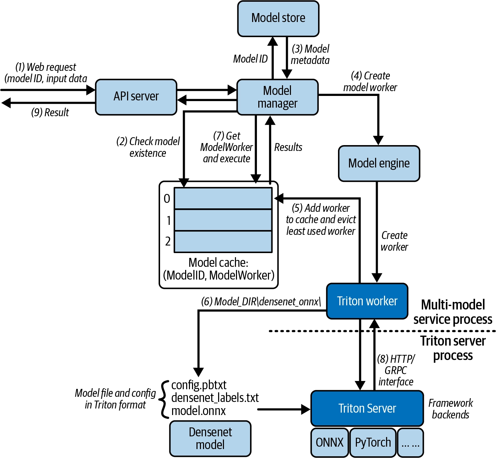

이전에 서빙 프레임워크를 사용해서, 관심사를 분리하는 것이 더 좋다고 언급했었다.

이에, 우리가 구축하는 서버에서는 Client의 요청만 처리하고, <span class="t-red">모델들을 관리(LRU를 비롯한 여러 알고리즘으로 모델을 관리)하는 책임을 프레임워크에 위임</span>한다.

이러한 프레임워크 중 하나가 Triton이다.

Triton은 웹 형태로 실행되며 2가지 주요 API를 제공한다.
- **모델 관리 API: 모델 로드/언로드/설정** (/v2/repository/models/$name/load, /unload)
- **추론 API: 실제 예측 요청** (/v2/models/$name/infer)

실제로, `app/worker.py`의 `TritonWorker` 클래스를 보면, 다른 Worker 클래스들과 달리, 이러한 요청을 Triton 서버에 요청할 뿐이다.

`TritonWorker`
-  `_load_model` : 초기화 시 Triton의 management API에 POST 요청을 보내 모델을 로드
-  `predict` : 실제 추론
-  `__del__` : 워커 소멸 시 unload API를 호출해 Triton에서 모델을 내려 GPU/CPU 메모리를 회수

> [!info] Triton API 호출
> - Triton의 경우 이전 이미지 분류 모델처럼 경로를 넣는 것이 아니라, 리사이즈 -> 정규화 -> CHW 변환한 배열을 통째로 보내야한다.
> - 이에 이러한 과정을 클로드 코드에게 맡기고 실행시켜보았다.
> 
> ```
> 200으로 잘 돌아갔습니다. top-5:
>
>    11.5500  285  EGYPTIAN CAT
>     9.5882  282  TIGER CAT
>     9.5168  287  LYNX
>     9.1649  281  TABBY
>     8.9331  284  SIAMESE CAT
>
> 보낸 요청은 이런 형태입니다 (data는 3×224×224 중첩 리스트, 약 15만 개 float):
>
> img = Image.open('tests/images/cat1.jpg').convert('RGB').resize((224,224))
> arr = (np.array(img).astype(np.float32)/255.0).transpose(2,0,1)   # (3,224,224) CHW
>
> requests.post('http://localhost:8001/predict', json={
>     'model_id': '8ba7b810-9dad-11d1-80b4-00c04fd430c9',
>     'input_data': {'data_0': {'shape': list(arr.shape), 'data': arr.tolist()}},
> })
> ```

---
### Trade-offs in Multi-Model Serving Designs

---
#### 멀티 모델 서빙 과제

- 모델별 dependency와 framework가 다를 수 있다.
- model load/unload가 latency spike를 만든다.
- hot model과 cold model의 traffic 차이가 크다. (메모리에 올라가있는 모델과 그렇지 않은 모델)
- 모델 cache eviction 정책이 성능과 비용에 직접 영향을 준다.
- 보안, 격리, observability가 single-model보다 복잡하다.

> [!tip] 가장 큰 과제 - 사용자 경험
> - Cold start latency
> 	- 현재 로드되어 있지 않은 모델에 대한 요청이 들어오면 몇 초 ~ 수십 초의 지연이 발생할 수 있다.
> - Hot model scaling
> 	- 특정 모델에 갑자기 많은 트래픽이 몰리면, 이 모델을 확장해야하는데 이것은 단순하지 않다.
> 	- 각 인스턴스가 독립적인 모델 캐시를 가지고 있기 때문에 모델을 여러 인스턴스에 복제하고 라우팅 계층을 업데이트하는 일이 복잡해진다.

---
#### 과제 해결 방법 1 - 비용 최적화 설계

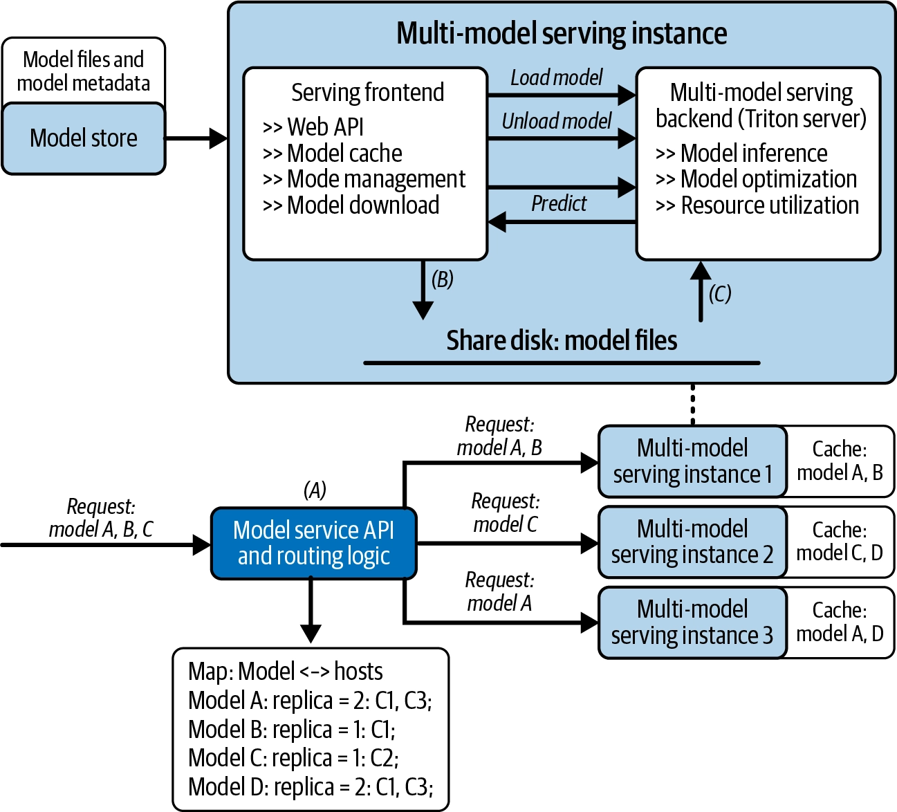

> <span class="t-red">여러 모델을 추론할 수 있는 인스턴스를 여러 개로 확장</span>하는 구조

**장점**
-  콜드 스타트 최소화
	- <span class="t-red">이미 해당 모델이 로드된 인스턴스로 요청을 라우팅</span>
-  핫 모델 수평 확장
	- 모델별 레플리카 수를 추적해, <span class="t-red">트래픽이 몰리는 모델은 여러 인스턴스의 메모리에 해당 모델 로드</span>
-  빈 패킹
	- 모델들을 최소한의 서버 수에 몰아서 배치해 자원 사용을 최적화 (각 인스턴스의 <span class="t-red">남은 메모리를 고려해 모델들을 꽉꽉 채워넣는 방식</span>)

**단점**
- 비용 효율은 높지만 트래픽에 사후 대응 하기 때문에 급격한 트래픽 증가 시 latency가 발생하고, 라우팅, 캐시, 스케일링 관리가 복잡함

---
#### 과제 해결 방법 2 - 지연시간 최적화 설계

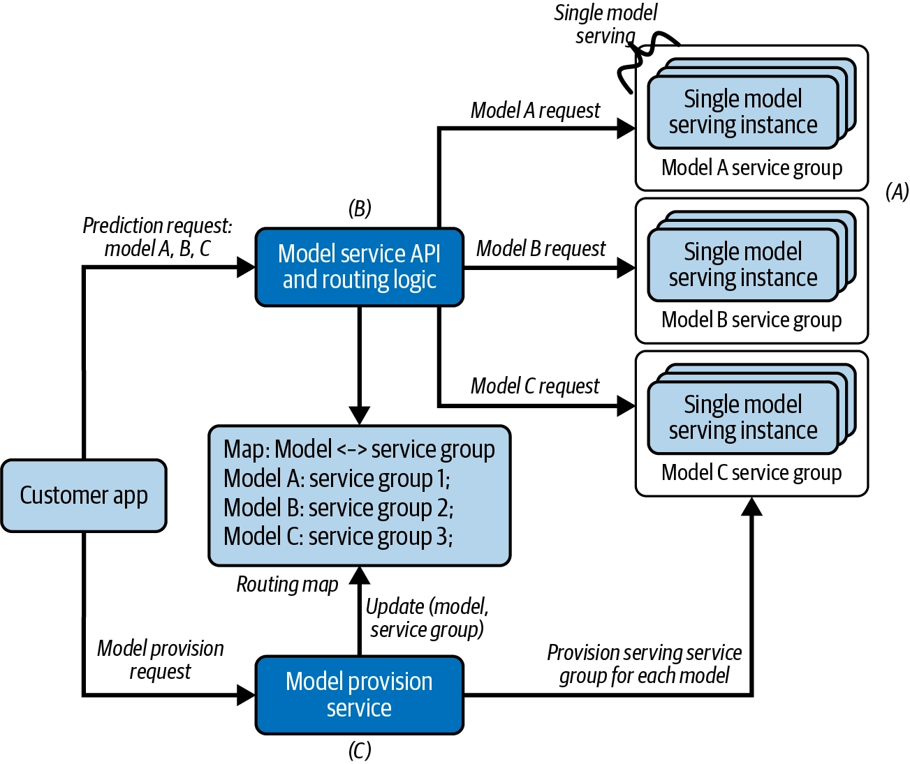

> <span class="t-red">싱글 모델 인스턴스를 두고, 요청에 따라 해당 모델 인스턴스로 추론</span>하며, 스케일링도 각자 진행

**장점**
- 콜드 스타트 지연 없음
	- 이미 각 모델 별 인스턴스가 최소 1개 이상 존재하므로 콜드 스타트 지연 없음
- 독립적 확장
	- 모델별로 따로 스케일 아웃 가능
- 운영 유연성
	- 자원 정책을 모델별로 분리 가능
- 유지보수/트러블슈팅이 상대적으로 쉬움
	- 캐시 상태 구조가 이전 구조에 비해 단순

**단점**
- 비용 효율 낮음
	- 트래픽이 적은 모델도 전용 자원을 계속 점유하므로 낭비가 생김

---
#### LLM에서의 사용 사례

<span class="t-red">일반적으로 LLM은 보통 연산/메모리 요구량이 커서 싱글 모델 서빙</span>으로 다루지만, 아래 케이스들 처럼 특수한 상황에는 멀티모델 서빙 전략이 유효함

- 프리픽스 캐싱 + 라우팅
	- 프롬프트 프리픽스가 같은 요청들을 이미 해당 KV 캐시가 채워진 특정 레플리카로 라우팅해 중복 연산을 줄임
	- ex: 
		- 프리픽스 o -> 모델 A (KV 캐시 채워짐)
		- 프리픽스 x -> 모델 B (KV 캐시 없음)
- 다중 LoRA 어댑터 서빙
	- 하나의 공유 베이스 모델 위에 여러 LoRA 어댑터를 동적으로 로드/관리
	- 테넌트별/유즈케이스별 개인화를 메모리 효율적으로 확장
	- LoRA - Base Model 전체를 따로 나누는게 아니라, 목적에 따라 일부 가중치 변화만 작은 어댑터 형태로 저장하는 방법
	- ex: 
		- 고객 A -> 금융 상담용 LoRA
		- 고객 B -> 법률 상담용 LoRA

---
## CH4. Model Serving Best Practices

---
### 개요

2~3챕터에서 모델이 내부적으로 어떻게 동작하는지를 다뤘다면, 4챕터에서는 실제 프로덕션 LLM 애플리케이션 서빙 시스템의 아키텍처를 다룬다.

다루는 범위는 다음과 같다.

1. 에이전트 애플리케이션
2. 계층형 레퍼런스 아키텍처
3. 빌드 vs 클라우드 선택
4. 핵심 성능 지표

---
### Model Serving in an Agentic World

> 앞선 챕터들에서는 모델들이 '요청 하나에 추론 한 번, 응답 반환' 이 구조였다.
> 
> 에이전트 시스템에서는 이 구조가 깨진다.
> 
> <span class="t-red">모델이 요청당 한 번이 아니라, 제어 루프 안에서 반복 호출</span>된다.
> 
> 그 루프 안에서 정보를 검색하고, 중간 결과를 추론하고, 도구를 실행하고, 출력을 다듬는 과정을 거쳐야 최종 답변이 나온다.
> 
> 사용자의 요청 한 번이 아래와 같은 작업들을 요한다.
> - 다중 LLM 호출
> - 더 긴 컨텍스트 윈도우
> - 검색 연산 (RAG)
> - 메모리 재사용 (CAG)
> 
> 이 모든게 복잡성을 증가시킵니다. 결과적으로, <span class="t-red">모델을 효율적으로 실행하는 것을 넘어, 오케스트레이션, 메모리 관리, 시스템 레벨 조정까지 지원해야하는 일</span>이 서빙의 업무가 된다.

---
#### Knowledge Agent

> 실습 코드 : https://github.com/orca3/llm-model-inference/tree/main/ch04/KnowledgeAgent
> 
> Agent의 동작 방식에 대해서는 이미 많이 숙지가 된 부분이기 때문에, Agent 동작 방식의 이해를 위한 위 실습 과정 코드 분석은 생략하겠습니다.
> 
> 아래에서는 실습을 제외한 개념적인 부분을 정리하고 넘어가겠습니다.
> 
> 짧게 요약 : <span class="t-red">Agent는 안에서 여러 모델, 도구가 실시간으로 상호작용</span>하며 동작하기 때문에, <span class="t-red">고성능, 저지연, 비용 효율적인 서빙</span>이 핵심 조건이다.

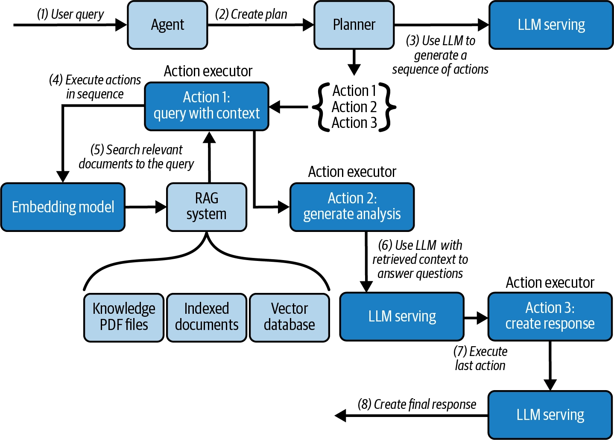

**[동작 과정]**

1. 유저 쿼리
2. LLM으로 요청 날림
	- 이 요청 대상은 LLM API일 수도 있고, 직접 서빙하는 모델일 수도 있다.
3. Planner가 plan을 만듬 (2번 요청에 대한 결과 텍스트)
	- 유저가 요청(Query)을 하였으니 이를 수행하기 위해서는 Action 1, 2, 3이 필요하겠군
4. Action 1 - Context과 함께 요청을 만들기
5. Query에 대한 Context를 만들어야한다. (RAG)
	- Query를 embedding model에 요청하여 벡터로 만든다.
	- 이 벡터를 RAG system에 있는 여러 context 청크 (텍스트 - 벡터)와 코사인 유사도(혹은 다른 알고리즘으로 유사도 측정)를 비교한다.
	- 이 청크들 중 필요한 n개를 추출하여 query의 context로 담는다.
6. 이렇게 만들어진 요청 형태 (Query + Context)를 LLM으로 요청을 날린다.
	- Query : A가 뭐야?
	- Context : A는 B이다. A는 C가 아니다. A는 D와 연관이 있다.
7. 이렇게 요청하고 받은 응답을 최종 응답 형태로 만드는 요청을 LLM으로 요청을 날린다.
	- 분석 결과 : A는 C가 아니며 D와 연관이 있으며 B이다.
	- '위 분석결과를 통해 최종 응답을 만들어줘!'
8. 7번으로 만든 최종 응답을 유저에게 반환한다.

---
#### RAG vs CAG

| |RAG|CAG|
|---|---|---|
|지식 활용|Query마다 관련 문서 검색|Knowledge를 미리 Context/KV Cache에 로드|
|Query 처리|Query → 검색 → Context → LLM|Query → 캐시된 Context → LLM|
|장점|동적 정보·최신성에 강함|검색 지연 제거, 반복 연산 감소|
|단점|검색 latency, 검색 오류, 시스템 복잡도|긴 Context로 인한 메모리/KV Cache 부담|
|적합한 경우|지식이 자주 바뀌거나 매우 큼|**고정된 Knowledge에 반복 Query**|

---
### LLM Serving in Enterprise Systems: An Overview

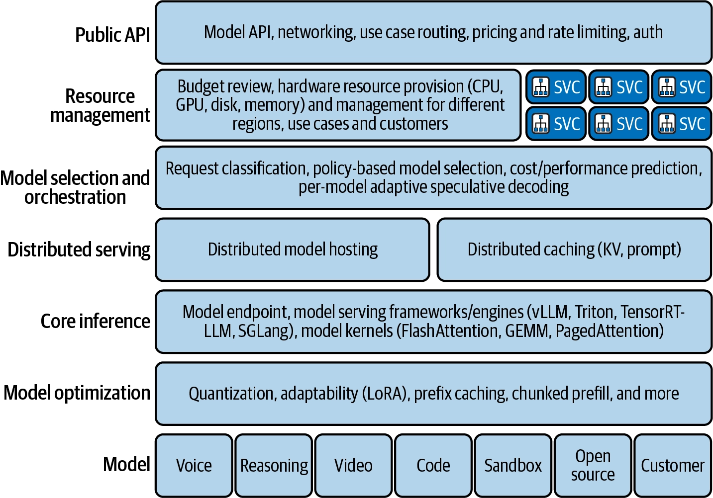

> 지금까지의 챕터는 모두 "<span class="t-red">모델을 호스팅하고 실행한다</span>"는 좁은 의미의 서빙이었다.
> 
> 이 챕터에서는 그 위에 실제 대규모 프로바이더가 추가로 감당해야하는 것들을 나열한다.
> 
> - 인증(authentication)
> - 과금 정책(pricing)
> - 리소스 관리
> - 네트워킹
> - 최적화
> - 실험(experimentation, 즉 A/B 테스트 등)
> - 관측성(observability)
> - 온콜 지원
> 
> 위와 같은 아키텍처링이 어려운 이유는 '기술적인 것 보다 조직적인 것'에 가깝기 때문이다.
> 
> - 서로 다른 책임을 가진 여러 팀이 병목이나 과도한 상호 의존성 없이 하나의 진화하는 시스템에 동시에 기여할 수 있어야 함
> - 빠른 반복(iteration)과 안정성 사이의 균형
> - 이 모든 걸 비용, 신뢰성, 사용자 경험이라는 제약 안에서 해내야 함

---
#### 레이어 1 - Public API

```
Internet
   ↓
Authentication
Rate Limit
Tenant
Billing
Routing
   ↓
LLM
```

**역할**
- 고객/개발자/내부 서비스가 접하는 외부 인터페이스
- 네트워킹
- 인증
- 과금
- rate limiting
- 요청 라우팅 관리

**해결해야할 과제**
- High concurrency - 수백만 동시 연결 처리 (고동시성)
- Fair usage and monetization - 쿼터/어뷰징 방지/정확한 과금 (공정 사용·수익화)
- Low-latency global access - 지역 라우팅·캐싱으로 최근접 리전 서빙 (저지연 글로벌 접근)
- Security - 인증·테넌트 격리·네트워크 공격 방어 (보안)

---
#### 레이어 2 - Resource Management

```
GPU Cluster
H100
H200
B200
L40S
...

누구에게 GPU를 줄 것인가?
몇 대가 필요한가?
GPU가 놀고 있지는 않은가?
중요 고객 요청을 우선 처리할 것인가?
```

**역할**
- CPU/GPU/메모리/디스크/네트워킹 같은 인프라 하드웨어를 리전 전반에서 관리, 예산/비용 배분 통합

**해결해야할 과제**
- Capacity planning - 수요 예측 및 과다 프로비저닝 방지(용량 계획)
- GPU utilization - 데이터센터 전반의 이기종 GPU 풀 고가동률 유지(GPU 활용률)
- Customer prioritization - 중요 워크로드에 쿼터/예약을 강제하면서 저우선순위는 선점 가능하게 스케줄링(고객 우선순위)

---
#### 레이어 3 - Model Selection & Orchestration

```
단순 질문
 ↓
Small Model

---

복잡한 Reasoning
 ↓
Large Model
```

**역할**
- 요청마다 어떤 모델(들)을 쓸지 결정
- 정확도/지연/비용 균형
- 여러 모델을 함께 오케스트레이션(스펙큘레이티브 디코딩 speculative decoding , 모델 패밀리 model families 간 라우팅 등)

**해결해야할 과제**
- Cost–quality trade-offs - 모든 작업에 최대 모델이 필요한 건 아님(예: OpenAI가 기본값으로 gpt-4o-mini 사용) → 쿼리를 이해해서 triaging해야 함(비용-품질 트레이드오프)
- Load balancing - 모델 풀 전반에 트래픽 분산(로드 밸런싱)
- Latency-sensitive use cases - 지연에 민감한 케이스엔 더 작고 빠른 모델이나 스펙큘레이티브 디코딩 적용

---
#### 레이어 4 - Distributed Serving

```
# 모델이 커지면 GPU 하나에 안 들어감
예:
Model Weight = 160 GB
GPU VRAM = 80 GB

# 그러면 최소한 여러 GPU로 나눠야 함
GPU 0
GPU 1
```

**역할**
- 분산 실행 인프라 구성
    - (a) 대형 모델을 위한 분산 호스팅
    - (b) KV 캐시·프롬프트 캐시·시맨틱 캐시 같은 분산 캐싱으로 중복 연산 감소

**해결해야할 과제**
- Hardware limitations - 모델 크기가 단일 GPU 메모리 초과(하드웨어 한계)
- Multi-GPU and multi-node coordination - 멀티GPU/멀티노드가 요청 컨텍스트를 효율적으로 공유해 SLA 유지(코디네이션)
- Caching for efficiency - KV-캐시 인식 라우팅으로 중복 추론 감소(캐싱 효율)

---
#### 레이어 5 - Core Inference

```
Framework 예시:
	vLLM
	Triton
	TensorRT-LLM
	SGLang

최적화:
	FlashAttention
	GEMM
	PagedAttention
```

**역할**
- 모델이 실제로 실행되는 곳
- vLLM/Triton/TensorRT-LLM/SGLang 같은 서빙 프레임워크 + FlashAttention/GEMM/PagedAttention 같은 최적화 커널을 웹 엔드포인트로 노출

**해결해야할 과제** (CH3에서 다룬 부분)
- 모델별 dependency와 framework가 다를 수 있다.
- model load/unload가 latency spike를 만든다.
- hot model과 cold model의 traffic 차이가 크다.
- 모델 cache eviction 정책이 성능과 비용에 직접 영향을 준다.
- 보안, 격리, observability가 single-model보다 복잡하다.
- **Cold start latency**
- **Hot model scaling**

---
#### 레이어 6 - Model Optimization

**역할**
- 재학습 없이 성능/효율을 높이는 다양한 최적화 기법 적용

**해결해야할 과제**
- CH 5, 6, 7, 9에서 다룸

---
#### 레이어 7 - Model & 마무리

**역할**
- 실제 학습된 모델을 서빙 시스템에 공급
	- 모델을 내부 학습 파이프라인이나 외부 소스에서 운영 환경으로 이동시킴
	- 모델을 기능(음성, 추론, 비디오)과 목적(샌드박스, 실험, 실제 운영)에 따라 분류
	- 모델이 발전함에 따라 추적과 버전 관리를 담당

---
### Building with an Open Source Stack (K8S)

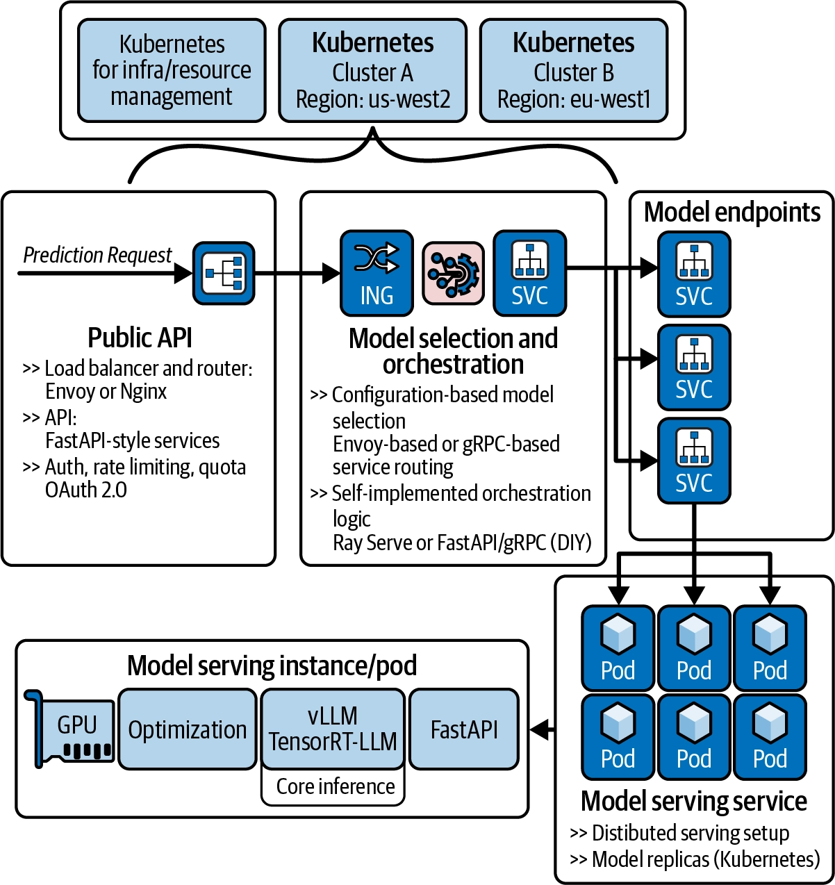

> 이 챕터에서는 우리가 선호하는 오픈 소스 소프트웨어 구성 요소(Kubernetes, Grafana, Prometheus 등)들을 사용해 엔터프라이즈 모델 서비스 시스템을 구현하는 방법을 다룬다.
> 
> 이 챕터의 목표는 하나의 해결책을 제시하는 것이 아니라, <span class="t-red">실용적인 설계 선택을 보여주고, 우리가 직접 서빙 플랫폼을 만들 수 있는 출발점을 제공</span>하는데 있다.

> [!tip] 저자가 예시로 Kubernetes를 선택한 근거
> 1. 핵심 기능 자체: 배포/스케일링/관리 자동화
> 2. 거대한 생태계: 그 위에 쌓인 메트릭, 로깅, 네트워킹, 인가(authorization), 하드웨어 관리 등 부가 기능들

---
#### 퍼블릭 API 구현

**1. FastAPI 채팅 엔드포인트 + 인증 의존성 주입**

```python
@app.post("/v1/chat/completions")
async def chat(req: ChatReq, idp=Depends(require_auth)):
    await rate_limit(idp["tenant"])
    # select model, route traffic based on tenant information
```

- FastAPI의 `Depends()`로 인증 로직(`require_auth`)을 엔드포인트에 선언적으로 주입
- 라우트 핸들러 코드 자체는 "인증된 테넌트 정보(`idp`)를 받아 `rate_limit`를 걸고, 그 테넌트 정보로 모델 선택/트래픽 라우팅을 한다"는 <span class="t-red">비즈니스 로직에만 집중</span>

**2. 인증 방식 : JWT 또는 API 키**

```python
# authorize request either with JWT or api_key
async def require_auth(api_key=Depends(verify_api_key), claims=Depends(verify_jwt)):
    if not api_key and not claims:
        raise HTTPException(401, "Missing API key or JWT")
    tenant = claims.get("tenant") if claims else await rds.hget(f"keys:{api_key}", "tenant")
    if not tenant: raise HTTPException(403, "Unknown tenant")
    return {"tenant": tenant, "claims": claims, "api_key": api_key}
```

- JWT
	- `verify_jwt`가 Authorization: Bearer ... 헤더를 파싱해 RSA 공개키(JWK)로 서명 검증 + audience/만료(verify_exp) 확인 → 토큰 클레임에서 바로 tenant 추출
- API 키
	- `verify_api_key`로 받은 키를 Redis(`rds.hget`)에서 조회해 tenant를 역참조
- 두 인증 방식 모두 최종적으로 "<span class="t-red">테넌트 식별</span>"이라는 같은 목적지로 수렴하는 게 핵심
	- 테넌트 식별 - 이 요청이 어느 고객/조직/계정 소속인지?
	- 이후 단계(쿼터 강제, 트래픽 라우팅, 모델 선택)가 전부 이 tenant 값 하나에 의존하기 때문


**3. Kubernetes HPA (고동시성 대응)**

```yaml
apiVersion: autoscaling/v2
kind: HorizontalPodAutoscaler
metadata: { name: enterprise-model-api-hpa }
spec:
  scaleTargetRef: { apiVersion: apps/v1, 
      kind: Deployment, name: enterprise-model-api }
  minReplicas: 3
  maxReplicas: 15
  metrics:
  - type: Resource
    resource: { name: cpu, target: { type: Utilization, averageUtilization: 70 } }
```

- 평균 CPU 사용률이 70%를 넘으면 Kubernetes가 자동으로 인스턴스를 3개→최대 15개까지 수평 확장


**4. Ingress 레벨 rate limiting (공정 사용/어뷰징 방지)**

```yaml
apiVersion: networking.k8s.io/v1
kind: Ingress
metadata:
  name: api-ingress
  annotations:
    kubernetes.io/ingress.class: nginx
    # rate limit the traffic to 50 request per second max : 초당 50개 요청 제한
    nginx.ingress.kubernetes.io/limit-rps: "50"
    nginx.ingress.kubernetes.io/limit-burst-multiplier: "5"
    nginx.ingress.kubernetes.io/proxy-body-size: "8m"
spec:
  rules:
  - host: api.yourorg.example
    http:
      paths:
      - path: /
        pathType: Prefix
        backend: {service: { name: enterprise-model-api, port: { number: 80 } } }
```

- Nginx(또는 Envoy) 인그레스가 초당 50건, 버스트는 5배(순간적으로 최대 250건)까지만 허용하도록 트래픽을 제한
- (참고) rate limiting이 두 레이어에서 이중으로 걸려 있다
    1. 애플리케이션 코드 안의 rate_limit(idp["tenant"])(테넌트별 세밀한 쿼터)
    2. 인그레스의 limit-rps(전체 서비스 단위의 거친 방어선)

---
#### 모델 선택 구현

> 요구사항에 따라 모델 선택 로직을 어디에 둘 것인가?
> 
> 1안) Public API
> 2안) 별도의 서비스 (미들웨어)
> 3안) 정적 라우팅 설정
> 
> 현재 예시에서는 1안 채택

**1. 기존 엔드포인트에 로직 추가**

```python
@app.post("/v1/chat/completions")
async def chat(req: ChatReq, idp=Depends(require_auth)):
    await rate_limit(idp["tenant"])
    # choose the right model for the given request
    ep = choose_endpoint(req.model, idp["tenant"])
	
    # basic classifier: use speculation for long outputs, else direct
    if req.model.draft_enabled and req.max_new_tokens > 1024:
        draft_ep = config.get_draft_endpoint(req.model)
        # use draft model for generation, target model for validation
        gen = speculative_decode(req, 
                 endpoint_draft=draft_ep, 
                 endpoint_target=ep)
    else: # simple pass-through stream 
         gen = passthrough(ep)
```

- 아주 기초적인 분류기
	- 토큰이 1024 이상 AND 해당 모델이 speculative decoding을 지원(`draft_enabled`)하면
		- speculative decoding - 빠르고 저렴한 모델이 여러 미래 토큰을 생성하고, 더 큰 모델이 대량으로 이를 검증 
		- 자세하게는 이후 챕터에서 설명
	- else
		- 요청을 모델 백엔드로 직접 전달
- `choose_endpoint`에 대해서는 아래에서 설명

**2. `choose_endpoint()`**

```python
def choose_endpoint(model: str, tenant: str):
    cfg = load_routes()

    # policy example: tenant allow-list, cost class, region, canary
    route = cfg["models"].get(model) or cfg["aliases"].get(model)
    if not route: raise HTTPException(404, f"Unknown model {model}")

    # weighted canary
    if "canary" in route and random() < float(route["canary"]["weight"]):
        return route["canary"]["url"]

    # tenant override
    route_over = (route.get("tenants") or {}).get(tenant)
    if route_over: return route_over["url"]
    return route["url"]
```

1. 모델/별칭 조회 : 없으면 404
2. 가중치 기반 카나리(canary) 라우팅:
    - random() < weight 확률로 신규/실험 버전 엔드포인트로 트래픽 일부를 흘려보냄
    - 이 체크가 테넌트 오버라이드보다 먼저 실행된다는 점에 주목
    - 즉 카나리 샘플링은 전체 트래픽(전용 라우팅을 가진 테넌트 포함)에서 무작위로 뽑히도록 설계돼 있어서, 카나리 배포가 특정 고객군에 편향되지 않고 대표성 있는 샘플을 확보
3. 테넌트별 오버라이드 : 특정 고객에게 전용 엔드포인트(예: 전용 파인튜닝 모델, 전용 용량)가 지정돼 있으면 그걸 사용
4. 기본 라우트로 폴백

---
#### 모델 서비스 엔드포인트 구현

앞선 챕터들에서 공부했던, <span class="t-red">'단일 모델 서비스', '멀티 모델 서비스' 구현이 여기서</span> 이루어진다.

<span class="t-red">vLLM, Nvidia Triton, FastAPI</span> 같은 도구들을 활용해 만들 수 있다.

cf) 인스턴스 서빙을 위한 확장성과 네트워크 관리가 부담스럽다면, 모델 서빙 라이브러리인 Ray Serve를 사용하는 것도 방법이다. (다음 여러 챕터에서 사용됨)

> 구현의 경우 앞선 CH3 때 했던 것들 (싱글 모델 서비스, 멀티 모델 서비스) 참고

---
### Building with a Cloud Vendor

> 오픈소스 스택 (Kubernetes + Ray Serve + vLLM)으로 구현을 해본 앞선 챕터와 대비해서, 여기서는 완전 관리형 클라우드로 구현하는 방법을 다룬다.
> 
> AWS SageMaker를 사용
> 
> **목적**
> - SageMaker를 단계별로 조작하는 법(하우투 튜토리얼)을 가르치려는 게 아니라, 클라우드 벤더들이 서빙 옵션을 설계하는 근본 논리를 이해시키는 게 목적
> - SageMaker는 하나의 구체적 예시일 뿐이고, 이 논리를 이해하면 다른 벤더(GCP Vertex AI, Azure ML 등)의 유사한 스펙트럼도 스스로 판단할 수 있게 하려는 의도

|단계|방식|자유도|운영 부담|
|---|---|---|---|
|1|Bedrock|낮음|매우 낮음|
|2|SageMaker JumpStart|조금 높음|낮음|
|3|Bring Your Own Model|중간|중간|
|4|Bring Your Own Code|높음|높음|
|5|Bring Your Own Serving Image|매우 높음|매우 높음|
|6|Build Your Own Infrastructure|최고|최고|

> [!info] 실습 스킵
> - 이 섹션에서는 위에서 오픈소스로 구현 했던 내용들을 관리형 클라우드로 만들어보는 실습을 한다.
> - 핸즈온의 느낌이기 때문에, 이 실습을 굳이 할 필요는 없어보이고 여러 관리형 서비스의 '관리의 수준(다 해주냐, 어느정도만 해주냐)'에 따른 Trade-off를 알고 넘어가면 될 것 같다.

---
### Build or Buy? Understanding Startegies

---
#### 직접 구축 vs 관리형 서비스

> 중요 : 이는 이분법적인 선택이 아니라 '어느정도까지를 통제할 것인지'를 결정한다.

|방식|특징|적합한 상황|장점|단점|
|---|---|---|---|---|
|**Vendor-managed**|벤더가 서빙 인프라 대부분 관리|SLO 충족 + 비용 허용 가능 + 빠른 출시 중요|개발/운영 부담 ↓, 빠른 출시|세밀한 제어 어려움, 벤더 종속|
|**Hybrid**|벤더 플랫폼 + 필요한 부분만 커스텀|일부 모델에 특별한 배칭·라우팅·격리 등이 필요|편의성과 제어의 균형|커스텀 영역의 운영 필요|
|**BYO**|서빙 스택을 직접 구축·운영|대규모 비용 최적화, 규제, HW/런타임/네트워크 제어 필요|최대 제어권, 세밀한 최적화, Lock-in 회피|구축·운영 복잡도와 비용 ↑|

> 일반적으로는 Hybrid가 가장 일반적이다.

---
#### 직접 구축하지 않아도 구축 방법을 알아야 하는 이유

|이유|의미|예시|
|---|---|---|
|**벤더 기능 해독**|벤더 옵션이 내부적으로 어떤 서빙 기술인지 이해|AWS LMI의 Tensor Parallel → vLLM 텐서 병렬화|
|**트레이드오프 정량화**|비용·성능을 숫자로 비교|Bedrock 토큰당 과금 vs 전용 인스턴스 시간당 과금의 손익분기점 계산|
|**80/20 커스터마이징**|기본 80%는 벤더 사용, 필요한 20%만 수정|SageMaker DLC의 TorchServe는 유지하고 모델·인증 설정만 변경|
|**디버깅**|블랙박스인 관리형 서비스의 문제 원인 추론|배칭·캐싱·라우팅·런타임 중 병목 위치 파악|

|직접 구현하며 배운 개념|벤더에서 만나는 기능|
|---|---|
|Continuous Batching|AWS LMI Rolling Batch|
|Tensor Parallelism|`OPTION_TENSOR_PARALLEL_DEGREE`|
|ModelManager + LRU Cache|Ray Serve `@serve.multiplexed`|
|Custom Handler|SageMaker/TorchServe Handler|
|Autoscaling / Routing|벤더의 Scaling·Routing 설정|

---
#### 어떤 방식을 선택해야하나?

|현재 상황|선택|
|---|---|
|SLO 충족 + 비용 허용 + 빠른 개발이 중요|**Vendor-managed 유지**|
|특정 모델만 특별한 배칭·라우팅·성능 튜닝 필요|**Hybrid**|
|테넌트별 격리 등 일부 특수 요구사항 존재|**Hybrid**|
|HW·런타임·네트워크를 직접 제어해야 함|**BYO**|
|트래픽 규모가 커져 벤더 비용이 너무 높음|**BYO 검토**|
|규제·컴플라이언스 요구가 강함|**BYO 검토**|
|멀티클라우드 / Vendor Lock-in 회피 중요|**BYO 검토**|
|직접 구축했지만 트래픽이 낮고 운영 복잡성만 큼|**Vendor-managed로 회귀**|

> [!warning] 한번 선택하면 끝나는 결정이 아니다!
> - 초기에는 Vender-managed로 시작하더라도, 트래픽/요구사항이 증가하면 Hybrid로 넘어갈 수도 있다.
> - 이후 더 강한 통제, 비용 최적화가 필요하다면 BYO로 넘어갈 수도 있다.
> - 반대로 운영 복잡성보다 얻는 효과가 크다면 반대로 넘어가는 것도 고려할 수 있다.

> 내 생각 : <span class="t-red">이는 LLM 서빙 뿐만 아니라 모든 인프라 기준에서도 통용되는 말</span>

---
### Measuring Performance in LLM Serving

---
#### 측정하는 이유

아키텍처 설계는 결국 측정 가능한 결과로 평가된다. 프로덕션에서는 구조가 우아한 것만으로는 부족하고, 성능이 실현 가능성과 사용자 경험, 서비스 비용을 결정한다.

- 에이전트 시스템: 다단계 추론 체인을 거치며 지연 시간이 증폭된다.
- 엔터프라이즈 플랫폼: 확장성과 비용 효율성 사이에서 균형을 잡아야 한다.
- 빌드 vs 클라우드: 예산 안에서 SLO를 만족할 수 있는지가 판단 기준이 된다.

즉, 성능 지표는 부수적인 관찰값이 아니라 설계 방향을 정하는 원칙이다.

핵심 지표는 두 축으로 나뉜다.

- **Latency (지연 시간)**: 처리 및 응답 생성에 걸리는 시간
- **Throughput (처리량)**: 단위 시간당 처리되는 요청 수 또는 토큰 수

---
#### Latency

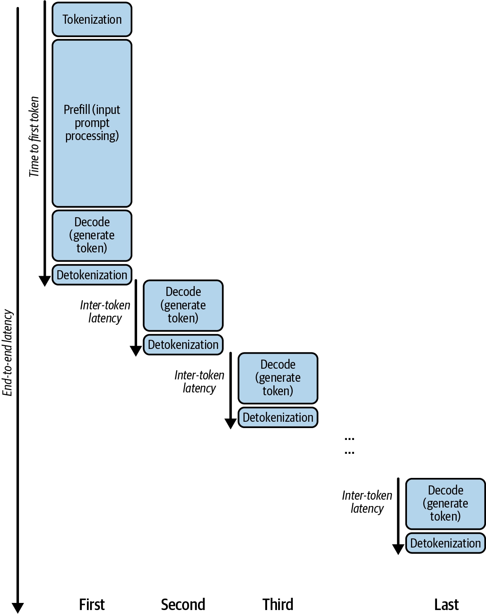

**1. E2E Latency (종단 간 지연 시간)**
- 모델이 요청을 받은 시점부터 전체 응답 생성을 완료하는 시점까지의 시간이다.
- ML/비ML 워크로드 모두에 쓰이는 비교적 일반적인 용어이다.
- 넓게 잡으면 모델 실행 시간뿐 아니라 요청 대기(큐잉), 네트워크 지연, 라우팅, 확장 오버헤드 같은 시스템 수준 요인까지 포함한다.


**2. TTFT (Time To First Token)**
- 요청을 받은 시점부터 첫 번째 토큰을 내보내기까지 경과한 시간이다.
- 사용자 입장에서는 '이 모델이 얼마나 빨리 반응하는가'로 체감된다.
- **Prefill 단계**에 대응한다. 입력 프롬프트 전체를 처리하고 문맥을 이해한 뒤 출력을 생성할 준비를 하는 구간이다.


**3. ITL / TPOT (Inter-Token Latency, Time Per Output Token)**
- 첫 번째 토큰 이후 나머지 토큰들이 하나씩 생성되는 데 걸리는 시간이다.
- **Decode 단계**에 대응한다. 토큰을 순차적으로 생성하며, 보통 비교적 일정한 속도를 유지한다.
- LLM의 자기회귀 생성 효율성을 보는 지표이다.


**4. 계산 공식**
$$\text{E2E latency} = \text{TTFT} + \text{ITL} \times (N - 1)$$

$$\text{TTFT} = \text{prefill} + \text{decode first token}$$

$$\text{ITL} = \text{decode one new token}$$


> [!info] 유즈케이스별 우선순위
> ```
> 에이전틱 워크플로우  → E2E 최우선
> 챗봇(스트리밍)      → TTFT 최우선
> 출력이 매우 긴 경우  → ITL도 중요
> ```
> 
> - **에이전틱 워크플로우**: 다음 단계가 이전 단계의 완성된 전체 출력을 컨텍스트로 받아야 시작할 수 있다. 체이닝 구조에서는 '첫 토큰만 빨리 나오는 것'이 아무 의미가 없고, 각 단계의 E2E가 다음 단계를 블로킹한다.
> - **챗봇**: TTFT가 응답성 그 자체이다.
> - **긴 출력**: ITL이 높으면 응답이 느릿느릿하다고 체감된다.
> 
> 

> 주의할 점은 **모든 최적화 기법이 세 지표를 동시에 개선하지는 않는다**는 것이다. 트레이드오프가 존재하므로 기법 선택은 유스케이스 요구사항을 따라간다.

---
#### Throughput

**1. RPS / RPM**
- 일정 시간 동안 처리 가능한 요청 수이다. ML/비ML 모두에서 널리 쓰인다.
- 한계: **요청 패턴에 민감하다.** 입력·출력 길이와 동시 사용자 수에 크게 좌우된다.
- 따라서 트래픽 패턴이 서로 다른 두 워크로드의 RPS/RPM을 직접 비교하는 것은 공정한 비교가 아니며, 사실상 무의미하다.


**2. TPS (Tokens Per Second)**
- 초당 생성되는 **출력** 토큰 수이다. LLM 생성에 특화된 지표이며 토큰당 비용 계산의 기준이 되기도 한다.
- 입력 토큰이나 '입력 + 출력' 합산이 아니다. 이 구분을 놓치면 벤치마크를 잘못 해석하기 쉽다.
- 한계: **인위적으로 부풀릴 수 있다.**
    - 입력 길이를 줄이면 TTFT가 크게 감소하고 요청당 작업 부하가 줄어든다. → TPS가 실제보다 높게 보인다.
    - 배치 크기를 키우거나 배치 안의 입출력 길이를 균일하게 맞추면 GPU 유휴 시간이 줄어 TPS가 개선된다.

> [!info] 시사하는 점
> - 벤더가 발표하는 TPS 숫자를 볼 때는 **어떤 조건에서 측정했는가**를 따져야 한다. 
> - 입력을 짧게 잘랐는지, 배치를 인위적으로 최적 구성했는지에 따라 같은 모델의 TPS도 크게 달라 보인다. 
> - 밑바닥 구조를 알아야 화려한 숫자 뒤의 측정 조건을 의심하고 검증할 수 있다.

---
#### 성능 측정 모범 사례

1. **지연시간 vs 처리량 트레이드오프 파악**
    - 오프라인/배치 워크로드는 처리량(비용), 챗봇/실시간 에이전트는 지연시간(응답성)이 핵심이다.
2. **유스케이스별 '충분히 좋은' 목표 설정**
    - 1초를 0.5초로 줄이는 게 체감상 의미 없다면, 그 노력을 처리량/비용 최적화로 돌리는 게 낫다.
3. **E2E를 TTFT/ITL로 분해**
    - 출력 길이가 제한된 시스템이라면 TTFT가 ITL보다 더 중요할 수 있다.
4. **실제 트래픽 패턴을 그대로 시뮬레이션**
    - '긴 프롬프트 + 짧은 답변'과 '짧은 프롬프트 + 긴 답변'은 완전히 다르게 동작한다. 트래픽은 절대 균일하지 않으며, 버스트는 큐잉 지연과 요청 실패를 만든다.
5. **실험의 일관성 유지**
    - 한 번에 한 노브만 바꾼다. 여러 개를 동시에 바꾸면 효과를 분리할 수 없다.
6. **하드웨어 활용률 모니터링**
    - GPU/CPU/메모리를 추적해 병목이 모델 자체인지 하드웨어 한계인지 구분한다.
7. **지표를 인위적으로 부풀리지 않기**
8. **프로덕션에서 지속적으로 모니터링**
    - 배포 후에도 사용자 행동 변화로 인한 트래픽 급증과 실패를 계속 관찰한다.
9. **테스트 스위트를 주기적으로 재실행**
    - 회귀 방지, 피크 상황 스케일링 테스트, 새 최적화 기법의 A/B 비교.

---
