---
## CH5. Challenges When Serving LLMs

---
### Why Optimizing LLM Serving is Important

---
#### 개요

이전 챕터들에서는 모델을 운영 환경에 배포할 때 기능적으로 잘 작동하도록 설계하는 방법을 다뤘다.

지금부터 배울 또 다른 중요한 점은 모델이 <span class="t-red">실제 운영환경</span>에서 빠르고 효율적으로 작동하도록 하는 것이다.

이는 기존의 ML, DL 모델보다 더 큰 리소스를 필요로하는 LLM 모델에서 더욱 더 중요하다.

LLM Serving 최적화에서 중요하게 다뤄야할 요소는 3가지이다.

1. 고객 경험 (Customer Experience)
2. 비용 효율성 (Cost Efficiency)
3. 확장성 (Scalability), 최대 부하 처리 능력 (Peak Load Handling), 실현 가능성 (Feasibility)

---
#### 고객 경험

> <span class="t-red">TTFT</span>(Time To First Token)과 <span class="t-red">응답 지연</span>이 커질수록 만족도가 떨어진다. 그러나 선형적인 것은 아니다.
> 
> 일반적으로 파라미터 수가 클수록 모델 품질이 좋으며, <span class="t-red">모델 품질이 좋을수록 만족도가 높아</span>진다.

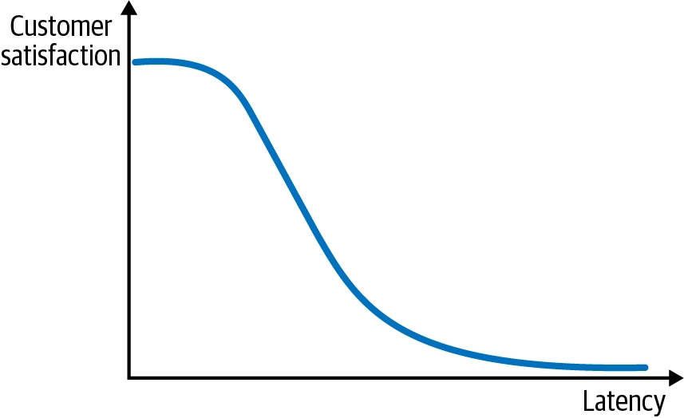

- 이전에 이러한 TTFT를 줄이기 위해서 Streaming을 사용한다고 했었다.
- 이와 별개로 Latency는 결과물이 모두 출력되는데 걸리는 시간이다.
- <span class="t-red">TTFT든 Latency든 이 수치와 고객 만족도는 반비례 관계</span>이지만, 영향이 선형적이진 않다.
	- 20초 -> 1초로 줄이면 만족도가 극적으로 개선되지만, 0.1초 -> 0.01초 처럼 이미 충분히 빠른 구간에서는 체감 차이가 거의 없다.
	- 따라서 <span class="t-red">충분히 빠른 상황에서는 이러한 수치를 조금 늘리는 대신 시간당 처리할 수 있는 요청량(throughput)을 높이는 트레이드오프가 비용 효율 측면에서 더 유리할 수 있다.</span>

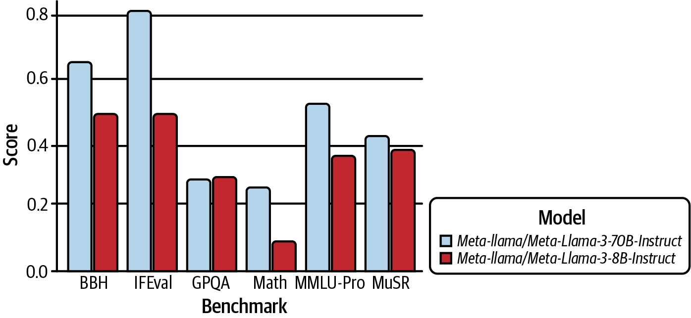

- 고객 경험에서의 또 다른 중요한 축은 <span class="t-red">모델 품질</span>이다.
- 일반적으로 <span class="t-red">파라미터 수가 클수록 모델 품질이 높다.</span>
- 큰 모델은 품질이 좋지만 latency와 비용이 커진다. 반대로 작은 모델은 빠르고 저렴하지만 품질이 낮을 수 있다.

> [!info] 결국 모델 품질, 시간(TTFT, Latency), 비용 사이에서 트레이드오프를 비교하며 최적의 균형을 찾아야한다.

---
#### 비용 효율성

> Inference 를 위한 GPU 비용은 빠르게 증가하고 있으며, 이러한 비용은 <span class="t-red">모델 크기</span>와 <span class="t-red">최대 트래픽</span>(traffic peak)에 달려있다.


- AI 시스템은 아무리 강력해도 운영 비용이 너무 크면 사업적으로 성립할 수 없다.
- 이러한 AI 비용 구조에서 가장 큰 비중을 차지하는 것은 훈련(train)이 아니라 <span class="t-red">추론</span>(inference)이다.
	- 훈련은 일회성이지만, 추론은 지속적이기 때문이며, 심지어 점점 커지고 있다.
- AI 에이전트, 복잡한 워크플로우는 하나의 워크플로우 안에서 여러 LLM, 임베딩 모델 호출을 필요로 해 추론 비용을 더욱 가중시킨다.

> [!info] AI 비즈니스의 생존을 좌우하는 것은 '추론 비용'이며 효율적인 모델 서빙(같은 하드웨어로 더 높은 처리량, 또는 더 저렴한 하드웨어로 동등한 성능)이 매우 중요하다.

---
#### 확장성, 최대 부하 처리, 실현 가능성

> 추론 최적화를 통해 확장성(Scalability), 최대 부하 처리(Peak Load Handling), 실현 가능성(Feasibility) 측면까지 이점을 누릴 수 있다.

**확장성, 최대 부하 처리**
- 평소 안정적인 트래픽을 처리하던 LLM 서비스도 블랙프레이데이 같은 시기엔 트래픽이 400% 이상 급증할 수 있다.
- 확장성과 최대 부하 처리에 있어 최적화가 부족하다면, 요청 실패로 이어지고 이것은 곧 고객이탈이다.
- 추론 최적화를 통해 추론에 드는 리소스를 줄인다면, 이러한 확장성, 최대 부하 처리에도 매우 큰 도움이 된다.

**하드웨어 유연성**
- 모델을 최적화하여 저사양 칩에서도 구동 가능해진다면, 유연성이 커진다.
- 단순히 비용문제 뿐만 아니라, AWS, GCP, Azure와 같은 주요 클라우드를 사용한다고 하더라도 모든 리전에서 고사양 GPU를 항상 구동할 수 있는것은 아니다.
- 이에, 고사양 GPU에 종속되지 않고 더 넓은 범위의 하드웨어에서 모델을 구동할 수 있는 능력은 매우 중요하다.
- 추론 최적화를 통해 추론에 드는 리소스를 줄인다면, 이러한 하드웨어 유연성 증대에도 매우 큰 도움이 된다.

> [!info] 추론 최적화는 성능, 비용 뿐만 아니라 확장성, 최대 부하 처리, 하드웨어 유연성 측면에서 도움을 주며, 결국 사업의 실현 가능성 자체를 좌우하는 요소이다.

---
### The Role of Accelerator Chips in LLM Serving

---
#### 개요

앞서서 LLM 최적화가 왜 중요한지 알아보았다. 이제 다음 단계는 LLM을 구동하는 하드웨어(가속기 칩, Accelerator Chip)을 이해해야한다.

적절한 하드웨어(GPU) 구성 선택은 LLM 서빙에서 가장 중요한 결정 중 하나이다. 왜냐하면 하드웨어 제약이 메모리 용량, 연산 성능, 효율성을 결정하기 때문이다.

이 챕터에서는 일단 NVIDIA GPU에 초점을 맞춘다. 2026년도 초(책 저자 서술 기준) 현재 NVIDIA의 GPGPU(범용 GPU 컴퓨팅) 솔루션이 여전히 시장을 지배하고 있기 때문이다.

**핵심 개념**
- GPU 연산 성능 (compute power)
- 메모리 용량 (memory capacity)
	- 여기서의 메모리는 VRAM
- 메모리 대역폭 (memory bandwidth)
- 인터커넥트 (interconnects)

이 핵심 개념들을 다룬 뒤, 주요 NVIDIA GPU 모델들의 스펙을 비교 분석하고, LLM 사용 사례별로 어떤 GPU가 적합한지에 대한 저자들의 인사이트를 배운다.

---
#### Compute

Compute 성능은 행렬 곱과 attention/MLP 연산 처리량을 결정한다.

하지만, 보통 <span class="t-red">LLM decode 단계</span>에서는 Compute 성능 제약보다는 <span class="t-red">Memory 대역폭에 제약</span>이 걸리는 경우가 많다.

**용어 정리**
- FLOPS - 초당 부동소수점 연산 횟수
	- 예: `100 TFLOPS` = 초당 약 100조 번의 부동소수점 연산
	- GPU의 **순수 연산 성능**을 나타내는 대표 지표
- Tensor Core 성능 - NVIDIA GPU의 행렬 연산 전용 하드웨어 성능
	- LLM 추론/학습은 대부분 행렬곱이라 Tensor Core 성능이 매우 중요함
	- 일반 CUDA Core의 FLOPS보다 LLM 성능과 더 직접적으로 관련되는 경우가 많음
- 지원 Precision - 어떤 숫자 정밀도 계산 방식을 지원하는지
	- `FP32` : 32비트 실수, 정확하지만 느리고 메모리 많이 사용
	- `FP16` : 16비트, 딥러닝에서 많이 사용
	- `BF16` : 16비트, 학습에 특히 많이 사용
	- `FP8` : 8비트, 최신 GPU에서 LLM 추론/학습 가속
	- `INT8` : 8비트 정수, 양자화 추론
	- `INT4` : 4비트, LLM 모델 메모리를 크게 줄이는 양자화 방식
	- 예: `FP8` 과 같은 연산을 지원하는 GPU는 양자화를 통해 같은 모델을 더 적은 메모리로 올려서 계산할 수 있다.

**비교 예시**

|GPU|Tensor Core|Precision|
|---|---|---|
|오래된 GPU|낮음|FP32, FP16|
|A100|높음|FP32, TF32, FP16, BF16, INT8|
|H100|매우 높음|FP32, TF32, FP16, BF16, **FP8**, INT8|

---
#### Memory

<span class="t-red">VRAM 용량</span>은 모델 weight와 KV cache를 담을 수 있냐 없냐를 결정한다.

<span class="t-red">Memory 대역폭</span>은 weight와 activation을 얼마나 빨리 읽어올 수 있는지를 결정한다.

LLM serving에서는 VRAM 용량과 Memory 대역폭 모두 중요하다.

---
#### Interconnect

여러 GPU가 한 서버 안에 있을 때 GPU 간 통신은 PCIe, NVLink, NVSwitch 구조에 따라 성능 차이가 난다.

예시
- 한 서버 안
	- Tensor parallelism을 사용할 때 GPU 간 activation, partial result, synchronization traffic이 생긴다.
	- 따라서 GPU 수만 늘린다고 항상 빨라지지 않는다.
	- Interconnect bandwith와 topology가 중요하다. (내부 대역폭과, 연결 방식)
- 여러 서버 간
	- 여러 서버에 걸쳐 모델을 나누면 Infiniband, RoCE 같은 네트워크 성능이 중요하다.
	- Inter-node serving은 intra-node serving보다 latency와 운영 복잡도가 커지므로 가능하면 한 노드 안에서 먼저 최적화하는 것이 좋다.

**용어 정리**
- InfiniBand와 RoCE 모두 CPU를 거의 거치지 않고 한 서버의 메모리에서 다른 서버의 메모리로 직접 데이터를 전송하는 방식인 RDMA(Remote Direct Memroy Access)를 활용한다.
- **InfiniBand** - HPC/AI 용 고성능 네트워크로 설계된 별도 네트워크 기술
	- 일반적인 네트워크는 `Application → OS → TCP/IP Stack → NIC → Network` 의 단계를 거치지만
	- RDMA는 `Memory → NIC → Network → NIC → Memory` 형태로 움직여서 지연시간이 낮고 CPU 부하가 적다.
	- 이에, 매우 낮은 latency, 높은 대역폭을 지원한다.
	- 일반 Ethernet과 다르게 전용 NIC, 전용 스위치, 전용 프로토콜을 사용한다.
- **RoCE** (RDMA over Converged Ethernet) - RDMA를 일반 Ethernet 위에서 사용하는 기술
	- RDMA를 기존 Ethernet 인프라를 활용하여 사용하는 기술

> 하나의 서버 내부의 여러 GPU 끼리는 보통 NVLink / NVSwitch
> 
> 여러 서버 간의 GPU 끼리는 InfiniBand / RoCE

> [!tip] GPU 파워 소모량도 중요하다.
> - GPU는 전력과 냉각 비용도 크다.
> - 동일 throughput을 더 낮은 전력으로 달성하는 최적화는 운영 비용에 직접 영향을 준다.
> - Model serving capacity planning에서는 GPU 가격뿐 아니라 전력, rack density, cooling, utilization 까지 함께 계산해야 한다.

---
#### H100 SXM과 H100 NVL의 비교


> 위 사진은 NVIDIA Hopper 아키텍처의 SM 구조도. 이 구조를 사용하는 GPU는 대표적으로 H100이 있다.

|**항목**|**H100 SXM**|**H100 NVL**|
|---|---|---|
|**FP64**|34 teraFLOPS|30 teraFLOPS|
|**FP64 Tensor Core**|67 teraFLOPS|60 teraFLOPS|
|**FP32**|67 teraFLOPS|60 teraFLOPS|
|**TF32 Tensor Core**|989 teraFLOPS|835 teraFLOPS|
|**BFLOAT16 Tensor Core**|1979 teraFLOPS|1671 teraFLOPS|
|**FP16 Tensor Core**|1979 teraFLOPS|1671 teraFLOPS|
|**FP8 Tensor Core**|3958 teraFLOPS|3341 teraFLOPS|
|**INT8 Tensor Core**|3958 TOPS|3341 TOPS|
|**GPU Memory**|80 GB|94 GB|
|**GPU Memory Bandwidth**|3.35 TB/s|3.9 TB/s|
|**Form Factor**|SXM|PCIe dual-slot air-cooled|
|**Interconnect**|NVIDIA NVLink™: 900GB/sPCIe Gen5: 128GB/s|NVIDIA NVLink: 600GB/sPCIe Gen5: 128GB/s|

> 위 표는 H100 SXM과 H100 NVL의 스펙을 분석한 표이다. 이 섹션에서는 위 2개의 GPU르 비교하며 GPU 사양 읽는 방법을 설명한다.

**Compute**
- 위 표를 보면, `FP16`과 `FP8`에서 H10 SXM이 더 높다. 이 두 정밀도는 딥러닝에서 쓰이는 저정밀도 포맷이다.
- 그렇다고, '모든 용도에서 NVL이 열등하다' 라는 뜻은 아니다.

**Memory**
- 위 표를 보면 NVL이 VRAM이 94GB로 SXM의 80GB보다 더 높다. 또한 대역폭도 3.9TB/s로 SXM의 3.35TB/s 보다 우수하다.

이에 무엇이 더 우월하다고 할 수 없고 아래와 같은 여러 상황에 맞춰 균형을 선택하면 된다.
- 모델을 로드할 VRAM이 부족 -> NVL
- 대역폭에서 병목이 생긴다 -> NVL
- 연산속도에서 병목이 생긴다 -> SXM


| 항목                                                | **H100 PCIe**          | **H100 NVL**                                                | **H100 SXM**                              |
| ------------------------------------------------- | ---------------------- | ----------------------------------------------------------- | ----------------------------------------- |
| **Form factor**                                   | **PCIe**               | **PCIe**                                                    | **SXM**                                   |
| **NVLink support**                                | **No (optional)**      | **NVLink Bridge**                                           | **NVLink/NVSwitch**                       |
| **Interconnect GPU-to-GPU bandwidth (GPU 간 대역폭)** | **128 GB/s with PCIe** | **600 GB/s with NVLink Bridge connecting 2 H100 GPUs only** | **900 GB/s connecting up to 8 H100 GPUs** |

**Interconnect**
- 하나의 GPU로는 모델을 다 담지 못하거나, 지연시간 요구사항을 맞추기 위해 여러 <span class="t-red">GPU가 협력해야하는 경우</span> Interconnect 속성도 중요해진다.
- 하나의 노드 안에서 여러 GPU가 통신할 때, SXM의 경우 전용 소켓에 직접 장착함으로써, GPU간 대역폭을 900GB/s의 성능을 낸다. -> 메인 보드도 전용이어야하지만(호환성 약함) 고성능
- 그러나, PCIe 모델의 경우 일반 PCIe 슬롯에 장착한다. (호환성 높음) 그리고 칩의 비용도 더 저렴하지만 성능은 다소 떨어진다.
- NVL은 NVLink Bridge를 지원하며 그 중간의 성능을 낸다.

---
#### 여러 Topology (하나의 노드 안)

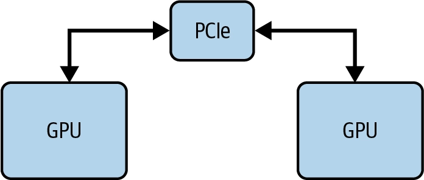

1. H100 PCIe
	- 대역폭 128GB/s
	- 가장 저렴한 구성. GPU 간 고속 통신이 필요 없는 경우(예: 각 GPU에서 독립적으로 작은 모델 2개를 돌리는 경우)에 적합


2. H100 NVL
	- PCIe 폼팩터에 NVLink Bridge 추가 → GPU 2개를 600 GB/s로 연결
	- **단점: NVLink Bridge는 GPU 2개까지만 연결 가능.**
	    - 4-GPU 구성 시, GPU1-GPU2는 600GB/s로 연결되지만 GPU1-GPU3, GPU2-GPU4 사이는 여전히 128GB/s PCIe 사용
	- 비용과 성능의 좋은 절충안


3. H100 SXM + NVLink
	- 최대 8개 GPU를 NVLink로 연결
	- 각 GPU의 총 대역폭 900GB/s를 7개의 다른 GPU와 점대점(point-to-point) 연결로 분할 → 각 연결당 128 GB/s (900÷7)
	    - 각 GPU의 인터커넥트 대역폭이 900GB/s이므로, 각 GPU는 총 900GB/s 대역폭을 **7개의 전용 128GB/s**(900GB/s를 7로 나눈 값) **점대점 연결**로 나누어 시스템 내 다른 GPU 중 하나와 연결해야 한다.


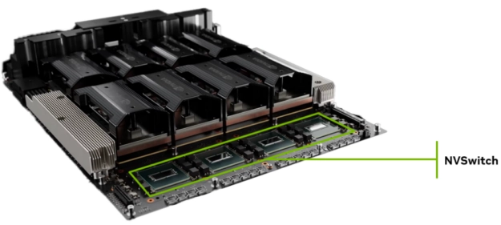

4. **H100 SXM + NVLink + NVSwitch**
    - 연결된 GPU 수만큼 인터커넥트 대역폭이 나뉘는 것이 불편하다면, NVSwitch를 사용해 모든 GPU 연결에 대해 900GB/s의 전체 대역폭을 확보할 수 있다.
    - NVSwitch는 여러 개의 NVLink 지원 GPU를 연결하는 별도의 고가의 고대역폭 스위치이다.

---
#### Inter-node 인터커넥트 (노드 간)

- **한 노드에 담을 수 있는 GPU 수**는 물리적 제약, 전력, 냉각, 소프트웨어 지원 등으로 **보통 최대 8개로 제한**됨
    - Inter-node serving은 intra-node serving보다 latency와 운영 복잡도가 커지므로 <span class="t-red">가능하면 한 노드 안에서 먼저 최적화하는 것이 좋다.</span>
	    - LLM 서비스의 경우, 대부분의 배포는 여전히 단일 노드에서 각 모델 인스턴스(복제본이라고도 함)당 1개에서 8개의 GPU를 사용해 운영된다.
	    - 사용자 트래픽이 증가하면, 동일한 설정의 하드웨어 인스턴스를 추가해 모델 복제본 수를 수평적으로 확장한다. 
	    - 이 접근법의 목표는 불필요한 노드 간 통신을 최소화하는 것
- 모델이 더 커지면 여러 노드에 걸쳐 모델을 샤딩(sharding)해야 함. **여러 서버에 걸쳐 모델을 나누면 InfiniBand, RoCE 같은 네트워크 성능**이 중요해진다.
    - 최근 연구에서는 서로 다른 GPU 간에 프리필 단계와 디코딩 단계를 분리하는 방안을 모색하고 있다. 
    - 또한 DeepSeek V3/R1과 같은 혼합 전문가(MoE) 아키텍처를 사용하는 대형 모델의 경우, 전문가 병렬 처리와 데이터 병렬 처리 같은 기법이 노드 간에도 적용된다. 
    - 기초 개념을 다룬 후에 이러한 고급 주제들을 소개할 것
- 대표 솔루션: InfiniBand(IB) or RoCEv2 + GPUDirect RDMA
    - RDMA(Remote Direct Memory Access): 노드 간 GPU끼리 직접 메모리 접근 가능
    - 예: NDR 400G InfiniBand → **약 50 GB/s (노드 내부 대비 훨씬 느림)**

---
#### GPU 전력 소비

- 마지막으로 중요한 제약: **전력 소비** - 눈에 잘 안 띄지만 근본적인 GPU 지표
- **단위**: **와트**(W), 보통 **TDP**(Thermal Design Power)로 표현 - GPU가 지속적인 부하 하에서 설계상 소비하도록 만들어진 **최대 지속 전력**
- 최신 데이터센터 GPU는 수백 와트에서 700W 이상까지 다양하며, 전력 예산이 클수록 연산 밀도와 메모리 대역폭이 높아지지만, 그만큼 냉각·전력 공급·시스템 통합에 대한 요구사항도 엄격해짐
- 배포 환경별 중요도가 다름:

    1. **일반 클라우드 사용자**: 전력은 대부분 추상화되어 있음 - 사용자는 그냥 인스턴스 타입을 선택하고 사용량/시간 기준으로 과금됨. 전력은 가격·가용성·성능 등급에 암묵적으로 반영될 뿐 직접 관리하지 않음
    2. **클라우드 제공업체/프라이빗 데이터센터**: 전력은 1급 설계 제약. 랙당/시설당 배치 가능한 GPU 수를 전력·냉각 용량이 제한하므로, 와트당 성능(performance per watt)이 고정된 인프라 예산 하에서 처리량을 극대화하는 핵심 지표가 됨
    3. **엣지/온디바이스 시스템**: 전력이 시스템 전체를 규정하는 제약. 배터리, 발열, 폼팩터의 엄격한 한계로 인해 모델 아키텍처, 정밀도 선택, 실행 전략이 최고 성능이 아니라 전력 효율성 중심으로 근본적으로 결정됨
    
- 전력은 단순히 "얼마나 빠른가"뿐 아니라 어디서, 어떻게 <span class="t-red">그 성능을 실제로 구현할 수 있는가</span>까지 결정하는 요소이다.

---
### Bottlenecks in LLM Model Loading

---
#### 모델 로딩 과정 (VRAM)

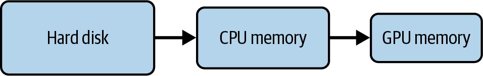

> 모델 로딩은 storage에서 model weight를 읽고, CPU memory를 거쳐 GPU memory에 복사한 뒤, runtime이 실행 가능한 형태로 준비하는 과정.

LLM 서빙의 첫 단계는 모델 가중치(weights)를 로드해서 GPU 메모리에 캐싱하는 것이다.

로딩 과정: 디스크 → CPU 메모리(시스템 메모리) → GPU 메모리 순으로 가중치가 이동

병목은 다음 지점에서 생긴다.
- 원격 storage에서 weight 다운로드
- Disk I/O
- CPU memory copy
- CPU to GPU transfer
- GPU memory allocation
- model initialization 및 compilation/warmup

한 번 로드되면 가중치는 GPU 메모리에 캐싱된 상태로 유지되어 들어오는 요청을 즉시 처리할 준비가 된다.

> 따라서 <span class="t-red">모델 가중치를 전부 담을 수 있을 만큼 충분한 GPU 메모리가 반드시 필요</span>하다.

> [!question] 그냥 CPU 메모리에 캐싱하거나, 요청이 들어올 때마다 로드하면 안 되나?
> 하드디스크와 CPU 메모리는 모델 가중치를 옮기기에 훨씬 느리기 때문에 실시간 추론에는 비현실적이다.
>
> | 구분 | 대역폭 |
> | --- | ---: |
> | Hard Disk (SSD) | 0.5 ~ 14 GB/s |
> | CPU Memory | 50 ~ 200 GB/s |
> | GPU Memory | 300 GB/s ~ 3 TB/s |

---
#### 모델 사이즈 추정

> 모델의 메모리 사용량을 계산할 때의 핵심 변수는 파라미터 개수와 파라미터의 데이터 타입이다.

1. 모델의 파라미터 개수
    - Hugging Face의 모델은 이름 자체에 파라미터 개수가 드러나는 경우가 많다.
    - 예: Llama-2-7b → 이름에서 알 수 있듯 약 70억(7 billion)개의 파라미터를 가진 모델

2. 파라미터의 데이터 타입 (정밀도, precision)
    - Hugging Face 리포지토리의 config.json 파일에서 확인 가능
    - 특히 torch_dtype 속성이 모델 가중치에 사용된 정밀도를 알려줌
	- 예: "torch_dtype": "float16" → 가중치 저장·연산에 16비트 부동소수점 사용

|정밀도|비트 수|바이트 크기|
|---|---|---|
|FP32 (단정밀도, single precision)|32|4 바이트|
|FP16 (반정밀도, half precision) / BF16|16|2 바이트|
|INT8 (1/4 정밀도, quarter precision ) / FP8|8|1 바이트|

**계산 예시: Llama-2-7b***
- 파라미터 수: 약 70억 개
- 정밀도: BF16 → 파라미터당 2바이트
	- 7 billion parameters × 2 bytes/parameter = 14 billion bytes = 14 GB
- 실제로 모델 파일의 크기를 확인하면 총 약 **13 GB**(9.98 + 3.5GB)**로, 이 추정치와 거의 일치**

---
####  KV Cache 크기 추정


> 앞 절에서 Llama-2-7b 모델 크기가 약 14GB임을 확인했다.
> 
> 만약 16GB GPU가 있다면 모델 로딩은 문제없고, 짧은 요청 하나 정도는 잘 돌아갈 것
> 
> 하지만 모델을 겨우 담을 정도의 메모리만 있는 GPU는 이상적이지 않다.
> 
> <span class="t-red">바로 KV 캐시(KV cache) 때문</span>
> 
> KV 캐시용 여유 공간이 너무 작으면 → <span class="t-red">배치 크기(batch size)와 컨텍스트 길이가 심하게 제한</span>됨


**KV Cache 계산 공식**
$$
\text{KV Cache Size per Token}
= 2 \times L \times H \times D_{\text{head}} \times S_{\text{dtype}}
$$

- 토큰당 KV 캐시 크기 = 2 × 층 수 × 어텐션 헤드 수 × 헤드 차원 × 데이터 타입 크기
- 다음 예시에서는 기본적인 멀티헤드 어텐션(MHA) 형태를 사용하는 Llama-2-7b를 사용

**계산 예시: Llama-2-7b (기본 MHA 방식 사용)**
- 어텐션 레이어 수: 32
- 어텐션 헤드 수: 32
- 헤드 차원: 128 (= 4096 / 32)
- 정밀도: half precision → 토큰당 2바이트
- **토큰당 KV 캐시 크기** = 2 × 32 × 32 × 128 × 2 = 524,288 바이트 = **0.5MB**

예를 들어, **최대 시퀀스 길이를 4,096**으로 설정해 긴 문단을 요약하는 데 이 모델을 사용한다고 가정
- 배치 크기 16 가정 (요청 배치 처리)
- **총 KV 캐시** = 0.5MB 토큰 × 요청당 4,096 토큰 × 배치 크기 **16건** = **32GB**
- 이건<span class="t-red"> 모델 자체 용량인 14GB보다도 더 큰 크기</span>

---
#### 실전 GPU 비교 : A10 (24GB) vs L40S (48GB)

> 앞선 예시인 Llama-2-7b 가정

|GPU / 메모리|모델 로드 후 남은 메모리|최대 배치 크기|시간당 비용(AWS 온디맨드)|
|---|---|---|---|
|A10 24 GB|10 GB (24 – 14)|4 (10 × 1024/(0.5 × 4096) = 5 )|$2|
|L40S 48 GB|34 GB (48 – 14)|16 (34 × 1024/(0.5 × 4096) = 17)|$3.75|

- **A10**은 **병렬 요청 4개**만 처리 가능, **L40S**는 **16개** 처리 가능
- **L40S가 더 비싸지만, 결과적으로 비용 효율은 더 좋다** (동시 처리량이 4배 늘어난 데 비해 비용은 약 2배 정도만 증가)

> [!warning] 계산식으로 나온 이론적 최대 배치 크기(5, 17)를 실제로는 온전히 다 쓸 수 없다
> - 활성화(activation), 즉 중간 계산 단계에서 생성되는 텐서를 위한 공간도 GPU 안에 따로 확보해둬야 하기 때문

---
### Bottlenecks in LLM Model Execution

---
#### GPU 연산 및 메모리 대역폭의 경계 (어느 것이 병목)

> 모델이 GPU 메모리에 완전히 로드되어 서빙 준비가 끝났다면, 이제 다른 질문을 던질 차례이다.
> 
> 모델 서빙의 병목 지점이 <span class="t-red">GPU 연산</span>(compute FLOPS)에 의해 생기는가, 아니면 <span class="t-red">GPU 메모리 대역폭</span>(memory bandwidth)에 의해 생기는가?

**Arithmetic Intensity** (산술 강도)
- 이를 분석하기 위해서는 <span class="t-red">Arithmetic Intensity</span>라는 개념이 필요하다.
- 이는 <span class="t-red">알고리즘 구현 연산 수와 접근한 바이트 수의 비율</span>을 의미한다.
- 이는 기본적으로 <span class="t-red">데이터가 연산 유닛으로 이동할 때의 연산 횟수</span>(FLOPS)를 <span class="t-red">바이트당 FLOPS 비율</span>로 계산한 것
$$
\text{Arithmetic Intensity}
=
\frac{\text{Number of FLOPs}}{\text{Data Movement}}
$$
- 산술 강도 = FLOPS 수 / 데이터 이동량
- **산술 강도가 낮음**: 연산은 적게 필요하지만 **데이터 읽기/쓰기가 많은 워크로드**
- **산술 강도가 높음**: 데이터는 적게 읽고 쓰지만 그 위에서 **많은 연산을 수행하는 워크로드**


**Data Movement** (데이터 이동)

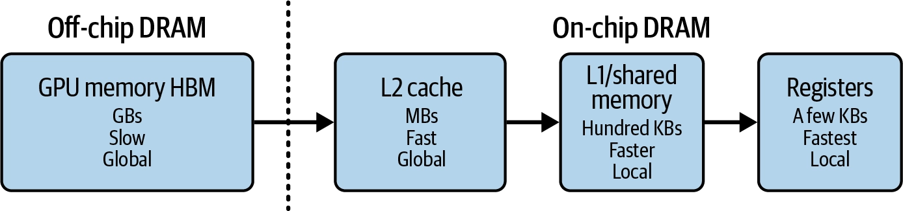

- 데이터 이동은 모델 실행 시점에 일어나는 것으로, 모델 가중치가 이미 GPU 메모리(off-chip HBM)에 있는 상태에서 발생합니다. (<span class="t-red">모델 로딩과는 다른 개념</span>)
- **온칩(on-chip) 메모리**: L2 캐시, L1 캐시, 공유 메모리 → SRAM으로 구성됨
    - **SRAM**: 용량은 작고 비싸지만 훨씬 빠름, 연산 유닛 바로 옆에 위치
    - **HBM**: 속도를 희생하고 용량을 확보
    - SRAM은 저지연 연산을 지원, HBM은 모델 가중치 같은 대용량 데이터 저장을 담당
- 서빙 중 데이터 흐름 : HBM → SRAM(L2/L1/공유 메모리) → 레지스터로 이동해야 실제 연산이 수행됨

> [!question] 왜 GPU "메모리 대역폭"을 기준으로 삼는가?
> - 서빙 중 모델 가중치와 모든 중간 결과가 계속 레지스터로 읽혀 들어가는데, 이 경로에서 가장 느린 구간이 GPU 메모리(HBM)이기 때문에 GPU 메모리 대역폭이 데이터 이동의 기준 지표가 된다.
> - 예외: 가중치나 출력이 충분히 작아서 flash attention처럼 온칩 캐시에 영리하게 담기는 경우는 다소 다름 (6장에서 다룸)


**계산 예시: L40S (FP16 기준)**

|항목|값|
|---|---|
|GPU Memory|48 GB GDDR6 with ECC|
|**Memory Bandwidth**|**864 GB/s**|
|Interconnect Interface|PCIe Gen4 x16: 64 GB/s bidirectional|
|NVIDIA Ada Lovelace Architecture CUDA Cores|18,176 개|
|NVIDIA Third-Generation RT Cores|142 개|
|NVIDIA Fourth-Generation Tensor Cores|568 개|
|RT Core Performance TFLOPS|212 TFLOPS|
|FP32 TFLOPS|91.6 TFLOPS|
|TF32 Tensor Core TFLOPS|183 TFLOPS|
|BFLOAT16 Tensor Core TFLOPS|362.05 TFLOPS|
|**FP16 Tensor Core**|**362.05 TFLOPS**|
|FP8 Tensor Core|733 TFLOPS|
|Peak INT8 Tensor TOPS|733 TOPS|

- 산술 강도 = FLOPS 수 / 데이터 이동량(바이트)
- 362 TeraFLOPS / 864 GB/s = (362 × 1012승 FLOPS) / (864 × 109승 B) ~= **419 FLOPS/B**


**Roofline Model** (루프라인 모델)


- 시스템의 연산 능력과 메모리 대역폭을 함께 나타내어, <span class="t-red">애플리케이션이 compute-bound(연산 제한)인지 memory-bound(메모리 대역폭 제한)인지 판별</span>하는 시각적 성능 모델
- **x축**: 산술 강도 arithmetic intensity (FLOPS/B)
- **y축**: 달성 가능 성능 attainable performance (TFLOPS)
- <span class="t-red">산술 강도가 419 FLOPS/B보다 낮으면, GPU가 낼 수 있는 최대 362 TFLOPS를 다 활용하지 못함</span>


**실전 워크로드 분석**

> 이제 산술 강도와 루프라인 모델을 사용해 특정 GPU의 작업 부하가 연산 대역폭으로 제한되는지, 아니면 메모리 대역폭으로 제한되는지 분석해보자.
> 
> 약 210 FLOPS/B의 워크로드가 있다고 가정해 보자. 이는 419 FLOPS/B의 크로스오버 포인트의 절반 정도이다.


- 데이터 포인트 (1)
    - 산술 강도 : ~210 FLOPS/B (419의 절반)
    - 상태 : 메모리 대역폭 제한(memory-bound)
    - 비유 : 연산력은 여유가 있는데 데이터 공급이 못 따라감
- 데이터 포인트 (2)
    - 산술 강도 : 1,000 FLOPS/B
    - 상태 : 연산 제한(compute-bound)
    - 비유 : 데이터는 빠르게 공급되지만 연산력 용량이 이미 꽉참 → 더 읽어봤자 소용없음, 이게 이 칩의 최대 속도

> 그렇다면, 우리가 서빙하고자하는 LLM은 실제로 어떤 성격인가?
> 
> 산술 강도가 낮은 메모리 대역폭 제한(memory bandwidth-bound) 워크로드인가, 아니면 산술 강도가 높은 연산 제한(compute-bound) 워크로드인가?

---
#### 행렬 곱에서의 산술 강도

> LLM 서빙 워크로드가 compute-bound인지 memory bandwidth-bound인지 알아내려면, LLM 아키텍처 내부 각 레이어의 산술 강도를 계산해야한다.
> 
> LLM은 대부분 트랜스포머 블록으로 구성되며, 그 안에는 크게 셀프 어텐션 레이어와 피드포워드 레이어 두 요소가 있다.
> 
> 두 레이어 모두 계산의 대부분은 행렬 곱이다.
> 
> 그 외에도 element-wise 연산, reduction 연산 등이 있지만, 이들은 로드하는 데이터 대비 연산량이 적어 산술 강도가 낮은 편이며, 전체 연산에서 차지하는 비중은 작다.

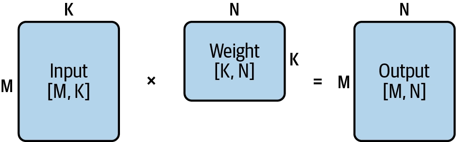

```python
for m in [0, M):
    for n in [0, N):
        for k in [0, K):
            Outputs[m][n] += Inputs[m][k] * Weights[k][n]
```

**산술 강도 계산**
- **분자** (연산 횟수)
    - 위 코드에서: M × N × K번의 곱셈 + M × N × (K−1)번의 덧셈
    - 단순화하면:
        - 연산 횟수 = 2 × M × N × K

- **분모** (데이터 이동량)
    - 입력 행렬 2개(Inputs, Weights)를 읽고, 출력 행렬 1개(Outputs)를 씀
    - 값의 정밀도를 2바이트(예: FP16)로 가정하면:
        - 데이터 이동 = 2 × (입력 크기 + 가중치 크기 + 출력 크기) = 2 × (M × K + K × N + M × N)
        - data movement = 2 × (inputs size + weight size + outputs size) = 2 × (M × K + K × N + M × N)
- **최종 공식** : 산술 연산 강도 = 연산 횟수 / 데이터 이동 횟수
    - **산술 연산 강도** = 2 × M × N × K / (2 × (M × K + K × N + M × N)) = <span class="t-red">M × N × K / M × K + K × N + M × N</span>


**계산 예시: L40S (FP16 기준)**

|**행렬 크기 (M=N=K)**|**산술 강도 (FLOPS/Byte)**|L40S 기준 판정|
|---|---|---|
|64|21|메모리 대역폭 제한(memory bandwidth-bound)|
|512|170|메모리 대역폭 제한(memory bandwidth-bound)|
|4096|1365|연산 제한(compute-bound)d|

- 이를 위에서 계속 예시로 들었던 L40S에 대입하면 다음과 같다.
- **행렬 크기가 ‘64 ~512’ 사이로 작을 때**: 산술 강도가 각각 21, 170 → 419보다 훨씬 낮음 → 메모리 대역폭 제한
- **행렬 크기가 4,096으로 커지면**: 산술 강도 1365 → 419를 훌쩍 넘음 → 연산 제한

> 그렇다면, LLM에서의 행렬은 연산 제한이 될만큼 큰가? 아니면 메모리 제한이 될만큼 작은가?

---
#### LLM의 프리필 단계와 디코드 단계에서의 산술 강도 분석

> 행렬이 클수록 산술 강도가 높아진다는 것을 알았다. 하지만 LLM 서빙에서 항상 큰 행렬 곱셈을 얻을 수 있는 것은 아니다.
> 
> 특히 배치 크기가 1일 때(한 번에 요청 하나만 처리)는 더욱 그렇다.

**입력 텐서의 shape**
- **입력 텐서**: [배치 크기, 시퀀스 길이, 모델 히든 차원] **3차원**
    - 배치 크기: 동시에 처리하는 요청 수
    - 시퀀스 길이: 입력 프롬프트의 토큰 수 (매우 가변적, "Hello" 같은 짧은 문구부터 100만 토큰짜리 긴 문단까지)
    - 모델 히든 차원: 모델 내부에서 각 토큰 벡터가 갖는 값의 개수 (모델 용량·성능에 영향)
- 요청 1개만 처리(배치 크기=1)한다고 가정하면 → [시퀀스 길이, 히든 차원] 2차원 행렬로 단순화됨


**Prefill vs Decode**


- CH2에서 다루었지만, 다시 언급
- 프리필 단계는 초기 처리 단계로, 모델이 출력 토큰을 생성하기 전에 입력 프롬프트를 인코딩하는 과정
	- 트랜스포머 층을 사용해 입력 토큰에 대한 어텐션을 계산
	- KV 캐시 항목 세트를 생성해 이후 생성 단계에 저장
- 디코딩 단계에서는 모델이 이전에 계산된 KV 캐시를 사용해 토큰을 하나씩 생성

| **시퀀스 길이  M = s for prefill  M = 1 for decode** | **히든 차원  K = N = h** | **Prefill arithmetic  intensity (FLOPS/B)** | **Decode arithmetic  intensity (FLOPS/B)** | **Verdict based on L40S**           |
| ----------------------------------------------- | -------------------- | ------------------------------------------- | ------------------------------------------ | ----------------------------------- |
| 64                                              | 4096                 | 62.06                                       | approximately 1.0                          | prefill·decode 둘 다 메모리 대역폭 제한       |
| 512                                             | 4096                 | 409.60                                      | approximately 1.0                          | prefill·decode 둘 다 메모리 대역폭 제한       |
| 4096                                            | 4096                 | 1365.33                                     | approximately 1.0                          | prefill 은 연산 제한, decode는 메모리 대역폭 제한 |

- 위에서 도출한 산술 강도 공식에 프리필과 디코드를 대입하면 위 표와 같다.
- 결론은 다음과 같다.
	- Prefill: 시퀀스 길이가 충분히 길면 산술 강도가 크게 올라가 GPU 연산력을 포화시킬 만큼 높아짐 → compute-bound가 될 수 있음
	- Decode: 시퀀스 길이와 무관하게 s=1이 고정이므로 산술 강도가 항상 매우 낮음(~1.0) → 시퀀스 길이가 아무리 길어도 항상 memory bandwidth-bound
		- (이번 챕터에서는 추후 챕터에서서 배치가 필요한 이유를 설명하기 위해 배치 크기 의도적으로 제외해서 s=1 인것)

> 간략하게 얘기하면, <span class="t-red">입력 프롬프트는 대량의 토큰을 한번에 입력받지만, 출력은 토큰을 한 번에 1개씩 생성</span>하게 때문에 생기는 문제이다.

> [!info] 이 분석의 목적
> - LLM 서빙의 각 단계별 병목(bottleneck)에 대한 직관을 키우는 것
> - 연산 제한(compute-bound) 워크로드 → 수학적 연산 최적화, FLOPS 절감 방향으로 최적화 기법을 찾아야 함
> - 메모리 대역폭 제한(memory bandwidth-bound) 워크로드 → 불필요한 데이터 이동을 최소화하는 방향으로 최적화해야 함

---
### Other AI Accelerators and Trends

---
#### 기타 AI 가속기와 동향

**LLM 추론 시장의 경쟁 칩들**
- 범용 대안: AMD MI300X, Intel Gaudi2 - NVIDIA H100/A100의 대안
- 클라우드 전용: Google TPU, Amazon Inferentia - 각 클라우드에서만 주로 사용 가능
- 지역 제약 시장 대안: Huawei Ascend NPU - 특히 NVIDIA가 규제받는 시장에서 주목받음
- 스타트업들: Groq, Cerebras, Untether AI, SambaNova, d-Matrix 등


**NVIDIA가 여전히 시장을 지배하는 이유 (2026년 초 기준)**
1. **범용성 vs 특화**: 일부 경쟁 칩은 딥러닝 추론, 행렬곱, 트랜스포머 워크로드에 특화되어 있어 아키텍처가 더 단순하고 비용·에너지 효율이 좋지만, **모델 아키텍처가 빠르게 진화하는 상황에 대응하기 어려움**
2. **소프트웨어 생태계**: NVIDIA는 **CUDA 생태계**가 학습·추론 모두에서 훨씬 성숙함. 반면 커스텀 칩들은 각자 독자적인 소프트웨어 스택 필요 (AMD의 ROCm, TPU의 JAX, Inferentia의 Neuron) → **전환 비용이 크고 커뮤니티 지원도 부족**
3. **온칩 SRAM 활용 칩들**: 뛰어난 지연시간 성능을 내지만, SRAM 자체가 비싸고 모델 하나를 서빙하는 데 필요한 칩 수가 많아 비용 효율이 떨어지는 경우가 많음
4. **유연성**: NVIDIA GPU는 여전히 **다양한 추론 구성에 대응하는 유연성**에서 우위 - FP8·FP4 등 다양한 정밀도 지원, 높은 메모리 대역폭, 고급 GPU 인터커넥트 기능


**메모리 벽(Memory Wall) 문제** [https://arxiv.org/pdf/2408.14158](https://arxiv.org/pdf/2408.14158)


- 지난 20년간(그림 5-17) 연산 성능(FLOPS)은 폭발적으로 향상된 반면, 메모리 대역폭·GPU 간 대역폭 같은 데이터 이동 속도는 훨씬 느리게 개선됨
- 결과적으로 데이터 이동 한계가 빠른 연산 발전을 제대로 활용하지 못하게 막는 걸림돌이 되었으며, 이를 "메모리 벽(memory wall)"이라 부른다.
- 많은 가속기 제조사들이 이 문제 해결에 뛰어들고 있다.


**메모리 벽을 완화하는 두 가지 최신 트렌드**

1. 온칩 SRAM으로 연산을 더 가까이 끌어오기
	- **대량의 온칩 SRAM을 활용**해 모델 파라미터와 중간 데이터를 연산 유닛 바로 옆에 최대한 가깝게 유지 → 메모리 접근 지연을 크게 감소
	- **비용은 비싸**지만 극도로 낮고 예측 가능한 지연시간을 달성 가능 → 지연시간에 민감한 추론 워크로드에 매력적
	- 구체적 사례: Groq와 NVIDIA의 최근 협력 - [Link](https://groq.com/newsroom/groq-and-nvidia-enter-non-exclusive-inference-technology-licensing-agreement-to-accelerate-ai-inference-at-global-scale)
	    - NVIDIA가 이 접근법에 관심을 보인다는 것은, 일부 추론 워크로드에서는 극한의 저지연이 피크 처리량보다 더 가치 있을 수 있다는 업계의 폭넓은 인식을 보여줌 - 실리콘 비용이 더 들고 모델을 여러 칩에 걸쳐 신중히 분할해야 하더라도

2. 긴밀하게 결합된 멀티 GPU 시스템 전체로 성능 확장
    - 이 트렌드는 CPU 계층까지 확장됨: 예) NVIDIA Grace CPU는 고대역폭 인터커넥트로 GPU와 긴밀히 통합되어, 대규모 멀티 GPU 시스템에서 CPU-GPU 간 데이터 전송 오버헤드를 감소
    - 대표 사례: GB200 NVL72 (**NVIDIA 랙 스케일 아키텍처**) [https://www.nvidia.com/en-us/data-center/gb200-nvl72/](https://www.nvidia.com/en-us/data-center/gb200-nvl72/)
    - **B200**: Blackwell 세대 GPU
    - **GB200**: Grace CPU + Blackwell GPU를 [NVLink-C2C](https://www.nvidia.com/en-us/data-center/nvlink-c2c/)로 연결한 빌딩 블록 → 고대역폭·저지연 CPU-GPU 결합
    - **NVL72**: NVLink Switch System을 이용해 72개의 Blackwell GPU를 **하나의 거대한 NVLink 도메인**으로 연결한 랙 스케일 시스템
    - **결과**: GB200 NVL72는 **랙 하나에 Grace CPU 36개 + Blackwell GPU 72개를 연결한 구조**
    - 이 랙 스케일 아키텍처는 **대형 MoE 모델의 분리형 서빙**(disaggregated serving)과 결합될 때 특히 강력함 (7장에서 다룰 고급 기법) [https://newsletter.semianalysis.com/p/inferencex-v2-nvidia-blackwell-vs](https://newsletter.semianalysis.com/p/inferencex-v2-nvidia-blackwell-vs)
    - 현재는 이런 최신 소프트웨어-하드웨어 공동설계(codesign)가 필요한 구성을 업계 대부분이 아직 도입 중인 단계이며, Frontier Labs와 빅테크 등 일부 하이퍼스케일러만이 최전선에서 채택하고 있음

---
## CH6. Essential LLM Optimization Techniques

---
### Request Batching and Scheduling-level Optimizations

> CH2에서 서빙 중 요청을 묶어서 배치로 처리하면 응답 속도가 늘질 수 있지만, 더 높은 처리량을 달성할 수 있다는 것을 배웠다.
> 
> 왜 그런지 더 깊이 이해하기 위해 CH5에서 배운 산술 강도라는 개념을 적용해서 분석해보자.
> 
> 배칭은 단순히 '여러 요청을 한꺼번에 처리하는 것'의 의미가 아니라, 개별 요청 하나로는 <span class="t-blue">낭비되던 GPU 연산력을, 여러 요청을 묶어 행렬 크기를 키움으로써 산술 강도를 높여 실제로 활용하게 만드는 것</span>의 의미가 있다.

---
#### 실시간 서빙에서 Batching이 필요한 이유

> 이전 챕터에서 Prefill 단계에서는 높은 산술 강도를 달성하였지만, Decode 단계에서는 s = 1이기 때문에 항상 낮은 산술 강도를 사용할 수 밖에 없어 비효율적이라는 얘기를 하였다.
> 
> 이에 <span class="t-red">Batching을 도입하여 이 문제를 해결</span>한다. (s = n)

**Batching 도입 전 (s = 1)**

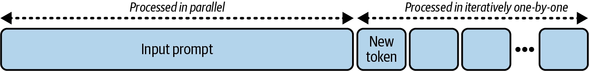


**Batching 도입 후 (s = 3)**

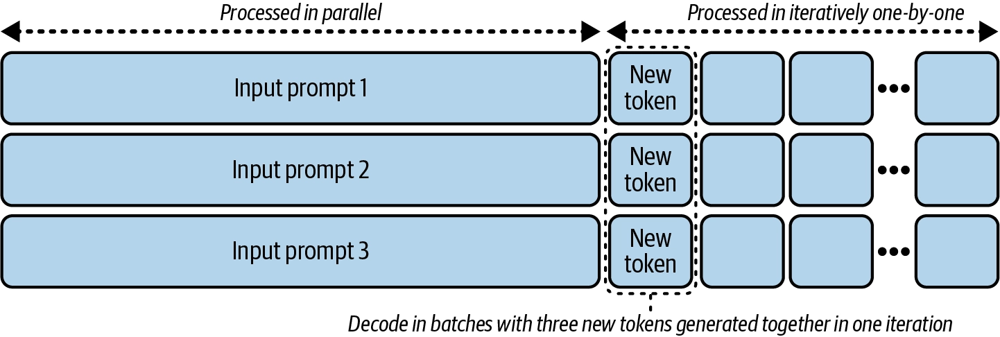

- prompt1, prompt2, prompt3 **세 개의 입력 프롬프트를 하나로 배칭**해서 모델에 전달
- Decode 단계는 여전히 반복(iteration)당 토큰 하나씩 생성하지만, 요청들을 배칭했기 때문에 **한 번의 반복에서 세 개의 새 토큰을 동시에 생성**할 수 있음 - 각 요청당 하나씩
- 이를 통해 <span class="t-red">산술 강도가 인위적으로 상승</span>합니다: <span class="t-red">모델 가중치는 여전히 한 번만 읽지만</span>, 그 한 번의 읽기로 <span class="t-red">더 많은 계산을 수행하고 더 많은 토큰을 생성</span>하게 된다.

> [!info] Batching은 Decode에서 특히 효율적
> - Prefill : 효과가 제한적. 이미 입력 토큰 전체를 병렬로 처리하고 있어서, 입력 프롬프트가 아주 작지 않은 이상(대략 1,024 토큰 미만이 아닌 이상) prefill 자체만으로도 GPU 연산 능력을 이미 포화시킴 → 배칭으로 얻는 추가 병렬성의 효과는 미미함
> - <span class="t-red">Decode : 특히 효과적</span>. 한 번에 토큰 하나씩만 생성하는 구조이므로, 여러 요청을 묶으면 전체 처리량이 상승하고 GPU FLOPS 활용률이 개선됨

---
#### 온라인 추론에서의 동적 배칭

**Static Batching의 문제**

- 온라인 서비스에서는 요청이 언제 들어올지 알 수 없다.
- 예시
	- Max Batch가 10이라고 해서 무조건 10개가 찰 때까지 기다리면
	- Request 1~9 : 바로 도착
	- Request 10 : 5분 후 도착
- 앞의 9명이 5분이나 기다릴 수 있다. ⇒ <span class="t-red">오프라인 사용 사례에는 적합하지만, 온라인 추론에는 부적합</span>


**해결 방법 : Max Batch Size + Max Delay Time**

- 대기 중인 요청 수가 최대 배치 크기에 도달 → 최대 지연 시간이 아직 안 지났어도 즉시 전송
- 최대 지연 시간에 도달 → 배치에 요청이 단 하나뿐이더라도 즉시 전송
- 가장 이해가 빠른 예시
	- “10명이 차면 바로 출발하고, 10명이 안 차더라도 5분이 지나면 출발한다.”
- 파라미터 튜닝 방향 : 지연시간 SLA를 지키는 선에서 배치 크기를 최대한 높게 유지
    - 배치 크기(max batch size)
        - 너무 높이면: 처리 지연시간 증가 + GPU/CPU 메모리 사용량 증가 → 결국 OOM(메모리 부족) 위험
    - 최대 지연 시간(max delay time)
        - 너무 길게 설정 + 높은 배치 크기 조합 → 이미 도착한 요청들이 오래 대기하게 됨
        - 너무 짧게 설정 → 배치를 제때 채우지 못해 실제 처리되는 배치 크기가 줄어듦 (배칭 효과 반감)

> [!warning] 이것으로 부족하다
> - Traditional inference에서는 효과적이지만, LLM은 request마다 output 길이가 달라 batch 내부의 sequence가 서로 다른 시점에 끝난다.

---
#### 온라인 추론을 위한 Continuous Batching

**동적 Batching의 한계**

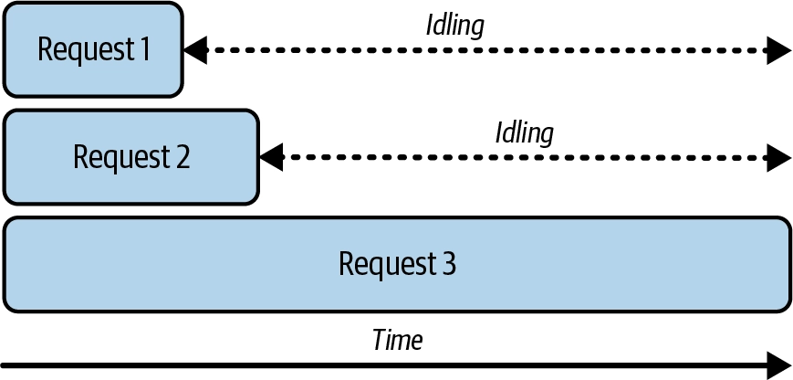

- 동적 배칭은 대부분의 전통적인 ML 서빙에는 잘 작동하지만, LLM은 더 크고 독특한 문제를 안고 있다.
- 입력·출력 길이가 요청마다 크게 다름 → 배치 안 요청들이 처리 완료까지 걸리는 시간이 제각각
- 동적 배칭에서는 배치의 전체 완료 시간이 가장 길고 느린 요청에 의해 결정됨 (배치 안 모든 요청이 끝나야 결과 반환)


**해결 방법 : Continuous Batching** (= inflight batching, interactive batching)

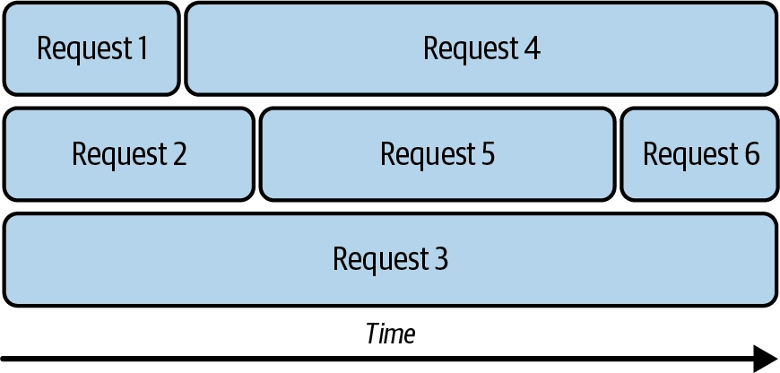

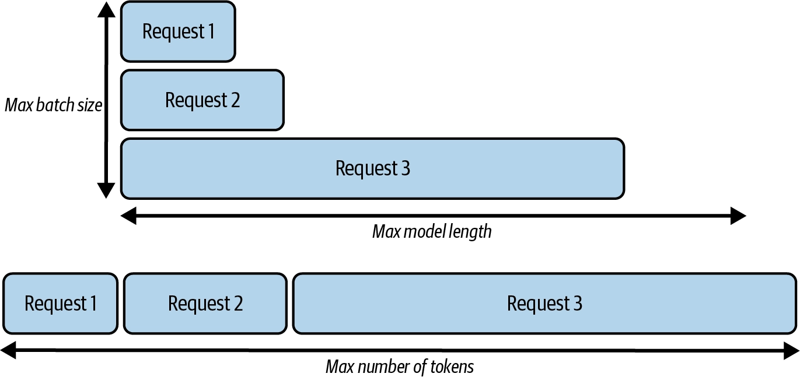

- 연속 배칭: 정해진 배치 크기·시간을 기다리지 않고, 요청을 백엔드 모델에 즉시 추가하고 그때그때 유동적으로 그룹핑
- 배치 내 실행 중인 요청 하나가 끝나는 즉시 → 대기열에 있던 요청이 바로 그 자리에 추가됨
- 예시
	- 처음에 요청 1, 2, 3이 처리 시작
	- 요청 1이 끝나면 → 새로 도착한 요청 4가 즉시 추가
	- 요청 2가 끝나면 → 요청 5 추가
	- 요청 5가 끝나면 → 요청 6 추가
- 튜닝해야 할 파라미터
	- 최대 지연 시간(max delay time)
		- 더 이상 인위적으로 설정할 필요 없음 (**동적 배칭과의 차이점**)
	- **최대 배치 크기**(max batch size)
		- 여전히 관리·튜닝 필요 (단, 이 파라미터는 절대 상한선(upper bound) 역할만 함)
	- 추가 파라미터: **최대 배칭 토큰 수**
		- 토큰(token) 레벨의 더 세밀한 제어
		- LLM 요청은 입력 길이가 천차만별이기 때문
		- 요청 개수 제한만으로는 토큰 길이 차이를 반영하지 못해 배치가 너무 가볍거나 너무 무거워질 수 있음
- **단계별 실제 제약 조건**
    - **Prefill 단계**: 입력이 훨씬 길기 때문에 최대 토큰 수(**max number of tokens**)가 가장 중요한 요소
    - **Decode 단계**: 병렬성은 보통 최대 배치 크기(**max batch size**)에 의해 정해짐

**vLLM 파라미터**
- `--max-num-batched-tokens` : 최대 배칭 토큰 수, 한 iteration에서 배치 전체가 소비할 수 있는 총 토큰 수의 상한
- `--max-num-seqs` : 최대 (동시) 배치 크기, 한 iteration에서 동시에 처리할 수 있는 요청 개수의 상한
- `--max-model-len` : 스케줄러가 배치 전체에서 허용하는 총 토큰 수의 상한

---
#### Chunked Prefill을 이용한 Continuous Batching

**문제 제기: Prefill과 Decode는 서로 다른 워크로드**

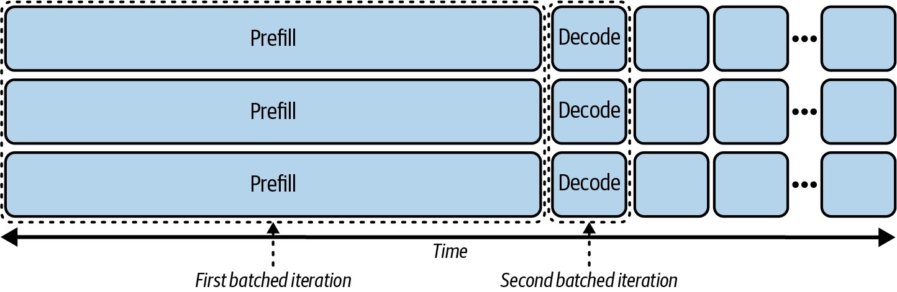

- 연속 배칭은 요청마다 길이가 다른 문제는 해결했지만, LLM 서빙의 또 다른 독특한 측면을 간과하고 있다 ->  prefill과 decode는 서로 완전히 다른 성격의 워크로드
	- Prefill: 산술 강도가 높아 배칭의 도움을 크게 필요로 하지 않음
	- Decode: 산술 강도가 낮아 배칭의 이득을 크게 받음
- Continuous Batching에서 예시로 든 시나리오는 사실 "체리피킹된 이상적인 경우"였다. 
	- 모든 요청의 입력 길이·출력 길이가 동일하고 시작 시점도 같은 경우. 
	- 이 경우 iteration 1에서 세 요청의 prefill이 함께 배칭되고, iteration 2에서 세 요청의 decode가 함께 배칭됩니다. (거의 발생할 수 없는 상황이다)

> 실제 온라인 서빙에서는 요청은 무작위로, 다른 시점에 도착한다.
> 
> <span class="t-red">요청 1이 이미 decode 중인데 요청 2가 도착해 prefill을 시작하고 싶다면? decode를 우선할까, prefill을 우선할까?</span> 아니면 같은 iteration에 함께 배칭할 수 있을까?


**방안 1 : Prefill과 Decode를 함께 배칭하지 않음**

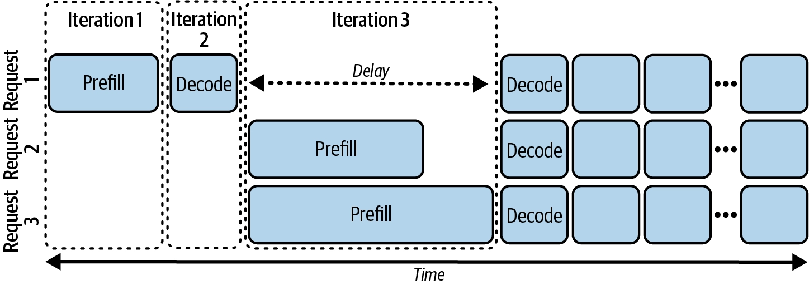

- Prefill과 Decode를 섞은 하이브리드 워크로드는 더 복잡한 GPU 커널이 필요하므로, 우선 이 방법부터 검토
- 요청 1이 prefill(iteration 1) → decode(iteration 2) 진행 중, 요청 2·3이 도착
- **보통 prefill을 우선함** : prefill이 TTFT(첫 토큰까지의 시간)를 결정하는 중요한 지연시간 지표이기 때문(특히 챗봇 같은 대화형 서비스에서 중요)
- 하지만 iteration 3에서 요청 2·3의 prefill을 처리하는 동안 → **요청 1은 완전히 유휴(idle) 상태로 대기**
- 요청 2·3의 프롬프트가 길면 → 요청 1의 종단 지연시간(end-to-end latency)과 토큰 간 지연시간(inter-token latency)에 큰 타격


**방안 2 : Prefill과 Decode를 함께 배칭**

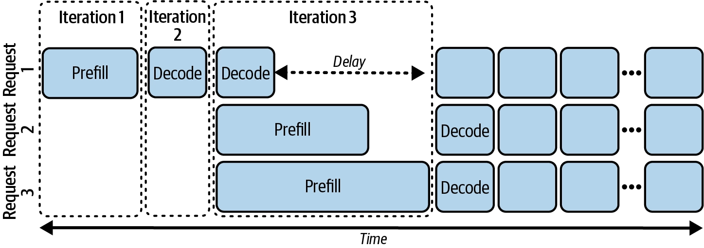

- 요청 1의 두 번째 decode 스텝을 iteration 3에 넣어, 요청 2·3의 prefill과 같은 배치 iteration에서 함께 실행
- 그래도 큰 도움은 안 됨 -> 토큰 하나를 디코딩하는 것은 prefill을 끝내는 것보다 훨씬 빠르기 때문, 특히 입력 프롬프트가 길 경우 지연이 여전히 두드러짐


**해결 방법 : Chunked Prefill**

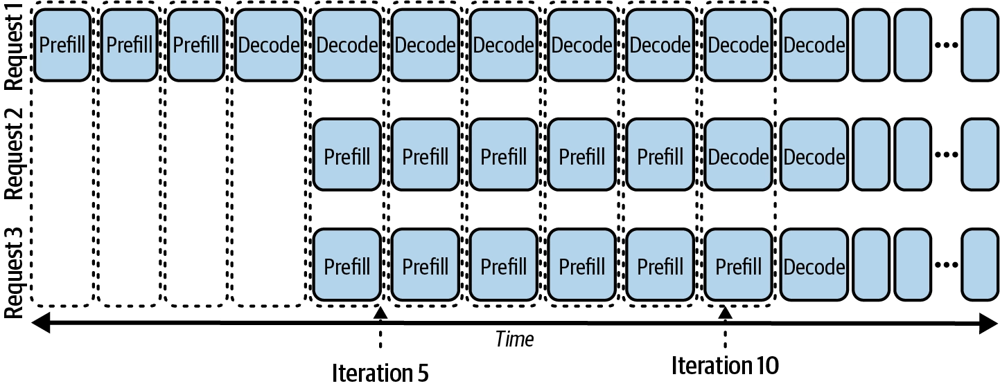

- 긴 입력 프롬프트를 더 작은 청크(chunk)로 나누는 기법
- <span class="t-red">긴 prefill 막대가 decode 박스와 비슷한 크기</span>(이상적으로는 처리 시간도 비슷)<span class="t-red">의 여러 작은 prefill 조각으로 분할됨</span>
- Chunked prefill은 긴 prefill을 여러 chunk로 쪼개 decode와 함께 처리할 수 있게 한다.
- 요청 2·3이 배치에 합류하면(iteration 5): 요청 1은 계속 decode 진행, 나머지 두 요청은 자신만의 작은 청크 단위 prefill을 시작
- iteration 10: 요청 2는(prefill이 요청 3보다 짧아서) 자연스럽게 decode로 전환
- Chunked prefill은 긴 prompt가 많은 workload에서 TTFT와 fairness를 개선할 수 있지만, scheduler 복잡도와 memory 관리 부담이 증가한다.
- **튜닝 파라미터 : 청크 크기 (얼마나 잘게 쪼갤 것인가)**
	- 극단적으로 크게 (예: max model leghth까지)
		- 사실상 청킹을 전혀 안 하는 것과 가음
	- 극단적으로 작게
		- 오버헤드 증가 -> 한 iteration에서 충분한 토큰을 배칭하지 못해 GPU 연산력을 포화시키지 못함
	- 이상적
		- 오버헤드도 크지 않고, 청크 프리필의 목적(빈틈 채우기)도 훼손하지 않는 중간값

**vLLM 문서에서 chunked prefill 관련 파라미터**
- `--enable-chunked-prefill` : 청크 프리필 기능 자체를 켜고 끄는 스위치 , 기본값(True)
- `--max-num-batched-tokens` : 청크 하나(=한 iteration)가 처리할 최대 토큰 수(실질적인 ‘청크 크기’ 역할) , 기본값(컨텍스트에 따라 자동 설정)
- 어떻게 동작하는가
    - `enable-chunked-prefill`이 True면, prefill 요청은 남은 `max-num-batched-tokens`를 기준으로 더 작은 청크로 나뉜다." (**빈 공간 기준으로 prefill chunk 크기가 동적으로 결정**)
    - 즉, 별도의 "청크 크기" 전용 파라미터는 따로 없고, 이전에에 다룬 `--max-num-batched-tokens` 값 자체가 청크 크기를 결정합니다.
    - 긴 prefill을 이 값 이하 단위로 잘라서 여러 iteration에 걸쳐 처리하는 방식입니다.


> [!info] 결국 use case와 SLA 요구사항에 따라 선택해야 하는 트레이드오프
> - ITL(토큰 간 지연시간) : 개선됨 - decode 박스가 더 이상 긴 prefill에 막혀 대기하지 않음
> - TTFT(첫 토큰까지 시간) : 악화됨 - prefill 단계에 더 많은 작업(오버헤드)이 추가됨
> - 종단 지연시간(end-to-end latency) : 개선 안 됨, 오히려 여러 작은 prefill 스텝을 계산하는 오버헤드로 약간 악화되는 경우가 많음
> - 처리량(throughput) : 보통 개선됨 — 유휴 시간의 빈틈을 채워 배치 효율성이 좋아지고 GPU를 더 잘 활용

---
#### 업계 현황

- 연속 배칭(continuous batching) : 이 책이 쓰이는 시점 기준, 몇 년간 프로덕션 LLM 서빙의 업계 표준
- 청크 프리필과 그 변형들 : 긴 컨텍스트 워크로드 처리 등에서 매우 인기 있는 기법
- 더 고급 기법 **Prefill-Decode 분리(disaggregation)**: prefill과 decode 작업을 완전히 다른 GPU, 심지어 다른 노드로 분리하는 방식 → 7장에서 기초를 다진 후 다룰 예정

---
### Scaling Attention and GPU Kernel Optimization

---
#### 확장 가능한 어텐션 메커니즘

> [!info] KV Cache 축소가 중요한 이유
> - Decode 단계에서는 매 iteration마다 KV 캐시가 HBM에서 온칩 레지스터·공유 메모리로 계속 전송
> - KV 캐시가 작을수록
> 	- GPU 메모리 대역폭 부담이 줄어듦 (**VRAM에 캐시를 저장해뒀다가 계속 로드하기 때문**)
> 	- GPU 메모리 공간을 덜 차지 → 더 큰 배치 크기로 더 많은 요청을 병렬 처리 가능 → 처리량 향상
> 	- 제한된 GPU 메모리 안에서 더 긴 컨텍스트도 서빙 가능

> 아래에서는 이러한 KV 캐시를 최적화하는 여러 어텐션 방식을 소개한다.


**4가지 어텐션 방식 비교**

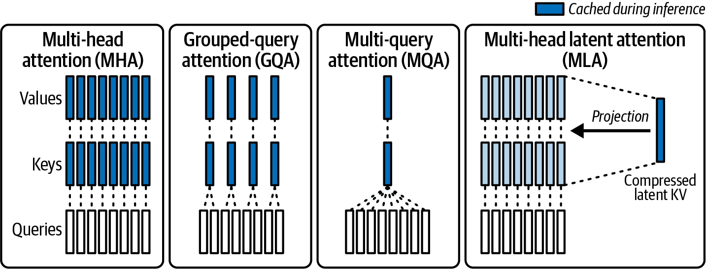

1. **MHA** (Multi-Head Attention)
	- 우리가 기존에 아는 어텐션 방법
	- 많은 초기 모델의 기반이 되는 원래 버전
	- 쿼리 하나당 별도의 고유한 key-value 헤드가 필요
	- 결과적으로 네 방식 중 KV 캐시가 가장 크고 가장 비효율적

2. **MQA** (Multi-Query Attention)
	- **모든 쿼리가 단 하나의 key-value 헤드를 공유**
	- 단점: 너무 공격적인 설계 때문에 모델 정확도가 크게 저하되는 것으로 밝혀짐

3. **GQA** (Grouped-Query Attention)
	- MQA의 정확도 문제를 완화하기 위해 등장, 성능과 정확도의 균형을 목표로 함
	- 쿼리 헤드를 여러 그룹으로 묶고, **각 그룹이 동일한 key-value 공유**
	- MHA(연산 효율 낮음)와 MQA(정확도 손실 큼) 사이의 좋은 절충안으로 입증되어, 현재 많은 모델 아키텍처에서 채택 중
	- 캐시 메모리 뿐 아니라, 추론 시 속도에도 이점

4. **MLA** (Multi-head Latent Attention) - DeepSeek가 도입
	- 단순히 KV 개수를 줄이는 것이 아니라, 영리한 방식으로 압축(compress)한다는 점이 핵심 차이
	- **head를 줄이는 대신 latent를 캐싱한다** (<span class="t-red">각 토큰의 K/V 정보를 저차원 latent로 압축하여 latent 표현을 KV cache에 저장</span>)
	- DeepSeek 원 논문 주장 : "KV 캐시 크기는 그룹 2.25개짜리 GQA와 동등하지만, 성능은 MHA보다 더 강력하다"


**모델이 어떤 방식을 쓰는지 config.json으로 확인하기**

```bash
# MHA는 attention head와 key/value head 수가 같다.
Llama2 (MHA) — num_attention_heads = num_key_value_heads
"num_attention_heads": 32,
"num_hidden_layers": 32,
"num_key_value_heads": 32,

# GQA/MQA 계열은 key/value head 수를 줄여 KV cache memory를 절감한다
Llama3 (GQA) — num_key_value_heads가 축소됨
"num_attention_heads": 32,
"num_hidden_layers": 32,
"num_key_value_heads": 8,
→ KV 헤드 하나를 32 ÷ 8 = 4개의 어텐션 헤드가 공유
```


> [!tip] 이 진화가 시사하는 것
> - 이 모든 발전은 **모델 아키텍처 레벨**에서 일어난다. 
> 	- 즉, **어텐션 방식**(MHA/MQA/GQA/MLA)의 선택은 결국 어떤 모델 계열·구체적인 모델이 내 use case에 가장 잘 맞는가라는 총체적인 결정(holistic decision)의 일부이다.
> - 이러한 아키텍처 발전은 모델 개발 트렌드의 중요한 변화를 보여준다.
> 	- <span class="t-red">초점이</span> 더 이상 모델 품질 향상에만 있지 않고, 점점 더 <span class="t-red">모델을 제품화(productize)하는 것으로 옮겨가고 있다.</span>

---
#### 커널 융합과 커스텀 어텐션 커널

**GPU 커널(Kernel)이란?**

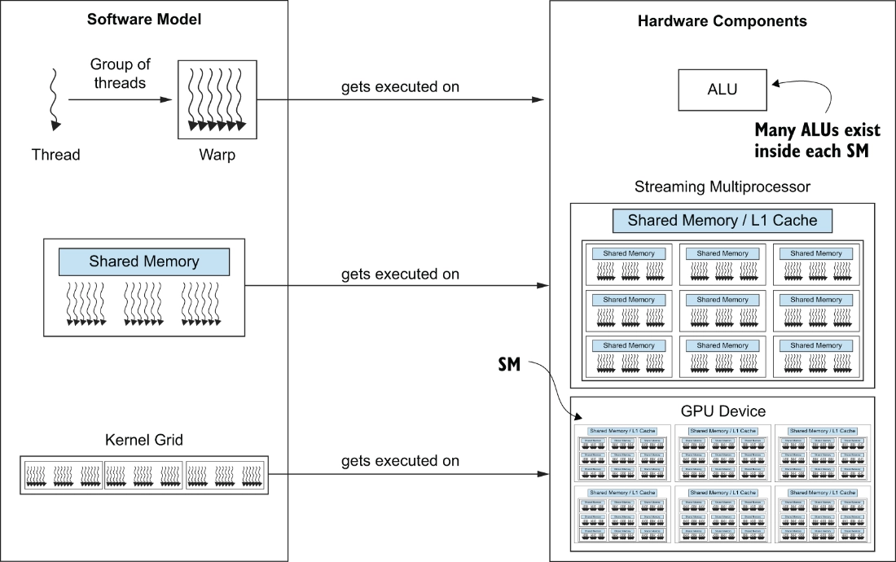

- 커널 : GPU에서 실행되는 작고 특화된 프로그램으로, 행렬 곱셈·소프트맥스 등 LLM과 딥러닝 모델에 필수적인 연산을 수행
- <span class="t-red">모델</span> 아키텍처·하드웨어·워크로드<span class="t-red">에 맞게 적절히 최적화되고 특화된 GPU 커널</span>을 쓰면 GPU 활용률, 추론 속도, 처리량이 크게 향상됨


**커널 퓨전** (Kernel Fusion)

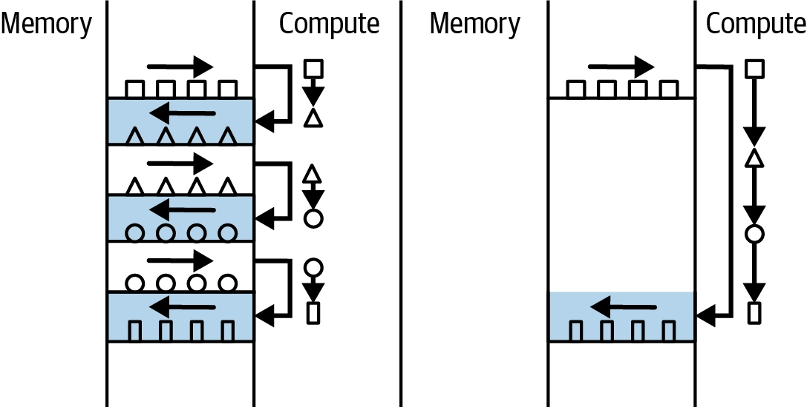

- ML 전반 및 LLM에서 널리 쓰이는 핵심 커널 최적화 기법
- 위 그림은 Kernel fusion 전후 memory/compute interaction 비교
- 여러 <span class="t-red">개별 연산</span>(예: 곱셈 + 덧셈)<span class="t-red">을 하나로 합쳐서</span>, GPU 메모리(ex. HBM) 와 GPU 연산 유닛 사이의 <span class="t-red">데이터 이동 오버헤드를 최소화</span>
- <span class="t-red">레지스터·공유 메모리에 이미 있는 데이터를 재사용</span> → GPU 글로벌 메모리에 다시 쓰고 다시 읽는 왕복(round trip)이 불필요해짐


**커스텀 어텐션 커널** - **Flash Attention**, **Paged Attention**

> Flash Attention과 Paged Attention은 어텐션을 효율적으로 실행하기 위한 커스텀 GPU 커널, 커널 최적화의 대표적인 사례이다.

개념은 [이전 WEEK1 글에서 해당 개념 설명한 부분](./05-llm-serving-study-week1.md#추가적인-여러-attention-효율화-기법) 참고


**실전 예시 : vLLM에서 FlashInfer 커널 사용하기**

```bash
# vLLM에서 FlashInfer 커널 사용하기
pip install vllm==0.8.5.post1
pip install flashinfer-python==0.2.2
export VLLM_ATTENTION_BACKEND=FLASHINFER
export VLLM_USE_FLASHINFER_SAMPLER=1
export VLLM_FLASHINFER_FORCE_TENSOR_CORES=1

# vLLM CLI
## --attention-backend FLASH_ATTN : 어텐션 백엔드를 FlashAttention으로 명시 지정 # 미지정 시 하드웨어에 맞게 자동 선택(auto-detect)
## flash_attn_version (config, 2/3/4) : FlashAttention 버전을 강제 지정, 기본값(None:자동 감지)
## 대부분의 경우 명시적으로 지정할 필요 없음 — vLLM이 GPU 세대(예: Hopper vs Ampere)와 모델 구조에 맞춰 자동으로 최적 백엔드를 고름
### H100/H200 (Hopper) : FlashAttention 3이 자동 선택되는 경우가 많음
### A100/A40 (Ampere 이하) : FlashAttention 2 또는 FlashInfer가 선택됨
vllm serve Qwen/Qwen2.5-7B-Instruct \
  --attention-backend FLASH_ATTN \
  --max-model-len 4096 \
  --max-num-batched-tokens 8192 \
  --max-num-seqs 128 \
  --enable-chunked-prefill
  

# SGLang에서는 플래그 하나로:
--attention-backend {flashinfer|fa3|triton|torch_native|FlashMLA}
```


> [!tip] 우리가 알아야하는 것의 범위
> - 커널 최적화는 그것 자체가 하나의 전문성을 필요로하는 큰 연구 영역이다.
> - 이에 우리는 <span class="t-red">효율적인 커널을 활용하는 것이 실무적으로 중요</span>하다는 점만 기억하면 된다.

> [!info] 어떤 커널을 골라야 하나?
> - 커널·하드웨어·LLM 입출력의 복잡성과 다양성 때문에 명확한 정답을 제시하기 어려움 → 보통 실험을 통해 찾아야 함
> - 다행히 vLLM, SGLang 같은 서빙 백엔드는 기본값을 자동으로 선택하는 내장 로직을 갖고 있음
> 	- 예(집필 시점 기준): SGLang은 Hopper가 아닌 GPU(A100, A40 등)에는 FlashInfer, Hopper 아키텍처(H100, H200, H20)에는 FlashAttention3를 기본값으로 사용
> - 실전 팁 : 처음에는 권장 기본값으로 시작하고, 다른 최적화 기회들을 먼저 시도한 뒤, 추가 성능 향상이 필요할 때 다른 커널을 실험하는 것이 좋음

---
### Model Compression

---
#### 모델 압축 개요

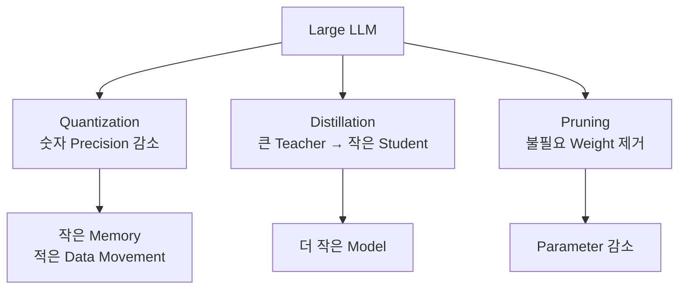

1. **양자화 (Quantization)**
    - 모델 파라미터의 **정밀도를 높은 비트에서 낮은 비트 형식으로 축소**
    - 더 많은 파라미터를 메모리에 욱여넣고, **행렬 연산 속도를 높이는 것**이 목적
    - (CH5에서 배운 FP32 → FP16 → INT8/FP8 정밀도 축소 개념과 직결)
2. **증류 (Distillation)**
    - 크고 강력한 "교사(teacher)" 모델의 지식을 **더 작고 빠른 "학생(student)" 모델로 전이**
    - **학생 모델이 교사의 행동을 모방하도록 학습**
3. 가지치기 (Pruning)
    - **불필요한(redundant) 가중치나 어텐션 헤드를 외과적으로(surgically) 제거**
    - 이 과정에서 모델 용량 중 얼마나 많은 부분이 저활용(underused)되고 있었는지가 드러남

여기서 우리는 '양자화'에 집중할 것이다.

> [!info] 왜 양자화에 집중?
> - 빠르고, 효과적이며, 일반적으로 모델 훈련 파이프라인의 수정이 거의/전혀 필요 없음
> - 낮은 지연시간과 높은 처리량이 요구되는 상황에서 매우 좋음 (엣지 디바이스 등)

방금 전 부분에서 Batching 스케줄링 방식과, Attention 최적화에 집중했다면, 여기서는 '모델 자체의 크기를 줄이는 것'을 다룬다.

---
#### 양자화란?

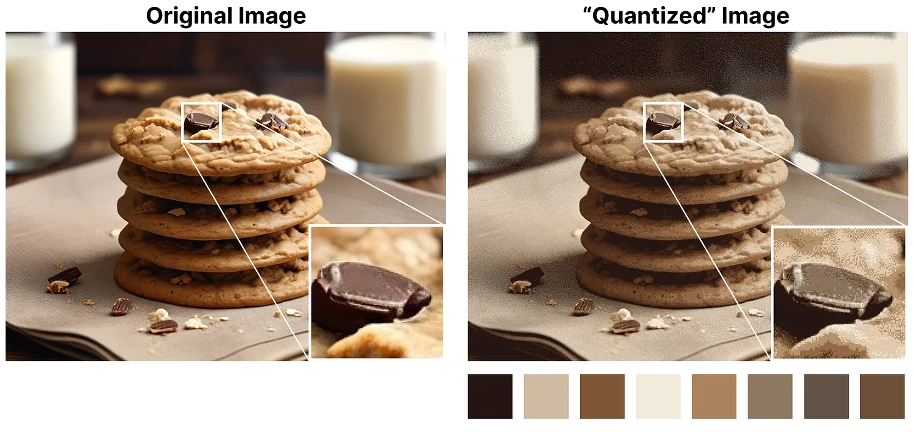

- 모델 파라미터(가중치, 활성화, KV 캐시)의 정밀도를 고정밀 부동소수점(FP32, FP16/BF16)에서 저비트 표현(FP8/INT8, FP4/INT4)으로 낮추는 과정.
- 본질적으로 모델 데이터의 정확도를 낮추는 대신 서빙 성능을 얻는 트레이드오프

- 이 과정에서 두 가지 오차가 발생
	- **반올림 오차(rounding error)**
	    - 발생 원인 : 원래 값을 낮은 정밀도 포맷에 정확히 표현 못해 가장 가까운 값으로 반올림
	    - 예시 : FP32의 7.6 → INT8로는 소수 표현 불가 → 8로 반올림 → 오차 0.4
	- **클램핑 오차(clamping error)**
	    - 발생 원인 : 값이 대상 포맷의 표현 범위를 넘어서 최대/최소값으로 강제 절단
	    - 예시 : FP8 범위가 ±448이라면, 1,000 → 448로 클램핑
	    - 클램핑은 4,096이 448이 되는 것처럼 **심각한 왜곡을 유발**할 수 있어, 최신 양자화 기법은 **하드 클램핑을 피하고 스케일링(scaling) 전략**을 사용
		- **스케일링**: 원본 데이터의 **값 범위를 압축하는 스케일 팩터를** 적용해, **저정밀 포맷의 표현 가능 범위 안에 더 많은 값**이 들어오도록 함

---
#### 양자화가 서빙에 도움이 되는 이유 3가지

|정밀도|FLOPS|
|---|---|
|FP64|34 teraFLOPS|
|FP64 Tensor Core|67 teraFLOPS|
|FP32|67 teraFLOPS|
|TF32 Tensor Core|989 teraFLOPS|
|BFLOAT16 Tensor Core|1979 teraFLOPS|
|FP16 Tensor Core|1979 teraFLOPS|
|FP8 Tensor Core|3958 teraFLOPS|
|INT8 Tensor Core|3958 TOPS|
1. **데이터 크기(모델 크기) 감소**
    - ~7 billion parameters × 2 bytes/parameter = 14 billion bytes = 14 GB
    - → INT8로 양자화하면 즉시 7GB로 절반 감소
    - GPU 메모리가 부족할 때 큰 이득
    - 여러 노드가 아니라 하나의 노드/GPU 안에 모델을 넣을 수 있게 됨 → 노드 간 통신 회피
    - 절감된 메모리 공간이 KV 캐시용으로 확보되어 더 많은 동시 요청 처리 가능
2. **데이터 이동량 감소 → 지연시간 개선**
    - 5장에서 배웠듯, GPU 메모리 대역폭이 특히 decode 단계의 핵심 병목
    - 모델을 작게 만들면 → 필요한 데이터 이동량 자체가 줄어듦 → 추론 지연시간 크게 감소
3. **연산 속도 향상** : 표 6-2. H100의 정밀도별 FLOPS
    - 비트 수를 절반으로(16→8) 줄이면 대체로 FLOPS가 2배로 뜀 (4비트도 마찬가지)

---
#### Weight-only vs Weight-and-Activation 양자화

|항목|W4A16|W8A8|
|---|---|---|
|모델 크기/데이터 이동량 감소|75% (원본의 1/4)|50% (원본의 1/2)|
|연산 FLOPS|변화 없음|2배|
|Prefill(compute-bound)|변화 없음|개선|
|Decode(memory bandwidth-bound)|개선 (저배치에서 강함)|개선 (고배치에서 강함)|
|적합한 상황|긴 생성, 지연시간 민감, 저배치|긴 컨텍스트, 고처리량, 고배치|

> 표기법: W4A16(가중치 4비트, 활성화 16비트), W8A8(가중치·활성화 모두 8비트)

**Weight-only 양자화**
- 가중치만 양자화, 활성화는 그대로
- **실행 시점에 저비트 값**을 다시 **고비트로 역양자화(dequantize)** 해야 함
- **이득**: 모델 크기·데이터 이동량 감소
- **손해**: **연산 자체는 빨라지지 않**음 (**역양자화 오버헤드까지 약간 추가**됨)
- 역양자화를 피하는 방법: **혼합 정밀도 커널**(mixed-precision kernel) 사용
	- Ampere(A100): Marlin 커널
	- Hopper(H100): Machete 커널
	- 예: INT4 행렬 × FP16 행렬을 역양자화 없이 한 번에 곱셈 → 서빙 엔진에서 기본적으로 자동 활성화되는 경우 많음

**Weight-and-Activation 양자화**
- 모델 크기·데이터 이동량 감소는 물론, **활성화까지 양자화**하므로 **compute-bound 워크로드에서 더 높은 FLOPS 달성 가능**
- **더 복잡함**: 스케일링을 언제 계산할지 선택 필요
	- 동적 스케일링(dynamic scaling): 추론 중 실시간 계산 → 정확도는 좋지만 성능은 낮음
	- 정적 스케일링(static scaling): 배포 전 캘리브레이션 데이터셋으로 미리 계산 → 성능 우수

**프로덕션에**서 가장 흔한 조합
- Weight-only: W4A16 (GPTQ 또는 AWQ 방식)
- Weight-and-activation: W8A8 (과거 INT8, 최근엔 FP8로 이동 중)

> [!info] 어떤 양자화 전략을 선택할까
> - 모델이 커서 단일 GPU/노드에 담기 위해 4배 압축이 필요한 경우 → W4A16
> - 고배치 상황에서는 연산 효율 개선(activation 양자화)의 이득이 메모리 절감보다 더 크게 작용 → decode 단계 병목이 memory-bound → compute-bound로 전환됨
> - 실전 원칙: W8A8만으로 지연시간 SLA를 만족할 수 있다면, W4A16 없이 유효 배치 크기를 최대한 높여 모델 인스턴스당 처리량을 늘려 비용 절감을 추구

> [!tip] 최근 동향
> - 과거 W8A8은 주로 INT8(±127 고정 범위로 클램핑) 사용
> - 최근에는 FP8 변형(E4M3, E5M2)으로 많이 이동
> 	- NVIDIA 2022년 논문: FP8 E4M3는 캘리브레이션 없이도 FP16 대비 최소한의 정확도 손실로 성능 개선 가능
> 	- E4M3가 추론에서 더 흔히 쓰임 - E5M2보다 정밀도가 더 높음(단, 동적 범위는 더 좁아 스케일링 필요할 수 있음)
> - (주의) 모든 GPU가 FP8을 지원하는 것은 아님 → NVIDIA GPU 중 Hopper, Blackwell만 FP8 지원. A100 등 구세대 GPU에서는 FP8의 기대 성능을 온전히 얻기 어려움.

---
#### 기타 양자화 기법

**KV 캐시 / 어텐션 양자화**

> KV 캐시 양지화는 우선순위 낮음

- 지금까지 다룬 양자화는 주로 **FFN(피드포워드) 레이어에 집중**, **KV 캐시는 보통 고정밀도로 남겨둠**
- **KV 캐시 양자화의 이점**: GPU 메모리 확보 → 배치 크기↑ → 처리량↑, 프리픽스 캐싱(이 장 후반부에서 다룸)에도 유리
- **주의**: KV 캐시만 양자화해서는 지연시간이 크게 줄지 않음 - 어텐션 계산 자체가 여전히 고정밀도면 FLOPS 이득이 없고, 역양자화 필요
- **완전한 이득을 위해서는 양자화된 어텐션 커널과 함께 사용**해야 함
- 실전 순서: 먼저 weight/activation 양자화(예: FP8) → 긴 컨텍스트나 높은 decode 부하 대응이 필요하면 FP8 KV 캐시 양자화 + FP8 어텐션 커널 추가
- KV cache quantization과 attention quantization은 long-context와 high-concurrency serving에서 memory pressure를 줄이는 데 유용하다


**GGUF 양자화**

- 매우 다른 종류의 양자화 - GPU 대신 CPU/Apple Silicon(Metal)에서 로컬로 LLM을 구동하는 데 특화 (필요시 일부만 GPU로 오프로드)
- 고사양 GPU가 없는 환경을 위한 다양한 정밀도 레벨 지원


**정확도 트레이드오프**

*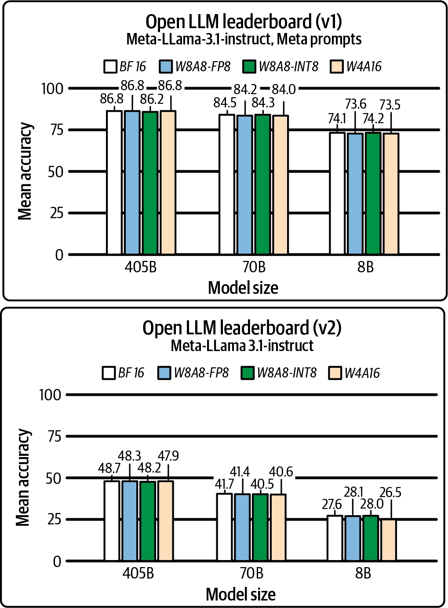

- 양자화의 가장 큰 트레이드오프: **모델 정확도 ↔ 서빙 성능(처리량/지연시간)**
- 다행히 GPTQ W4A16, AWQ, FP8(W8A8)은 실전 정확도 지표에서 **손실이 미미함이 많은 연구로 검증**됨
- 역으로, 양자화로 얻은 성능 여유를 이용해 더 큰 모델을 양자화해서 배포하는 것도 가능 (예: FP8 12B 모델 ≈ FP16 8B 모델과 비슷한 지연시간이지만 처리량·정확도는 더 좋음)


**양자화 인식 훈련 (Quantization-Aware Training, QAT)**

|PTQ (Post-Training Quantization)|QAT (Quantization-Aware Training)|
|---|---|---|
|적용 시점|훈련 완료 후, 정적 가중치에 적용|훈련/파인튜닝 중 양자화 효과를 시뮬레이션|
|난이도|훨씬 낮음 (변환 + 일부 캘리브레이션)|훨씬 높음 (훈련 파이프라인에 추가 연산 필요)|
|8비트 이상 정확도|좋음|좋음|
|4비트 이상 정확도|보통 허용 불가|더 좋고 허용 가능|
|유연성|다양한 하드웨어에 커스텀 튜닝·배포 용이|양자화 스킴에 종속되어 추가 파인튜닝·타 하드웨어 배포 유연성 낮음|

- 실무에서는 PTQ가 QAT보다 훨씬 대중적 - 사용이 쉽고 정확도도 준수하기 때문 (훈련 파이프라인 접근 없이도 가능)
- QAT는 4비트급의 공격적 압축처럼 단순 반올림으로는 모델이 망가지는 경우 신뢰할 수 있는 유일한 선택지가 되기도 함
- 실전 사례: OpenAI GPT-OSS
	- FP4 E2M1(MXFP4 포맷) 기반 **QAT 사용해 모델을 공격적으로 압축**
	- **OpenAI 발표**: gpt-oss-120b는 단일 80GB GPU에서 효율적으로 실행되며 OpenAI o4-mini와 핵심 추론 벤치마크에서 근접한 성능. gpt-oss-20b는 16GB 메모리 엣지 디바이스에서도 실행 가능, o3-mini와 유사한 성능
	- 모델 크기 추정 (FP4 = 파라미터당 0.5바이트)
	    - ~117 billion parameters × 0.5 bytes/parameter = 58.5 billion bytes = 58.5 GB < 80 GB
	    - ~21 billion parameters × 0.5 bytes/parameter = 10.5 billion bytes = 10.5 GB < 16 GB
	- **실제로는 MoE(Mixture-of-Experts) 레이어만 FP4로 양자화됨**(7장에서 다룸) - 하지만 전체 파라미터의 90% 이상이 MoE 레이어라 이 추정은 여전히 유효
	- **장점**: 양자화 완료된 상태로 배포되어 별도의 양자화 알고리즘·정밀도 선택 과정 불필요
	- **단점(하드웨어 종속성)**:
	    - Blackwell(B200): **NVFP4(E2M1), MXFP4 등 4비트 부동소수점을 네이티브로 지원** → 최적의 배포 환경
	    - Hopper(H100/H200): FP8 Tensor Core 중심 설계, 네이티브 FP4는 아니지만 커스텀 소프트웨어 레벨 혼합 정밀도 커널로 여전히 실용적
	    - **Ampere(A100/A10) 이하: FP4 지원이 부실** → 이 경우 GPT-OSS 대신 Qwen 같은 다른 아키텍처를 골라 직접 양자화하는 것이 나을 수 있음

---
#### Distillation (증류)

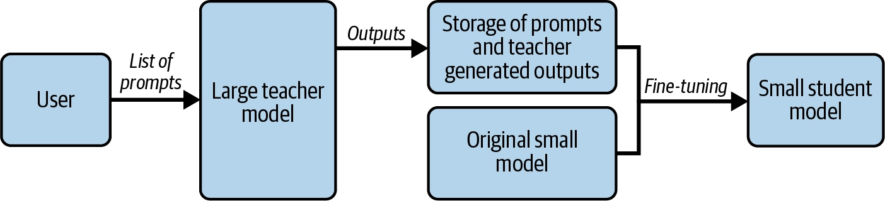

- 모델 압축의 세 기법(양자화, 증류, 가지치기) 중 저자들이 지연시간·처리량 개선에 가장 큰 잠재력이 있다고 보는 것이 바로 모델 증류(distillation)이다.
- 결정적 차이: 원본 모델의 크기를 줄이는 것이 아니라, **완전히 새로운 작은 모델을 훈련**
- 크고 원본인 "교사(teacher)" 모델에 인코딩된 지식을 더 작은 "학생(student)" 모델로 전이하는 방식이며, 이 과정에서 학생 모델은 교사 모델을 모방(mimic)하도록 학습됨
- 교사 모델이 생성한 출력을 이용해 훨씬 작은 학생 모델을 훈련
- 교사 모델의 출력은 최종 출력 토큰("hard label")에만 국한되지 않고, 예측 확률 분포의 로짓(logits)이나 손실(loss)까지 포함될 수 있음
- **중요**: 증류된 학생 모델을 만들려면 **원본 교사 모델에 대한 완전한 접근(full access)이 필요** - 단순히 API로 출력 토큰만 받아오는 것으로는 불가능
- **실전 사례: DeepSeek의 증류 모델**
    - **원본 DeepSeek R1** : 6,710억(671B) 파라미터, MoE 아키텍처 (7장에서 다룰 예정)
    - DeepSeek는 Llama·Qwen 계열의 **오픈소스 dense 모델로 증류한 여러 모델을 공개 (**15억~700억 파라미터 범위)
    - 서빙 관점에서: 모델 크기를 10배 이상 축소 → 서빙 지연시간·처리량에서 엄청난 개선 가능


**양자화 vs 증류**

|양자화|증류|
|---|---|---|
|정확도 하락|낮음 (보통 3% 이하)|양자화보다 훨씬 큼|
|속도 향상|1.5배~3배|훨씬 큼, 대신 정확도 트레이드오프 존재|
|사용 난이도|Post-training 양자화는 매우 쉬움 - 원본 모델 가중치만 있으면 됨|이미 증류된 모델이 없으면 훨씬 어려움 -훈련 비용이 원본 모델 훈련 비용의 최대 10%에 달할 수 있음, 보통 원본 모델을 훈련한 연구진이 직접 수행|


**실전 가이드 (저자들의 일반적 권장 순서)**

1. 먼저 저비용·쉬운 해법부터 시작
2. 예: DeepSeek-R1-671B와 DeepSeek-R1-Distill-Llama-70B 중 하나를 배포하려 한다면:
    - 이미 증류된 모델이 존재한다면 → 먼저 그 모델을 평가해서 정확도 기준을 충족하는지 확인 → 충족하면 그 증류 모델을 채택
    - 증류 모델을 이미 채택했다면, 그 위에 양자화를 추가로 적용해 서빙 성능을 더 끌어올리고 비용을 절감 가능
    - 증류 모델이 준비되어 있지 않은 경우(실제로 대부분 이런 상황) → 양자화를 먼저 시도해야 함 — 증류는 비용이 크고 정확도 손실도 더 크기 때문

> 증류는 가장 큰 성능 개선 잠재력을 지녔지만, 직접 수행하기엔 비용과 난이도가 매우 높은 기법임
> 
> 따라서 실무에서는 "이미 만들어진 증류 모델이 있는가?"를 먼저 확인하고, 없다면 훨씬 저렴하고 쉬운 양자화부터 적용하는 것이 합리적인 순서

---
#### Pruning (가지치기)

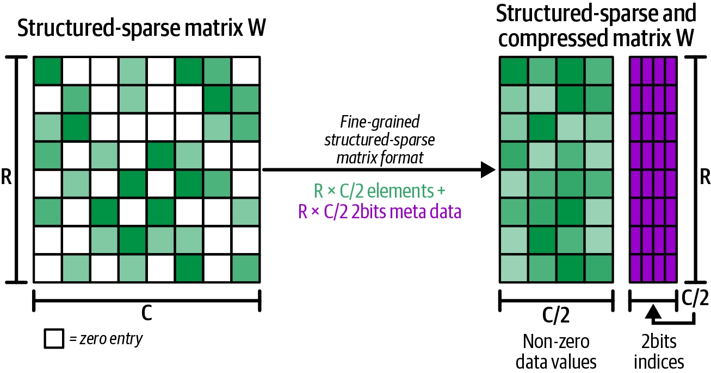

> Pruning은 중요도가 낮은 weight, channel, neuron, attention head 등을 제거해 모델을 작게 만드는 방법

- 세 번째 압축 기법, 가장 덜 대중적
    - 모델 압축의 마지막 기법은 가지치기(pruning)로, 이 책 집필 시점(2025년 중반) 기준 프로덕션에 적용하기 위해 아직 더 많은 연구와 작업이 필요해서 세 기법 중 가장 덜 대중적
- 핵심 아이디어
    - 모델은 보통 과도하게 파라미터화(overparameterized)되어 있으므로, 불필요한(redundant) 부분을 가지치기하면 더 나은 압축을 달성하고 결과적으로 서빙 성능을 개선할 수 있다는 것
- 가지치기의 두 유형
    - 구조적 가지치기(structured pruning) : 모델의 특정 섹션(구획) 전체를 제거
    - 비구조적 가지치기(unstructured pruning) : 개별 가중치를 더 유연하게 제거
- **하드웨어 지원**
    - NVIDIA GPU 아키텍처(Ampere, Hopper)는 이런 구조적 희소성을 가속하는 스파스 텐서 코어(sparse Tensor Cores)를 탑재
    - 50% 희소성은 행렬 곱셈 속도를 직접적으로 2배까지 끌어올릴 수 있음 → 상당한 성능 향상

---
### Prefix Caching

---
#### Prefix Caching 이란?

- 전체 프롬프트를 매칭하는 대신, **프롬프트의 접두사(prefix)만 매칭**하는 기법
- **이전에 처리한 프롬프트들과 접두사가 일치**하면, **그 부분의 KV 캐시는 재계산할 필요 없이 GPU 메모리에서 그대로 재사용**됨
- Prefix caching은 여러 request가 동일하거나 **유사한 prefix를 공유**할 때 **prefill 결과를 재사용**하는 기법
- <span class="t-red">System prompt, instruction, static context, RAG document prefix가 반복되는 agent/RAG workload에서 특히 유용</span>

---
#### RadixAttention

> RadixAttention은 SGLang 전용 구현 용어이다.
> 
> 이 방법은<span class="t-red"> 프롬프트 앞 부분을 캐시</span>하는 방법이다.

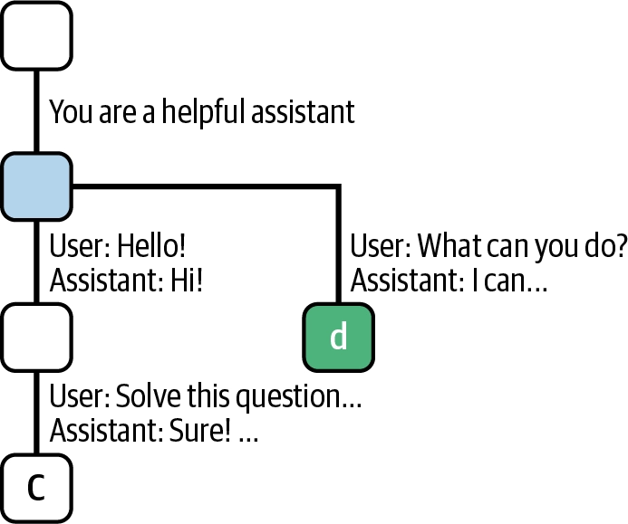

- SGLang 서빙 프레임워크와 함께 소개된 대표적인 프리픽스 캐싱 구현체
- 라딕스 트리(radix tree) “trie(접두사 트리)와 유사한 자료구조” 를 사용해 프롬프트 접두사들을 추적
- 트리는 CPU 메모리에 저장되고, 각 노드는 GPU 메모리의 실제 KV 캐시에 매핑됨
- 트리가 너무 커지면 leaf 노드에 재귀적으로 LRU를 적용해 정리
- 정리 -> <span class="t-red">RadixAttention은 prefix를 radix tree로 관리해 공통 prefix를 효율적으로 찾고 cache hit를 높인다.</span>

---
#### 효과적인 사례 : 멀티턴 채팅

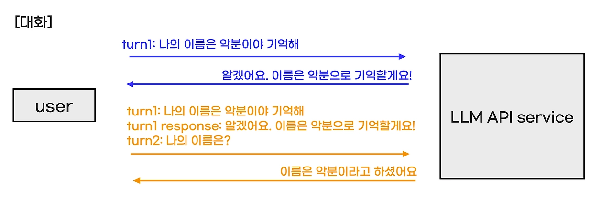

- 사용자가 LLM과 여러 차례 대화를 주고받을 때, 이전 대화 기록 전체가 새 프롬프트에 이어 붙여져 전송된다.
- 프리픽스 캐싱 없이는 매번 이전 대화 전체를 다시 prefill해야 하지만, 캐싱을 사용하면 이미 처리된 부분은 재사용된다.
- 대화가 길어질수록 TTFT(Time To First Token) 개선 효과가 커진다.

---
#### Best Practice

- Stable system prompt를 앞쪽에 둔다.
- RAG document ordering을 안정적으로 유지한다.
- 사용자별 personalization 정보가 cache sharing을 방해하지 않도록 위치를 신중히 정한다.
- Cache hit rate, TTFT 개선, memory pressure를 함께 측정한다.
- Multi-replica serving에서는 cache-aware routing을 고려한다.

---
#### 프레임 워크들(SGLang, vLLM) 예시

- **RadixAttention은 SGLang 전용 구현 : 라딕스 트리(radix tree) 자료구조를 사용**
    - 활성화 방법 : `--attention-backend`와 별개로 기본 내장
- **vLLM**은 RadixAttention을 그대로 쓰지 않고, 개념은 같지만 **자체적인 프리픽스 캐싱 구현체**를 갖고 있다.
    - vLLM은 KV 캐시 블록을 해시(hash) 기반으로 매칭하는 방식을 씁니다 (라딕스 트리가 아님).
    - 활성화 방법 : `--enable-prefix-caching` (기본값 : True)
- **결론** : 현대 최적화된 서빙 엔진들은 프리픽스 캐싱을 켜도 거의 오버헤드가 없기 때문에, <span class="t-red">대부분의 경우 기본으로 활성화</span>되어 있다.
    - 캐시 히트율이 단 5%에 불과하더라도, 그 5% 요청에서 얻는 TTFT 속도 향상만으로도 충분히 가치가 있다.

---
#### Scaling Prefix Cache

1. **단일 모델 인스턴스에서의 고려사항**
    - 프리픽스 캐싱을 사용할 때는 캐시 히트율을 높이기 위해 가능한 한 많은 요청을 캐싱하는 것이 유리하므로, **공통 접두사를 캐싱할 충분한 GPU 공간을 확보**하는 것이 중요
2. **수평 확장과 라우팅 문제**
    - 트래픽이 증가하면 여러 모델 인스턴스를 병렬로 운영하는 수평 확장이 필요
    - 하지만 **프리픽스 KV 캐시는 특정 인스턴스에 로컬로 저장되어 있기 때문에, 단순 로드밸런싱만으로는 부족**하다.
    - 이때 필요한 것이 **스마트 라우팅 레이어**이다.
3. **캐시 인지 라우팅 (Cache-Aware Routing)**
    - 컨시스턴트 해싱(consistent hashing)과 유사하게, **접두사와 모델 인스턴스 간의 친화도(affinity)** 를 만들어 요청을 **해당 프리픽스 KV 캐시를 이미 보유한 인스턴스로 라우팅**합니다. 
    - 이렇게 하면:
        - 새 인스턴스에서 prefill을 처음부터 다시 시작하지 않아도 됨
        - **모든 인스턴스가 모든 접두사를 캐싱할 필요가 없어짐** → GPU 메모리 절약, 잦은 캐시 축출(eviction)과 재계산 방지
4. **GPU 메모리가 부족할 때**
    - 접두사가 매우 길거나 캐싱해야 할 접두사 종류가 많아 GPU 메모리로 부족할 경우, **KV 캐시를 CPU 메모리나 SSD로 오프로드**하는 방법이 있다 (7장에서 상세히 다룸).
5. **멀티테넌시(Multi-tenant) 환경에서의 보안 문제**
    - 실제 서비스에서는 여러 고객이 동일한 모델 엔드포인트/인스턴스를 공유한다 (고객별 전용 인스턴스는 비용이 너무 큼). 
    - 이때 문제가 발생할 수 있다:
        - 예: 고객 A와 고객 B의 프롬프트 접두사가 우연히 동일할 경우, 고객 A는 응답 지연 시간을 관찰해 다른 고객의 데이터를 추론(enumeration 공격)할 수 있다.
	- **해결책: 고유 ID 삽입**
	    - NVIDIA 기술 블로그에서 제안하는 방법은, 시스템 프롬프트와 컨텍스트 섹션 사이에 고객별 고유 ID(사용자 ID 또는 세션 ID)를 삽입하는 것
	    - 이렇게 하면 서로 다른 고객의 프롬프트는 시스템 프롬프트까지만 접두사를 공유할 수 있고, ID가 다르기 때문에 그 이후 컨텍스트는 절대 공유되지 않아 테넌트 간 데이터 격리가 보장된다.

---
