---
## CH7. Advanced LLM Optimization Techniques

---
### Speculative Decoding

---
#### Speculative Decoding이란?

검색이나 추천을 위해 백만 개의 데이터 포인트를 가진 대규모 머신러닝 시스템에서는, **첫 번째 필터링 단계를 위해 작지만 정확도가 낮은 모델을 사용**하는 것이 일반적이다. (시간, 비용 효율적)

```
원래:

The weather is [???] [???] [???]
                 ↑
              순차적으로
              알아내야 함


Draft 사용:

The weather is [sunny] [and] [warm]
                 ↑       ↑     ↑
              일단 후보를 채움

Target 검증:

The weather is [sunny] [and] [warm]
                 ✓       ✓      ✓
```

Speculative Decoding도 비슷한 개념이다.

Draft Model 이라고 부르는 작은 모델을 활용해 대형 Target Model을 위한 후보 토큰을 생성하는데 도움을 준다. 이로 인해 디코딩 단계가 빨라진다.

즉, <span class="t-red">토큰 생성 과정에서 작은 Draft Model이 다음에 올 토큰이 무엇인지 추측한다. 그리고 Target Model이 이렇게 생성된 토큰들을 검증</span>한다. 검증 기준에 충족된 토큰들은 받아들이고, 아닌 토큰들은 버린다.

이 기법의 가장 큰 장점은 <span class="t-red">속도는 얻지만 품질 저하는 없다</span>는 것이다.  단순히 빠른 모델을 쓰는 게 아니라, 수학적으로 원래 target 모델의 확률 분포와 동일한 분포에서 샘플링한 것과 같은 결과가 나오도록 설계되어 있기 때문이다.(rejection sampling 방식)

> [!info] 왜 빠른가?
> - (Draft Model이 생성한) 여러 토큰을 한 번의 target forward pass로 검증하므로, target 모델이 토큰마다 개별로 forward pass를 하는 것보다 훨씬 효율적.
> - GPU는 순차 연산보다 병렬 연산에 강하기 때문에 이 병렬 검증이 실질적인 속도 향상(특히 ITL, 토큰 간 지연시간)을 만들어낸다.

----
#### 자세한 과정 설명

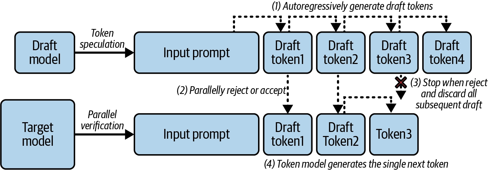

- 먼저 Draft Model이 빠르게 K개의 토큰을 생성 (여기서의 K 또한 최적값으로 튜닝해야하는 중요한 파라미터)
- 예를들어 "The soccer team of the United"라는 문구가 주어졌을 때, Draft 모델이 다음 토큰의 확률을
	- "State" - 0.6
	- "Kingdom" - 0.3
	- "Nations" - 0.1
- 이라고 예측했을 때, 만약 Target Model이 "State"의 확률을 0.8로 판단한다면 (Draft의 0.6보다 높으므로) 그 토큰을 그대로 수락한다.
- 만약 Target Model이 "State"의 확률을 0.4로 판단한다면, 보통 0.4를 0.6으로 나눈 값을 기준으로 수락 여부를 확률적으로 결정한다.
- Target Model이 그대로 토큰을 수락한다면, 다음 토큰 검증으로 넘어간다.
- 만약 수락하지 않는다면, 해당 토큰 이후의 모든 토큰을 버린다. (이후의 토큰들은 해당 토큰의 영향이 있으므로) 대신, Target Model이 적절하다고 판단하는 토큰을 하나 직접 생성한다. (위 그림의 Token3)

---
#### 실무에서의 Speculative Decoding 팁들

**Draft Model 모델을 선택하는 여러 방법**

| 방법                      | 방식                           |
| ----------------------- | ---------------------------- |
| 기존 소형 모델                | 같은 계열의 작은 모델을 그대로 사용(양자화 권장) |
| 증류(Distrillation)       | 타깃 모델로부터 소형 모델을 직접 학습        |
| 셀프 드래프팅 (Medusa, EAGLE) | 타깃 모델 자체에 예측 헤드/모듈 추가        |
| N-gram                  | 프롬프트 내 반복 패턴을 테이블화해 매칭       |

1. 기존 소형 모델
	- 같은 계열의 모델을 사용하면 동일한 토크나이저와 사전학습을 공유하게 되어 높은 수락률을 달성하는 데 실질적으로 도움이 된다.
	- 또한, 이러한 같은 계열의 모델은 공격적으로 양자화하여 Draft Model로 사용하는 것도 좋은 방법인데, 어차피 Target Model이 항상 fallback 역할을 해주기 때문이다.

2. 증류(Distillation)
	- 만약 어느정도 training이 가능한 환경이라면, 기존의 작은 모델을 그냥 고르기보다는 Target Model로부터 작은 같은 계열의 작은 모델을 증류(distill)하는 것이 보통 더 낫다.
	- 이러한 과정은 Draft Model의 예측과 Target의 검증 단계 사이의 불일치를 줄여준다. (수락률 높아짐)

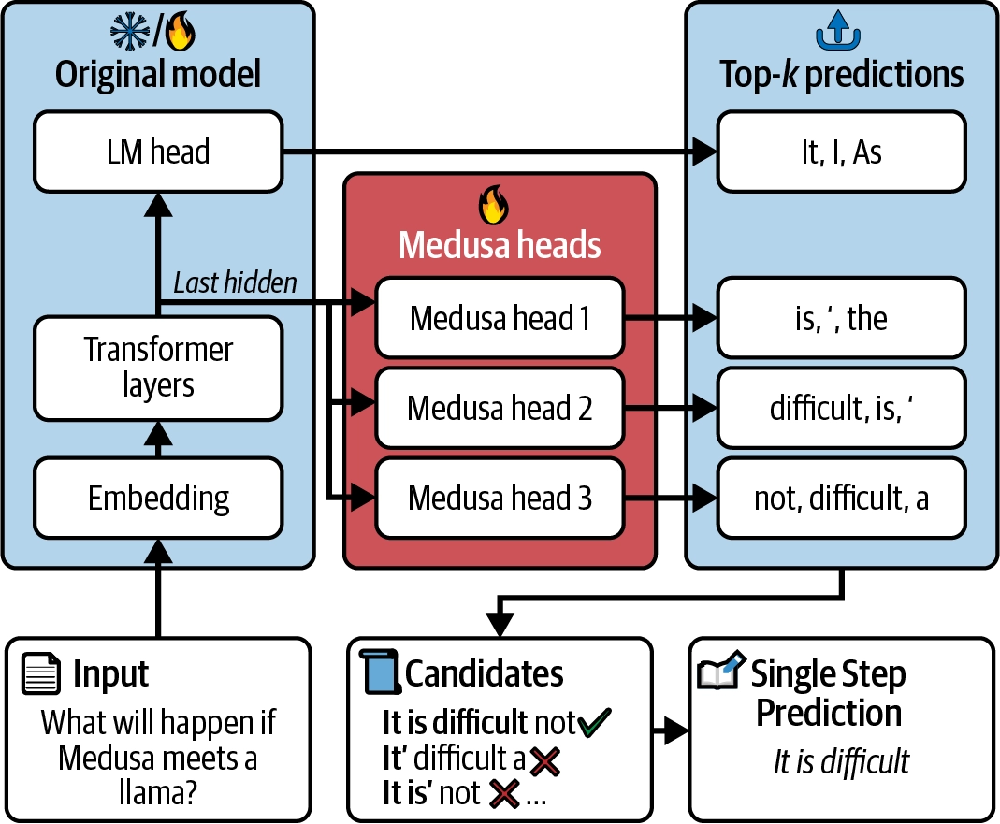

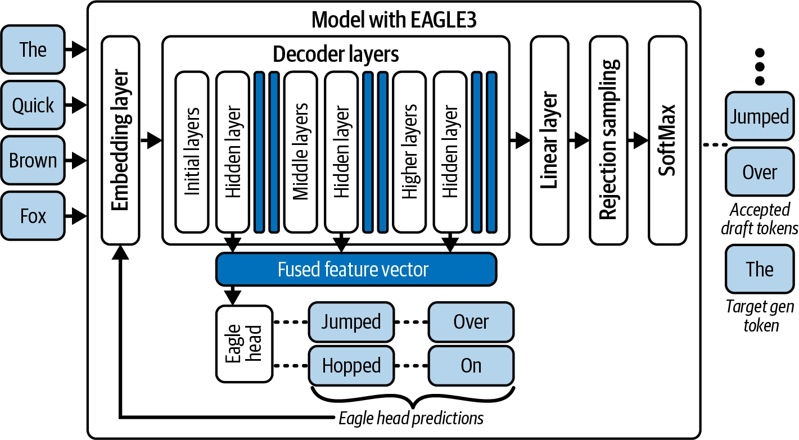

3. 셀프 드래프팅 (Medusa, EAGLE)
	- 모델 스스로가 자신의 미래 토큰을 Draft하게 하는 방식이다.
	- Target Model에 경량 예측 헤드(prediction head)나 보조 모듈(auxiliary module)을 추가해 같은 모델 안에서 여러 단계 앞을 내다보는 예측(multistep lookahead)을 만들어낸다.
		- 여기서의 head는 '최종 벡터(hidden state) -> 문자 토큰 별 확률' 로 바꾸는 부분이다.
		- 그러니까, Target Model의 검증 전에 Target Model안에서 경량 헤드로 k개의 토큰을 만든다는 뜻
	- 별도의 Draft Model 없이 수행하기 때문에 GPU 메모리를 절약하고 배포를 단순화한다.
	- 첫번째 그림의 Medusa는 여러 헤드로 한번에 여러 토큰들을 만들어내고, 여러 후보 토큰들을 조합해 그중 가장 길게 수락되는 후보를 선택한다. (한번에 여러 토큰 생성)
	- 두번재 그림의 EAGLE(Extrapolation Algorithm for Greater Language-Model Efficiency)은 Medusa처럼 토큰을 직접 드래프트하지 않는다.
		- Target Model의 미래 내부 hidden state를 예측하도록 학습된 작은 보조 모듈을 사용한다.
		- 이를 통해서 비싼 Target Model의 연산을 덜 하게 민들어 전체 디코딩 속도를 높인다. (한번에 여러 토큰 생성은 아님)

|트라이그램 테이블 (n=3)|다음 토큰|카운트|
|---|---|---|
|a quick brown|(해당 없음, 등장만)|1|
|quick brown **fox**|-|1|

4. N-gram
	- 작은 모델이나 모듈이 토큰을 추측하게 하는 대신, 세 번재 옵션으로 n-gram이라는 단순한 방법이 있다.
	- 기본적으로 요청의 앞부분에서 인접한 n개의 시퀀스를 골라, 이를 위와같은 n-gram 테이블에 저장한 뒤, 매칭을 수행해 다음 토큰들을 제안하는 방식이다.
	- `An hour ago, a quick brown fox ran away and now, that quick brown [next token]`
	- 위 표의 2번째 행을 근거로 다음 토큰이 fox일 것이라고 제안한다. (AI 기법이라기 보다는 캐싱과 비슷하다고 생각하면 됨)
	- 단순한 캐싱과 같은 방법이므로 오버헤드가 매우 낮으면서도 다음과 같은 상황에서 매우 강력하다.
		- JSON이나 SQL 파일 같은 구조화된 출력(structured output)을 생성할 때
		- LLM에게 글을 다듬거나 미리 정해진 템플릿을 채우도록 요청할 때


**K 파라미터 튜닝 (Draft 토큰 개수)**
- K↑ → 잠재적 속도 향상 상한 ↑, 그러나 수락률이 낮으면 낭비도 ↑
- K↓ → 예측 가능하고 안정적이지만 이득이 제한적
- 실무 권장: 보통 4~8, 구조화된 출력/함수 호출처럼 예측 가능성이 높으면 16~32까지도 가능
- 위치별 수락률(예: [0.8, 0.7, 0.6, 0.5, 0.10, 0.02])을 모니터링해 이득이 없는 뒷부분은 K를 줄여 잘라내는 것이 실전 튜닝법


**Speculative Decoding의 한계**
- prefill이 아닌 decode 단계에만 유효 : 긴 입력 컨텍스트처럼 이미 compute-bound인 상황에서는 효과 없음
- 엔지니어링 난이도 : 두 모델을 한 GPU에서 동시에 효율적으로 운용하는 것 자체가 어려움 → 그래서 최근 트렌드는 별도 드래프트 모델보다 셀프 드래프팅 + n-gram으로 이동
- 정적 K의 한계 → 적응형(adaptive) K에 대한 연구가 활발


> **결론**
> 추론적 디코딩은 "**처리량(throughput)이나 TTFT를 다소 희생해도 ITL/지연시간을 낮추고 싶은**", **memory-bound·저배치·저지연 요구 시나리오**에서 가장 강력한 무기다. 

> [!info] 실습
> - https://github.com/orca3/llm-model-inference/blob/main/ch07/SpecDecode.ipynb
> - 위 실습을 추후 `Runpod` 나 `AWS GPU EC2`에서 돌려보자.

---
### Multi-GPU / Multi-Node 에서의 추론

---
#### 개요

현대의 LLM은 종종 단일 GPU가 감당할 수 있는 메모리 용량을 초과하며, 이를 낮은 지연 시간으로 대규모로 서비스하는 것은 한 개의 GPU가 감당할 수 있는 범위를 훨씬 넘어선다.

이러한 한계를 극복하기 위해 추론 시스템은 하나 이상의 노드에 분산된 여러 GPU를 활용하는 분산 전략을 사용한다. 

이 섹션에서는 분산 서빙에 초점을 맞추고 네 가지 병렬 처리 기법을 다룬다.

1. 데이터 병렬 처리 (DP, Data Parallelism)
	- 처리량 확장을 위해 GPU와 노드 전반에 모델 인스턴스를 복제
2. 텐서 병렬처러 (TP, Tensor Parallelism)
	- 대형 모델에 적합하며, 레이어와 대규모 행렬 연산을 분할하여 지연시간을 줄임
3. 파이프라인 병렬 처리 (PP, Pipeline Parallelism)
	- 대규모 모델 훈련에 적합하며, 레이어를 여러 GPU 및 노드에 걸쳐 단계별로 분할하여 처리
4. 전문가 병렬 처리 (jExpert Parallelism)
	- 전문가 혼합(MoE) 모델의 경우, 전문가들을 여러 GPU에 분산시켜 작동시킴

---
#### 데이터 병렬 처리 (DP)

> Inference Serving 관점에서 데이터 병렬화를 다룬다.

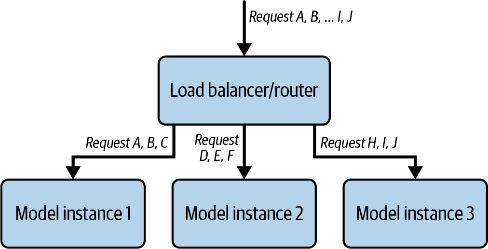

일반적인 소프트웨어 워크로드에서 많이 사용되어 익숙한 Replica를 늘려 수평확장하고 로드밸런싱하는 방법과 동일하다. (부하 분산 및 고가용성 보장)

다만, LLM 서빙에 사용되는 하드웨어는 매우 고가이기 때문에, 효율적인 라우팅 메커니즘의 가치는 일반적인 소프트웨어 워크로드 보다 높다.

이에 아래와 같은 다양한 라우팅 전략을 사용한다.

**라운드 로빈**
- 일반적인 소프트웨어 워크로드에서 가장 익숙한 방법
- 그냥 순서대로 각 인스턴스에 고루 분산
- 특정 요청은 처리 시간이 길 수 있기 때문에 불균등한 부하로 이어질 수 있다.

**최소 연결**
- 활성 연결 수가 가장 적은 인스턴스로 라우팅
- 라운드 로빈보다는 낫지만, 이미 처리 중인 요청의 복잡성이나 길이는 고려하지 않는다.

**Latency 기반 라우팅**
- 실시간 Latency를 지속적으로 모니터링하고, 가장 빠르게 응답하는 인스턴스로 라우팅
- 이 방법은 성능 변동에 동적으로 대응함으로써 tail latency(응답 시간 분포에서 가장 느린 구간의 레이턴시)를 개선시킨다.

**캐시 인지 라우팅** (Cache-aware routing)
- CH6에서 prefix caching을 소개했는데, 이는 input의 prefix가 동일할 때 요청 간 기존 KV 캐시를 재사용하는 기법이었다.
- 이를 라우팅에 적용하여 여러 인스턴스 중 해당 prefix cache를 가진 인스턴스로 라우팅하는 방법이다.

---
#### 텐서 병렬처리(TP)와 파이프라인 병럴처리(PP)

**의사결정트리**

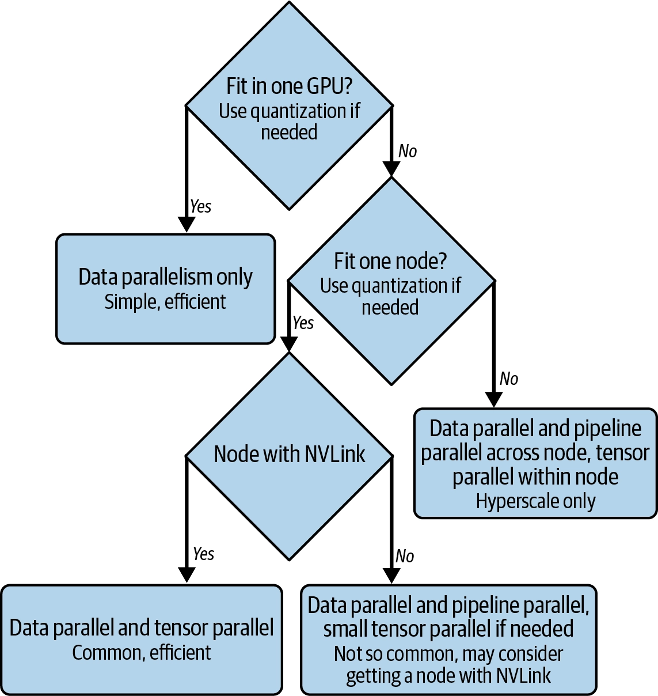

1. 가능하면 GPU 1개로 해결 - 같은 노드라도 GPU간 인터커넥트는 GPU 내부 대역폭보다 훨씬 느리다.
2. 메모리가 부족하면 먼저 양자화 시도
3. 그래도 안되면 멀티 GPU 노드 (노드 1개) - 노드 간 대역폭(InfiniBand)은 노드 내 대역폭(NVLink)보다 훨씬 느리다.
	- 만약, NVLink가 아니라 PCIe라면, 그냥 다른 모델 선택을 선택하거나 PP 고려하자. -> PCIe는 TP를 하기에 너무 느리다.
4. 모델이 멀티 GPU 노드에도 안들어가면 멀티 노드
	- 이때 TP는 노드 내부에서만, PP는 노드간에 적용하는 하이브리드 전략이 표준이다.


**TP와 PP**

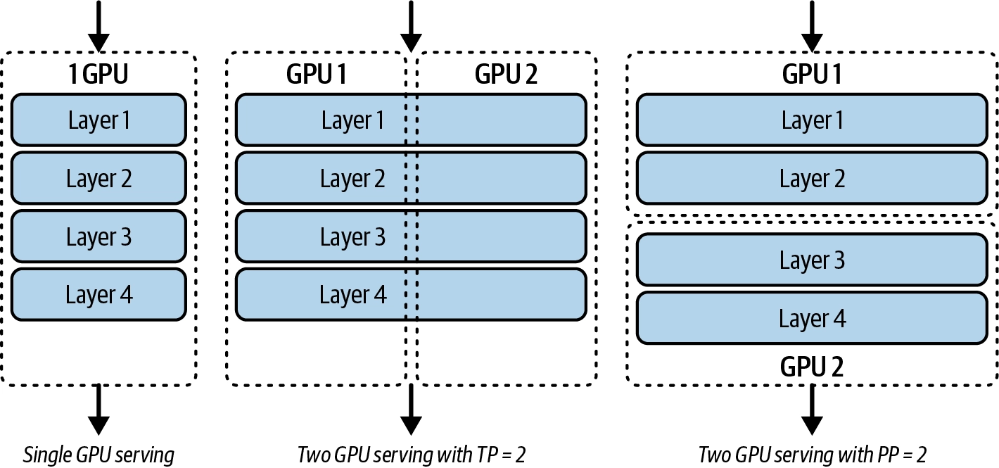

- TP는 모델을 너비 방향으로 샤딩하고, PP는 깊이 방향으로 샤딩한다.
- 쉽게 얘기하면, TP는 Weight들을 여러 GPU로 분할하여 계산하는 방식이다.
	- 다만, 모든 레이어에서 GPU간 통신이 필요하다. (계산 후 결과를 합치야 다음 레이어 계산이 가능하기 때문)
- 반면에, PP는 모델의 Layer들을 여러 GPU로 분할하여 계산하는 방식이다.
	- GPU 1개의 연산이 모두 끝나고 다음 GPU에 있는 레이어에 넘어갈 때만 GPU간 통신을 한다.
	- 그렇다고 무조건 PP가 좋은건 아닌게, 한 단계가 느려지면 이 영향이 모든 레이어에 전파된다.

---
#### 전문가 병렬화 (EP)

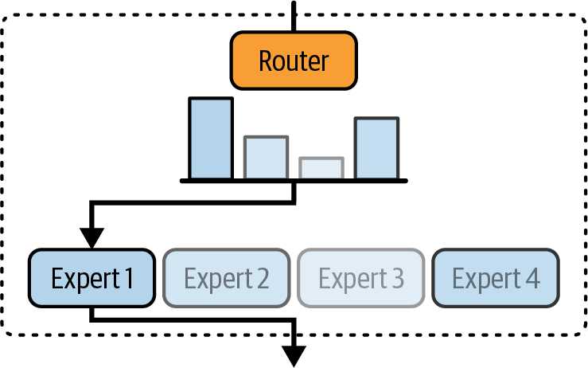

> [!info] MoE
> - Mixtral, DeepSeek-V3, GPT-OSS 같은 최신 LLM들은 모든 파라미터를 매 토큰마다 사용하는 것이 아니라, **라우터가 토큰마다 소수의 Expert만 선택적으로 활성화**하도록 설계되었다. (큰 모델의 성능을 유지하면서도 연산량을 줄이기 위해)

MoE를 사용하면 토큰당 연산량은 줄어들지만, 전체 Expert 파라미터 총합은 여전히 매우 커서 단일 GPU 메모리에 다 담기지 못하는 경우가 많다.

Expert들을 여러 GPU에 나눠서 배치하고, 각 토큰은 라우터가 선택한 전문가가 실제로 위치한 GPU로만 전달됨 (비활성 전문가가 있는 GPU에는 아무 연산도 요청하지 않아 불필요한 계산을 피함)

> EP는 TP/PP와 독립적으로 쓰이는 것이 아니라 상호 보완적으로 결합되어 사용하는 기법이다.

---
### Prefill-Decode Disaggregation

---
#### 개요

> Prefill-Decode Disaggregation - Prefill과 Decode 분리

TP·PP는 "모델을 어떻게 GPU에 나눠 담을까"만 해결할 뿐, prefill(연산 집약)과 decode(메모리 대역폭 집약)라는 완전히 다른 두 워크로드가 같은 **GPU를 공유하면서 생기는 간섭(interference) 문제는 해결하지 못함.** (CH6의 chunked prefill로 일부 완화는 가능하지만 근본적 해결책은 아니다)

---
#### Prefill-Decode 분리의 이점

1. TTFT/ITL을 독립적으로 최적화 가능
	- 입력이 긴 워크로드는 prefill에 자원을 몰아 TTFT를 줄이고, 출력이 긴 워크로드는 decode에 자원을 몰아 ITL을 줄이는 식으로 비대칭 확장이 가능하다.
2. 워크로드별 독립적으로 최적화 가능
	- Prefill은 주로 compute-bound이므로 Tensor Core 등 GPU 연산 자원을 충분히 활용할 수 있도록 적절한 batch size를 사용하고 (GPU에 연산기가 아주 많은데, 배칭하면 한 번에 더 큰 계산을 만들어 더 많은 연산기를 동시에 사용)
	- Decode는 주로 memory-bandwidth-bound이므로 여러 요청을 batching하여 weight 재사용률과 메모리 대역폭 효율을 높인다. (큰 모델 weight를 읽어와야하는데, 배칭을 하면 한번 읽어왔을 때 동시에 많은 처리 가능)
	- Prefill과 Decode의 최적 batch size가 서로 다르기 때문에, 두 단계를 분리하면 각각 독립적으로 최적화할 수 있다.
3. 하드웨어 선택 다양화
	- prefill=연산 최적화 GPU(예: H100), decode=메모리 대역폭 최적화 GPU(예: H200, 또는 저비용 L40S)로 서로 다른 하드웨어를 매칭해 비용 최적화
4. 독립적, 비대칭적 스케일링
	- prefill은 요청이 버스트성이라 공격적 오토스케일링에 적합하고, decode는 더 예측 가능하고 안정적인 스케일링 전략에 적합

---
#### 아키텍처 소개

**DistServe의 prefill-decode disaggregation architecture**

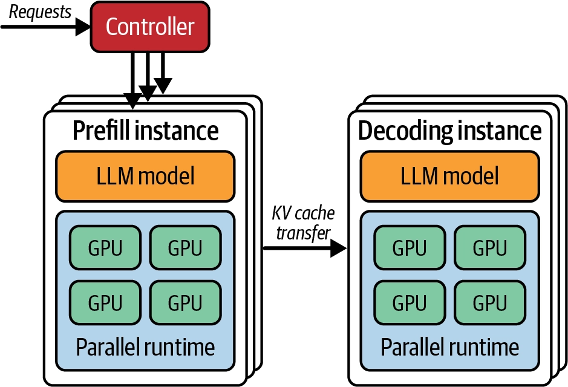

- 컨트롤러(Controller)가 모든 들어오는 요청의 진입점 역할을 하며 라우팅을 담당
- 요청이 먼저 Prefill 인스턴스로 전송되어 처리 → 이 과정에서 KV 캐시가 생성됨
- 생성된 KV 캐시가 즉시 Decode 인스턴스로 전달되고, decode 인스턴스가 이를 이어받아 토큰을 순차 생성하며 요청을 완료

> [!info] 참고할만한 다른 아키텍처들
> - https://llm-d.ai/docs/well-lit-paths/foundations/pd-disaggregation
> - Efficient KV Transfer in vLLM via NIXL
> - [NVIDIA Inference Xfer Library (NIXL)](https://developer.nvidia.com/blog/enhancing-distributed-inference-performance-with-the-nvidia-inference-transfer-library/)

---
#### KV Cache 전송

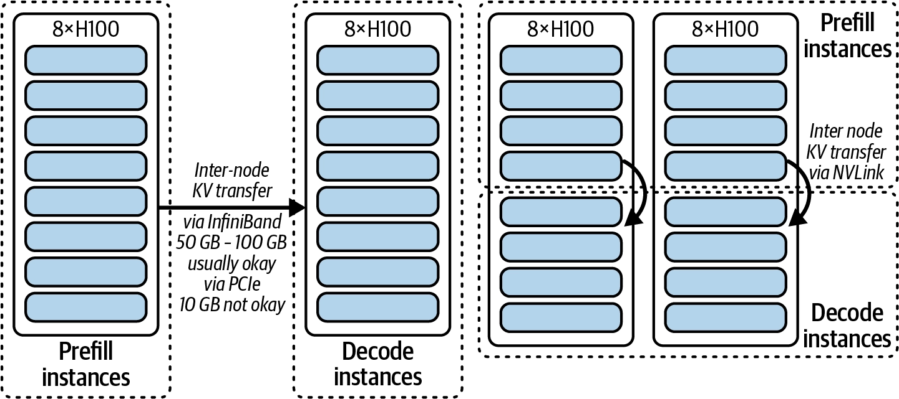

위의 Prefill-Decode 분리 구조처럼 KV Cache를 전송해야하는 경우 고려해야하는 것들이 있다.

KV 캐시 크기는 입력 길이에 선형적으로 비례한다.

8B 모델을 예를 들면, 10240 토큰 기준, 1 ~ 1.5GB가 KV 캐시의 용량이다.

여기서 초당 16개의 요청이라고하면, 초당 최대 25GB의 KV 캐시를 전송해야한다.

이에 인터커넥트 설계가 배포 설계의 핵심 기준이 된다.

| 인터커넥트                   | 대역폭         | 25GB/s 감당 여부 |
| ----------------------- | ----------- | ------------ |
| NVLink (노드 내)           | ~900GB/s+   | 여유 있게 감당     |
| InfiniBand (노드 간, RDMA) | ~50~100GB/s | 그럭저럭 감당      |
| PCIe (노드 간, RDMA 없음)    | ~10GB/s     | 감당 불가 → 병목   |

결국 노드 간 배치 + RDMA(InfiniBand)는 선택이 아니라 필수가 되며, 그 위에 추가 최적화를 얹어야 한다.


**KV 캐시 전송 오버헤드를 줄이는 4가지 기법**

1. 청크 전송 
	- 전체를 한 번에 보내지 않고 작은 블록 단위로 전송
2. 비동기, 논블로킹 전송 
	- prefill 연산과 전송을 오버랩시켜 전송 시간을 "숨김"
3. 레이어 단위 전송
	- KV 캐시가 레이어별로 독립적이므로, prefill이 다음 레이어를 계산하는 동안 이미 끝난 레이어의 캐시를 먼저 보내 decode가 더 일찍 시작하게 함
4. KV 캐시 압축/양자화
	- CH6에서 다룬 KV 캐시 최적화 방법으로 전송할 데이터 자체의 크기를 줄임

> 위의 4가지 방법을 모두 적용하면 타임라인이 아래와 같이 된다.

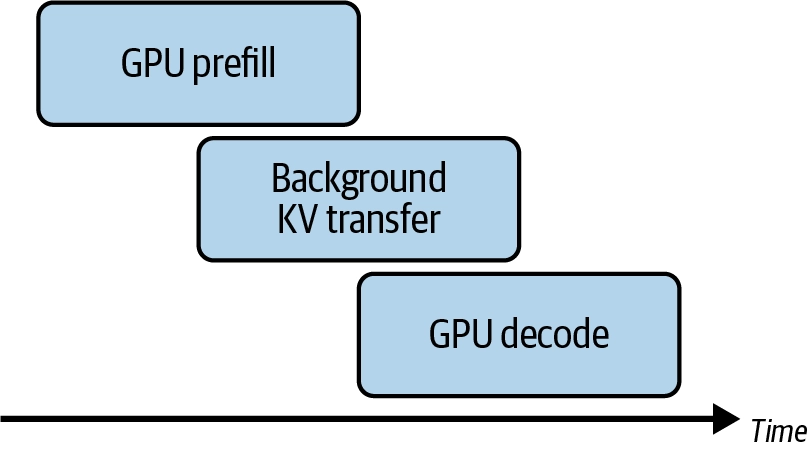

---
### Advanced KV Caching

---
#### 개요

왜 고급 KV 캐싱이 필요한가? -> 긴 컨텍스트 처리 수요가 계속 늘어나고 있다.

- 코딩 코파일럿 (ex: codex, claude code)
	- 수천 줄의 소스 코드를 컨텍스트로 유지해야 정확한 코드 수정 제안 가능
- 대화형 에이전트
	- 긴 대화 이력 + 고객사별 지식 베이스를 동시에 유지해야 일관된 답변 가능
- 엔터프라이즈 플랫폼
	- 대규모 문서/거래 이력을 다뤄야 추출, 이상 탐지, 개인화가 가능

> 이러한 긴 컨텍스트 요구사항은 <span class="t-red">결국 KV 캐시의 크기와 재사용 문제로 귀결</span>
> 
> 이에, <span class="t-red">더 정교한 KV 캐시 관리 기법이 필요</span>해진다.

---
#### RAG와 CAG

|항목|RAG|CAG|
|---|---|---|
|방식|쿼리 시점마다 관련 문서를 검색해서 프롬프트에 주입|관련 컨텍스트 대부분/전체를 KV 캐시로 미리 캐싱해 재사용|
|장점|컨텍스트 길이와 TTFT를 관리 가능한 수준으로 유지, 최신 정보 반영 용이|실시간 검색이 필요 없어 중복 연산 감소 → RAG보다 빠른 TTFT|
|구현|-|프리픽스 캐싱(정적 지식=프리픽스, 동적 프롬프트=접미사)이 CAG의 기초적 형태|


**CAG가 최근 힘을 받는 2가지 이유**

1. **긴 컨텍스트 모델의 발전**
	- 컨텍스트 윈도우가 100k~1M 토큰까지 확장되면서, 매번 검색할 필요 없이 테넌트의 전체 지식을 한 번에 모델에 로드하는 것이 가능해짐. 
	- 동시에 모델 성능 향상으로 "lost in the middle"(컨텍스트 중간 정보를 놓치는) 문제도 완화되는 중.
2. **KV 캐시 관리 엔지니어링의 발전**
	- GPU 메모리는 여전히 부족하지만, CPU 메모리/SSD/원격 스토리지로의 오프로딩 + 복제본 간(cross-replica) 라우팅 기술 덕분에, 대량의 지식을 KV 캐시로 캐싱해두고 필요할 때 꺼내 쓰는 것이 실용적으로 가능해짐

> 긴 컨텍스트 기반 CAG 서빙은 검색 파이프라인의 복잡성을 줄이고, 더 매끄러운 추론과 더 나은 응답 품질, 그리고 RAG보다 빠른 TTFT를 제공할 수 있는 실질적 대안으로 떠오르고 있다.


**CAG가 빠르지만 항상 더 저렴한 것은 아님**

| 항목                    | RAG                           | Long-context CAG 캐싱된 토큰      |
| --------------------- | ----------------------------- | ---------------------------- |
| 캐싱된 토큰                | 500 (시스템 프롬프트)                | 100,500 (시스템 프롬프트 + 전체 컨텍스트) |
| 캐싱 안 된(일반 prefill) 토큰 | 5,500 (10개 청크×500 + 사용자 프롬프트) | 500 (사용자 프롬프트만)              |
| TTFT                  | 5초 (기준)                       | ~0.5초 (10배 개선)               |
| 요청당 비용                | $0.007                        | $0.013 (약 2배 비쌈)             |

- 위 계산은 GPT-5 모델 기준
- 캐싱된 토큰도 완전히 공짜가 아니라 일반 입력의 10~25% 가격이 매겨짐
- CAG는 캐싱된 토큰량 자체가 압도적으로 많음(100,500 vs 500)이므로, 할인된 단가에도 불구하고 총량이 너무 커서 오히려 RAG보다 비싸짐
- RAG의 숨겨진 비용(오프라인 인덱싱, 벡터 스토리지, 온라인 검색)을 더해도, 이들은 보통 LLM 호출 비용보다 훨씬 저렴하므로 이 시나리오에서는 RAG가 여전히 더 저렴
- TTFT/응답속도가 최우선이고 비용 여유가 있다면 → long-context CAG
- 비용 효율이 중요하고 약간의 지연시간은 감수 가능하다면 → RAG가 여전히 유리할 수 있음
- 실제 선택은 컨텍스트 크기, 캐시 재사용 빈도(동일 캐시를 얼마나 많은 요청이 재사용하는가), 벤더별 캐싱 요금제를 모두 고려해 케이스별로 계산해봐야 함

---
#### Self-Hosting LLMs

> 앞서 설명한 모든 비용 계산은 서드파티 API를 사용한다는 가정하에 이루어졌다.
> 
> 이제 자체 호스팅 모델을 최적화해서 롱 컨텍스트 CAG가 더 빠르고 저렴하게 작동하도록 하는 방법을 살펴본다. 
> 
> LMCache라는 구체적인 프레임워크를 중심으로 3가지 핵심 기법을 소개한다.

**KV 캐시 오프로딩 (KV Cache Offloading)**

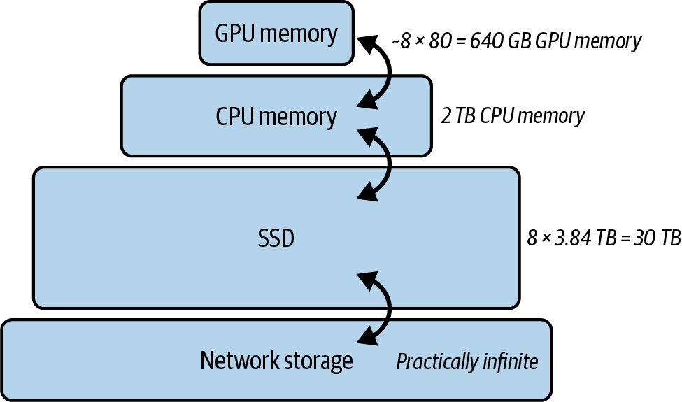

- **KV 캐시**를 GPU 메모리에만 두지 않고 **GPU → CPU 메모리 → SSD → 네트워크 스토리지(Redis/S3)로 계층화**
- CPU 메모리 활용 시 KV 캐시 공간 약 3배, SSD까지 활용 시 최대 50배 확장 가능
- 비용 임팩트: 기존 프리픽스 캐싱만으로는 인스턴스 하나에 장문 컨텍스트 캐시 1개만 담겨서, 여러 테넌트를 처리하려면 모델 복제본을 여러 개 띄워야 했음. 오프로딩을 쓰면 인스턴스 하나가 4개 캐시를 담아 **GPU↔CPU 스와핑으로 처리 가능 → 4배 비용 절감(연간 수백만 달러 규모)**


**KV 캐시 압축 (KV Cache compression)**
- 전통적 **양자화** 또는 **LMCache의 CacheGen**(분포 기반 비트스트림 인코딩)으로 **KV 캐시 크기 축소**
- 효과: 전송 속도↑, 네트워크 지연↓, 압축해제 오버헤드는 미미 → 오프로딩과 결합 시 GPU 메모리 여유 확보 → 배치 크기↑, 처리량↑


**KV 캐시 블렌딩 (KV Cache Blending)**

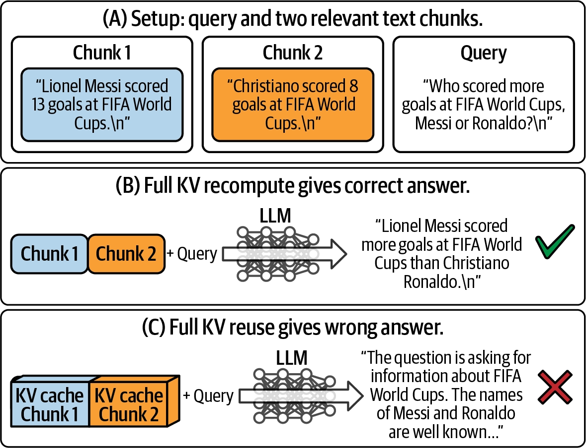

- RAG는 여전히 (a) 더 큰 지식 베이스 접근, (b) 최신 정보 반영, (c) 인용 추적 용이성 면에서 강점을 가짐 → **CAG가 RAG를 완전히 대체하는 건 아님**
- **문제**: RAG 청크들은 순서/조합이 매번 달라 **프리픽스 매칭 실패** → KV 캐시 미스 → 전체 재계산 발생
- 단순한 해결책(KV 캐시를 그냥 이어붙이기)은 실패 : self-attention이 캐시들 간의 교차 토큰 상호작용까지 학습하기 때문에, 단순 concat은 이 관계를 깨뜨려 품질이 나빠짐
- **CacheBlend의 해결책**: 전체를 재계산하는 대신, **교차 토큰 관계 보존에 필요한 일부**(기본 15%)만 **선택적으로 재계산** → 전체 재계산 비용은 피하면서 품질 저하는 최소화

> **CacheBlend = “따로 만든 KV Cache들을 그냥 붙이지 말고, 문서 간 관계 때문에 값이 틀어지는 중요한 토큰들만 다시 계산해서 꿰매자.”**


> [!info] 실습
> - https://github.com/orca3/llm-model-inference/blob/main/ch07/LMCache.ipynb

---
## CH8. LLM Serving Frameworks

---
### 왜 LLM 특화 프레임워크를 사용해야하는가?

범용 서빙 프레임워크(TensorFlow Serving, TorchServe, Triton)는 이미지/정형 데이터용으로 설계되어 LLM에는 부적합하며, 이 때문에 전문 LLM 서빙 프레임워크가 필요하다.

**LLM Serving의 5가지 과제**

1. 자기회귀적 생성
	- LLMs은 토큰 단위로 출력을 생성합니다. 이미지 모델과 달리 추론 세션은 몇 초에서 몇 분 동안 열려 있을 수 있다.
2. 컨텍스트 길이 폭증
	- 모델은 몇 개의 토큰에서 수십만 개, 심지어 백만 개에 이르는 다양한 크기의 입력 prompts를 처리해야 한다.
3. 지속적인 Batch
	- 요청마다 입력 및 출력 길이가 크게 다르다. 정적 배칭 전략은 GPU를 충분히 활용하지 못한다.
4. 스트리밍 요구 사항
	- 사용자는 수백 밀리초 이내의 첫 토큰 출력 시간(TTFT)와 지속적인 토큰 스트리밍을 기대한다.
5. 리소스 활용도
	- GPU는 고가이다. 파편화나 유휴 토큰으로 인해 GPU FLOPS를 낭비하는 것은 대규모 환경에서는 용납될 수 없다.

> vLLM, TensorRT-LLM, SGLang 등은 페이지 단위 KV 캐싱, 연속 배칭, LLM 전용 양자화, 추측 디코딩 등의 혁신으로 이 문제들을 해결한다.

---
### vLLM

----
#### 개요

**vLLM의 핵심 가치**
- 긴 프롬프트·높은 메모리 요구·다중 사용자 동시 서빙이라는 **LLM 서빙의 근본적 어려움을 해결**하며 오픈소스/엔터프라이즈 양쪽에서 빠르게 확산

**핵심 기술**
- 페이지 단위 KV 캐싱 + 연속 배칭 → 처리량 향상, 지연 시간 감소 (프레임워크의 근본 혁신)
- **부가 기능**: 양자화, 추측 디코딩, 스트리밍, 멀티 GPU/분산 실행

**적합한 사용 사례**
- 챗봇/RAG, 배치 텍스트 생성, 멀티 테넌트 서빙, 실시간 애플리케이션

**인기 요인** 
1. 실전 검증됨
2. 오픈소스/자체 파인튜닝 모델과 쉬운 통합
3. 깊은 튜닝 없이도 GPU 효율 극대화
4. 기본 설정만으로 예측 가능한 성능

**아키텍처적 강점**
- 깔끔하고 확장 가능한 설계 → **최신 연구 성과를 빠르게 흡수** + 활발한 커뮤니티 → 미래 지속 가능성

---
#### 아키텍처

**vLLM의 두 가지 사용 방식**

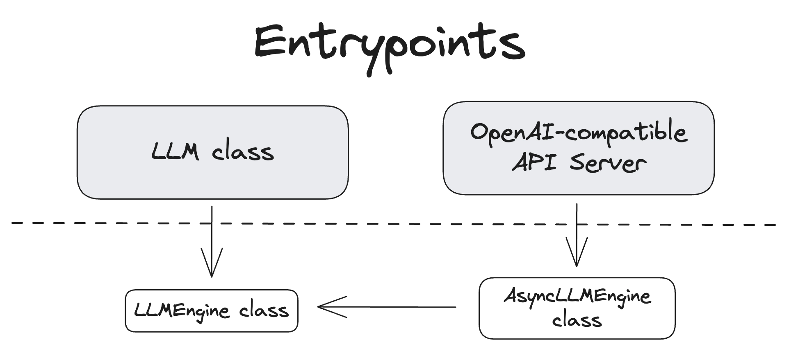

```python
from vllm import LLM, SamplingParams

llm = LLM(model="Qwen/Qwen3-8B")

outputs = llm.generate(
    ["Kafka와 RabbitMQ 차이를 설명해줘"],
    SamplingParams(max_tokens=200)
)
```

- **LLM Class**
	- **오프라인 추론을 위한** 순수 Python 로컬 인터페이스
	- 별도의 서버나 웹 API가 필요하지 않는다. 
	- 이 "**라이브러리 모드**"는 vLLM을 기존 서비스나 배치 워크플로에 직접 연결하고자 할 때 이상적

```bash
vllm serve Qwen/Qwen3-8B \
  --host 0.0.0.0 \
  --port 8000
```

```
POST http://vllm-service:8000/v1/chat/completions
```

- **API Server**
	- GPU가 붙은 서버/Pod 안에서 vLLM 프로세스를 계속 띄워두고, HTTP API로 추론 요청을 받는 방식
	- OpenAI 호환 HTTP 엔드포인트, 프로덕션/멀티클라이언트/스트리밍용


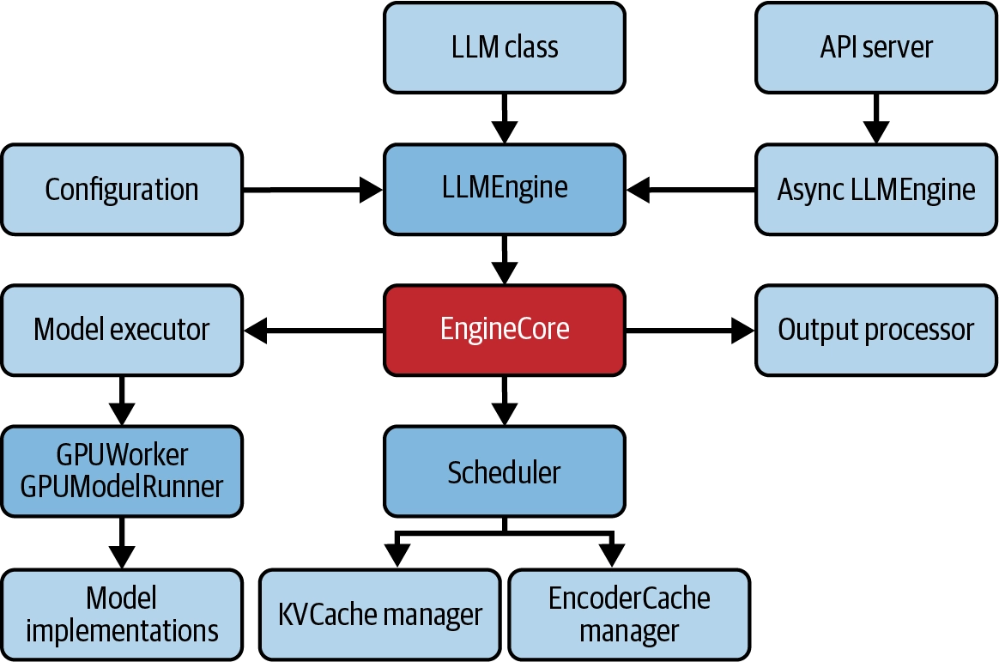

- **LLMEngine**
	- `LLMEngine`은 vLLM 추론 시스템의 상위 수준 인터페이스이자 주 진입점이다.
	- 사용자가 상호작용하는 공개 API 역할을 하는 동시에, 내부적으로는 하위의 모든 컴포넌트를 조율한다. (Kubernetes에서의 kube-apiserver와 비슷)
	- `LLMEngine`은 모든 컴포넌트를 명확한 데이터 흐름을 가진 하나의 응집력 있는 시스템으로 통합한다. 
	- 동기 및 비동기 서빙 시나리오를 모두 처리하며, 요청 처리 파이프라인의 오케스트레이션, 요청 큐 및 설정 관리 등 전체 요청 생명주기를 관리한다.
		- 요청을 큐에 넣고
		- 어떤 요청부터 처리할지 정하고
		- 필요한 모델/GPU/KV Cache 자원을 배정하고
		- 실제 모델 추론을 실행시키고
		- 생성된 토큰을 다시 사용자에게 전달하는

- **EngineCore**
	- `EngineCore` 는 vLLM 추론 엔진의 중앙 오케스트레이터이다.
	- 모델 익스큐터, 출력 프로세서, 스케줄러를 통합하며, 모든 주요 컴포넌트를 조율하고 전체 요청 처리 파이프라인을 관리하는 "**내부 루프**(inner loop)" 역할을 한다.

- **Scheduler**
	- `Scheduler`는 vLLM 내부에서 **현재 대기 중인 여러 요청 중 어떤 요청을 이번 iteration에 얼마나 처리할지 결정하는 컴포넌트**이다.
	- 쉽게 말하면 **GPU 추론 작업의 교통 관제사** 역할을 한다.
	- 제한된 GPU 연산량과 KV Cache 메모리를 여러 요청에 효율적으로 배분하면서 **처리량(throughput)을 높이고 요청 간 공정성을 유지**하는 것이 핵심 역할이다.
	- 주요 역할은 다음과 같다.
	    - 현재 대기 중인 요청들의 상태 확인
	    - 이번 iteration에서 실행할 요청 선택
	    - 각 요청별로 처리할 토큰 수 결정
	    - KV Cache 블록 할당 및 관리
	    - 여러 요청을 하나의 실행 단위로 묶어 배치 구성
	    - Prefix Caching, Chunked Prefill, Token-level Scheduling 같은 모델 비종속 최적화 적용
	- 스케줄링 결과는 `SchedulerOutput`이라는 형태로 만들어 `ModelExecutor`에 전달한다.
	- `SchedulerOutput`은 쉽게 말하면 다음과 같은 **GPU 실행 작업 지시서**이다.
		- "이번 iteration에서는 A 요청 3토큰, B 요청 1토큰, C 요청 4토큰을 처리해라. 각 요청은 이 KV Cache 블록을 사용하며, 필요한 입력과 메타데이터는 이것이다."

- **ModelExecutor, (GPU) Worker, ModelRunner**
	- vLLM은 **각 모델을 별도의 프로세스 또는 프로세스 그룹에서 호스팅하고 실행**하기 때문에, 프로세스 간 통신을 처리하고, 분산 워커 그룹을 조율하며, 다양한 모델 순전파 실행 세부사항을 처리하기 위해 계층화된 아키텍처를 사용한다. 
	- 이 아키텍처는 세 가지 컴포넌트로 구성된다.
		- **ModelExecutor** : 여러 워커 프로세스를 조율하고 관리
		- **GPUWorker** : 각 워커 프로세스에서 실행되며 디바이스/모델 생명주기를 관리하는 워커 인터페이스 역할
		- **GPUModelRunner** : 실제로 신경망을 실행

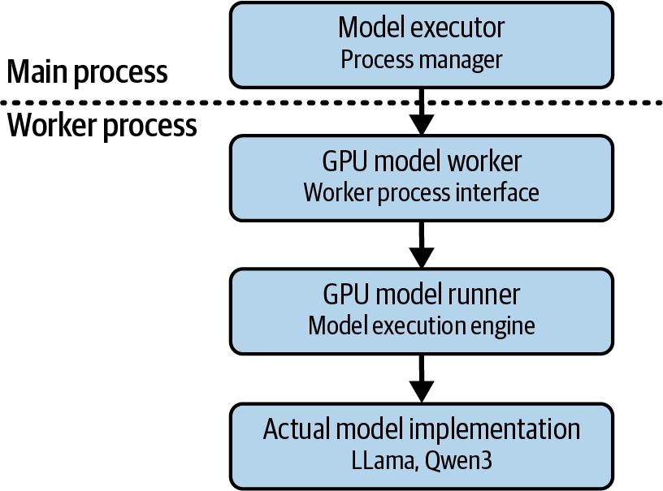

> 위처럼 메인프로세스와 워커프로세스를 나누는 관심사의 분리(separation of concerns)를 통해 각 컴포넌트는 컴포넌트 간의 깔끔한 인터페이스를 유지하면서 자신의 특정 모델 실행 책임에 집중할 수 있다.

---
#### 모델 초기화 워크플로우 (멀티 프로세스 워커 포함)

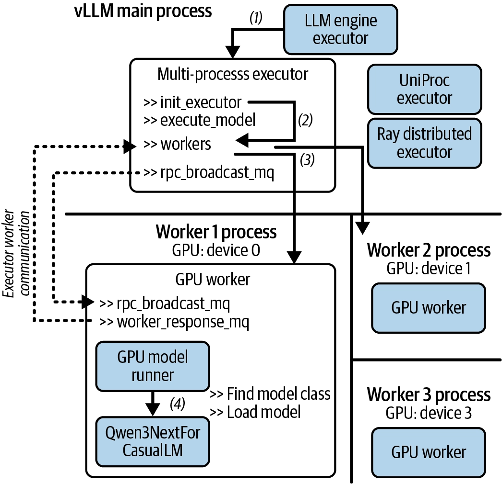


```python
lm = LLM(
  model="Qwen/Qwen2.5-7B-Instruct",
  # specify 4 workers
  tensor_parallel_size=4,
  # use multi-process model executor
  distributed_executor_backend="mp"
)
```

1. 메인 프로세스 초기화
	- `LLM()` 생성 → `LLMEngine`, `Scheduler`, `KVCacheManager`, `MultiProcessExecutor` 등 주요 컴포넌트를 메인 프로세스에서 기동

2. 워커 프로세스 그룹 생성
	- `MultiProcessExecutor` → N개 워커 프로세스 spawn + `rpc_broadcast_mq` (메인 → 워커 명령/신호 전달용 큐 - 프로세스간 통신 위함) 설정

3. 워커 프로세스 초기화
	- 각 워커 → `GPUWorker` 실행 → CUDA 디바이스 설정, 프로세스 간 통신 수립, 모델 로드 + `worker_response_mq` (워커 → `ModelExecutor` 결과 반환용 큐) 유지

4. 모델 준비 및 로드
	- `GPUModelRunner` → 모델 레지스트리에서 구현체 조회 (예: Qwen → `Qwen3NextForCausalLM`) →`__init__` 호출 → 가중치를 GPU에 로드

---
#### 생성 요청 실행 워크플로우

> 이전 모델 초기화 워크플로우가 완료되면 서빙할 준비가 된 것이다.
> 
> 이제, 생성 요청 실행 워크플로우를 알아보자.

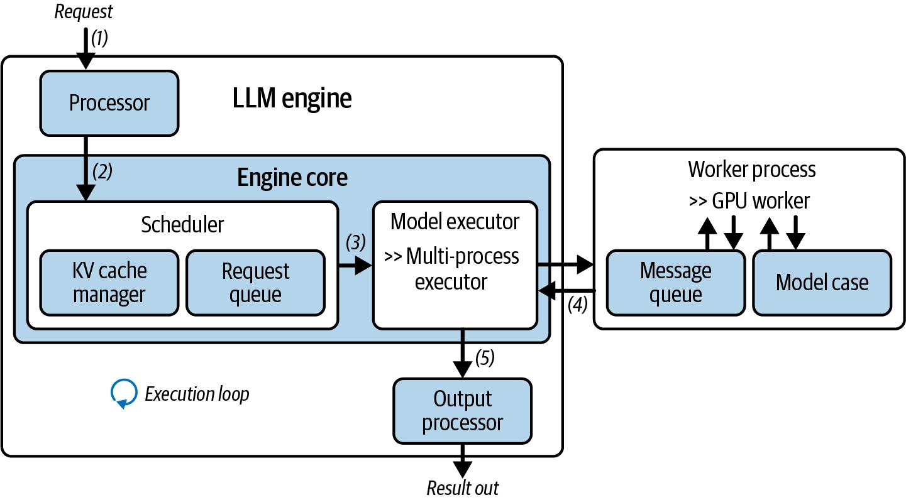

|단계|담당 컴포넌트|역할|
|---|---|---|
|1|Processor|입력 검증·토큰화 → Request 객체 생성|
|2|LLMEngine → EngineCore → Scheduler|다음 배치 결정, PagedAttention·Continuous Batching 등 최적화 적용|
|3|MultiProcessExecutor → GPU Worker|실제 모델 forward pass 실행|
|4|Output Processor|모델 출력 → 최종 응답 변환|

1. **입력 요청 전처리**
    - `Processor` → 사용자 프롬프트 검증 및 토큰화 → 추론 옵션과 함께 내부 `Request` 객체로 변환

2. **요청 스케줄링**
    - `LLMEngine` → `EngineCore` 반복 호출
    - `EngineCore` → `Scheduler` 호출 → 이번 iteration에서 처리할 요청과 토큰 수 결정
    - Continuous Batching, KV Cache 관리, Prefix Caching, Chunked Prefill 등의 최적화 적용 → `SchedulerOutput` 생성

3. **GPU 모델 실행**
    - `EngineCore` → `SchedulerOutput`을 `MultiProcessExecutor`에 전달
    - `MultiProcessExecutor` → 워커 프로세스에 작업 전달
    - `GPUWorker` → `GPUModelRunner`를 통해 실제 모델 Forward Pass 수행 → 다음 토큰 계산

4. **결과 처리 및 반복**
    - 모델 결과 → `EngineCore`로 반환 → `Output Processor`가 디코딩 및 완료 여부 처리
    - 미완료 요청은 다시 `Scheduler`로 보내 다음 iteration 수행
    - 완료된 요청은 `LLMEngine`을 통해 최종 응답으로 반환

---
#### Scheduler Deep Dive

**vLLM Scheduler**는 "교통 관제탑" 역할을 하며, **5가지 핵심 책임**을 가진다.

1. **자원 오케스트레이션**
	- WAITING/RUNNING 큐 관리, GPU 메모리·KV 캐시·토큰 예산 기반 동적 결정
2. **토큰 단위 스케줄링**
	- prefill/decode를 분리하지 않고 요청이 아닌 토큰 단위로 스케줄링 → 더 세밀한 제어
	- <span class="t-red">Scheduler는 이 토큰이 prefill인지 decode인지보다, 각 요청에서 “아직 계산되지 않은 토큰이 몇 개인가”를 본다.</span>
3. **최적화 통합 허브**
	- 프리픽스 캐싱, 추측 디코딩, 청크드 프리필, 분산 KV 캐시 전송을 상황에 맞게 적용
4. **동적 부하 분산**
	- 도착/완료/선점 등 이벤트에 실시간 대응, 지연시간-처리량 균형
5. **생명주기 관리**
	- FCFS/우선순위 정책, 자원 부족 시 선점(preemption)

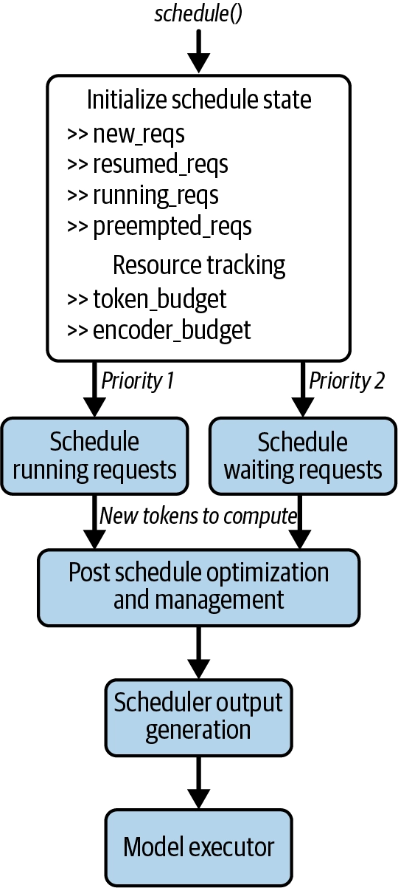

1. **초기화**
	- 신규/재개/실행중/선점된 요청 수집, 가용 토큰·인코더 예산 갱신
2. **RUNNING 요청 우선 처리**
	- 이미 KV 캐시를 점유 중이므로 먼저 처리 → 이 과정에서 청크드 프리필, 프리픽스 캐싱, 추측 디코딩 적용, 필요 시 선점
3. **WAITING 요청 처**리
	- 남은 예산 내에서 활성화, 동일한 최적화 혜택
4. **후처리**
	- LoRA 어댑터 추적, 멀티모달 인코더 입력 준비, 추측 토큰 확정
5. **SchedulerOutput 생성**
	- 스케줄링된 요청·토큰 수·KV 캐시 할당 정보를 묶어 모델 실행기(Executor)에 전달

> [!tip] 핵심은 "우선순위 결정"과 "토큰 스케줄링"을 분리했다는 것
> - 우선 순위 결정
> 	- 큐(WAITING/RUNNING) → 요청의 처리 순서를 결정 (FCFS, 우선순위 등)
> - 토큰 스케줄링
> 	- `num_computed_tokens`(이 요청에서 계산 한 토큰 수) 와 `num_tokens_with_spec`(이 요청에서 계산해야하는 전체 토큰 수)의 차이를 계산 → 각 요청이 이번 스텝에 몇 개 토큰을 처리할지 결정
> - <span class="t-red">이 둘을 분리했기 때문에, 다양한 요청 우선순위 정책과 실행 최적화 기법을 서로 독립적으로 조합할 수 있는 유연한 구조가 만들어진다.</span>

---
#### vLLM의 계층적 최적화 전략

> vLLM의 핵심 설계 철학은 "**최적화는 그것이 속한 올바른 계층에서 이루어져야 한다**"는 것이다.

LLM 아키텍처와 하드웨어가 매우 빠르게 변화하기 때문에, 특정 모델·하드웨어에 최적화를 하드코딩하면 시스템이 금방 낡아버린다.

이를 해결하기 위해 **vLLM은 최적화 책임을 4개 계층으로 분리**한다.

1. `Scheduler`
	- 범위(시스템 전반의, 모델 무관 최적화) → 배칭, 캐싱, 공정성·처리량 관리
    - `Scheduler`는 **시스템 레벨에서의 공정성, 효율성, 확장성을 책임**진다.

2. `ModelExecutor`
	- 범위(**모델 아키텍처별** 최적화) → Transformer용 융합 어텐션 커널, 멀티모달 인코더 특수 연산자
    - `Scheduler`는 모델에 무관하게 유지되는 반면, `ModelExecutor`는 각 모델 아키텍처의 세부사항을 이해한다.
    - 예를 들어, Transformer 기반 모델에는 융합된(fused) 어텐션 커널을, 멀티모달 인코더에는 특수 연산자를 적용한다.
    - 이 레벨은 **아키텍처를 인지하는 최적화를 분리**하여, 시스템 레벨 스케줄링과 독립적으로 진화할 수 있게 합니다.

3. **모델 레이어**
	- 범위(**컴포넌트별** 최적화) → KV 캐시 재사용, 플래시 어텐션, 레이어 단위 연산자 융합
    - 모델 아키텍처의 레이어 수준(예: 어텐션 레이어, 피드포워드 블록)에서는 최적화가 연산 병목에 맞춰 조정된다.
    - KV 캐시 재사용, 플래시 어텐션, 레이어 단위 연산자 융합 같은 기법들이 여기서 일어난다.
    - 이 설계는 특정 하위 컴포넌트를 대상으로 하는 최적화가 시스템 전반의 스케줄링 로직으로 새어 나가지 않도록 보장한다.

4. `CustomOp`
	- 범위(**하드웨어별** 최적화) → CUDA 커널, 텐서 코어 가속, 양자화 연산자
    - 마지막으로, `CustomOp`는 CUDA 커널, 텐서 코어 가속, 양자화된 연산자 같은 기저 하드웨어에 대한 최적화를 담당한다.
    - 이를 별도로 분리함으로써, vLLM은 상위 레벨의 스케줄링이나 모델 로직을 바꾸지 않고도 새로운 GPU 기능과 가속기를 활용할 수 있다.

> [!tip] 설계 의도
> - **위로 갈수록(Scheduler) 범용적이고 모델에 무관하며, 아래로 갈수록(CustomOp) 특정 하드웨어에 특화됨**
> - 각 계층이 자신의 관심사만 처리하므로, **한 계층의 변경이 다른 계층에 영향을 주지 않음** (예: 새 GPU가 나와도 Scheduler·모델 로직은 그대로 두고 CustomOp만 확장)
> - 결과적으로 **vLLM은 새로운 모델 아키텍처나 하드웨어가 등장해도 전체 시스템을 재설계할 필요 없이**, 해당 최적화를 알맞은 계층에 "끼워 넣기"만 하면 되는 **미래 대비적(futureproof) 구조**를 갖게 됨

---
### TensorRT-LLM

---
#### 개요

> `TensorRT-LLM`은 NVIDIA가 만든 **자사 GPU 전용 고성능 LLM 추론 라이브러리**

- **핵심 방식**
	- 모델 체크포인트 → 고도로 튜닝된 TensorRT 엔진으로 컴파일
- **런타임**
	- Python/C++ 런타임 제공
- **주요 기능**
	- in-flight batching(연속 배칭)
	- 페이지드 KV 캐시
	- 추측 디코딩
	- 다중 정밀도 양자화(FP8/FP4/INT4/INT8)
	- 텐서/파이프라인 병렬화
- **생태계 통합**
	- `NVIDIA Dynamo`, `Triton`과 긴밀히 연동
- **API 사용성**
	- vLLM과 거의 동일한 고수준 LLM(`model=...`) / `generate()` 인터페이스 제공 → 사용 편의성 확보

---
#### 간단한 예시

```bash
llm = LLM(model="Qwen/Qwen3-7B")

# 샘플 프롬프트.
prompts = [
   "Hello, my name is",
   "The capital of France is",
   "The future of AI is",
]

# 샘플링 파라미터 생성.
sampling_params = SamplingParams(temperature=0.8, top_p=0.95)

# 모델 생성 요청 실행
for output in llm.generate(prompts, sampling_params):
   print(
       f"Prompt: {output.prompt!r}, Generated text: {output.outputs[0].text!r}"
   )
```

---
#### 포지셔닝 및 적합한 사용처

**핵심 포지셔닝**
- TensorRT-LLM의 목표는 범용성이 아니라 **NVIDIA 하드웨어에서 낼 수 있는 최대 실전 성능**을 뽑아내는 것이다.
- 즉, vLLM이 "모델·하드웨어에 무관한 유연성"을 추구하는 것과 대조적으로, TensorRT-LLM은 "**NVIDIA GPU의 Tensor Core·CUDA 커널을 극한까지 활용**하는 것"에 초점을 맞춘다.

**적합한 사용처**
- 이미 **NVIDIA 하드웨어와 서빙 스택(Triton, Dynamo 등)으로 표준화**되어 있고, **프로덕션에서 최고 수준의 처리량·효율성이 필요**한 조직에 가장 적합하다.
- 앞서 다룬 vLLM이 다양한 하드웨어·모델에 걸친 범용 프레임워크를 지향한다면, TensorRT-LLM은 **NVIDIA 생태계 안에서의 "끝판왕 성능**"을 지향한다고 이해하면 된다.

---
### SGLang

---
#### 개요

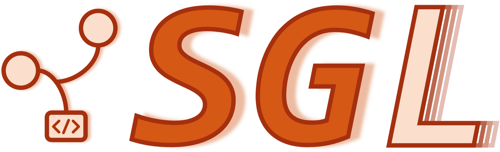

> SGLang은 structured generation(ex: JSON 포맷)과 에이전트 애플리케이션을 타깃으로 하는 비교적 새로운 프레임워크이다.
> 
> 빠른 백엔드 런타임(커널, 캐싱, 스케줄링)을 유연한 프론트엔드 언어 및 API(OpenAI 호환 및 네이티브)와 함께 공동 설계하여, 생성을 더 빠르고 더 제어 가능하게 만든다.
> 
> SGLang은 LLM과 비전-언어 모델(VLM)을 위한 오픈소스 고성능 서빙 프레임워크이다.
> 
> vLLM의 직접적인 동급 경쟁 프레임워크

- **설계 철학**
	- 빠른 백엔드 런타임 + 유연한 프론트엔드 언어/API를 공동 설계
- **핵심 기능**
	- RadixAttention(프리픽스/KV 재사용)
	- 연속 배칭
	- 페이지드 KV
	- 추측 디코딩(EAGLE-2/3)
	- 청크드 프리필
	- 구조화된 출력
	- 멀티-LoRA
	- 다양한 병렬화(텐서/파이프라인/전문가/데이터)
- **하드웨어 지원**
	- NVIDIA뿐 아니라 AMD Instinct, CPU, TPU, Jetson Orin, Ascend까지 vs TensorRT-LLM보다 훨씬 폭넓음
- **API 사용성**
	- vLLM·TensorRT-LLM과 유사한 고수준 `Engine/generate()` 인터페이스

---
#### 간단한 예시

```bash
# Qwen3 모델 로드
llm = sgl.Engine(model_path="Qwen/Qwen3-7B")

prompts = [
    "Hello, my name is",
    "The president of the United States is",
    "The capital of France is",
    "The future of AI is",
]
sampling_params = {"temperature": 0.8, "top_p": 0.95}

# 모델 생성 요청 실행
outputs = llm.generate(prompts, sampling_params)
for prompt, output in zip(prompts, outputs):
    print("===============================")
    print(f"Prompt: {prompt}\nGenerated text: {output['text']}")
```

---
#### 다른 프레임워크 비교 및 차별점

**비교**
- **TensorRT-LLM**
	- NVIDIA GPU 전용, 최대 실전 성능에 특화
- **vLLM**
	- 모델·하드웨어 무관, 가장 큰 오픈소스 생태계·커뮤니티
- **SGLang**
	- 멀티 벤더 하드웨어 지원 + RadixAttention 기반 프리픽스 재사용 강점, 구조화된 출력·에이전트 워크플로우에 특화되어 vLLM의 대안이자 경쟁자로 부상 중

**핵심 차별점**
- RadixAttention은 여러 호출에 걸친 KV 캐시 재사용을 트리(radix tree) 구조로 관리하여, 특히 반복적인 프리픽스가 많은 에이전트/멀티턴 시나리오에서 강점을 보인다.
- 성능은 vLLM과 경쟁력 있는 수준이지만, vLLM이 아직 더 넓은 커뮤니티·생태계를 갖고 있다는 것이 현재 시점(2026년)의 주요 차이로 언급된다.

---
### Llama.cpp

---
#### 개요

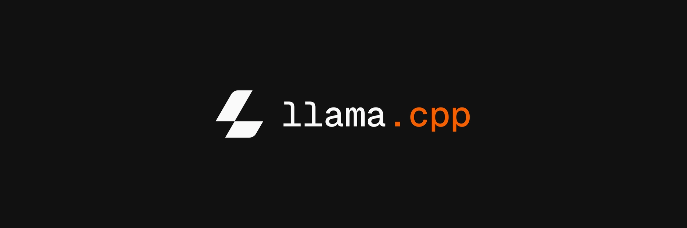

> `llama.cpp`는 로컬·엣지·온프레미스 환경에서 LLM을 가볍게 실행하는 데 초점을 둔 오픈소스 C/C++ 추론 프레임워크이다.
> 
> 노트북과 워크스테이션부터 서버, 엣지 디바이스까지 다양한 하드웨어에서 동작하며, **최고 처리량보다는 이식성·단순성·비용 효율성**을 우선한다.  
> 
> 모델은 주로 **GGUF 포맷**을 사용하며, CLI뿐 아니라 **OpenAI 호환 HTTP 서버** 형태로도 실행할 수 있다.  
> `vLLM`·`TensorRT-LLM`·`SGLang`이 데이터센터 GPU 기반의 고처리량 서빙에 집중한다면, `llama.cpp`는 **“어디서든 최소한의 구성으로 LLM을 실행하는 것”** 에 강점이 있다.

- **설계 철학**
    - 최소한의 의존성과 가벼운 런타임
    - 다양한 하드웨어에서의 높은 이식성
    - 절대적인 최고 처리량보다 단순성·비용 효율성 우선
- **핵심 기능**
    - GGUF 모델 포맷
    - 8/6/5/4비트 등 다양한 정수 양자화
    - CPU SIMD 최적화
    - CPU/GPU 혼합 추론 및 GPU Offloading
    - CLI 기반 로컬 추론 및 벤치마킹
    - OpenAI 호환 HTTP 서버
- **하드웨어 지원**
    - CPU를 기본 타깃으로 폭넓게 지원
    - NVIDIA CUDA
    - AMD ROCm
    - Apple Metal
    - Vulkan 등 다양한 가속 백엔드 지원
    - vLLM·TensorRT-LLM보다 저사양·로컬·엣지 환경에 적합
- **적합한 사용처**
    - 개인 PC 및 로컬 개발 환경
    - 프라이버시가 중요한 온디바이스 추론
    - 엣지 디바이스
    - GPU가 없거나 제한적인 환경
    - 비용을 최소화해야 하는 소규모 LLM 서빙

---
#### 간단한 예시

Qwen3 모델을 CPU 디바이스에서 실행하는 간단한 예시

 ```bash
 from llama_cpp import Llama

# llama.cpp로 CPU에서 Qwen3 모델 실행
# Hugging Face에서 Qwen 모델(GGUF 포맷)을 로드
llm = Llama.from_pretrained(
   repo_id="Qwen/Qwen3-8B-GGUF",
   filename="*Q8_0.gguf",
   verbose=False
)

# 고수준 API로 LLM 생성 실행
output = llm(
     "Q: Name the planets in the solar system? A: ", # 프롬프트
     max_tokens=32, # 최대 32개 토큰 생성
     stop=["Q:", "\n"], # 모델이 새 질문을 생성하기 직전에 멈춤
     echo=True # 출력에 프롬프트를 그대로 포함
)

# 채팅 완성 API 예시
output = llm.create_chat_completion(
    messages=[
        {
            "role": "system",
            "content": "You are an assistant who perfectly describes "
                       "images.",
        },
        {
            "role": "user",
            "content": "Describe this image in detail please.",
        },
    ])
 ```

---
#### Llama.cpp 의 장점

- 모든 LLM 애플리케이션이 고처리량 서빙을 필요로 하는 것은 아니다.
- 추론을 로컬(온디바이스 또는 온프레미스 엣지)에서 실행할 때는 목표가 달라진다.
    - 플릿 전체의 초당 토큰 수가 아니라, 지연 시간과 응답성을 최적화하고 싶어짐
    - 낮은 동시성(흔히 단일 사용자)이므로 대규모 배칭과 복잡한 스케줄러의 가치가 줄어듦
    - 메모리·연산·전력 측면의 풋프린트와 비용이 주요 제약이 됨
    - 프라이버시와 오프라인 신뢰성이 최우선 요구사항이 됨
- Llama.cpp는 이 프로필에 딱 들어맞다.
    - **CPU, Apple Silicon, 소형 GPU에서 오픈 웨이트 모델을 직접 실행**할 수 있고, 드롭인 통합을 위한 **OpenAI 호환 서버를 제공**한다.
    - 그 결과, 토큰당 클라우드 요금이나 데이터 유출 없이, 로컬 개발, 프라이빗·온프레미스 어시스턴트, 엣지 배포를 위한 초저비용·저운영 서빙 옵션이 만들어진다.

> [!info] API 노출
> - `llama.cpp`를 REST API 호출로 노출하고 싶다면, `llama.cpp`(그리고 때로는 `Mistral.cpp`나 `RWKV Runner` 같은 다른 백엔드)를 감싸서 로컬 LLM 사용을 간단하고 일관되며 개발자 친화적으로 만드는 상위 레벨 프레임워크인 `Ollama`를 사용할 수 있다.

---
### 올바른 프레임 워크 선택하기

> 프레임워크 선택은 "벤치마크 1위"가 아니라 "내 SLO·워크로드·운영 현실에 맞는가"를 기준으로 해야 한다.

---
#### 일반적으로 권장하는 평가 접근법 6단계

1. **기능이 아니라 SLO부터 시작**
    - 지연 시간(TTFT, p95/p99), 처리량(TPS/QPS), 토큰당 비용, 품질 제약(구조화된 JSON, 안전성), 가용성에 대한 목표를 고려한다.
2. **사용 사례에서 나오는 실제 프롬프트를 분석**
    - prefill 위주인지 decode 위주인지, 컨텍스트 길이는 어느 정도인지, 도구 호출(tool call)이나 멀티턴 체인이 포함되는지를 명확히 한다.
3. **동일한 조건으로 비교**
    - 경쟁 프레임워크들 사이에서 동일한 모델, dtype/양자화, 최대 시퀀스 길이, 배치/동시성, 스트리밍 설정을 사용해 동일한 조건으로 비교가 되도록 한다.
4. **운영성을 측정**
    - 콜드 스타트 시간, 관측 가능성(observability), 오토스케일링 동작, 멀티테넌시 공정성, 업그레이드 마찰, 장애 모드 같은 지표를 활용한다.
5. **하드웨어와 벤더 종속(lock-in)을 고려하라.**
    - 여러 벤더(예: NVIDIA/AMD/CPU/TPU/엣지)를 사용한다면, 이식성이 크게 중요해진다.
6. **변화를 계획**
    - 모델 교체와 새로운 디코딩 기법은 **매주 일어나므로, 큰 수술 없이 업데이트할 수 있는 프레임워크를 선택**해라.

---
#### 최종 프레임워크 선택 가이드

|상황|추천 프레임워크|이유|
|---|---|---|
|빠른 프로덕션 배포, 폭넓은 모델 지원, 파이썬 워크플로우|vLLM|강력한 기본 성능 + 가장 큰 생태계|
|에이전틱/다단계 워크플로우, 구조화된 출력(JSON/정규식), 멀티 벤더|SGLang|프리픽스/KV 재사용, 추측 디코딩, 스케일아웃 라우터|
|NVIDIA 스택 올인, 달러당 최고 처리량|TensorRT-LLM|Triton/Dynamo 통합, 깊은 CUDA 최적화|
|로컬/온프레미스/엣지, 저비용, 프라이버시|llama.cpp|GGUF 양자화, 이식 가능한 경량 백엔드|

> [!info] 핵심
> - 프레임워크 선택은 일회성 결정이 아니라 지속적인 재평가 과정이어야 한다.
> - LLM 서빙 생태계가 매달 바뀌므로, 서빙 엔지니어는 3~6개월 주기로 프레임워크를 재검토하고, 프레임워크 추상화 레이어와 탈출 계획을 마련해 앱 코드를 다시 쓰지 않고도 프레임워크를 교체할 수 있어야 한다.
> - 가장 중요한 것은 **유연성을 유지하는 것**

---