---
## CH9. LLM Optimization in Practice

---
### 개요

> 최적화는 <span class="t-red">움직이는 표적</span>이다. 환경이 바뀌면 "최선"의 전략도 바뀐다.
>
> 자원은 한정되어 있어서 모든 옵션을 전부 시도해볼 수는 없다. 그래서 필요한 것은 "정답 설정값"이 아니라, 내 상황의 병목이 어디인지 파악하고 적절한 레벨(하드웨어 / 모델 / 스케줄링)에서 기법을 고르는 <span class="t-red">감각과 방법론</span>이다.

이번 챕터는 앞선 CH1~CH8에서 배운 내용을 전부 한 곳에 모아 실습하는 챕터다.

- 모델 : `Qwen/Qwen3-14B` (오픈소스)
- 프레임워크 : vLLM
- 하드웨어 : AWS EC2 `g6e.2xlarge` (NVIDIA L40S 1장), 분산 실험에서는 `g6e.12xlarge`(L40S x4), `p4d.24xlarge`(A100 x8)
- 목표 : 단일 모델 인스턴스의 <span class="t-red">토큰 처리량(Token Throughput) 최대화</span>

> [!info] 왜 하필 처리량(Throughput)이 목표인가?
> - 대부분의 LLM 과금 모델이 "처리한 토큰 수" 기준이다.
> - 즉, <span class="t-red">단위 시간당 더 많은 토큰을 처리한다 = 토큰당 서빙 비용이 내려간다</span>로 직결된다.
> - 실무에서 가장 흔하게 잡는 최적화 목표이기도 하다.

---
#### Throughput vs Latency 트레이드 오프

많은 경우 최적화 기법은 처리량과 지연시간을 <span class="t-red">동시에</span> 개선한다. (중복 연산 제거, 배칭 효율 개선 등)

하지만 특정 트래픽 패턴에서는 이 둘이 본질적으로 <span class="t-red">충돌</span>한다.

- 처리량을 높이는 방법 = 요청을 모아서(배칭/큐잉) 하드웨어를 꽉 채워 쓰는 것 → <span class="t-red">대기 시간이 생김</span> → 요청당 지연시간 증가
- 지연시간을 낮추는 방법 = 요청이 도착하는 즉시 병렬성을 줄여서 처리 → <span class="t-red">자원이 놀게 됨</span> → 전체 처리량 감소

> [!tip] 실무 기본 방침
> - <span class="t-red">지연시간을 허용 범위 안에 묶어둔 채로, 처리량을 최대한 끌어올린다.</span>
> - 즉 "SLO를 깨지 않는 선에서 최대 효율"이 기본값이고, 응답성이 효율보다 중요한 경우(실시간 대화, 에이전트)에만 분산 서빙 등 지연시간 우선 기법을 꺼낸다.

---
### 최적화 실습 8단계 플랜

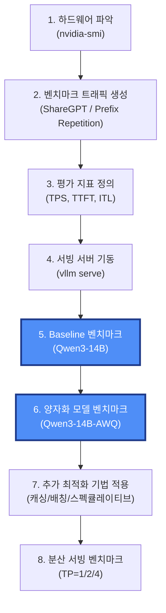

| 단계 | 하는 일 | 얻는 것 |
| --- | --- | --- |
| 1. 하드웨어 파악 | GPU 메모리, 대역폭, 연산 능력, NVLink 유무 확인 | 이후 벤치마크 결과를 <span class="t-red">해석</span>할 근거 |
| 2. 트래픽 생성 | 실제 사용 패턴을 닮은 요청 데이터셋 준비 | 최적화가 겨냥할 <span class="t-red">타겟 워크로드</span> |
| 3. 지표 정의 | TPS / TTFT / ITL 등 비교 기준 확정 | 실험 간 <span class="t-red">일관된 비교</span> |
| 4. 서버 기동 | vLLM으로 모델 로드, VRAM·KV Cache 확인 | 메모리 예산 파악 |
| 5. Baseline | 기본 설정으로 측정 | 개선폭을 잴 <span class="t-red">기준선</span> |
| 6. 양자화 | AWQ 4bit 모델로 재측정 | 메모리 → 처리량 전환 효과 |
| 7. 추가 기법 | 워크로드별 특화 기법 적용 | 마지막 몇 % |
| 8. 분산 서빙 | TP 1/2/4 비교 | 수직 확장의 실제 이득 판단 |

---
### Step 1. 하드웨어(GPU) 파악하기

`nvidia-smi`(NVIDIA System Management Interface)는 NVIDIA GPU를 실시간으로 모니터링·제어하는 CLI 도구다.

- 사용 가능한 GPU, 메모리, 온도 확인
- GPU 사용률(Utilization)과 실행 중인 프로세스 모니터링
- 드라이버와 CUDA 버전 확인
- 성능·자원 병목 진단

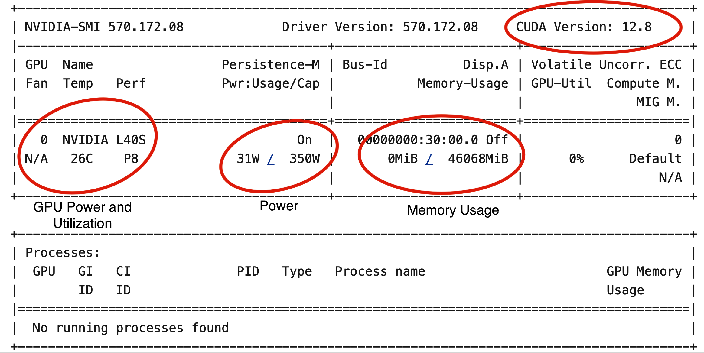

벤치마크나 배포 직전에 <span class="t-red">가장 먼저 실행하는 명령어</span>다. GPU가 제대로 인식되었고, 설정이 맞고, 지금 놀고 있는지를 확인한다.

**꼭 확인해야 하는 4가지**

| 항목 | 왜 보는가 | 해석 |
| --- | --- | --- |
| CUDA / 드라이버 버전 | 서빙 프레임워크와의 호환성 | 안 맞으면 서버가 아예 안 뜨거나 커널이 폴백됨 |
| Performance State | GPU가 지금 일하고 있는지 | `P8` = 유휴, 실제 서빙 중이면 `P0`/`P1` |
| Power / GPU Utilization | 서빙 엔진이 GPU를 얼마나 포화시키는지 | 부하 중인데 사용률이 낮다 → <span class="t-red">배칭·스케줄링 비효율</span><br/>전력은 높은데 처리량이 낮다 → <span class="t-red">메모리 병목 또는 커널 비효율</span> |
| Memory Usage | 현재 할당된 GPU 메모리 | `0MiB / 46068MiB` → 총 46GB, 현재 비어있음 |

필요한 속성만 골라서 볼 수도 있다.

```bash
nvidia-smi --query-gpu=name,compute_cap,memory.free,memory.used,memory.total \
   --format=csv

>> output:
name, compute_cap, memory.free [MiB], memory.used [MiB], memory.total [MiB]
NVIDIA L40S, 8.9, 45469 MiB, 0 MiB, 46068 MiB
```

---
### Step 2. 벤치마크 트래픽 생성

> [!warning] 데이터셋 선정이 최적화의 절반이다
> - 최적화 과정 전체가 <span class="t-red">"특정 유형의 트래픽에 대해" 서빙 설정을 튜닝하는 작업</span>이다.
> - 긴 입력 위주(Prefill-heavy) 워크로드와 긴 출력 위주(Decode-heavy) 워크로드는 <span class="t-red">서로 다른 전략</span>을 선호한다.
> - 따라서 벤치마크 데이터셋이 실제 사용 패턴을 반영하지 못하면, 최적화 결과 자체가 무의미해진다.

이번 실습의 타겟은 챗봇/대화 시나리오다. 입력과 출력 토큰 길이가 비교적 균형 잡혀 있고, 사용자가 반복적이거나 후속 질문을 던진다. 이를 흉내내기 위해 <span class="t-red">두 개의 상호보완적인 데이터셋</span>을 쓴다.

| 데이터셋 | 성격 | 무엇을 측정하나 |
| --- | --- | --- |
| **ShareGPT** | 실제 사용자가 LLM과 나눈 대화 로그 | 자연스럽고 다양한 대화 패턴에서의 <span class="t-red">실사용 서빙 효율과 응답성</span> |
| **Prefix Repetition** | 공통 prefix + 반복/유사 suffix로 합성한 데이터 | 반복 트래픽에서의 <span class="t-red">캐시 활용도(Prefix Cache)와 디코딩 견고성</span> |

> [!info] Prefix Repetition은 왜 합성 데이터인가?
> - 합성이기 때문에 prefix 길이, suffix 길이, 고유 prefix 개수를 <span class="t-red">정밀하게 통제</span>할 수 있다.
> - 고유 prefix 개수를 **줄일수록** 프롬프트 간 반복이 심해지고 → 캐시 재사용 트래픽 패턴이 <span class="t-red">강해진다</span>.
> - 즉 "우리 캐시가 얼마나 잘 먹히는가"를 다이얼 돌리듯 조절하며 볼 수 있다.

---
#### 데이터셋 들여다보기

책의 헬퍼 스크립트 `inspect_dataset.py`로 데이터셋 통계와 샘플을 확인할 수 있다.

```bash
# ShareGPT 데이터셋에서 100개 레코드 샘플링
!python3 inspect_dataset.py \
   --dataset-name sharegpt \
   --dataset-path ShareGPT_V3_unfiltered_cleaned_split.json \
   --model Qwen/Qwen3-14B \
   --num-prompts 100 \
   --save-samples
```

출력은 프롬프트 샘플, 프롬프트/출력 길이 통계, 그리고 프롬프트 토큰 길이 <span class="t-red">히스토그램</span>을 보여준다. 이 정보가 있어야 이후 벤치마크 결과를 제대로 해석할 수 있다.

```
=== Dataset Overview ===
Total samples: 100

=== Prompt Length Distribution ===
Min prompt length: 5
Max prompt length: 817
Mean prompt length: 232.60
Median prompt length: 141.50
Std prompt length: 241.42

=== Output Length Distribution ===
Min output length: 4
Max output length: 771
Mean output length: 220.61
Median output length: 164.50
Std output length: 210.23

=== Prompt Length Histogram ===
   5-  95 tokens: *********************************************
  95- 185 tokens: ********
 185- 275 tokens: *********
 275- 365 tokens: **************
 365- 456 tokens: *****
 456- 546 tokens: *****
 546- 636 tokens: ****
 636- 726 tokens: ***
 726- 817 tokens: *******
```

> [!tip] 히스토그램에서 읽어야 할 것
> - 평균 232 토큰인데 중앙값은 141 토큰 → <span class="t-red">짧은 프롬프트가 압도적으로 많고 긴 꼬리(long tail)가 존재</span>하는 분포.
> - 이런 분포에서는 "평균 길이 기준"으로 배치 크기를 잡으면 긴 요청이 들어올 때 배치가 터진다. 그래서 `--max-num-batched-tokens` 같은 <span class="t-red">토큰 단위 상한</span>이 필요한 것.

Prefix Repetition 데이터셋도 같은 방식으로 확인한다.

```bash
python inspect_dataset.py \
   --dataset-name prefix_repetition \
   --model Qwen/Qwen3-14B \
   --num-prompts 50 \
   --prefix-repetition-prefix-len 256 \
   --prefix-repetition-suffix-len 256 \
   --prefix-repetition-num-prefixes 5 \
   --prefix-repetition-output-len 128 \
   --save-samples
```

---
#### 트래픽 발사 : `vllm bench serve`

실제 부하는 vLLM의 벤치마크 CLI(`bench serve`)로 만든다. 총 프롬프트 수, 요청률(RPS), 트래픽 램프업 패턴, 최대 동시 요청 수 등을 설정할 수 있고, 지연시간·처리량 지표를 자동으로 수집해준다.

```bash
!vllm bench serve \
     --backend vllm \
     --base-url "http://localhost:8000" \
     --dataset-name sharegpt \
     --dataset-path ShareGPT_V3_unfiltered_cleaned_split.json \
     --num-prompts 2000 \
     --request-rate 10 \
     --burstiness 1.0 \
     --save-result \
     --append-result \
     --result-filename test_serve_results.txt \
     --model Qwen/Qwen3-14B \
     --max-concurrency 10
```

- `--num-prompts 2000` : ShareGPT에서 2,000개 프롬프트 샘플링
- `--request-rate 10` : 초당 10개 요청
- `--burstiness 1.0` : 요청 도착 간격의 분포 (1.0 = 푸아송 분포, 낮을수록 버스트)
- `--max-concurrency 10` : 동시에 처리 중인 요청 수 상한

---
### Step 3. 평가 지표 정의

**LLM 서빙 성능 평가에 흔히 쓰이는 지표들**

| 카테고리 | 주요 지표 |
| --- | --- |
| 처리량(Throughput) | Total token throughput (TPS), Output token throughput (TPS), Request throughput (req/s) |
| 지연시간(Latency) | TTFT, TPOT, ITL (평균 + P99) |
| 자원 사용률 | GPU utilization, Memory usage |
| 워크로드 프로파일 | 입력/출력 토큰 비율, 동시성, 요청률 |
| 신뢰성 / 비용 | 에러율, 비용 효율 |

이 실습에서는 <span class="t-red">4가지</span>로 단순화한다.

**처리량 지표**

- **Total token throughput (TPS)** : 초당 처리한 입력 + 출력 토큰의 합. 시스템 전체 효율의 상위 지표.
- **Output token throughput (TPS)** : 초당 생성한 출력 토큰 수. <span class="t-red">디코딩 성능의 핵심 지표이자 LLM 비용의 주 원인</span>.

**지연시간 지표**

- **Mean TTFT (ms)** : 요청 시작 후 첫 토큰까지 걸린 평균 시간. <span class="t-red">Prefill 효율</span>을 반영하며 모델 로딩, 토크나이징, 스케줄링 지연의 영향을 받는다.
- **Mean ITL (ms)** : 연속된 출력 토큰 사이의 평균 지연. <span class="t-red">스트리밍 체감 품질</span>을 좌우하며 채팅과 인터랙티브 에이전트에서 특히 중요하다.

> [!info] TPS vs Output TPS를 왜 나눠 보나
> - Total TPS는 입력 토큰까지 포함하므로, Prefill-heavy 트래픽에서는 <span class="t-red">숫자가 크게 나와도 실제 생성 성능이 좋다는 뜻은 아니다.</span>
> - 뒤에 나올 Prefix Repetition 벤치마크가 정확히 그 사례다. (Total 1,123 TPS인데 Output은 223 TPS)

---
### Step 4. 모델 서빙 서버 기동

기본 설정으로 vLLM 서버를 띄워 baseline을 만든다.

```bash
vllm serve Qwen/Qwen3-14B
# 또는
proc = start_vllm_serve(model="Qwen/Qwen3-14B")
```

모델 로딩 중 vLLM은 GPU 메모리 사용량을 로그(`vllm.log`)에 남긴다.

```
Loading weights took 4.47 seconds
Model loading took 27.5185 GiB and 5.265852 seconds
Available KV cache memory: 11.00 GiB
GPU KV cache size: 72,064 tokens
Maximum concurrency for 40,960 tokens per request: 1.76x
```

**메모리 배분 해석**

```
전체 GPU 메모리 46 GB
├── 모델 가중치      27.5 GB   ← 전체의 65% 이상
├── KV Cache         11.0 GB   ← 72,064 토큰
└── 여유/기타         7.5 GB
```

> [!warning] 여기서 병목의 씨앗이 보인다
> - 모델이 전체 GPU 메모리의 <span class="t-red">65% 이상</span>을 차지하고, KV Cache에 남은 공간은 상대적으로 적다.
> - LLM 서빙에서 <span class="t-red">KV Cache 용량은 배칭과 동시성의 상한을 직접 결정</span>한다.
> - 캐시가 부족하면 서버는 배치 크기를 줄이거나 캐시 엔트리를 자주 축출(evict)해야 하고 → 디코딩 중 <span class="t-red">재연산이 늘어난다</span> → GPU 효율 하락 → 토큰 처리량 감소.
> - 해결의 방향 : <span class="t-red">모델 가중치를 줄여 그 자리를 KV Cache에 준다</span> = 양자화.

---
### Step 5. Baseline 벤치마크 (Qwen3-14B)

**① ShareGPT 트래픽 (2,000 프롬프트, 10 RPS)**

```
============ Serving Benchmark Result ============
Successful requests:                     2000
Maximum request concurrency:             10
Request rate configured (RPS):           10.00
Benchmark duration (s):                  1810.09
Total input tokens:                      446619
Total generated tokens:                  412052
Request throughput (req/s):              1.10
Output token throughput (tok/s):         227.64
Peak output token throughput (tok/s):    240.00
Peak concurrent requests:                15.00
Total Token throughput (tok/s):          474.38
---------------Time to First Token----------------
Mean TTFT (ms):                          104.15
...
Mean ITL (ms):                           43.24
Median ITL (ms):                         42.43
P99 ITL (ms):                            72.15
```

**② Prefix Repetition 트래픽 (1,000 프롬프트, 5 RPS, 고유 prefix 10개)**

```bash
!vllm bench serve \
   --backend vllm \
   --base-url "http://localhost:8000" \
   --model Qwen/Qwen3-14B \
   --dataset-name prefix_repetition \
   --num-prompts 1000 \
   --request-rate 5 \
   --prefix-repetition-prefix-len 256 \
   --prefix-repetition-suffix-len 256 \
   --prefix-repetition-num-prefixes 10 \
   --prefix-repetition-output-len 128 \
   --max-concurrency 10 \
   --save-result \
   --append-result \
   --result-filename test_serve_results.txt
```

```
============ Serving Benchmark Result ============
Successful requests:                     1000
Benchmark duration (s):                  569.00
Total input tokens:                      512000
Total generated tokens:                  127066
Request throughput (req/s):              1.76
Output token throughput (tok/s):         223.31
Total Token throughput (tok/s):          1123.13
---------------Time to First Token----------------
Mean TTFT (ms):                          104.64
...
Mean ITL (ms):                           43.95
Median ITL (ms):                         42.82
P99 ITL (ms):                            59.22
```

벤치마크 도중 `nvidia-smi`를 돌려보면 GPU 사용률이 <span class="t-red">97%</span>로, GPU가 충분히 포화되어 있음을 알 수 있다.

**두 트래픽 비교**

| 지표 | ShareGPT | Prefix Repetition |
| --- | --- | --- |
| Total Token TPS | 474.38 | <span class="t-red">1,123.13</span> |
| Output Token TPS | 227.64 | 223.31 |
| Mean TTFT (ms) | 104.15 | 104.64 |
| Mean ITL (ms) | 43.24 | 43.95 |

> [!info] 왜 반복 트래픽에서 처리량이 2.4배가 되었나?
> - TTFT와 ITL은 <span class="t-red">거의 동일</span>한데 Total TPS만 뛰었다.
> - 반복적인 입력에 대해 vLLM이 자동으로 <span class="t-red">Prefix Caching, Continuous Batching, 메모리 블록 공유</span>를 적용해서, 유사한 프롬프트 간 연산을 재사용했기 때문.
> - 즉 <span class="t-red">"입력 토큰을 계산하지 않고 통과시켰다"</span>는 뜻이다. Output TPS가 그대로인 것이 그 증거 (디코딩은 여전히 똑같이 일하고 있음).
> - 교훈 : 우리 서비스의 프롬프트에 <span class="t-red">공통 prefix(시스템 프롬프트, RAG 컨텍스트, 멀티턴 히스토리)</span>가 많다면, 아무것도 안 해도 이미 큰 이득을 보고 있는 셈이다.

---
### Step 6. 양자화 모델 벤치마크 (Qwen3-14B-AWQ)

Step 4에서 확인한 문제(모델이 메모리를 너무 많이 먹어 KV Cache가 부족)를 <span class="t-red">모델 양자화</span>로 푼다.

- 사용 모델 : `Qwen/Qwen3-14B-AWQ` (AWQ, Activation-aware Weight Quantization, 4bit)

```bash
!pkill -f "vllm serve"
proc = start_vllm_serve(model="Qwen/Qwen3-14B-AWQ")
```

**메모리 배분 변화**

```
# 원본 Qwen3-14B
Model loading took 27.5185 GiB and 5.265852 seconds
Available KV cache memory: 11.00 GiB
GPU KV cache size: 72,064 tokens
Maximum concurrency for 40,960 tokens per request: 1.76x

# AWQ 4bit
Model loading took 9.3619 GiB and 10.652314 seconds
Available KV cache memory: 29.15 GiB
GPU KV cache size: 191,056 tokens
Maximum concurrency for 40,960 tokens per request: 4.66x
```

| 항목 | Qwen3-14B | Qwen3-14B-AWQ | 변화 |
| --- | --- | --- | --- |
| 모델 가중치 | 27.5 GB | 9.36 GB | <span class="t-red">-18 GB</span> |
| KV Cache 메모리 | 11.0 GB | 29.15 GB | <span class="t-red">+18 GB</span> |
| KV Cache 토큰 수 | 72,064 | 191,056 | <span class="t-red">2.65배</span> |
| 최대 동시성 | 1.76x | 4.66x | <span class="t-red">2.65배</span> |

**ShareGPT 트래픽 결과**

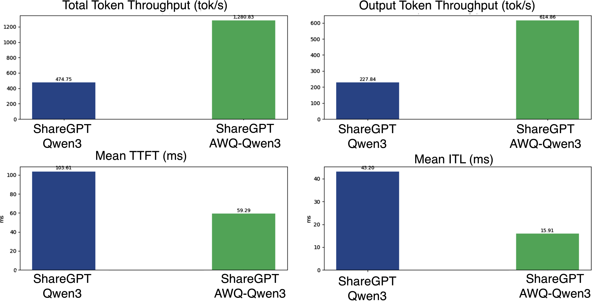

| 지표 | Qwen3-14B | Qwen3-14B-AWQ | 개선 |
| --- | --- | --- | --- |
| Total Token TPS | 474 | <span class="t-red">1,280</span> | **2.7배** |
| Mean TTFT (ms) | 103.61 | <span class="t-red">59.29</span> | **약 42% 단축** |

**Prefix Repetition 트래픽 결과**

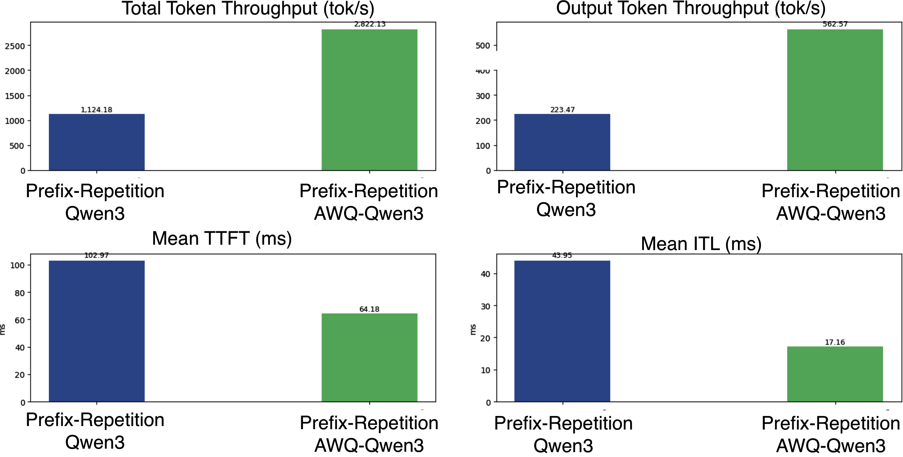

반복 트래픽에서도 동일하게, 양자화 모델이 <span class="t-red">일관되게 더 높은 처리량과 더 낮은 지연시간</span>을 보인다.

> [!tip] 이 실험이 실제로 보여준 것
> - 이번 결과는 <span class="t-red">Weight-only 양자화</span>가 CPU↔GPU 간 데이터 이동과 전체 메모리 사용량을 줄여준다는 것을 보여준 것이다.
> - 연산량 자체까지 줄이는 기법(<span class="t-red">Activation 양자화</span>)은 별개이며, CH6에서 다룬 내용이다.
> - 핵심 인과 사슬 : <span class="t-red">가중치 축소 → KV Cache 여유 → 더 큰 배치·더 적은 재연산 → 처리량 상승 + TTFT 하락</span>

---
### Step 7. 추가 최적화 기법 적용

기본 설정의 양자화 모델만으로도 이미 성능이 좋지만, <span class="t-red">트래픽 패턴별 / GPU별 특화 기법</span>으로 한계를 더 밀어낼 수 있다.

**워크로드별 처방**

| 워크로드 | 성격 | 추천 기법 | 이유 |
| --- | --- | --- | --- |
| 롱 컨텍스트, Prefill-heavy | 연산의 대부분이 입력 처리 | **LMCache** | 반복되는 prefix의 KV를 재사용 (멀티턴 채팅, RAG에 특히 유효) |
| 출력이 긴 Decode-heavy | 생성 반복이 많음 | **Speculative Decoding** | 작은 draft 모델로 여러 토큰을 앞서 예측해 디코딩 반복 횟수를 줄임 |

> LMCache와 Speculative Decoding의 실제 사용법은 CH7 실습 참고. (Week4 정리 참조)

**vLLM 튜닝 노브 (KV Cache / 블록 관리)**

```bash
# KV Cache에 더 많은 GPU 메모리 할당
--gpu-memory-utilization 0.9
# 필요하면 컨텍스트 길이 확대
--max-model-len 4096
# 블록이 작을수록 캐시 활용률이 좋아짐
--block-size 16
```

**vLLM 튜닝 노브 (배칭)**

```bash
# 동시 요청 수 상한
--max-num-seqs 512
# 한 iteration의 총 토큰 수 상한
--max-num-batched-tokens 16384
# 배칭을 위한 패딩 허용치
--max-paddings 256
```

**튜닝을 적용한 실제 기동 스크립트 예시**

```python
proc = start_vllm_serve(
   model="Qwen/Qwen3-14B-AWQ",
   extra_args=(
       "--quantization awq "
       "--gpu-memory-utilization 0.95 "
       "--max-model-len 1024 "
       "--block-size 16 "
       "--enable-prefix-caching "
       "--max-num-seqs 8 "
       "--max-num-batched-tokens 8192 "
       "--enable-chunked-prefill "
   )
)
```

> [!warning] 설정을 과도하게 튜닝하지 말 것 (Don't Overtune)
> - 특정 GPU·특정 워크로드에 완벽히 맞춘 설정은 <span class="t-red">다른 하드웨어나 다른 트래픽에서는 성능이 나빠지거나 아예 실패</span>할 수 있다.
> - 서빙 파라미터를 과적합시키면 <span class="t-red">이식성이 떨어지고 유지보수가 어려워진다.</span>
> - 요즘 서빙 프레임워크는 점점 똑똑해져서, 기동 시점에 하드웨어와 환경을 보고 <span class="t-red">괜찮은 설정을 알아서 추론</span>한다.
> - 그래서 실무의 노력은 <span class="t-red">"완벽한 설정값 찾기"가 아니라 "어떤 최적화 기법을 적용할 것인가"를 고르는 데 대부분 쓰인다.</span>

---
### Step 8. 분산 서빙 벤치마크

> [!info] 실험 범위
> - <span class="t-red">단일 서버 노드 안의 멀티 GPU 분산 서빙</span>에 집중한다. (하이퍼스케일이 아닌 대부분의 현실적인 LLM 서빙 시나리오)
> - 멀티 노드 구성이 필요하다면 Prefill-Decode Disaggregation을 권장한다. (CH7)

GPU 아키텍처 차이의 영향을 보기 위해 동일한 `Qwen3-14B-AWQ` 모델을 두 인스턴스에서 돌린다.

| 인스턴스 | GPU 구성 | 인터커넥트 |
| --- | --- | --- |
| `g6e.12xlarge` | NVIDIA L40S x 4 | <span class="t-red">PCIe만</span> (NVLink 없음) |
| `p4d.24xlarge` | NVIDIA A100 x 8 | <span class="t-red">NVLink</span> |

---
#### 분산 구성으로 모델 띄우기

vLLM에서 멀티 GPU 서빙은 매우 간단하다.

```bash
vllm serve Qwen/Qwen3-14B-AWQ --tensor-parallel-size 2 \
         > vllm.log 2>&1 &
```

`--tensor-parallel-size 2`만 주면 vLLM이 2개 GPU에 걸쳐 분산 서빙 그룹을 자동 초기화하고, 통신과 모델 분할을 내부적으로 처리한다.

---
#### 결과 분석 : 왜 정반대의 결과가 나오는가

**① g6e 인스턴스 (L40S, NVLink 없음)**

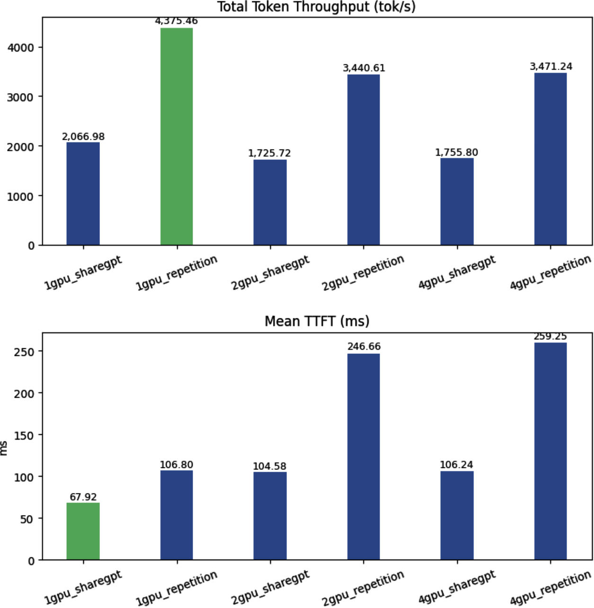

<span class="t-red">단일 GPU 구성이 가장 좋다.</span> 처리량도 가장 높고 TTFT도 가장 낮아서, 2-GPU·4-GPU 구성을 모두 앞선다.

**② p4d 인스턴스 (A100, NVLink)**

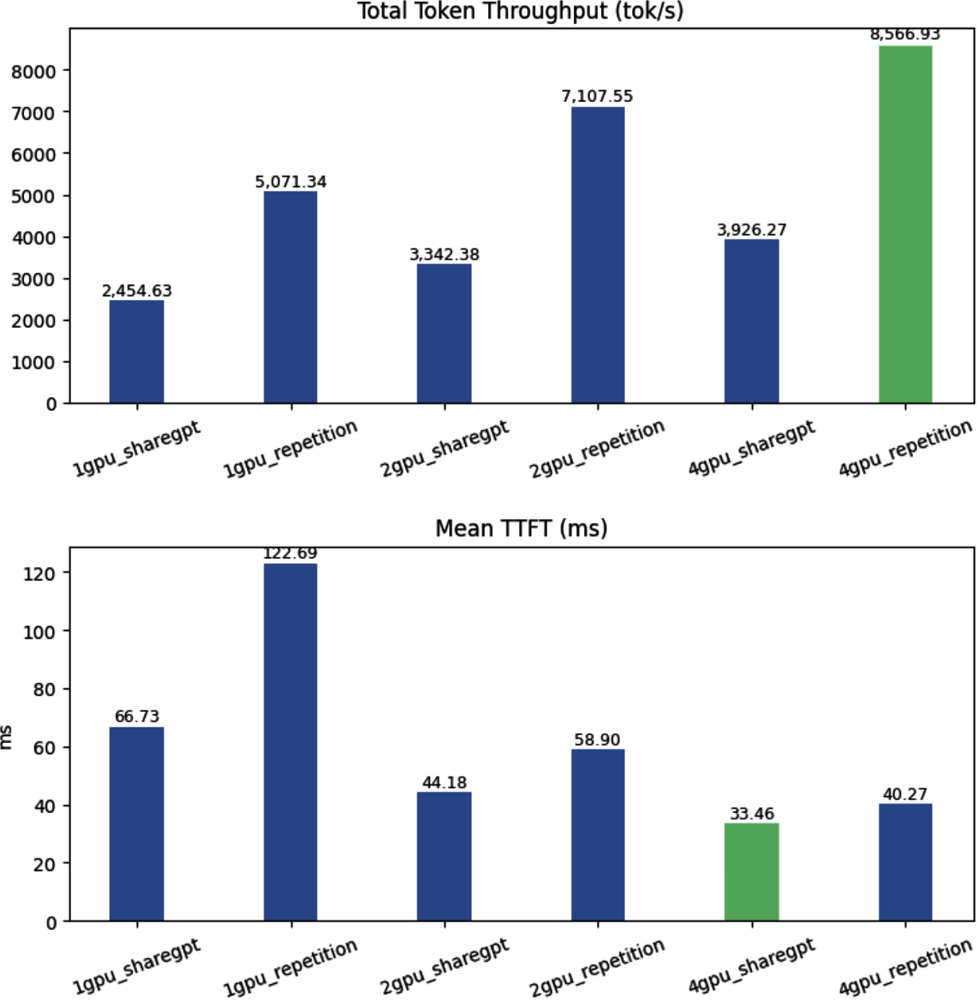

<span class="t-red">정반대다.</span> 멀티 GPU가 단일 GPU보다 낫고, 4-GPU 구성이 처리량·지연시간 모두에서 최고다.

> [!question] 단일 추론에서는 L40S가 A100보다 더 효율적인데, 왜 분산에서는 p4d가 이기는가?
> 답은 <span class="t-red">GPU 인터커넥트 아키텍처</span>에 있다. (CH5)
> - p4d의 A100들은 <span class="t-red">NVLink</span>로 연결되어 있어 GPU 간 통신이 고속·저지연이다. → Tensor Parallelism이 모델 연산을 쪼개고 동기화하는 작업을 효율적으로 수행할 수 있다.
> - g6e의 L40S는 NVLink가 없고 <span class="t-red">PCIe로만</span> 통신한다. → 대역폭이 현저히 낮고 지연이 크다. → 멀티 GPU 구성이 <span class="t-red">GPU 간 통신 오버헤드에 잡아먹혀</span> 단일 GPU보다 느려진다.
>
> 즉, <span class="t-red">TP는 GPU 성능이 아니라 GPU 사이의 배선이 결정한다.</span>

> [!warning] 분산 서빙이 항상 더 빠른 것은 아니다
> - 흔한 오해 : "분산 서빙을 도입하면 성능이 좋아진다."
> - g6e 결과처럼 <span class="t-red">단일 GPU가 처리량·지연시간 모두에서 멀티 GPU를 이기는 경우</span>가 실제로 있다.
> - 심지어 4-GPU가 최고 성능을 낸 p4d에서도 이점이 절대적이지 않다.
>   - GPU 4장을 <span class="t-red">하나의 분산 모델</span>로 묶으면 → 3,926 TPS
>   - GPU 4장에 <span class="t-red">독립 모델 인스턴스 4개</span>를 띄우면 → **9,816 TPS** (거의 3배)
> - <span class="t-red">처리량만 원한다면 수평 확장(레플리카)이 압도적으로 유리하다.</span>

> [!tip] 그렇다면 분산 서빙은 언제 쓰는가?
> 분산 서빙의 진짜 가치는 <span class="t-red">수직 확장(vertical scaling)</span>에 있다.
> 1. **지연시간 단축** : p4d에서 1-GPU → 4-GPU로 갈 때 TTFT가 66ms → 33ms로 <span class="t-red">거의 절반</span>이 되었다. 이런 개선은 <span class="t-red">수평 확장으로는 절대 얻을 수 없다.</span> (레플리카를 아무리 늘려도 요청 하나의 지연시간은 그대로다)
> 2. **모델 크기 한계 돌파** : 양자화를 해도 단일 GPU 메모리에 모델이 안 들어가는 경우, 분산 서빙은 선택이 아니라 필수다.

---
### 자주 마주치는 5가지 트레이드 오프

> 실무에서는 <span class="t-red">"완벽한 설정"을 찾는 것보다 "어떤 기법을 적용할지 결정하는 데" 훨씬 많은 노력이 든다.</span> 트레이드 오프를 이해하고 내 시나리오에 맞게 조정하는 것이 실전 LLM 서빙 최적화의 본질이다.

| # | 트레이드 오프 | 내용 | 판단 기준 |
| --- | --- | --- | --- |
| 1 | **처리량 vs 지연시간** | 배칭/스케줄링으로 GPU를 채우면 처리량은 오르지만 대기 시간이 생겨 요청당 지연시간이 늘어난다 | 챗봇 등 인터랙티브 → 지연시간<br/>오프라인/배치 추론 → 처리량 |
| 2 | **메모리 효율 vs 모델 품질** | 양자화·가중치 압축은 메모리를 아끼고 KV Cache를 넓히지만, 약간의 정확도 손실이나 토큰 불안정성을 부를 수 있다 | 품질 저하 허용치 vs 성능 이득<br/>(4bit냐 8bit냐) |
| 3 | **하드웨어 활용도 vs 유연성** | 공격적 튜닝은 특정 GPU/워크로드에서 최고 성능을 내지만 일반화되지 않는다 | 몇 %의 효율을 <span class="t-red">이식성과 견고성</span>에 지불할 것인가 |
| 4 | **수직 확장 vs 수평 확장** | 수직(분산 서빙)은 큰 모델을 가능하게 하고 지연시간을 줄인다. 수평(단일 GPU 레플리카 다수)은 총 처리량과 내결함성을 높인다 | <span class="t-red">대부분의 프로덕션은 수평 확장 중심</span> |
| 5 | **정적 최적화 vs 적응형 서빙** | 정적 설정은 예측 가능하지만 특정 환경에 과적합된다. 적응형 런타임은 실시간 트래픽·하드웨어 지표를 보고 배치 크기·캐시 정책·스케줄링을 동적으로 조정한다 | 적응형은 <span class="t-red">차세대 서빙 프레임워크의 방향</span> (자기 최적화 시스템) |

---
### CH9 핵심 정리

> [!info] Summary
> - 최적화는 <span class="t-red">범용 최적 설정을 찾는 일이 아니다.</span> 시스템의 지배적 병목을 이해하고, 적절한 레벨(하드웨어 / 모델 / 스케줄링)에서 맞는 기법을 적용하는 일이다.
> - <span class="t-red">시나리오 이해에서 출발</span>하라. 튜닝 전에 비즈니스 유스케이스, 트래픽 패턴, 성능 목표를 명확히 정의한다.
> - 실제 사용자 워크로드를 반영하는 <span class="t-red">대표성 있는 테스트 데이터셋과 의미 있는 지표</span>를 설계하라. 이것이 최적화 결과의 의미를 결정한다.
> - <span class="t-red">범용 처리량 최적화로 시작</span>해 탄탄한 baseline을 만든 뒤, 워크로드 특화 튜닝으로 넘어간다.
> - 트래픽 유형별로 겨냥된 기법을 쓴다. 롱 컨텍스트(Prefill-heavy)에는 LMCache, 긴 출력(Decode-heavy)에는 Speculative Decoding.
> - 우선순위에 따라 처리량과 지연시간의 균형을 잡는다. 요청당 메모리를 더 주거나 동시성을 제한하면 <span class="t-red">총 처리 용량을 대가로 응답 속도를 산다.</span>
> - 분산 서빙은 <span class="t-red">선택적으로</span> 쓴다. 모델이 단일 GPU에 안 들어가거나 저지연이 최우선일 때 특히 가치가 있다.
> - 대부분의 경우, <span class="t-red">단일 GPU + 다수 레플리카의 수평 확장</span>이 처리량과 단순함 양쪽에서 더 낫다.

---
---
## CH10. Advancements in LLM Serving

---
### 개요

마지막 챕터는 LLM 서빙 분야에서 <span class="t-red">떠오르고 있는 흐름들</span>을 소개한다. 각각이 책 한 권 분량이 될 수 있는 주제들이고, 발전 속도도 매우 빠르다. 여기서는 지금까지 배운 기초와 다음 세대 서빙 시스템을 <span class="t-red">연결</span>하는 것이 목적이다.

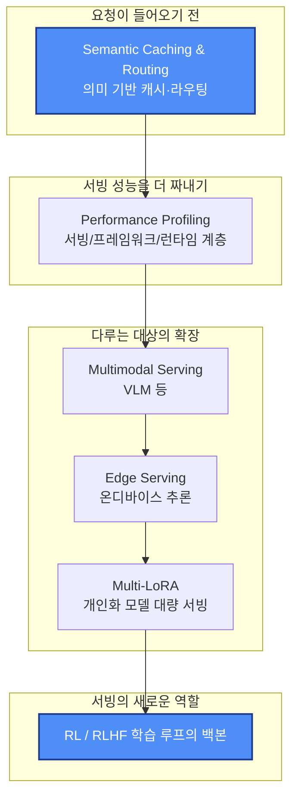

---
### Semantic Caching & Routing

---
#### 라우팅이 한 계층 위로 올라간다

CH7에서 데이터 병렬 처리를 다루면서, 모델 서빙 엔드포인트 뒤에 여러 모델 레플리카가 있고 앞단의 라우팅 레이어가 로드 밸런싱을 한다는 것을 배웠다. Prefix Caching과 KV Cache 활용률 기반 로드 밸런싱을 하게 되면서 라우팅의 중요성은 더 커졌다.

이제 서빙 시스템은 점점 <span class="t-red">의미(semantics)를 인식</span>하고, 생태계 전체에서 더 높은 레벨에서 동작하고 있다.

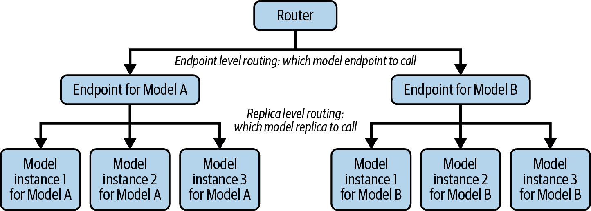

| 구분 | 기준 | 대상 |
| --- | --- | --- |
| **Replica-level routing** (기존) | 정확한 프롬프트 일치, 부하·캐시 상태 | 같은 모델의 <span class="t-red">레플리카들</span> |
| **Endpoint-level routing** (시맨틱) | <span class="t-red">임베딩 + 벡터 검색으로 의도를 인식</span> | 서로 <span class="t-red">다른 모델 엔드포인트들</span> |

시맨틱 라우팅 레이어가 위에 올라가면 캐시 히트가 늘어나고, <span class="t-red">언제 추론(reasoning)을 켤지, 에이전트 도구를 어떻게 필터링할지, 어떤 모델을 부를지</span>를 더 똑똑하게 결정할 수 있다.

---
#### 시맨틱 라우팅이 필요한 4가지 이유

**1. LLM을 아예 부르지 않기 (Semantic Caching)**

- "How long is the flight from Seattle to Hawaii?"
- "Tell me how many hours it takes to fly from Seattle to Hawaii."

두 질문은 표현이 다르지만 <span class="t-red">의도가 같다</span>. 이때 LLM을 (특히 외부 LLM을) 다시 호출하는 것은 과잉이다. 돈 낭비이자 불필요한 지연시간이다.

Semantic Caching은 두 쿼리가 <span class="t-red">유사하다는 것을 이해하고</span>, 이전 쿼리의 결과를 저장해두었다가 반환해 추가 LLM 호출을 없앤다.

> [!info] Prefix Cache와 무엇이 다른가?
> - **Prefix Cache** : <span class="t-red">토큰이 정확히 일치</span>하는 앞부분의 KV를 재사용 → 연산 일부를 건너뜀
> - **Semantic Cache** : <span class="t-red">의미가 유사</span>하면 응답 자체를 반환 → LLM 호출 자체를 건너뜀
> - 레이어가 완전히 다르며, 둘은 함께 쓸 수 있다.

**2. 모든 질문에 큰 모델이 필요하진 않다**

캐시에 없는 새 프롬프트라도, 모든 질문이 대형 모델이나 reasoning 모드를 필요로 하진 않는다.

시맨틱 라우터는 ModernBERT 같은 <span class="t-red">경량 인코더 모델</span>을 호출해서, 이 프롬프트가 최상위 모델 호출 / reasoning 활성화를 정당화할 만큼 복잡한지를 빠르게 판단한다.

**3. SLM으로 충분한 경우가 많다**

점점 더 많은 기업이 깨닫고 있는 사실 : <span class="t-red">태스크 특화로 파인튜닝한 8B~32B급 SLM(Small Language Model)이 거대 범용 LLM과 대등하거나 더 낫다.</span> 게다가 신뢰성이 높고 지연시간이 낮아 SLA/SLO 통제에도 유리하다.

시맨틱 라우터는 쿼리를 이해하고 적절한 모델 엔드포인트로 요청을 보낸다.

**4. 에이전틱 환경에서의 도구 필터링과 정책 집행**

에이전틱 세팅에서 라우팅 서비스는 단순 요청 전달을 넘어선 역할을 맡는다.

- <span class="t-red">1차 도구 필터링</span> : 모델에게 가용한 모든 도구를 노출하지 않는다. 최근에는 MCP(Model Context Protocol)를 통해 도구가 구조화된 스키마·권한·메타데이터와 함께 등록되고, 라우터가 사용자 요청에 맞는 도구만 골라 <span class="t-red">작은 부분집합</span>만 모델에 전달한다.
  - 프롬프트 오버헤드 감소, 지연시간 개선, <span class="t-red">의도치 않은 도구 사용 위험 감소</span>
- <span class="t-red">보안·정책·컴플라이언스의 중앙 집행 지점</span> 역할

---
#### 시맨틱 라우터의 동작 흐름

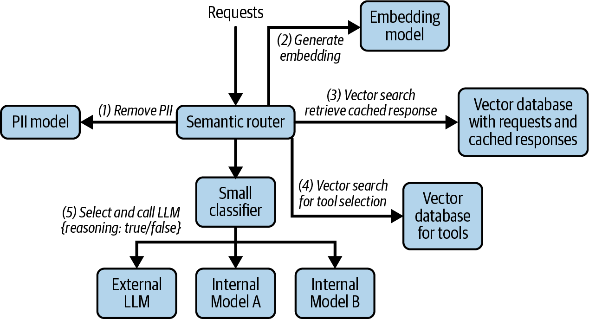

**① PII 마스킹**

원본 사용자 입력에는 이름, 주소, 연락처, 카드번호, 건강 정보 같은 민감 데이터가 자주 섞인다. 이를 제거·난독화해야 <span class="t-red">이후의 로그·캐시·라우팅 결정이 개인정보를 노출하지 않는다</span>. 라우터에서 하거나 그 앞의 게이트웨이에서 처리한다.

PII 모델은 보통 프라이버시 민감 엔티티에 대해 NER(개체명 인식)로 파인튜닝된 작은 인코더 모델이다.

```json
[
    {"start": 5, "end": 13, "label": "PERSON",
     "text": "John Doe", "confidence": 0.97},
    {"start": 66, "end": 81, "label": "EMAIL",
     "text": "john@abc.com", "confidence": 0.95}
]
```

위치 정보와 카테고리를 이용해 원래 프롬프트의 PII 토큰을 `<NAME_1>`, `<Email_1>` 로 치환한다. 실무에서는 NER 모델을 보완하기 위해 <span class="t-red">정규식 방식도 함께</span> 쓰는 경우가 많다.

**② 임베딩 (핵심 의미 이해 단계)**

임베딩 모델을 호출해 프롬프트를 길이 768 정도의 숫자 리스트, 즉 <span class="t-red">임베딩 벡터</span>로 변환한다. 의미가 비슷한 프롬프트는 비슷한 벡터가 된다.

```
"forget my login"          ─┐
                            ├─ 벡터가 가까움
"reset password"           ─┘

"forget my login"          ─┐
                            ├─ 벡터가 멀리 떨어짐
"create me a draft article"─┘
```

**③ 벡터 검색 → 시맨틱 캐시 조회**

임베딩 벡터로 이전에 저장된 (프롬프트, 응답) 쌍을 벡터 검색한다. <span class="t-red">아주 가까운 매치가 있으면 추가 LLM 호출 없이 캐시된 응답을 즉시 반환</span>한다.

**④ 벡터 검색 → 도구 필터링**

에이전틱 유스케이스에서 도구가 많다면, 벡터 검색으로 <span class="t-red">후보 도구 목록을 좁힌다</span>. 모든 도구를 LLM에 보내는 것은 비싸기 때문이다.

**⑤ 분류기 → 모델 선택 & reasoning 여부 결정**

임베딩 벡터를 작은 분류기의 입력으로 써서 <span class="t-red">어떤 LLM을 부를지, reasoning을 켤지</span>를 결정한다.

- 복잡한 추론 → 외부 SOTA 모델
- 특정 태스크 → 중간 크기 내부 모델
- 단순 질문 → 작은 내부 모델

---
### Performance Profiling Strategies

> [!info] 왜 프로파일링이 필수가 되었나
> - LLM 서빙은 비싸다. 이전 세대의 예측 모델은 추론 워크로드가 작아서 이만큼 중요하지 않았다.
> - 지금은 대규모 서빙에서 <span class="t-red">단 1%의 개선이 수백만 달러의 인프라 비용을 아낀다.</span>
> - 마지막 몇 %의 성능은 더 이상 사치가 아니라 <span class="t-red">운영상의 필수</span>다.

프로파일링은 <span class="t-red">3개 계층</span>으로 나뉜다.

| 계층 | 보는 것 | 대표 도구 |
| --- | --- | --- |
| **Serving layer** | 처리량, TTFT, ITL, GPU 사용률, 메모리 사용률 | 서빙 프레임워크 메트릭, `nvidia-smi`, `vllm bench serve` |
| **Framework layer** | 연산자(operator) 단위 실행 시간, CPU↔GPU 데이터 이동, 연산·I/O 중첩 여부 | PyTorch Profiler |
| **Runtime layer** | CUDA 커널 단위 실행, warp 점유율, 메모리 스톨, 텐서 코어 활용률 | NVIDIA Nsight Systems / Nsight Compute |

---
#### ① Serving Layer

지금까지 계속 다뤄온 최상위 계층이다. 처리량, TTFT, ITL, GPU/메모리 사용률 같은 지표를 얻고 SLA/SLO 목표를 맞추도록 조정한다.

---
#### ② Framework Layer

PyTorch 같은 딥러닝 프레임워크 내부에서 모델은 <span class="t-red">연산의 그래프</span>로 표현된다. PyTorch Profiler로 특정 연산자(matmul, attention, layernorm 같은 기본 블록)가 어떻게 실행되는지, CPU와 GPU 사이에서 데이터가 어떻게 움직이는지, 파이프라인이 연산과 I/O를 효율적으로 겹치는지를 들여다본다.

- **예시 1** : 연산자 실행 타임라인을 보면 <span class="t-red">어떤 연산자가 GPU 실행 시간을 지배하는지</span> 알 수 있다. → 그 연산자를 타겟해서 다른 커널 구현으로 교체
- **예시 2** : GPU가 대부분 놀면서 <span class="t-red">CPU 쪽 작업이 끝나기를 기다리는</span> 상황을 식별할 수 있다. → CPU 워크로드를 최대한 비동기 프로세스로 옮겨 크리티컬 패스에서 빼낸다

---
#### ③ Runtime Layer

프레임워크 레벨 프로파일링으로 어떤 연산자가 느린지는 알 수 있다. 하지만 <span class="t-red">가장 느린 연산자가 GPU 커널 실행에 지배당하고 있다면</span> 한 계층 더 내려가야 한다.

모델은 결국 연산자의 시퀀스로 실행되고, 각 연산자는 실제 수학 연산을 수행하는 <span class="t-red">하나 이상의 CUDA 커널</span>로 펼쳐진다. 커널 내부에서 무슨 일이 일어나는지를 이해해야, 왜 그 연산자가 비싸 보이는지 설명할 수 있다.

| 도구 | 관점 | 알려주는 것 |
| --- | --- | --- |
| **Nsight Systems** | 시스템 전체 타임라인 | 큰 병목이 어디인지 (GPU냐, CPU 오버헤드냐, 데이터 로딩·I/O냐) |
| **Nsight Compute** | 마이크로아키텍처 수준 커널 상세 | 특정 커널이 왜 느린지 (점유율, 메모리 스톨 등) |

- **Nsight Systems 예시** : GPU 사용률이 높아 보여도 실제로는 <span class="t-red">커널 사이에 큰 유휴 간격</span>이 있는 것을 드러낼 수 있다. 호스트가 커널을 너무 천천히 실행하거나, 데이터 전송이 연산과 겹치지 않아서다. → CUDA 스트림을 여러 개 써서 데이터 복사와 연산을 <span class="t-red">중첩</span>시켜 GPU를 계속 바쁘게 만든다.
- **Nsight Compute 예시** : 어텐션 softmax 커널이 큰 중간 텐서를 shared memory에 두지 않고 <span class="t-red">글로벌 메모리에서 반복적으로 읽어와</span> 느린 것을 밝혀낼 수 있다. → 메모리 접근 패턴 최적화, block/grid 설정 조정, 또는 더 효율적인 <span class="t-red">fused 커널로 교체</span>.

---
#### 프로파일링 의사결정 흐름

> 실전에서 진짜 어려운 것은 <span class="t-red">언제 어떤 도구를 쓰고, 어떻게 다음 계층으로 넘어갈지</span>를 아는 것이다. 프로파일러 생태계에서 길을 잃지 않으려면 증상에서 근본 원인까지 가는 명확한 전략이 필요하다.

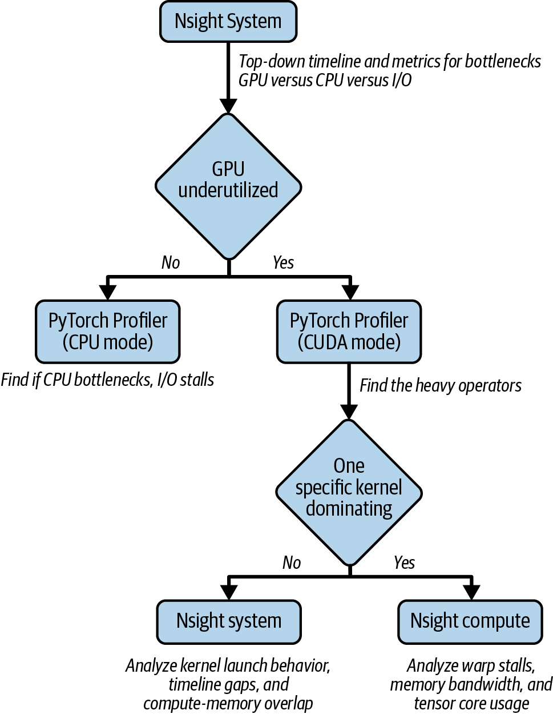

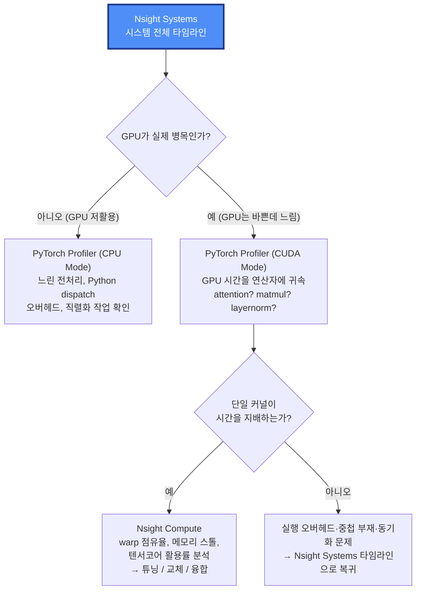

1. **Nsight Systems로 시작** : 톱다운 시스템 전역 타임라인. GPU가 진짜 병목인지, 아니면 CPU 오버헤드·데이터 로딩·I/O가 문제인지 판단.
2. **GPU가 저활용이면** : PyTorch Profiler(CPU Mode)로 호스트 쪽에서 시간이 어디에 쓰이는지 확인.
3. **GPU는 바쁜데 지연시간이 높으면** : PyTorch Profiler(CUDA Mode)로 GPU 시간을 상위 레벨 연산자에 귀속시켜 범인을 특정.
4. **무거운 연산자를 찾았으면** : 그 안의 단일 커널이 시간을 지배하는지 확인 → 지배하면 Nsight Compute로 드릴다운, 아니면 실행 오버헤드/중첩/동기화 문제이므로 다시 Nsight Systems 타임라인으로.

---
### Multimodal Serving

---
#### 범위 정리 : 입력이냐 출력이냐

> [!warning] 먼저 구분해야 할 것
> - 이 책이 다루는 것은 <span class="t-red">멀티모달 입력을 받되 표준 자기회귀 디코더로 텍스트 토큰을 생성하는 언어 모델</span>이다. (VLM 등)
> - Midjourney, Sora, Veo처럼 <span class="t-red">이미지·비디오를 생성</span>하는 모델은 동작 방식이 전혀 다르다. 이들은 보통 자기회귀 생성이 아니라 <span class="t-red">Diffusion 기반</span> 아키텍처에 의존하므로 이 책의 범위를 벗어난다.

---
#### 멀티모달 입력 처리 과정

이미지와 텍스트를 함께 넣는 프롬프트는 다음과 같다.

```python
messages = [
   {
       "role": "user",
       "content": [
           {"type": "image", "image": image},
           {"type": "text", "text": "Describe this image."},
       ],
   }
]
```

프롬프트 템플릿을 적용하면 두 번째 줄에 이미지 섹션이 보인다.

```
<|im_start|>user
<|vision_start|><|image_pad|><|vision_end|>
Describe this image.<|im_end|>
<|im_start|>assistant
```

입력 ID로 변환하면 이렇게 된다.

```
[151644, 872, 198,                          # <|im_start|>user
 151652,                                     # <|vision_start|>
 151655, … (644번 반복) … , 151655,          # 이미지 임베딩 자리표시자
 151653,                                     # <|vision_end|>
 74785, 419, 2168, 13, 151645, 198,          # Describe this image. <|im_end|>
 151644, 77091, 198]                         # <|im_start|>assistant\n
```

> [!tip] 여기서 얻는 직관
> - 이미지 하나가 <span class="t-red">644개의 자리표시자 토큰</span>을 차지한다. 즉 이미지 한 장 = 프롬프트 수백~수천 토큰.
> - 이는 곧 <span class="t-red">KV Cache 사용량과 Prefill 비용이 이미지 개수·해상도에 따라 급격히 늘어난다</span>는 의미다.

모델 처리 시점에는, 텍스트 토큰 ID는 평소처럼 텍스트 임베딩으로 매핑되고, <span class="t-red">이미지 자리표시자는 Vision Encoder가 만든 임베딩으로 교체</span>된다. Vision Encoder는 이미지를 작은 패치로 나누고, 각 패치를 LLM의 hidden dimension으로 투영한 뒤, 패치들이 서로 attend하도록 처리해 <span class="t-red">전역적인 공간·의미 관계</span>를 인코딩한다.

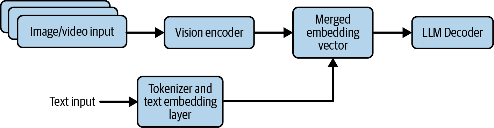

---
#### 아키텍처·시스템 관점의 함의 : 병목이 CPU로 이동한다

멀티모달 모델이 프로덕션에 들어가면 캐싱·배칭·스트리밍의 원칙이 텍스트 너머로 확장되어야 한다.

- 텍스트 토크나이징은 비교적 가벼워서 보통 CPU 오버헤드가 크지 않다. (다만 아주 빠른 GPU로 작은 모델을 큰 배치로 돌리면 CPU 오버헤드가 드러나기 시작한다)
- 반면 멀티모달 입력은 <span class="t-red">연산량이 크고 CPU를 많이 쓰는 전처리 작업</span>을 끌고 들어온다.
  - 고해상도 이미지 → raw pixel 변환
  - 크롭, 리사이즈
  - 복잡한 텐서 변환

이 작업들은 <span class="t-red">LLM이 시작되기 전에 순차적으로 완료</span>되어야 한다. 즉 연산이 앞단에 몰리며 <span class="t-red">이른 CPU 병목</span>이 생긴다.

```
요청 유입 속도 > CPU의 텐서 준비 속도
        ↓
강력한 GPU가 놀게 됨 (idle)
        ↓
전체 처리량의 제약이 LLM이 아니라
CPU 기반 비전 전처리 단계의 지연·효율로 이동
```

---
#### vLLM V0 → V1이 이 문제를 푼 방식

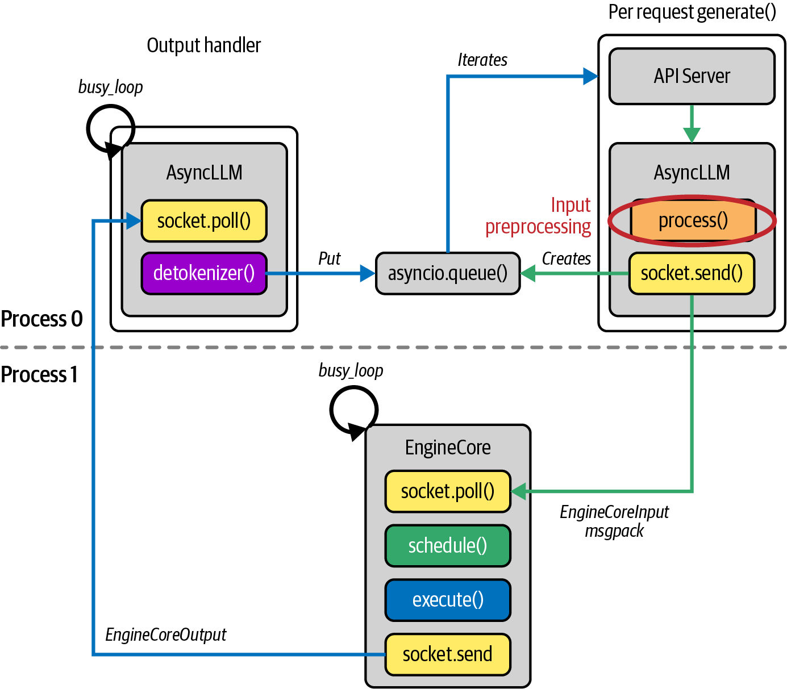

vLLM의 V0 → V1 진화는 멀티모달 병목 완화의 좋은 사례다. V1의 핵심 개선은 <span class="t-red">CPU 집약적 작업을 GPU 실행으로부터 완전히 비동기로 분리</span>한 것이다.

| 버전 | 구조 | 결과 |
| --- | --- | --- |
| **V0** | 멀티모달 전처리와 API 서버 오버헤드가 CPU 연산을 <span class="t-red">블로킹</span> | GPU 유휴 시간 발생 |
| **V1** | 이 작업들을 <span class="t-red">별도 CPU 프로세스</span>로 오프로드해 GPU 코어 추론 루프와 동시 실행 | CPU 오버헤드 최소화, GPU가 계속 데이터를 공급받아 거의 완전 가동 |

- **Process 0** : API 서버, 입력 전처리(무거운 멀티모달 작업 대부분), 출력 후처리
- **Process 1** : GPU 커널 스케줄링·실행 전용의 완전히 분리된 프로세스

> [!info] 이 분리가 주는 것
> - Process 0이 비싼 멀티모달 전처리에 붙잡혀 있어도, <span class="t-red">Process 1이 GPU 커널을 계속 실행하는 것을 막지 않는다.</span>
> - 결과적으로 텍스트와 멀티모달 워크로드 <span class="t-red">양쪽 모두</span>의 처리량이 크게 향상되었다.

---
### Edge AI

---
#### 엣지로 가는 3가지 동인

이 책의 대부분은 대규모 클라우드 서빙을 다뤘지만, 점점 더 많은 AI 워크로드가 <span class="t-red">엣지 디바이스</span>에서 서빙되고 있다.

| 동인 | 내용 |
| --- | --- |
| **Latency** | 로보틱스, 자율주행, AR/VR처럼 밀리초 단위 반응이 필요한 응용에서는 클라우드까지의 <span class="t-red">20~50ms 네트워크 홉조차 허용되지 않는다.</span> 연산이 엣지로 오면 데이터가 즉시 처리되어 안전 필수·시간 민감 작업의 실시간 의사결정이 가능해진다. |
| **Data locality** | 원본 오디오·비디오, 의료 기록, 금융 정보, 독점 산업 데이터 등은 로컬 처리가 필수다. 외부 클라우드로 전송하면 가로채기·무단 접근 위험이 커지고 <span class="t-red">GDPR, HIPAA 같은 데이터 주권·프라이버시 규제와 충돌</span>하는 경우가 많다. 엣지 AI는 <span class="t-red">원본 데이터가 현장을 벗어나지 않게</span> 한다. |
| **Cost** | IoT 센서와 고해상도 카메라가 만드는 데이터 양은 네트워크 인프라를 압도하고 클라우드 비용을 치솟게 한다. 예를 들어 라이브 비디오 스트림을 클라우드로 보내 처리하는 것은 대역폭·전송·저장 비용 면에서 극도로 비싸다. 엣지에서 걸러내고 <span class="t-red">메타데이터·요약된 인사이트만</span> 올리면 비용이 크게 준다. |

> [!warning] 엣지 배포 = 클라우드 모델을 줄여서 올리는 것이 아니다
> - 하드웨어 발전, 모델 압축 기법, 소프트웨어 런타임, 아키텍처 패턴이 <span class="t-red">함께 수렴</span>해야 빡빡한 전력·메모리 예산 안에서 실시간 지능이 가능해진다.

---
#### 엣지 AI를 가능하게 한 5가지 축

**1. 특화된 저전력 하드웨어**

불과 몇 년 전만 해도 모바일이나 임베디드 보드에서 딥러닝 추론을 돌린다는 건 느린 CPU, 부족한 메모리, 지속 부하에 무너지는 배터리를 뜻했다. 업계는 <span class="t-red">AI 가속기</span>로 방향을 틀었다. 한 가지 일(고속 저정밀 텐서 연산)을 아주 잘하도록 설계된 전용 칩 또는 SoC 내 블록이다.

가장 중요한 발전은 <span class="t-red">NPU(Neural Processing Unit)</span>다. 강력한 코어 몇 개를 가진 CPU와 달리, NPU는 <span class="t-red">수천 개의 작고 효율적인 처리 요소</span>가 일사불란하게 동작한다.

> [!info] 클라우드와 엣지는 목표 지표가 다르다
> - 데이터센터 서버 : 전력과 냉각이 사실상 무제한 → <span class="t-red">순수 성능이 왕</span>
> - 배터리 구동·팬 없는 엣지 디바이스 : 엄격한 전력 예산 → <span class="t-red">효율이 왕</span>
> - 그래서 엣지 가속기의 업계 표준 지표는 <span class="t-red">TOPS/W (와트당 초당 테라 연산)</span>이다.

**2. 모델 압축과 최적화**

CH6에서 다뤘듯 클라우드 서빙에서도 모델 압축은 이제 필수 기법이다. 하지만 <span class="t-red">엣지에서는 성격이 다르다</span>.

| 환경 | 압축의 역할 |
| --- | --- |
| 클라우드 | 처리량 최적화와 지연시간 유지를 위한 <span class="t-red">수단</span> |
| 엣지 | 온디바이스 SRAM·플래시 제약 안에 모델을 넣기 위한 <span class="t-red">전제 조건</span> |

앞서 배운 양자화, 프루닝, 증류에 더해 KV Caching, Speculative Decoding, 커널 레벨 최적화 등이 엣지 AI에 맞춰 활용된다.

**3. 이종 연산 (Heterogeneous Compute)**

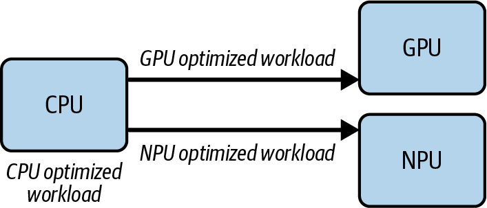

초기 엣지 AI는 하나의 프로세서에서 전부 돌아갔고, 느리고 발열에 제약을 받았다. 오늘날 Apple·Qualcomm·Intel의 모바일/임베디드 플랫폼은 근본적으로 <span class="t-red">이종적</span>이며, 워크로드의 부분별로 설계된 여러 특화 연산 유닛을 담고 있다.

> 이는 본질적으로 CH7에서 배운 <span class="t-red">파이프라인 병렬성</span>과 같되, 서로 다른 하드웨어와 코어에 걸쳐 이루어지는 형태다.

| 유닛 | 담당 | 이유 |
| --- | --- | --- |
| **CPU** | 전처리 (이미지 리사이즈, 색공간 변환, 입력 정규화) | 분기 로직과 메모리 조작에 강함 |
| **NPU** | 신경망의 연산 집약 레이어 | 양자화 친화적 고처리량 행렬 엔진 |
| **GPU** | 후처리 (바운딩 박스 오버레이, AR 렌더링) | 실시간 그래픽 |

더 진보한 런타임은 <span class="t-red">서브그래프 분할(subgraph partitioning)</span>까지 지원해서, 한 모델 안의 개별 레이어를 서로 다른 가속기에 동적으로 배정한다. 성능 이득은 크지만 <span class="t-red">동기화, 메모리 이동, 스케줄링</span> 면에서 만만치 않은 난이도를 동반한다.

**4. 발열 인식 스케줄링 (Thermal-Aware Scheduling)**

> 클라우드에서는 서버가 뜨거워지면 팬이 더 빨리 돈다. 팬이 없는 엣지 디바이스(작은 센서, 주머니 속 폰)에서는 <span class="t-red">열이 곧 성능을 죽인다.</span>

칩이 너무 뜨거워지면 물리적 손상을 막기 위해 <span class="t-red">스로틀링</span>이 걸려 속도가 급락한다. 그래서 지능형 스케줄러가 실시간으로 온도를 감시한다.

- 임계 온도에 접근하면 → 하드웨어가 스로틀링을 걸기 <span class="t-red">전에</span> 더 작고 덜 정확한 모델로 전환하거나 프레임 레이트를 낮춘다.
- 필요하면 → 워크로드를 뜨거운 메인 코어에서 <span class="t-red">시원한 리틀 코어로 몇 밀리초 동안 이주</span>시켜 메인 코어의 열을 식힌다.

즉 <span class="t-red">최대 성능보다 시스템 안정성</span>을 지키는 것이 목표다.

**5. 엣지–클라우드 하이브리드 연산**

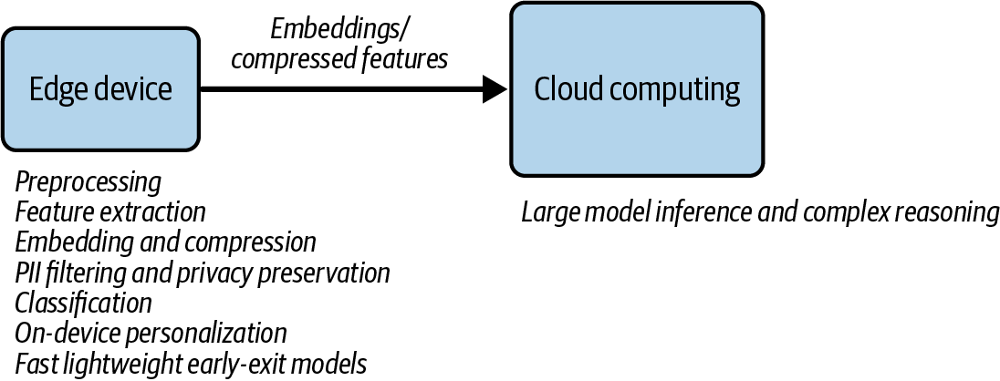

요즘 AI 워크로드는 디바이스와 클라우드 서버가 고립되어 동작하지 않고 <span class="t-red">협력</span>한다.

| 위치 | 담당 작업 |
| --- | --- |
| **엣지** | 즉각 반응과 엄격한 프라이버시가 필요한 작업 — 웨이크워드 감지("Hey Siri"), 경량 이미지 전처리, 로컬 비디오 인코딩, 빠른 의도 파악용 초소형 온디바이스 LLM |
| **클라우드** | 입력이 필터링·특징 추출·임베딩 압축된 뒤, <span class="t-red">대형 모델로 무거운 부분</span>을 실행 |

엣지가 입력을 미리 처리하고 응축했기 때문에 클라우드는 <span class="t-red">더 적은 자원으로 더 빠른 전체 성능</span>을 낸다.

> [!tip] Adaptive Offloading
> - 점점 더 많은 시스템이 <span class="t-red">대역폭, 배터리, 발열 상태, 지연시간 요구사항</span>에 따라 어떤 단계를 디바이스에서 돌릴지 클라우드에서 돌릴지 <span class="t-red">동적으로 결정</span>한다.
> - 실시간·프라이빗 연산은 엣지에서, 대규모 지능은 클라우드에서 — 양쪽의 강점을 모두 취하는 구성.

---
### Multi-LoRA Serving

---
#### 배경 : PEFT와 LoRA

<span class="t-red">PEFT(Parameter-Efficient Fine-Tuning)</span>는 모델 파라미터 전체를 갱신하는 대신, 대부분을 동결한 채 <span class="t-red">아주 작은 부분집합만</span> 적응시켜 파인튜닝을 빠르고 효율적으로 만든다.

기업의 LLM 도입 흐름은 대체로 이렇다.

```
1단계) RAG
   독점·도메인 지식을 모델 "컨텍스트"에 주입
        ↓
2단계) Fine-tuning
   더 깊은 정렬 - 자사 데이터·워크플로우·커뮤니케이션 스타일에 맞춰
   정확도, 일관성, 근거성(grounding) 개선
```

<span class="t-red">LoRA</span>는 PEFT에서 가장 인기 있는 방법 중 하나다. 모델 아키텍처에 작고 학습 가능한 <span class="t-red">저랭크(low-rank) 레이어</span>를 삽입해서, 원본 가중치를 건드리지 않고 태스크별 적응을 학습한다. 결과적으로 더 빠르고, 더 싸고, 더 <span class="t-red">모듈러한</span> 파인튜닝 방식이 된다.

---
#### Multi-LoRA 서빙이란

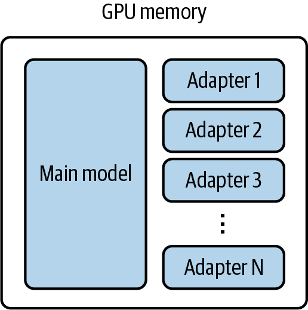

<span class="t-red">여러 LoRA 어댑터를 GPU 메모리에 함께 로드해서, 서로 다른 어댑터를 향한 요청들을 하나의 모델 서빙 인스턴스에서 같이 처리</span>하는 것이다. 두 가지 포인트가 핵심이다.

**① 활성 어댑터는 모두 GPU 메모리에 상주한다**

서빙 중인 요청에 해당하는 어댑터들은 <span class="t-red">전부 GPU 메모리에 올라가 대기</span>한다. 하나씩 번갈아 로드하는 방식이 아니다. 비활성("cold") LoRA는 필요할 때 CPU 메모리나 디스크에서 불러온다.

**② 여전히 Continuous Batching이 필요하다**

높은 GPU 활용률과 처리량을 유지하려면 이 요청들도 CH6에서 배운 대로 연속 배칭되어야 한다. 그래서 <span class="t-red">메인 모델 가중치와 여러 개의 서로 다른 어댑터를 함께 계산한 뒤 합치는</span> 전용 커널(예: <span class="t-red">Punica 커널</span>)이 개발되었다.

---
#### 핵심 이점 : GPU 개수의 절약

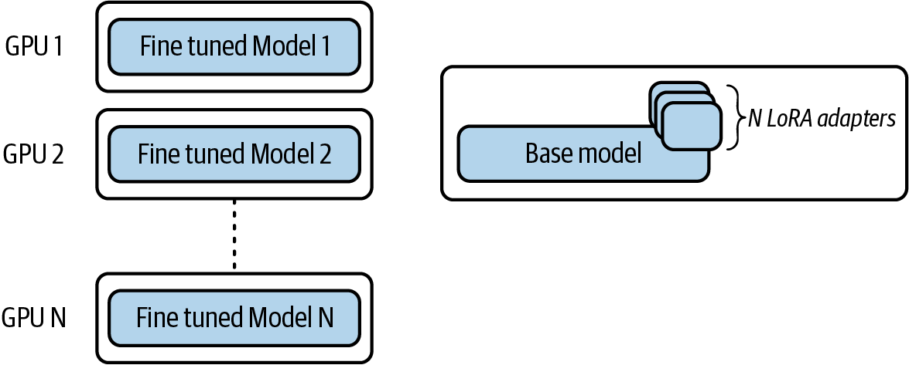

| 방식 | 필요한 GPU |
| --- | --- |
| LoRA 어댑터 없이 파인튜닝 모델 N개를 각각 서빙 | <span class="t-red">N개</span> |
| N개 LoRA 어댑터를 Multi-LoRA로 서빙 | <span class="t-red">1개</span> |

<span class="t-red">단일 베이스 모델 인스턴스가 여러 파인튜닝 어댑터를 동시에 서빙</span>하므로, 도메인 특화 동작이나 테넌트별 커스터마이징을 유지하면서도 필요한 GPU 수를 줄인다.

---
#### 그럼 항상 Multi-LoRA를 써야 하나?

> [!question] 파인튜닝 모델 서빙에는 무조건 Multi-LoRA?
> <span class="t-red">그렇지 않다.</span>
> - 만약 각 LoRA 어댑터가 <span class="t-red">수평 확장(데이터 병렬)이 필요할 만큼 무거운 트래픽</span>을 받는다면, 각 어댑터를 메인 모델에 <span class="t-red">병합(merge)해서 독립적으로 서빙</span>하는 편이 낫다.
> - Multi-LoRA는 <span class="t-red">어댑터별 트래픽이 상대적으로 적어서, 어댑터를 각각 독립 서빙하면 하드웨어를 포화시키지 못하는 경우</span>를 위한 것이다.
>
> 즉 판단 기준은 <span class="t-red">"어댑터 하나가 GPU 한 장을 채울 만큼의 트래픽을 가지는가"</span>이다.

---
### Model Serving in Reinforcement Learning

---
#### RLHF와 서빙의 만남

LoRA 같은 PEFT가 주로 지도학습을 통한 적응에 초점을 맞춘다면, <span class="t-red">RLHF(Reinforcement Learning from Human Feedback)</span>는 새로운 영역을 열었다. 레이블 데이터로 학습시키는 데서 그치지 않고, <span class="t-red">인간의 선호를 반영해 모델의 응답 방식을 다듬는다.</span>

결과물은 단순히 정답을 아는 모델이 아니라, 더 <span class="t-red">도움이 되고, 정중하고, 안전하며, 인간의 의도에 잘 정렬된</span> 모델이다. 정답 여부가 매우 주관적인 <span class="t-red">개방형 생성 태스크</span>에서 특히 가치가 크다.

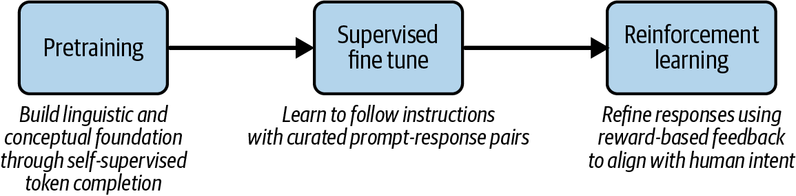

---
#### RLHF 학습 시간의 80%가 "서빙"이다

> [!info] OpenRLHF의 추정
> 인기 오픈소스 RLHF 프레임워크인 OpenRLHF는, <span class="t-red">RLHF 학습 시간의 80%가 모델 서빙의 샘플 생성 단계에 쓰인다</span>고 추정한다.

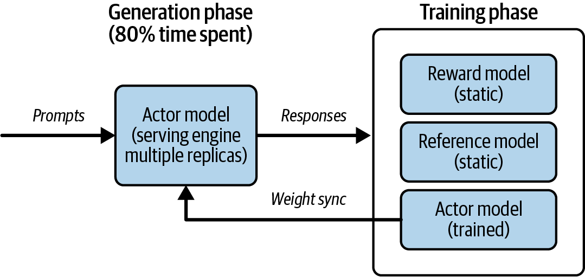

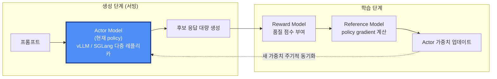

- **Actor Model** : RLHF 중 최적화되고 있는 <span class="t-red">현재 버전의 언어 모델</span>. 강화학습 용어로 "current policy"에 해당한다. 학습이 진행되면서 반복적으로 갱신되며, "현재 policy"란 그 최신 파라미터 집합을 가리킨다.
- Actor 모델은 <span class="t-red">고처리량 서빙 시스템</span>을 통해 여러 레플리카로 배포된다. 목표는 다운스트림 평가를 위한 <span class="t-red">대량의 후보 응답 배치를 효율적으로 생성</span>하는 것.
- 생성된 응답은 학습 단계로 넘어가 Reward Model이 품질 점수를 매기고, Reference Model이 policy gradient 계산을 돕는다. 이 gradient로 Actor가 갱신되고, <span class="t-red">새 가중치가 주기적으로 서빙 레플리카에 동기화</span>된다.

> [!tip] 관점의 전환
> - 서빙 시스템은 원래 <span class="t-red">추론</span>을 위해 만들어졌지만, 이제는 <span class="t-red">RLHF 학습 루프의 필수 구성 요소</span>가 되었다.
> - 수천 개의 동시 요청에 걸쳐 대형 모델로부터 확장 가능하고 저지연인 샘플링을 가능하게 한다.

---
#### RL 서빙에서의 결정성(Determinism)

RL 서빙 엔진에서는 <span class="t-red">결정성이 처리량·확장성만큼이나 중요</span>하다.

- RLHF에서는 레플리카 간이나 실행 간의 <span class="t-red">사소한 비결정성</span>조차 일관성 없는 보상, 불안정한 학습, 재현 불가능한 결과로 전파될 수 있다.
- 즉 <span class="t-red">재현 가능한 추론이 성능만큼 중요하다.</span>

> [!warning] Defeating Nondeterminism in LLM Inference
> - Thinking Machines의 연구는 <span class="t-red">배치 shape 변동 같은 미묘한 구현 디테일</span>이 아주 작은 편차를 만들고, 이것이 수천 번의 RLHF 반복에 걸쳐 <span class="t-red">누적</span>된다는 것을 보였다.
> - 생성 → 보상 스코어링 → policy 업데이트가 결합된 파이프라인에서 이런 드리프트는 보상이나 gradient 추정을 불안정하게 만들 수 있다.
> - 그래서 RL용 최신 서빙 엔진은 성능뿐 아니라 <span class="t-red">batch-invariant deterministic inference</span>(배치 구성이 달라져도 동일한 토큰 출력을 보장)에 집중한다.

---
### CH10 핵심 정리

> [!info] Summary
> - **Semantic Caching & Routing** : 라우팅이 레플리카 레벨에서 <span class="t-red">엔드포인트 레벨</span>로 올라간다. 임베딩과 벡터 검색으로 의도를 인식해 LLM 호출 자체를 줄이고, 모델·reasoning·도구를 선택하며, 보안·정책의 중앙 집행 지점이 된다.
> - **Performance Profiling** : 서빙 / 프레임워크 / 런타임 <span class="t-red">3계층</span>을 오르내리며 병목을 좁혀간다. Nsight Systems로 시작해 PyTorch Profiler로 연산자를 특정하고, 필요하면 Nsight Compute로 커널까지 내려간다.
> - **Multimodal Serving** : 이미지 한 장이 수백 토큰이 되고, 병목이 <span class="t-red">GPU에서 CPU 전처리로 이동</span>한다. vLLM V1의 프로세스 분리가 그 해법의 전형.
> - **Edge AI** : 지연시간·데이터 지역성·비용이 엣지로 밀고, NPU·모델 압축·이종 연산·발열 인식 스케줄링·엣지 클라우드 하이브리드가 그것을 가능하게 한다. 엣지의 지표는 성능이 아니라 <span class="t-red">TOPS/W</span>.
> - **Multi-LoRA** : 하나의 베이스 모델 인스턴스로 여러 파인튜닝 어댑터를 동시 서빙해 <span class="t-red">N개 GPU를 1개로</span>. 단, 어댑터별 트래픽이 클 때는 병합 후 독립 서빙이 낫다.
> - **RL Serving** : RLHF 학습 시간의 <span class="t-red">80%가 생성(서빙) 단계</span>다. 서빙 엔진은 이제 추론 인프라를 넘어 학습 루프의 백본이며, 여기서는 <span class="t-red">결정성</span>이 처리량만큼 중요하다.

---

> [!tip] 스터디를 마치며
> - 하드웨어 아키텍처는 바뀌고, 모델 패밀리는 늘어나고, 새로운 모달리티가 등장하겠지만 <span class="t-red">지금까지 배운 원리는 남는다.</span>
> - LLM 서빙을 블랙박스가 아니라 <span class="t-red">탐험할 수 있는 엔지니어링 지형</span>으로 볼 수 있게 되었다면, 이 책은 목적을 달성한 것이다.

---
