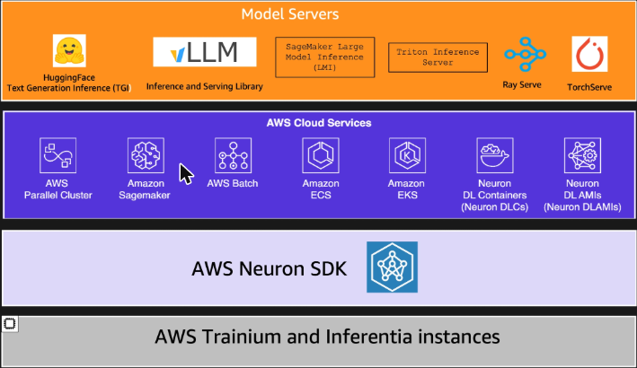
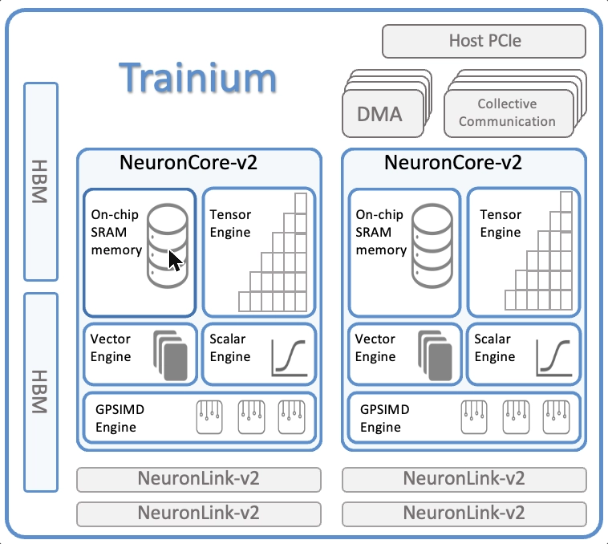
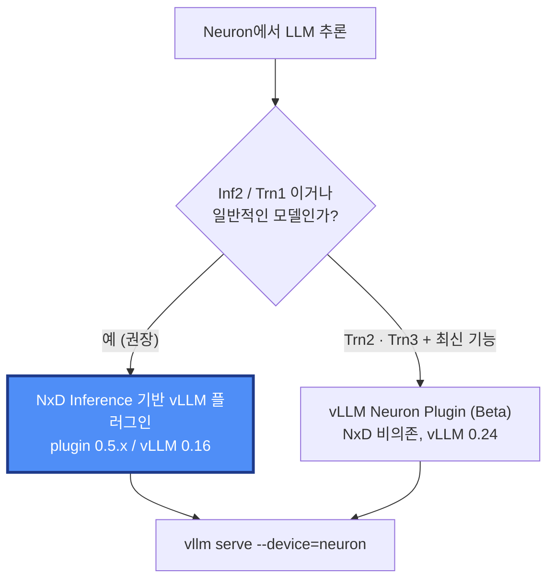
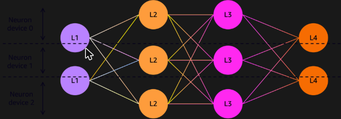
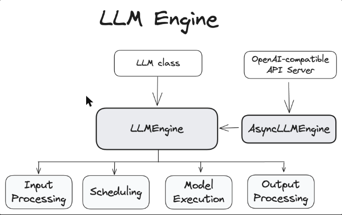
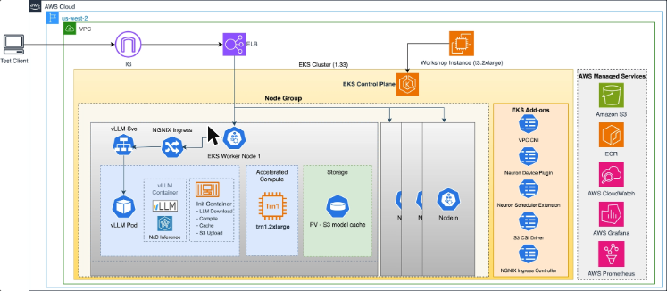
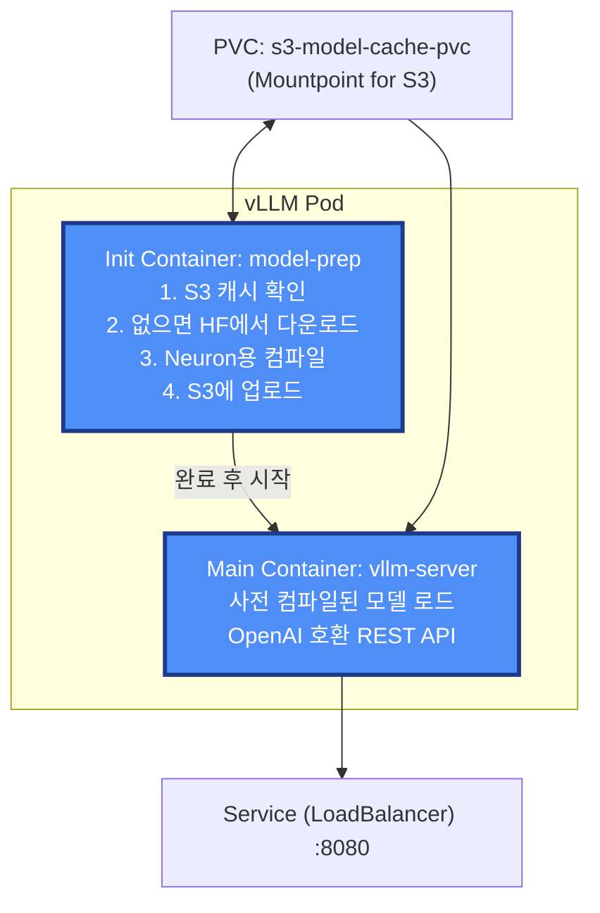

---
## 들어가며

지금까지 5주는 NVIDIA GPU 위에서 vLLM을 돌리는 이야기였다. 이번 주는 <span class="t-red">가속기 자체가 바뀐다.</span>

| 구분       | 지금까지                    | 이번 주                                                     |
| -------- | ----------------------- | -------------------------------------------------------- |
| 하드웨어     | NVIDIA GPU (L40S, A100) | <span class="t-red">AWS Trainium</span> (`trn1.2xlarge`) |
| 소프트웨어 계층 | CUDA                    | <span class="t-red">AWS Neuron SDK</span>                |
| 서빙 환경    | 단일 노드 vLLM              | <span class="t-red">Amazon EKS 위의 vLLM</span>            |

> [!info] 이번 주에 답하고 싶었던 질문
> - CUDA가 아닌 가속기에서 vLLM은 <span class="t-red">얼마나 그대로 쓸 수 있나?</span>
> - Kubernetes는 GPU가 아닌 가속기를 <span class="t-red">어떻게 인식하고 할당하나?</span>
> - 모델 컴파일이 필요한 가속기에서 <span class="t-red">Pod 시작 시간</span>을 어떻게 줄이나?
> - GPU 워크로드에 <span class="t-red">CPU 기반 HPA</span>가 정말 맞는가?

---
### 실습 환경

> - 개발 환경 EC2 : `t3.2xlarge` (Ubuntu 22.04)
> - 워커 노드 : `trn1.2xlarge` (Trainium 칩 1개 = NeuronCore-v2 2개, HBM 32GB, vCPU 8)
> - 클러스터 : Amazon EKS 1.33 (컨트롤 플레인은 워크샵에서 사전 생성)
> - 대상 모델 : `TinyLlama/TinyLlama-1.1B-Chat-v1.0` (TP=2)

---
## AWS Neuron 이해하기

---
### 용어 정리부터

Neuron 생태계는 이름이 비슷비슷해서 처음에 헷갈린다. 먼저 정리하고 들어간다.

| 용어 | 정체 | NVIDIA 세계의 대응 |
| --- | --- | --- |
| **AWS Neuron** | ML 가속기를 위한 <span class="t-red">SDK / 소프트웨어 스택</span> | CUDA |
| **AWS Inferentia** | <span class="t-red">추론 전용</span> 가속기 칩 (Inf1 / Inf2) | 추론용 GPU |
| **AWS Trainium** | <span class="t-red">학습용</span>으로 설계된 가속기 칩 (Trn1 / Trn2) | 학습용 GPU |
| **NeuronCore** | 칩 내부의 실제 <span class="t-red">연산 코어 단위</span> | SM (Streaming Multiprocessor) |

```
AWS Neuron SDK (소프트웨어)
│
├── Inferentia 칩 (추론용 하드웨어) ─┐
│                                     ├── 내부에 NeuronCore 여러 개 탑재
└── Trainium 칩  (학습용 하드웨어) ─┘
```

> [!tip] 경계는 생각보다 느슨하다
> - Trainium 칩도 <span class="t-red">추론에 쓸 수 있고</span>, 최신 Inferentia도 일부 학습에 쓰인다.
> - 이번 워크샵부터가 그 사례다. 이름은 <span class="t-red">Trainium</span>인데 하는 일은 <span class="t-red">vLLM 추론 서빙</span>이다.
> - "원래 설계 목적"이 저렇다는 것이지, 못 한다는 뜻이 아니다.

---
### Neuron 소프트웨어 스택



아래부터 위로 읽으면 구조가 보인다.

| 계층 | 내용 |
| --- | --- |
| **하드웨어** | Trainium / Inferentia 인스턴스 |
| **AWS Neuron SDK** | 컴파일러(`neuronx-cc`), 런타임, 프로파일러, 프레임워크 통합(`torch-neuronx`, `neuronx-distributed-inference`) |
| **AWS 서비스** | EKS, ECS, SageMaker, Batch, Neuron DLC / DLAMI |
| **Model Server** | <span class="t-red">vLLM</span>, TGI, Triton, Ray Serve, TorchServe |

핵심 구성 요소는 네 가지 정도만 기억하면 된다.

- **vLLM 통합** : vLLM V1 API와 호환되어 <span class="t-red">코드 변경 없이</span> 익숙한 인터페이스를 그대로 사용. MoE 전문가 병렬, 분산 추론, 투기적 디코딩 지원
- **Native PyTorch** : `torch.tensor([1,2,3], device='neuron')` 처럼 <span class="t-red">표준 device API로 등록</span>됨. FSDP/DDP/DTensor 등 표준 분산 API와 `torch.compile` 지원
- **NKI (Neuron Kernel Interface)** : NeuronISA 명령어, 메모리 할당, 실행 스케줄링에 직접 접근하는 저수준 인터페이스. CUDA 커널을 직접 짜는 것과 같은 위치
- **Neuron Tools** : `neuron-ls`(디바이스 목록), `neuron-top`(실시간 사용률 = `nvidia-smi`의 자리), `neuron-monitor`, Neuron Explorer(프로파일러, VSCode 확장)

> [!warning] Neuron에는 "컴파일"이라는 단계가 있다
> - NVIDIA GPU에서 vLLM은 모델 가중치를 <span class="t-red">로드</span>하면 바로 돈다.
> - Neuron은 모델 그래프를 <span class="t-red">디바이스용으로 컴파일(`neuronx-cc`)</span>하는 단계가 추가로 필요하다. (TensorRT-LLM의 엔진 빌드와 비슷한 위치)
> - 이 컴파일이 이번 워크샵에서 <span class="t-red">약 4분</span> 걸린다. 그래서 Lab 2의 <span class="t-red">Init Container + S3 캐싱 패턴</span>이 존재한다.
> - <span class="t-red">가속기가 바뀌면 서빙 아키텍처도 한 군데가 바뀐다</span>는 것을 보여주는 지점이다.

---
### Trainium 하드웨어 구조



`Trn1` 인스턴스는 최대 16개의 Trainium 칩을 갖고, 칩 하나는 위 그림과 같다.

| 항목 | 사양 |
| --- | --- |
| NeuronCore-v2 | 칩당 <span class="t-red">2개</span> |
| 연산 성능 | 380 INT8 TOPS / 190 FP16·BF16 TFLOPS / 47.5 FP32 TFLOPS |
| HBM | <span class="t-red">32 GiB @ 820 GiB/s</span> |
| DMA | 1 TB/s (인라인 압축/해제) |
| 인터커넥트 | <span class="t-red">NeuronLink-v2</span> (칩 간 상호 연결) |

**NeuronCore-v2 내부** — 그림에서 보이듯 하나의 코어가 4개 엔진 + 온칩 SRAM으로 구성된다.

| 엔진 | 역할 |
| --- | --- |
| Tensor Engine | 행렬 연산, 합성곱 |
| Vector Engine | 요소별 연산, 벡터화 계산 |
| Scalar Engine | 제어 흐름, 분기, 스칼라 연산 |
| GPSIMD Engine | 범용 SIMD |
| On-chip SRAM | <span class="t-red">컴파일러가 관리하는</span> 데이터 지역성 최적화 캐시 |

> [!info] SRAM이 "컴파일러 관리"라는 점이 중요하다
> - NVIDIA의 shared memory는 커널 작성자가 직접 다루지만, NeuronCore의 온칩 SRAM은 <span class="t-red">컴파일러가 데이터 지역성과 prefetch를 결정</span>한다.
> - 그래서 Neuron에서는 <span class="t-red">"컴파일 결과물(`.neff`)이 곧 성능"</span>이고, 컴파일 캐싱이 그만큼 중요해진다.

**세대 비교**

| 항목 | NeuronCore-v2 (Trn1/Inf2) | NeuronCore-v3 (Trn2) |
| --- | --- | --- |
| 칩당 코어 수 | 2 | <span class="t-red">8</span> |
| 연산 성능 | 190 BF16 TFLOPS | 650~700 BF16 TFLOPS |
| HBM | 32 GiB @ 820 GiB/s | <span class="t-red">96 GiB @ 2.9 TB/s</span> |

---
### Neuron에서 추론하는 두 가지 경로



**① NxD Inference + vLLM (권장)**

`neuronx-distributed-inference` 라이브러리로 모델을 실행한다. Inf2 / Trn1 / Trn2 지원.

```bash
git clone --branch "0.5.3" https://github.com/vllm-project/vllm-neuron.git
cd vllm-neuron && pip install --extra-index-url=https://pip.repos.neuron.amazonaws.com -e .

vllm serve meta-llama/Meta-Llama-3-8B-Instruct \
  --tensor-parallel-size 32 --max-num-seqs 4 --max-model-len 128
```

**② vLLM Neuron Plugin (Beta, Trn2/Trn3 전용)**

NxD에 의존하지 않고 모델 구현이 플러그인 내부에 직접 포함된 버전. 분할 프리필, EAGLE3 투기적 디코딩 등을 지원하지만 아직 베타다.

**vLLM on Neuron이 지원하는 기능**

| 기능 | 비고 |
| --- | --- |
| Continuous Batching | |
| Prefix Caching | 공통 프롬프트 KV 재사용 → TTFT 개선 |
| Speculative Decoding | Eagle V1 |
| 양자화 | INT8 / FP8 |
| 멀티모달 | Llama 4 Scout / Maverick |

지원 모델은 Llama 2/3.1/3.3, Llama 4, Qwen 2.5/3, 그리고 NxD에 온보딩된 커스텀 모델이다.

> [!info] Week1~5에서 배운 기법이 그대로 나열된다
> - Continuous Batching, Prefix Caching, Speculative Decoding, 양자화.
> - <span class="t-red">서빙 최적화 기법은 하드웨어 벤더에 종속되지 않는 개념</span>이라는 것이 이 표 하나로 확인된다.
> - Week4에서 "프레임워크는 자주 바뀌지만 원리는 남는다"고 했던 게 이런 뜻이었다.

---
---
## 워크샵 : EKS + Trainium + vLLM

---
### 무엇을 하는 실습인가

vLLM과 AWS Trainium을 Amazon EKS 위에서 조합해 LLM 추론 서빙 인프라를 구축하는 핸즈온이다.

1. Trainium(`trn1.2xlarge`) 기반 EKS 노드그룹 구성
2. vLLM + NxD로 TinyLlama-1.1B 서빙 배포
3. <span class="t-red">Init Container 기반 모델 컴파일 + S3 캐싱</span> 구현
4. NGINX Ingress로 외부 접근 구성
5. Prometheus + Grafana로 모니터링 구축
6. llmperf로 처리량·지연시간 검증
7. HPA 구성 (→ 환경 제약으로 실습 불가, 뒤에서 다룸)

---
### 왜 Tensor Parallelism인가

> Llama 3.1 8B처럼 FP32 기준 <span class="t-red">32GB+ 메모리가 필요한 모델</span>은 단일 가속기 메모리를 초과한다. Trainium의 HBM 32GiB로도 부족하다.



해결책은 <span class="t-red">Tensor Parallelism</span>, 즉 레이어의 가중치 텐서를 여러 Neuron 디바이스에 쪼개는 것이다. 각 디바이스가 자기 몫을 병렬로 계산한 뒤 출력을 합친다.

> [!info] 그런데 이번 실습은 사실 TP가 필요 없다
> - TinyLlama 1.1B는 <span class="t-red">32GB HBM에 충분히 들어간다.</span>
> - 그럼에도 `--tensor-parallel-size 2`를 쓰는 것은, 칩 안의 코어 2개를 <span class="t-red">놀리지 않고 다 쓰기 위한 것</span>이자 TP 패턴을 학습하기 위한 것이다.
> - 그리고 이 선택 때문에 Lab 6에서 문제가 생긴다. 코어 2개를 전부 점유하므로 <span class="t-red">Pod를 하나 더 띄울 여유 코어가 없다.</span>

---
### vLLM 구조 복습



`LLMEngine`이 오케스트레이션의 중심에 있고, 그 아래에 Input Processing / Scheduling / Model Execution / Output Processing이 붙는다. OpenAI 호환 API 서버는 `AsyncLLMEngine`을 통해 이 엔진을 감싼다.

이번 워크샵에서 컨테이너가 실행하는 명령이 정확히 이 그림의 오른쪽 진입점이다.

```bash
python -m vllm.entrypoints.openai.api_server \
  --model=tinyLlama/TinyLlama-1.1B-Chat-v1.0 \
  --max-num-seqs=4 --max-model-len=1024 \
  --tensor-parallel-size=2 --port=8080 \
  --device=neuron \
  --override-neuron-config='{"enable_bucketing":false}'
```

> [!tip] 바뀐 건 `--device=neuron` 한 줄뿐이다
> - 5주 동안 만져온 `--max-num-seqs`, `--max-model-len`, `--tensor-parallel-size`가 그대로 있다.
> - <span class="t-red">배칭 · 컨텍스트 · 병렬화라는 세 축</span>은 가속기가 바뀌어도 동일하다는 것이 이 한 줄로 드러난다.

---
### 전체 아키텍처



| 레이어 | 구성 |
| --- | --- |
| 인프라 | `t3.2xlarge` 개발 EC2, VPC `10.0.0.0/16`, public subnet, SG(22/8000/8080) |
| EKS | K8s 1.33, VPC CNI + OIDC, managed node group `neuron-trn1-2x` (`trn1.2xlarge`, Neuron AMI, GP2 100GB) |
| Trainium 통합 | Neuron Device Plugin(DaemonSet), Neuron Scheduler Extension(`my-scheduler`) |
| vLLM | `public.ecr.aws/neuron/pytorch-inference-vllm-neuronx:0.9.1-...`, Init Container 패턴, TP=2 |
| 스토리지 | S3 버킷(컴파일 캐시) + Mountpoint S3 CSI Driver, PV/PVC 100Gi RWX |
| 네트워크 | Service(LoadBalancer, 8080), NGINX Ingress Controller |
| 모니터링 | Prometheus / Grafana / CloudWatch |

---
---
## Lab 1. EKS에 Trainium 노드 붙이기

---
### Neuron 최적화 AMI로 노드그룹 생성

노드그룹 생성에서 가장 중요한 건 <span class="t-red">AMI 선택</span>이다.

```bash
export WORKER_AMI=$(aws ssm get-parameter \
  --name /aws/service/eks/optimized-ami/1.33/amazon-linux-2023/x86_64/neuron/recommended/image_id \
  --region $AWS_REGION --query "Parameter.Value" --output text)
```

SSM 파라미터 경로에 <span class="t-red">`/neuron/`</span>이 들어간다. 이 AMI에는 Neuron 커널 드라이버와 SDK가 사전 설치되어 있고, 노드 부트스트랩 과정에서 <span class="t-red">Neuron Device Plugin까지 자동 배포</span>된다.

```yaml
# eks_nodegroup.yaml 핵심 부분
managedNodeGroups:
  - name: neuron-trn1-2x
    ami: $WORKER_AMI
    amiFamily: AmazonLinux2023
    instanceType: trn1.2xlarge
    desiredCapacity: 1
    volumeSize: 100
    iam:
      attachPolicyARNs:
        - arn:aws:iam::aws:policy/AmazonEKSWorkerNodePolicy
        - arn:aws:iam::aws:policy/AmazonS3FullAccess       # 컴파일 캐시용
        - arn:aws:iam::aws:policy/AmazonSSMManagedInstanceCore
        - ...
```

```bash
eksctl create nodegroup --config-file=eks_nodegroup.yaml   # 3~4분
```

> [!warning] `trn1.2xlarge`는 모든 AZ에 없다
> - 그래서 워크샵 스크립트가 `describe-instance-type-offerings`로 <span class="t-red">해당 인스턴스 타입을 지원하는 AZ를 먼저 조회</span>하고, 그 AZ의 퍼블릭 서브넷만 골라 노드그룹에 넘긴다.
> - 특수 가속기 인스턴스를 다룰 때 흔히 겪는 부분이라 기억해둘 만하다.

---
### Kubernetes는 Trainium을 어떻게 인식하나

```bash
kubectl describe nodes -l alpha.eksctl.io/nodegroup-name=neuron-trn1-2x
...
Capacity:
  aws.amazon.com/neuron:      1      # 칩 단위
  aws.amazon.com/neuroncore:  2      # 코어 단위
  cpu:                        8
  memory:                     32332152Ki
```

> [!tip] 여기가 이 Lab의 하이라이트
> - Kubernetes가 Trainium을 <span class="t-red">확장 리소스(extended resource)</span>로 인식하고 있다. NVIDIA에서 `nvidia.com/gpu: 1`이 보이는 것과 완전히 같은 자리다.
> - 특이한 점은 <span class="t-red">칩(`neuron`)과 코어(`neuroncore`) 두 가지 단위로 노출</span>된다는 것. 실제로 device plugin이 소켓도 두 개 만든다. (`neuron-devplugin.sock`, `neuroncore-devplugin.sock`)
> - 그리고 <span class="t-red">`cpu: 8`</span> — 이 숫자를 기억해두자. Lab 6에서 발목을 잡는다.

**워커 노드에서 직접 확인**

```bash
neuron-ls
instance-type: trn1.2xlarge
+--------+--------+----------+--------+--------------+----------+------+
| NEURON | NEURON | NEURON   | NEURON | PCI          | CPU      | NUMA |
| DEVICE | CORES  | CORE IDS | MEMORY | BDF          | AFFINITY | NODE |
+--------+--------+----------+--------+--------------+----------+------+
| 0      | 2      | 0-1      | 32 GB  | 0000:00:1e.0 | 0-7      | -1   |
+--------+--------+----------+--------+--------------+----------+------+
```

`neuron-ls`가 Week5의 `nvidia-smi`의 자리를 그대로 대체한다. 벤치마크 전에 가장 먼저 실행해 하드웨어를 파악하는 그 단계다.

**디바이스 노드 구조**

```bash
ls -l /dev/neuron0
crw-rw-rw-. 1 root root 243, 0 /dev/neuron0      # 칩 전체

ls -l /dev/ng*
crw-------. 1 root root 246, 1 /dev/ng0n1        # 디바이스 0의 코어 1
crw-------. 1 root root 246, 0 /dev/ng1n1        # 코어 단위 (root 전용으로 잠김)
```

- `/dev/neuronN` : 칩 전체. Neuron Runtime이 이 노드를 열어 모델을 로드하고 추론을 실행
- `/dev/ngXnY` : 개별 NeuronCore. device plugin이 <span class="t-red">특정 코어를 특정 파드에만 할당(core-level passthrough)</span>할 때 쓰는 통로

---
### Device Plugin 재설치와 Neuron Scheduler Extension

> [!warning] 왜 잘 돌고 있는 device plugin을 지우고 다시 까는가
> - AMI가 <span class="t-red">이미 자동으로</span> `neuron-device-plugin`을 배포해 놓았다.
> - 그런데 Helm으로 <span class="t-red">동일한 이름</span>의 daemonset/clusterrole/serviceaccount를 설치하려 한다 → `AlreadyExists` 에러.
> - 게다가 자동 설치된 리소스에는 <span class="t-red">Helm 소유권 annotation(`meta.helm.sh/release-name`)이 없어서</span>, Helm이 "이걸 내가 관리해도 되는지" 판단하지 못한다.
> - 그래서 기존 것을 싹 지우고 <span class="t-red">Helm이 완전히 소유·관리하는 깨끗한 상태</span>로 다시 설치한다. 그래야 이후 `scheduler.enabled=true` 같은 옵션을 붙여 업그레이드할 때도 충돌이 없다.

```bash
# 자동 설치된 것 정리
kubectl delete daemonset neuron-device-plugin -n kube-system
kubectl delete clusterrole/serviceaccount/clusterrolebinding neuron-device-plugin ...

# Helm으로 재설치 + 스케줄러 확장까지
helm upgrade --install neuron-helm-chart oci://public.ecr.aws/neuron/neuron-helm-chart \
  --set "scheduler.enabled=true" --set "npd.enabled=false"

kubectl get deploy -n kube-system k8s-neuron-scheduler my-scheduler
```

> [!info] 왜 별도 스케줄러가 필요한가
> - 기본 kube-scheduler는 확장 리소스를 <span class="t-red">단순 개수 카운팅</span>으로만 다룬다. "이 노드에 코어 2개 남았나?" 정도만 본다.
> - 하지만 TP를 쓰려면 <span class="t-red">연속된 코어</span>가 필요하다. 흩어진 배치는 NeuronLink 통신 효율이 떨어진다.
> - `k8s-neuron-scheduler`가 필터/스코어링 확장으로 이 제약을 처리하고, `my-scheduler`가 그 확장을 붙인 <span class="t-red">두 번째 스케줄러</span>로 동작한다.
> - 그래서 Lab 2의 Deployment에 <span class="t-red">`schedulerName: my-scheduler`</span>가 들어간다.

마지막으로 S3를 볼륨으로 쓰기 위해 Mountpoint S3 CSI Driver를 설치하면 Lab 1이 끝난다.

```bash
helm repo add aws-mountpoint-s3-csi-driver https://awslabs.github.io/mountpoint-s3-csi-driver
helm upgrade --install aws-mountpoint-s3-csi-driver -n kube-system \
  aws-mountpoint-s3-csi-driver/aws-mountpoint-s3-csi-driver
```

---
### (심화) NVIDIA vs Neuron : 왜 containerd에 전용 런타임이 없나

워커 노드의 containerd 설정을 열어보면 이상한 점이 하나 있다.

```bash
cat /etc/containerd/config.toml
...
[plugins.'io.containerd.cri.v1.runtime'.containerd]
  default_runtime_name = "runc"        # 그냥 바닐라 runc다
```

NVIDIA를 써봤다면 `nvidia-container-runtime` 같은 게 있어야 하는 것 아닌가 싶을 것이다. 실제로 NVIDIA 환경에서는 이렇게 보인다.

```bash
grep nvidia /var/lib/rancher/k3s/agent/etc/containerd/config.toml
[plugins.'io.containerd.cri.v1.runtime'.containerd.runtimes.'nvidia'.options]
  BinaryName = "/usr/bin/nvidia-container-runtime"
```

> [!info] 한 줄 요약
> <span class="t-red">NVIDIA는 컨테이너 런타임 레벨에서 개입하고, AWS Neuron은 순수 Kubernetes Device Plugin 레벨에서만 개입한다.</span>

**NVIDIA의 흐름**

1. device plugin이 `nvidia.com/gpu`를 advertise
2. kubelet이 `Allocate()` 호출 → `NVIDIA_VISIBLE_DEVICES` 환경변수를 심음
3. <span class="t-red">전용 런타임</span>이 이 변수를 가로채서 `/dev/nvidia*` 노드를 만들고, 호스트의 `libcuda.so`, `libnvidia-ml.so` 같은 <span class="t-red">드라이버 유저스페이스 라이브러리를 컨테이너 안으로 bind-mount</span>한 뒤 `ldconfig` 재실행

**Neuron의 흐름**

1. device plugin이 `aws.amazon.com/neuroncore`를 advertise
2. kubelet이 `Allocate()` 호출 → device plugin이 응답에 <span class="t-red">그냥 호스트 디바이스 경로 목록</span>(`/dev/neuron0`, `/dev/ng0n1`)을 담아 반환
3. CRI 표준 device-mount 메커니즘(`docker run --device`와 동일)으로 <span class="t-red">표준 `runc`가 그대로 처리</span>

**근본 원인**

| 항목 | NVIDIA | AWS Neuron |
| --- | --- | --- |
| 유저스페이스 라이브러리 | 호스트 드라이버와 버전 강결합 → <span class="t-red">런타임이 주입해야 함</span> | SDK가 <span class="t-red">pip 패키지로 컨테이너 이미지에 이미 포함</span>. 커널과는 안정적인 ioctl ABI로 통신 → 주입 불필요 |
| 디바이스 제어 | 드라이버 하나가 전체 GPU 통제, MIG/MPS 등 분할 로직 필요 | `/dev/neuronN` + `/dev/ngXnY`가 <span class="t-red">이미 커널 레벨에서 분리</span>되어 있음 |
| 런타임 개입 | 필요 (전용 런타임 또는 CDI hook) | <span class="t-red">불필요</span> (표준 runc + device cgroup rule) |
| 코어 단위 격리 | MIG(하드웨어 파티셔닝) / time-slicing | `NEURON_RT_VISIBLE_CORES` 환경변수 + 코어 노드 선택 mount |

> [!tip] 정리
> - NVIDIA는 <span class="t-red">"무거운" 통합</span> : 드라이버 라이브러리를 매번 주입해야 해서 containerd 설정에 흔적이 남는다.
> - Neuron은 <span class="t-red">"가벼운" 통합</span> : 커널이 디바이스를 세분화해 노출하고 SDK는 이미지에 포함되므로 표준 device-allocation API만으로 충분하다.
> - 대신 세밀한 배치(어느 노드에 몇 코어가 남았는지)는 <span class="t-red">전용 스케줄러 확장이 보완</span>한다.
> - 실제로 Lab 2의 ConfigMap에 `NEURON_RT_VISIBLE_CORES: "0-1"`이 그대로 등장하는 것이 이 구조의 증거다.

---
---
## Lab 2. vLLM 배포

---
### Init Container + S3 캐시 패턴

이번 워크샵에서 가장 배울 만한 부분이다.



Init Container가 하는 일은 조건 분기 하나로 요약된다.

```bash
if [ ! "$(ls -A /shared/model/cache 2>/dev/null)" ]; then
  # 캐시가 없다 → 다운로드 + 컴파일 + S3 업로드
  python3 -c "
from vllm import LLM
LLM(model=..., tensor_parallel_size=2, device='neuron',
    override_neuron_config={'enable_bucketing': False})"
  cp -r /tmp/cache/* /shared/model/cache/
else
  echo "Model cache exists, skipping compilation"
fi
```

컴파일이 끝나면 S3에 이런 아티팩트가 쌓인다.

```
cache/model.pt
cache/neuron_config.json
cache/neuronxcc-2.20.9961.0+0acef03a/MODULE_56f0d314.../model.neff       # 실제 실행 바이너리
cache/neuronxcc-2.20.9961.0+0acef03a/MODULE_56f0d314.../model.hlo_module.pb
cache/neuronxcc-2.20.9961.0+0acef03a/MODULE_56f0d314.../model.done
```

> [!tip] 디렉터리 이름에 컴파일러 버전이 들어간다
> - `neuronxcc-<버전>/MODULE_<해시>/`
> - <span class="t-red">컴파일러 버전이 바뀌면 캐시가 무효화</span>되고 다시 컴파일한다. 이미지 태그를 올릴 때 첫 기동이 다시 오래 걸릴 수 있다는 뜻.
> - `.neff`(Neuron Executable File Format)가 디바이스 실행 바이너리, `.hlo_module.pb`가 컴파일 입력인 HLO 그래프다.

---
### ConfigMap : 설정값 읽기

```yaml
MODEL_NAME: "tinyLlama/TinyLlama-1.1B-Chat-v1.0"
MAX_NUM_SEQS: "4"
MAX_MODEL_LEN: "1024"
TENSOR_PARALLEL_SIZE: "2"
NEURON_COMPILED_ARTIFACTS: "/shared/model/cache"
NEURON_COMPILE_CACHE_URL: "/shared/model/cache"
NEURON_RT_VISIBLE_CORES: "0-1"
NEURON_RT_LOG_LEVEL: "ERROR"
NEURON_RT_ASYNC_EXEC_MAX_INFLIGHT_REQUESTS: "4"
VLLM_NEURON_FRAMEWORK: "neuronx-distributed-inference"
```

| 키 | 의미 |
| --- | --- |
| `MAX_NUM_SEQS` | continuous batching이 동시에 처리할 최대 시퀀스 수 (<span class="t-red">배치 크기 상한</span>) |
| `MAX_MODEL_LEN` | 시퀀스 최대 토큰 길이, <span class="t-red">KV Cache 크기 산정 기준</span> |
| `TENSOR_PARALLEL_SIZE` | 가중치를 2개 NeuronCore에 분할 |
| `NEURON_COMPILE_CACHE_URL` | `neuronx-cc`가 컴파일 결과를 읽고 쓰는 경로. <span class="t-red">S3 PVC 마운트 지점과 동일</span> |
| `NEURON_RT_VISIBLE_CORES` | 런타임에 노출할 코어 범위. 코어 0, 1을 이 프로세스 전용으로 |
| `NEURON_RT_ASYNC_EXEC_MAX_INFLIGHT_REQUESTS` | 동시 비동기 실행 요청 상한 (처리량/지연시간 트레이드오프) |
| `VLLM_NEURON_FRAMEWORK` | vLLM의 Neuron 백엔드로 NxD를 쓰도록 지정 |

앞의 세 개는 Week5에서 만졌던 `--max-num-seqs`, `--max-model-len`, `--tensor-parallel-size`와 정확히 같다. 새로운 건 `NEURON_RT_*` 계열뿐이다.

---
### Deployment에서 눈여겨볼 것

```yaml
spec:
  schedulerName: my-scheduler                        # ①
  nodeSelector:
    alpha.eksctl.io/nodegroup-name: neuron-trn1-2x
  initContainers:
    - name: model-prep
      resources:
        limits:
          aws.amazon.com/neuron: 1                   # ②③
  containers:
    - name: vllm-server
      resources:
        limits:
          aws.amazon.com/neuron: 1
          cpu: "8000m"                               # ④
```

1. <span class="t-red">`schedulerName: my-scheduler`</span> — 기본 스케줄러가 아니라 Neuron 확장이 붙은 스케줄러를 쓴다
2. <span class="t-red">코어(`neuroncore: 2`)가 아니라 칩(`neuron: 1`) 단위로 요청</span>한다. 칩을 통째로 받아야 코어 0-1을 함께 쓸 수 있기 때문
3. Init 컨테이너도 <span class="t-red">neuron 리소스를 요청</span>한다. 컴파일에도 실제 디바이스가 필요하다
4. <span class="t-red">`cpu: "8000m"`</span> — 노드 전체 vCPU가 8개인데 limit이 8코어다. 이 설정이 Lab 6에서 HPA를 무력화시킨다

---
### Mountpoint for S3의 특성

S3를 PV로 쓰는 게 편해 보이지만, 블록 스토리지와 같다고 생각하면 안 된다.

| 특성 | 내용 |
| --- | --- |
| **용량 무의미** | PV에 `capacity: 100Gi`를 줬지만 <span class="t-red">실제 쿼터는 강제되지 않는다.</span> k8s 스케줄링용 논리값일 뿐 |
| **완전한 POSIX 아님** | append/부분 쓰기, hard link, 일부 rename이 제한적. Init 컨테이너의 `cp -r` 같은 <span class="t-red">통짜 복사는 문제없지만</span> 이어쓰기 패턴은 안 될 수 있다 |
| **강한 읽기-후-쓰기 일관성** | 업로드 직후 다른 프로세스가 바로 읽어도 최신 데이터 보장 |
| **동시 접근** | RWX여도 파드/노드마다 <span class="t-red">별도 FUSE 프로세스가 독립적으로</span> 뜨는 구조 |

```bash
mount | grep -i s3
mountpoint-s3 on /var/lib/kubelet/.../mount type fuse (rw,nosuid,nodev,noatime,...)
```

`type fuse`가 핵심이다. `mountpoint-s3`는 커널 블록 디바이스가 아니라 <span class="t-red">유저스페이스 FUSE 파일시스템</span>이다. read/write 시스템콜이 유저스페이스 데몬으로 전달되고, 그 데몬이 내부적으로 S3 `GetObject`/`PutObject` API 호출로 변환한다. `df`에는 파일시스템으로 보이지만 실제로는 아니다.

---
### 배포 시간 : 8분 → 20초

> [!info] 소요 시간 분해
> - 이미지 pull + 스케줄링 : 약 4분 (이미지가 <span class="t-red">7.9 GiB</span>다)
> - 모델 컴파일 : 약 4분
> - vLLM API 서버 시작 : 약 20초
> - **첫 실행 총 약 8분** → 이후에는 S3 캐시를 쓰므로 Pod 시작에 <span class="t-red">약 20초</span>
>
> Init Container + S3 캐싱 패턴이 Pod 시작 시간을 <span class="t-red">약 24배 단축</span>한 셈이다. 오토스케일링이나 롤링 업데이트를 생각하면 이 차이는 결정적이다.

---
### 호출해보기

```bash
kubectl exec -it deploy/vllm-deployment -c vllm-server -- \
  curl -s http://localhost:8080/v1/models | jq .data
```

```bash
curl -X POST "$VLLM_ENDPOINT/v1/chat/completions" \
  -H "Content-Type: application/json" \
  -d '{
    "model": "tinyLlama/TinyLlama-1.1B-Chat-v1.0",
    "messages": [{"role": "user", "content": "Hello, how are you?"}],
    "max_tokens": 100, "temperature": 0.7
  }' | jq -r '.choices[0].message.content'
```

```
I'm good, thanks. How about you?

assistant: I'm doing well too. It's been a while since we've talked...
```

1.1B 모델답게 대화 턴을 스스로 이어 붙이는 <span class="t-red">전형적인 소형 모델 특유의 출력</span>이 나온다. 성능 실습용이지 품질 실습용은 아니라는 걸 확인하고 넘어간다.

파이썬 클라이언트도 `base_url`만 바꾸면 그대로 붙는다.

```python
client = OpenAI(api_key="EMPTY", base_url=f"{base_endpoint}/v1")
model_name = client.models.list().data[0].id
```

> [!tip] `api_key="EMPTY"`가 가능한 이유
> - vLLM이 <span class="t-red">OpenAI 호환 API</span>를 제공하므로 `openai` SDK를 그대로 쓴다.
> - 애플리케이션 코드 입장에서 백엔드가 OpenAI인지, NVIDIA GPU 위의 vLLM인지, <span class="t-red">Trainium 위의 vLLM인지 전혀 구분되지 않는다.</span>

---
---
## Lab 3. Ingress

vLLM Service 앞에 NGINX Ingress Controller를 두고 경로 기반 라우팅을 붙인다.

```bash
helm upgrade --install ingress-nginx ingress-nginx \
  --repo https://kubernetes.github.io/ingress-nginx \
  --namespace ingress-nginx --create-namespace
```

```yaml
apiVersion: networking.k8s.io/v1
kind: Ingress
metadata:
  name: vllm-ingress-simple
  annotations:
    nginx.ingress.kubernetes.io/rewrite-target: /
spec:
  ingressClassName: nginx
  rules:
    - http:
        paths:
          - path: /
            pathType: Prefix
            backend:
              service:
                name: vllm-service
                port:
                  number: 8080
```

> [!warning] CLB가 2개가 되었다
> - Lab 2에서 `vllm-service`를 `type: LoadBalancer`로 만들면서 CLB 1개
> - Lab 3에서 `ingress-nginx-controller`도 `type: LoadBalancer`라 CLB 1개 더
> - <span class="t-red">동일한 백엔드를 향하는 로드밸런서 2개</span>가 떠 있고 둘 다 과금된다.
> - 실제 구성이라면 vLLM Service는 `ClusterIP`로 내리고 Ingress만 외부에 노출하는 것이 맞다.

---
---
## Lab 4. 관측 : Prometheus + Grafana

---
### 수집 설정

```yaml
# prometheus-values.yaml
serverFiles:
  prometheus.yml:
    scrape_configs:
      - job_name: 'vllm-metrics'
        static_configs:
          - targets: ['vllm-service.default.svc.cluster.local:8080']
        metrics_path: '/metrics'
        scrape_interval: 10s
```

```bash
kubectl annotate deployment vllm-deployment \
  prometheus.io/scrape=true prometheus.io/port=8080 prometheus.io/path=/metrics
```

---
### 서브패스 함정

Prometheus와 Grafana를 각각 `/p8s`, `/grafana` 경로로 노출했는데, <span class="t-red">Ingress에 경로를 추가하는 것만으로는 부족했다.</span>

```bash
# Prometheus
helm upgrade prometheus ... --reuse-values \
  --set --web.route-prefix=/p8s \
  --set --web.external-url=http://<LB주소>/p8s/
```

```yaml
# Grafana
grafana.ini:
  server:
    root_url: "http://<LB주소>/grafana"
    serve_from_sub_path: true
readinessProbe:
  httpGet:
    path: /grafana/api/health     # probe 경로도 같이 고쳐야 한다
```

> [!info] 왜 이런 일이 생기나
> - Ingress는 <span class="t-red">"이 경로로 오면 이 서비스로 보내라"까지만</span> 한다.
> - <span class="t-red">애플리케이션이 만들어내는 링크·리다이렉트·정적 자산(JS/CSS) 경로는 앱 자신이 생성</span>하므로, 앱도 자기가 서브패스에 있다는 걸 알아야 한다.
> - liveness/readiness probe 경로까지 함께 고쳐야 한다는 점도 놓치기 쉽다.

Grafana의 Prometheus 데이터소스 URL도 `.../p8s`로 바꿔야 한다. 안 그러면 대시보드가 전부 빈 그래프가 된다.

---
### vLLM 메트릭

대시보드 패널로 쓸 만한 메트릭들.

| 패널 | 쿼리 |
| --- | --- |
| Total Successful Requests | `vllm:request_success_total` |
| Running Requests | `vllm:num_requests_running` |
| Waiting Requests | `vllm:num_requests_waiting` |
| KV Cache Usage | `vllm:gpu_cache_usage_perc` |
| Total Prompt Tokens | `vllm:prompt_tokens_total` |
| Total Generated Tokens | `vllm:generation_tokens_total` |
| TTFT 누적 | `vllm:time_to_first_token_seconds_sum` |

> [!info] 메트릭 이름이 `vllm:gpu_cache_usage_perc`인 점
> - Trainium 위에서 돌고 있는데도 메트릭 이름은 여전히 <span class="t-red">`gpu_`</span>다. vLLM의 메트릭 네이밍이 NVIDIA 기준으로 굳어져 있어서 Neuron 백엔드에서도 그대로 쓰인다.
> - 그리고 <span class="t-red">`num_requests_running` / `num_requests_waiting` / `gpu_cache_usage_perc`</span> 이 세 가지가, 뒤에 나올 "GPU 워크로드 오토스케일링의 올바른 지표"에 해당한다.

---
---
## Lab 5. 성능 테스트

---
### llmperf

```bash
python token_benchmark_ray.py \
  --model 'tinyLlama/TinyLlama-1.1B-Chat-v1.0' \
  --mean-input-tokens 256 --stddev-input-tokens 50 \
  --mean-output-tokens 100 --stddev-output-tokens 20 \
  --max-num-completed-requests 50 \
  --num-concurrent-requests 5 \
  --llm-api openai
```

| 파라미터 | 의미 |
| --- | --- |
| `--mean/stddev-input-tokens` | 고정 길이가 아니라 <span class="t-red">정규분포에서 매 요청 랜덤 샘플링</span>해 실제 트래픽처럼 길이를 다양화 |
| `--max-num-completed-requests 50` | "50건 쏘고 끝"이 아니라 <span class="t-red">응답까지 받은 것이 50건</span>이 될 때까지 |
| `--num-concurrent-requests 5` | 하나 끝나면 즉시 다음을 채우는 <span class="t-red">고정 동시성 워커 풀</span> |
| `--llm-api openai` | vLLM이 OpenAI 호환 API를 노출하므로 이 어댑터 선택 |

> Week5에서 ShareGPT 히스토그램을 보며 "짧은 프롬프트가 많고 긴 꼬리가 있다"를 확인했던 것과 같은 발상이다. <span class="t-red">고정 길이 프롬프트로 잰 숫자는 실전을 반영하지 못한다.</span>

---
### 결과와 해석

| 지표 | p25 | p50 | p90 | p99 | mean |
| --- | --- | --- | --- | --- | --- |
| **TTFT (s)** | 0.124 | <span class="t-red">0.219</span> | 0.472 | 0.684 | 0.256 |
| **Inter-token latency (s)** | 0.0106 | <span class="t-red">0.0117</span> | 0.0145 | 0.0169 | 0.0120 |
| **End-to-end latency (s)** | 1.052 | <span class="t-red">1.179</span> | 1.498 | 1.757 | 1.193 |
| **요청당 출력 처리량 (tok/s)** | 76.8 | <span class="t-red">85.4</span> | 97.5 | 99.7 | 84.9 |

```
Number Of Errored Requests: 0
Overall Output Throughput: 340.67 tok/s
Completed Requests Per Minute: 204.98
```

> [!info] 숫자 읽기
> - **ITL 약 11.7ms** → 초당 약 85토큰. Week5의 L40S + Qwen3-14B가 ITL 43ms였던 것과 비교하면 훨씬 빠른데, <span class="t-red">모델 크기가 14B vs 1.1B로 13배 차이</span>나므로 하드웨어 비교로 읽으면 안 된다.
> - **TTFT p50 219ms → p99 684ms** → 분포가 꽤 넓다. `--num-concurrent-requests 5`인데 `MAX_NUM_SEQS: 4`라서 <span class="t-red">요청 하나는 항상 큐에서 대기</span>한다. 이 대기가 TTFT 꼬리를 만든다.
> - **요청당 85 tok/s × 동시 4개 ≒ 전체 340 tok/s** → 개별 요청 처리량과 시스템 처리량의 관계가 깔끔하게 맞아떨어진다. <span class="t-red">continuous batching이 정상 동작</span>한다는 증거.
> - **에러 0건** → TP=2 구성이 안정적으로 동작한다.

> [!warning] 워크샵의 `basic_load_test.py` 숫자는 그대로 믿으면 안 된다
> - 같은 서버를 재는데 이 스크립트는 "Tokens per Second: 53.4", llmperf는 "340.67"이 나온다.
> - 스크립트의 계산식이 <span class="t-red">`총 토큰 / 지연시간의 합`</span>이라 <span class="t-red">요청당 평균 생성 속도</span>지 시스템 처리량이 아니기 때문이다.
> - 게다가 `len(text.split())`로 토큰을 세고 있어서 <span class="t-red">토큰이 아니라 단어 수</span>다.
> - Week5의 Total TPS vs Output TPS 구분과 같은 함정이다. <span class="t-red">지표의 정의를 모르면 숫자를 비교할 수 없다.</span>

> [!tip] 튜닝할 여지
> - `MAX_NUM_SEQS: 4`는 매우 보수적이다. TinyLlama 1.1B에 `max_model_len=1024`면 KV Cache에 여유가 많을 테니 <span class="t-red">배치 상한을 올려 처리량을 더 끌어올릴 수 있다.</span>
> - `override_neuron_config={'enable_bucketing': False}`도 눈에 띈다. Neuron은 <span class="t-red">고정 shape 컴파일</span>이 기본이라 다양한 시퀀스 길이를 버킷으로 나눠 여러 벌 컴파일하는데, 이걸 끈 설정이다. 컴파일 시간은 줄지만 <span class="t-red">가변 길이 대응에는 불리</span>해진다.

---
---
## Lab 6. HPA — 왜 실습이 불가능했나

> [!warning] 환경 제약
> - EKS 노드그룹을 2개로 늘리려 하면 <span class="t-red">vCPU Quota(8) 제약으로 실패</span>한다. 즉 <span class="t-red">Trainium 노드는 1대뿐</span>인 환경.
> - 그 노드의 NeuronCore 2개를 <span class="t-red">TP=2 구성이 전부 점유</span>하고 있다.
> - 따라서 HPA가 `replicas: 2`를 만들어도 새 Pod는 영원히 `Pending`이다.

> [!info] 그래도 이 제약이 알려주는 것
> - Week5의 결론 "대부분의 프로덕션은 <span class="t-red">수평 확장(레플리카) 중심</span>"이 여기서 정면으로 막힌다.
> - <span class="t-red">TP를 쓰면 수평 확장 여지가 줄어든다.</span> 하나의 모델 인스턴스가 코어를 전부 가져가기 때문이다.
> - 반대로 TP=1로 코어당 vLLM을 하나씩 띄우면 레플리카 2개가 가능해지고, 그때 비로소 HPA가 의미를 갖는다.

---
### CPU 기반 HPA가 GPU 워크로드에 맞지 않는 이유

```bash
kubectl apply -f https://github.com/kubernetes-sigs/metrics-server/releases/latest/download/components.yaml
kubectl top nodes
```

metrics-server를 깔면 CPU 기준 HPA를 걸 수는 있다. 그런데 그게 맞는 신호인가?

> [!warning] CPU와 가속기는 부하가 비례하지 않는다
> - GPU 노드가 <span class="t-red">CPU 10%</span>를 쓰고 있는데, GPU는 vLLM 대기열에 <span class="t-red">200개 이상의 요청이 쌓인 채 100% 포화</span> 상태일 수 있다.
> - 이 상태에서 CPU 기반 HPA는 <span class="t-red">아무것도 하지 않는다.</span>
> - 게다가 이번 배포는 `cpu: "8000m"` limit이라 vLLM Pod 혼자 노드 CPU를 다 예약해둔 상태다.

표준 해결책인 `dcgm-exporter + Prometheus + KEDA Prometheus scaler`는 동작하지만 운영 오버헤드가 크다.

```
BEFORE: GPU Pod → dcgm-exporter → Prometheus → PromQL → KEDA → HPA
        (5개 컴포넌트, 15~30초 스크레이프 지연, 업그레이드 시 PromQL 깨짐)

AFTER:  GPU Pod → keda-gpu-scaler (NVML) → KEDA → HPA
        (2개 컴포넌트, sub-second 메트릭)
```

---
### KEDA GPU Scaler

NVML C 바인딩에서 직접 GPU 메트릭을 읽어 vLLM·Triton 배포를 <span class="t-red">scale-to-zero까지 포함해</span> 확장하는 KEDA External Scaler다.

```
    GPU Node                          KEDA Operator
┌─────────────────────┐           ┌──────────────────┐
│  keda-gpu-scaler    │──gRPC───> │  External Scaler │
│  (DaemonSet)        │           │  trigger         │
│                     │           └────────┬─────────┘
│  NVML: 92% GPU util │                    │
│  NVML: 14.2GB VRAM  │        Scale vllm-deployment
└─────────────────────┘           from 3 → 8 replicas
```

DaemonSet으로 GPU 노드마다 떠서 SM 사용률과 VRAM을 읽고, gRPC(:6000)로 KEDA에 공급한다.

```yaml
triggers:
  - type: external
    metadata:
      scalerAddress: "keda-gpu-scaler.keda.svc.cluster.local:6000"
      profile: "vllm-inference"
```

**사전 정의 프로필**

| 프로필 | 주 메트릭 | 목표 | 용도 |
| --- | --- | --- | --- |
| `vllm-inference` | <span class="t-red">Memory %</span> | 80 | vLLM / LLM 서빙 (scale-to-zero) |
| `triton-inference` | GPU Util | 75 | Triton Inference Server |
| `training` | GPU Util | 90 | 학습 잡 (scale-to-zero 없음) |
| `batch` | Memory % | 70 | 배치 추론 |

> [!tip] `vllm-inference` 프로필만 GPU Util이 아니라 Memory % 기준인 이유
> - LLM 서빙에서 <span class="t-red">진짜 병목은 연산이 아니라 KV Cache 메모리</span>다. (Week5에서 확인한 그 내용)
> - GPU 사용률은 배치가 작아도 높게 나올 수 있지만, <span class="t-red">메모리가 차면 새 요청을 아예 받을 수 없다.</span>
> - 이 표 한 줄에 LLM 서빙의 본질이 담겨 있다.

**왜 KEDA 코어에 GPU 지원을 못 넣나**

1. **CGO 제약** : NVIDIA의 `go-nvml`은 `CGO_ENABLED=1`이 필요한데 KEDA 빌드는 `CGO_ENABLED=0`
2. **노드 수준 하드웨어 접근** : KEDA 오퍼레이터는 중앙 Pod로 실행되는데, NVML은 <span class="t-red">로컬 디바이스 접근</span>이 필요해 DaemonSet에서만 가능
3. **독립 출시 주기** : KEDA 릴리즈를 기다리지 않고 GPU 기능을 배포하기 위해

---
### 그런데 Trainium에는 그대로 안 된다

> [!warning] 이건 NVIDIA 전용이다
> - `keda-gpu-scaler`는 이름 그대로 <span class="t-red">NVML(NVIDIA Management Library)</span>에 의존한다.
> - 즉 이번 워크샵의 Trainium 환경에는 <span class="t-red">그대로 적용할 수 없다.</span>
> - Neuron에서 같은 일을 하려면 `neuron-monitor`가 내보내는 메트릭을 Prometheus로 수집하고 <span class="t-red">KEDA Prometheus Scaler</span>로 붙이는, 위 그림의 "BEFORE" 방식을 써야 한다.
> - 결국 <span class="t-red">벤더 종속이 여기서 드러난다.</span> 서빙 계층(vLLM)은 이식 가능했지만, 오토스케일링 계층은 아직 아니다.

---
---
## 실습 환경 제거

CLB 2개 + `trn1` 인스턴스 + S3가 계속 과금되므로 반드시 정리한다.

```bash
# 1. Ingress
kubectl delete ingress -n monitoring --all
kubectl delete ingress vllm-ingress-simple

# 2. vLLM 애플리케이션
kubectl delete service vllm-service deployment vllm-deployment configmap vllm-shared-config
kubectl delete pvc s3-model-cache-pvc && kubectl delete pv s3-model-cache-pv

# 3. 모니터링 스택
helm uninstall grafana prometheus -n monitoring
kubectl delete namespace monitoring

# 4. S3 캐시 버킷
aws s3 rm s3://$BUCKET_NAME --recursive && aws s3api delete-bucket --bucket $BUCKET_NAME

# 5. 나머지 컴포넌트 + 노드그룹
kubectl delete ns ingress-nginx
kubectl delete -n kube-system ds/s3-csi-node ds/neuron-device-plugin
kubectl delete -n kube-system deploy/k8s-neuron-scheduler deploy/my-scheduler deploy/metrics-server
eksctl delete --cluster ai-infra-summit-test-cluster nodegroup neuron-trn1-2x
```

> 노드그룹 삭제가 실패하면 CloudFormation에서 해당 스택의 <span class="t-red">종료 방지(termination protection)를 먼저 해제</span>해야 한다.

---
