---
## 들어가며

6주 동안 다룬 주제는 전부 <span class="t-red">"모델 서버 한 대를 어떻게 빠르게 만들 것인가"</span>였다. 배칭, KV 캐시, 양자화, 병렬화, 가속기 교체까지 전부 vLLM 프로세스 안쪽 이야기였다.

이번 주는 <span class="t-red">시선이 vLLM 바깥으로 나간다.</span>

| 구분 | 지금까지 (Week1~6) | 이번 주 (Week7) |
| --- | --- | --- |
| 관심사 | 모델 서버 <span class="t-red">내부</span> 최적화 | 모델 서버 <span class="t-red">앞단</span>의 트래픽 계층 |
| 주요 도구 | vLLM, Neuron SDK, llmperf | <span class="t-red">Envoy</span>, Envoy Agent Router, llm-d |
| 판단 주체 | 엔진 스케줄러(Continuous Batching) | <span class="t-red">게이트웨이 / EPP</span> |
| 단위 | 토큰, 배치, 블록 | <span class="t-red">요청, 파드, 프로바이더</span> |

> [!info] 이번 주 글은 "따라 읽고 정리한" 기록이다
> - 7주차 실습은 뒤쪽 절반이 <span class="t-red">물리 GPU가 필요한 구성</span>이라 직접 환경을 꾸리지는 못했다.
> - 그래서 이번 글은 스터디에서 공유된 <span class="t-red">두 편의 실습 자료(Envoy Agent Router / llm-d)를 처음부터 끝까지 따라 읽으면서</span>, 각 단계가 왜 그렇게 설계됐는지를 정리한 것이다.
> - 명령어와 출력, 벤치마크 수치는 전부 <span class="t-red">자료에 기록된 것</span>이며, 내가 직접 측정한 값이 아니라는 점을 먼저 밝혀둔다.
> - 대신 "왜 이 설정이 필요한가", "이 숫자는 무엇을 말하는가"를 앞선 6주의 내용과 이어 붙이는 데 집중했다.

> [!info] 읽으면서 답을 찾고 싶었던 질문
> - 표준 Kubernetes Service(L4)로 vLLM 파드를 로드밸런싱하면 <span class="t-red">무엇이 잘못되나?</span>
> - "AI 게이트웨이"는 기존 API 게이트웨이와 <span class="t-red">무엇이 다른가?</span>
> - Envoy 코어를 건드리지 않고 LLM 로직을 넣는 <span class="t-red">확장점(ext_proc)</span>은 어떻게 생겼나?
> - KV 캐시를 아는 라우팅(Prefix-Cache-Aware Routing)은 <span class="t-red">정말 빨라지나?</span>
> - Agent Router와 llm-d Router는 <span class="t-red">경쟁 관계인가?</span>

---
### 자료에서 다룬 실습 환경

실습 자료는 두 갈래다. 앞쪽(Agent Router)은 GPU가 필요 없고, 뒤쪽(llm-d)은 GPU가 반드시 필요하다.

> **[7W-1] Envoy Agent Router**
> - Kind K8s (kind v0.33.0 기본 노드 이미지 = Kubernetes 1.37.0), 단일 control-plane
> - Envoy Gateway v1.8.1 / Agent Router(= Envoy AI Gateway) v1.1.0
> - MetalLB v0.16.1 (kind 브리지 `172.18.0.0/16`의 상단 대역 사용)
> - 대상 : mock testupstream → OpenAI `gpt-4o-mini` → 자체 호스팅 `llama.cpp`
>
> **[7W-2] llm-d**
> - 물리 GPU PC 1대 (VRAM 24GiB 이상 권장), K3s (traefik / servicelb 비활성화)
> - HAMi 2.10.0 (GPU 1장을 `gpucores 50% / gpumem 50%`로 쪼개 vLLM 파드 2개 기동)
> - kube-prometheus-stack 87.5.1 + DCGM Exporter, MinIO(S3), Jaeger + OTel Collector
> - 대상 모델 : `Qwen/Qwen3-0.6B-FP8` (vLLM v0.28.0, S3 스트리밍 로드)

> [!tip] GPU가 없어도 절반은 따라 할 수 있다
> - 7W-1의 Agent Router 실습과 7W-2의 `HTTPRoute + InferencePool` 예제는 <span class="t-red">llama.cpp CPU 추론</span>으로도 돌아간다.
> - 자료에도 "해당 실습은 GPU 없이 CPU 만으로도 가능함"이라고 명시돼 있다. 다음에 시간을 내어 이 부분만이라도 직접 돌려볼 생각이다.

---
---
## Part 1. Envoy 다시 보기

llm-d도, Agent Router도, Istio도 결국 데이터 플레인은 Envoy다. 그래서 자료도 Envoy 구조 복습에서 시작한다.

---
### Envoy는 무엇인가

Lyft가 분산 시스템의 애플리케이션 네트워킹 문제를 풀려고 만들었고, <span class="t-red">2016년 9월 오픈소스 공개, 2017년 9월 CNCF 합류</span>했다. C++로 작성됐으며, 목표는 높은 부하에서도 결정론적으로 동작하는 성능이었다.

설계 원칙은 한 문장으로 요약된다.

> 애플리케이션에게 네트워크는 <span class="t-red">투명해야</span> 하고, 문제가 생겼을 때는 <span class="t-red">원인을 파악하기 쉬워야</span> 한다.

핵심 개념은 셋뿐이다.

| 개념 | 역할 | 비유 |
| --- | --- | --- |
| **Listener** | 포트를 열고 트래픽을 받는다 | 현관문 |
| **Route** | 들어온 요청을 어디로 보낼지 정하는 규칙 | 안내 데스크 |
| **Cluster** | 트래픽을 보낼 업스트림 서비스(엔드포인트 묶음) | 목적지 부서 |

방향 용어도 함께 기억해야 한다. 트래픽은 <span class="t-red">다운스트림 → 리스너 → 클러스터 → 업스트림</span> 순으로 흐른다. 사이드카일 때 업스트림은 자기 옆의 애플리케이션이고, 아닐 때는 원격 백엔드다.

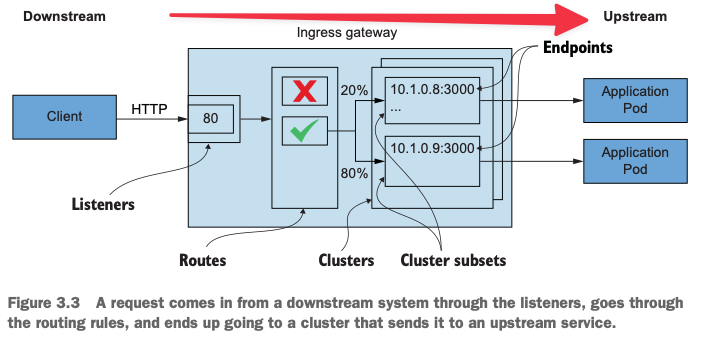

**Envoy가 기본 제공하는 기능들**

| 기능 | 내용 |
| --- | --- |
| 서비스 디스커버리 | 전용 클라이언트 라이브러리 없이 디스커버리 API로 엔드포인트 조회. <span class="t-red">궁극적 일관성</span> 전제 |
| 로드 밸런싱 | Random / (Weighted) Round Robin / Weighted Least Request / Consistent Hashing(Ring hash, Maglev), <span class="t-red">지역 인식(locality-aware)</span> |
| 트래픽 라우팅 | 가상 호스트, 경로 기반, 헤더·우선순위 기반, 재시도·타임아웃, 오류 주입 |
| 전환 / 섀도잉 | 가중치 기반 분할, <span class="t-red">fire-and-forget 섀도잉</span>(운영 트래픽 복사본으로 신버전 테스트) |
| 복원력 | 요청 타임아웃, 재시도(재시도별 타임아웃), 커넥션·요청 수 제한, <span class="t-red">이상값 감지(outlier detection)</span> |
| HTTP/2 · gRPC | 다운/업스트림 모두 프록시, 프로토콜 변환(1.1 ↔ 2) |
| 관찰 가능성 | 카운터·게이지·히스토그램 통계, 분산 트레이싱(`x-request-id`, `x-b3-*` 전파) |
| TLS | 종료(terminate)뿐 아니라 <span class="t-red">시작(originate)</span>까지. mTLS도 자동 |
| 속도 제한 | 네트워크(커넥션별) / HTTP(요청별) 수준에서 외부 RLS와 통합 |

> [!tip] 통계 이름만 봐도 구조가 보인다
> - `downstream_cx_total`, `downstream_rq_http2_total` — 들어오는 쪽
> - `cluster.<name>.upstream_rq_retry`, `cluster.<name>.upstream_cx_overflow` — 나가는 쪽
> - `cluster.<name>.ejections_detected_consecutive_5xx` — 이상값 감지로 퇴출된 횟수
> - 뒤에서 llm-d 자료를 읽을 때 `xds_cluster::...::cx_active`, `httproute/.../rule/0::...::rq_total` 같은 값이 그대로 등장한다. 이름 규칙을 알고 있으면 로그가 훨씬 빨리 읽힌다.

---
### 정적 설정과 동적 설정(xDS)

Envoy는 JSON/YAML 설정 파일로 구동된다. 가장 단순한 형태는 이렇다.

```yaml
static_resources:
  listeners:
  - name: httpbin-demo
    address:
      socket_address: { address: 0.0.0.0, port_value: 15001 }   # (1) 리스너
    filter_chains:
    - filters:
      - name: envoy.filters.network.http_connection_manager      # (2) HCM
        typed_config:
          "@type": type.googleapis.com/envoy.extensions.filters.network.http_connection_manager.v3.HttpConnectionManager
          stat_prefix: ingress_http
          http_filters:
          - name: envoy.filters.http.router
          route_config:                                          # (3) 라우팅 규칙
            name: httpbin_local_route
            virtual_hosts:
            - name: httpbin_local_service
              domains: ["*"]                                     # (4) 와일드카드 가상 호스트
              routes:
              - match: { prefix: "/" }
                route:
                  auto_host_rewrite: true
                  cluster: httpbin_service                       # (5) 클러스터로 라우팅
  clusters:
  - name: httpbin_service                                        # (6) 업스트림 클러스터
    connect_timeout: 5s
    type: LOGICAL_DNS
    lb_policy: ROUND_ROBIN
    load_assignment:
      cluster_name: httpbin
      endpoints:
      - lb_endpoints:
        - endpoint:
            address:
              socket_address: { address: httpbin, port_value: 8000 }
```

이 프록시를 호출하면 요청이 그대로 통과하면서 헤더 두 개가 붙는다.

```bash
docker run -it --rm --link proxy curlimages/curl curl -X GET http://proxy:15001/headers
{
  "headers": {
    "X-Envoy-Expected-Rq-Timeout-Ms": ["15000"],
    "X-Forwarded-Proto": ["http"],
    "X-Request-Id": ["8d08bd8e-7899-42e1-bf74-7a3381a2494a"]
  }
}
```

> [!info] 프록시를 하나 끼웠을 뿐인데 두 가지 일이 일어났다
> - `X-Request-Id` : 여러 홉을 거치는 요청을 서로 연관시킬 수 있는 식별자. <span class="t-red">뒤의 llm-d 자료에서 EPP 로그를 추적할 때 이 헤더가 그대로 쓰인다.</span>
> - `X-Envoy-Expected-Rq-Timeout-Ms` : 업스트림에게 "이 요청은 15초 후 타임아웃될 것"이라고 알려주는 힌트. 업스트림이 데드라인을 구현하면 타임아웃 이후 묶여 있던 리소스를 풀 수 있다.

재시도도 라우트 한 줄이면 끝난다.

```yaml
route:
  cluster: httpbin_service
  retry_policy:
    retry_on: 5xx      # 5xx일 때 재시도
    num_retries: 3
```

```bash
# /status/500 호출 → 응답이 없다. Admin API에서 확인
curl -X GET http://proxy:15000/stats | grep retry
cluster.httpbin_service.retry.upstream_rq_500: 3
cluster.httpbin_service.upstream_rq_retry: 3
```

**그런데 이걸 수백 개 프록시에 일일이 배포할 수는 없다.** 그래서 Envoy는 재시작 없이 설정을 실시간으로 받는 API군을 갖고 있다.

| API | 이름 | 무엇을 받아오나 |
| --- | --- | --- |
| **LDS** | Listener Discovery Service | 어떤 리스너를 노출할지 |
| **RDS** | Route Discovery Service | 리스너가 쓸 라우트 (LDS의 부분집합) |
| **CDS** | Cluster Discovery Service | 클러스터 목록과 설정 |
| **EDS** | Endpoint Discovery Service | 클러스터의 엔드포인트 (CDS의 부분집합) |
| **SDS** | Secret Discovery Service | 인증서 배포 |
| **ADS** | Aggregate Discovery Service | <span class="t-red">위 전부를 직렬화된 단일 스트림으로</span> |

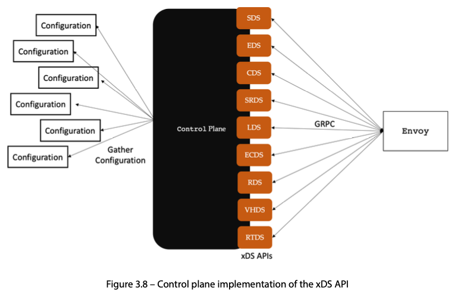

```yaml
dynamic_resources:
  lds_config:
    api_config_source:
      api_type: GRPC
      grpc_services:
      - envoy_grpc: { cluster_name: xds_cluster }   # 이 클러스터에 리스너 API를 물어봄
clusters:
- name: xds_cluster                                  # LDS를 구현하는 gRPC 클러스터 하나만 정적으로
  type: STATIC
  http2_protocol_options: {}
  hosts: [{ socket_address: { address: 127.0.0.3, port_value: 5678 }}]
```

> [!warning] ADS가 왜 따로 필요한가
> - xDS는 <span class="t-red">궁극적 일관성(eventual consistency)</span>을 전제로 만들어졌다.
> - RDS가 먼저 "클러스터 foo로 보내라"는 라우트를 내려줬는데, foo를 포함한 CDS 업데이트가 아직 안 왔다면 그 사이에 라우팅 오류가 난다.
> - 이 <span class="t-red">순서에 따른 경쟁 상태</span>를 없애려고 모든 변경을 한 스트림으로 순서대로 보내는 것이 ADS다. Istio가 프록시 설정 변경에 ADS를 쓰는 이유이고, 뒤에서 볼 Envoy Gateway → Envoy Proxy 채널도 `ADS / DELTA_GRPC`다.

---
### 필터 체인 : Envoy의 진짜 골격

Envoy는 근본적으로 <span class="t-red">L3/L4 프록시</span>다. 네트워크 커넥션에서 바이트를 가져와 어떤 방식으로 처리할 뿐이다. 그 "처리"의 단위가 필터이고, 순서대로 엮인 것이 필터 체인이다.

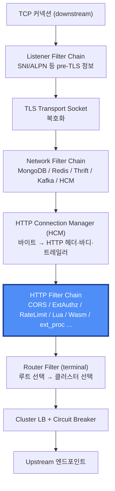
```mermaid
flowchart TD
    A["TCP 커넥션 (downstream)"] --> B["Listener Filter Chain<br/>SNI/ALPN 등 pre-TLS 정보"]
    B --> C["TLS Transport Socket<br/>복호화"]
    C --> D["Network Filter Chain<br/>MongoDB / Redis / Thrift / Kafka / HCM"]
    D --> E["HTTP Connection Manager (HCM)<br/>바이트 → HTTP 헤더·바디·트레일러"]
    E --> F["HTTP Filter Chain<br/>CORS / ExtAuthz / RateLimit / Lua / Wasm / ext_proc ..."]
    F --> G["Router Filter (terminal)<br/>루트 선택 → 클러스터 선택"]
    G --> H["Cluster LB + Circuit Breaker"]
    H --> I["Upstream 엔드포인트"]

    style F fill:#4F8EF7,stroke:#1E3A8A,stroke-width:3px,color:#fff
```

- **네트워크 필터**는 바이트 스트림을 인코딩/디코딩한다. MongoDB, Redis, Thrift, Kafka, 그리고 <span class="t-red">HTTP Connection Manager(HCM)</span>가 대표적이다.
- **HCM**은 바이트를 HTTP 헤더/바디/트레일러로 바꾸고, 그 안에 또 자신만의 <span class="t-red">HTTP 필터 체인</span>을 갖는다.
- HTTP 필터 체인은 반드시 <span class="t-red">터미널 필터인 router 필터</span>로 끝나야 한다. 여기서 루트가 선택되고 클러스터가 정해진다.

기본 제공되는 HTTP 필터만 해도 CORS, CSRF, ExternalAuth, RateLimit, Fault injection, gRPC/JSON transcoding, Gzip, Lua, RBAC, Tap, Router, Wasm 등으로 길다.

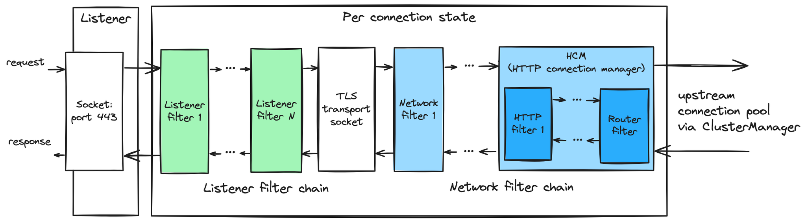

---
### 확장하는 방법 세 가지

C++로 필터를 직접 짜서 Envoy 바이너리에 컴파일해 넣을 수도 있다. 실제로 Istio 프록시가 그렇게 만들어진다. 하지만 유지보수 비용이 크다. 그래서 <span class="t-red">바이너리를 건드리지 않는</span> 세 가지 길이 있다.

| 방법 | 형태 | 특징 |
| --- | --- | --- |
| **External Processing (`ext_proc`)** | 외부 gRPC 서버에 위임 | <span class="t-red">어떤 언어로든</span> 구현 가능. 매 요청 네트워크 홉 추가 |
| **Lua** | 인라인 스크립트 | 가볍지만 표현력 제한 |
| **Wasm** | WebAssembly 모듈 | 샌드박스 안에서 커스텀 코드 실행 |

이 중 `ext_proc` <span class="t-red">이 하나가 이번 주 자료 전체를 관통하는 열쇠</span>다. Agent Router도, llm-d도 전부 이 하나의 확장점 위에 서 있다.

**Istio에서 Envoy 필터를 직접 건드리기 — `EnvoyFilter`**

Istio의 `VirtualService`, `DestinationRule`, `AuthorizationPolicy`는 결국 Envoy 설정으로 번역된다. 그런데 Istio가 모든 Envoy 필터를 노출하지는 않는다. 그럴 때 쓰는 비상 수단이 `EnvoyFilter`다. 자료에서는 <span class="t-red">tap 필터</span>를 예로 든다.

```yaml
# ch14/tap-envoy-filter.yaml
apiVersion: networking.istio.io/v1alpha3
kind: EnvoyFilter
metadata:
  name: tap-filter
  namespace: istioinaction
spec:
  workloadSelector:
    labels: { app: webapp }              # 워크로드 셀렉터
  configPatches:
  - applyTo: HTTP_FILTER                 # 설정할 위치
    match:
      context: SIDECAR_INBOUND
      listener:
        portNumber: 8080
        filterChain:
          filter:
            name: "envoy.filters.network.http_connection_manager"
            subFilter:
              name: "envoy.filters.http.router"
    patch:
      operation: INSERT_BEFORE           # router 필터 "앞에" 끼워 넣는다
      value:
        name: envoy.filters.http.tap
        typed_config:
          "@type": "type.googleapis.com/envoy.extensions.filters.http.tap.v3.Tap"
          commonConfig:
            adminConfig: { configId: tap_config }
```

```bash
kubectl apply -f ch14/tap-envoy-filter.yaml

# 실제로 끼워졌는지 확인
istioctl proxy-config listener deploy/webapp.istioinaction --port 15006 -o json
...
{ "name": "envoy.filters.http.tap", ... },
{ "name": "envoy.filters.http.router", ... }
...
```

> [!warning] EnvoyFilter는 'break glass' 수단이다
> - 기저 Envoy API는 Istio 버전 간에 <span class="t-red">언제든 바뀔 수 있다.</span> 하위 호환을 가정하면 안 된다.
> - 잘못 설정하면 <span class="t-red">데이터 플레인 전체가 멈춘다.</span>
> - 그리고 네임스페이스를 특정하지 않으면 그 네임스페이스 <span class="t-red">전체 워크로드</span>에 적용된다. `istio-system`에 만들면 메시 전체다.

**외부 호출로 요청 속도 제한하기 — Global Rate Limit**

Envoy의 전역 속도 제한은 <span class="t-red">외부 RLS(Rate-Limit Server)</span>를 호출하고, RLS는 Redis 같은 백엔드에 카운터를 저장한다. 이렇게 하면 <span class="t-red">레플리카 개수와 무관하게</span> 전역 한도가 지켜진다.

Envoy가 RLS로 보내는 것은 요청 헤더 자체가 아니라 <span class="t-red">디스크립터(descriptor)</span>라는 속성이다.

```yaml
# RLS 설정 : 어떤 디스크립터에 어떤 한도를 걸 것인가
domain: catalog-ratelimit
descriptors:
  - key: header_match
    value: no_loyalty
    rate_limit: { unit: MINUTE, requests_per_unit: 1 }
  - key: header_match
    value: gold_request
    rate_limit: { unit: MINUTE, requests_per_unit: 10 }
  - key: header_match
    value: silver_request
    rate_limit: { unit: MINUTE, requests_per_unit: 5 }
  - key: header_match
    value: bronze_request
    rate_limit: { unit: MINUTE, requests_per_unit: 3 }
```

```yaml
# EnvoyFilter : 요청의 어떤 속성을 디스크립터로 만들어 보낼 것인가 (rate-limit action)
- applyTo: VIRTUAL_HOST
  patch:
    operation: MERGE
    value:
      rate_limits:
      - actions:
        - header_value_match:
            descriptor_value: no_loyalty
            expect_match: false           # x-loyalty 헤더가 없을 때
            headers: [{ name: "x-loyalty" }]
      - actions:
        - header_value_match:
            descriptor_value: gold_request
            headers: [{ name: "x-loyalty", exact_match: gold }]
```

```bash
# 헤더 없이 호출 → 분당 1회 초과 시
kubectl exec -it deploy/sleep -c sleep -- curl http://catalog/items -v
< HTTP/1.1 429 Too Many Requests
< x-envoy-ratelimited: true
```

> [!tip] 이 구조를 기억해두자
> - "<span class="t-red">요청에서 속성을 뽑아 외부 서비스에 물어보고, 그 답으로 요청 처리 방식을 바꾼다</span>"
> - 이게 곧 Agent Router의 <span class="t-red">토큰 기반 레이트리밋</span>이고, llm-d EPP의 <span class="t-red">엔드포인트 선택</span>이다. 물어보는 대상과 질문만 바뀐다.
> - 자료를 읽다 보면 Part 2와 Part 3이 사실상 이 한 문장의 변주라는 게 보인다.

---
---
## Part 2. AI Gateway — Envoy Agent Router

---
### 왜 AI 게이트웨이인가

자료에서 소개하는 전형적인 전개는 이렇다.

```
① 첫 모델 제공 업체를 붙인다
② 용량 제한에 걸려 두 번째 업체를 추가한다
③ 팀원이 늘고, 각자 키를 복사하고, 재시도 로직을 각자 작성한다
④ 청구서에서 어느 팀이 얼마나 썼는지 알 수 없다
⑤ 3개월 뒤, 모두가 같은 문제(Auth / Retry / Keys / Logs)를 각자 다시 푼다
⑥ 업체 한 곳이 장애 나면 제품이 같이 멈춘다
```

10여 년 전, 여러 백엔드에 대한 공통 로직을 모으려고 API Gateway가 나왔다. <span class="t-red">AI Gateway는 정확히 같은 개념이고, 대상만 백엔드 → 모델로 바뀐 것</span>이다.

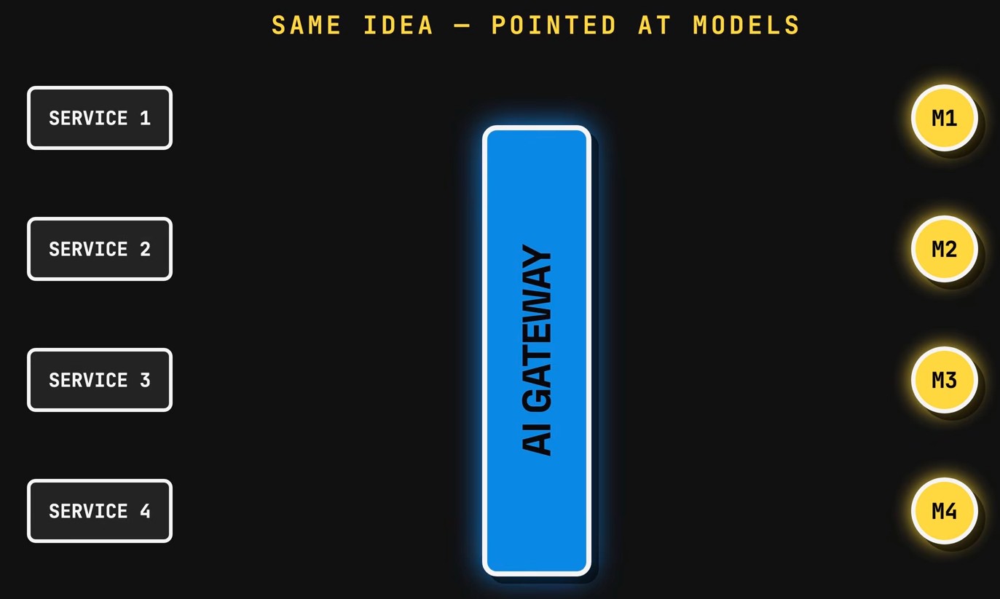

| 역할 | 내용 |
| --- | --- |
| **Unified API** | 모든 프로바이더와 통신하는 통합 API. 대부분 OpenAI 스키마를 따르므로 <span class="t-red">모델명만 바꾸면 다른 업체로 전환</span> |
| **Holds the Keys** | 게이트웨이가 실제 키를 보관하고 앱에는 <span class="t-red">교환 가능한 일회용 키</span>를 발급. 회전·취소해도 다른 앱은 모름 |
| **Retry & Failover** | 모델 장애 시 재시도 / 다른 프로바이더로 폴백 |
| **Track Everything** | <span class="t-red">토큰 사용량 추적</span> → 팀/앱/모델별 예산 관리 |
| **Observability + Guard Rails** | 지연·오류·비용을 한곳에서 모니터링, 가드레일 집행 |

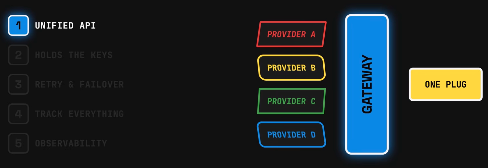

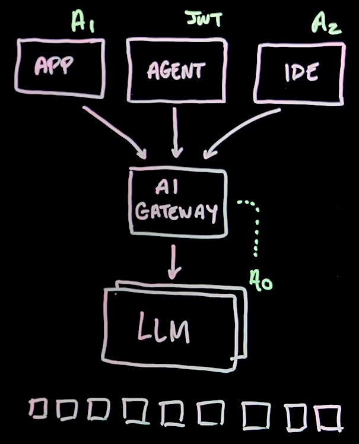

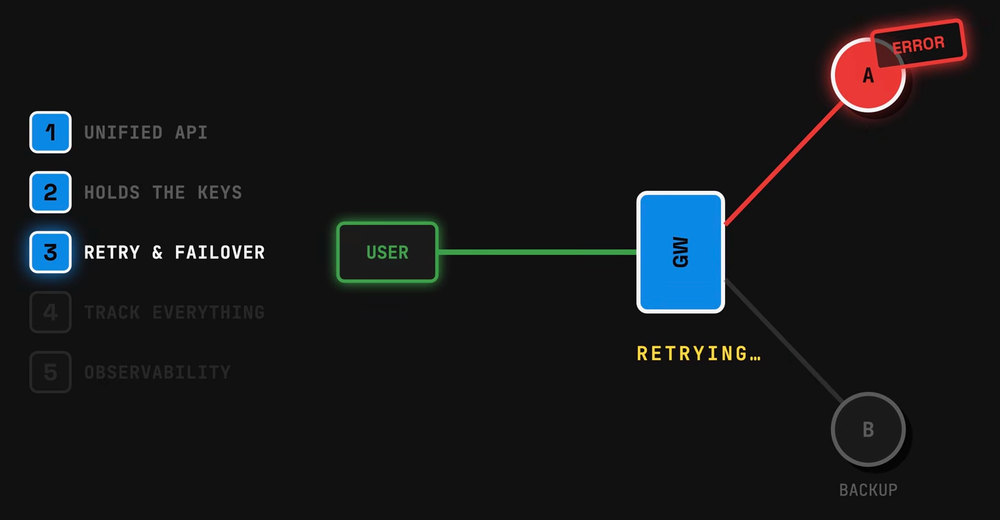

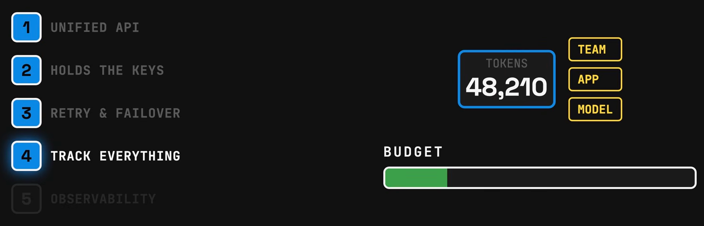

> [!warning] 우회 경로를 막지 않으면 전부 무의미해진다
> - 모니터링도 예산 관리도 "<span class="t-red">모든 요청이 게이트웨이를 통과한다</span>"는 전제 위에서만 성립한다.
> - 앱이 직접 `api.openai.com`을 호출할 수 있으면 그 순간 집계는 깨진다.
> - 자료에서도 이 부분을 "우회 경로 차단 필수"라고 굵게 강조한다. 기술이 아니라 조직·정책의 문제라는 점이 인상적이었다.

**GenAI 트래픽은 일반 HTTP 트래픽과 다르다**

| 항목 | 일반 HTTP | LLM 추론 |
| --- | --- | --- |
| 라우팅 판단 근거 | 헤더 / 경로 | <span class="t-red">본문(body) 내용</span> — 모델명, 프롬프트 |
| 처리 비용 | 헤더 파싱 | body 파싱으로 <span class="t-red">약 3배 컴퓨팅</span> |
| 응답 형태 | 단발 응답 | <span class="t-red">SSE 스트리밍</span>, 길게 열려 있음 |
| 부하 단위 | 요청 수 | <span class="t-red">토큰 수 / KV 캐시 점유</span> |
| LB 적합성 | Round Robin 무난 | RR은 <span class="t-red">대기열 큰 호스트에 요청을 꽂아</span> 지연 악화 |

---
### Envoy AI Gateway → Agent Router

자료를 읽다가 가장 먼저 눈에 띈 건 프로젝트 이름이 바뀌었다는 점이었다.

- Envoy AI Gateway는 CNCF 내 <span class="t-red">Envoy 하위 프로젝트</span>로 시작
- 2025-08-25 Linux Foundation에 벤더 중립 거버넌스로 기증
- 이후 <span class="t-red">Agentic AI Foundation(AAIF)</span>가 출범하면서 장기적 홈으로 이전, 이름도 <span class="t-red">Agent Router</span>로 변경 (9월 10일부로 독립 프로젝트)

AAIF는 "엔터프라이즈 규모에서 에이전틱 AI를 <span class="t-red">운영화(operationalize)</span>한다"를 미션으로 하는 LF 산하 재단이고, 8개 워킹그룹(Accuracy & Reliability, Agentic Commerce, Governance/Risk/Regulatory Alignment, Identity & Trust, Observability & Traceability, Security & Privacy, Workflows & Process Integration, Taxonomy & Landscape)을 운영한다. 성격상 CNCF와 유사하되 대상이 에이전틱 AI 인프라다.

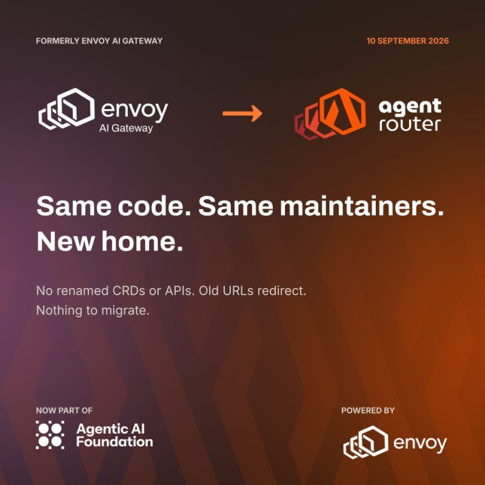

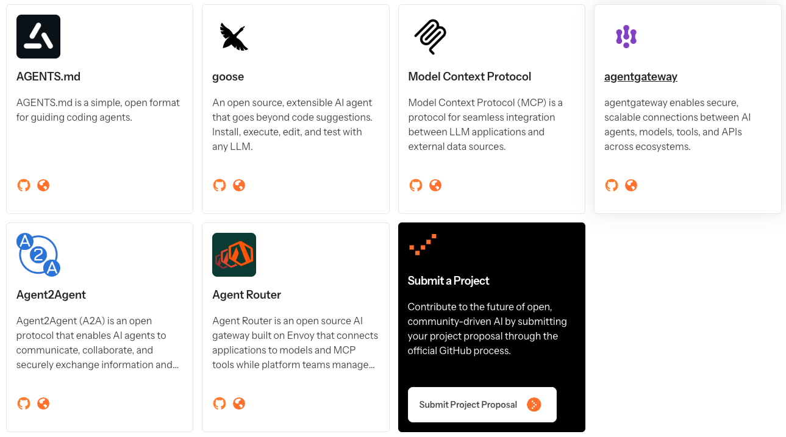

**v0.1 → 1.0 사이에 무엇이 달라졌나**

| 역량 | v0.1 (2025-02) | 1.0 |
| --- | --- | --- |
| AI 프로바이더 | 2개 (OpenAI, AWS Bedrock) | <span class="t-red">16개</span>, 프로바이더 간 요청/응답 변환 포함 |
| API 표면 | Chat completions | Chat, completions, embeddings, image generation, audio(transcription/translation/speech), <span class="t-red">OpenAI Responses API</span> |
| MCP | — | <span class="t-red">완전한 MCP 게이트웨이</span> (서버 다중화, 도구 라우팅·필터링, 세분화된 인가) |
| 멀티모달 | — | 이미지·오디오·비디오 입력 |
| 관측성 | 기본 메트릭 | OpenTelemetry 트레이싱, OpenInference, GenAI 토큰 메트릭, <span class="t-red">reasoning 토큰 별도 집계</span> |
| 멀티테넌시·라우팅 | 토큰 레이트리밋 | 호스트명 기반 라우팅, <span class="t-red">모델 가상화</span>, 쿼터 인지 레이트리밋 |
| 컨트롤 플레인 API | v1alpha1 (실험) | <span class="t-red">v1beta1 (안정)</span> |

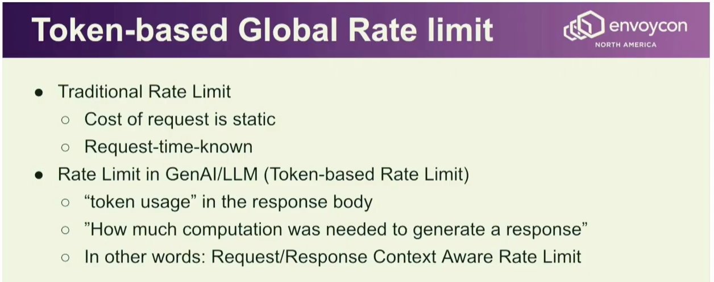

> [!info] 1년 반 만의 변화폭이 크다
> - 프로바이더 2개 → 16개, API 표면이 chat 하나에서 embeddings·image·audio·Responses까지.
> - 특히 <span class="t-red">MCP 게이트웨이</span>가 들어온 게 눈에 띈다. 게이트웨이의 관리 대상이 "모델"에서 "<span class="t-red">모델 + 도구</span>"로 넓어졌다는 뜻이다.

---
### 핵심 확장점 : Envoy External Processing

> **`envoy.filters.http.ext_proc`** — Envoy가 요청/응답을 처리하는 도중, 그 처리 로직을 <span class="t-red">Envoy 프로세스 밖의 별도 gRPC 서버</span>에 위임하는 필터.

동작은 단순하다.

1. Envoy가 HTTP 라이프사이클의 각 단계(RequestHeaders → RequestBody → ResponseHeaders → ResponseBody)마다 외부 프로세서에게 gRPC 스트림으로 데이터를 보낸다
2. 외부 프로세서는 `CONTINUE`(통과) / 수정(헤더·바디 변경) / 즉시 응답 반환(예: 401 차단) 중 하나로 답한다
3. `processing_mode`로 어느 단계까지 개입할지(헤더만 볼지, 바디까지 스트리밍/버퍼링해서 볼지) 세밀하게 제어한다

```yaml
http_filters:
- name: envoy.filters.http.ext_proc
  typed_config:
    "@type": type.googleapis.com/envoy.extensions.filters.http.ext_proc.v3.ExternalProcessor
    grpc_service:
      envoy_grpc: { cluster_name: ext_proc }
      authority: localhost:9002
      timeout: 10s
    processing_mode:
      request_header_mode: SEND
      response_header_mode: SEND
      request_body_mode: FULL_DUPLEX_STREAMED     # ← 핵심
      response_body_mode: FULL_DUPLEX_STREAMED
      request_trailer_mode: SEND
      response_trailer_mode: SEND
    message_timeout: 1000s                        # 긴 생성 스트림 고려
```

> [!tip] `FULL_DUPLEX_STREAMED`가 왜 중요한가
> - 버퍼링 없이 <span class="t-red">스트리밍 중에도 양방향으로 실시간 전달</span>한다.
> - vLLM의 SSE 응답을 토큰 단위로 그대로 통과시키면서 동시에 외부 프로세서가 관찰할 수 있다.
> - <span class="t-red">전체 응답을 다 기다렸다 처리하면 스트리밍 UX가 깨진다.</span> LLM 게이트웨이가 일반 게이트웨이와 갈라지는 지점이 정확히 여기다.
> - `message_timeout: 1000s`도 같은 맥락이다. 일반 API 게이트웨이라면 상상하기 어려운 값인데, 긴 생성 스트림을 감당하려면 이렇게 잡아야 한다.

주요 용도는 인증/인가, 요청·응답 변환, <span class="t-red">본문 기반 라우팅 결정</span>, 콘텐츠 검사·차단(모더레이션, PII 마스킹), 그리고 LLM 시나리오에서는 OpenAI 호환 본문 파싱 → 모델명 기반 라우팅 → 토큰 카운트 기반 레이트리밋 → 프롬프트 가드레일 → 사용량 계측이다.

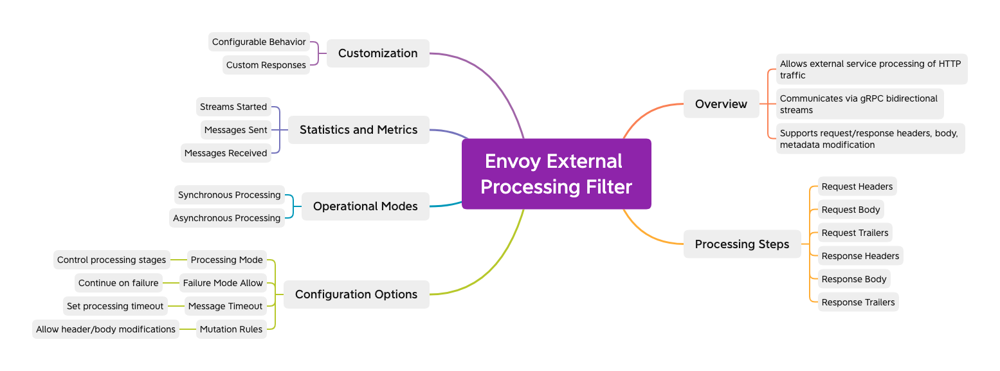

> [!warning] 공짜는 아니다
> - gRPC이므로 <span class="t-red">매 요청마다 네트워크 왕복(hop)</span>이 추가되고 레이턴시 오버헤드가 생긴다.
> - 그래서 실무에서는 사이드카가 아니라 게이트웨이 레벨에 붙이는 경우가 많고, Agent Router는 아예 <span class="t-red">Unix Domain Socket</span>으로 같은 파드 안에서 통신한다. (뒤에서 다시 확인)
> - 이 오버헤드가 실제로 얼마인지는 Part 3의 Jaeger 트레이스에서 숫자로 나온다.

---
### Agent Router 아키텍처

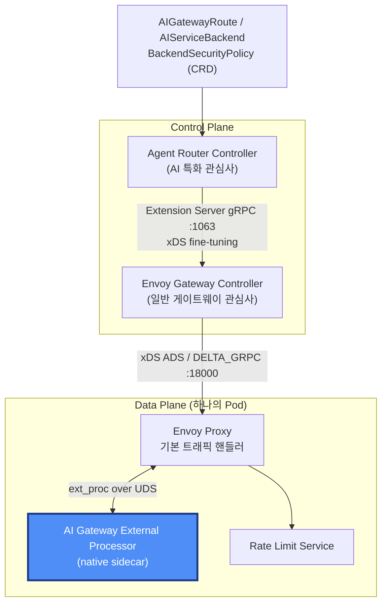
```mermaid
flowchart TD
    subgraph CP["Control Plane"]
        A["Agent Router Controller<br/>(AI 특화 관심사)"]
        B["Envoy Gateway Controller<br/>(일반 게이트웨이 관심사)"]
    end
    subgraph DP["Data Plane (하나의 Pod)"]
        C["Envoy Proxy<br/>기본 트래픽 핸들러"]
        D["AI Gateway External Processor<br/>(native sidecar)"]
        E["Rate Limit Service"]
    end
    F["AIGatewayRoute / AIServiceBackend<br/>BackendSecurityPolicy (CRD)"] --> A
    A -- "Extension Server gRPC :1063<br/>xDS fine-tuning" --> B
    B -- "xDS ADS / DELTA_GRPC :18000" --> C
    C <-- "ext_proc over UDS" --> D
    C --> E

    style D fill:#4F8EF7,stroke:#1E3A8A,stroke-width:3px,color:#fff
```

**컨트롤 플레인 두 개의 분업**

| 항목 | AI Gateway Controller | Envoy Gateway Controller |
| --- | --- | --- |
| 주 역할 | AI 특화 설정 | 코어 프록시 인프라 설정 |
| 설정 대상 | External Processor 설정 + <span class="t-red">extension server를 통한 xDS 미세 조정</span> | Envoy Proxy(xDS), Rate Limit Service |
| 성격 | 변환/검증 등 도메인 특화 로직 | 라우팅, 레이트리밋 등 범용 기능 |

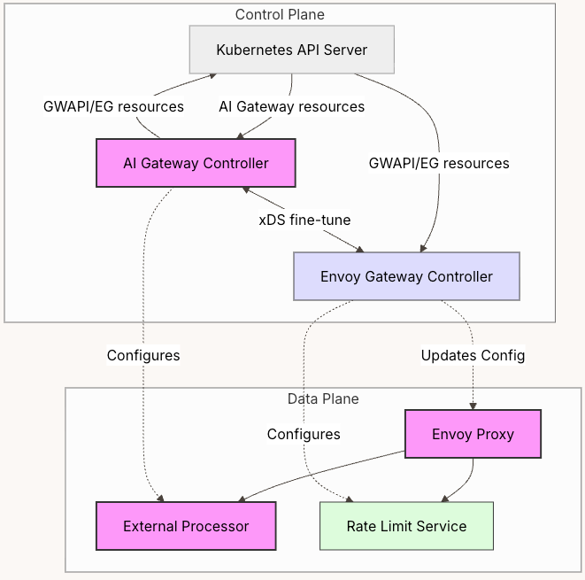

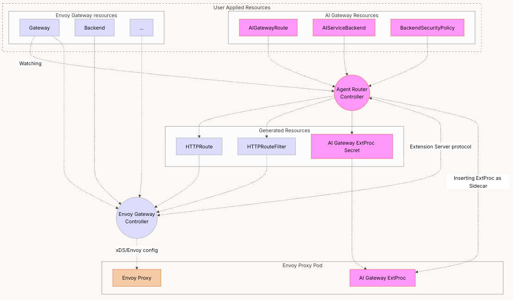

**설정 흐름 (CRD → 데이터 플레인)**

1. Agent Router Controller가 AI Gateway CR 변경을 감시
2. 대응하는 Envoy Gateway 설정 및 `HTTPRoute` 리소스 생성
3. Envoy Gateway가 이를 <span class="t-red">xDS 설정으로 변환</span>
4. Agent Router Controller가 <span class="t-red">Extension Server 프로토콜로 그 xDS를 다시 미세 조정</span>
5. Envoy Proxy가 최종 설정을 받아 트래픽에 적용

**데이터 플레인 트래픽 흐름**

- 요청 경로 : 경로/헤더/모델명 기반 라우팅 → 프로바이더 요구사항에 맞게 <span class="t-red">요청 변환</span> → 프로바이더별 인증 적용 → 레이트리밋 정책 검증
- 응답 경로 : 프로바이더 응답을 <span class="t-red">공통 포맷으로 변환</span> → 토큰 사용량 추출 → 레이트리밋 집행용 사용량 메트릭 저장

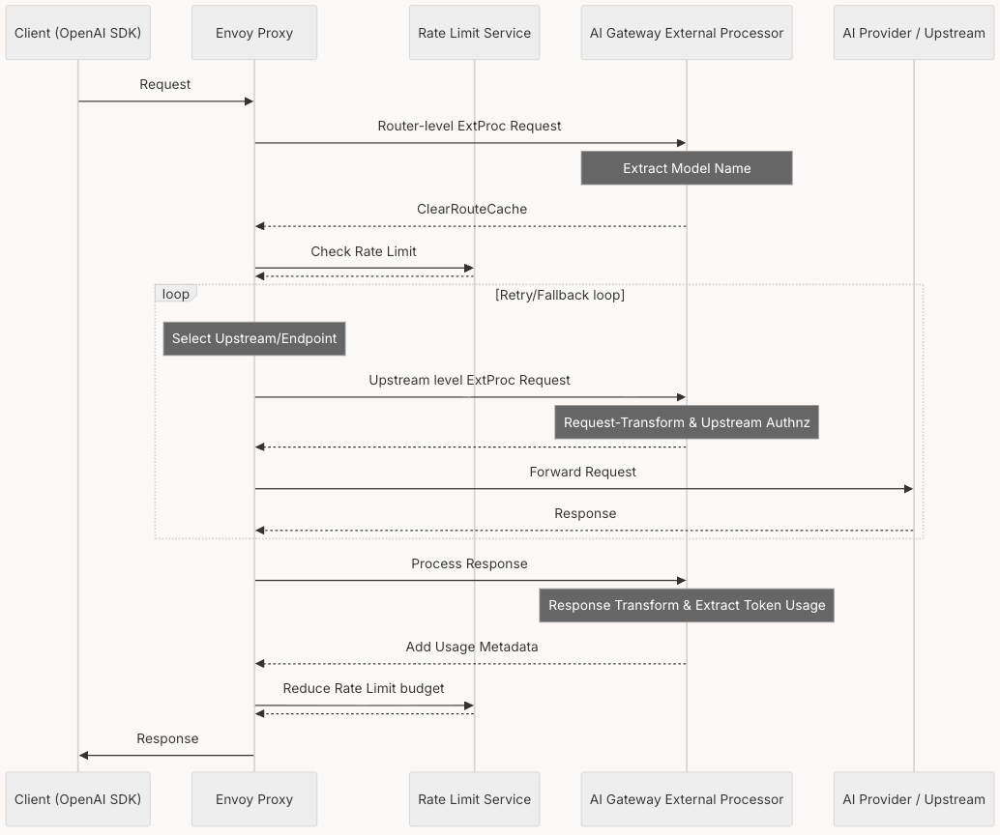

> [!info] ExtProc이 router 단계와 upstream 단계 '두 레벨'에서 동작한다
> - 이 분리 덕분에 한 프로바이더 요청이 실패해 다른 프로바이더로 폴백할 때, <span class="t-red">router 단계 재평가 없이 upstream 단계에서만 변환·인증을 다시 적용</span>하면 된다.
> - 전체 철학은 한 줄이다 — <span class="t-red">"Envoy 코어 코드를 수정하지 않고, 검증된 확장 포인트만으로 AI 특화 로직을 구현한다."</span>

**핵심 CRD 3종**

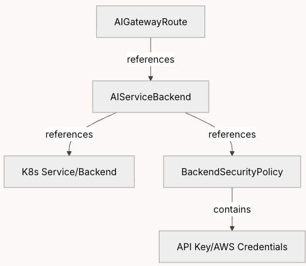

```
Client Request
      ↓
AIGatewayRoute          통합 진입점 — 입력 스키마, 라우팅 로직, 요청/응답 변환, 비용 모니터링
      ↓
AIServiceBackend        개별 백엔드 — 기대하는 출력 API 스키마 정의, K8s Service/Backend 참조
      ↓ (선택적 참조)
BackendSecurityPolicy   인증 — API Key / AWS 자격증명
```

---
### 실습 자료 ① 로컬에서 가장 단순하게 띄우기

자료의 첫 단계는 Kubernetes 없이 도커 한 줄로 시작한다.

```bash
export OPENAI_API_KEY=###

docker run -d --name agentrouter -p 1975:1975 \
  -e OPENAI_API_KEY=$OPENAI_API_KEY \
  envoyproxy/ai-gateway-cli:latest run

docker logs agentrouter -f
AI Gateway External Processor is ready
Envoy AI Gateway listening on http://localhost:1975 (admin http://localhost:42387) after 4.6s
```

```bash
curl http://localhost:1975/v1/chat/completions \
  -H "Content-Type: application/json" \
  -d '{"model": "gpt-5", "messages": [{"role": "user", "content": "Say this is a test!"}]}'
{
  "id": "chatcmpl-EMwfg1X0o6dwJx71jP9tEJgCyOCLv",
  "model": "gpt-5-2025-08-07",
  "choices": [{ "message": {"role":"assistant","content":"this is a test!"}, "finish_reason":"stop" }]
}
```

로그 첫 줄이 `AI Gateway External Processor is ready`다. <span class="t-red">로컬 모드에서도 구조는 동일하다</span>는 걸 바로 보여주는 대목이라 기억에 남았다.

---
### 실습 자료 ② Kubernetes에 설치하기

**Phase 1. Envoy Gateway (데이터 플레인의 컨트롤러)**

여기서 중요한 건 values 파일이다. <span class="t-red">Agent Router가 끼어들 통로를 미리 열어주는 역할</span>을 한다.

```yaml
# envoy-gateway-values.yaml
config:
  envoyGateway:
    gateway:
      controllerName: gateway.envoyproxy.io/gatewayclass-controller
    provider:
      type: Kubernetes            # 설정을 K8s CRD로부터 읽음
    extensionApis:
      enableEnvoyPatchPolicy: true
      enableBackend: true          # 필수: AI 백엔드를 Backend CRD로 정의하기 위해
    extensionManager:
      hooks:
        xdsTranslator:             # ← 이게 Agent Router가 Envoy 위에서 동작하는 핵심 메커니즘
          translation:
            listener: { includeAll: true }
            route:    { includeAll: true }
            cluster:  { includeAll: true }
            secret:   { includeAll: true }
          post:                    # post 단계에서 Translation → Cluster → Route 순으로 개입
            - Translation
            - Cluster
            - Route
      service:
        fqdn:
          hostname: ai-gateway-controller.envoy-ai-gateway-system.svc.cluster.local
          port: 1063
```

```bash
helm upgrade -i eg oci://docker.io/envoyproxy/gateway-helm \
  --version v1.8.1 -n envoy-gateway-system --create-namespace \
  -f https://raw.githubusercontent.com/theagentrouter/agent-router/main/manifests/envoy-gateway-values.yaml

kubectl get crd | grep envoy
backends.gateway.envoyproxy.io
backendtrafficpolicies.gateway.envoyproxy.io
envoyextensionpolicies.gateway.envoyproxy.io
envoypatchpolicies.gateway.envoyproxy.io
envoyproxies.gateway.envoyproxy.io
httproutefilters.gateway.envoyproxy.io
securitypolicies.gateway.envoyproxy.io
```

> [!warning] `service.fqdn`이 가리키는 컨트롤러는 아직 없다
> - 이 시점에 존재하는 건 `envoy-gateway` 컨트롤러뿐이다.
> - <span class="t-red">Agent Router 컨트롤러도, 실제 트래픽을 처리할 Envoy Proxy 데이터플레인도 아직 없다.</span>
> - 설치 순서를 "없는 것을 먼저 가리켜 두고 나중에 채운다"로 잡은 게 처음엔 이상해 보였는데, Helm values는 선언일 뿐이니 자연스러운 순서였다.

**Phase 2. Agent Router (CRD + Controller)**

```bash
helm upgrade -i aieg-crd oci://docker.io/envoyproxy/ai-gateway-crds-helm \
  --version v1.1.0 -n envoy-ai-gateway-system --create-namespace

helm upgrade -i aieg oci://docker.io/envoyproxy/ai-gateway-helm \
  --version v1.1.0 -n envoy-ai-gateway-system --create-namespace

kubectl get crd | grep aigateway
aigatewayroutes.aigateway.envoyproxy.io          v1alpha1,v1beta1(storage)
aiservicebackends.aigateway.envoyproxy.io        v1alpha1,v1beta1(storage)
backendsecuritypolicies.aigateway.envoyproxy.io  v1alpha1,v1beta1(storage)
gatewayconfigs.aigateway.envoyproxy.io           v1alpha1,v1beta1(storage)
mcproutes.aigateway.envoyproxy.io                v1alpha1,v1beta1(storage)
quotapolicies.aigateway.envoyproxy.io            v1alpha1(storage)
```

> [!info] 아직도 Envoy Proxy는 없다
> - 컨트롤 플레인 2개(`envoy-gateway`, `ai-gateway-controller`)만 떠 있는 상태다.
> - 사용자가 <span class="t-red">GatewayClass + Gateway 리소스를 실제로 생성해야</span> 비로소 그 Gateway 전용 Envoy Proxy Deployment가 만들어진다.
> - 이게 Gateway API의 기본 모델이다. Gateway는 "인프라 요청서"이고, 컨트롤러가 그걸 보고 데이터플레인을 프로비저닝한다.

**Phase 3. basic.yaml 배포 — 여기서 데이터플레인이 태어난다**

```yaml
apiVersion: gateway.networking.k8s.io/v1
kind: Gateway
metadata: { name: envoy-ai-gateway-basic, namespace: default }
spec:
  gatewayClassName: envoy-ai-gateway-basic
  listeners: [{ name: http, protocol: HTTP, port: 80 }]
---
# Envoy Gateway 기본 버퍼 한도는 32KiB — AI 워크로드엔 부족하다
apiVersion: gateway.envoyproxy.io/v1alpha1
kind: ClientTrafficPolicy
metadata: { name: client-buffer-limit, namespace: default }
spec:
  targetRefs: [{ group: gateway.networking.k8s.io, kind: Gateway, name: envoy-ai-gateway-basic }]
  connection: { bufferLimit: 50Mi }
---
apiVersion: aigateway.envoyproxy.io/v1beta1
kind: AIGatewayRoute
metadata: { name: envoy-ai-gateway-basic, namespace: default }
spec:
  parentRefs: [{ name: envoy-ai-gateway-basic, kind: Gateway, group: gateway.networking.k8s.io }]
  rules:
  - matches:
    - headers:
      - { type: Exact, name: x-ai-eg-model, value: some-cool-self-hosted-model }
    backendRefs: [{ name: envoy-ai-gateway-basic-testupstream }]
---
apiVersion: aigateway.envoyproxy.io/v1beta1
kind: AIServiceBackend
metadata: { name: envoy-ai-gateway-basic-testupstream, namespace: default }
spec:
  schema: { name: OpenAI }
  backendRef: { name: envoy-ai-gateway-basic-testupstream, kind: Backend, group: gateway.envoyproxy.io }
```

> [!tip] `bufferLimit: 32KiB → 50MiB`
> - 기본값이 AI 워크로드에 부족하다는 사실 자체가 <span class="t-red">"LLM 트래픽은 페이로드가 크다"</span>는 것을 설정 한 줄로 보여준다.
> - 멀티모달(이미지/오디오 입력)까지 가면 이 값은 더 커진다.

**`x-ai-eg-model` 헤더**가 라우팅 키다. 클라이언트는 본문에 `"model": "some-cool-self-hosted-model"`만 넣으면 되고, ExtProc이 본문을 파싱해 이 헤더를 만들어준다. <span class="t-red">본문 기반 라우팅을 헤더 기반 매칭으로 환원</span>하는 전형적인 패턴이다.

---
### 실습 자료 ③ 데이터플레인 파드 뜯어보기

자료에서 가장 흥미로웠던 부분이다. 생성된 Envoy Proxy 파드는 <span class="t-red">3/3</span>이다.

| 컨테이너 | 이미지 | 역할 |
| --- | --- | --- |
| `ai-gateway-extproc` (init) | `envoyproxy/ai-gateway-extproc:v1.1.0` | <span class="t-red">Native Sidecar</span> — ext_proc gRPC 서버 |
| `envoy` | `envoyproxy/envoy:distroless-v1.38.1` | 실제 프록시 |
| `shutdown-manager` | `envoyproxy/gateway:v1.9.1` | graceful shutdown 헬퍼 |

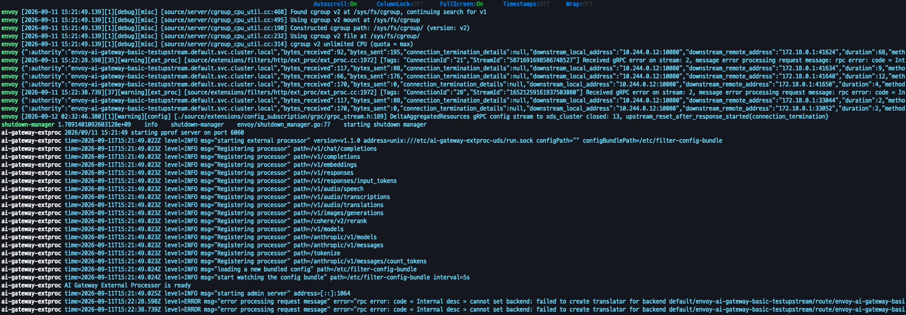

**① `ai-gateway-extproc` — Init 컨테이너인데 죽지 않는다**

Init 컨테이너로 선언돼 있지만 실제로는 계속 살아 있는 프로세스다. K8s의 <span class="t-red">native sidecar</span> 기능(`restartPolicy: Always`가 암묵 적용된 initContainer)을 사용해 envoy 컨테이너와 함께 상시 구동된다.

| 인자 | 의미 |
| --- | --- |
| `extProcAddr unix:///etc/ai-gateway-extproc-uds/run.sock` | <span class="t-red">Unix Domain Socket</span>으로 envoy와 통신 (emptyDir 볼륨 공유) |
| `configBundlePath /etc/filter-config-bundle` | CRD가 컨트롤 플레인에 의해 변환된 <span class="t-red">필터 설정을 Secret으로 마운트</span> |
| `endpointPrefixes openai:,cohere:/cohere,anthropic:/anthropic` | 프로바이더별 <span class="t-red">API 스키마 변환 경로 매핑</span> |

> [!info] UDS를 쓰는 이유
> - ext_proc은 원래 gRPC라 네트워크 홉이 붙는데, <span class="t-red">같은 파드 안에서 UDS로 붙이면 그 비용이 거의 사라진다.</span>
> - 그리고 자료가 짚듯 UDS는 <span class="t-red">세션 어피니티</span>도 확보해준다. 라우터~업스트림 단계 전반의 프로바이더 fallback 로직에 중요하다.
> - Readiness 체크가 `failureThreshold=1`로 매우 엄격하다. extproc이 잠깐이라도 응답 못하면 즉시 unready 처리돼 트래픽이 안 흐른다. <span class="t-red">ExtProc은 optional한 부속이 아니라 필수 경로</span>라는 뜻이다.

**② `envoy` — 정적 부트스트랩 + 동적 리스너**

`-config-yaml`에 부트스트랩이 통째로 박혀 있고, 나머지 라우팅/클러스터는 <span class="t-red">xDS(ADS, DELTA_GRPC)</span>로 `envoy-gateway.envoy-gateway-system.svc.cluster.local:18000`에서 실시간 수신한다.

- `xds_cluster` : 컨트롤 플레인과 <span class="t-red">mTLS</span> 연결 (`/sds/xds-certificate.json` 등 SDS 기반 인증서 로테이션)
- `default/envoy-ai-gateway-basic` : 실제 백엔드로 가는 <span class="t-red">EDS 기반</span> 클러스터, `least_request` LB
- 노출 포트는 <span class="t-red">19001(metrics) / 19003(readiness)뿐</span> — 실제 사용자 트래픽 리스너는 정적 config에 없고 LDS로 동적 주입된다

**③ 볼륨**

| 볼륨 | 내용 |
| --- | --- |
| `certs`, `sds` | xDS mTLS 인증서 (Envoy Gateway가 발급/관리) |
| `ai-gateway-...-default-…` | CRD → Agent Router 컨트롤러가 생성한 필터 설정 Secret |
| `...-bundle` | 위 설정이 <span class="t-red">Secret 크기 제한(1MiB)을 넘으면 part-000~part-007로 쪼개 담는</span> Projected 볼륨 |
| `ai-gateway-extproc-uds` | envoy ↔ extproc UDS 소켓 공유 (emptyDir) |

> [!tip] Secret 1MiB 제한을 쪼개서 우회한다
> - 프로바이더가 16개로 늘고 변환 규칙이 붙으면 필터 설정이 실제로 1MiB를 넘는다.
> - <span class="t-red">"기능이 늘면 설정도 인프라 한계에 부딪힌다"</span>는 걸 보여주는 디테일이라 기억에 남았다.

---
### 실습 자료 ④ xDS가 정말 동적인지 확인하는 방법

말로만 "동적 설정"이라고 하지 않고, 자료는 리스너를 하나 넣었다 빼면서 카운터로 증명한다. 이 절차가 특히 마음에 들었다.

```bash
# 0. Admin API 포트포워딩
POD=$(kubectl get pod -n envoy-gateway-system -l app.kubernetes.io/component=proxy -o jsonpath='{.items[0].metadata.name}')
kubectl port-forward -n envoy-gateway-system "pod/$POD" --address 0.0.0.0 19000:19000 &
ADMIN=http://192.168.254.130:19000

# 1. 컨트롤 플레인 연결 상태
curl -s "$ADMIN/stats?filter=control_plane"
control_plane.connected_state: 1                      # ← xDS gRPC 연결됨

curl -s "$ADMIN/clusters" | grep -A1 "^xds_cluster"
xds_cluster::10.96.93.168:18000::cx_active::1
xds_cluster::10.96.93.168:18000::hostname::envoy-gateway.envoy-gateway-system.svc.cluster.local.
xds_cluster::10.96.93.168:18000::health_flags::healthy

# 2. 변경 전 LDS 카운터 기록
LDS_FILTER='listener_manager\.lds\.update_(attempt|success)'
curl -s "$ADMIN/stats?filter=$LDS_FILTER"
listener_manager.lds.update_attempt: 9
listener_manager.lds.update_success: 7

# 3. 트리거 — Gateway에 리스너 하나 추가 (기존 트래픽 무영향)
kubectl patch gateway envoy-ai-gateway-basic -n default --type=json -p='[
  {"op":"add","path":"/spec/listeners/-","value":{"name":"http-test","port":8081,"protocol":"HTTP","allowedRoutes":{"namespaces":{"from":"Same"}}}}
]'
sleep 5

# 4. 반영 확인
curl -s "$ADMIN/stats?filter=$LDS_FILTER"
listener_manager.lds.update_attempt: 10               # 9 → 10
listener_manager.lds.update_success: 8                # 7 → 8

curl -s "$ADMIN/listeners" | grep 8081                 # ← 확정적 증거
default/envoy-ai-gateway-basic/http-test::0.0.0.0:8081

# 5. 원복
kubectl patch gateway envoy-ai-gateway-basic -n default --type=json -p='[
  {"op":"remove","path":"/spec/listeners/1"}
]'
curl -s "$ADMIN/listeners" | grep 8081 || echo "제거 확인됨"
제거 확인됨
```

> [!info] 이 한 사이클이 Part 1의 xDS 설명을 전부 증명한다
> - `Gateway` CR 변경 → Envoy Gateway가 xDS 생성 → Agent Router가 Extension Server로 후처리 → Envoy가 <span class="t-red">재시작 없이</span> LDS 업데이트 수신 → 리스너 생성.
> - `update_attempt`와 `update_success`가 <span class="t-red">따로 카운트된다</span>는 것도 중요하다. 설정이 잘못되면 attempt만 늘고 success는 멈춘다. 운영 시 이 둘의 차이가 벌어지는지가 가장 빠른 이상 신호가 될 것 같다.
> - 나중에 직접 환경을 만들면 이 절차부터 재현해볼 생각이다. 원복까지 포함해서 <span class="t-red">기존 트래픽에 영향 없는 실험</span>으로 설계된 점이 좋았다.

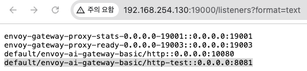

---
### 실습 자료 ⑤ 실제 OpenAI 연결

mock을 실제 프로바이더로 바꾸면 리소스 관계가 선명해진다.

```
AIGatewayRoute  (envoy-ai-gateway-basic-openai)     x-ai-eg-model: gpt-4o-mini 매칭
   └─ AIServiceBackend (schema: OpenAI)
        ├─ Backend            api.openai.com:443
        ├─ BackendTLSPolicy   시스템 CA로 TLS 검증, hostname api.openai.com
        └─ BackendSecurityPolicy (type: APIKey) → Secret
```

```bash
kubectl apply -f https://raw.githubusercontent.com/theagentrouter/agent-router/main/examples/basic/openai.yaml

kubectl create secret generic envoy-ai-gateway-basic-openai-apikey -n default \
  --from-literal=apiKey='<실제_OPENAI_API_KEY>' \
  --dry-run=client -o yaml | kubectl apply -f -

export GATEWAY_URL=$(kubectl get gateway/envoy-ai-gateway-basic -n default -o jsonpath='{.status.addresses[0].value}')

curl -sS -w "\nHTTP:%{http_code}\n" -H "Content-Type: application/json" \
  -d '{"model":"gpt-4o-mini","messages":[{"role":"user","content":"Hi."}]}' \
  $GATEWAY_URL/v1/chat/completions
{
  "model": "gpt-4o-mini-2024-07-18",
  "choices": [{"message":{"role":"assistant","content":"Hello! How can I assist you today?"}}]
}
HTTP:200
```

Envoy 액세스 로그와 클러스터 통계로 교차 검증하는 흐름이 이어진다.

```json
{":authority":"api.openai.com","response_code":200,"response_code_details":"via_upstream",
 "route_name":"httproute/default/envoy-ai-gateway-basic-openai/rule/0/match/0/*",
 "upstream_cluster":"httproute/default/envoy-ai-gateway-basic-openai/rule/0",
 "upstream_host":"162.159.140.245:443","duration":2662,
 "x-envoy-origin-path":"/v1/chat/completions","x-request-id":"08c6850a-..."}
```

```bash
curl -s $ADMIN/clusters | grep -i openai
httproute/default/envoy-ai-gateway-basic-openai/rule/0::162.159.140.245:443::cx_total::4
httproute/default/envoy-ai-gateway-basic-openai/rule/0::162.159.140.245:443::rq_success::2
httproute/default/envoy-ai-gateway-basic-openai/rule/0::162.159.140.245:443::rq_total::2
httproute/default/envoy-ai-gateway-basic-openai/rule/0::162.159.140.245:443::hostname::api.openai.com
```

> [!tip] `cx_total: 4` vs `rq_total: 2`
> - 커넥션 4개에 요청 2개. 커넥션 수와 요청 수가 <span class="t-red">따로 논다</span>는 걸 바로 볼 수 있다.
> - 이 괴리가 바로 Part 3에서 다룰 <span class="t-red">"L4 로드밸런싱이 LLM 서빙에서 왜 문제인가"</span>의 출발점이다.

그리고 기존 mock 라우트는 그대로 살아 있다. <span class="t-red">모델명 하나로 완전히 다른 백엔드(자체 호스팅 / 외부 프로바이더)를 같은 엔드포인트에서 서빙</span>한다는 Unified API의 실체가 이것이다.

```bash
curl -sS -o /dev/null -w "mock route HTTP:%{http_code}\n" \
  -d '{"model":"some-cool-self-hosted-model","messages":[{"role":"user","content":"Hi"}]}' \
  $GATEWAY_URL/v1/chat/completions
mock route HTTP:200
```

---
### 실습 자료 ⑥ Inference Optimization — 여기서 llm-d와 만난다

Agent Router의 고급 기능 중 <span class="t-red">자체 호스팅 모델을 위한 지능형 라우팅</span>이 있다. 그리고 그 구현이 <span class="t-red">Gateway API Inference Extension(GAIE)</span>의 `InferencePool` + `EPP(Endpoint Picker)`다.

```yaml
apiVersion: inference.networking.k8s.io/v1
kind: InferencePool
metadata: { name: llama32-1b, namespace: default }
spec:
  selector:
    matchLabels: { app: llama32-1b }
  targetPorts: [{ number: 8000 }]
  endpointPickerRef:
    name: llama32-1b-epp
    port: { number: 9002 }
---
apiVersion: v1
kind: ConfigMap
metadata: { name: llama32-1b-plugins-config, namespace: default }
data:
  default-plugins.yaml: |
    apiVersion: llm-d.ai/v1alpha1          # ← llm-d 스키마다
    kind: EndpointPickerConfig
    plugins:
      - type: queue-scorer
      - type: kv-cache-utilization-scorer
      - type: prefix-cache-scorer
    schedulingProfiles:
      - name: default
        plugins:
          - pluginRef: queue-scorer
          - pluginRef: kv-cache-utilization-scorer
          - pluginRef: prefix-cache-scorer
```

EPP 이미지는 `ghcr.io/llm-d/llm-d-router-endpoint-picker:main`이다. <span class="t-red">Agent Router 문서를 따라 읽는데 llm-d 이미지가 나온다.</span> 두 프로젝트가 GAIE라는 표준에서 만난다는 증거다.

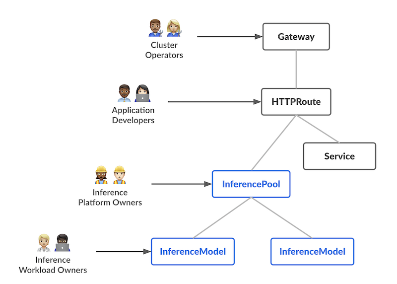

HTTPRoute는 `backendRefs`가 Service가 아니라 `InferencePool`이라는 점만 다르다.

```yaml
rules:
- backendRefs:
  - group: inference.networking.k8s.io
    kind: InferencePool                     # ← Service가 아니다
    name: llama32-1b
    weight: 1
  matches:
  - path: { type: PathPrefix, value: / }
  timeouts: { request: 60s }
```

```
클라이언트(curl)
  ↓
① Gateway (172.18.255.201:80)
  ↓
② HTTPRoute — 경로 매칭
  ↓
③ Envoy Gateway — backendRef가 InferencePool임을 인식
   "이건 일반 로드밸런싱이 아니라 EPP한테 물어봐야 하는 특수 백엔드"
  ↓
④ EPP — gRPC(ext_proc)로 "지금 이 풀의 Pod 중 어디로 보낼까?"
   각 Pod의 큐 길이 / 캐시 상태를 점수화해 하나 선택
  ↓
⑤ 선택된 Pod로 요청 전달
  ↓
⑥ 응답 반환
```

```bash
GW_IP=$(kubectl get gateway inference-pool-with-httproute -n default -o jsonpath='{.status.addresses[0].value}')
curl -X POST "http://${GW_IP}/v1/chat/completions" \
  -H "Content-Type: application/json" \
  -d '{"messages":[{"role":"user","content":"Say this is a test"}],"model":"llama-3.2-1b"}' | jq
{
  "choices":[{"message":{"role":"assistant","content":"This is definitely a test. ..."}}],
  "model":"bartowski/Llama-3.2-1B-Instruct-GGUF",
  "usage":{"completion_tokens":24,"prompt_tokens":40,"total_tokens":64,
           "prompt_tokens_details":{"cached_tokens":39}}
}
```

> [!warning] llama.cpp로 하면 EPP 로그에 501이 계속 찍힌다
> - `llama.cpp`는 <span class="t-red">vLLM 전용 메트릭 프로토콜을 구현하지 않는다.</span> 그래서 EPP가 메트릭을 긁을 때 `dispatch failed ... 501`이 반복된다.
> - 라우팅 자체는 정상이고 <span class="t-red">스케줄링 신호 품질만 저하</span>된다. 바꿔 말하면 EPP의 지능은 <span class="t-red">모델 서버가 내보내는 메트릭에 전적으로 의존</span>한다.
> - 이 제약이 7W-2 자료가 vLLM으로 다시 실습을 구성하는 이유이기도 하다.

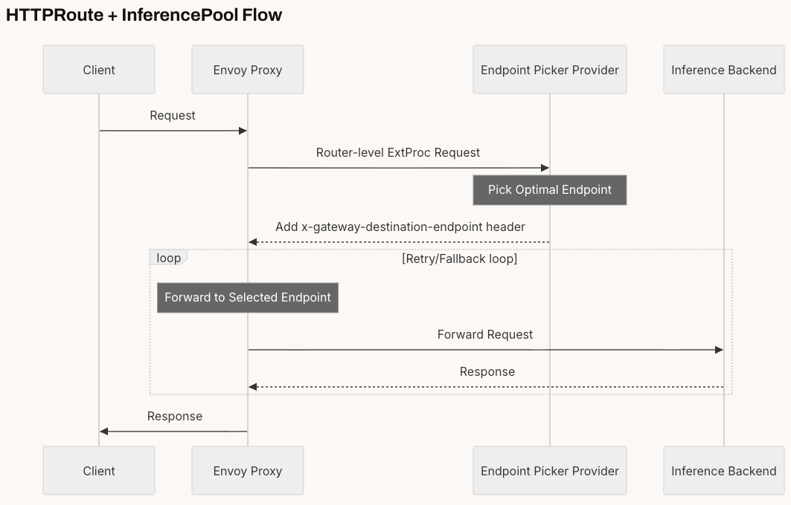

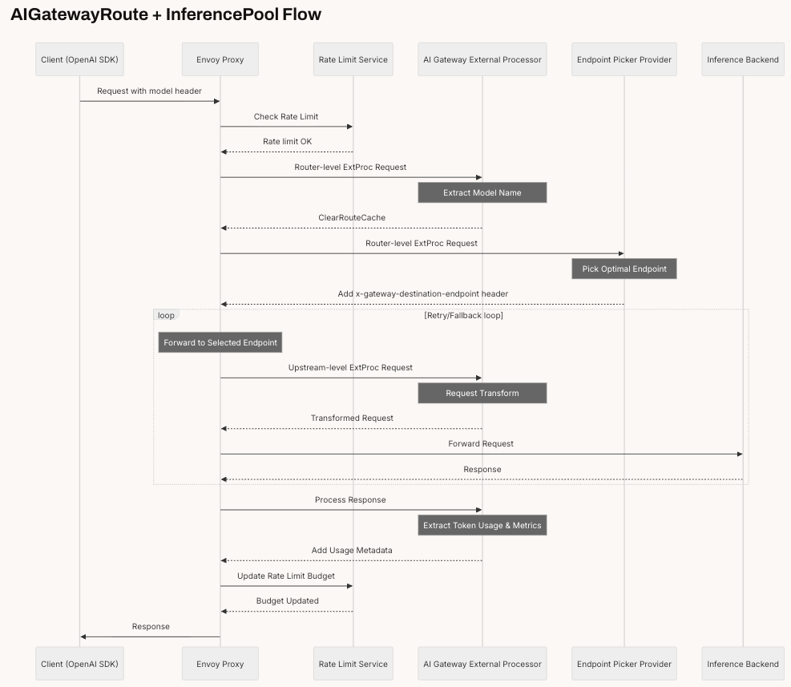

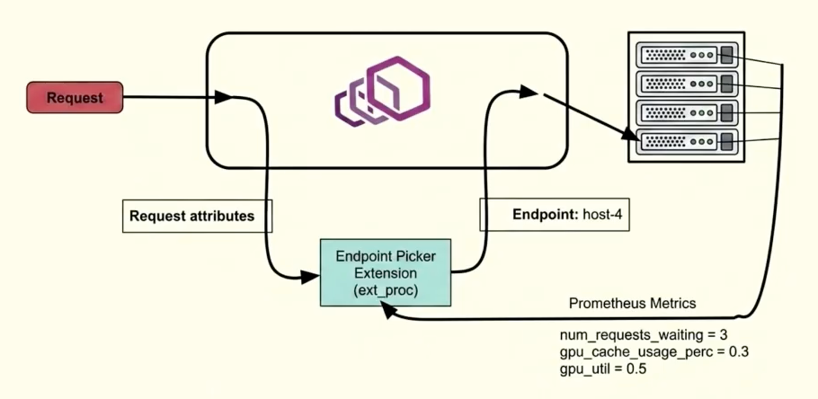

---
---
## Part 3. llm-d

여기서부터가 GPU가 필요한 구간이라 자료를 읽는 데 집중했다. 다만 <span class="t-red">"왜 이런 설계인가"</span>는 앞선 6주 내용과 그대로 이어져서 따라가기 어렵지 않았다.

---
### 왜 Kubernetes Service로는 부족한가

이 질문의 답이 llm-d 전체를 설명한다.

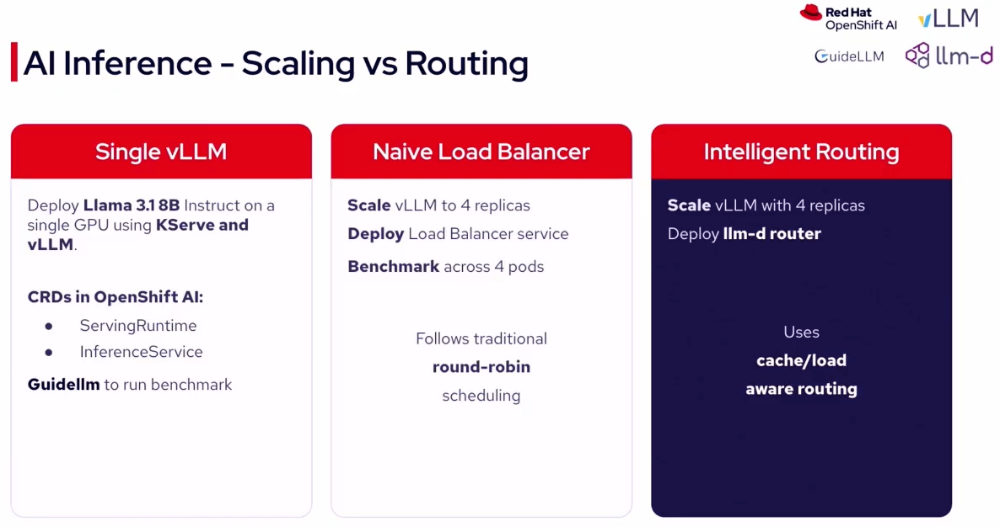

```
[일반적인 방식]
Client → k8s Service(ClusterIP) → kube-proxy(iptables) → 파드
         └ 연결 단위 무작위 배정, keep-alive로 그대로 고착
         └ 어느 파드가 바쁜지, 어느 파드가 내 프롬프트를 캐싱하고 있는지 전혀 모름

[llm-d 방식]
Client → Envoy(:8081) → [ext_proc gRPC: 어느 파드로 보낼지 결정] → 결정된 파드로 직접 프록시
         └ 매 요청마다 EPP가 판단해 목적지를 동적으로 지정하는 L7 라우팅
```

Envoy 설정에서 이 "매 요청마다 목적지를 바꾼다"를 가능하게 하는 트릭이 있다.

```yaml
- name: original_destination_cluster
  type: ORIGINAL_DST                    # 고정 엔드포인트 목록이 없는 특수 클러스터 타입
  lb_policy: CLUSTER_PROVIDED
  original_dst_lb_config:
    use_http_header: true
    http_header_name: x-gateway-destination-endpoint
```

> [!tip] `ORIGINAL_DST` + `x-gateway-destination-endpoint`
> - EPP가 ext_proc 단계에서 요청 헤더에 `x-gateway-destination-endpoint: <파드IP>:<포트>`를 심으면, Envoy는 <span class="t-red">그 헤더 값 그대로 해당 파드에 직접 연결</span>한다.
> - 즉 로드밸런싱 결정을 Envoy의 표준 알고리즘(RR, least-request)이 아니라 <span class="t-red">EPP가 매 요청 단위로 100% 위임받아 내린다.</span>
> - kube-proxy의 "연결 단위 무작위 배정 후 keep-alive 고착" 문제가 <span class="t-red">구조적으로 발생할 수 없다.</span> 요청마다 헤더로 새로 지정하니까.
> - `circuit_breakers.max_connections: 40000` 같은 값도 눈여겨볼 만하다. 긴 LLM 스트리밍 응답이 오래 열려 있는 것을 견디려고 사실상 제한을 해제해둔 것이다.

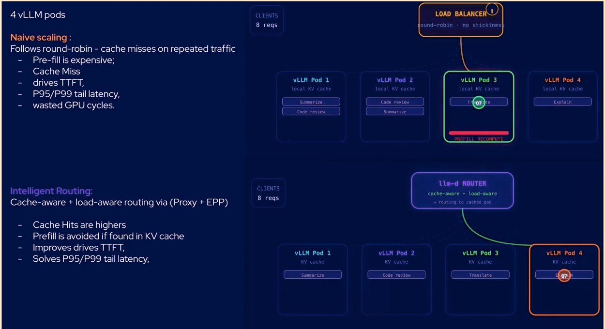

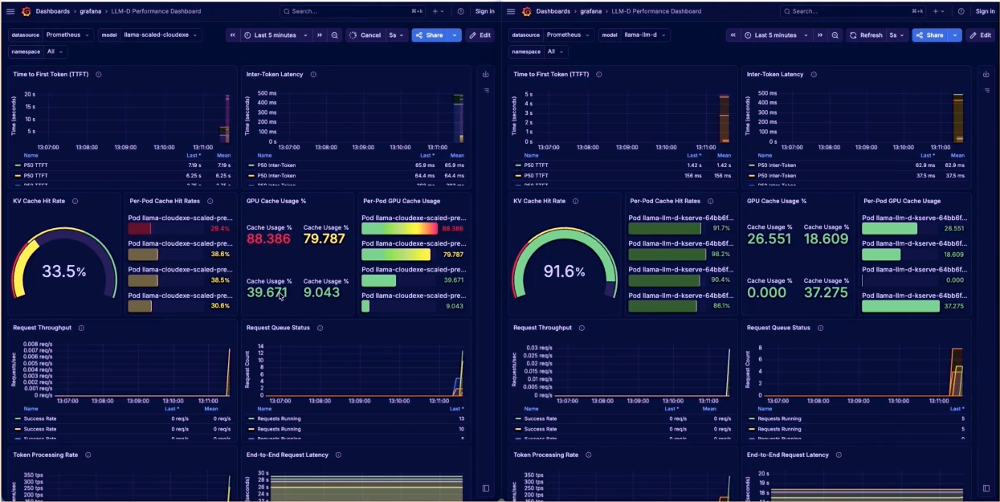

---
### llm-d 개요

- <span class="t-red">CNCF 샌드박스 프로젝트</span>, 쿠버네티스 네이티브 LLM 추론 서빙(라우팅) 스택
- vLLM / SGLang 같은 기존 엔진을 <span class="t-red">대체하는 게 아니라 감싸서 확장</span>
- 하드웨어 무관 : NVIDIA GPU, AMD ROCm, Google TPU, Intel XPU, CPU x86_64, Rebellions NPU 등 벤더별 메인테이너가 있다
- 자체 벤치마크 기준 <span class="t-red">처리량 최대 3배, 응답속도 2배, 토큰/초 최대 70% 개선</span>
- <span class="t-red">Well-Lit Paths</span> : 검증된 배포 레시피(기초 설정 + 워크로드별 패턴)를 제공해 처음부터 아키텍처를 설계할 필요가 없게 한다

지원하는 Gateway Provider는 <span class="t-red">GKE Gateway / Istio / Agentgateway / Envoy AI Gateway(= Agent Router)</span>다. 즉 llm-d는 특정 게이트웨이에 종속되지 않는다.

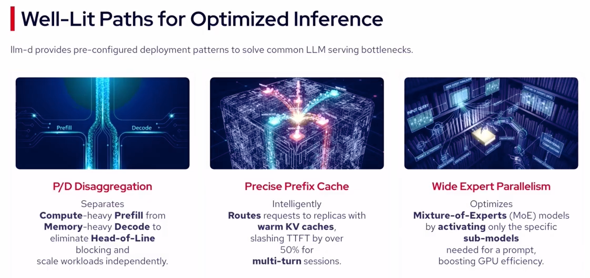

---
### 3대 구성요소

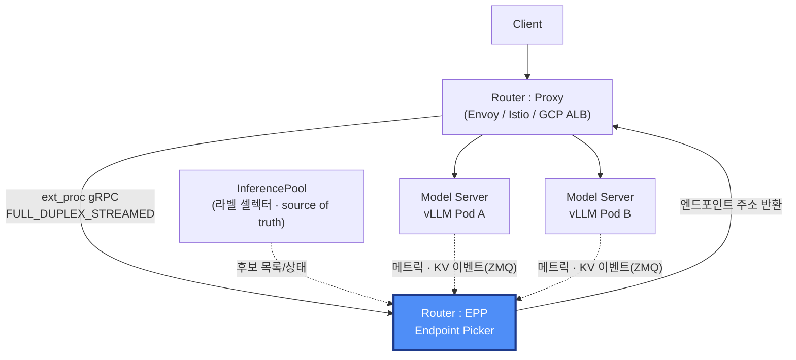
```mermaid
flowchart TD
    C["Client"] --> P["Router : Proxy<br/>(Envoy / Istio / GCP ALB)"]
    P -- "ext_proc gRPC<br/>FULL_DUPLEX_STREAMED" --> E["Router : EPP<br/>Endpoint Picker"]
    E -- "엔드포인트 주소 반환" --> P
    P --> M1["Model Server<br/>vLLM Pod A"]
    P --> M2["Model Server<br/>vLLM Pod B"]
    IP["InferencePool<br/>(라벨 셀렉터 · source of truth)"] -. "후보 목록/상태" .-> E
    M1 -. "메트릭 · KV 이벤트(ZMQ)" .-> E
    M2 -. "메트릭 · KV 이벤트(ZMQ)" .-> E

    style E fill:#4F8EF7,stroke:#1E3A8A,stroke-width:3px,color:#fff
```

| 구성요소 | 역할 |
| --- | --- |
| **Router** | Proxy(고성능 L7, GAIE 표준) + <span class="t-red">EPP</span>(실시간 메트릭·KV 캐시 친화성·정책으로 최적 파드를 채점/선택) |
| **InferencePool** | 같은 모델을 서빙하는 파드들을 라벨로 그룹화. 내부에 prefill/decode 역할 등 <span class="t-red">Variant</span> 개념 |
| **Model Server** | vLLM / SGLang / TensorRT-LLM 등 실제 추론 엔진 |

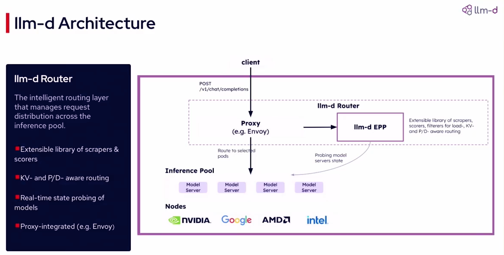

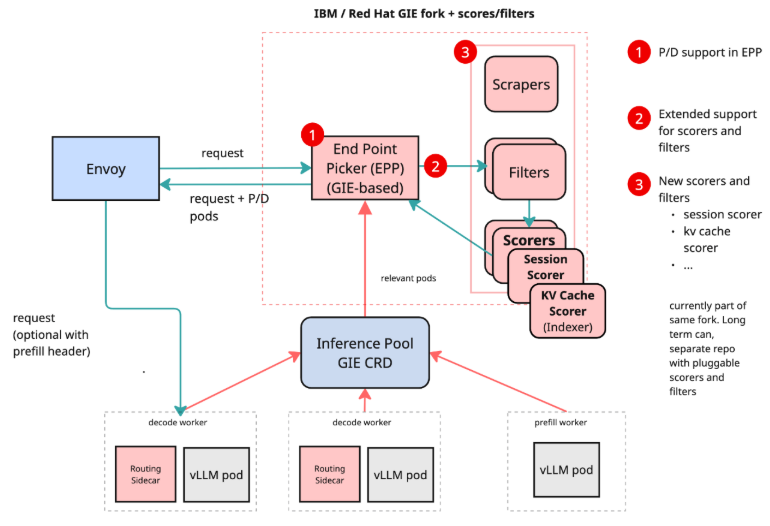

역할 분담을 한 줄로 요약하면 이렇다.

> **InferencePool** = "<span class="t-red">누가 후보인가</span>" (엔드포인트 디스커버리)
> **Router/EPP** = "<span class="t-red">그 중 누구를 고를 것인가</span>" (지능형 선택 로직)

---
### InferencePool

```yaml
spec:
  selector:            # 파드 검색용 라벨 셀렉터
  targetPorts:         # 실제 추론 트래픽 포트 (vLLM의 8000)
  endpointPickerRef:   # EPP 서비스 참조
  failureMode:         # EPP 실패 시 FailOpen / FailClose
```

- 파드가 스케일 인/아웃되거나 Ready 상태가 바뀌면 <span class="t-red">건강한 후보 목록을 자동 갱신</span>
- `HTTPRoute`의 `backendRef`로 쓰이면서 프록시의 <span class="t-red">ext_proc 필터 설정을 담당</span>한다 — envoy.yaml의 `ext_proc` cluster가 가리킬 EPP 주소를 여기서 제공
- 격리 원칙 : 파드 / EPP 서비스 / InferencePool 간의 모든 참조는 <span class="t-red">같은 네임스페이스 내로 엄격히 제한</span>

> [!info] 멀티 InferencePool 시나리오
> - 원칙은 `InferencePool 1개 = 모델의 논리적 배포 1개 = EPP 배포 1개`
> - <span class="t-red">Prefill/Decode 분리</span> : 서로 다른 InferencePool로 나눠 각각 독립 스케일링
> - <span class="t-red">멀티 모델/버전</span> : 모델 버전별로 풀을 나눠 관리

---
### EPP — llm-d 배포의 두뇌

EPP는 요청을 6단계 파이프라인으로 처리한다.

```
요청 도착 → 외부 처리(ext-proc) → 요청 핸들링 → 플로우 제어 → 요청 스케줄링 → 요청 프록시
                                                                    ↑
                                    Data Layer가 백그라운드에서 k8s API와 메트릭을 비동기 수집
```

**① Request Handler — 요청의 생명주기 관리자**

| 컴포넌트 | 역할 |
| --- | --- |
| **Parser** | 원시 요청을 EPP 내부 구조로 변환, 응답에서 usage 데이터 추출 |
| **DataProducer** | 스케줄링에 필요한 상태 생성 — 토큰화, 캐시 매칭, 지연시간 예측 |
| **Admitter** | SLO 기준 충족 여부 판단, 미충족 시 즉시 반려 |

| 파서 | 지원 |
| --- | --- |
| `openai-parser` (기본) | OpenAI HTTP — `/chat/completions`, `/completions`, `/embeddings` |
| `vllmgrpc-parser` | vLLM gRPC — Generate, Embed |
| `passthrough-parser` | 범용, 페이로드 해석 없음 → <span class="t-red">본문 기반 스케줄링 불가</span> |

기본 제공 DataProducer도 이름만 봐도 무엇을 하는지 보인다.

- `predicted-latency-producer` : <span class="t-red">XGBoost로 TTFT/TPOT 예측</span>
- `inflight-load-producer` : 엔드포인트별 진행 중 요청/토큰 수 추적
- `approx-prefix-cache-producer` : 프롬프트 해싱 기반 캐시 매칭
- `latency-slo-admitter` : SLO 미충족 시 낮은 우선순위 요청 거부

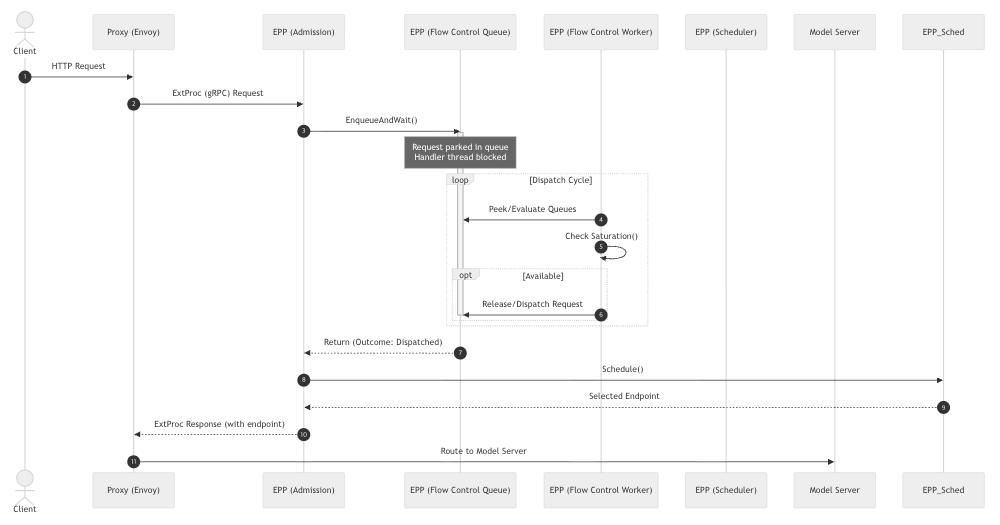

**② Flow Control — 모델 서버 풀을 과부하로부터 지키는 중앙 큐**

일반적인 RPS 기반 제한과 다른 이유는, LLM 서빙의 리소스 소비가 <span class="t-red">비선형</span>이기 때문이다.

| 문제 | 내용 |
| --- | --- |
| Noisy Neighbor | 큰 프롬프트를 던지는 테넌트가 KV 캐시를 독점 |
| <span class="t-red">스케줄링 후회</span> | 일단 디스패치하면 재라우팅 불가 → 신중한 디스패치 타이밍 필요 |
| 우선순위 역전 | 낮은 우선순위 배치 작업이 중요 요청을 막음 |
| 리소스 비대칭 | 컨텍스트 크기 차이가 극심함 |

3계층 디스패치 구조를 갖는다 (`FlowKey = FairnessID + Priority`).

| 계층 | 역할 | 제어 방식 |
| --- | --- | --- |
| Tier 1 : Priority Band | 최우선 대역 선택 | 고정 |
| Tier 2 : Fairness | 대역 내 테넌트/플로우 선택 | `FairnessPolicy` 플러그인 |
| Tier 3 : Ordering | 플로우 내 개별 요청 순서 | `OrderingPolicy` 플러그인 |

```bash
# 우선순위는 헤더로 지정. 음수 우선순위 = "생략 가능(sheddable)" 요청
curl -X POST http://${IP}:${PORT}/v1/completions \
  -H 'Content-Type: application/json' \
  -H 'x-llm-d-inference-fairness-id: tenant-a' \
  -H 'x-llm-d-inference-objective: premium-traffic' \
  -d '{"model": "default-model", "prompt": "Say hello"}'
```

| 구분 | 플러그인 | 동작 |
| --- | --- | --- |
| Fairness | `round-robin-fairness-policy` | 활성 플로우를 순회 처리 |
| Fairness | `global-strict-fairness-policy` | 플로우 격리 무시, 전역 순서 엄격 적용 |
| Ordering | `fcfs-ordering-policy` | 도착 순서 |
| Ordering | `edf-ordering-policy` | 최소 데드라인 우선(EDF) |
| Ordering | `slo-deadline-ordering-policy` | `x-llm-d-slo-ttft-ms` 헤더 기반 SLO 데드라인 |

SaturationDetector(게이트키퍼)는 두 가지다.

| 플러그인 | 방식 | 장단점 |
| --- | --- | --- |
| `utilization-detector` | 폐루프(실시간 텔레메트리) | 정확하지만 <span class="t-red">지연 존재</span> |
| `concurrency-detector` | 개루프(활성 요청 카운팅) | 즉각적이나 <span class="t-red">실제 메모리 압력은 모름</span> |

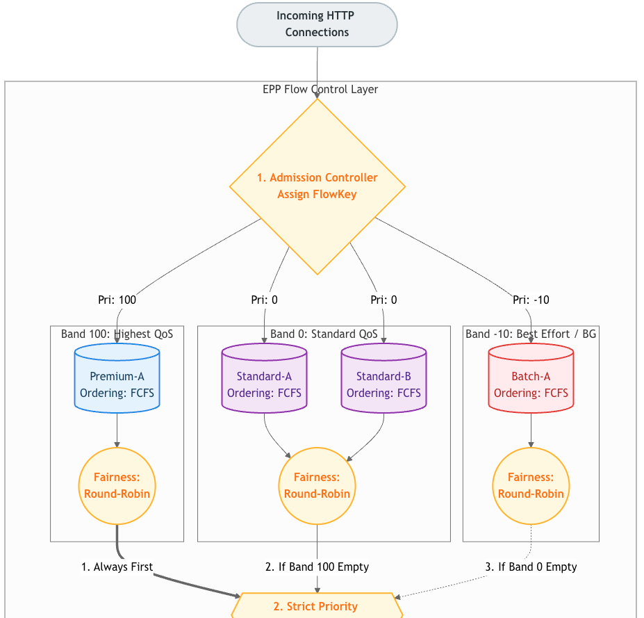

실패는 HTTP 코드로 매핑된다.

| 상태 | HTTP | 의미 |
| --- | --- | --- |
| `QueueOutcomeRejectedCapacity` | 429 | 큐 용량 초과 |
| `QueueOutcomeEvictedTTL` | 503 | TTL 만료 |
| `QueueOutcomeEvictedContextCancelled` | 503 | 클라이언트 연결 끊김 |
| graceful drain | 503 | 종료 중, 재시도 권장 |

**③ Request Scheduler — Filter → Score → Pick**

EPP 파이프라인의 마지막 결정 단계다.

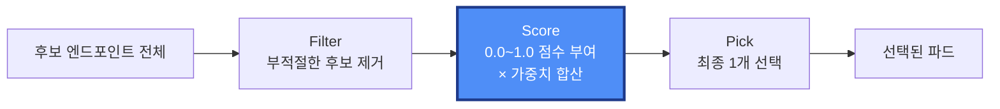
```mermaid
flowchart LR
    A["후보 엔드포인트 전체"] --> F["Filter<br/>부적절한 후보 제거"]
    F --> S["Score<br/>0.0~1.0 점수 부여<br/>× 가중치 합산"]
    S --> P["Pick<br/>최종 1개 선택"]
    P --> O["선택된 파드"]

    style S fill:#4F8EF7,stroke:#1E3A8A,stroke-width:3px,color:#fff
```

| 단계 | 플러그인 | 기능 |
| --- | --- | --- |
| Filter | `prefix-cache-affinity-filter` | 프리픽스 캐시 점수 높은 sticky 엔드포인트 우선, 느리면 제외 |
| Filter | `slo-headroom-tier-filter` | SLO 여유(헤드룸) 기준 필터링 |
| Filter | `label-selector-filter` | 레이블 셀렉터 매칭 엔드포인트만 유지 |
| Filter | `prefill-endpoints-filter` / `decode-endpoints-filter` | P/D 분리 시 역할별 필터링 |

| Score 플러그인 | 스코어링 근거 |
| --- | --- |
| `kv-cache-utilization-scorer` | KV 캐시 사용률 낮을수록 고점 |
| `latency-scorer` | 예측 지연시간과 SLO 간 여유 |
| `lora-affinity-scorer` | 요청 LoRA 어댑터가 이미 로드된 엔드포인트 선호 |
| `prefix-scorer` | <span class="t-red">프리픽스 캐시 일치 길이</span> |
| `queue-depth-scorer` | 대기열 짧을수록 고점 |
| `running-requests-size-scorer` | 활성 요청 수 |
| `token-load-scorer` | 처리 중인 전체 토큰량 |
| `session-affinity-scorer` | 같은 세션의 이전 요청을 처리했던 엔드포인트 최고점 |
| `no-hit-lru-scorer` | 캐시 미스 요청을 아직 안 받은 엔드포인트에 우선권 (<span class="t-red">prefill 부하 균등화</span>) |

점수는 <span class="t-red">가중치 곱 합산</span>이다. Scorer A(가중치 2.0)=0.8, Scorer B(가중치 1.0)=0.5 → 최종 `0.8×2.0 + 0.5×1.0 = 2.1`.

Pick은 `max-score-picker`(기본, 최고 점수 1개), `random-picker`, `weighted-random-picker`(점수를 확률로) 셋이다.

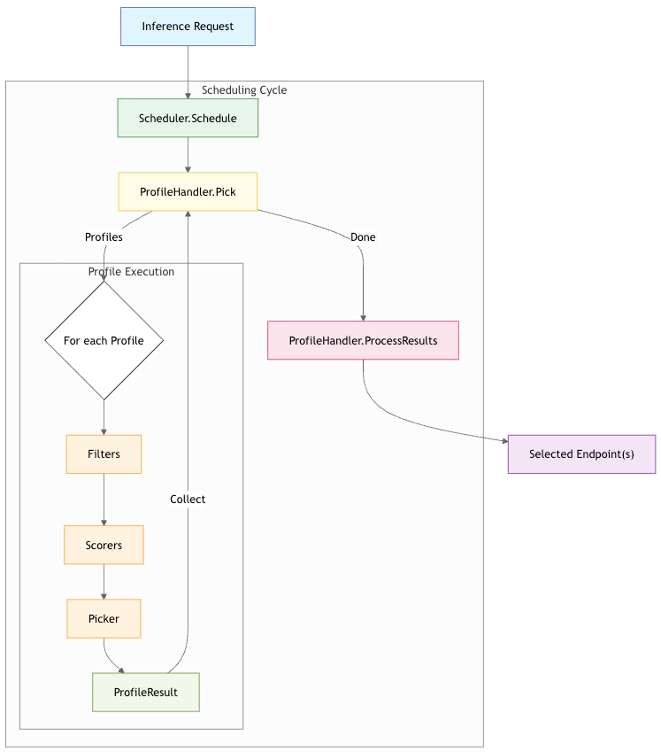

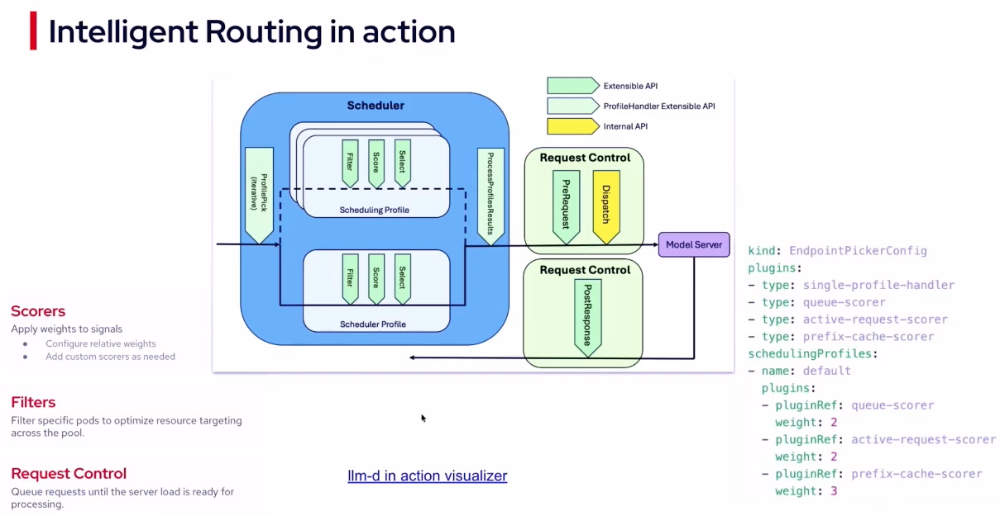

> [!tip] Week5의 결론이 그대로 코드가 되어 있다
> - Week5에서 "LLM 서빙의 진짜 병목은 연산이 아니라 <span class="t-red">KV Cache 메모리</span>"라고 정리했었다.
> - llm-d의 스코어러 9개 중 `kv-cache-utilization`, `prefix-scorer`, `no-hit-lru`, `token-load` 네 개가 <span class="t-red">전부 메모리/캐시 축</span>이다.
> - Week6에서 본 KEDA GPU Scaler의 `vllm-inference` 프로필이 GPU Util이 아니라 Memory % 기준이었던 것과 같은 이야기다. 이 표를 보는 순간 지난 몇 주가 한 줄로 꿰였다.

**④ Data Layer — 판단 근거를 준비하는 순수 데이터 파이프라인**

각 Endpoint(파드)마다 스레드세이프·타입세이프 속성 맵을 유지하고, 수집된 값을 채워 넣는다.

| 유형 | 방식 | 구현 예시 | 수집 대상 |
| --- | --- | --- | --- |
| Polling Data Sources | 주기적 폴링 | `metrics-data-source` → `core-metrics-extractor` | `KVCacheUsagePercent`, `WaitingQueueSize` |
| Notification Sources | k8s 리소스 변경 이벤트 | `k8s-notification-source` | Pod/Service 변경 |
| Endpoint Event Sources | 엔드포인트 생명주기 | `endpoint-notification-source` | 파드 추가/삭제/업데이트 |

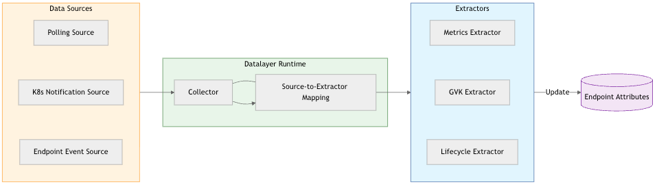

**⑤ EndpointPickerConfig — 그래프 기반 설정**

```yaml
apiVersion: llm-d.ai/v1alpha1
kind: EndpointPickerConfig
plugins: [...]            # 노드 : 모든 플러그인 인스턴스 정의
featureGates: [...]       # 예: flowControl
parser: {...}
flowControl: {...}
saturationDetector: {...}
schedulingProfiles: [...] # 엣지 : pluginRef로 플러그인을 참조하는 연결
dataLayer: {...}
```

- k8s CRD처럼 생겼지만 <span class="t-red">실제 CRD가 아니다.</span> EPP 프로세스가 시작 시점에 한 번만 읽는 정적 설정 파일이다
- `--config-file /etc/epp/epp-config.yaml` (보통 ConfigMap 마운트) 또는 `--config-text`로 전달
- 검증(pluginRef 미존재, 이름 중복, 프로필당 Picker 2개 이상, DataProducer 순환 의존성)은 <span class="t-red">전부 시작 시점에만</span> 수행된다
- Defaulting이 잘 되어 있어서 <span class="t-red">아무 설정도 안 해도 합리적인 기본 동작</span>을 한다 (schedulingProfiles 생략 시 전체 플러그인 포함 default 프로필 자동 생성, Picker 미지정 시 `max-score-picker` 자동 주입)

> [!warning] 핫 리로드가 없다
> - "configuration is not reconciled by a controller" — EPP는 시작 시 전체 플러그인 그래프를 한 번 구성하고 끝이다.
> - 설정을 바꾸려면 <span class="t-red">EPP 프로세스를 재시작</span>해야 한다.
> - 운영 권장사항 : 배포 전 로컬에서 스키마/pluginRef 검증, `replicas > 1` <span class="t-red">+ leader 선출</span>로 롤링 재시작 시 무중단 전환, 기능 롤백은 Feature Gate 비활성화로 대응.
> - CRD처럼 생긴 YAML인데 컨트롤러가 reconcile하지 않는다는 점이 처음에 헷갈렸다. <span class="t-red">모양이 비슷하다고 동작까지 같지는 않다</span>는 걸 짚어두게 된 부분.

---
### Model Server가 지켜야 할 계약

EPP의 지능은 결국 모델 서버가 내보내는 메트릭에 달려 있다. 그래서 요구사항이 명시돼 있다.

| 메트릭 | 타입 | 의미 |
| --- | --- | --- |
| `TotalQueuedRequests` | Gauge | 대기 중 요청 수 |
| `TotalRunningRequests` | Gauge | 활성 처리 중 요청 수 |
| `KVCacheUtilization` | Gauge | <span class="t-red">KV 캐시 사용률(%)</span> |
| `BlockSize` (선택) | Gauge | 토큰 단위 블록 크기 |
| `NumGPUBlocks` (선택) | Gauge | HBM KV 캐시 총 블록 수 |

엔진별 실제 이름은 다르고, EPP가 표준 키로 변환한다.

- vLLM : `vllm:num_requests_waiting`, `vllm:kv_cache_usage_perc`
- SGLang : `sglang_num_queue_reqs`, `sglang_token_usage`
- TensorRT-LLM : `/prometheus/metrics`의 `trtllm_*`

엔진 종류는 파드 레이블로 명시한다 — `llm-d.ai/engine-type: vllm|sglang|trtllm-serve|triton-tensorrt-llm`

> [!info] 프리픽스 캐싱은 모델 서버가 지원해야 의미가 있다
> - vLLM의 `--enable-prefix-caching`이 대표 예시다.
> - 앞선 Agent Router 자료에서 llama.cpp로 501이 났던 이유가 바로 이 계약을 구현하지 않았기 때문이다.

---
### KV Cache Management — llm-d의 3계층

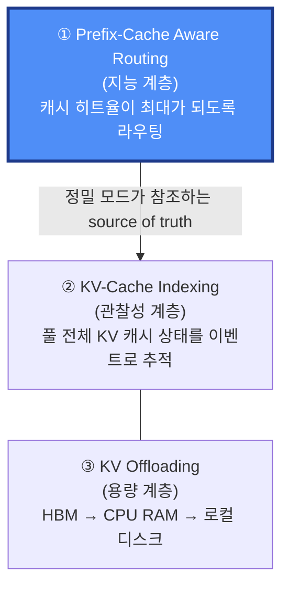
```mermaid
flowchart TD
    A["① Prefix-Cache Aware Routing<br/>(지능 계층)<br/>캐시 히트율이 최대가 되도록 라우팅"]
    B["② KV-Cache Indexing<br/>(관찰성 계층)<br/>풀 전체 KV 캐시 상태를 이벤트로 추적"]
    C["③ KV Offloading<br/>(용량 계층)<br/>HBM → CPU RAM → 로컬 디스크"]
    A -- "정밀 모드가 참조하는 source of truth" --> B
    B --- C

    style A fill:#4F8EF7,stroke:#1E3A8A,stroke-width:3px,color:#fff
```

**① Prefix-Cache Aware Routing : 근사 vs 정밀**

| 항목 | 근사(Approximate) | 정밀(Precise) |
| --- | --- | --- |
| 구성 | `approx-prefix-cache-producer` + `prefix-cache-scorer` | `token-producer` + `precise-prefix-cache-producer` + `prefix-cache-scorer` + KV-Cache Indexer |
| 토큰화 | EPP에 토크나이저가 없어 <span class="t-red">문자-토큰 비율로 근사</span> | vLLM의 `/v1/completions/render` <span class="t-red">엔드포인트로 정확한 토큰 ID 획득</span> |
| 캐시 상태 파악 | 라우팅 후 "이 파드가 이제 갖고 있다"고 <span class="t-red">가정</span>하고 LRU 인덱스 갱신 | 모델 서버가 <span class="t-red">ZeroMQ로 KVEvents 실시간 방출</span>, Indexer가 전역 추적 |
| 장점 | 외부 의존성 없음, 가벼움, 사이드카·ZMQ 불필요 | 100% 정밀, 복잡한 캐시 제거 정책도 정확히 처리, P/D 분리 네이티브 지원 |
| 단점 | 파드 메모리 압박으로 <span class="t-red">캐시가 제거돼도 EPP는 모름</span>(상태 불일치), 문자 기반이라 정밀도 낮음 | vLLM render 엔드포인트 + ZMQ 필요, 리소스 오버헤드, 모델 서버 지원 필수 |

둘 다 <span class="t-red">추측적 인덱싱(speculative indexing)</span>이라는 장치를 쓴다. 라우팅 결정 시점과 실제 KVEvent 도착 사이의 "<span class="t-red">암흑 시간(blind spot)</span>"을 메우려고, 라우팅 직후 즉시 추정 항목을 인덱스에 선반영한다. (기본 TTL 2초)

**② KV-Cache Indexer**

모델 서버는 ZMQ로 3가지 이벤트를 발행한다.

| 이벤트 | 의미 |
| --- | --- |
| `BlockStored` | 새 캐시 블록 생성 |
| `BlockRemoved` | 블록 축출(eviction) |
| `AllBlocksCleared` | 파드 캐시 초기화 |

| 인덱스 백엔드 | 사용 사례 | 트레이드오프 |
| --- | --- | --- |
| In-Memory (기본) | 대부분의 배포 | 고정 엔트리 크기, 최저 지연시간 |
| Cost-Aware Memory | 가변 엔트리 크기 | 바이트 단위 예산 지정 가능 |
| Redis/Valkey | 영속적 상태 저장 | 네트워크 홉 오버헤드 |

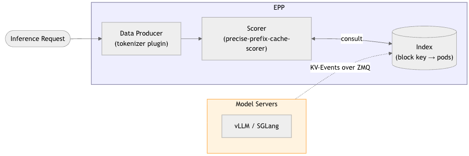

> [!tip] 스코어링은 "가장 긴 연속 prefix"다
> - KV 블록은 <span class="t-red">의존성 체인</span>을 형성한다. 서버는 끊기지 않은 prefix만 재사용할 수 있다.
> - 블록 B0~B3을 보유한 파드 → 점수 <span class="t-red">4</span>
> - B0, B1은 있지만 B2가 없는 파드 → 체인이 끊겨서 점수 <span class="t-red">2</span>
> - 블록은 티어별로 가중치가 다르다 (GPU=1.0, CPU=0.8)

**③ KV Offloading**

GPU HBM 용량 한계와 "인스턴스별로 캐시가 고립되는" 문제를 동시에 푼다.

| 방식 | 내용 |
| --- | --- |
| 네이티브 (vLLM `OffloadingConnector`) | `--kv-offloading-backend native --kv-offloading-size <GB>`. CPU 계층 또는 공유 스토리지로 디스패치 |
| Out-of-tree 커넥터 | <span class="t-red">LMCache, Mooncake, NVIDIA KVBM</span> — 캐시 로직이 별도 프로세스/서비스에 존재, 표준 커넥터 API로 통합 |

- **CPU Offloading** : GPU DMA 비동기 전송, 스테이징 버퍼용 pinned CPU 메모리. <span class="t-red">vLLM 0.12.0+의 연속 메모리 레이아웃으로 처리량 4~5배 향상</span>
- **llm-d FS Backend** : 파일시스템에 구애받지 않는 커넥터. POSIX 호환이면 블록을 파일로 저장 → 인스턴스 간 공유 + 재시작 후 지속성
- **MooncakeStoreConnector** : 중앙 Master가 메타데이터/축출 관리. Embedded(프로세스 내 DRAM 풀) / Standalone-store(SSD 지원 외부 클라이언트)

> 권장 지침은 단순하다. <span class="t-red">CPU DRAM이 GPU HBM보다 크면 CPU offloading은 항상 켠다.</span> 스토리지 offloading은 캐시가 단일 노드 용량을 넘거나 노드 간 공유가 가치 있을 때.

---
### 실습 자료 ① 베이스라인부터 만들기

llm-d를 붙이기 전에 <span class="t-red">비교 대상</span>을 먼저 만드는 순서가 좋았다. 새 기술을 도입할 때 "before"를 남겨두지 않으면 나중에 효과를 말할 수 없다.

```bash
# K3s — traefik / servicelb 비활성화 (Envoy Gateway + MetalLB를 쓸 것이므로)
curl -sfL https://get.k3s.io | sh -s - server \
  --disable traefik --disable servicelb \
  --kube-controller-manager-arg=bind-address=0.0.0.0 \
  --kube-scheduler-arg=bind-address=0.0.0.0 \
  --kube-proxy-arg=metrics-bind-address=0.0.0.0 \
  --write-kubeconfig-mode=644

# NVIDIA device plugin
helm install nvdp nvdp/nvidia-device-plugin -n nvidia-device-plugin --create-namespace \
  --set runtimeClassName=nvidia
kubectl label node gpupc nvidia.com/gpu.present=true    # 최신 차트는 NFD 라벨을 nodeAffinity로 요구

kubectl describe node gpupc | grep -A7 Allocatable
Allocatable:
  cpu:                 16
  memory:              65432564Ki
  nvidia.com/gpu:      1
```

**GPU 1장으로 파드 2개를 띄우기 — HAMi**

llm-d의 라우팅을 보려면 vLLM 파드가 최소 2개 필요하다. 그런데 GPU는 한 장뿐이다. 여기서 <span class="t-red">HAMi</span>를 쓴다. (NVIDIA device plugin은 제거 — 둘 다 `nvidia.com/gpu`를 관리해서 충돌)

```bash
helm uninstall nvdp -n nvidia-device-plugin
kubectl label nodes gpupc gpu=on
helm install hami hami-charts/hami -n kube-system --version 2.10.0 -f hami-values.yaml
```

```yaml
# Deployment에서 GPU를 반씩 쪼개 쓴다
spec:
  schedulerName: hami-scheduler
  runtimeClassName: nvidia
  containers:
  - resources:
      limits:
        nvidia.com/gpu: "1"
        nvidia.com/gpucores: "50"             # ← SM 50%
        nvidia.com/gpumem-percentage: "50"    # ← VRAM 50%
```

> [!info] Week6의 한계가 여기서 풀린다
> - Week6 Lab 6에서 <span class="t-red">TP=2가 NeuronCore 2개를 전부 점유해서 레플리카를 못 늘렸다.</span> HPA가 `replicas: 2`를 만들어도 영원히 `Pending`이었다.
> - 이번 자료는 HAMi로 <span class="t-red">가속기 자체를 논리적으로 쪼개서</span> 그 문제를 우회한다.
> - "TP를 쓰면 수평 확장 여지가 줄어든다"는 Week6의 결론에 대한, 한 가지 현실적인 답을 본 셈이다. GPU가 생기면 가장 먼저 따라 해보고 싶은 부분이기도 하다.

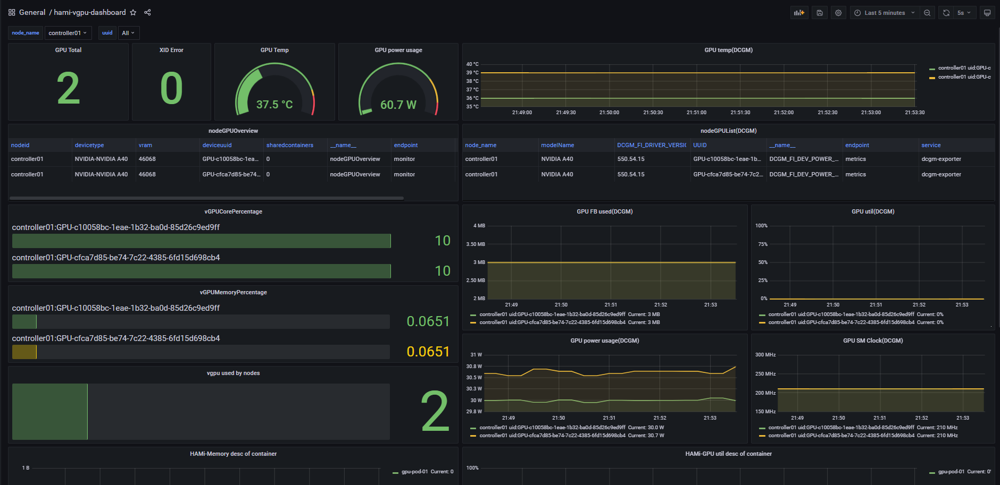

**vLLM 배포 — 가중치는 S3에서 스트리밍**

```yaml
args:
  - |
    python3 -c "import runai_model_streamer" 2>/dev/null || pip install --no-cache-dir vllm[runai]
    exec vllm serve s3://models/Qwen3-0.6B-FP8 \
      --served-model-name Qwen3-0.6B-FP8 \
      --load-format runai_streamer \          # FUSE 마운트 대신 스트리밍 로더로 S3 직접 연결
      --host 0.0.0.0 --port 8000 \
      --max-model-len 8192 \
      --enforce-eager \
      --gpu-memory-utilization 0.8 \
      --kv-cache-dtype fp8
env:
  - name: VLLM_CACHE_ROOT
    value: /vllm-cache                        # torch.compile 캐시를 노드 hostPath에 영속화
```

**벤치마크를 CronJob으로 반복 실행**

```bash
vllm bench serve \
  --backend vllm --endpoint /v1/completions \
  --host qwen3-0-6b-fp8.vllm.svc.cluster.local --port 8000 \
  --model Qwen3-0.6B-FP8 --tokenizer Qwen/Qwen3-0.6B-FP8 \
  --dataset-name sharegpt --dataset-path /data/ShareGPT_V3_unfiltered_cleaned_split.json \
  --num-prompts 50 --max-concurrency 8 --seed 42 \
  --percentile-metrics ttft,tpot,itl,e2el \
  --save-result --save-detailed --result-dir /results \
  --plot-timeline --plot-dataset-stats
```

```
============ Serving Benchmark Result ============
Successful requests:                     50
Maximum request concurrency:             8
Benchmark duration (s):                  26.44
Request throughput (req/s):              1.89
Output token throughput (tok/s):         441.66
Total token throughput (tok/s):          906.86
---------------Time to First Token----------------
Mean TTFT (ms):                          49.56
P99 TTFT (ms):                           72.43
-----Time per Output Token (excl. 1st token)------
Mean TPOT (ms):                          15.18
----------------End-to-end Latency----------------
Mean E2EL (ms):                          3581.47
P99 E2EL (ms):                           12028.22
==================================================
```

> [!warning] seed를 고정하면 프리픽스 캐시 실험이 왜곡된다
> - vLLM bench의 ShareGPT 샘플링은 seed로 초기화된 의사난수로 94,145개 대화를 정렬/셔플한 뒤 앞에서부터 `num_prompts`개를 뽑는다.
> - 즉 <span class="t-red">seed가 같으면 언제 실행하든 항상 같은 대화가 같은 순서로 선택</span>된다 → 프리픽스 캐시 히트율이 인위적으로 높게 나온다.
> - 그래서 자료에서는 `--seed $(date +%s)`로 매번 다르게 바꿔 다시 측정한다. <span class="t-red">벤치마크 설계에서 가장 놓치기 쉬운 함정</span>이라 따로 메모해뒀다.
> - 또 하나 : 최초 실행에서 memory limit 2Gi로 OOMKilled가 났다고 한다. vLLM CLI 임포트 + <span class="t-red">642MB ShareGPT JSON 파싱</span> 오버헤드 때문. requests 2Gi / limits 6Gi로 상향해 해결.

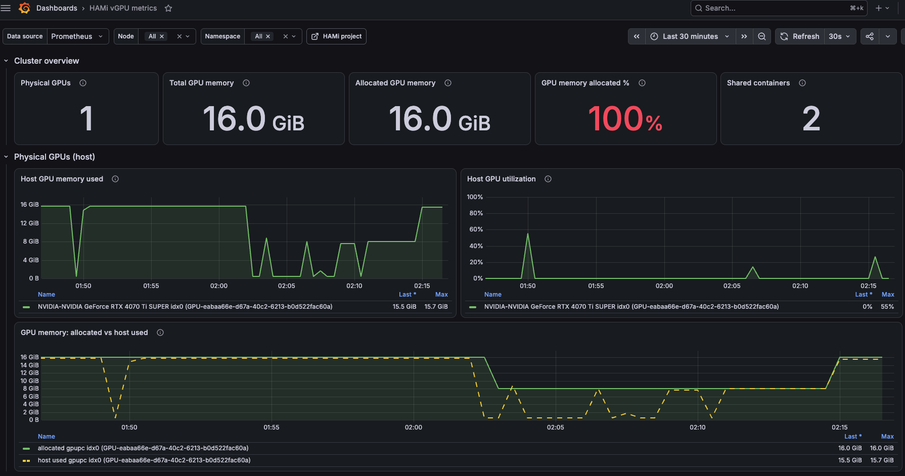

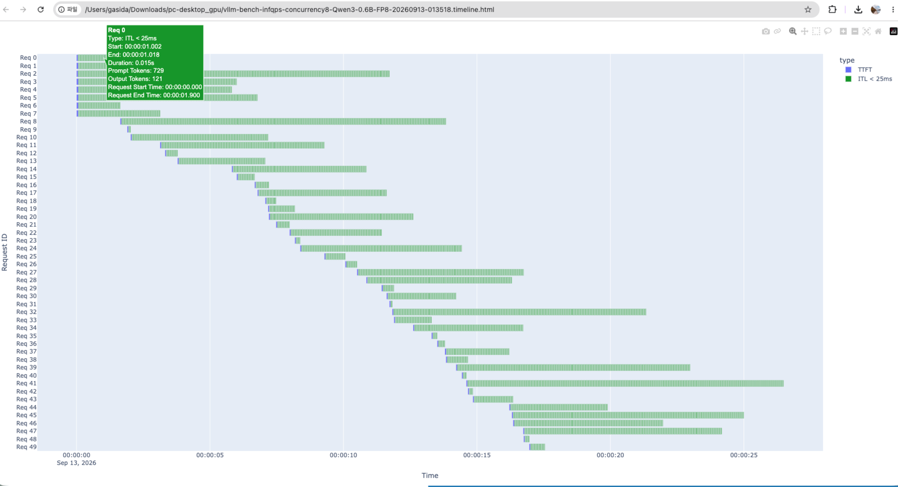

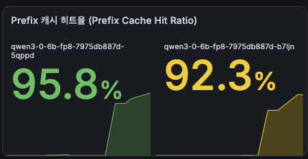

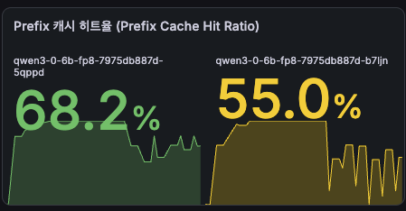

프리픽스 캐시 실험용으로는 `prefix_repetition` 데이터셋을 쓴다. 합성 프롬프트를 자체 생성하므로 파일이 필요 없다.

```bash
vllm bench serve ... \
  --dataset-name prefix_repetition \
  --prefix-repetition-num-prefixes 5 \
  --prefix-repetition-prefix-len 512 \
  --prefix-repetition-suffix-len 128 \
  --prefix-repetition-output-len 128
```

---
### 실습 자료 ② llm-d 설치 (Phase 1~8)

```
Client (curl/bench)
   │
   ▼
Envoy Gateway (데이터플레인, envoy-gateway-system)
   │  Agent Router가 이 위에 설정을 얹음 (envoy-ai-gateway-system)
   │  InferencePool feature-flag 활성화됨
   │  ext-proc (gRPC)
   ▼
EPP (llm-d 커스텀 이미지 + 플러그인) ── InferencePool ── [Qwen3-0.6B-FP8 pod A]
   │  prefix-cache indexer (KV 이벤트 ZMQ 구독)          [Qwen3-0.6B-FP8 pod B]
   ▼
선택된 vLLM 파드로 요청 포워딩
```

| Phase | 내용 | 버전 |
| --- | --- | --- |
| 1 | Gateway API 표준 CRD + Envoy Gateway | Gateway API v1.3.0 / EG v1.9.1 |
| 2 | Agent Router CRD + Controller | v1.1.0 |
| 3 | <span class="t-red">GAIE CRD + Envoy Gateway에 InferencePool 기능 활성화</span> | GAIE v1.6.1 |
| 4 | 기존 vLLM 파드 연동 (InferencePool + EPP + HTTPRoute) | llm-d-router-gateway chart v0.10.0 |
| 5 | <span class="t-red">Precise Prefix-Cache-Aware Routing 활성화</span> | — |
| 6 | Prefix-Aware Scheduling 테스트 A/B/C | — |
| 7 | 메트릭 수집 (PodMonitor / ServiceMonitor) | — |
| 8 | Grafana 대시보드 3종 + (옵션) Jaeger 트레이싱 | — |

> [!info] Agent Router의 고유 기능은 이번 구성에서 쓰지 않는다
> - `AIGatewayRoute` 같은 다중 프로바이더 통합 기능은 빼고, <span class="t-red">표준</span> `HTTPRoute + InferencePool` <span class="t-red">경로만</span> 사용한다.
> - llm-d 공식 문서도 이 경로를 <span class="t-red">게이트웨이 구현체 중립적</span>으로 소개한다. 즉 Istio든 agentgateway든 갈아끼울 수 있는 구성이다.

> [!warning] Phase 3에서 넘어진 기록이 자료에 그대로 남아 있다
> - 공식 예제의 `envoy-gateway-values-addon.yaml`만 단독 적용했더니 `registered extension has no hooks specified` <span class="t-red">에러로</span> 새 파드가 `CrashLoopBackOff`에 빠졌다.
> - 원인은 이 addon 파일이 반드시 base `envoy-gateway-values.yaml`(Agent Router 컨트롤러를 extension hook으로 등록하는 필수 설정)과 <span class="t-red">함께 써야 하는 파일</span>이었기 때문.
> - 다행히 <span class="t-red">기존 파드는 계속 Running</span>이라 서비스 중단은 없었다. Deployment 롤링 업데이트의 안전망이 그대로 작동한 사례라 인상적이었다.
> - 재기동 로그에서 `Watching additional backend resource: inference.networking.k8s.io/v1, Kind=InferencePool`을 확인하면 정상.

**Phase 4 — InferencePool과 EPP**

```yaml
apiVersion: inference.networking.k8s.io/v1
kind: InferencePool
metadata: { name: qwen3-router, namespace: vllm }
spec:
  appProtocol: http
  endpointPickerRef:            # 이 풀의 라우팅 결정을 누가 내리는지
    kind: Service
    name: qwen3-router-epp
    port: { number: 9002 }      # gRPC ext-proc 포트
    failureMode: FailOpen       # ← 중요
  selector:
    matchLabels: { app: qwen3-0-6b-fp8 }
  targetPorts:
    - number: 8000
```

> [!tip] `failureMode: FailOpen`
> - EPP가 응답하지 않거나 다운되면, 라우팅을 <span class="t-red">차단(FailClose)하지 않고 열어서</span> 기본 로드밸런싱으로 폴백한다.
> - <span class="t-red">EPP 장애가 곧바로 전체 서비스 장애로 번지지 않게</span> 하는 안전장치다.
> - "지능형 라우팅은 성능 최적화이지 정합성 요구사항이 아니다"라는 설계 판단이 이 한 필드에 들어 있다.

HTTPRoute는 표준 Gateway API 리소스 그대로지만 `backendRefs`의 `kind`만 다르다.

```yaml
spec:
  parentRefs:
  - { group: gateway.networking.k8s.io, kind: Gateway, name: inference-gateway }
  rules:
  - backendRefs:
    - group: inference.networking.k8s.io
      kind: InferencePool                   # ← kind: Service였다면 그냥 k8s 기본 LB
      name: qwen3-router
      weight: 1
    matches:
    - path: { type: PathPrefix, value: / }
    timeouts: { request: 300s }             # LLM 생성이 길어질 수 있어 넉넉하게
```

> [!info] `weight`가 왜 있나
> - backendRef가 하나뿐이면 의미 없지만, 예를 들어 <span class="t-red">estimate 모드 EPP와 precise 모드 EPP를 가진 InferencePool 2개를 동시에 두고 카나리 테스트</span>하는 것이 이 필드로 가능하다.
> - 라우팅 정책 자체를 A/B 테스트할 수 있다는 뜻이다.

**Phase 5 — Precise 모드 활성화**

```yaml
# vLLM Deployment patch
args:
  - ... \
    --enable-prefix-caching \
    --kv-events-config '{"enable_kv_cache_events": true, "publisher": "zmq",
                         "endpoint": "tcp://*:5557",
                         "topic": "kv@$(POD_NAME)@Qwen3-0.6B-FP8"}'
ports:
  - { containerPort: 5557, name: kv-events }
env:
  - name: POD_NAME
    valueFrom: { fieldRef: { fieldPath: metadata.name } }   # downward API
```

- `topic`의 `$(POD_NAME)`은 K8s가 컨테이너 시작 전에 실제 파드 이름으로 치환한다 → `kv@qwen3-0-6b-fp8-8554fbd6d7-vkk2k@Qwen3-0.6B-FP8`
- EPP는 이 <span class="t-red">토픽 형식</span> `kv@<pod-id>@<model>` <span class="t-red">으로 어느 파드가 보낸 이벤트인지 구분</span>한다
- EPP 로그에서 `Connected subscriber socket: tcp://<PodIP>:5557`이 두 파드 모두에 대해 뜨면 구독 성공

EPP 플러그인 설정도 precise 파이프라인으로 바뀐다.

```
token-producer                    ← 별도 tokenizer 사이드카 없이
                                     기존 vLLM 서비스의 /v1/completions/render를 그대로 재사용
      ↓
precise-prefix-cache-producer     ← KV-블록 인덱스 소유
      ↓
prefix-cache-scorer               ← 정밀 KV 이벤트 기반 스코어링
```

**검증 결과** : 동일한 긴 prompt를 6회 반복 전송 → <span class="t-red">6회 전부 같은 파드(10.42.0.232)로만 라우팅</span>되고 다른 파드(.233)는 한 번도 선택되지 않았다. 46 쿼리 delta가 매번 같은 파드에서만 발생했다고 기록돼 있다.

---
### 실습 자료 ③ 그래서 정말 빨라졌나

Phase 6에서 <span class="t-red">직접 Service 호출(baseline)</span>과 <span class="t-red">Gateway 경유(precise routing)</span>를 동일 파라미터로 짝지어 측정한 결과다. 이번 주 자료에서 가장 중요한 표라고 생각한다.

| 지표 | 직접 호출 (round-robin) | Gateway 경유 (precise prefix-cache) |
| --- | --- | --- |
| Prefix cache 적중률 | 63.9% (40,896 / 64,005) | <span class="t-red">68.75% (44,000 / 64,005)</span> |
| 파드 간 쿼리 분산 | 42% / 58% (거의 균등) | <span class="t-red">62% / 38%</span> (한쪽에 몰림 = 캐시 어피니티) |
| Mean TTFT | 59~66 ms | <span class="t-red">67~69 ms</span> |
| P99 TTFT | 113~151 ms | <span class="t-red">148~173 ms</span> |
| Throughput | ~3.9~4.1 req/s | ~4.0~4.1 req/s (동일) |

> [!warning] 캐시 적중률은 올랐는데 TTFT는 오히려 늘었다
> - 적중률 <span class="t-red">+4.9%p</span>는 명확한 개선이다. 분산 비율(62/38)에서도 어피니티 효과가 드러난다.
> - 그런데 TTFT는 소폭 증가했다. <span class="t-red">Gateway(Envoy) → EPP(ext-proc gRPC 스코어링) 홉이 추가되면서 생기는 고정 오버헤드</span> 때문이다.
> - 이 모델(Qwen3-0.6B)은 TPOT가 이미 ~15ms로 매우 빨라서 절대 지연시간이 작다. 그래서 라우팅 오버헤드의 <span class="t-red">상대적 영향이 두드러지게</span> 나타났다.

> [!info] 이 결과가 알려주는 것
> - "<span class="t-red">파드 2개 + 작은 모델</span>" 규모에서는 precise 라우팅의 캐시 이득이 라우팅 오버헤드를 상쇄할 만큼 크지 않다.
> - Precise routing의 진짜 이점은 <span class="t-red">파드 수가 많아 라운드로빈이 우연히 캐시를 못 맞출 확률이 높아지는 환경</span>(replica 8개 이상, 큰 모델이라 cache-miss 재계산 비용이 큰 경우)에서 나타난다.
> - Week5의 "최적화는 움직이는 표적"이라는 말이 다시 확인된다. <span class="t-red">기법의 효과는 규모에 종속된다.</span>
> - 자료가 좋은 결과만 싣지 않고 <span class="t-red">"오히려 느려졌다"를 그대로 적어둔 점</span>이 가장 배울 만했다. 벤치마크는 기대를 확인하는 도구가 아니라 기대를 깨는 도구라는 걸 다시 느꼈다.

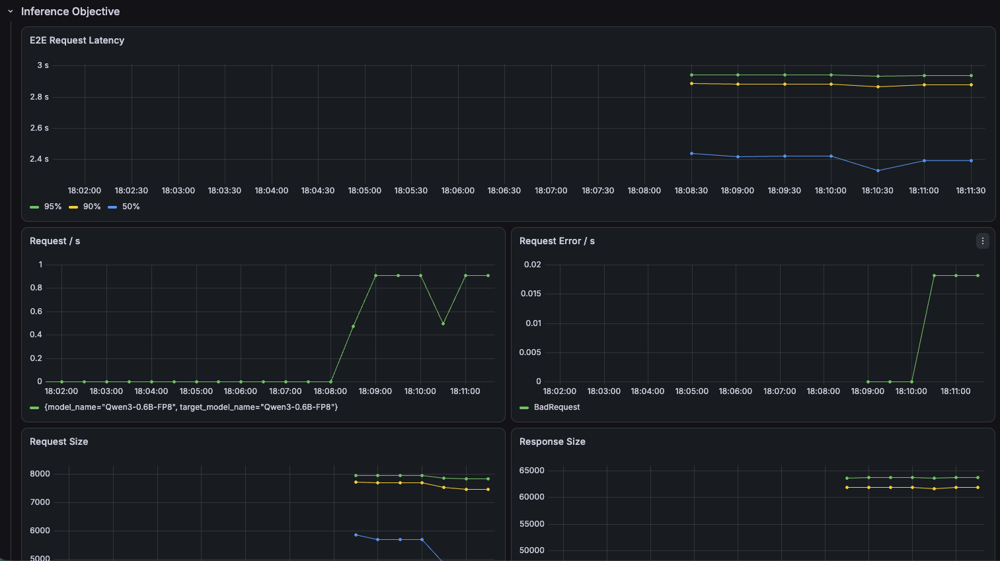

---
### 실습 자료 ④ 분산 트레이싱으로 오버헤드를 정량화하기

"오버헤드 때문"이라는 설명을 숫자로 뒷받침하는 단계다. Jaeger + OTel Collector를 붙인다.

```
vLLM(prefill/decode) ──┐
EPP(llm-d-router) ─────┼── OTLP/gRPC:4317 ──▶ OTel Collector ──▶ Jaeger (in-memory)
                        │   (/metrics 스팬 필터링)                    │
                                                                     ▼
                                                              Jaeger UI :16686
```

```yaml
# EPP (helm values)
router:
  tracing:
    enabled: true
    otelExporterEndpoint: "http://otel-collector.vllm.svc.cluster.local:4317"
    sampling:
      sampler: "parentbased_traceidratio"
      samplerArg: "1.0"       # lab 트래픽이 적으니 100% (운영에서는 0.1 권장)
```

```yaml
# vLLM (Deployment patch)
args:
  - ... --otlp-traces-endpoint http://otel-collector.vllm.svc.cluster.local:4317 \
        --collect-detailed-traces all
```

**결과** — 단일 traceID(총 450.44ms, 서비스 2개, 스팬 13개)

| 스팬 | Self | Total | 비고 |
| --- | --- | --- | --- |
| `llm-d-router/epp: gateway.request` | <span class="t-red">1.28 ms</span> | 450.44 ms | 루트. 나머지는 전부 vLLM 대기 |
| `vllm-decode: llm_request` | 448.01 ms | 448.01 ms | <span class="t-red">전체의 99.46%</span> |
| `tokenize_render` | 1.04 ms | — | token-producer가 `/render` 호출 |
| `produce_precise_prefix_cache` | 0.02 ms | — | |
| `prefix-cache-scorer` | 84 µs | — | |
| `kv-cache-utilization-scorer` | 75 µs | — | |
| `queue-scorer` | 1 µs | — | |
| `pick_endpoints` | 5 µs | — | max-score-picker |

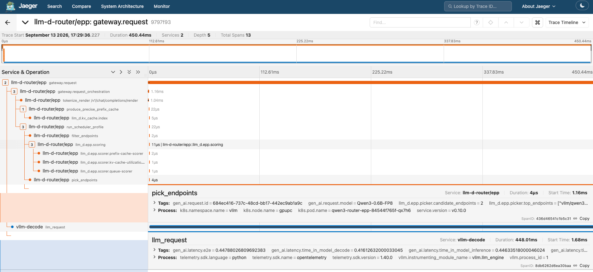

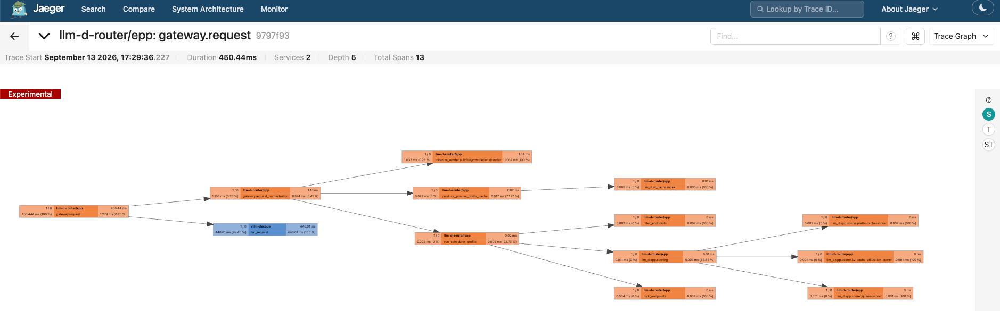

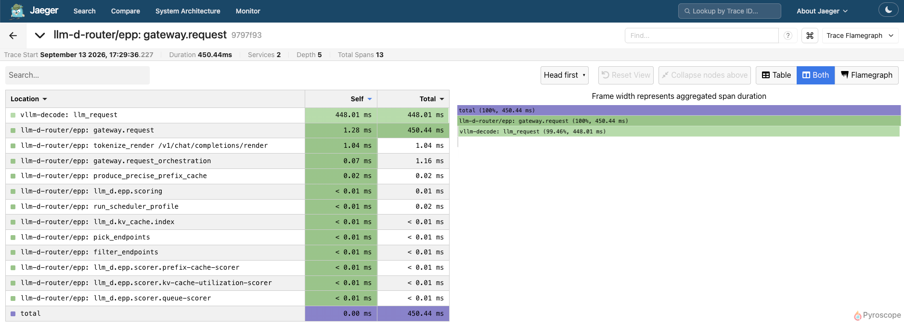

> [!tip] EPP 오버헤드는 전체 요청의 0.54%
> - Phase 6에서 관찰한 "게이트웨이 홉으로 인한 TTFT 소폭 증가"가 <span class="t-red">정량적으로는 매우 작은 수준</span>임이 확인된다.
> - 스코어러 3종은 전부 <span class="t-red">마이크로초 단위</span>다. 실제 비용은 스코어링 연산이 아니라 <span class="t-red">tokenize_render(1.04ms)와 gRPC 왕복</span>이었다.
> - 예상과 달리 <span class="t-red">EPP 스팬과 vLLM 스팬이 하나의 트레이스로 연결</span>됐다고 한다. Envoy가 별도 설정 없이도 `traceparent` 헤더를 그대로 통과시켜준 덕분이다.
> - "느려진 것 같다"에서 멈추지 않고 <span class="t-red">어디에서 얼마가 쓰였는지</span>까지 내려간 과정이 이번 자료에서 제일 좋았던 부분이다.

`pick_endpoints` 스팬의 태그를 열어보면 EPP가 실제로 무슨 판단을 했는지가 그대로 보인다.

| 태그 | 값 | 의미 |
| --- | --- | --- |
| `gen_ai.request.model` | `Qwen3-0.6B-FP8` | 요청 모델 |
| `llm_d.epp.picker.candidate_endpoints` | `2` | 후보 파드 수 |
| `llm_d.epp.picker.top_endpoints` | `[vkk2k-rank-0, zhsb7-rank-0]` | 최고 점수 파드 목록 |
| `llm_d.epp.picker.top_scores` | `[2, 2]` | <span class="t-red">동점</span> |

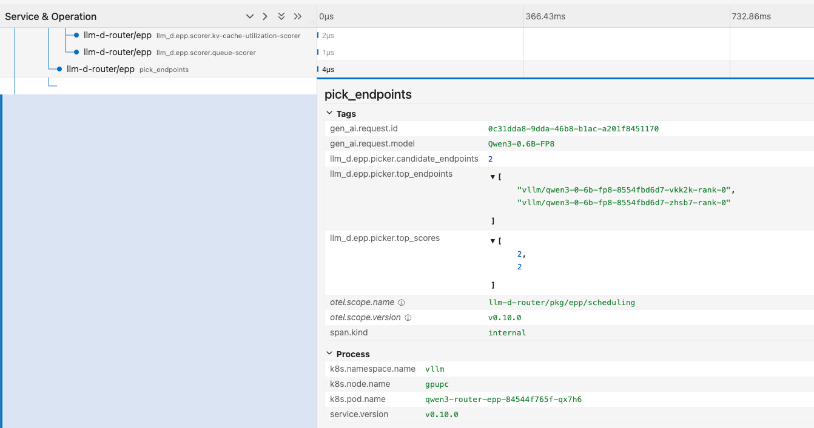

> [!info] 동점(2, 2)이 말해주는 것
> - `prefix-cache-scorer` : 이 prompt가 어느 파드 캐시에도 안 걸린 신규 prompt라 <span class="t-red">두 파드 모두 0점</span> (가중치 3이어도 0 × 3 = 0)
> - `kv-cache-utilization-scorer` + `queue-scorer` : 두 파드 모두 유휴(`Running: 0 reqs`)라 <span class="t-red">둘 다 만점</span>
> - 결과적으로 `0 + 1 + 1 = 2`로 정확히 동점 → <span class="t-red">캐시가 없으면 EPP는 그냥 로드밸런서로 퇴화한다.</span>
> - 이게 나쁜 게 아니다. 변별할 근거가 없을 때 안전하게 균등 분산하는 것이 옳은 동작이다.

---
### 실습 자료 ⑤ 배선 확인 — 요청 하나가 지나는 길

마지막으로 리소스들이 실제로 어떻게 엮여 있는지 확인하는 절이다.

```
Gateway (inference-gateway, 192.168.254.240)     ← MetalLB가 할당, Programmed=True
   │
   ▼
HTTPRoute (qwen3-router)                          path "/" 전체 매칭
   │  backendRef → InferencePool
   ▼
InferencePool (qwen3-router)                      endpointPickerRef → EPP Service:9002
   │
   ▼
EPP (qwen3-router-epp, 10.42.0.17:9002)           스코어링 후 최종 파드 선택
   │
   ▼
vLLM Pod (10.42.0.19:8000 / 10.42.0.20:8000)
```

```bash
kubectl get deploy -n vllm qwen3-router-epp -owide
NAME               READY   IMAGES                                                  SELECTOR
qwen3-router-epp   1/1     ghcr.io/llm-d/llm-d-router-endpoint-picker:v0.10.0       llm-d-router-gateway=qwen3-router-epp

# EPP 실행 인자
Args:
  --pool-name qwen3-router
  --pool-namespace vllm
  --pool-group inference.networking.k8s.io
  --config-file /config/precise-plugins.yaml      # ← Phase 5에서 precise로 전환
  --grpc-health-port 9003
  --tracing=true
```

Envoy 데이터플레인의 액세스 로그를 보면 <span class="t-red">EPP가 요청마다 다른 파드를 고른 흔적</span>이 남는다.

```json
{"route_name":"httproute/vllm/qwen3-router/rule/0/match/0/*",
 "upstream_cluster":"httproute/vllm/qwen3-router/rule/0",
 "upstream_host":"10.42.0.19:8000", "duration":2068, "response_code":200, ...}
{"route_name":"httproute/vllm/qwen3-router/rule/0/match/0/*",
 "upstream_cluster":"httproute/vllm/qwen3-router/rule/0",
 "upstream_host":"10.42.0.20:8000", "duration":2080, "response_code":200, ...}
```

> [!tip] `upstream_cluster`는 같은데 `upstream_host`가 다르다
> - 같은 HTTPRoute 규칙에서 파생된 <span class="t-red">동일한 클러스터</span>인데 실제 접속 대상은 `.19`와 `.20`이 섞여 나온다.
> - 정적으로 고정된 엔드포인트 목록이 없고 <span class="t-red">EPP의 ext-proc이 매 요청 동적으로 지정</span>하기 때문이다. 앞서 본 `ORIGINAL_DST` 트릭이 로그로 드러나는 순간이다.
> - `downstream_local_address`가 `:10080`인 것도 눈여겨볼 만하다. Envoy Gateway가 <span class="t-red">비루트 권한으로 뜨기 때문에</span> Gateway에 선언한 80번 포트를 내부적으로 10080으로 매핑해 리스닝하고, Service에서 다시 80으로 노출한다.

vLLM 파드 로그에는 <span class="t-red">두 종류의 요청</span>이 섞여 찍힌다.

```
POST /v1/completions/render    ← 10.42.0.17 (EPP 파드) : token-producer의 토큰화 호출
POST /v1/completions           ← 10.42.0.225 (Envoy 파드) : 실제 추론
```

> [!info] 토큰화 호출과 추론 호출이 다른 파드에 떨어져도 문제없다
> - `/render`는 <span class="t-red">EPP가 Service를 통해 부르는 것</span>이라 k8s round-robin으로 아무 파드나 간다.
> - 토큰화는 어느 파드든 같은 토크나이저를 쓰므로 결과가 동일하다.
> - 실제 추론 파드 선택만 EPP 스코어가 결정한다.
> - 자료에도 "왜 파드가 2개나 찍혔나"라는 의문이 그대로 적혀 있는데, <span class="t-red">두 흐름이 원래 별개</span>였던 것이다. 로그를 읽을 때 출발지 IP를 먼저 보는 습관이 필요하다는 교훈.

---
---
## Part 4. 두 라우터는 경쟁 관계인가

자료를 읽는 내내 "Agent Router"와 "llm-d Router" 둘 다 라우터라고 불려서 헷갈렸다. 결론은 <span class="t-red">레이어가 다르다</span>는 것이다.

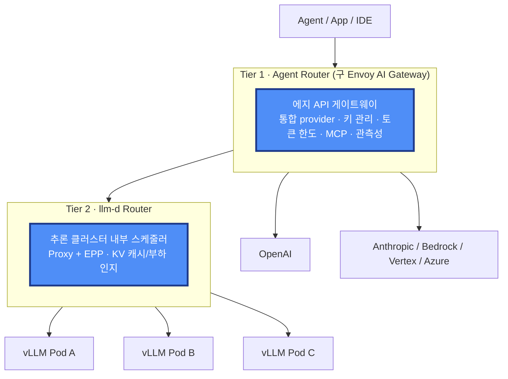
```mermaid
flowchart TD
    A["Agent / App / IDE"] --> T1

    subgraph T1["Tier 1 · Agent Router (구 Envoy AI Gateway)"]
        B["에지 API 게이트웨이<br/>통합 provider · 키 관리 · 토큰 한도 · MCP · 관측성"]
    end

    T1 --> P1["OpenAI"]
    T1 --> P2["Anthropic / Bedrock / Vertex / Azure"]
    T1 --> T2

    subgraph T2["Tier 2 · llm-d Router"]
        C["추론 클러스터 내부 스케줄러<br/>Proxy + EPP · KV 캐시/부하 인지"]
    end

    T2 --> V1["vLLM Pod A"]
    T2 --> V2["vLLM Pod B"]
    T2 --> V3["vLLM Pod C"]

    style B fill:#4F8EF7,stroke:#1E3A8A,stroke-width:3px,color:#fff
    style C fill:#4F8EF7,stroke:#1E3A8A,stroke-width:3px,color:#fff
```

| 항목 | **Tier 1 · Agent Router** | **Tier 2 · llm-d Router** |
| --- | --- | --- |
| 위치 | 에이전트/앱 <span class="t-red">앞단(Edge)</span> | vLLM 클러스터 <span class="t-red">내부</span> |
| 문제 정의 | 여러 <span class="t-red">외부 provider</span>를 어떻게 통합할까 | 같은 모델 <span class="t-red">N개 파드</span> 중 어디로 보낼까 |
| 라우팅 근거 | 모델명, 프로바이더 가용성, 쿼터 | <span class="t-red">KV 캐시 지역성, 큐 깊이, 우선순위</span> |
| 구조 | 설정 계층(Agent Router) + 트래픽 계층(Envoy) | Proxy(데이터 플레인) + EPP(라우팅 엔진) |
| 핵심 기능 | 통합 API, 키 보관, fallback, 토큰 한도, MCP 도구 통합, 모델명 가상화 | prefix-cache 인지, 부하 인지, flow control |
| 최적화 대상 | <span class="t-red">이기종(heterogeneous)</span> 프로바이더 | <span class="t-red">동종(homogeneous)</span> 모델 서빙 인프라 |

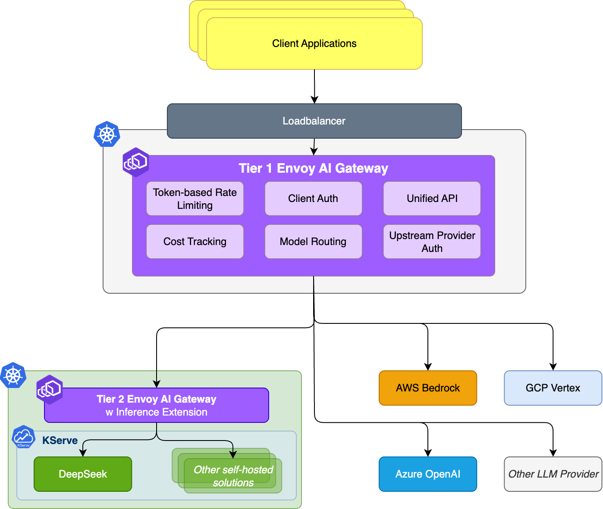

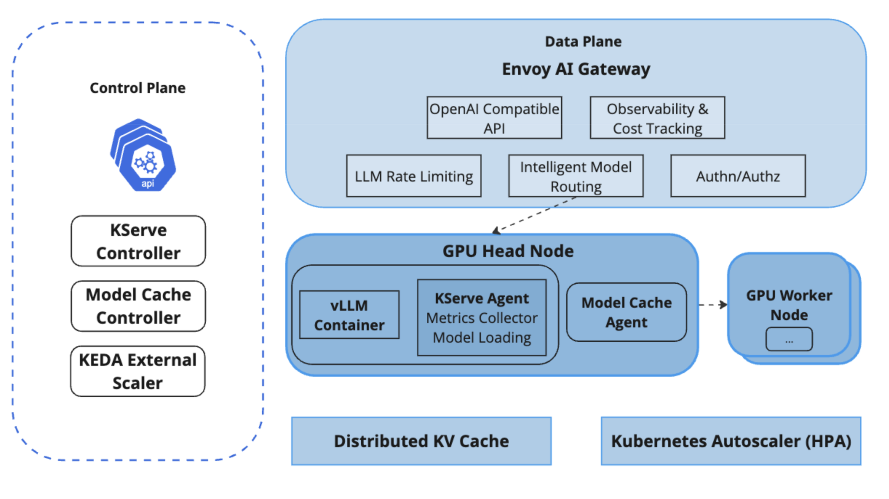

> [!tip] 둘은 함께 쓰인다
> - Agent Router는 자체 호스팅 모델에 대해 `InferencePool` <span class="t-red">을 지원</span>한다. 바로 여기서 llm-d의 EPP와 연결점이 생긴다.
> - 실제로 7W-2 자료의 Phase 1~4가 <span class="t-red">Envoy Gateway + Agent Router 위에 llm-d의 EPP를 얹는</span> 구성이었다.
> - 즉 <span class="t-red">GAIE(Gateway API Inference Extension)라는 표준이 둘의 접점</span>이다. 게이트웨이 구현체는 갈아끼울 수 있고, EPP만 llm-d 것을 쓰면 된다.


---
