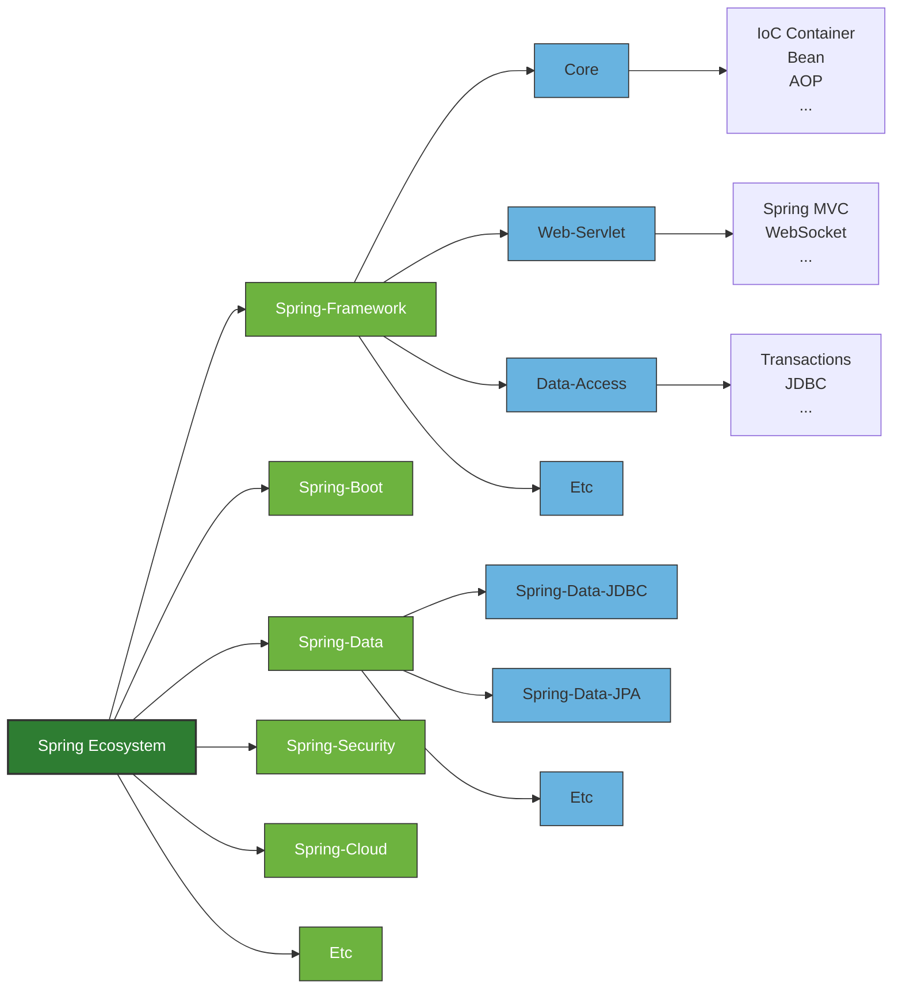

---
## Spring 등장 배경

### EJB

- 기존에는 EJB라는 기술이 자바 엔터프라이즈 개발의 주류였다.
- EJB를 사용하면 어플리케이션 작성을 쉽게 할 수 있었다.
- Low Level의 트랜잭션이나 상태관리, 멀티 쓰레딩, 리소스 풀링과 같은 복잡한 Low Level의 API 등을 이해하지 못하더라도 아무 문제 없이 애플리케이션을 개발할 수 있었다.

### EJB의 문제점

- 복잡한 스펙으로 인한 개발 효율성이 떨어진다.
- 애플리케이션을 테스트하기 위해서는 반드시 EJB 서버(매우 비싸고 무거움)가 필요하다.
- EJB스펙에 정의된 인터페이스에 따라 코드를 작성하므로 기존에 작성된 POJO(특정 프레임워크나 기술에 의존적이지 않은 자바 객체)를 변경해야한다.

### Rod Johnson

- Rod Johnson이 'Expert One-on-One J2EE Development without EJB'라는 저서에서 EJB를 사용하지 않고 엔터프라이즈 어플리케이션을 개발하는 방법을 소개했다. (스프링의 모태)
- AOP나 DI같은 새로운 프로그래밍 방법론이 제시되었다. 
- POJO를 기반으로 선언적인 프로그래밍이 가능해졌다. (설정, 어노테이션)

### Spring의 등장

- 책 출간 이후 Juergen Hoeller, Yann Caroff가 Rod Johnson에게 오픈소스 프로젝트(스프링)를 제안했다.
- 점차 사람들은 POJO + 경량 프레임워크(EJB에 비해 상대적 경량)를 사용하기 시작했다.
	- 경량 프레임워크가 EJB가 제공하는 서비스를 대체해준다.
	- Hibernate, JDO, myBatis, Spring
	- EJB 서버와 같은 무거운 컨테이너가 필요없다.
	- 오픈소스 프레임워크라 무료이다.
- 결국 자바에서는 Spring을 비롯한 여러 프레임워크를 사용하게되었다.

:::info
결론적으로 Spring이 만들어진 이유는 POJO 즉, Java 어플리케이션을 개발할 때, Java답게, 객체지향적으로 개발하기 위해서이다. 이를 Spring이 기존 EJB가 제공하는 엔터프라이즈급 기능을 제공하며(Low Level보다 비즈니스 로직에 집중), 더 가볍고, 객체지향적으로 개발할 수 있게해주는 것이다.
:::

---
## Spring 설계 철학 (Spring 삼각형)

### POJO

- POJO(Plain Old Java Object)
- 특정 환경이나 기술에 종속적이지 않은 객체지향 원리에 충실한 자바객체를 말한다.
- 테스트하기 용이하며, 객체지향 설계를 자유롭게 적용할 수 있다.

### IoC/DI

- IoC(Inversion of Control)
- DI(Dependency Injection)
- 유연하게 확장 가능한 객체를 만들어 두고 객체 간의 의존 관계는 외부에서 동적으로 설정하는 개념이다.
- 이에 대한 자세한 글 따로 작성 예정

### AOP

- AOP(Aspect Oriented Programming)
- 공통 모듈을 여러 코드에 쉽게 적용 가능하게하는 기술이다.
- 관심사의 분리를 통해서 소프트웨어의 모듈성을 향상시킨다.

### PSA

- PSA(Portable Service Abstraction)
- 환경과 세부기술의 변경과 관계없이 일관된 방식으로 기술에 접근할 수 있게 해주는 설계 원칙이다.
- 트랜잭션 추상화, OXM 추상화, 데이터 액세스의 Exception 변환기능.. 등 기술적인 복잡함은 추상화를 통해 Low Level의 기술 구현 부분과 기술을 사용하는 인터페이스로 분리하는 원칙이다.
- 예: 데이터베이스에 관계없이 동일하게 적용 할 수 있는 트랜잭션 처리방식

---
## 스프링 생태계 (Spring Ecosystem)

