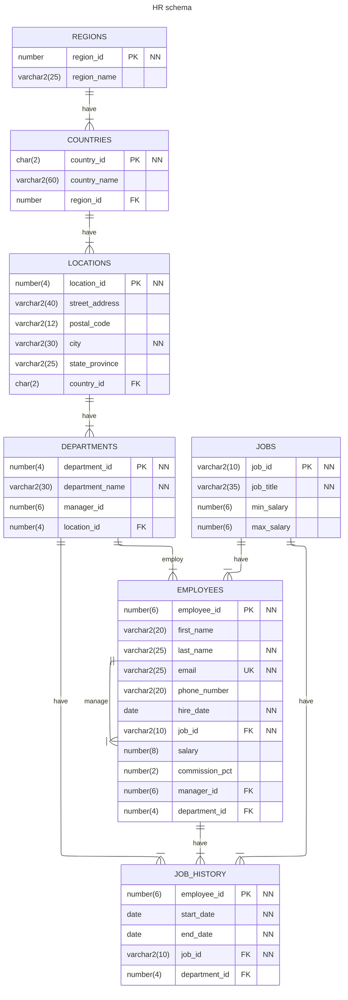

---
## 사전 준비

이후 글에서 다뤄질 쿼리문에 대한 스키마는 Oracle Sample Schemas - Human Resources(https://github.com/oracle-samples/db-sample-schemas/tree/main/human_resources)이다.

이 스키마를 MySQL로 CREATE하고 Dummy Data를 INSERT하는 SQL문을 만들어서 올려뒀으니 사용하면 된다.
- CREATE: https://github.com/Son-Hunseo/sample-database-query-for-test/blob/main/hr_create.sql
- INSERT: https://github.com/Son-Hunseo/sample-database-query-for-test/blob/main/hr_dummydata_insert.sql

