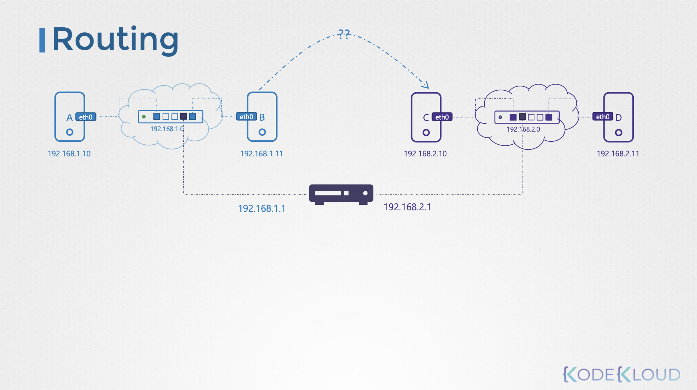
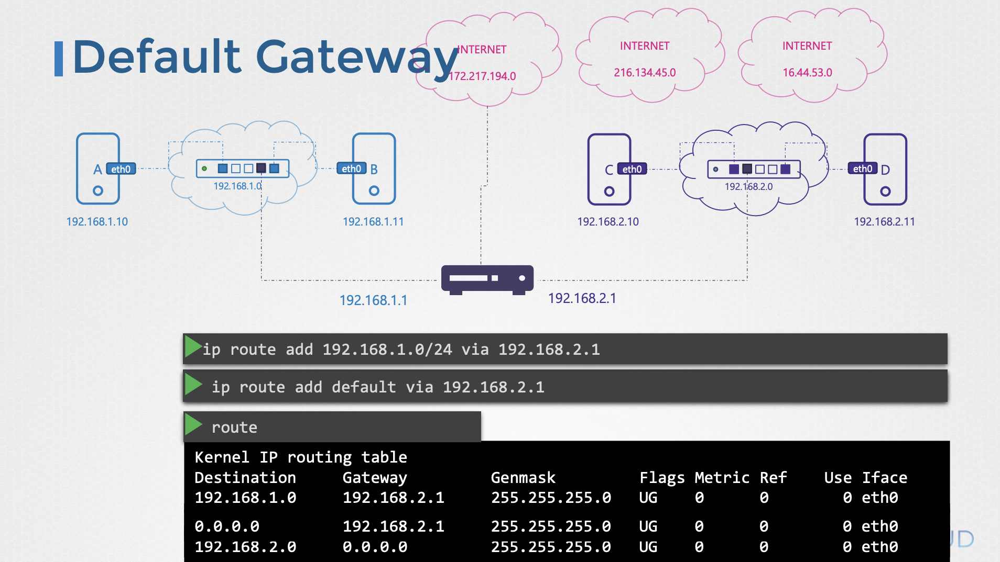

---
## 스위칭 (같은 네트워크 내 통신)
### 개념

- 같은 네트워크 내에서 서로 다른 두 시스템이 서로 통신하려면
	- 물리적 또는 가상 네트워크 인터페이스가 필요
	- 같은 네트워크 대역(IP 대역)에 있어야 함
	- 스위치(Switch)를 통해 연결 됨
- 즉, 이러한 같은 네트워크 내에서의 통신을 '스위칭(Switching)'이라고 한다.

### 예시


- 위 그림을 예시로 들어보자.
- 주소가 192.168.1.0이라는 네트워크라고 가정하자.
- 장치A는 스위치의 eth0 네트워크 인터페이스에 연결되어있다. (`ip link` - 인터페이스 확인)
- 장치B는 스위치의 eth0 네트워크 인터페이스에 연결되어있다. (리눅스 시스템이 아니라 스위치 장비이기 때문에, 다른 네트워크 인터페이스(예: eth1)에 연결되어있어도 상관 없다)
- 장치A에서 `ip addr add 192.168.1.10/24 dev eth0` 명령어로 정적 ip를 설정한다.
	- `/24`의 의미 - 현재 명령어를 입력하는 시스템의 대역은 192.168.1.0 ~ 192.168.1.255 임을 의미
	- `dev` - 네트워크를 설정할 때 사용하는 명령어로 device의 약자
- 장치B에서 `ip addr add 192.168.1.11/24 dev eth0` 명령어로 정적 ip를 설정한다.

:::info
가정에서 공유기에 랜선만 꽂으면 위와 같은 과정 없이 연결 되던데?
-> 가정용 공유기에는 DHCP 서버가 있어서 자동으로 동적 IP를 할당하기 때문
:::

---
## 라우팅 (다른 네트워크 간 통신)
### 개념

- 다른 네트워크에서 통신하려면
	- 라우터(Router)가 필요하다.
	- 라우터는 여러 네트워크에 연결된 장치이다.
	- 라우터는 각 네트워크에 하나씩 IP를 가진다.
	- 장치에서 다른 네트워크로 가기위한 (라우터로의) 규칙(Route)을 설정해주어야한다.
- 즉, 이렇게 다른 네트워크간에 통신을 하기위한 규칙을 안내하는 과정을 라우팅(Routing)이라고 한다.

### 예시



- 위 그림을 예시로 들어보자.
- 네트워크A(192.168.1.0/24)에서의 라우터 주소는 192.168.1.1로 가정하자.
- 네트워크B(192.168.2.0/24)에서의 라우터 주소는 192.168.2.1로 가정하자.
- 장비B에서 장비C로 통신하려면 어떻게 해야할까
- 장비B와 장비C는 다른 네트워크이기 때문에 '장비B에서 장비C로 가려면 어떻게 가세요!' 라는 규칙을 알려줘야한다. (반대도 마찬가지)
- 이에 장비B의 시스템의 라우팅 테이블에 해당 규칙을 작성해야한다. (반대도 마찬가지)
- `ip route add 192.168.2.0/24 via 192.168.1.1` 명령어를 입력해줘야한다.
	- 네트워크B(192.168.2.0/24)로 가려면 라우터(192.168.1.1)을 통해서 가야합니다. 라는 뜻 (반대도 마찬가지)
	- 이러한 라우팅 테이블을 보려면 `route` 명령어를 입력하면 된다.

:::info
그냥 연결만 하면 되는거 아닌가? 라우팅 테이블 수동으로 작성해야하나?
-> 위 과정은 '정적 라우팅'과정이다. (수동으로 설정)
-> 일반적으로는 Hop의 갯수를 카운팅 하는 등의 방식을 주요 기준으로하는 RIP, 네트워크 상태를 기준으로하는 OSPF 등의 프로토콜로 '동적 라우팅'이 진행된다. (자동으로 설정)
:::

---
## 게이트웨이(Gateway)

### 개념

- 이전 라우팅 과정에서 적용되는 용어가 게이트웨이이다.
- 라우팅 과정에서 `ip route add 192.168.2.0/24 via 192.168.1.1` 명령어를 입력했었다.
- 여기서 `192.168.1.1`이 '게이트웨이'이다.
- 즉, 현재 네트워크 밖으로 나가려면 어디로 가야하는가?
	- 에 대한 '규칙'이 라우트(route)이라면
	- '목적지(통로)'는 게이트웨이이다.

### Default Gateway



- 그런데, 인터넷에는 수많은 네트워크가 존재한다.
- 모든 네트워크에 대한 라우트를 추가하는 것은 비현실적이다.
- 이에, Default Gateway를 라우팅 테이블에 추가한다.
- 즉, 알 수 없는 모든 목적지 트래픽은 Default Gateway로 보낸다.

```bash
ip route add default via 192.168.1.1

# 혹은

ip route add 0.0.0.0/0 via 192.168.1.1
```

---
## Linux를 Router로 사용하기 (IP Forwarding)
### 예시


- 위 그림 예시를 보자.
- 장치 B는 Linux 시스템이다.
- 장치 A와 장치 B가 연결되어있다. (네트워크 192.168.1.0, 장치B의 네트워크인터페이스 eth0)
- 장치 B와 장치 C가 연결되어있다. (네트워크 192.168.2.0, 장치B의 네트워크인터페이스 eth1)
- 라우팅 규칙은 정상적으로 설정되어있다.
- 그런데, 장치 A에서 장치 C로의 통신이 되지 않는다.
- 왜냐하면, Linux 시스템에서는 기본적으로 다른 네트워크 인터페이스로 패킷을 넘겨주는 'IP Forwarding'이 비활성화 되어있기 때문이다.

### 활성 방법

**현재 상태 확인**

```bash
cat /proc/sys/net/ipv4/ip_forward
# 0이면 비활성화
```

**임시 활성화 (째부팅 시 초기화)**

```bash
echo 1 > /proc/sys/net/ipv4/ip_forward
```

**영구 설정**

```bash
vi /etc/sysctl.conf
```

```bash
net.ipv4.ip_forward=1 # 이 내용 주석이 되어있음, 주석 해제
```

```bash
sysctl --system # 적용
```

---
## 레퍼런스

- Udemy - Certified Kubernetes Administrator (CKA) with Practice Tests (Mumshad)