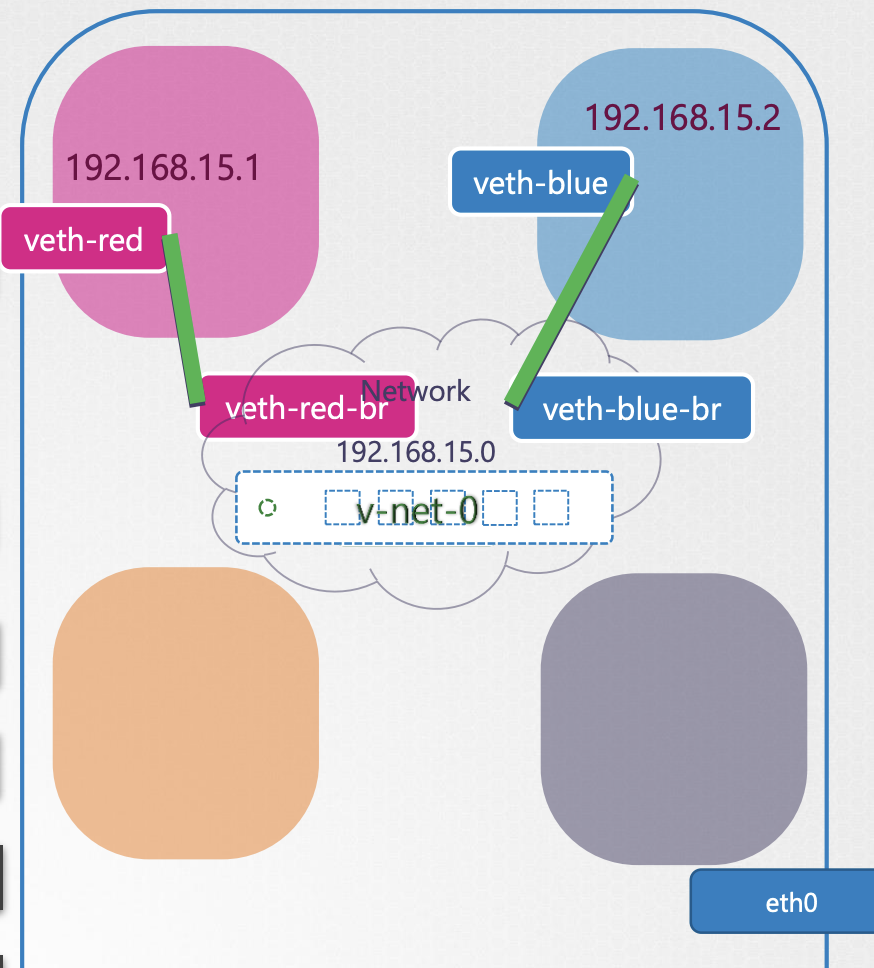

---
:::tip
아래 내용은 특히 컨테이너를 이해하기 위해 중요하다.

왜냐하면, 컨테이너의 네트워크가 호스트와 격리될 수 있도록 하는 기술이 Linux 네트워크 네임스페이스 기술이기 때문이다.
:::

## Network Namespace
### 개념


- Linux 호스트를 '집'이라고 한다면, Namespace는 집 안에 있는 각각의 '방'과 같다.
- 각 네임스페이스에 있는 프로세스는 자기 자신 네임스페이스 내부만 볼 수 있고, 네임스페이스 외부 혹은 다른 네임스페이스의 프로세스는 알 수 없다.
- 네트워크 관점에서 각 네임스페이스는 각자의 '가상 네트워크 인터페이스', '라우팅 테이블', 'ARP 테이블'을 가진다.
	- `eth0`와 같은 호스트의 물리 네트워크 인터페이스는 네임스페이스 안에서 볼 수 없다.

### 네임스페이스 생성

```bash
ip netns add red
ip netns add blue
```

- 'red'와 'blue'라는 이름의 네임스페이스 생성

```bash
ip netns
```

- 생성된 네임스페이스 목록 확인

```bash
ip link
```

- 위 명령어를 입력하면 호스트의 인터페이스를 확인할 수 있다. (`eth0`, `lo`(루프백) 등이 보임)

```bash
ip netns exec red ip link

# 혹은 아래의 명령어도 같은 기능

ip -n red link
```

- 위 명령어는 red 네임스페이스 내에서의 인터페이스를 조회하는 명령어이다.
- 조회해보면 `lo`(루프백 - 자기 자신과 통신하기위한 가상 인터페이스)를 제외하면 아무 것도 없다.

### 네임스페이스 간 통신 (Virtual Cable)

```bash
ip link add veth-red type veth peer name veth-blue
```

- 실제 물리 기기들을 연결할 때 랜선이 필요하듯이, 네임스페이스를 직접 연결하려면 가상의 케이블(Virtual Ethernet Pair, `veth`)이 필요하다.
- 위 명령어는 이 가상의 케이블을 생성하는 명령어이다. (한쪽 끝은 `veth-red`라는 인터페이스, 다른 끝은 `veth-blue`라는 인터페이스)

```bash
ip link set veth-red netns red
ip link set veth-blue netns blue
```

- 각 끝(인터페이스)을 네임스페이스에 연결한다.

```bash
# IP 할당
ip -n red addr add 192.168.15.1/24 dev veth-red
ip -n blue addr add 192.168.15.2/24 dev veth-blue

# 인터페이스 Up
ip -n red link set veth-red up
ip -n blue link set veth-blue up
```

- 각 케이블 끝(인터페이스)에 IP를 할당한다. (대역은 임의로 지정한 값임)
- 해당 인터페이스들을 up 시킨다.

```bash
ip netns exec red ping 192.168.15.2
```

- 이러면 서로 ping을 보낼 수 있다.

### 다수의 네임스페이스 연결 (Linux Bridge)



- 실제 여러 물리 기기들을 하나의 네트워크에 연결하기 위해 스위치가 필요하듯이, 여러 네임스페이스를 연결하려면 가상 스위치가 필요하다.
- Linux에서는 Bridge가 이 가상 스위치 역할을 한다.
	- <span style={{color: 'red'}}>Bridge는 가상 스위치임과 동시에 호스트의 가상 네트워크 인터페이스이다.</span>
	- 이 때문에 IP Forwarding이 되어있다면, 브릿지로 오는 패킷을 호스트의 물리 인터페이스로 전달할 수 있다.
- 이전 Virtual Cable 예시에서의 연결(직접)은 없다고 가정하자.
- 또한 IP Forwarding은 허용이 되어있다고 가정하자.

```bash
# 브리지 인터페이스(v-net-0) 생성
ip link add v-net-0 type bridge

# 브리지 활성화
ip link set dev v-net-0 up

# 브리지에 IP 할당 (게이트웨이 역할)
ip addr add 192.168.15.5/24 dev v-net-0
```

- `v-net-0`라는 이름의 Bridge를 담당할 인터페이스를 생성한다. (편의상 브리지라고 부르겠음)
- 이 브리지를 활성화한다.
- 해당 브리지에 IP를 할당한다.

```bash
# red용 케이블 쌍 생성 (한쪽은 ns용, 한쪽은 브리지용)
ip link add veth-red type veth peer name veth-red-br

# 한쪽은 red 네임스페이스로 보냄
ip link set veth-red netns red

# 다른 한쪽(브리지용)은 호스트의 v-net-0 브리지에 연결(Master 설정)
ip link set veth-red-br master v-net-0

# 인터페이스 활성화
ip link set dev veth-red-br up
```

- 한쪽은 red 네임스페이스 한쪽은 브리지로 보낼 가상 케이블을 생성한다.
- 한쪽을 red 네임스페이스에 연결한다.
- 다른 한쪽을 브리지에 연결한다.
- 브리지쪽 인터페이스를 활성화한다.
- blue 네임스페이스도 똑같은 과정 반복
- 이러면, red와 blue는 bridge를 통해 서로 통신이 가능하다.

### 외부 네트워크 통신 (NAT & Routing)


- 네임스페이스 내부에서 외부 인터넷(예: 8.8.8.8)으로 통신하려면 라우팅과 NAT 설정이 필요하다.

```bash
ip netns exec blue ip route add default via 192.168.15.5
```

- blue 네임스페이스의 '디폴트 게이트웨이'를 브리지로 설정한다. (라우팅)
- red에도 똑같은 과정 반복
- 브리지는 가상 스위치이자, 호스트의 가상 인터페이스이므로 브리지로 보내는 패킷은 호스트의 물리 인터페이스로 보낼 수 있다.

```bash
iptables -t nat -A POSTROUTING -s 192.168.15.0/24 -j MASQUERADE
```

- `iptables`를 사용해서 NAT를 설정한다.
- 이를 통해 호스트가 네임스페이스의 패킷을 받아 외부로 보낼 때, 출발지 주소를 호스트의 IP로 보낸다.
	- 이 때문에, 응답 또한 호스트를 통해서 받을 수 있다. 
- 이제 네임스페이스 내부에서 외부 인터넷 연결이 가능해진다.

### 포트 포워딩 (Port Forwarding)

- 마지막으로, 외부에서 네임스페이스 내부의 서비스(예: 웹 서버)에 접근하려면 DNAT(Destination NAT) 설정이 필요하다.
	- 외부 패킷은 호스트이지만 이 패킷이 호스트에 도착했을 때, 도착지를 네임스페이스로 바꾸는 과정
- 이를 포트 포워딩이라고 한다.

```bash
iptables -t nat -A PREROUTING --dport 80 --to-destination 192.168.15.2:80 -j DNAT
```

- 호스트의 80포트로 들어오는 요청을 blue 네임스페이스의 80번 포트로 전달하게 포트포워딩하는 명령어이다.

---
## 레퍼런스

- Udemy - Certified Kubernetes Administrator (CKA) with Practice Tests (Mumshad)