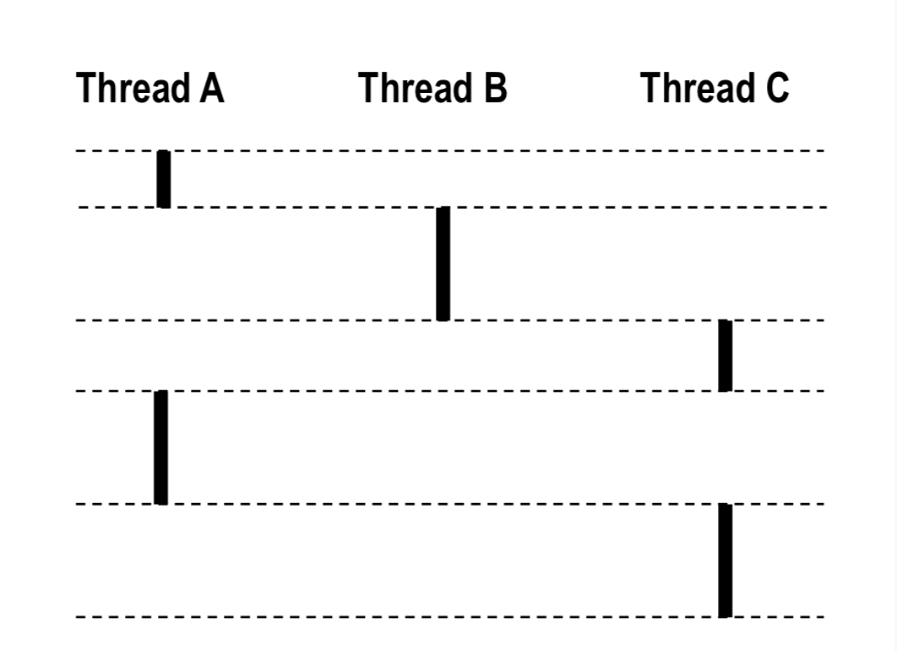

---
## 프로그램
### 개념

- 컴퓨터에서 어떤 작업을 위해 실행할 수 있는 '정적인(static) 상태'의 파일 (Windows-exe, Mac-dmg 등)
- ex: 엑셀, 카카오톡, 크롬 등

---
## 프로세스
### 개념

- 프로그램이 그냥 실행되기 전의 정적인 상태라면, 프로세스는 실행되고 있는 '동적인 상태'의 프로그램인 것이다.
- 프로그램은 OS로부터 실행되기 위한 메모리 공간을 할당받는다. 이렇게 프로그램이 메모리에 올라가면 프로세스가 되는 것이다. (이후 이 메모리에 올라간 프로세스를 실행하기 위한 CPU 자원을 할당받는다)
- 그렇다고 프로그램과 프로세스를 1:1 관계라고 생각할 수는 없는게, 프로그램 중에서는 멀티프로세스로 작동하는 프로그램도 있다.
	- 위 사진을 보면 하나의 크롬(프로그램)에서 여러 프로세스가 돌아가는 것을 볼 수 있다. (멀티 프로세싱)

### 자원 구조

- OS로부터 프로세스가 메모리를 할당받을 때, 다음과 같은 4가지의 메모리 영역을 할당 받는다.
- `Code`:  프로그램을 구성하는 프로그래밍 언어가 컴파일되어 기계어형태로 저장된다.
- `Data`: 코드가 실행되면서 사용하는 전역 변수나 정적 변수가 저장된다.
- `Stack`: 지역 변수나 함수 호출 정보가 저장된다.
- `Heap`: 생성자, 인스턴스와 같은 런타임에 동적으로 할당되는 데이터가 저장된다.
- 기본적으로 프로세스는 다른 프로세스의 자원에 접근할 수 없다.
	- 다른 프로세스의 자원에 접근하려면 프로시스간 통신(IPC)를 사용해야한다. (복잡하고 느리다)
- 프로세스는 최소 하나 이상의 쓰레드를 포함한다.

---
## 쓰레드
### 개념

- 쓰레드는 프로세스가 할당 받은 자원을 이용하는 실행 단위이다.
- 크롬처럼 여러 프로세스를 사용하는 프로그램이 아닐지라도 프로그램이 한번에 여러 작업을 수행하는 것을 당연하게 생각할 것이다. (예를들어, 디스코드에서 음성채팅를 하며 동시에 텍스트채팅도 할 수 있다)
- 이는 프로세스에서 여러 쓰레드를 사용하여 작업을 수행하기 때문이다.
- 그렇다면, 크롬처럼 그냥 프로세스를 여러개 사용하면 되지 프로세스 안에서 또 쓰레드라는 단위로 나눠서 작업을 수행할까?
- 그건 아래 자원 구조를 보면 알 수 있다.

### 자원 구조

- 쓰레드는 프로세스 내에서 각자의 `Stack` 메모리를 갖고, 하나의 프로세스 내의 모든 쓰레드는 프로세스의 `Code`, `Data`, `Heap` 을 공유한다.
- 이러한 구조로 인해 쓰레드를 사용하는 것이 여러 프로세스를 사용하는 것에 비해 이점을 가진다.
- 메모리와 자원 효율
	- 여러 작업을 하기 위해 여러 프로세스를 만들면 `Code`, `Data`, `Stack`, `Heap`을 통째로 새로 할당 받아야하는 무거운 작업이다.
	- 반면에 쓰레드는 개별적인 `Stack` 영역만 할당받으면 되기 때문에 효율적이다.
- 데이터 공유와 통신의 편리함
	- 프로세스들은 기본적으로 격리되어있어 데이터를 주고받으려면 IPC라는 복잡하고 느린 기술을 사용해야한다.
	- 쓰레드들은 프로세스 내의 `Data`, `Heap`을 공유하기 때문에 별도의 절차 없이도 서로의 데이터를 즉각적으로 읽고 쓸 수 있어 효율적이다.
- 컨텍스트 스위칭의 오버헤드 감소
	- 프로세스 전환: CPU 캐시 메모리를 비우고 완전히 새로운 메모리 전체를 로드해야 하므로 시간이 비교적 오래걸린다.
	- 쓰레드 전환: 공유하는 자원이 많기 때문에 교체해야 할 정보가 적어 효율적이다.
- 이렇게만 보면 쓰레드를 사용하는 것이 무조건 좋아보이지만 동기화, 데드락 등의 문제도 가지고 있으며 개발자가 이를 잘 고려하여 프로그래밍해야한다.
	- 예를들어 `Java`에서는 `syncronized`, `volatile` 등을 사용하여 이러한 문제를 예방한다. (그래도 무조건 쓰레드를 많이 사용하는 것이 좋은 것은 아니다 - 잦은 컨텍스트 스위칭에서 오는 비효율성)

---
## cf) CPU 코어, 쓰레드와의 관계

- 어떠한 시점을 딱 잘랐을 때 하나의 CPU 코어는 하나의 쓰레드 작업만을 수행하나요?
	- (하이퍼 쓰레딩 기술을 제외한다면) 그렇다.
	- 그럼에도 싱글코어 CPU도 여러 작업을 동시에 수행할 수 있는 것은 컨텍스트 스위칭 때문이다. (너무 빠르게 작업들을 스위칭해서 동시에 하는 것처럼 보임)
- 보통 우리가 보는 컴퓨터 CPU에는 8코어 16스레드 이런식으로 코어외에도 스레드가 있다.
- 이는 하이퍼스레딩이라는 1개의 코어가 여러 스레드를 동시에 실행 가능하게하는 기술을 적용한 CPU라서 그런 것이다. (8코어 16스레드의 경우, 16/8=2, 즉 1개의 코어가 2개의 스레드를 동시에 실행 가능)

---
## cf) 동시성?

- 동시성 프로그래밍에서의 '동시성'이라는 말은 우리가 느끼기에는 하나의 시점을 잘랐을 때 여러 작업이 동시에 수행되는 듯한 느낌이 든다.
	- 우리가 느끼는 동시성은 사실 병렬성(Parallelism)에 가깝다.
- 하지만, 여기서의 '동시성' 즉, Concurrent는 같은 시간에 함께 실행되는 것을 의미하지 않는다.
- 위 그림에서 프로세스 A와 B, 프로세스 A와 C는 Concurrent하게 수행되고 있지만, B와 C는 Concurrent하게 수행되고 있지 않다고 한다.
- 즉, Concurrent란 어떠한 작업의 흐름이 겹치는 시간대가 있다는 것을 의미한다.
- 이를 다시말하면 OS가 컨텍스트 스위칭을 시키면서 쓰레드 혹은 프로세스간 흐름이 겹쳐 실행되고 이를 Concurrent하게 수행된다고 말한다.

---
## 레퍼런스

- https://velog.io/@jungbumwoo/%EB%8F%99%EC%8B%9C%EC%84%B1-%ED%94%84%EB%A1%9C%EA%B7%B8%EB%9E%98%EB%B0%8D-Concurrent-Programming
- https://velog.io/@gparkkii/ProgramProcessThread
- https://inpa.tistory.com/entry/%F0%9F%91%A9%E2%80%8D%F0%9F%92%BB-%ED%94%84%EB%A1%9C%EC%84%B8%EC%8A%A4-%E2%9A%94%EF%B8%8F-%EC%93%B0%EB%A0%88%EB%93%9C-%EC%B0%A8%EC%9D%B4