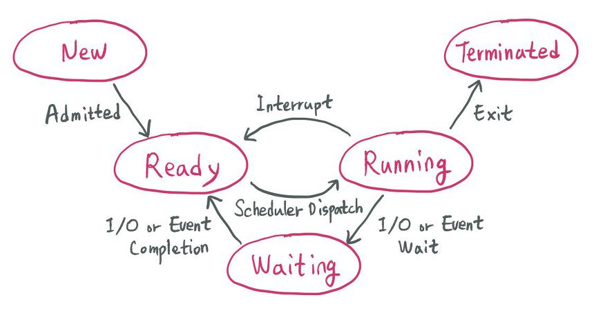

---
date: 2026-03-26
title: CPU 스케줄링
description: CPU 스케줄링의 개념, 프로세스 상태 전이, 선점/비선점 스케줄링의 차이, 그리고 FCFS, SJF, Round Robin, 다단계 피드백 큐 등 주요 스케줄링 알고리즘을 정리한 글입니다.
keywords:
  - CPU 스케줄링
  - 프로세스 상태
  - 선점 스케줄링
  - 비선점 스케줄링
  - FCFS
  - SJF
  - HRN
  - Round Robin
  - Time Quantum
  - 다단계 큐
  - 다단계 피드백 큐
---

---
## CPU 스케줄링
### 정의

CPU 코어 1개에서는 특정 시점에 1개의 프로세스만 처리할 수 있다. (하이퍼 쓰레딩 같은 기술 없이..) 이에 CPU를 잘 사용하기 위해 프로세스를 잘 배정하는 방법이 CPU 스케줄링이다.

### 프로세스 상태(Process State)



**프로세스의 상태**

- 생성(New): 새로운 프로세스
- 준비(Ready): 프로세스가 프로세서를 사용하고 있지는 않지만 언제든지 사용할 수 있는 상태로, CPU가 할당되기를 기다리고 있다.
- 실행(Running) : 프로세스가 프로세서를 차지하여 명령어들이 실행되고 있다.
- 대기(Waiting) : 프로세스가 입출력 완료, 시그널 수신 등 어떤 사건을 기다리고 있는 상태를 말한다.
- 종료(Terminated) : 프로세스의 실행이 종료되었다.

**프로세스의 상태 전이**

- 승인(Admitted): 프로세스 생성이 가능하여 승인됨
- 스케줄러 디스패치(Scheduler Dispatch): 준비 상태에 있는 프로세스 중 하나를 선택하여 실행시키는 것
- 인터럽트(Interrupt): 예외, 입출력, 이벤트 등이 발생하여 현재 실행 중인 프로세스를 준비 상태로 바꾸고, 해당 작업을 먼저 처리하는 것
- 입출력 또는 이벤트 대기(I/O or Event wait): 실행 중인 프로세스가 입출력이나 이벤트를 처리해야 하는 경우, 입출력/이벤트가 모두 끝날 때까지 대기 상태로 만드는 것
- 입출력 또는 이벤트 완료 (I/O or Event Completion): 입출력/이벤트가 끝난 프로세스를 준비 상태로 전환하여 스케줄러에 의해 선택될 수 있도록 만드는 것

### 선점/비선점 스케줄링

**선점(preemptive) 스케줄링**: OS가 CPU의 사용권을 선점할 수 있는 경우, 강제 회수하는 경우 (처리시간 예측 어려움)
- OS가 타이머 인터럽트 등을 통해 실행 중인 프로세스를 강제로 중단시키고 다른 프로세스에게 CPU를 줄 수 있다.
- ex: 현대의 거의 모든 OS

**비선점(nonpreemptive) 스케줄링**: 프로세스 종료 or I/O 등의 이벤트가 있을 때까지 실행 보장 (처리시간 예측 용이함)
- 프로세스가 CPU를 받으면 자발적으로 반납할 때 까지 OS가 개입하지 않는다.
- ex: 과거 Windows 3.1 / Mac OS 9 이하
- cf) 그렇다고 비선점 스케줄링 OS에서 인터럽트나 컨텍스트 스위칭이 발생하지 않는 것은 아니다.

---
## CPU 스케줄링의 종류
### 비선점 스케줄링

1. **FCFS(First Come First Served)**
	- 큐에 도착한 순서대로 CPU 할당
	- 단점 - 실행 시간이 짧은 게 뒤로 가면 평균 대기 시간이 길어짐 (평균 리드타임이 길어짐)

2. **SJF(Shortest Job First)**
	- 수행시간이 가장 짧다고 판단되는 작업을 먼저 수행
	- 단점 - FCFS보다 평균 대기 시간이 감소하지만, 수행시간이 긴 작업이 무한정 뒤로 밀릴 수 있음

3. **HRN(Highest Response-ratio Next)**
	- 우선순위를 계산하여 점유 불평등을 보완한 방법
	- 우선순위 = (대기시간 + 실행시간) / (실행시간)

### 선점 스케줄링

1. **Priority Scheduling**
	- 정적/동적으로 우선순위를 부여하여 우선순위가 높은 순서대로 처리
	- 단점 - 우선 순위가 낮은 프로세스가 무한정 기다리는 Starvation 이 생길 수 있음
		- 오래 기다린 프로세스는 우선 순위를 높게 부여하는 Aging 방법을 사용하여 해결 가능

2. **Round Robin**
	- FCFS에 의해 프로세스들이 보내지면 각 프로세스는 동일한 시간의 `Time Quantum`만큼 CPU를 할당 받음
		- `Time Quantum` or `Time Slice`: 실행의 최소 단위 시간
	- `Time Quantum`이 크면 FCFS와 같게 되고, 작으면 Context Switching이 잦아져서 오버헤드 증가

3. **Multilevel-Queue(다단계 큐)**

```
우선순위 높음
┌─────────────────────────┐
│  Q1. System processes   │  ← Round Robin (Time Quantum 8)
├─────────────────────────┤
│  Q2. Interactive        │  ← Round Robin (Time Quantum 16)
├─────────────────────────┤
│  Q3. Batch processes    │  ← FCFS
└─────────────────────────┘
우선순위 낮음
```

- 프로세스 종류별로 큐를 아예 분리해서 각 큐마다 다른 스케줄링 정책을 적용 (낮은 우선순위의 큐일수록 높은 `Time Quantum`)
- Q1이 비어있어야 Q2 실행, Q2가 비어있어야 Q3 실행
- 각 큐는 독립적인 스케줄링 알고리즘을 가짐
- 단점 - 큐 간 이동이 없으니 낮은 큐의 프로세스는 무한정 기다리는 Starvation이 생길 수 있음

4. **Multilevel-Feedback-Queue(다단계 피드백 큐)**

```
┌─────────────────────────┐
│  Q1.  quantum = 8ms     │  새 프로세스는 여기서 시작
├─────────────────────────┤
│  Q2.  quantum = 16ms    │  Q1에서 다 못 끝내면 강등
├─────────────────────────┤
│  Q3.  FCFS              │  Q2에서도 못 끝내면 강등
└─────────────────────────┘
오래 기다릴 경우 상위 큐로 승격 (Aging)
```

- 프로세스가 CPU를 많이 쓰면 낮은 큐로 강등, 오래 기다리면 높은 큐로 승격시킨다.
- 짧은 작업은 Q1에서 바로 끝나서 응답이 빠르며, 오래 기다른 작업은 상위 큐로 승격시켜 단점을 보완한다.
- 프로세스의 성격을 미리 알 필요 없이 작업 완료 여부를 보고 동적으로 판단하는데에 장점이 있다.
- 현대 OS의 스케줄러 표준이 되는 모델이다.

---
## 레퍼런스

- https://gyoogle.dev/blog/computer-science/operating-system/CPU%20Scheduling.html
- https://namu.wiki/w/%ED%94%84%EB%A1%9C%EC%84%B8%EC%8A%A4%20%EC%8A%A4%EC%BC%80%EC%A4%84%EB%A7%81