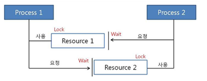

---
## 데드락(DeadLock)
### 정의

두 개 이상의 프로세스나 스레드가 서로 자원을 얻지 못해서 다음 처리를 하지 못하는 상태, 이에 무한히 다음 자원을 기다리게 되는 상태를 말한다.

위 사진처럼 서로 원하는 자원이 상대방에 할당되어 있어서 두 프로세스는 무한정 wait에 빠짐

### 발생 조건

발생 조건 4가지가 모두 성립해야 데드락이 발생한다.

1. 상호 배제 (Mutual exclusion)
	- 자원은 한 번에 한 프로세스만 사용할 수 있음
2. 점유 대기 (Hold and wait)
	- 최소한 하나의 자원을 점유하고 있으면서 다른 프로세스에 할당되어 사용하고 있는 자원을 추가로 점유하기 위해 대기하는 프로세스가 존재해야 함
3. 비선점 (No preemption)
	- 다른 프로세스에 할당된 자원은 사용이 끝날 때까지 강제로 빼앗을 수 없음
4. 순환 대기 (Circular wait)
		- 프로세스의 집합에서 순환 형태로 자원을 대기하고 있어야 함

---
## 해결 방법
### 예방 & 회피

1. 예방
	- 교착 상태 발생 조건 중 하나를 제거하면서 해결한다 (자원 낭비 엄청 심함)
		- 상호배제 부정 : 여러 프로세스가 공유 자원 사용
		- 점유대기 부정 : 프로세스 실행전 모든 자원을 할당
		- 비선점 부정 : 자원 점유 중인 프로세스가 다른 자원을 요구할 때 가진 자원 반납
		- 순환대기 부정 : 자원에 고유번호 할당 후 순서대로 자원 요구
2. 회피
	- 교착 상태 발생 시 피해나가는 방법
		- 은행원 알고리즘 (Banker's Algorithm)
		- 프로세스가 자원을 요구할 때, 시스템은 자원을 할당한 후에도 안정 상태로 남아있게 되는지 사전에 검사하여 교착상태 회피
		- 안정 상태면 자원 할당, 아니면 다른 프로세스들이 자원 해지까지 대기

### 탐지 & 회복

1. 탐지
	- 자원 할당 그래프를 통해 교착 상태를 탐지함 (이에 따른 오버헤드가 발생하긴 함)
2. 회복
	- 교착 상태 일으킨 프로세스를 종료하거나, 할당된 자원을 해제시켜 회복시키는 방법

---
## 레퍼런스

- https://gyoogle.dev/blog/computer-science/operating-system/DeadLock.html
